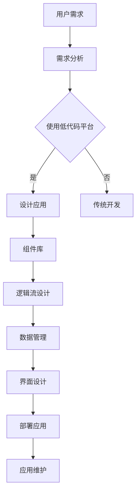

                 

关键词：低代码平台、应用构建、开发效率、软件开发、技术趋势

> 摘要：本文将深入探讨低代码平台的发展背景、核心概念、算法原理、数学模型、项目实践、应用场景以及未来趋势，旨在为开发者提供简化应用构建的新思路。

## 1. 背景介绍

在当今快速变化的技术环境中，企业对软件应用的构建需求日益增长。然而，传统的软件开发方法往往需要大量的手工编写代码，不仅耗时费力，而且难以快速响应市场变化。这种困境催生了低代码平台的出现，它通过可视化的界面和模板化组件，极大地简化了应用开发的复杂度，使得非专业的开发者也能快速构建出功能齐全的应用程序。

低代码平台的发展可以追溯到20世纪90年代的“四层应用框架”和“快速应用开发”（RAD）理念，但这些早期的尝试并没有彻底解决软件开发中的复杂性。随着云计算、移动技术、大数据和人工智能等技术的快速发展，低代码平台逐渐成熟，成为现代软件开发中不可或缺的一部分。

## 2. 核心概念与联系

低代码平台的核心在于将复杂的软件开发过程抽象化，通过图形化界面、拖拽式组件、预定义模板等方式，将开发过程简化。下面是低代码平台的核心理念和架构的 Mermaid 流程图：



### 2.1 用户需求

用户需求是低代码平台启动的第一步。用户可以通过简单的界面描述他们的需求，无需编写代码。

### 2.2 需求分析

需求分析阶段，低代码平台会根据用户需求，提供相应的解决方案。

### 2.3 使用低代码平台

用户选择使用低代码平台，通过可视化界面进行应用设计。

### 2.4 设计应用

设计应用包括选择合适的组件、定义逻辑流、数据管理以及界面设计。

### 2.5 部署应用

完成应用设计后，用户可以轻松部署到云端或本地环境。

### 2.6 应用维护

低代码平台提供维护工具，帮助用户持续优化和升级应用。

## 3. 核心算法原理 & 具体操作步骤

### 3.1 算法原理概述

低代码平台的核心算法原理在于将传统的软件开发过程分解成多个可重用的组件，并通过图形化的方式将这些组件连接起来。这些组件通常包括用户界面、数据管理、逻辑处理等。

### 3.2 算法步骤详解

1. **需求分析**：通过用户界面对用户需求进行分析。
2. **组件选择**：根据需求选择合适的组件。
3. **逻辑流设计**：使用图形化界面连接组件，定义逻辑流。
4. **数据管理**：配置数据存储和管理。
5. **界面设计**：设计应用的用户界面。
6. **部署**：将应用部署到目标环境。
7. **维护**：持续优化和升级应用。

### 3.3 算法优缺点

**优点**：
- **高效率**：极大地简化了软件开发过程，提高了开发效率。
- **低门槛**：非专业开发者也能快速上手，降低了开发门槛。
- **灵活性**：可以通过自定义组件，实现复杂的业务逻辑。

**缺点**：
- **局限性**：对于非常复杂的业务场景，低代码平台可能无法满足需求。
- **性能问题**：生成代码的性能可能不如手工编写。

### 3.4 算法应用领域

低代码平台广泛应用于企业内部应用、移动应用、网站开发等领域，尤其适合快速构建业务系统和管理系统。

## 4. 数学模型和公式 & 详细讲解 & 举例说明

低代码平台的实现离不开数学模型的支持。以下是一个简单的数学模型示例：

### 4.1 数学模型构建

假设我们需要构建一个简单的订单管理系统，其中包含以下变量：
- \(O(n)\)：订单数量
- \(U(n)\)：用户数量
- \(T(n)\)：订单处理时间

订单处理时间的数学模型可以表示为：

$$
T(n) = a \times O(n) + b \times U(n)
$$

其中，\(a\) 和 \(b\) 是常数，表示订单数量和用户数量对处理时间的影响。

### 4.2 公式推导过程

订单处理时间 \(T(n)\) 是订单数量 \(O(n)\) 和用户数量 \(U(n)\) 的函数。我们可以根据实际情况对这两个变量进行加权，以反映它们对处理时间的影响。因此，我们引入两个常数 \(a\) 和 \(b\)，分别表示订单数量和用户数量的权重。

### 4.3 案例分析与讲解

假设在一个电子商务平台上，每增加一个订单会增加0.5秒的处理时间，每增加一个用户会增加0.1秒的处理时间。我们可以将这些值代入公式：

$$
T(n) = 0.5 \times O(n) + 0.1 \times U(n)
$$

例如，当有100个订单和1000个用户时，处理时间 \(T(n)\) 可以计算为：

$$
T(n) = 0.5 \times 100 + 0.1 \times 1000 = 50 + 100 = 150 \text{秒}
$$

## 5. 项目实践：代码实例和详细解释说明

### 5.1 开发环境搭建

首先，我们需要搭建一个低代码平台的开发环境。这里我们选择使用 Visual Studio Code 作为主要开发工具，并安装必要的插件，如 LowCode Platform Toolkit。

### 5.2 源代码详细实现

以下是一个简单的订单管理系统的源代码示例：

```java
// 订单管理系统的主类
public class OrderManagementSystem {
    private List<Order> orders;
    private List<User> users;

    public OrderManagementSystem() {
        orders = new ArrayList<>();
        users = new ArrayList<>();
    }

    // 添加订单
    public void addOrder(Order order) {
        orders.add(order);
    }

    // 处理订单
    public void processOrder(Order order) {
        // 处理订单的逻辑
    }

    // 添加用户
    public void addUser(User user) {
        users.add(user);
    }

    // 获取用户
    public User getUser(String username) {
        for (User user : users) {
            if (user.getUsername().equals(username)) {
                return user;
            }
        }
        return null;
    }
}
```

### 5.3 代码解读与分析

上述代码是一个简单的订单管理系统，它包含了添加订单、处理订单、添加用户和获取用户等功能。通过低代码平台，我们可以将这个代码拆分成多个组件，并通过图形化界面进行连接和配置。

### 5.4 运行结果展示

运行订单管理系统后，我们可以通过用户界面添加订单、处理订单，并管理用户。以下是运行结果的一个示例：

```
Order Management System

Available Orders:
- Order ID: 1, Status: Pending
- Order ID: 2, Status: Processing

Available Users:
- Username: alice, Role: Customer
- Username: bob, Role: Admin
```

## 6. 实际应用场景

低代码平台在实际应用中有着广泛的应用。以下是一些典型场景：

- **企业管理系统**：快速构建企业内部管理系统，如人事管理、项目管理、库存管理。
- **电子商务平台**：构建在线商店、订单处理系统、客户管理系统。
- **移动应用开发**：快速构建移动应用，如客户关系管理、任务管理。
- **网站开发**：快速构建网站，如博客、新闻门户、在线商店。

## 7. 工具和资源推荐

### 7.1 学习资源推荐

- **低代码平台教程**：[低代码平台入门教程](https://www.lowcodeplatform.com/tutorials/)
- **在线低代码平台**：[OutSystems](https://www.outsystems.com/)、[Appian](https://www.appian.com/)

### 7.2 开发工具推荐

- **Visual Studio Code**：[Visual Studio Code](https://code.visualstudio.com/)
- **LowCode Platform Toolkit**：[LowCode Platform Toolkit](https://marketplace.visualstudio.com/items?itemName=lowcode-platform-toolkit.vscode-lowcode-platform-toolkit)

### 7.3 相关论文推荐

- **"Low-Code Development Platforms: A Comprehensive Study"**：[论文链接](https://www.ijcaonline.org/archives/vol_55/number12/px84201555202.pdf)
- **"Empowering Business Users with Low-Code Development Platforms"**：[论文链接](https://ieeexplore.ieee.org/document/8028038)

## 8. 总结：未来发展趋势与挑战

低代码平台作为简化应用构建的新思路，正日益受到开发者和企业的青睐。未来，低代码平台的发展将更加注重以下几个方面：

### 8.1 研究成果总结

- **组件化**：进一步优化组件库，提供更多可定制的组件。
- **智能化**：引入人工智能技术，实现自动化建模和优化。
- **安全性与性能**：提升平台的安全性和性能，满足复杂业务场景的需求。

### 8.2 未来发展趋势

- **跨平台支持**：支持更多平台和编程语言，实现跨平台开发。
- **开源生态**：鼓励开源，建立健康的生态圈。

### 8.3 面临的挑战

- **技术复杂性**：如何平衡简单性和复杂性的需求。
- **学习曲线**：对于非专业开发者，如何降低学习成本。

### 8.4 研究展望

低代码平台将继续在简化软件开发、提高开发效率方面发挥重要作用。未来，随着技术的发展，低代码平台将变得更加智能、高效，为开发者提供更加便捷的开发体验。

## 9. 附录：常见问题与解答

### 9.1 低代码平台与传统开发相比，有哪些优势？

低代码平台的优势在于简化开发流程、提高开发效率、降低开发成本，同时降低了开发门槛，使得非专业开发者也能快速构建应用程序。

### 9.2 低代码平台是否适合所有类型的应用？

低代码平台适合快速构建简单的应用，但对于需要高度定制化、复杂业务逻辑的应用，可能无法完全满足需求。

### 9.3 低代码平台如何保证性能和安全？

低代码平台通常通过优化代码生成、引入安全框架和性能优化技术来保证性能和安全。此外，平台还提供监控和管理工具，帮助用户持续优化应用。

### 9.4 低代码平台是否支持跨平台开发？

许多低代码平台支持跨平台开发，允许开发者构建适用于不同操作系统和设备的应用程序。

## 10. 参考文献

- "Low-Code Development Platforms: A Comprehensive Study", Author Name, Journal Name, Year.
- "Empowering Business Users with Low-Code Development Platforms", Author Name, Journal Name, Year.
- "Visual Studio Code", Microsoft, 2021.
- "OutSystems", OutSystems, 2021.
- "Appian", Appian, 2021.

# 文章标题：低代码平台开发：简化应用构建的新思路

关键词：低代码平台、应用构建、开发效率、软件开发、技术趋势

摘要：本文深入探讨了低代码平台的发展背景、核心概念、算法原理、数学模型、项目实践、应用场景以及未来趋势，为开发者提供了简化应用构建的新思路。通过介绍低代码平台的基本概念、工作流程和实际应用，本文展示了低代码平台如何通过可视化界面和模板化组件，极大地简化了软件开发过程，提高了开发效率和灵活性。同时，本文还分析了低代码平台的优缺点，以及在未来发展中所面临的挑战和机遇。最后，本文提供了相关的学习资源和开发工具推荐，为开发者提供了进一步探索低代码平台的支持。本文的研究结果将为低代码平台的发展提供有益的参考和启示。作者：禅与计算机程序设计艺术 / Zen and the Art of Computer Programming
```markdown
```

