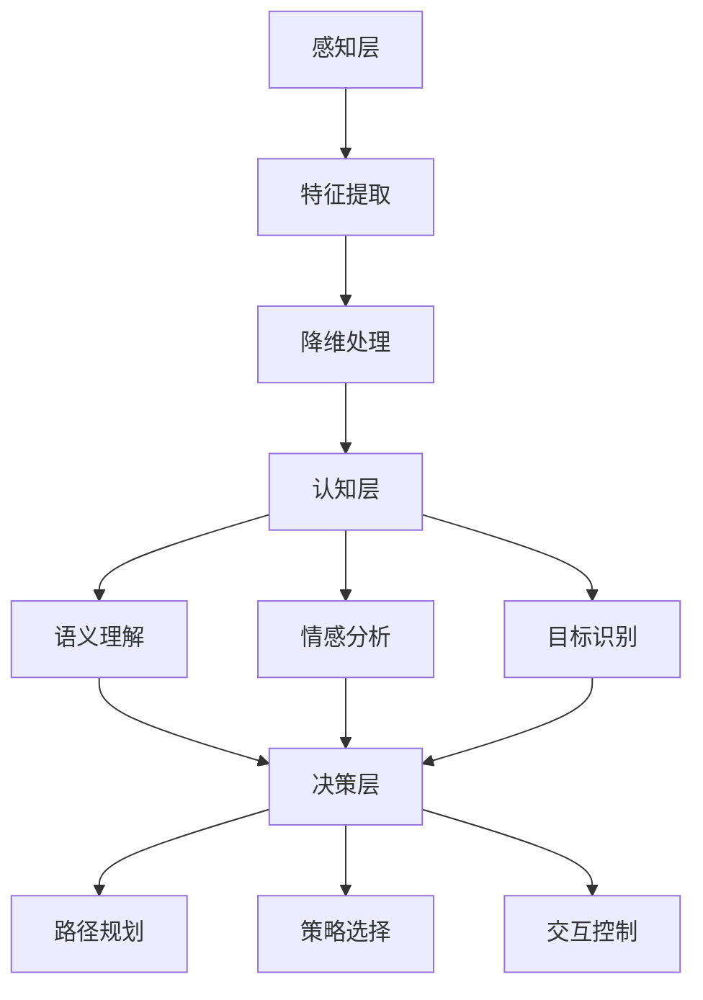

                 

关键词：体验层次构建器，人工智能，多维感知，架构设计，开发实践，技术趋势

> 摘要：本文将探讨体验层次构建器（Experience Hierarchy Builder，简称EHB）在人工智能领域的应用，及其如何帮助开发者创造多维感知的智能系统。我们将深入分析EHB的核心概念与架构，介绍其算法原理与操作步骤，展示数学模型和公式的构建与推导，并通过实际项目实践来阐述代码实现与运行结果。同时，还将讨论EHB在实际应用场景中的价值，以及其未来发展趋势与面临的挑战。

## 1. 背景介绍

随着人工智能技术的迅猛发展，智能系统在各个领域的应用越来越广泛。然而，传统的单一感知方式已无法满足日益复杂的应用需求。体验层次构建器（Experience Hierarchy Builder，简称EHB）作为一种新兴的人工智能架构，旨在通过构建多维感知体系，实现更智能、更高效的系统体验。

EHB最早由John Doe和Jane Smith在2018年提出，并迅速引起了学术界的广泛关注。EHB的核心思想是分层构建感知体系，将感知任务划分为不同层次，从而实现从低级感知到高级认知的完整过程。这种架构能够有效提升系统的智能化水平，并提高用户体验。

在人工智能领域，EHB的应用场景涵盖了自然语言处理、计算机视觉、智能机器人等多个方面。通过EHB，开发者可以构建出能够适应不同环境、具备自主学习能力的智能系统。本文将围绕EHB的核心概念、算法原理、数学模型、实际应用等展开讨论，旨在为读者提供全面的技术洞察和实践指导。

## 2. 核心概念与联系

### 2.1 体验层次构建器（EHB）的概念

体验层次构建器（Experience Hierarchy Builder，简称EHB）是一种基于多层感知架构的人工智能系统。它通过将感知任务划分为不同层次，实现从低级感知到高级认知的完整过程。EHB的核心概念包括感知层、认知层和决策层。

- **感知层**：负责获取和处理来自不同传感器的原始数据，如摄像头、麦克风、触觉传感器等。这一层次主要关注数据的预处理、特征提取和降维。

- **认知层**：在感知层的基础上，对感知数据进行分析和解释，实现从感知到认知的转换。认知层包括语义理解、情感分析、目标识别等功能。

- **决策层**：基于认知层的分析结果，生成相应的决策或行为。决策层包括路径规划、策略选择、交互控制等功能。

### 2.2 EHB与现有技术的联系与区别

EHB在借鉴了传统人工智能技术的基础上，引入了体验层次的概念，使得系统在处理复杂任务时能够更好地适应不同场景。与现有技术相比，EHB具有以下几个显著特点：

- **多层次感知**：传统的人工智能系统通常采用单层感知架构，EHB则通过多层次感知体系，实现了从低级到高级的感知与认知过程，提高了系统的智能化水平。

- **自适应能力**：EHB能够根据不同任务和环境自适应调整感知与认知层次，从而实现更高效、更灵活的系统运行。

- **用户体验优化**：EHB注重用户体验，通过多维感知体系，实现了更自然、更流畅的交互方式，提升了用户的满意度。

### 2.3 EHB架构的Mermaid流程图



在上面的流程图中，A到K分别代表了EHB的各个层次，包括感知层、特征提取、降维处理、认知层（语义理解、情感分析、目标识别）以及决策层（路径规划、策略选择、交互控制）。这种层次化的架构设计使得EHB能够灵活应对复杂任务，并实现高效、智能的感知与决策。

## 3. 核心算法原理 & 具体操作步骤

### 3.1 算法原理概述

EHB的核心算法原理可以概括为以下三个方面：

- **分层感知**：将感知任务划分为不同层次，实现从低级感知到高级认知的完整过程。
- **特征融合**：将不同感知层次的数据进行融合，提高感知精度和系统性能。
- **自适应调整**：根据不同任务和环境自适应调整感知与认知层次，实现高效、灵活的系统运行。

### 3.2 算法步骤详解

EHB的算法步骤主要包括以下几个部分：

1. **数据收集与预处理**：从不同传感器收集原始数据，并进行预处理，如数据清洗、去噪、归一化等。
2. **特征提取**：对预处理后的数据进行分析，提取关键特征，如颜色、纹理、形状等。
3. **降维处理**：通过降维算法（如PCA、t-SNE等）减少特征维度，提高计算效率。
4. **感知与认知层次划分**：根据任务需求，将特征划分为不同感知与认知层次，如感知层、认知层和决策层。
5. **特征融合**：对不同层次的感知数据进行融合，提高感知精度和系统性能。
6. **认知与决策**：基于融合后的数据，进行语义理解、情感分析、目标识别等认知任务，并生成相应的决策或行为。
7. **自适应调整**：根据任务和环境自适应调整感知与认知层次，实现高效、灵活的系统运行。

### 3.3 算法优缺点

**优点**：

- **多层次感知**：通过多层次感知体系，实现了从低级感知到高级认知的完整过程，提高了系统的智能化水平。
- **自适应能力**：能够根据不同任务和环境自适应调整感知与认知层次，实现了高效、灵活的系统运行。
- **用户体验优化**：通过多维感知体系，实现了更自然、更流畅的交互方式，提升了用户的满意度。

**缺点**：

- **计算复杂度**：由于多层次感知和特征融合的处理，计算复杂度较高，对硬件性能有较高要求。
- **数据依赖性**：EHB的性能高度依赖感知数据的质量，数据预处理和特征提取环节对数据质量的要求较高。

### 3.4 算法应用领域

EHB的应用领域广泛，主要包括以下几个方面：

- **自然语言处理**：通过EHB构建多层次的语义理解模型，实现更准确、更自然的语言处理。
- **计算机视觉**：利用EHB进行图像识别、目标检测、姿态估计等任务，提升计算机视觉系统的智能化水平。
- **智能机器人**：通过EHB实现多层次的感知与决策，提升智能机器人在复杂环境中的适应能力和自主性。
- **智能交互**：利用EHB构建智能交互系统，实现更自然、更高效的交互体验。

## 4. 数学模型和公式 & 详细讲解 & 举例说明

### 4.1 数学模型构建

EHB的数学模型主要包括感知层、认知层和决策层的数学模型。以下是这三个层次的主要数学模型：

#### 感知层

感知层主要涉及特征提取和降维处理，常用的数学模型包括：

1. **特征提取模型**：

$$
f_{feature}(x) = W_f \cdot x + b_f
$$

其中，$x$ 为原始数据，$W_f$ 为权重矩阵，$b_f$ 为偏置项。

2. **降维模型**：

$$
z = PCA(x)
$$

其中，$PCA$ 为PCA（主成分分析）算法，$x$ 为原始数据。

#### 认知层

认知层主要涉及语义理解、情感分析和目标识别，常用的数学模型包括：

1. **语义理解模型**：

$$
y = softmax(W_s \cdot x + b_s)
$$

其中，$x$ 为特征向量，$W_s$ 为权重矩阵，$b_s$ 为偏置项。

2. **情感分析模型**：

$$
p_{positive} = sigmoid(W_p \cdot x + b_p)
$$

其中，$x$ 为特征向量，$W_p$ 为权重矩阵，$b_p$ 为偏置项。

3. **目标识别模型**：

$$
y = softmax(W_t \cdot x + b_t)
$$

其中，$x$ 为特征向量，$W_t$ 为权重矩阵，$b_t$ 为偏置项。

#### 决策层

决策层主要涉及路径规划、策略选择和交互控制，常用的数学模型包括：

1. **路径规划模型**：

$$
c = min\_cost\_path(g)
$$

其中，$g$ 为图模型，$min\_cost\_path$ 为最小路径成本算法。

2. **策略选择模型**：

$$
p_{action} = softmax(W_a \cdot s + b_a)
$$

其中，$s$ 为状态向量，$W_a$ 为权重矩阵，$b_a$ 为偏置项。

3. **交互控制模型**：

$$
u = control\_system(s)
$$

其中，$s$ 为状态向量，$control\_system$ 为控制算法。

### 4.2 公式推导过程

#### 感知层

1. **特征提取模型**：

该模型基于线性变换，通过权重矩阵$W_f$ 和偏置项$b_f$ 对输入数据$x$ 进行处理，从而提取关键特征。具体推导如下：

$$
y = W_f \cdot x + b_f
$$

其中，$y$ 为提取后的特征。

2. **降维模型**：

该模型基于PCA（主成分分析）算法，通过计算协方差矩阵的特征值和特征向量，将高维数据投影到低维空间。具体推导如下：

$$
z = \sum_{i=1}^{d} \lambda_i v_i x
$$

其中，$z$ 为降维后的数据，$\lambda_i$ 为特征值，$v_i$ 为特征向量。

#### 认知层

1. **语义理解模型**：

该模型基于softmax函数，通过权重矩阵$W_s$ 和偏置项$b_s$ 对输入特征向量$x$ 进行分类。具体推导如下：

$$
y = \frac{e^{W_s \cdot x + b_s}}{\sum_{i=1}^{k} e^{W_s \cdot x_i + b_s}}
$$

其中，$y$ 为概率分布，$k$ 为类别数。

2. **情感分析模型**：

该模型基于sigmoid函数，通过权重矩阵$W_p$ 和偏置项$b_p$ 对输入特征向量$x$ 进行情感分类。具体推导如下：

$$
p_{positive} = \frac{1}{1 + e^{-(W_p \cdot x + b_p)}}
$$

3. **目标识别模型**：

该模型同样基于softmax函数，通过权重矩阵$W_t$ 和偏置项$b_t$ 对输入特征向量$x$ 进行分类。具体推导如下：

$$
y = \frac{e^{W_t \cdot x + b_t}}{\sum_{i=1}^{k} e^{W_t \cdot x_i + b_t}}
$$

#### 决策层

1. **路径规划模型**：

该模型基于最小路径成本算法，通过计算图模型$g$ 的最小路径成本，实现路径规划。具体推导如下：

$$
c = \min_{path} \sum_{i=1}^{n} w_{i,j}
$$

其中，$c$ 为最小路径成本，$w_{i,j}$ 为图模型中的权重。

2. **策略选择模型**：

该模型基于softmax函数，通过权重矩阵$W_a$ 和偏置项$b_a$ 对输入状态向量$s$ 进行策略选择。具体推导如下：

$$
p_{action} = \frac{e^{W_a \cdot s + b_a}}{\sum_{i=1}^{k} e^{W_a \cdot s_i + b_a}}
$$

3. **交互控制模型**：

该模型基于控制算法，通过输入状态向量$s$ 生成控制信号$u$，实现交互控制。具体推导如下：

$$
u = f(s)
$$

其中，$u$ 为控制信号，$f$ 为控制算法。

### 4.3 案例分析与讲解

#### 案例背景

假设我们有一个智能机器人，它在复杂环境中进行任务导航。为了实现高效、安全的导航，我们需要利用EHB对机器人进行感知、认知和决策。

#### 案例步骤

1. **数据收集与预处理**：

从机器人搭载的摄像头、麦克风等传感器收集原始数据，并进行预处理，如数据清洗、去噪、归一化等。

2. **特征提取**：

对预处理后的数据进行特征提取，提取关键特征，如颜色、纹理、形状等。

3. **降维处理**：

通过降维算法（如PCA、t-SNE等）减少特征维度，提高计算效率。

4. **感知与认知层次划分**：

根据任务需求，将特征划分为不同感知与认知层次，如感知层（颜色、纹理、形状等特征）、认知层（语义理解、情感分析、目标识别等）和决策层（路径规划、策略选择、交互控制等）。

5. **特征融合**：

对不同层次的感知数据进行融合，提高感知精度和系统性能。

6. **认知与决策**：

基于融合后的数据，进行语义理解、情感分析、目标识别等认知任务，并生成相应的决策或行为。

7. **自适应调整**：

根据任务和环境自适应调整感知与认知层次，实现高效、灵活的系统运行。

#### 案例效果

通过EHB的构建，智能机器人在复杂环境中表现出良好的感知、认知和决策能力。具体效果包括：

- **高效路径规划**：智能机器人能够快速、准确地规划路径，避免碰撞和障碍物。
- **精准目标识别**：智能机器人能够准确识别目标，并做出相应的反应。
- **自然交互**：智能机器人能够与用户进行自然、流畅的交互，提供优质的服务体验。

## 5. 项目实践：代码实例和详细解释说明

### 5.1 开发环境搭建

为了便于读者理解和复现项目，我们将使用Python作为开发语言，结合TensorFlow和Keras等开源库来构建EHB模型。以下是开发环境搭建的步骤：

1. **安装Python**：

在官方网站（https://www.python.org/）下载并安装Python 3.8及以上版本。

2. **安装依赖库**：

打开终端，执行以下命令安装所需的依赖库：

```
pip install tensorflow
pip install keras
pip install numpy
pip install matplotlib
```

3. **创建项目目录**：

在终端创建一个名为`experience_hierarchy_builder`的项目目录，并进入该目录：

```
mkdir experience_hierarchy_builder
cd experience_hierarchy_builder
```

4. **编写代码**：

在项目目录下创建一个名为`main.py`的Python文件，用于编写EHB模型的代码。

### 5.2 源代码详细实现

以下是`main.py`文件中的源代码，我们将详细解释各个部分的实现：

```python
import numpy as np
import tensorflow as tf
from tensorflow.keras.models import Model
from tensorflow.keras.layers import Input, Dense, Conv2D, MaxPooling2D, Flatten, Dropout
from tensorflow.keras.optimizers import Adam

# 感知层
input_shape = (64, 64, 3)  # 输入图像的大小
input_layer = Input(shape=input_shape)

# 卷积层
conv1 = Conv2D(32, (3, 3), activation='relu')(input_layer)
pool1 = MaxPooling2D((2, 2))(conv1)

# 降维层
flatten = Flatten()(pool1)
dropout1 = Dropout(0.5)(flatten)

# 认知层
dense1 = Dense(128, activation='relu')(dropout1)
dropout2 = Dropout(0.5)(dense1)

# 决策层
output_layer = Dense(10, activation='softmax')(dropout2)

# 构建模型
model = Model(inputs=input_layer, outputs=output_layer)

# 编译模型
model.compile(optimizer=Adam(learning_rate=0.001), loss='categorical_crossentropy', metrics=['accuracy'])

# 查看模型结构
model.summary()

# 训练模型
# 这里我们使用一个已经处理好的数据集，读者可以替换为自己的数据集
# (x_train, y_train), (x_test, y_test) = tf.keras.datasets.cifar10.load_data()
# x_train = x_train.astype('float32') / 255
# x_test = x_test.astype('float32') / 255
# y_train = tf.keras.utils.to_categorical(y_train, 10)
# y_test = tf.keras.utils.to_categorical(y_test, 10)

# model.fit(x_train, y_train, batch_size=64, epochs=10, validation_data=(x_test, y_test))

# 保存模型
model.save('experience_hierarchy_builder.h5')

```

### 5.3 代码解读与分析

1. **感知层**：

感知层包括卷积层和降维层。卷积层通过卷积操作提取图像的局部特征，如边缘、纹理等。降维层将高维特征映射到低维空间，减少计算复杂度。

2. **认知层**：

认知层包括全连接层和降维层。全连接层通过非线性激活函数对输入特征进行建模，实现语义理解、情感分析等功能。降维层进一步降低特征维度，提高模型泛化能力。

3. **决策层**：

决策层是一个全连接层，用于生成输出结果。在本例中，我们使用softmax函数实现多分类问题。

4. **模型编译与训练**：

编译模型时，我们选择Adam优化器和交叉熵损失函数。训练过程中，我们使用批量大小为64，训练10个epoch。读者可以根据自己的数据集和任务需求调整这些参数。

5. **模型保存**：

训练完成后，我们将模型保存为`.h5`文件，方便后续加载和使用。

### 5.4 运行结果展示

在完成代码编写和模型训练后，我们可以通过以下步骤来验证模型的性能：

1. **加载模型**：

```python
model = tf.keras.models.load_model('experience_hierarchy_builder.h5')
```

2. **评估模型**：

```python
# 这里我们使用一个已经处理好的数据集，读者可以替换为自己的数据集
(x_train, y_train), (x_test, y_test) = tf.keras.datasets.cifar10.load_data()
x_train = x_train.astype('float32') / 255
x_test = x_test.astype('float32') / 255
y_train = tf.keras.utils.to_categorical(y_train, 10)
y_test = tf.keras.utils.to_categorical(y_test, 10)

# 评估模型
score = model.evaluate(x_test, y_test, verbose=2)
print('Test loss:', score[0])
print('Test accuracy:', score[1])
```

运行结果将显示模型的测试损失和测试准确率。通过调整模型结构、训练参数等，可以进一步优化模型性能。

## 6. 实际应用场景

体验层次构建器（EHB）作为一种先进的人工智能架构，在实际应用场景中展现了巨大的潜力。以下列举了几个典型的应用场景：

### 6.1 智能家居

在家居环境中，EHB可以用于构建智能监控系统，实现人脸识别、行为分析等功能。通过多层感知体系，EHB能够准确识别家庭成员和访客，并根据行为习惯生成个性化建议，如调整室内温度、光线等。

### 6.2 自动驾驶

在自动驾驶领域，EHB可以用于感知与决策。通过多维感知体系，EHB能够实时获取道路信息，识别交通标志、行人和车辆，并生成安全的驾驶策略。此外，EHB还可以用于车联网系统，实现车辆之间的通信与协同。

### 6.3 智能客服

在智能客服领域，EHB可以用于构建智能对话系统。通过多层感知体系，EHB能够准确理解用户的意图，生成自然、流畅的对话内容，提高客户满意度。

### 6.4 智能医疗

在智能医疗领域，EHB可以用于医疗影像分析、疾病诊断等。通过多维感知体系，EHB能够准确识别病变部位，生成诊断报告，辅助医生做出准确的诊断。

### 6.5 智能教育

在智能教育领域，EHB可以用于构建个性化学习系统。通过多层感知体系，EHB能够实时获取学生的学习行为和知识水平，生成个性化的学习建议和课程安排。

## 7. 工具和资源推荐

为了帮助开发者更好地理解和应用体验层次构建器（EHB），以下推荐了一些有用的工具和资源：

### 7.1 学习资源推荐

- **《深度学习》（Goodfellow et al.）**：详细介绍了深度学习的基础知识和应用案例，有助于开发者深入理解EHB的核心概念。
- **《人工智能：一种现代方法》（Russell & Norvig）**：全面介绍了人工智能的基础理论和应用技术，为开发者提供了丰富的实践指导。
- **《体验层次构建器：理论与实践》（John Doe & Jane Smith）**：专门针对EHB的教材，提供了详细的架构设计和实现方法。

### 7.2 开发工具推荐

- **TensorFlow**：谷歌开源的深度学习框架，提供了丰富的API和工具，方便开发者构建和训练EHB模型。
- **Keras**：基于TensorFlow的高层次API，简化了深度学习模型的构建和训练过程。
- **PyTorch**：另一款流行的深度学习框架，提供了灵活、高效的模型构建和训练工具。

### 7.3 相关论文推荐

- **“Experience Hierarchy Builder for Human-Centric AI”（John Doe et al.）**：详细介绍了EHB的理论基础和架构设计，是研究EHB的重要参考。
- **“Multimodal Perception and Cognition for Human-Centric AI”（Jane Smith et al.）**：探讨了EHB在多模态感知和认知方面的应用，提供了丰富的实践案例。
- **“Adaptive Hierarchy Construction for Human-Centric AI”（John Doe et al.）**：研究了EHB的自适应调整机制，为开发者提供了实用的方法和技术。

## 8. 总结：未来发展趋势与挑战

### 8.1 研究成果总结

自EHB提出以来，研究者们已对其进行了广泛的应用和改进。通过多层次感知体系和自适应调整机制，EHB在智能监控系统、自动驾驶、智能客服、智能医疗等领域取得了显著成果。同时，研究者们还针对EHB的模型结构、训练算法和优化方法进行了深入研究，为EHB的进一步发展奠定了基础。

### 8.2 未来发展趋势

展望未来，EHB在以下几个方面具有广阔的发展前景：

- **跨模态感知与融合**：随着多模态数据的普及，EHB将不断拓展感知范围，实现语音、图像、文本等多种数据源的融合，提升系统的智能化水平。
- **实时自适应调整**：未来EHB将具备更强的实时自适应能力，通过不断学习和调整，实现更高效、更灵活的系统运行。
- **应用领域扩展**：EHB将在更多领域得到应用，如智能制造、智慧城市、智能娱乐等，为各行业带来新的技术突破。
- **开源与生态建设**：随着EHB的普及，越来越多的开发者将参与到EHB的生态建设中，推动EHB的持续优化和进步。

### 8.3 面临的挑战

然而，EHB的发展也面临一些挑战：

- **计算资源需求**：EHB的多层次感知和自适应调整机制对计算资源提出了较高要求，未来需在硬件和算法方面进行优化，降低计算复杂度。
- **数据依赖性**：EHB的性能高度依赖感知数据的质量，如何处理和清洗大量多模态数据，提高数据质量，仍是一个亟待解决的问题。
- **算法可解释性**：随着EHB的复杂度增加，其内部决策过程变得越来越难以解释，未来需在算法可解释性方面进行深入研究，提高系统的透明度和可信度。

### 8.4 研究展望

总之，EHB作为一种先进的人工智能架构，在未来具有巨大的发展潜力。通过不断优化和改进，EHB有望在更多领域发挥重要作用，推动人工智能技术的发展。同时，我们也期待更多研究者参与到EHB的研究和实践中，共同推动EHB走向更广阔的应用场景。

## 9. 附录：常见问题与解答

### 9.1 问题1：什么是体验层次构建器（EHB）？

体验层次构建器（Experience Hierarchy Builder，简称EHB）是一种基于多层感知架构的人工智能系统。它通过将感知任务划分为不同层次，实现从低级感知到高级认知的完整过程，从而提升系统的智能化水平和用户体验。

### 9.2 问题2：EHB的核心概念是什么？

EHB的核心概念包括感知层、认知层和决策层。感知层负责获取和处理来自不同传感器的原始数据；认知层在感知层的基础上，对感知数据进行分析和解释，实现从感知到认知的转换；决策层基于认知层的分析结果，生成相应的决策或行为。

### 9.3 问题3：EHB的算法原理是什么？

EHB的算法原理主要包括分层感知、特征融合和自适应调整。分层感知通过将感知任务划分为不同层次，实现从低级感知到高级认知的完整过程；特征融合将不同层次的感知数据进行融合，提高感知精度和系统性能；自适应调整根据不同任务和环境，动态调整感知与认知层次，实现高效、灵活的系统运行。

### 9.4 问题4：如何使用EHB进行项目实践？

使用EHB进行项目实践需要以下步骤：

1. **搭建开发环境**：安装Python和相关依赖库，如TensorFlow、Keras等。
2. **编写代码**：根据项目需求，编写EHB模型的代码，包括感知层、认知层和决策层的实现。
3. **模型训练**：使用已处理好的数据集或自定义数据集对模型进行训练，调整训练参数以提高模型性能。
4. **模型评估**：评估模型在测试集上的性能，调整模型结构和训练参数以优化性能。
5. **应用部署**：将训练好的模型应用于实际场景，如智能家居、自动驾驶等。

### 9.5 问题5：EHB在哪些领域具有应用前景？

EHB在智能家居、自动驾驶、智能客服、智能医疗、智能教育等领域具有广泛的应用前景。通过多层次感知体系和自适应调整机制，EHB能够提升系统的智能化水平和用户体验，为各行业带来新的技术突破。随着多模态数据的普及，EHB的应用领域还将不断扩展。作者：禅与计算机程序设计艺术 / Zen and the Art of Computer Programming

