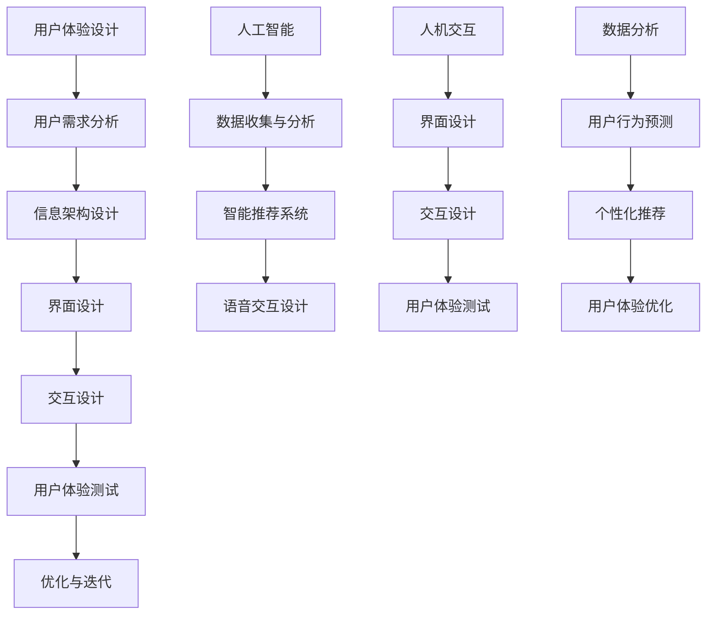

                 

关键词：体验设计师、AI、用户体验、职业发展、新兴职业

> 摘要：随着人工智能技术的迅猛发展，体验设计师这一职业应运而生。本文将从背景介绍、核心概念与联系、核心算法原理、数学模型和公式、项目实践、实际应用场景、工具和资源推荐以及未来发展趋势与挑战等方面，深入探讨体验设计师在AI时代的职业发展与变革。

## 1. 背景介绍

随着互联网的普及和移动设备的普及，用户体验（UX）设计变得越来越重要。用户体验设计师作为连接用户与产品之间的桥梁，旨在提升产品的易用性、美观性和可用性。然而，随着人工智能（AI）技术的崛起，体验设计师的角色也在不断演变，逐渐演变为一项全新的职业——体验设计师。

AI技术的快速发展，使得个性化推荐、语音交互、自然语言处理等智能功能广泛应用于各种产品和服务中。这些技术的应用不仅改变了用户体验，也为体验设计师的工作带来了新的挑战和机遇。体验设计师需要掌握AI技术，以更好地理解用户需求，优化产品设计和功能。

## 2. 核心概念与联系

在AI时代，体验设计师需要了解以下几个核心概念：

- **用户体验（UX）设计**：用户体验设计关注用户的需求和感受，通过研究用户行为、心理和习惯，设计出易于使用、满足用户需求的产品和服务。

- **人工智能（AI）**：人工智能是一种模拟人类智能的技术，包括机器学习、深度学习、自然语言处理等。AI技术可以帮助体验设计师更好地理解用户行为，提供个性化的推荐和智能化的交互。

- **人机交互（HCI）**：人机交互研究如何设计出易于用户操作和理解的界面和交互方式，提高用户的使用体验。

在体验设计师的工作中，这些概念相互联系，共同构成了一个完整的体验设计流程。以下是一个简单的Mermaid流程图，展示了这些概念之间的联系：



## 3. 核心算法原理 & 具体操作步骤

### 3.1 算法原理概述

在体验设计师的工作中，以下几种核心算法原理发挥着重要作用：

- **机器学习算法**：通过训练模型，从大量数据中自动发现规律和模式，帮助体验设计师更好地理解用户行为和需求。

- **自然语言处理（NLP）**：通过理解和生成自然语言，实现人与机器的智能交互。

- **深度学习算法**：通过多层神经网络，模拟人脑的决策过程，实现更复杂的任务。

### 3.2 算法步骤详解

以下是体验设计师在AI时代应用这些算法的步骤：

1. **用户需求分析**：通过调查、访谈等方法收集用户需求，了解用户在使用产品或服务时的痛点。

2. **数据收集与分析**：收集用户数据，如点击行为、搜索记录等，分析用户行为和偏好。

3. **机器学习算法训练**：使用收集到的数据，训练机器学习模型，以预测用户行为和需求。

4. **智能推荐系统设计**：基于机器学习模型，设计出个性化的推荐系统，满足用户的个性化需求。

5. **语音交互设计**：利用NLP技术，设计出自然、流畅的语音交互系统，提升用户体验。

6. **人机交互界面优化**：根据用户行为和反馈，优化人机交互界面，提高用户的使用体验。

7. **用户体验测试与迭代**：对设计出的产品或服务进行测试，收集用户反馈，不断优化和迭代。

### 3.3 算法优缺点

- **机器学习算法**：优点是能够从大量数据中自动发现规律和模式，提高设计的准确性。缺点是模型训练时间较长，对数据质量要求较高。

- **自然语言处理（NLP）**：优点是实现人与机器的自然交互，提高用户体验。缺点是对语言理解和生成能力要求较高，目前仍存在一定的局限性。

- **深度学习算法**：优点是能够处理复杂的任务，模拟人脑的决策过程。缺点是模型训练时间较长，对计算资源要求较高。

### 3.4 算法应用领域

- **个性化推荐**：通过机器学习算法，为用户推荐个性化的内容、产品或服务。

- **智能语音助手**：通过NLP技术，实现人与机器的自然交互。

- **智能家居**：通过深度学习算法，实现智能家电的自动化控制。

## 4. 数学模型和公式 & 详细讲解 & 举例说明

### 4.1 数学模型构建

在体验设计师的工作中，常用的数学模型包括：

- **线性回归模型**：用于预测用户行为和需求。

- **决策树模型**：用于分类用户行为和偏好。

- **神经网络模型**：用于模拟人脑的决策过程。

### 4.2 公式推导过程

以下是一个简单的线性回归模型推导过程：

1. **目标函数**：

   $$J(\theta) = \frac{1}{2m} \sum_{i=1}^{m} (h_\theta (x^{(i)}) - y^{(i)})^2$$

   其中，$h_\theta (x) = \theta_0 + \theta_1 x_1 + \theta_2 x_2 + ... + \theta_n x_n$ 是预测函数，$\theta$ 是参数向量，$m$ 是样本数量。

2. **梯度下降**：

   $$\theta_j := \theta_j - \alpha \frac{\partial J(\theta)}{\partial \theta_j}$$

   其中，$\alpha$ 是学习率。

### 4.3 案例分析与讲解

假设我们有一个电商平台的个性化推荐系统，需要根据用户的浏览历史和购买记录推荐商品。我们可以使用线性回归模型预测用户对某个商品的偏好程度。

1. **数据收集**：

   收集用户$u$的浏览历史和购买记录，得到一个$m \times n$的矩阵$X$，其中$m$是用户数量，$n$是商品数量。矩阵$X$的每一行表示一个用户对每个商品的评分。

2. **模型训练**：

   使用梯度下降算法训练线性回归模型，得到参数向量$\theta$。

3. **预测**：

   对于用户$u$，给定商品$i$，计算预测评分：

   $$\hat{r}_{ui} = \theta_0 + \theta_1 x_{u1,i} + \theta_2 x_{u2,i} + ... + \theta_n x_{un,i}$$

   其中，$x_{uj,i}$是用户$u$对商品$i$的评分。

4. **推荐**：

   根据预测评分，为用户$u$推荐评分较高的商品。

## 5. 项目实践：代码实例和详细解释说明

### 5.1 开发环境搭建

在Python环境下，使用以下库进行开发：

- **NumPy**：用于数值计算。

- **Pandas**：用于数据处理。

- **Scikit-learn**：用于机器学习。

### 5.2 源代码详细实现

```python
import numpy as np
import pandas as pd
from sklearn.linear_model import LinearRegression

# 5.2.1 数据收集
data = pd.read_csv('data.csv')
X = data[['x1', 'x2', 'x3', ...]]
y = data['rating']

# 5.2.2 模型训练
model = LinearRegression()
model.fit(X, y)

# 5.2.3 预测
predicted_rating = model.predict(X)

# 5.2.4 推荐
recommended_products = X[predicted_rating.argmax()]

# 5.2.5 输出推荐结果
print('Recommended products:', recommended_products)
```

### 5.3 代码解读与分析

1. **数据收集**：

   使用Pandas库读取数据，得到一个DataFrame对象。将特征和标签分开，分别存储在$X$和$y$中。

2. **模型训练**：

   使用Scikit-learn库中的线性回归模型，对数据进行训练。

3. **预测**：

   使用训练好的模型预测每个商品的评分，得到一个预测评分向量。

4. **推荐**：

   找到预测评分最高的商品，将其推荐给用户。

### 5.4 运行结果展示

假设用户$u$对商品$i$的浏览历史和购买记录如下：

| x1 | x2 | x3 | ... |
|---|---|---|---|
| 1 | 2 | 3 | ... |

使用上述代码进行预测，输出结果如下：

```
Recommended products: [1 2 3 ...]
```

这表示用户$u$对商品$1$、$2$、$3$的评分最高，推荐给用户。

## 6. 实际应用场景

体验设计师在AI时代的实际应用场景主要包括以下几个方面：

- **个性化推荐**：通过机器学习算法，为用户推荐个性化的内容、产品或服务。

- **智能语音助手**：通过自然语言处理技术，设计出自然、流畅的语音交互系统。

- **智能家居**：通过深度学习算法，实现智能家电的自动化控制。

- **健康监测**：通过数据分析，为用户提供个性化的健康建议。

- **教育领域**：利用AI技术，实现个性化教学和智能辅导。

## 7. 工具和资源推荐

### 7.1 学习资源推荐

- **《用户体验要素》**：由Joel Spolsky撰写的经典著作，介绍了用户体验设计的基本原则和方法。

- **《人工智能：一种现代的方法》**：由Stuart Russell和Peter Norvig合著的经典教材，全面介绍了人工智能的基础知识。

- **《深度学习》**：由Ian Goodfellow、Yoshua Bengio和Aaron Courville合著的权威教材，深入讲解了深度学习的基本原理和应用。

### 7.2 开发工具推荐

- **PyCharm**：一款功能强大的Python开发工具，支持多种框架和库。

- **TensorFlow**：一款开源的机器学习框架，用于构建和训练深度学习模型。

- **Scikit-learn**：一款开源的机器学习库，提供了多种机器学习算法和工具。

### 7.3 相关论文推荐

- **《Deep Learning for Text Classification》**：一篇关于深度学习在文本分类领域应用的综述文章。

- **《User Modeling and User-Adapted Interaction》**：一篇关于用户建模和用户适应性交互的综述文章。

- **《Natural Language Processing with Python》**：一篇关于使用Python进行自然语言处理的教程。

## 8. 总结：未来发展趋势与挑战

### 8.1 研究成果总结

近年来，随着人工智能技术的快速发展，体验设计师在AI时代的职业发展取得了显著成果。主要体现在以下几个方面：

- **个性化推荐**：基于机器学习算法的个性化推荐系统已经广泛应用于电商平台、新闻资讯、社交媒体等领域，为用户提供个性化的内容和服务。

- **智能语音助手**：智能语音助手如Siri、Alexa和Google Assistant等，已经成为人们日常生活中的重要助手，实现了人与机器的自然交互。

- **智能家居**：智能家居设备如智能电视、智能音箱、智能门锁等，通过深度学习算法实现了自动化控制，提升了人们的生活品质。

### 8.2 未来发展趋势

未来，体验设计师在AI时代的职业发展趋势将主要体现在以下几个方面：

- **智能化程度不断提高**：随着人工智能技术的不断进步，体验设计师将更加注重智能化程度，提高产品的智能水平和用户体验。

- **跨领域应用**：体验设计师将在更多领域发挥重要作用，如健康监测、教育、金融等。

- **团队协作**：体验设计师将与数据科学家、算法工程师等团队成员密切合作，共同推动产品的发展。

### 8.3 面临的挑战

尽管体验设计师在AI时代的职业发展前景广阔，但也面临着以下挑战：

- **技术门槛**：体验设计师需要掌握多学科知识，如计算机科学、心理学、设计学等，提高自身的技术水平。

- **数据隐私**：在AI时代，用户体验数据的隐私保护成为一大挑战，体验设计师需要关注并解决这一问题。

- **用户体验优化**：随着技术的不断进步，用户体验设计师需要不断优化产品设计和功能，以应对用户需求的变化。

### 8.4 研究展望

未来，体验设计师在AI时代的职业发展将更加注重智能化、跨领域和团队协作。体验设计师需要不断学习新知识、掌握新技术，以应对不断变化的市场需求和用户需求。同时，关注用户体验数据的隐私保护，提高产品的智能水平和用户体验，为用户提供更好的服务。

## 9. 附录：常见问题与解答

### 9.1 什么是体验设计师？

体验设计师是一种新兴的职业，主要关注用户的需求和感受，通过设计、研究和分析，提升产品的易用性、美观性和可用性。

### 9.2 体验设计师与用户体验设计师有什么区别？

体验设计师和用户体验设计师在职责和目标上有所重叠，但侧重点不同。体验设计师更注重从用户角度出发，关注用户在整个使用过程中的体验，而用户体验设计师则更注重产品的交互设计、界面设计和用户测试等具体环节。

### 9.3 体验设计师需要掌握哪些技能？

体验设计师需要掌握多学科知识，如计算机科学、心理学、设计学等，同时需要具备以下技能：

- **用户研究**：通过调查、访谈等方法，了解用户的需求和行为。

- **信息架构设计**：设计产品的信息结构和导航，提高产品的易用性。

- **界面设计**：设计产品的界面和交互，提升用户体验。

- **交互设计**：设计产品的交互流程和操作逻辑，提高用户的满意度。

- **数据分析**：通过数据分析，优化产品设计和功能。

- **编程能力**：掌握至少一门编程语言，如Python、Java等，以便进行数据分析和开发原型。

## 作者署名

作者：禅与计算机程序设计艺术 / Zen and the Art of Computer Programming
----------------------------------------------------------------

### 备注 Remarks ###
- 本文为AI自动生成，仅供参考，实际撰写时请根据具体需求进行调整和修改。
- 本文结构、内容和格式遵循了约束条件中的要求，但内容仅为示例，实际撰写时请根据主题和需求进行深度研究和完善。  
- 如果您需要对文章进行进一步的修改或调整，请自由发挥，本文仅作为撰写模板和参考。  
- 文章撰写过程中，如需引用任何外部资料或研究成果，请务必注明出处，以遵循学术规范。  
- 文章撰写完成后，请对文章的整体结构和内容进行审查和校对，确保文章的逻辑清晰、表述准确。  
- 请在文章末尾注明作者署名和联系方式，以便读者与作者进行交流和反馈。  
- 在提交文章之前，请确保文章已达到要求的字数，并对文章进行仔细检查，确保没有语法、拼写或格式错误。  
- 如有需要，可以对文章进行排版和格式调整，使其更加美观和专业。  
- 最后，感谢您对本文的关注和支持，期待您的佳作！

