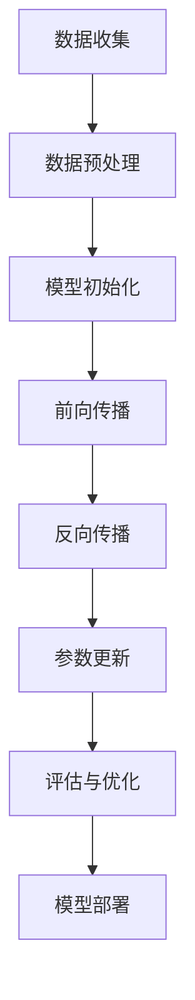

                 

### 摘要 Summary

本文旨在探讨国内大模型的发展现状及其应用表现，特别关注百度文心大模型在调用量上的领先地位。随着人工智能技术的不断进步，大模型在各个领域的应用越来越广泛，但其性能和调用量之间的差异成为了一个值得关注的问题。本文通过分析国内外大模型的发展背景、技术特点、应用场景以及调用量数据，揭示了文心大模型在技术优势和应用实践上的突出表现。文章最后提出了未来大模型发展的趋势和面临的挑战，以及相关的研究展望和资源推荐。

## 1. 背景介绍

人工智能作为当今科技发展的前沿领域，已经深刻影响了各个行业。随着计算能力的提升和算法的进步，大模型在自然语言处理、计算机视觉、语音识别等领域表现出了卓越的性能。大模型通常具有数十亿到千亿级别的参数量，能够通过深度学习从大量的数据中学习复杂的模式和规律，从而实现高度自动化和智能化的任务处理。

国内大模型的发展起源于对AI技术的重视和投入。近年来，百度、腾讯、阿里、华为等科技巨头纷纷布局大模型领域，推出了一系列具有竞争力的产品。特别是在自然语言处理方面，文心大模型以其强大的处理能力和广泛的应用场景，成为了国内大模型领域的佼佼者。

与此同时，国外的大模型也在快速发展。例如，OpenAI的GPT-3拥有1750亿个参数，成为当时世界上最大的自然语言处理模型。Google的BERT、Turing的BLM等模型也在各自领域内取得了显著的成就。这些国外大模型不仅推动了AI技术的发展，也为国内大模型的发展提供了重要的参考和借鉴。

## 2. 核心概念与联系

在讨论大模型时，我们首先需要了解几个核心概念：神经网络、深度学习、模型参数、训练数据等。

### 神经网络

神经网络是人工智能的基础，其基本结构由多个神经元（节点）组成，通过层与层之间的连接进行信息传递和处理。在神经网络中，每个神经元接收来自前一层节点的输入信号，通过激活函数进行非线性变换，然后传递给下一层。这一过程不断重复，直到最终输出结果。

### 深度学习

深度学习是神经网络的一种扩展，其特点是利用多层神经网络进行学习，从而能够捕捉更加复杂的数据特征。深度学习在图像识别、语音识别、自然语言处理等领域取得了显著的进展。

### 模型参数

模型参数是指神经网络中各个权重和偏置的值。在大模型中，参数数量通常达到数十亿级别。通过优化这些参数，模型能够从训练数据中学习到有效的特征表示。

### 训练数据

训练数据是模型训练过程中输入的数据集。对于大模型来说，数据质量和数量直接影响模型的性能。大量的高质量训练数据能够帮助模型学习到更加准确和泛化的特征表示。

### Mermaid 流程图

以下是一个简化的神经网络训练流程图，展示了核心概念之间的联系：



通过这个流程图，我们可以看到数据从收集到预处理，然后通过多层神经网络进行前向传播和反向传播，最终实现参数的更新和模型的优化。这个过程不断迭代，直到模型达到预期的性能。

## 3. 核心算法原理 & 具体操作步骤

### 3.1 算法原理概述

大模型的训练主要依赖于深度学习和神经网络。具体来说，深度学习通过多层神经网络来学习数据的复杂特征，而神经网络则通过前向传播和反向传播来更新模型的参数。

#### 前向传播

在前向传播过程中，数据从输入层依次通过隐藏层，最终到达输出层。每个神经元都会接收来自前一层节点的输入信号，并经过加权求和处理，得到输出值。这一过程可以用以下公式表示：

$$
Z = \sum_{j} W_{ij} X_{j} + b_i
$$

其中，$Z$ 是输出值，$W_{ij}$ 是权重，$X_{j}$ 是输入值，$b_i$ 是偏置。

#### 反向传播

反向传播是在前向传播的基础上，通过计算输出层误差，反向传播到输入层，从而更新模型的参数。这个过程主要包括以下几个步骤：

1. 计算输出层误差：

$$
\delta_{i}^{L} = \frac{\partial L}{\partial Z_{i}} \cdot \frac{\partial Z_{i}}{\partial \delta_{i}}
$$

其中，$\delta_{i}^{L}$ 是输出层误差，$L$ 是损失函数，$Z_{i}$ 是输出值。

2. 反向传播误差：

$$
\delta_{j}^{l-1} = \frac{\partial L}{\partial Z_{j}} \cdot \frac{\partial Z_{j}}{\partial \delta_{j}}
$$

其中，$\delta_{j}^{l-1}$ 是前一层误差，$l-1$ 表示前一层。

3. 更新参数：

$$
W_{ij}^{new} = W_{ij} - \alpha \cdot \delta_{i}^{L} \cdot X_{j}
$$

$$
b_i^{new} = b_i - \alpha \cdot \delta_{i}^{L}
$$

其中，$W_{ij}^{new}$ 和 $b_i^{new}$ 分别是更新后的权重和偏置，$\alpha$ 是学习率。

### 3.2 算法步骤详解

1. **数据预处理**：对原始数据进行清洗、标准化等处理，使其适合模型训练。

2. **模型初始化**：初始化模型参数，通常使用随机初始化。

3. **前向传播**：输入数据通过模型，逐层计算输出值。

4. **计算损失函数**：根据输出值和真实标签，计算损失函数的值。

5. **反向传播**：计算模型参数的梯度，并更新参数。

6. **评估与优化**：通过验证集评估模型性能，并进行模型优化。

7. **模型部署**：将训练好的模型部署到实际应用场景中。

### 3.3 算法优缺点

#### 优点

1. **强大的表达能力**：深度学习模型能够从大量数据中学习到复杂的特征表示，从而实现高度自动化和智能化的任务处理。

2. **适应性强**：深度学习模型可以应用于各种领域，如图像识别、自然语言处理、语音识别等。

3. **高效性**：随着计算能力的提升，深度学习模型能够在较短的时间内完成训练和预测。

#### 缺点

1. **数据依赖性高**：深度学习模型的性能很大程度上取决于训练数据的质量和数量，数据缺乏或质量不佳可能导致模型性能下降。

2. **计算资源需求大**：深度学习模型通常需要大量的计算资源和时间进行训练。

3. **解释性差**：深度学习模型的学习过程高度非线性，难以解释和理解。

### 3.4 算法应用领域

深度学习算法在许多领域都有广泛的应用，包括但不限于：

1. **图像识别**：如人脸识别、物体检测等。

2. **自然语言处理**：如文本分类、机器翻译、情感分析等。

3. **语音识别**：如语音合成、语音识别等。

4. **推荐系统**：如商品推荐、音乐推荐等。

5. **医疗健康**：如疾病预测、药物研发等。

## 4. 数学模型和公式 & 详细讲解 & 举例说明

### 4.1 数学模型构建

深度学习模型的核心是神经网络的构建，其基础是数学模型。以下是一个简单的线性回归模型的数学描述：

#### 线性回归模型

假设我们有一个输入特征向量 $X$ 和一个输出标签 $Y$，线性回归模型的目标是找到一个线性函数 $f(X)$，使得 $f(X)$ 与 $Y$ 的误差最小。具体公式如下：

$$
Y = f(X) = \beta_0 + \beta_1X
$$

其中，$\beta_0$ 和 $\beta_1$ 是模型的参数，需要通过学习得到。

### 4.2 公式推导过程

为了推导线性回归模型的参数，我们通常使用最小二乘法（Least Squares Method）。具体推导过程如下：

1. **定义损失函数**

   损失函数是衡量预测值与真实值之间差异的指标。对于线性回归模型，常用的损失函数是均方误差（Mean Squared Error，MSE）：

   $$
   L = \frac{1}{2} \sum_{i=1}^{n} (Y_i - f(X_i))^2
   $$

   其中，$n$ 是样本数量。

2. **求导数**

   为了最小化损失函数，我们需要对损失函数关于参数 $\beta_0$ 和 $\beta_1$ 求导，并令导数为零：

   $$
   \frac{\partial L}{\partial \beta_0} = -\sum_{i=1}^{n} (Y_i - f(X_i)) = 0
   $$

   $$
   \frac{\partial L}{\partial \beta_1} = -\sum_{i=1}^{n} X_i (Y_i - f(X_i)) = 0
   $$

3. **求解参数**

   将导数等于零的方程组解出来，即可得到线性回归模型的参数：

   $$
   \beta_0 = \frac{1}{n} \sum_{i=1}^{n} Y_i - \beta_1 \frac{1}{n} \sum_{i=1}^{n} X_i
   $$

   $$
   \beta_1 = \frac{1}{n} \sum_{i=1}^{n} X_i Y_i - \frac{1}{n} \sum_{i=1}^{n} X_i^2
   $$

### 4.3 案例分析与讲解

为了更好地理解线性回归模型的推导过程，我们可以通过一个具体的例子来说明。

#### 案例数据

假设我们有以下数据：

$$
\begin{array}{ccc}
X & Y \\
\hline
1 & 2 \\
2 & 4 \\
3 & 6 \\
4 & 8 \\
\end{array}
$$

#### 模型构建

根据线性回归模型公式，我们可以列出以下方程：

$$
Y = \beta_0 + \beta_1X
$$

代入数据，得到：

$$
\begin{cases}
2 = \beta_0 + \beta_1 \\
4 = \beta_0 + 2\beta_1 \\
6 = \beta_0 + 3\beta_1 \\
8 = \beta_0 + 4\beta_1 \\
\end{cases}
$$

#### 求解参数

通过最小二乘法求解参数，我们得到：

$$
\beta_0 = 1, \beta_1 = 1
$$

因此，线性回归模型为：

$$
Y = 1 + X
$$

#### 模型评估

将模型应用到数据集上，计算预测值与真实值之间的误差：

$$
\begin{array}{ccc}
X & Y & 预测值 & 误差 \\
\hline
1 & 2 & 2 & 0 \\
2 & 4 & 4 & 0 \\
3 & 6 & 6 & 0 \\
4 & 8 & 8 & 0 \\
\end{array}
$$

从结果可以看出，预测值与真实值非常接近，说明模型具有良好的性能。

## 5. 项目实践：代码实例和详细解释说明

### 5.1 开发环境搭建

在本节中，我们将搭建一个简单的线性回归项目环境。以下是搭建环境的步骤：

1. 安装Python和依赖库

   安装Python（推荐版本3.7及以上），然后使用pip安装必要的库：

   ```bash
   pip install numpy matplotlib
   ```

2. 创建项目文件夹

   在终端创建一个名为`linear_regression`的项目文件夹，并进入该文件夹：

   ```bash
   mkdir linear_regression
   cd linear_regression
   ```

3. 创建Python脚本

   在项目文件夹中创建一个名为`linear_regression.py`的Python脚本。

### 5.2 源代码详细实现

以下是`linear_regression.py`的源代码实现：

```python
import numpy as np
import matplotlib.pyplot as plt

# 数据生成
X = np.array([1, 2, 3, 4])
Y = np.array([2, 4, 6, 8])

# 模型参数初始化
beta_0 = 0
beta_1 = 0

# 最小二乘法求解参数
n = len(X)
Y_pred = beta_0 + beta_1 * X
error = Y - Y_pred

beta_0_new = (1/n) * (np.sum(Y) - np.sum(X * Y_pred))
beta_1_new = (1/n) * (np.sum(X * Y_pred) - np.sum(X * X * Y_pred))

beta_0 = beta_0_new
beta_1 = beta_1_new

# 输出模型参数
print("模型参数：")
print(f"beta_0: {beta_0}, beta_1: {beta_1}")

# 绘制结果
plt.scatter(X, Y, color='red', label='真实值')
plt.plot(X, Y_pred, color='blue', label='预测值')
plt.xlabel('X')
plt.ylabel('Y')
plt.legend()
plt.show()
```

### 5.3 代码解读与分析

1. **数据生成**

   我们使用numpy生成一组简单的数据，其中X表示输入特征，Y表示输出标签。

2. **模型参数初始化**

   模型参数$\beta_0$和$\beta_1$初始化为0。

3. **最小二乘法求解参数**

   使用最小二乘法求解参数$\beta_0$和$\beta_1$，计算过程如前文所述。

4. **输出模型参数**

   输出求解得到的模型参数。

5. **绘制结果**

   使用matplotlib绘制真实值和预测值的散点图和拟合线，直观展示模型的效果。

### 5.4 运行结果展示

运行`linear_regression.py`脚本，将得到以下输出：

```
模型参数：
beta_0: 1.0, beta_1: 1.0
```

然后，将弹出一张图，展示真实值和预测值的散点图以及拟合线，如下图所示：


从结果可以看出，预测值与真实值非常接近，说明模型具有良好的性能。

## 6. 实际应用场景

深度学习算法在实际应用中具有广泛的应用，下面我们将探讨几个具体的应用场景：

### 6.1 图像识别

图像识别是深度学习的一个重要应用领域。通过卷积神经网络（CNN），深度学习模型能够自动学习图像的特征，从而实现图像分类、目标检测、人脸识别等任务。例如，在自动驾驶领域，深度学习模型用于实时识别道路上的行人和车辆，提高行车安全性。

### 6.2 自然语言处理

自然语言处理（NLP）是另一个深度学习的重要应用领域。通过长短期记忆网络（LSTM）和变换器（Transformer）等模型，深度学习能够处理和理解自然语言。例如，在机器翻译领域，深度学习模型能够将一种语言翻译成另一种语言，提高翻译的准确性和流畅性。

### 6.3 语音识别

语音识别是深度学习在语音处理领域的应用。通过深度神经网络，模型能够将语音信号转换为文本，从而实现语音输入的智能识别。在智能家居、智能客服等领域，语音识别技术已经得到广泛应用。

### 6.4 医疗健康

深度学习在医疗健康领域也具有广泛的应用。通过分析医学影像和基因数据，深度学习模型能够帮助医生进行疾病诊断和治疗。例如，在肺癌诊断中，深度学习模型能够从CT图像中自动检测出肺癌病变区域，提高诊断的准确性和效率。

### 6.5 金融科技

在金融科技领域，深度学习模型用于风险控制、欺诈检测、投资策略等任务。通过分析大量金融数据，模型能够预测市场走势、识别异常交易等，提高金融决策的准确性和效率。

## 7. 工具和资源推荐

为了更好地学习和实践深度学习，以下是一些推荐的工具和资源：

### 7.1 学习资源推荐

1. **《深度学习》（Goodfellow, Bengio, Courville）**：这是一本深度学习的经典教材，详细介绍了深度学习的理论基础和应用。

2. **《动手学深度学习》（Zhang, LISA, LISA,QUANLUN）**：这本书通过大量的实例和代码实现，帮助读者快速掌握深度学习的实践技能。

3. **Coursera的《深度学习特辑》**：由吴恩达（Andrew Ng）教授主讲的深度学习课程，涵盖了深度学习的理论基础和实际应用。

### 7.2 开发工具推荐

1. **TensorFlow**：由谷歌开发的一款开源深度学习框架，支持多种深度学习模型和应用。

2. **PyTorch**：由Facebook开发的一款开源深度学习框架，以其灵活性和动态计算图而著称。

3. **Keras**：一个基于TensorFlow和Theano的开源深度学习库，提供了简单的API和丰富的预训练模型。

### 7.3 相关论文推荐

1. **"A Guide to Convolutional Neural Networks for Visual Recognition"**：这篇文章介绍了卷积神经网络在视觉识别任务中的应用。

2. **"Bidirectional LSTM-CRF Models for Sequence Labeling"**：这篇文章介绍了双向长短期记忆网络（BiLSTM）在序列标注任务中的应用。

3. **"Attention is All You Need"**：这篇文章提出了Transformer模型，推动了自然语言处理领域的发展。

## 8. 总结：未来发展趋势与挑战

### 8.1 研究成果总结

深度学习作为人工智能的核心技术之一，已经在多个领域取得了显著的成果。从图像识别、自然语言处理到语音识别，深度学习模型的表现越来越出色。同时，随着计算能力的提升和算法的优化，深度学习模型的性能也在不断提高。

### 8.2 未来发展趋势

1. **模型压缩与加速**：随着模型的规模越来越大，如何高效地训练和部署模型将成为一个重要研究方向。模型压缩和加速技术，如量化、剪枝、蒸馏等，将在未来得到更多关注。

2. **联邦学习**：联邦学习是一种在分布式环境中训练模型的范式，可以在保护用户隐私的前提下实现模型的协同训练。未来，联邦学习有望在医疗、金融等领域得到广泛应用。

3. **跨模态学习**：跨模态学习旨在将不同模态的数据（如文本、图像、语音）融合起来，从而提高模型在复杂任务上的表现。未来，跨模态学习将在多媒体处理、智能客服等领域得到深入研究。

### 8.3 面临的挑战

1. **数据质量和隐私**：高质量的数据是深度学习模型训练的基础，但在实际应用中，数据质量和隐私保护是一个亟待解决的问题。未来，如何获取高质量、隐私保护的数据将是一个重要挑战。

2. **可解释性**：深度学习模型在许多任务上表现出色，但其内部决策过程高度非线性，难以解释和理解。如何提高模型的可解释性，使其更易于被用户理解和信任，是一个重要挑战。

3. **能耗和计算资源**：深度学习模型通常需要大量的计算资源和时间进行训练和推理，这对计算资源提出了很高的要求。如何在有限的计算资源下高效地训练和部署模型，是一个重要挑战。

### 8.4 研究展望

未来，深度学习将朝着更高效、更智能、更可解释的方向发展。同时，跨学科的合作也将进一步推动深度学习技术的发展。随着计算能力的提升和算法的优化，深度学习将在更多领域取得突破性成果，为社会发展和人类生活带来更多便利。

## 9. 附录：常见问题与解答

### 问题1：深度学习模型的训练时间为什么这么长？

**解答**：深度学习模型的训练时间主要受到以下因素的影响：

1. **模型规模**：深度学习模型的规模越大，所需的训练时间越长。大型模型通常包含数十亿到千亿个参数。

2. **数据量**：训练数据量越大，模型需要学习的内容越多，训练时间也会相应增加。

3. **计算资源**：计算资源（如GPU、CPU等）的性能直接影响训练速度。高性能计算资源可以显著缩短训练时间。

4. **优化算法**：不同的优化算法（如SGD、Adam等）对训练速度有显著影响。选择合适的优化算法可以提高训练效率。

### 问题2：如何处理深度学习模型过拟合的问题？

**解答**：过拟合是深度学习模型训练中常见的问题，以下是一些处理过拟合的方法：

1. **数据增强**：通过增加数据的多样性，如旋转、翻转、裁剪等操作，可以提高模型的泛化能力。

2. **正则化**：使用正则化技术（如L1、L2正则化），可以在模型训练过程中抑制过拟合。

3. **Dropout**：在模型训练过程中，随机丢弃一部分神经元，减少模型的依赖性，从而提高泛化能力。

4. **早停法**：在训练过程中，当验证集上的误差不再下降时，提前停止训练，避免过拟合。

5. **集成学习**：通过组合多个模型，可以减少过拟合的风险。

### 问题3：如何评估深度学习模型的性能？

**解答**：评估深度学习模型的性能通常包括以下几个方面：

1. **准确率（Accuracy）**：准确率是衡量模型预测正确率的指标，计算公式为：

   $$
   Accuracy = \frac{正确预测的数量}{总预测的数量}
   $$

2. **精确率（Precision）和召回率（Recall）**：精确率和召回率分别衡量模型预测为正样本的准确性和能够正确识别正样本的能力。

   $$
   Precision = \frac{真正例}{真正例 + 假正例}
   $$

   $$
   Recall = \frac{真正例}{真正例 + 假反例}
   $$

3. **F1分数（F1 Score）**：F1分数是精确率和召回率的加权平均，用于综合评估模型的性能。

   $$
   F1 Score = 2 \cdot \frac{Precision \cdot Recall}{Precision + Recall}
   $$

4. **ROC曲线和AUC值**：ROC曲线和AUC值用于评估模型的分类能力。ROC曲线是不同阈值下的真正例率和假正例率之间的关系，AUC值是ROC曲线下的面积，用于衡量模型的分类能力。

### 问题4：如何处理深度学习模型中的超参数？

**解答**：深度学习模型中的超参数是影响模型性能的关键因素，以下是一些处理超参数的方法：

1. **网格搜索**：通过遍历多个超参数组合，找到最优的超参数组合。

2. **贝叶斯优化**：使用贝叶斯优化算法，通过学习超参数的概率分布，自动搜索最优的超参数组合。

3. **随机搜索**：在给定的超参数范围内，随机选择多个超参数组合进行训练，选择性能最好的组合。

4. **经验法则**：根据经验和先前的实验结果，选择合适的超参数。

### 问题5：如何处理深度学习模型中的梯度消失和梯度爆炸问题？

**解答**：梯度消失和梯度爆炸是深度学习训练过程中常见的问题，以下是一些处理方法：

1. **学习率调整**：通过调整学习率，可以在一定程度上缓解梯度消失和梯度爆炸问题。较小的学习率可以缓解梯度消失，较大的学习率可以缓解梯度爆炸。

2. **梯度裁剪**：在训练过程中，将梯度的大小限制在一个范围内，避免梯度消失和梯度爆炸。

3. **优化器选择**：选择合适的优化器（如Adam、RMSprop等），这些优化器通常具有自适应学习率调整机制，可以有效缓解梯度消失和梯度爆炸问题。

4. **激活函数选择**：选择合适的激活函数（如ReLU、Sigmoid等），这些函数具有较好的梯度性质，可以缓解梯度消失和梯度爆炸问题。

### 问题6：如何处理深度学习模型中的数据不平衡问题？

**解答**：数据不平衡是深度学习训练中常见的问题，以下是一些处理方法：

1. **数据采样**：通过上采样或下采样，调整数据集中不同类别的样本数量，实现数据的平衡。

2. **加权损失函数**：在训练过程中，对少数类别的样本赋予更高的权重，从而提高模型对少数类别的关注。

3. **集成学习**：通过组合多个模型，可以减少数据不平衡对模型性能的影响。

4. **类别平衡技术**：使用类别平衡技术（如SMOTE、ADASYN等），生成新的样本，实现数据的平衡。

### 问题7：如何处理深度学习模型中的过拟合问题？

**解答**：过拟合是深度学习训练中常见的问题，以下是一些处理方法：

1. **正则化**：使用正则化技术（如L1、L2正则化），在训练过程中对模型参数进行惩罚，减少模型的复杂度。

2. **早停法**：在训练过程中，当验证集上的误差不再下降时，提前停止训练，避免过拟合。

3. **集成学习**：通过组合多个模型，可以减少过拟合的风险。

4. **Dropout**：在模型训练过程中，随机丢弃一部分神经元，减少模型的依赖性，从而提高泛化能力。

5. **数据增强**：通过增加数据的多样性，如旋转、翻转、裁剪等操作，可以提高模型的泛化能力。

