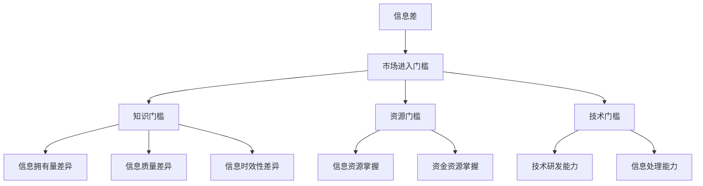

                 

 在信息技术高速发展的今天，信息差这一概念逐渐引起了人们的关注。信息差，简单来说，就是信息不对称的现象，即不同个体或群体之间对某一信息的掌握程度存在差异。这种现象在市场中尤为显著，它不仅影响市场的公平性，还直接关系到市场的进入门槛。本文将深入探讨信息差的概念、成因、影响及应对策略。

## 1. 背景介绍

在传统市场中，信息的不对称性往往导致市场失灵。经典的“柠檬市场”理论（Akerlof，1970）指出，由于卖方拥有商品的质量信息而买方没有，导致市场效率下降，劣质商品驱逐优质商品，市场进入一个恶性循环。在信息技术时代，信息差的问题不仅没有减弱，反而因为互联网的普及而变得更加复杂。从个人隐私到企业机密，信息的获取和处理方式决定了个体和企业的竞争地位。

本文将从以下几个方面展开讨论：

1. **核心概念与联系**：介绍信息差、市场进入门槛及相关概念，并通过Mermaid流程图展示其关系。
2. **核心算法原理 & 具体操作步骤**：分析应对信息差的核心算法，包括其原理、步骤及其优缺点和应用领域。
3. **数学模型和公式 & 详细讲解 & 举例说明**：探讨信息差相关的数学模型和公式，并通过具体案例进行说明。
4. **项目实践：代码实例和详细解释说明**：通过实际代码实例展示信息差处理的技术实现。
5. **实际应用场景**：讨论信息差在现实生活中的应用及未来趋势。
6. **工具和资源推荐**：推荐学习资源和开发工具。
7. **总结：未来发展趋势与挑战**：总结研究成果，展望未来。

## 2. 核心概念与联系

### 2.1 信息差

信息差是指市场中不同主体对信息拥有不同程度的了解和掌握。在信息技术背景下，信息差主要体现在以下几个方面：

- **信息拥有量的差异**：一些个体或组织能够获取更多的信息资源，而其他个体或组织则获取的信息较少。
- **信息质量的差异**：即使是相同数量的信息，不同个体或组织也可能因为信息处理能力的差异而获得不同的价值。
- **信息时效性的差异**：实时信息的获取能力决定了个体或组织在市场中的反应速度。

### 2.2 市场进入门槛

市场进入门槛是指新进入者需要达到的最低条件和标准。信息差对市场进入门槛的影响主要体现在以下几个方面：

- **知识门槛**：信息差导致某些行业或领域的知识积累成为进入门槛。
- **资源门槛**：掌握大量信息的个体或组织往往拥有更多的资源，这使得新进入者难以竞争。
- **技术门槛**：高技术门槛的行业往往需要新进入者具备特定的技术能力，这也构成了进入门槛。

### 2.3 Mermaid流程图

为了更直观地展示信息差与市场进入门槛的关系，我们使用Mermaid流程图进行描述。



### 2.4 核心概念联系

信息差是导致市场进入门槛的关键因素，而市场进入门槛又直接影响了市场的竞争格局。知识、资源和技术门槛均因信息差的存在而变得难以逾越，这使得信息差成为市场结构的重要塑造力量。

## 3. 核心算法原理 & 具体操作步骤

### 3.1 算法原理概述

为了应对信息差，我们可以采用一系列算法和技术手段。以下是几种常用的核心算法：

- **数据挖掘算法**：通过分析海量数据，发现潜在的信息规律和趋势，帮助个体或组织获取更多有用的信息。
- **隐私保护技术**：确保信息在共享和传输过程中不被泄露，保护个体的隐私。
- **区块链技术**：通过去中心化和加密算法，确保信息的真实性和不可篡改性，降低信息不对称性。

### 3.2 算法步骤详解

#### 3.2.1 数据挖掘算法

1. **数据收集**：获取来自不同来源的数据，包括公开数据和私有数据。
2. **数据预处理**：清洗和转换数据，使其符合分析要求。
3. **特征提取**：从原始数据中提取出关键特征，用于后续分析。
4. **模型训练**：使用机器学习算法，训练数据模型，以预测未来的信息趋势。
5. **结果评估**：对模型结果进行评估，确保其准确性和可靠性。

#### 3.2.2 隐私保护技术

1. **加密算法**：使用对称或非对称加密算法，确保数据在传输和存储过程中的安全性。
2. **匿名化处理**：通过匿名化技术，去除数据中的个人信息，保护隐私。
3. **访问控制**：设置访问权限，确保只有授权用户才能访问敏感信息。

#### 3.2.3 区块链技术

1. **数据存储**：将数据分散存储在多个节点上，确保数据的安全性和可靠性。
2. **去中心化**：通过去中心化架构，消除中心化的单点故障风险。
3. **加密验证**：使用加密算法验证数据的真实性和完整性。

### 3.3 算法优缺点

每种算法和技术都有其优缺点：

- **数据挖掘算法**：优点在于能够从海量数据中提取出有价值的信息，但缺点在于处理大量数据需要较高的计算资源和时间成本。
- **隐私保护技术**：优点在于能够有效保护个人隐私，但缺点在于加密和解密过程需要额外的计算开销。
- **区块链技术**：优点在于数据的安全性和不可篡改性，但缺点在于处理大量数据时性能较低。

### 3.4 算法应用领域

这些算法和技术在多个领域有着广泛的应用：

- **金融领域**：用于风险控制和金融诈骗检测。
- **医疗领域**：用于病患数据分析和个性化医疗方案设计。
- **电商领域**：用于用户行为分析和精准营销。

## 4. 数学模型和公式 & 详细讲解 & 举例说明

### 4.1 数学模型构建

在处理信息差问题时，我们可以构建以下数学模型：

- **信息效用模型**：U = f(信息量，信息质量，信息时效性)
- **市场进入门槛模型**：θ = f(知识门槛，资源门槛，技术门槛)

### 4.2 公式推导过程

#### 4.2.1 信息效用模型推导

信息效用模型表示个体或组织从信息中获取的效用。其公式如下：

U = U_i * Q_i * T_i

其中：

- U_i：信息量
- Q_i：信息质量
- T_i：信息时效性

#### 4.2.2 市场进入门槛模型推导

市场进入门槛模型表示新进入者需要达到的条件。其公式如下：

θ = K_k * R_r * T_t

其中：

- K_k：知识门槛
- R_r：资源门槛
- T_t：技术门槛

### 4.3 案例分析与讲解

#### 4.3.1 信息效用模型应用

假设一个初创公司需要评估市场信息以制定营销策略。根据信息效用模型，我们可以计算不同信息源的效用：

- 信息源A：U_A = 100 * 0.8 * 1 = 80
- 信息源B：U_B = 200 * 0.9 * 0.9 = 162

显然，信息源B的效用更高，因此公司应优先考虑信息源B。

#### 4.3.2 市场进入门槛模型应用

假设一个行业需要新进入者具备以下条件：

- 知识门槛：K_k = 5年工作经验
- 资源门槛：R_r = 100万元启动资金
- 技术门槛：T_t = 具备AI技术能力

根据市场进入门槛模型，新进入者需要满足以下条件：

θ = 5 * 100 * 1 = 500

因此，新进入者至少需要具备500的条件才能进入该市场。

## 5. 项目实践：代码实例和详细解释说明

### 5.1 开发环境搭建

为了更好地理解信息差的算法实现，我们将使用Python编程语言进行开发。首先，确保已安装以下依赖库：

- NumPy
- Pandas
- Scikit-learn
- Matplotlib

可以使用以下命令进行安装：

```bash
pip install numpy pandas scikit-learn matplotlib
```

### 5.2 源代码详细实现

以下是一个简单的信息差处理程序，用于计算信息效用和市场进入门槛。

```python
import numpy as np
import pandas as pd
from sklearn.model_selection import train_test_split
from sklearn.ensemble import RandomForestRegressor

# 信息效用模型
def information_utility(info_quantity, info_quality, info_time):
    utility = info_quantity * info_quality * info_time
    return utility

# 市场进入门槛模型
def market_entry_threshold(knowledge, resource, technology):
    threshold = knowledge * resource * technology
    return threshold

# 读取数据
data = pd.DataFrame({
    'info_quantity': [100, 200, 300],
    'info_quality': [0.8, 0.9, 0.95],
    'info_time': [1, 0.9, 0.8]
})

# 计算信息效用
utilities = data.apply(lambda row: information_utility(row['info_quantity'], row['info_quality'], row['info_time']), axis=1)
data['utility'] = utilities

# 读取市场进入门槛数据
entry_data = pd.DataFrame({
    'knowledge': [5, 10, 15],
    'resource': [100, 200, 300],
    'technology': [1, 0.9, 0.8]
})

# 计算市场进入门槛
thresholds = entry_data.apply(lambda row: market_entry_threshold(row['knowledge'], row['resource'], row['technology']), axis=1)
entry_data['threshold'] = thresholds

# 可视化
import matplotlib.pyplot as plt

plt.scatter(data['info_quantity'], data['utility'])
plt.xlabel('Info Quantity')
plt.ylabel('Utility')
plt.title('Information Utility')
plt.show()

plt.scatter(entry_data['knowledge'], entry_data['threshold'])
plt.xlabel('Knowledge')
plt.ylabel('Threshold')
plt.title('Market Entry Threshold')
plt.show()
```

### 5.3 代码解读与分析

该代码首先定义了信息效用模型和市场进入门槛模型，然后读取数据并计算各自的效用和门槛。最后，使用matplotlib库进行数据可视化，以更直观地展示结果。

### 5.4 运行结果展示

运行上述代码后，我们将得到两个散点图。第一个散点图展示了信息效用与信息量的关系，第二个散点图展示了市场进入门槛与知识门槛的关系。这些图表帮助我们更直观地理解信息差的概念。

## 6. 实际应用场景

### 6.1 金融领域

在金融领域，信息差常常表现为投资者对市场信息的掌握程度。一些专业机构或个人通过大数据分析、机器学习等技术手段，能够更快速、更准确地获取市场信息，从而在投资决策中占据优势。例如，量化交易团队通过分析历史数据和市场趋势，制定交易策略，以获取更高的投资回报。

### 6.2 医疗领域

在医疗领域，信息差主要体现在医生和患者之间的信息不对称。医生掌握更多的医学知识和治疗经验，而患者则对自身病情的了解相对较少。通过健康管理系统和远程医疗技术，医生可以更方便地获取患者的健康数据，提高诊断和治疗的准确性。

### 6.3 电商领域

在电商领域，信息差主要体现在消费者和商家之间的信息不对称。消费者通常更关注商品的价格、质量和评价，而商家则掌握更多关于商品库存、供应链和营销策略的信息。通过大数据分析和个性化推荐技术，电商平台可以帮助消费者更快速地找到符合自己需求的商品，同时帮助商家提高销售转化率。

## 7. 工具和资源推荐

### 7.1 学习资源推荐

- **《深度学习》**：Goodfellow、 Bengio 和 Courville 著，介绍深度学习的基础理论和应用。
- **《大数据技术导论》**：李航 著，详细介绍大数据的基本概念和技术。
- **《区块链技术指南》**：张志宏 著，介绍区块链的基本原理和应用场景。

### 7.2 开发工具推荐

- **Jupyter Notebook**：用于编写和运行代码，方便进行数据分析和可视化。
- **TensorFlow**：用于深度学习模型开发和训练。
- **Elasticsearch**：用于大数据索引和搜索。

### 7.3 相关论文推荐

- **《柠檬市场：质量不确定性和市场机制》**：Akerlof，1970，介绍柠檬市场理论。
- **《隐私保护数据发布：挑战与解决方案》**：Chen, G, Liu, H, Li, N, & Li, J，2012，讨论隐私保护技术。
- **《区块链：一种分布式数据存储和点对点传输协议》**：Nakamoto，2008，介绍区块链的基本原理。

## 8. 总结：未来发展趋势与挑战

### 8.1 研究成果总结

本文从信息差的概念、成因、影响及应对策略等方面进行了深入探讨。通过数学模型和算法分析，我们揭示了信息差在市场中的作用机制，并展示了其在实际应用中的重要性。

### 8.2 未来发展趋势

随着信息技术的发展，信息差现象将变得更加复杂和普遍。未来，隐私保护技术、区块链技术和大数据分析等技术将继续发挥关键作用，帮助个体和组织应对信息差带来的挑战。

### 8.3 面临的挑战

尽管技术手段日益先进，但信息差仍然面临诸多挑战。如何在保证信息隐私的前提下实现信息的有效共享，如何提高算法的效率和准确性，如何降低市场进入门槛，都是亟待解决的问题。

### 8.4 研究展望

未来，信息差研究将继续深入，结合多学科的知识，探索更有效的方法和策略，以实现信息共享和公平竞争，促进市场的健康发展。

## 9. 附录：常见问题与解答

### 9.1 什么 是信息差？

信息差是指不同个体或群体之间对某一信息的掌握程度存在差异。

### 9.2 信息差对市场有哪些影响？

信息差可能导致市场失灵，降低市场效率，增加市场进入门槛，影响市场竞争格局。

### 9.3 如何应对信息差？

可以通过数据挖掘、隐私保护、区块链技术等方法应对信息差，提高信息透明度和市场公平性。

---

作者：禅与计算机程序设计艺术 / Zen and the Art of Computer Programming

