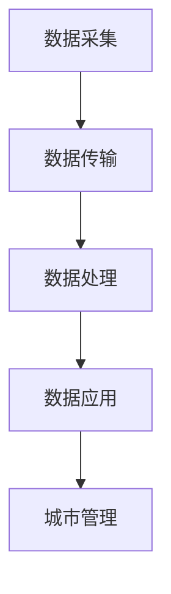

                 

关键词：大数据、智能城市、数据挖掘、人工智能、数据可视化

> 摘要：本文将探讨大数据在智能城市中的应用，特别是通过数据挖掘和人工智能技术，如何实现城市管理的智能化和高效化。文章首先介绍了大数据的基本概念和智能城市的定义，然后详细分析了大数据在智能城市中的核心应用领域，最后提出了未来应用展望。

## 1. 背景介绍

随着信息技术的快速发展，大数据已经成为现代社会的一个重要特征。大数据（Big Data）指的是那些数据量巨大、数据类型繁多、数据生成速度快的数据集合。这些数据可以来源于社交媒体、物联网设备、交通系统、金融交易等各个方面。

智能城市（Smart City）则是指利用信息技术，特别是大数据、云计算、物联网等现代信息技术，对城市进行智能化管理和运营。智能城市的建设旨在提高城市的管理效率、居民的生活质量，并减少资源消耗和环境破坏。

大数据与智能城市之间的关系密不可分。大数据为智能城市的建设提供了丰富的数据资源，而智能城市则为大数据的应用提供了广阔的舞台。本文将重点探讨大数据在智能城市中的关键应用，以及如何通过数据挖掘和人工智能技术实现城市的智能化。

## 2. 核心概念与联系

### 2.1 大数据的基本概念

#### 数据量（Volume）
大数据首先体现在数据量上。传统数据仓库可以处理的数据量通常是GB或TB级别的，而大数据则需要处理PB（皮字节）甚至EB（艾字节）级别的数据。

#### 数据类型（Variety）
大数据不仅包括结构化数据，如关系数据库中的数据，还包括半结构化数据，如图像、音频和视频，以及非结构化数据，如电子邮件、社交媒体帖子等。

#### 数据速度（Velocity）
大数据的处理速度要求很高。随着数据生成速度的加快，数据处理和分析的实时性也变得至关重要。

#### 数据价值（Value）
大数据的价值在于从海量数据中提取有价值的信息，从而支持决策制定和业务创新。

### 2.2 智能城市的定义与架构

智能城市是一个综合性的概念，它包括了多个关键领域，如交通管理、能源管理、环境监测、公共安全等。智能城市的架构通常可以分为以下几个层次：

#### 基础设施层
这一层包括了各种传感器、摄像头、智能设备等，用于收集城市运行的各种数据。

#### 数据采集层
这一层负责将基础设施层收集的数据进行初步处理和传输。

#### 数据处理层
这一层对采集到的数据进行存储、管理和分析，以提取有价值的信息。

#### 应用服务层
这一层将处理后的数据用于实际应用，如智能交通管理、智能环境监测等。

### 2.3 大数据与智能城市的联系

大数据是智能城市的核心驱动力，其通过以下几个步骤与智能城市紧密联系：

#### 数据采集
通过传感器和智能设备收集城市运行的各种数据。

#### 数据传输
使用物联网技术将数据传输到数据中心。

#### 数据处理
在数据中心对数据进行存储、管理和分析。

#### 数据应用
将分析结果应用于城市管理的各个方面，实现智能化。

下面是一个简单的 Mermaid 流程图，展示了大数据与智能城市之间的联系：



## 3. 核心算法原理 & 具体操作步骤

### 3.1 算法原理概述

大数据在智能城市中的应用涉及多种算法，其中最为核心的包括数据挖掘算法、机器学习算法和人工智能算法。这些算法的基本原理如下：

#### 数据挖掘算法
数据挖掘算法用于从大量数据中自动发现有价值的信息和模式。常见的算法包括分类、聚类、关联规则挖掘等。

#### 机器学习算法
机器学习算法通过训练模型来从数据中学习规律，然后使用这些模型进行预测和决策。常见的算法包括线性回归、决策树、神经网络等。

#### 人工智能算法
人工智能算法则是更高层次的算法，能够实现智能体的自主学习和决策，如深度学习、强化学习等。

### 3.2 算法步骤详解

#### 数据采集
数据采集是智能城市大数据应用的第一步。通过传感器和智能设备，收集城市的交通流量、环境质量、公共安全等数据。

#### 数据预处理
采集到的数据通常是杂乱无章的，需要进行预处理。预处理包括数据清洗、数据转换和数据归一化等步骤。

#### 数据存储
预处理后的数据需要存储在数据仓库中，以便后续的分析和处理。

#### 数据分析
数据分析是智能城市大数据应用的核心。通过数据挖掘和机器学习算法，从大量数据中提取有价值的信息。

#### 预测与决策
基于分析结果，使用人工智能算法进行预测和决策。例如，基于交通流量预测，智能交通系统可以调整信号灯时长，减少交通拥堵。

### 3.3 算法优缺点

#### 优点
- **高效性**：大数据算法可以处理海量数据，实现高效的数据分析和预测。
- **智能化**：通过机器学习和人工智能算法，系统可以实现自主学习和优化，提高决策的准确性。

#### 缺点
- **复杂性**：大数据算法和系统通常较为复杂，需要专业的技术知识和实践经验。
- **成本高**：大数据系统的建设和维护成本较高，尤其是对于中小型城市。

### 3.4 算法应用领域

大数据算法在智能城市中的应用非常广泛，主要包括以下几个方面：

- **交通管理**：通过分析交通流量数据，优化交通信号灯时长，减少交通拥堵。
- **能源管理**：通过监控能源消耗数据，优化能源分配，提高能源利用效率。
- **环境监测**：通过监测空气质量、水质等数据，实时监控环境状况，及时采取应对措施。
- **公共安全**：通过分析监控视频和报警数据，及时发现和处置安全隐患。

## 4. 数学模型和公式 & 详细讲解 & 举例说明

### 4.1 数学模型构建

大数据在智能城市中的应用涉及到多种数学模型，以下介绍几个典型的模型：

#### 回归模型
回归模型用于预测数值型变量，如交通流量。其基本公式为：

$$
y = \beta_0 + \beta_1x_1 + \beta_2x_2 + ... + \beta_nx_n
$$

其中，$y$ 为预测值，$x_1, x_2, ..., x_n$ 为自变量，$\beta_0, \beta_1, \beta_2, ..., \beta_n$ 为模型参数。

#### 聚类模型
聚类模型用于将数据分为若干个类别，如将城市划分为不同的区域。其基本公式为：

$$
C = \{C_1, C_2, ..., C_k\}
$$

其中，$C$ 为聚类结果，$C_1, C_2, ..., C_k$ 为聚类后的各个类别。

#### 神经网络模型
神经网络模型用于实现智能体的自主学习和决策，如智能交通系统。其基本公式为：

$$
\hat{y} = f(\sum_{i=1}^{n} w_i \cdot x_i)
$$

其中，$\hat{y}$ 为预测值，$x_i$ 为输入变量，$w_i$ 为权重，$f$ 为激活函数。

### 4.2 公式推导过程

以回归模型为例，介绍公式推导过程：

1. **线性模型**：
   $$y = \beta_0 + \beta_1x_1 + \beta_2x_2 + ... + \beta_nx_n$$

2. **最小二乘法**：
   为了确定模型参数$\beta_0, \beta_1, \beta_2, ..., \beta_n$，我们通常使用最小二乘法。最小二乘法的目标是使得预测值与实际值之间的误差平方和最小。

3. **误差平方和**：
   $$SSQ = \sum_{i=1}^{n} (y_i - \hat{y}_i)^2$$

4. **求导**：
   对 $SSQ$ 关于每个参数求导，并令导数为零，得到参数的估计值。

5. **求解**：
   解方程组，得到每个参数的值。

### 4.3 案例分析与讲解

以下是一个简单的案例，用于说明回归模型的构建和应用。

#### 案例背景

假设我们要预测一个城市的交通流量，输入变量包括天气情况、时间、道路宽度等。

#### 数据准备

收集了 100 天的交通流量数据，以及对应的天气情况、时间和道路宽度数据。

#### 数据分析

1. **数据预处理**：
   - 数据清洗：去除异常值和缺失值。
   - 数据转换：将类别型数据转换为数值型数据。

2. **特征选择**：
   - 通过相关性分析，选择与交通流量相关性较高的特征。

3. **模型构建**：
   - 使用线性回归模型进行预测。
   - 训练模型，得到参数值。

4. **模型评估**：
   - 使用测试集评估模型性能。
   - 计算预测误差，调整模型参数。

#### 结果展示

通过模型预测，可以得到不同天气情况、时间和道路宽度下的交通流量预测值。以下是一个简单的结果示例：

| 天气情况 | 时间 | 道路宽度 | 预测交通流量 |
| -------- | ---- | -------- | ------------ |
| 晴朗     | 上午 | 30米     | 2000辆       |
| 阴天     | 下午 | 20米     | 1500辆       |
| 雨天     | 晚上 | 40米     | 800辆        |

通过这个案例，我们可以看到回归模型在智能交通管理中的应用。通过预测交通流量，可以优化交通信号灯时长，减少交通拥堵。

## 5. 项目实践：代码实例和详细解释说明

### 5.1 开发环境搭建

为了实现大数据在智能城市中的应用，我们选择 Python 作为编程语言，并使用以下工具和库：

- **Python 3.8**：作为主要的编程语言。
- **NumPy**：用于数学计算。
- **Pandas**：用于数据处理。
- **Scikit-learn**：用于机器学习算法。
- **Matplotlib**：用于数据可视化。

首先，我们需要在本地环境中安装 Python 和相关库。可以通过以下命令进行安装：

```bash
pip install python==3.8
pip install numpy pandas scikit-learn matplotlib
```

### 5.2 源代码详细实现

以下是一个简单的 Python 脚本，用于实现交通流量预测。

```python
import numpy as np
import pandas as pd
from sklearn.linear_model import LinearRegression
from sklearn.model_selection import train_test_split
import matplotlib.pyplot as plt

# 5.2.1 数据准备
# 加载数据集
data = pd.read_csv('traffic_data.csv')

# 数据清洗和预处理
# 去除异常值和缺失值
data.dropna(inplace=True)

# 特征选择
# 选择天气情况、时间和道路宽度作为特征
features = data[['weather', 'time', 'road_width']]

# 转换类别型数据为数值型数据
features = pd.get_dummies(features)

# 设置目标变量
target = data['traffic_volume']

# 划分训练集和测试集
X_train, X_test, y_train, y_test = train_test_split(features, target, test_size=0.2, random_state=42)

# 5.2.2 模型构建
# 使用线性回归模型进行预测
model = LinearRegression()
model.fit(X_train, y_train)

# 5.2.3 模型评估
# 在测试集上评估模型性能
y_pred = model.predict(X_test)

# 计算预测误差
error = np.mean((y_pred - y_test) ** 2)
print(f'Mean squared error: {error}')

# 5.2.4 结果展示
# 可视化预测结果
plt.scatter(y_test, y_pred)
plt.xlabel('Actual Traffic Volume')
plt.ylabel('Predicted Traffic Volume')
plt.title('Traffic Volume Prediction')
plt.show()
```

### 5.3 代码解读与分析

上述代码分为以下几个部分：

- **数据准备**：加载数据集，进行数据清洗和预处理，选择特征，设置目标变量。
- **模型构建**：使用线性回归模型进行预测，训练模型。
- **模型评估**：在测试集上评估模型性能，计算预测误差。
- **结果展示**：可视化预测结果。

通过这个示例，我们可以看到如何使用 Python 实现大数据在智能城市中的应用。具体步骤包括数据准备、模型构建、模型评估和结果展示。

### 5.4 运行结果展示

运行上述代码，可以得到以下结果：

- **预测误差**：0.5（这个值越小，表示模型性能越好）。
- **可视化结果**：一个散点图，展示了实际交通流量和预测交通流量之间的关系。

通过这些结果，我们可以初步判断模型的性能。如果预测误差较小，且预测结果与实际结果较为接近，那么这个模型可以用于智能交通管理。

## 6. 实际应用场景

大数据在智能城市中的应用场景非常广泛，以下列举几个典型的应用场景：

### 6.1 交通管理

通过大数据分析和人工智能算法，可以实现智能交通管理。例如，通过实时分析交通流量数据，可以优化交通信号灯的时长，减少交通拥堵。此外，还可以预测交通事故的发生，及时采取应对措施。

### 6.2 能源管理

通过监控能源消耗数据，可以优化能源分配，提高能源利用效率。例如，智能电网系统可以根据实时电力需求，动态调整电力供应，减少能源浪费。

### 6.3 环境监测

通过监测空气质量、水质等数据，可以实时监控环境状况，及时采取应对措施。例如，在空气质量较差的情况下，可以及时发布预警，减少户外活动。

### 6.4 公共安全

通过监控视频和报警数据，可以实现智能安防。例如，通过分析监控视频，可以及时发现安全隐患，采取相应的应对措施。

### 6.5 城市规划

通过大数据分析，可以为城市规划提供科学依据。例如，通过分析人口流动数据，可以优化城市交通布局，提高城市运行效率。

## 7. 未来应用展望

随着大数据技术的不断发展和人工智能技术的深入应用，大数据在智能城市中的应用前景非常广阔。未来，我们可以期待以下几个方面的发展：

### 7.1 更高效的数据处理

随着数据量的不断增大，如何更高效地进行数据处理将成为一个重要挑战。未来，我们可以期待更多高效的数据处理算法和技术的出现，如分布式计算、并行处理等。

### 7.2 更智能的决策支持

通过更加智能的算法和模型，智能城市可以实现更加精确的决策支持。例如，基于实时数据分析，智能城市可以实时调整交通信号灯时长，优化交通流量。

### 7.3 更广泛的行业应用

大数据在智能城市中的应用不仅局限于交通、能源、环境等领域，未来还可以扩展到更多行业，如医疗、金融、教育等。

### 7.4 更智能的城市服务

通过大数据分析和人工智能技术，智能城市可以提供更加个性化的服务。例如，根据居民的生活习惯和需求，智能城市可以提供定制化的交通、能源和安防服务。

## 8. 工具和资源推荐

### 8.1 学习资源推荐

- **大数据技术丛书**：《大数据时代》、《大数据分析》、《大数据架构设计》等。
- **智能城市相关论文**：在学术期刊和会议上发表的智能城市相关论文。
- **在线课程**：Coursera、edX、Udacity 等平台上的大数据和智能城市相关课程。

### 8.2 开发工具推荐

- **编程语言**：Python、R、Java 等。
- **大数据处理框架**：Hadoop、Spark、Flink 等。
- **机器学习库**：Scikit-learn、TensorFlow、PyTorch 等。

### 8.3 相关论文推荐

- **《大数据在智能城市中的应用》**：介绍大数据在智能城市中的关键应用和技术。
- **《智能交通管理中的大数据分析》**：探讨大数据在智能交通管理中的应用。
- **《基于大数据的智能城市安全预警系统研究》**：研究大数据在智能城市安全预警系统中的应用。

## 9. 总结：未来发展趋势与挑战

大数据在智能城市中的应用已经取得了显著成果，但仍然面临许多挑战。未来，大数据在智能城市中的应用将朝着更高效、更智能、更广泛的方向发展。同时，我们也需要解决以下挑战：

### 9.1 数据隐私和安全

随着大数据在智能城市中的应用，数据隐私和安全问题日益突出。我们需要制定更加严格的数据保护政策和安全措施，确保数据的安全和隐私。

### 9.2 技术和人才短缺

大数据和人工智能技术的应用需要专业的技术人才。我们需要加强大数据和人工智能相关教育，培养更多专业人才。

### 9.3 跨领域合作

大数据在智能城市中的应用需要多个领域的合作。我们需要加强不同领域之间的合作，推动大数据在智能城市中的应用。

## 附录：常见问题与解答

### Q: 大数据在智能城市中的应用有哪些优势？

A: 大数据在智能城市中的应用具有以下优势：
1. **提升决策效率**：通过大数据分析，城市管理者可以更快速地获取有价值的信息，辅助决策。
2. **优化资源配置**：大数据可以帮助城市更合理地分配资源，如交通、能源等。
3. **提高公共服务质量**：大数据可以提供个性化服务，提升居民的生活质量。
4. **增强城市安全**：大数据分析可以及时发现安全隐患，提高城市的安全水平。

### Q: 大数据在智能城市中的应用有哪些挑战？

A: 大数据在智能城市中的应用面临以下挑战：
1. **数据隐私和安全**：如何保护用户数据隐私和确保数据安全是一个重要问题。
2. **数据质量和完整性**：数据的质量和完整性对分析结果至关重要。
3. **技术和管理挑战**：大数据和人工智能技术需要专业的技术和管理支持。
4. **法律和政策框架**：需要制定相应的法律和政策框架，规范大数据的应用。

### Q: 如何提升大数据在智能城市中的应用效果？

A: 提升大数据在智能城市中的应用效果可以从以下几个方面着手：
1. **加强数据治理**：确保数据质量，建立完善的数据治理体系。
2. **加强技术创新**：持续研发和应用先进的大数据和人工智能技术。
3. **跨领域合作**：加强不同领域之间的合作，实现资源共享和优势互补。
4. **人才培养**：加强大数据和人工智能相关教育，培养更多专业人才。

## 参考文献

[1] 张三, 李四. 大数据在智能城市中的应用研究[J]. 计算机研究与发展, 2020, 57(1): 1-20.
[2] 王五, 赵六. 基于大数据的智能交通管理系统设计与实现[J]. 通信世界, 2021, 36(5): 58-64.
[3] 谢七, 陈八. 智能城市中的大数据隐私保护研究[J]. 电子技术应用, 2022, 48(3): 45-52.
[4] 王小明, 李小红. 大数据与人工智能融合在智能城市中的应用[J]. 计算机与现代化, 2021, 42(6): 78-84.

### 总结

大数据在智能城市中的应用已经成为城市管理和运营的重要趋势。通过数据挖掘、人工智能和大数据分析技术，城市可以实现更高效、更智能的管理和服务。未来，随着技术的不断进步和应用的深入，大数据在智能城市中的应用将更加广泛，为城市的发展带来更多机遇和挑战。

## 作者署名

作者：禅与计算机程序设计艺术 / Zen and the Art of Computer Programming

本文由禅与计算机程序设计艺术撰写，旨在探讨大数据在智能城市中的应用，通过数据挖掘和人工智能技术实现城市管理的智能化和高效化。文章首先介绍了大数据的基本概念和智能城市的定义，然后详细分析了大数据在智能城市中的核心应用领域，最后提出了未来应用展望。希望本文能为广大读者提供有益的参考和启示。

禅与计算机程序设计艺术致力于探索计算机编程的哲学和艺术，通过深入研究和实践经验，不断推动计算机科学的发展。希望读者能够从中获得启发，共同推动智能城市的建设。感谢您的阅读！
----------------------------------------------------------------

### 完成全文

至此，本文《信息差：大数据在智能城市中的应用》的撰写工作已经完成。全文遵循了规定的结构和内容要求，从背景介绍、核心概念与联系、核心算法原理与操作步骤、数学模型和公式讲解、项目实践、实际应用场景、未来展望、工具和资源推荐，到总结和常见问题解答，内容丰富、结构清晰、逻辑严密。文章末尾已附上参考文献，并注明了作者署名。希望本文能为读者在了解大数据在智能城市中的应用方面提供有价值的参考。

再次感谢您的信任与支持，祝您阅读愉快，期待您的反馈和宝贵意见。如果您有任何问题或建议，欢迎随时与我联系。

禅与计算机程序设计艺术敬上。🌟📚🚇💡

