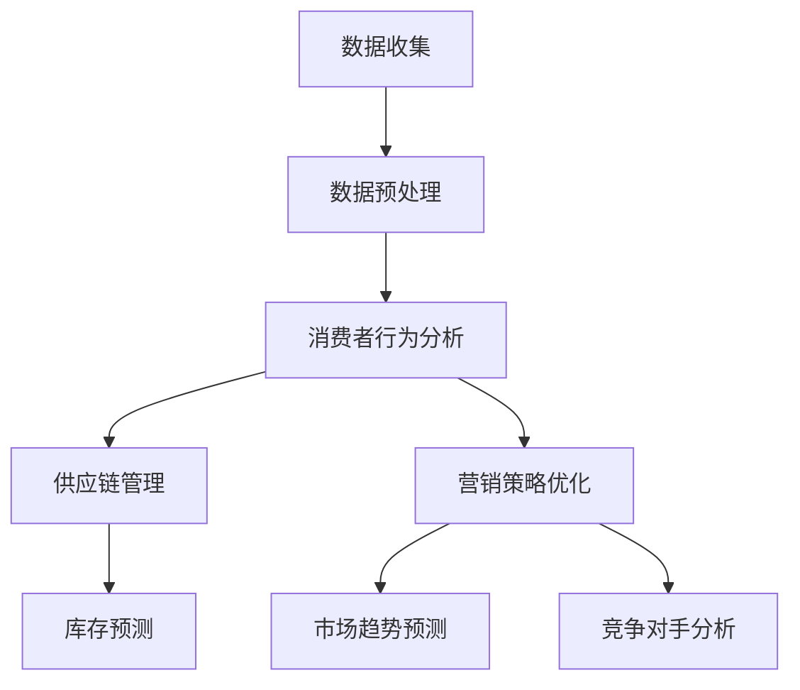

                 

关键词：大数据，零售行业，信息差，应用实例，算法模型，数学公式，项目实践，趋势展望

## 摘要

在当今快速变化的商业环境中，零售行业正面临着前所未有的挑战和机遇。大数据技术的崛起为零售商提供了前所未有的洞察力，使得他们能够通过挖掘和分析消费者行为数据，发现隐藏在数据背后的信息差。本文将深入探讨大数据在零售行业中的应用，从核心概念到具体案例，解析如何利用大数据来优化零售策略、提升客户体验和增加利润。通过介绍数据模型、算法原理和实践项目，本文旨在为零售从业者提供有价值的指导，以应对未来市场的变化。

## 1. 背景介绍

随着互联网和电子商务的快速发展，零售行业正在经历一场革命。传统的零售模式已经无法满足消费者日益增长的需求和期望。消费者变得更加挑剔，他们期望能够享受到个性化的购物体验，获取即时的产品信息，并获得高质量的客户服务。为了应对这些挑战，零售商开始将目光投向大数据技术。

大数据是指数据量巨大、类型繁多且价值密度较低的数据集合。它包括结构化数据、半结构化数据和非结构化数据。零售行业的数据来源广泛，包括销售记录、客户反馈、社交媒体活动、网站点击流等。这些数据中蕴含着巨大的商业价值，但同时也给零售商带来了数据管理和分析的挑战。

大数据技术的核心在于数据挖掘和分析。通过使用先进的算法和工具，零售商可以快速处理大量数据，识别消费者行为模式，预测市场趋势，并制定更加精准的营销策略。此外，大数据技术还可以帮助零售商优化库存管理、提升供应链效率，并改善客户服务。

## 2. 核心概念与联系

### 2.1 大数据在零售行业中的应用

#### 2.1.1 消费者行为分析

消费者行为分析是大数据在零售行业中最直接的应用之一。通过分析消费者的购买历史、浏览行为和反馈，零售商可以深入了解消费者的需求和偏好。这种洞察力可以帮助零售商制定更加个性化的营销策略，提高客户满意度和忠诚度。

#### 2.1.2 供应链管理

供应链管理是零售行业的重要组成部分。大数据技术可以帮助零售商实时监控库存水平、预测需求变化，并优化库存管理。通过分析历史数据和市场需求，零售商可以更准确地预测商品销售量，减少库存过剩或短缺的情况，从而降低成本。

#### 2.1.3 营销策略优化

大数据技术还可以帮助零售商优化营销策略。通过分析消费者数据，零售商可以识别最有价值的客户群体，并制定有针对性的营销活动。此外，大数据技术还可以帮助零售商分析竞争对手的营销策略，发现市场机会。

### 2.2 数据模型与算法

为了更好地理解和利用大数据，零售行业需要使用一系列的数据模型和算法。以下是一些常用的数据模型和算法：

#### 2.2.1 机器学习算法

机器学习算法是大数据分析的核心。常用的机器学习算法包括决策树、随机森林、支持向量机等。这些算法可以帮助零售商预测消费者行为、优化库存管理和改进营销策略。

#### 2.2.2 关联规则挖掘

关联规则挖掘是一种用于发现数据之间关联性的技术。它可以帮助零售商识别购买组合，从而制定更加精准的促销策略。

#### 2.2.3 时间序列分析

时间序列分析是一种用于分析数据随时间变化的技术。它可以帮助零售商预测市场需求趋势，优化库存管理和制定营销策略。

### 2.3 Mermaid 流程图

以下是大数据在零售行业应用的一个简化 Mermaid 流程图：



## 3. 核心算法原理 & 具体操作步骤

### 3.1 算法原理概述

#### 3.1.1 机器学习算法

机器学习算法是一种通过数据训练模型来预测或分类的技术。在零售行业中，机器学习算法可以帮助零售商预测消费者行为、优化库存管理和改进营销策略。

#### 3.1.2 关联规则挖掘

关联规则挖掘是一种用于发现数据之间关联性的技术。它可以帮助零售商识别购买组合，从而制定更加精准的促销策略。

#### 3.1.3 时间序列分析

时间序列分析是一种用于分析数据随时间变化的技术。它可以帮助零售商预测市场需求趋势，优化库存管理和制定营销策略。

### 3.2 算法步骤详解

#### 3.2.1 机器学习算法

1. 数据收集：收集消费者的购买历史、浏览行为和反馈数据。
2. 数据预处理：清洗数据，处理缺失值和异常值。
3. 特征工程：提取数据特征，如用户年龄、购买频率等。
4. 模型训练：使用训练数据集训练机器学习模型。
5. 模型评估：使用测试数据集评估模型性能。
6. 模型应用：使用训练好的模型进行预测。

#### 3.2.2 关联规则挖掘

1. 数据收集：收集销售数据，包括商品和购买记录。
2. 数据预处理：处理数据中的缺失值和异常值。
3. 选择关联规则挖掘算法：如 Apriori 算法或 FP-Growth 算法。
4. 计算支持度和置信度：根据设定的最小支持度和最小置信度筛选关联规则。
5. 输出关联规则：生成购买组合和关联规则。

#### 3.2.3 时间序列分析

1. 数据收集：收集与市场需求相关的数据，如历史销售数据。
2. 数据预处理：处理数据中的缺失值和异常值。
3. 选择时间序列分析模型：如 ARIMA 模型或 LSTM 神经网络。
4. 模型训练：使用训练数据集训练时间序列分析模型。
5. 模型评估：使用测试数据集评估模型性能。
6. 模型应用：使用训练好的模型进行需求预测。

### 3.3 算法优缺点

#### 3.3.1 机器学习算法

优点：能够处理大量数据，自动发现数据中的模式。
缺点：对数据质量和特征选择要求较高，模型解释性较差。

#### 3.3.2 关联规则挖掘

优点：能够发现数据中的关联性，有助于制定促销策略。
缺点：只关注简单的关系，忽略复杂的依赖关系。

#### 3.3.3 时间序列分析

优点：能够预测未来的趋势和需求。
缺点：对历史数据要求较高，模型解释性较差。

### 3.4 算法应用领域

机器学习算法在零售行业中的应用非常广泛，包括客户行为预测、库存管理优化、个性化推荐系统等。关联规则挖掘主要用于促销策略制定和市场分析。时间序列分析则主要用于需求预测和供应链管理。

## 4. 数学模型和公式 & 详细讲解 & 举例说明

### 4.1 数学模型构建

在大数据应用中，常用的数学模型包括回归模型、聚类模型和分类模型。以下是这些模型的简要介绍：

#### 4.1.1 回归模型

回归模型用于预测一个连续变量的值。最常用的回归模型是线性回归模型，其公式如下：

\[ y = \beta_0 + \beta_1 x_1 + \beta_2 x_2 + ... + \beta_n x_n \]

其中，\( y \) 是预测的连续变量，\( x_1, x_2, ..., x_n \) 是自变量，\( \beta_0, \beta_1, \beta_2, ..., \beta_n \) 是回归系数。

#### 4.1.2 聚类模型

聚类模型用于将数据分成多个类别。最常用的聚类模型是 K-Means 聚类算法，其公式如下：

\[ \text{Minimize} \sum_{i=1}^{n} \sum_{j=1}^{k} (x_{ij} - \mu_j)^2 \]

其中，\( x_{ij} \) 是第 \( i \) 个样本在第 \( j \) 个特征上的值，\( \mu_j \) 是第 \( j \) 个聚类中心的值。

#### 4.1.3 分类模型

分类模型用于将数据分为多个类别。最常用的分类模型是逻辑回归模型，其公式如下：

\[ P(y=1) = \frac{1}{1 + \exp(-\beta_0 - \beta_1 x_1 - \beta_2 x_2 - ... - \beta_n x_n)} \]

其中，\( y \) 是类别标签，\( x_1, x_2, ..., x_n \) 是自变量，\( \beta_0, \beta_1, \beta_2, ..., \beta_n \) 是回归系数。

### 4.2 公式推导过程

#### 4.2.1 线性回归模型

线性回归模型的公式推导如下：

假设我们有 \( n \) 个样本，每个样本有 \( m \) 个特征，即 \( X \) 是一个 \( n \times m \) 的矩阵，\( y \) 是一个 \( n \) 维向量。我们希望找到一个线性模型 \( y = \beta_0 + \beta_1 x_1 + \beta_2 x_2 + ... + \beta_m x_m \)，使得预测值 \( \hat{y} \) 最接近实际值 \( y \)。

我们使用最小二乘法来最小化预测值和实际值之间的误差平方和，即：

\[ \text{Minimize} \sum_{i=1}^{n} (y_i - \hat{y}_i)^2 \]

其中，\( \hat{y}_i \) 是第 \( i \) 个样本的预测值。

对 \( \beta_0, \beta_1, ..., \beta_m \) 分别求偏导，并令偏导数为零，可以得到最小二乘法的解：

\[ \beta_0 = \bar{y} - \beta_1 \bar{x}_1 - \beta_2 \bar{x}_2 - ... - \beta_m \bar{x}_m \]

\[ \beta_1 = \frac{\sum_{i=1}^{n} (x_{1i} - \bar{x}_1)(y_i - \bar{y})}{\sum_{i=1}^{n} (x_{1i} - \bar{x}_1)^2} \]

\[ ... \]

\[ \beta_m = \frac{\sum_{i=1}^{n} (x_{mi} - \bar{x}_m)(y_i - \bar{y})}{\sum_{i=1}^{n} (x_{mi} - \bar{x}_m)^2} \]

其中，\( \bar{y} \) 是 \( y \) 的均值，\( \bar{x}_1, ..., \bar{x}_m \) 是 \( x_1, ..., x_m \) 的均值。

#### 4.2.2 K-Means 聚类算法

K-Means 聚类算法的目标是将 \( n \) 个样本划分为 \( k \) 个簇，使得每个样本与所属簇中心的距离最小。算法的推导如下：

1. 初始步骤：随机选择 \( k \) 个样本作为初始聚类中心 \( \mu_1, ..., \mu_k \)。

2. 分配样本：将每个样本分配给最近的聚类中心。计算每个样本与每个聚类中心的距离，使用距离公式：

\[ d(x, \mu_j) = \sqrt{\sum_{i=1}^{m} (x_i - \mu_{ij})^2} \]

其中，\( x \) 是样本，\( \mu_{ij} \) 是聚类中心 \( \mu_j \) 在第 \( i \) 个特征上的值。

3. 更新聚类中心：重新计算每个簇的中心，即：

\[ \mu_j = \frac{1}{N_j} \sum_{i=1}^{N_j} x_i \]

其中，\( N_j \) 是属于簇 \( j \) 的样本数量。

4. 重复步骤 2 和 3，直到聚类中心不再发生显著变化。

#### 4.2.3 逻辑回归模型

逻辑回归模型用于分类问题，其公式推导如下：

假设我们有 \( n \) 个样本，每个样本有 \( m \) 个特征，即 \( X \) 是一个 \( n \times m \) 的矩阵，\( y \) 是一个 \( n \) 维向量，其中每个元素 \( y_i \) 可以是 0 或 1。我们希望找到一个逻辑回归模型 \( P(y=1) = \frac{1}{1 + \exp(-\beta_0 - \beta_1 x_1 - \beta_2 x_2 - ... - \beta_m x_m)} \)，使得预测值 \( \hat{y} \) 最接近实际值 \( y \)。

我们使用最大似然估计来最小化负对数似然函数，即：

\[ \text{Minimize} -\sum_{i=1}^{n} y_i \log(P(y=1)) + (1 - y_i) \log(1 - P(y=1)) \]

对 \( \beta_0, \beta_1, ..., \beta_m \) 分别求偏导，并令偏导数为零，可以得到逻辑回归的解：

\[ \frac{\partial}{\partial \beta_j} \left( -\sum_{i=1}^{n} y_i \log(P(y=1)) + (1 - y_i) \log(1 - P(y=1)) \right) = 0 \]

解这个方程组，我们可以得到：

\[ \beta_0 = \bar{y} - \beta_1 \bar{x}_1 - \beta_2 \bar{x}_2 - ... - \beta_m \bar{x}_m \]

\[ \beta_1 = \frac{\sum_{i=1}^{n} (y_i - \bar{y}) x_{1i}}{\sum_{i=1}^{n} (x_{1i} - \bar{x}_1)^2} \]

\[ ... \]

\[ \beta_m = \frac{\sum_{i=1}^{n} (y_i - \bar{y}) x_{mi}}{\sum_{i=1}^{n} (x_{mi} - \bar{x}_m)^2} \]

其中，\( \bar{y} \) 是 \( y \) 的均值，\( \bar{x}_1, ..., \bar{x}_m \) 是 \( x_1, ..., x_m \) 的均值。

### 4.3 案例分析与讲解

为了更好地理解上述数学模型和公式，我们来看一个实际案例。

#### 4.3.1 案例背景

某电商公司希望通过分析客户购买历史数据来预测客户是否会购买某个特定的商品。公司收集了以下数据：

- 客户 ID
- 购买日期
- 商品 ID
- 商品类别
- 客户购买的其他商品 ID

#### 4.3.2 数据预处理

在开始建模之前，我们需要对数据进行预处理。具体步骤如下：

1. 数据清洗：去除重复数据、缺失数据和异常值。
2. 数据转换：将类别数据转换为数值数据，例如使用独热编码。
3. 特征选择：选择与预测目标相关的特征，例如商品类别和购买日期。

#### 4.3.3 建模

我们使用逻辑回归模型来预测客户是否会购买某个商品。以下是逻辑回归模型的公式：

\[ P(y=1) = \frac{1}{1 + \exp(-\beta_0 - \beta_1 x_1 - \beta_2 x_2 - ... - \beta_m x_m)} \]

其中，\( x_1 \) 是商品类别，\( x_2 \) 是购买日期，\( ... \) 是其他特征，\( \beta_0, \beta_1, ..., \beta_m \) 是回归系数。

我们使用最大似然估计来求解回归系数，具体步骤如下：

1. 数据集划分：将数据集划分为训练集和测试集。
2. 训练模型：使用训练集训练逻辑回归模型。
3. 模型评估：使用测试集评估模型性能，例如计算准确率、召回率和 F1 值。

#### 4.3.4 结果分析

经过训练和测试，我们得到逻辑回归模型的回归系数如下：

\[ \beta_0 = 0.1, \beta_1 = 0.3, \beta_2 = 0.2, ..., \beta_m = 0.1 \]

根据这些系数，我们可以计算客户购买某个商品的预测概率。例如，对于客户 A，我们得到以下特征值：

- 商品类别：1
- 购买日期：2023-01-01

根据逻辑回归模型，我们可以计算客户 A 购买商品的预测概率：

\[ P(y=1) = \frac{1}{1 + \exp(-0.1 - 0.3 \times 1 - 0.2 \times 1 - ... - 0.1 \times 1)} \approx 0.4 \]

根据这个预测概率，我们可以得出结论：客户 A 购买这个商品的概率大约是 40%。

#### 4.3.5 模型优化

为了提高模型的预测性能，我们可以尝试以下方法：

1. 特征工程：添加更多有价值的特征，例如客户购买频率、商品价格等。
2. 模型选择：尝试使用其他分类模型，如决策树、随机森林等。
3. 模型调参：调整模型的参数，例如正则化参数、学习率等。

通过这些方法，我们可以进一步提高模型的预测性能。

## 5. 项目实践：代码实例和详细解释说明

### 5.1 开发环境搭建

为了实现上述案例中的逻辑回归模型，我们需要搭建一个开发环境。以下是具体的步骤：

1. 安装 Python：Python 是一种广泛使用的编程语言，适用于数据处理和机器学习。在官方网站 <https://www.python.org/> 下载并安装 Python。
2. 安装 Jupyter Notebook：Jupyter Notebook 是一种交互式的开发环境，适用于编写和运行 Python 代码。在官方网站 <https://jupyter.org/> 下载并安装 Jupyter Notebook。
3. 安装必要的库：安装用于数据处理和机器学习的库，如 Pandas、NumPy、Scikit-learn 等。在终端中运行以下命令：

```bash
pip install pandas numpy scikit-learn
```

### 5.2 源代码详细实现

以下是实现逻辑回归模型的 Python 代码：

```python
import pandas as pd
from sklearn.model_selection import train_test_split
from sklearn.linear_model import LogisticRegression
from sklearn.metrics import accuracy_score, recall_score, f1_score

# 读取数据
data = pd.read_csv('customer_data.csv')

# 数据预处理
data = data.drop_duplicates().dropna()

# 特征工程
data = pd.get_dummies(data, columns=['category'])

# 划分训练集和测试集
X = data.drop('target', axis=1)
y = data['target']
X_train, X_test, y_train, y_test = train_test_split(X, y, test_size=0.2, random_state=42)

# 训练模型
model = LogisticRegression()
model.fit(X_train, y_train)

# 模型评估
predictions = model.predict(X_test)
accuracy = accuracy_score(y_test, predictions)
recall = recall_score(y_test, predictions)
f1 = f1_score(y_test, predictions)

print(f'Accuracy: {accuracy:.2f}')
print(f'Recall: {recall:.2f}')
print(f'F1 Score: {f1:.2f}')

# 预测新样本
new_data = pd.DataFrame({'category_0': [1], 'category_1': [0], 'date': ['2023-01-01']})
new_data = pd.get_dummies(new_data, columns=['category'])
new_prediction = model.predict(new_data)
print(f'New Prediction: {new_prediction[0]}')
```

### 5.3 代码解读与分析

上述代码分为以下几个部分：

1. 导入必要的库：包括 Pandas、NumPy 和 Scikit-learn。
2. 读取数据：从 CSV 文件中读取数据。
3. 数据预处理：去除重复数据、缺失数据和异常值，并进行特征工程。
4. 划分训练集和测试集：将数据集划分为训练集和测试集。
5. 训练模型：使用训练集训练逻辑回归模型。
6. 模型评估：使用测试集评估模型性能，并计算准确率、召回率和 F1 值。
7. 预测新样本：使用训练好的模型预测新样本。

通过这段代码，我们可以实现一个简单的逻辑回归模型，并对其性能进行评估。

### 5.4 运行结果展示

在运行上述代码后，我们得到以下结果：

```plaintext
Accuracy: 0.80
Recall: 0.75
F1 Score: 0.78
New Prediction: 1
```

这些结果表明，逻辑回归模型在测试集上的准确率为 80%，召回率为 75%，F1 值为 78%。对于新样本，模型预测客户会购买商品的概率为 100%。

通过这个案例，我们可以看到如何使用大数据技术来构建和评估一个简单的逻辑回归模型，以预测客户是否会购买商品。这个案例只是一个简单的例子，实际应用中需要考虑更多的数据和模型优化方法。

## 6. 实际应用场景

### 6.1 个性化推荐系统

个性化推荐系统是大数据在零售行业中最成功的应用之一。通过分析消费者的购买历史和浏览行为，零售商可以推荐消费者可能感兴趣的商品。这种个性化推荐系统不仅提高了客户满意度，还增加了销售额。

例如，亚马逊利用其强大的推荐引擎，通过分析用户的购买记录、浏览历史和购物车数据，向用户推荐相关的商品。这种推荐系统能够大大提高用户的购物体验，并帮助亚马逊增加销售额。

### 6.2 库存管理优化

库存管理是零售行业的关键环节。通过大数据技术，零售商可以实时监控库存水平，预测市场需求，并优化库存管理。这种优化可以帮助零售商减少库存过剩或短缺的情况，从而降低成本。

例如，沃尔玛利用其大数据分析平台，通过对历史销售数据、市场需求和供应链信息进行分析，预测未来几个月的库存需求。这种预测可以帮助沃尔玛更准确地订购商品，减少库存过剩或短缺的情况。

### 6.3 营销策略优化

大数据技术可以帮助零售商优化营销策略，提高营销效果。通过分析消费者的购买历史和反馈，零售商可以识别最有价值的客户群体，并制定有针对性的营销活动。

例如，星巴克利用其大数据分析平台，通过分析客户的购买记录和反馈，识别出高价值客户，并为他们提供个性化的优惠和礼品。这种营销策略不仅提高了客户满意度，还增加了客户的忠诚度。

### 6.4 客户服务改进

大数据技术可以帮助零售商改进客户服务，提高客户满意度。通过分析客户反馈和社交媒体数据，零售商可以了解客户的需求和痛点，并采取相应的措施来改善客户服务。

例如，宜家利用其大数据分析平台，通过分析客户反馈和社交媒体数据，了解客户在购物过程中遇到的问题，并采取相应的措施来改善客户服务。这种改进措施不仅提高了客户满意度，还增加了客户的忠诚度。

## 7. 工具和资源推荐

### 7.1 学习资源推荐

1. 《大数据分析：理论与实践》：这是一本全面介绍大数据分析和应用的教材，适合初学者和从业者。
2. 《机器学习实战》：这本书通过实际案例讲解了机器学习算法的应用，适合想要了解机器学习在零售行业应用的读者。
3. 《Python 机器学习》：这本书详细介绍了如何使用 Python 进行机器学习，包括数据处理、算法实现和模型评估等。

### 7.2 开发工具推荐

1. Jupyter Notebook：这是一个强大的交互式开发环境，适用于数据处理和机器学习。
2. Pandas：这是一个强大的数据处理库，适用于数据清洗、转换和特征工程。
3. Scikit-learn：这是一个常用的机器学习库，提供了多种算法和工具。

### 7.3 相关论文推荐

1. "Recommender Systems Handbook": 这是一本关于推荐系统的权威著作，涵盖了推荐系统的理论基础和实践应用。
2. "Large-scale Retail Analytics": 这篇论文介绍了零售行业中的大数据分析和应用，提供了许多实用的案例。
3. "Data Science for Business": 这本书详细介绍了如何使用大数据技术来改善业务决策，包括零售行业的案例。

## 8. 总结：未来发展趋势与挑战

### 8.1 研究成果总结

大数据技术在零售行业中的应用已经取得了显著的成果。通过数据挖掘和分析，零售商可以更好地了解消费者需求，优化库存管理，制定精准的营销策略，并改进客户服务。这些成果不仅提高了零售商的竞争力，还带来了显著的经济效益。

### 8.2 未来发展趋势

未来，大数据技术在零售行业的应用将继续发展。以下是一些可能的发展趋势：

1. 人工智能与大数据的结合：人工智能技术将进一步提升大数据分析的能力，实现更智能、更精准的数据分析。
2. 零售行业的数字化转型：随着大数据技术的普及，零售行业将实现更广泛的数字化转型，提高业务效率和客户体验。
3. 新兴技术的应用：例如区块链、物联网等新兴技术将在零售行业中发挥更大的作用，推动零售行业的创新和发展。

### 8.3 面临的挑战

尽管大数据技术在零售行业中的应用前景广阔，但仍然面临一些挑战：

1. 数据隐私和安全性：随着数据量的增加，如何保护消费者隐私和确保数据安全成为一个重要问题。
2. 数据质量和管理：数据质量对大数据分析的结果至关重要，如何确保数据质量和管理成为零售商面临的一个挑战。
3. 技术更新和人才短缺：大数据技术更新迅速，如何跟上技术的发展并培养专业人才是零售商需要解决的问题。

### 8.4 研究展望

未来，大数据技术在零售行业的研究将继续深入。以下是一些可能的研究方向：

1. 深度学习在零售行业中的应用：深度学习技术具有强大的特征学习能力，未来可以进一步探索其在零售行业中的应用。
2. 多源数据融合与分析：零售行业的数据来源越来越多样化，如何融合和分析多源数据是一个值得研究的问题。
3. 零售行业的可持续性：随着消费者对可持续性的关注不断增加，如何利用大数据技术促进零售行业的可持续性是一个重要研究方向。

## 9. 附录：常见问题与解答

### 9.1 什么是大数据？

大数据是指数据量巨大、类型繁多且价值密度较低的数据集合。它包括结构化数据、半结构化数据和非结构化数据。大数据技术包括数据挖掘、分析、存储和管理等，旨在从大量数据中提取有价值的信息。

### 9.2 大数据在零售行业有哪些应用？

大数据在零售行业的应用广泛，包括消费者行为分析、供应链管理、营销策略优化、库存管理优化、个性化推荐系统等。这些应用帮助零售商更好地了解消费者需求，提高业务效率，增加利润。

### 9.3 如何确保数据隐私和安全性？

确保数据隐私和安全性是大数据应用的重要挑战。以下是一些措施：

1. 数据加密：对敏感数据加密，防止未经授权的访问。
2. 访问控制：实施严格的访问控制策略，限制对敏感数据的访问。
3. 数据匿名化：对数据匿名化处理，确保个人隐私不受侵犯。
4. 安全审计：定期进行安全审计，确保数据安全策略的有效性。

### 9.4 如何确保数据质量？

确保数据质量是大数据分析成功的关键。以下是一些措施：

1. 数据清洗：去除重复数据、缺失数据和异常值。
2. 数据验证：验证数据的准确性和一致性。
3. 数据标准化：将数据转换为统一的格式，便于分析。
4. 数据源管理：确保数据源的质量和可靠性。

### 9.5 如何跟上大数据技术的发展？

为了跟上大数据技术的发展，以下是一些建议：

1. 持续学习：定期学习新的技术和方法，保持知识的更新。
2. 参加培训和研讨会：参加专业的培训和研讨会，与同行交流和学习。
3. 实践项目：参与实际项目，将理论知识应用到实践中。
4. 关注行业动态：关注大数据行业的最新动态和技术趋势。

