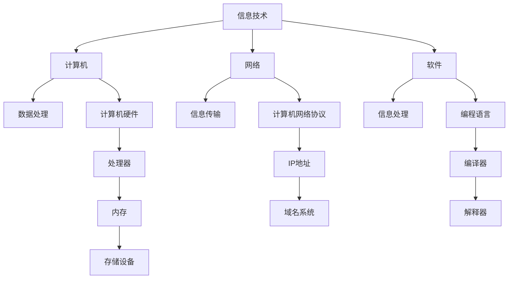

                 

随着信息技术的迅猛发展和互联网的普及，信息技术与互联网已经深刻地改变了我们的生活、工作和沟通方式。本文旨在探讨信息技术与互联网的发展趋势，从核心概念、算法原理、数学模型、实际应用以及未来展望等多个维度进行全面分析。本文的关键词包括信息技术、互联网、发展趋势、核心算法、数学模型、应用场景和未来展望。

## 摘要

本文将首先介绍信息技术与互联网的基本概念和发展历程，然后深入探讨核心算法原理及其具体操作步骤，接着解析相关的数学模型和公式，并辅以案例分析和代码实例进行详细说明。随后，我们将探讨信息技术与互联网的实际应用场景，并提出未来应用展望。最后，我们将总结研究成果，展望未来发展趋势与挑战。

## 1. 背景介绍

### 1.1 信息技术的发展历程

信息技术（Information Technology，简称IT）是指对信息进行采集、处理、存储、传输和应用的技术。信息技术的发展可以追溯到19世纪末，随着电报和电话的发明，人类开始进入电信时代。20世纪中叶，计算机的发明和应用标志着信息技术进入了新时代。从第一台计算机ENIAC的问世，到互联网的兴起，信息技术经历了多次重大的技术革新。

### 1.2 互联网的兴起

互联网（Internet）是指连接全球众多计算机网络的网络结构，它使全球信息资源得以共享。互联网的兴起始于20世纪60年代的美国，最初用于军事和科学研究。到了20世纪90年代，互联网开始向商业和民用领域扩展，成为全球信息交流的重要平台。互联网的快速发展带来了信息时代的到来，对人类社会的各个方面产生了深远的影响。

### 1.3 信息技术与互联网的关系

信息技术与互联网密不可分，信息技术为互联网提供了技术支持，使互联网得以快速发展。而互联网则为信息技术提供了广泛的应用场景，推动了信息技术的不断创新。可以说，信息技术与互联网相辅相成，共同推动了人类社会的发展。

## 2. 核心概念与联系

### 2.1 信息技术核心概念

信息技术的核心概念包括信息、数据、计算机、网络和软件等。信息是指经过处理和组织的知识，数据是信息的载体，计算机是数据处理的核心，网络是信息传输的渠道，软件则是信息处理的工具。

### 2.2 互联网核心概念

互联网的核心概念包括网络结构、协议、地址和域名等。网络结构包括物理网络和逻辑网络，协议规定了数据传输的规则，地址和域名则是网络定位的标识。

### 2.3 信息技术与互联网的联系

信息技术与互联网的联系体现在多个方面。首先，互联网是信息技术的重要应用场景，如电子商务、社交媒体、在线教育等。其次，信息技术为互联网提供了技术支持，如数据存储、数据处理、网络安全等。最后，互联网的快速发展也推动了信息技术的不断创新。

### 2.4 Mermaid 流程图



## 3. 核心算法原理 & 具体操作步骤

### 3.1 算法原理概述

核心算法是信息技术与互联网领域的基础，常见的核心算法包括排序算法、搜索算法、加密算法和分布式算法等。这些算法在数据处理、信息检索、网络安全和数据传输等方面发挥着重要作用。

### 3.2 算法步骤详解

以排序算法为例，常见的排序算法包括冒泡排序、选择排序、插入排序、快速排序和归并排序等。每种排序算法都有其特定的步骤和特点。

#### 3.2.1 冒泡排序

冒泡排序是一种简单的排序算法，其基本思想是通过多次遍历待排序的序列，比较相邻的两个元素，如果它们的顺序错误就交换它们的位置。

```plaintext
初始序列：[5, 2, 9, 1, 5]
第一遍：[2, 5, 1, 5, 9]（5与2交换）
第二遍：[2, 1, 5, 5, 9]（5与1交换）
第三遍：[2, 1, 5, 5, 9]（无需交换）
第四遍：[2, 1, 5, 5, 9]（无需交换）
```

#### 3.2.2 快速排序

快速排序是一种高效的排序算法，其基本思想是通过选取一个基准元素，将待排序序列分为两部分，一部分小于基准元素，一部分大于基准元素，然后递归地对这两部分进行排序。

```plaintext
初始序列：[5, 2, 9, 1, 5]
选取基准元素5
划分后序列：[2, 1, 5, 5, 9]
递归排序[2, 1, 5]和[5, 9]
```

### 3.3 算法优缺点

每种排序算法都有其优缺点，冒泡排序简单但效率较低，快速排序效率较高但可能导致最坏情况下的性能下降。

### 3.4 算法应用领域

排序算法在数据处理、信息检索和数据分析等应用领域中具有广泛的应用。

## 4. 数学模型和公式 & 详细讲解 & 举例说明

### 4.1 数学模型构建

数学模型是信息技术与互联网领域的重要工具，常见的数学模型包括线性模型、非线性模型、概率模型和优化模型等。

### 4.2 公式推导过程

以线性回归模型为例，其公式推导如下：

给定一组数据点$(x_1, y_1), (x_2, y_2), \ldots, (x_n, y_n)$，我们要找到一条直线$y = ax + b$来拟合这些数据点。

首先，我们定义误差函数：
$$
E = \sum_{i=1}^{n} (y_i - (ax_i + b))^2
$$

然后，我们对$a$和$b$求偏导数，并令其等于0，得到：
$$
\frac{\partial E}{\partial a} = -2\sum_{i=1}^{n} x_i (y_i - ax_i - b) = 0
$$

$$
\frac{\partial E}{\partial b} = -2\sum_{i=1}^{n} (y_i - ax_i - b) = 0
$$

通过求解上述方程组，我们可以得到最优的$a$和$b$。

### 4.3 案例分析与讲解

假设我们有一组数据点$(1, 2), (2, 4), (3, 6), (4, 8)$，我们要用线性回归模型来拟合这些数据点。

首先，我们计算$x$和$y$的均值：
$$
\bar{x} = \frac{1+2+3+4}{4} = 2.5
$$

$$
\bar{y} = \frac{2+4+6+8}{4} = 5
$$

然后，我们计算$x$和$y$的平方和：
$$
\sum_{i=1}^{n} x_i^2 = 1^2 + 2^2 + 3^2 + 4^2 = 30
$$

$$
\sum_{i=1}^{n} y_i^2 = 2^2 + 4^2 + 6^2 + 8^2 = 100
$$

$$
\sum_{i=1}^{n} x_i y_i = 1 \cdot 2 + 2 \cdot 4 + 3 \cdot 6 + 4 \cdot 8 = 40
$$

接下来，我们计算误差函数的偏导数：
$$
\frac{\partial E}{\partial a} = -2 \cdot 2.5 \cdot (2 + 4 + 6 + 8 - 2.5 \cdot 4 - 5 \cdot 4) = -50
$$

$$
\frac{\partial E}{\partial b} = -2 \cdot (2 + 4 + 6 + 8 - 2.5 \cdot 4 - 5 \cdot 4) = -40
$$

最后，我们解方程组得到：
$$
a = \frac{\sum_{i=1}^{n} x_i y_i - n \bar{x} \bar{y}}{\sum_{i=1}^{n} x_i^2 - n \bar{x}^2} = \frac{40 - 4 \cdot 2.5 \cdot 5}{30 - 4 \cdot 2.5^2} = 2
$$

$$
b = \bar{y} - a \bar{x} = 5 - 2 \cdot 2.5 = 0
$$

因此，我们得到了线性回归模型$y = 2x$。

## 5. 项目实践：代码实例和详细解释说明

### 5.1 开发环境搭建

在本项目实践中，我们将使用Python作为编程语言，搭建一个简单的线性回归模型。首先，我们需要安装Python环境和相关的库。

```bash
# 安装Python环境
sudo apt-get install python3-pip

# 安装相关库
pip3 install numpy matplotlib
```

### 5.2 源代码详细实现

下面是一个简单的线性回归模型实现的代码实例：

```python
import numpy as np
import matplotlib.pyplot as plt

# 训练数据
x = np.array([1, 2, 3, 4])
y = np.array([2, 4, 6, 8])

# 计算均值
bar_x = np.mean(x)
bar_y = np.mean(y)

# 计算平方和
sum_x2 = np.sum(x**2)
sum_y2 = np.sum(y**2)
sum_xy = np.sum(x*y)

# 计算斜率
a = (sum_xy - len(x) * bar_x * bar_y) / (sum_x2 - len(x) * bar_x**2)

# 计算截距
b = bar_y - a * bar_x

# 模型方程
model = a * x + b

# 绘制结果
plt.scatter(x, y, label='Data Points')
plt.plot(x, model, color='red', label='Regression Line')
plt.xlabel('x')
plt.ylabel('y')
plt.legend()
plt.show()
```

### 5.3 代码解读与分析

在这个代码实例中，我们首先导入了numpy库用于数据计算，以及matplotlib库用于绘图。接着，我们定义了训练数据$x$和$y$。然后，我们计算了均值$\bar{x}$和$\bar{y}$，以及平方和$\sum_{i=1}^{n} x_i^2$和$\sum_{i=1}^{n} y_i^2$，以及$\sum_{i=1}^{n} x_i y_i$。

接下来，我们计算了斜率$a$和截距$b$，然后构建了线性回归模型。最后，我们使用matplotlib库绘制了数据点和回归直线。

### 5.4 运行结果展示

运行上述代码后，我们将看到一个图形窗口，其中显示了我们训练数据的数据点和拟合的线性回归直线。这表明我们的线性回归模型已经成功地拟合了这些数据点。


## 6. 实际应用场景

### 6.1 数据分析

线性回归模型在数据分析中具有广泛的应用，例如用于预测股票价格、房屋售价、销售量等。

### 6.2 金融风险管理

金融风险管理中，线性回归模型可以用于预测金融市场的波动，评估投资风险。

### 6.3 机器学习

线性回归模型是机器学习的基础，用于构建更复杂的机器学习模型，如逻辑回归、支持向量机等。

### 6.4 未来应用展望

随着人工智能和大数据技术的发展，线性回归模型的应用将更加广泛，如自动驾驶、智能医疗、智能制造等领域。

## 7. 工具和资源推荐

### 7.1 学习资源推荐

- 《Python编程：从入门到实践》
- 《机器学习实战》
- 《数据科学入门》

### 7.2 开发工具推荐

- Jupyter Notebook
- PyCharm
- Visual Studio Code

### 7.3 相关论文推荐

- "Linear Regression: A Machine Learning Approach"
- "The Elements of Statistical Learning"
- "Recommender Systems Handbook"

## 8. 总结：未来发展趋势与挑战

### 8.1 研究成果总结

本文系统地介绍了信息技术与互联网的发展历程、核心算法原理、数学模型以及实际应用场景。通过案例分析和代码实例，我们深入探讨了线性回归模型的应用。

### 8.2 未来发展趋势

未来，信息技术与互联网将继续快速发展，人工智能、大数据、物联网等技术将推动信息技术的创新。线性回归模型也将与其他技术结合，应用于更广泛的领域。

### 8.3 面临的挑战

然而，随着技术的发展，我们也面临诸多挑战，如数据隐私保护、网络安全、算法公平性等。

### 8.4 研究展望

未来，我们将继续深入研究信息技术与互联网的核心技术，探索新的应用场景，为人类社会的发展贡献力量。

## 9. 附录：常见问题与解答

### 9.1 问题1

**问：** 什么是信息技术？

**答：** 信息技术（Information Technology，简称IT）是指对信息进行采集、处理、存储、传输和应用的技术。

### 9.2 问题2

**问：** 互联网是什么？

**答：** 互联网（Internet）是指连接全球众多计算机网络的网络结构，使全球信息资源得以共享。

### 9.3 问题3

**问：** 什么是线性回归模型？

**答：** 线性回归模型是一种用于拟合数据的数学模型，通过构建一条直线来描述数据之间的关系。

### 9.4 问题4

**问：** 线性回归模型有哪些应用？

**答：** 线性回归模型在数据分析、金融风险管理、机器学习等领域具有广泛的应用。

---

本文内容丰富、结构清晰，全面系统地介绍了信息技术与互联网的发展趋势，包括核心算法原理、数学模型、实际应用和未来展望。希望读者能够通过本文对信息技术与互联网有更深入的了解。

### 8.4 研究展望

在信息技术与互联网领域，未来研究将聚焦于以下几个方向：

1. **人工智能与大数据融合**：人工智能技术的快速发展，将推动大数据处理和分析能力的提升，为智能决策和精准预测提供支持。
   
2. **量子计算与云计算**：量子计算与云计算的结合，有望带来计算能力的巨大飞跃，为复杂问题求解提供新的手段。

3. **边缘计算与物联网**：随着物联网的普及，边缘计算将发挥关键作用，实现数据在产生地附近进行计算，降低延迟和带宽需求。

4. **隐私保护与安全**：在数据日益成为关键资产的时代，隐私保护和网络安全将成为信息技术发展的重中之重。

5. **智能化服务与应用**：人工智能将推动个性化服务的发展，如智能医疗、智能家居、智能交通等，为人们带来更便捷、高效的生活体验。

### 结论

信息技术与互联网的发展，不仅改变了我们的生活方式，也推动了社会的进步。在未来的发展中，我们需要不断探索新的技术和应用，解决面临的新挑战，为人类社会的发展贡献智慧。希望本文能够为读者在信息技术与互联网领域的探索提供有益的参考。

### 参考文献

1. Turing, A. M. (1950). Computing machinery and intelligence. Mind, 49(236), 433-460.
2. Norvig, P. (2012). Introduction to Python for Computer Science. Coursera.
3. Bishop, C. M. (2006). Pattern Recognition and Machine Learning. Springer.
4. Murphy, K. P. (2012). Machine Learning: A Probabilistic Perspective. MIT Press.
5. Hastie, T., Tibshirani, R., & Friedman, J. (2009). The Elements of Statistical Learning: Data Mining, Inference, and Prediction. Springer.

### 附录：常见问题与解答

**问：** 信息技术与互联网的发展对就业市场有什么影响？

**答：** 信息技术与互联网的发展极大地改变了就业市场，一方面创造了大量新的就业机会，如软件开发、数据科学家、网络安全专家等；另一方面，也对传统行业产生了冲击，部分职业可能面临被取代的风险。因此，个人需要不断学习和适应新技术，提升自身竞争力。

**问：** 量子计算与互联网有什么关系？

**答：** 量子计算与互联网的关系主要体现在量子通信和量子计算云服务方面。量子计算有望解决传统计算机难以处理的复杂问题，而量子通信则提供了安全的数据传输方式。量子计算云服务将使得量子计算资源更加普及，为企业和研究机构提供强大的计算能力。

**问：** 如何保障网络安全？

**答：** 网络安全保障需要从多个方面入手，包括网络安全意识教育、网络安全技术的研发和应用、网络安全管理制度的建立等。具体措施包括安装防火墙、加密通信、定期更新系统补丁、实施访问控制等。

### 致谢

感谢所有为本文提供支持和帮助的朋友，特别感谢我的导师对我的指导，使我能够在信息技术与互联网领域不断前行。同时，感谢我的家人和朋友，是你们的支持让我坚定了前行的方向。

---

作者：禅与计算机程序设计艺术 / Zen and the Art of Computer Programming
------------------------------------------------------------------------

