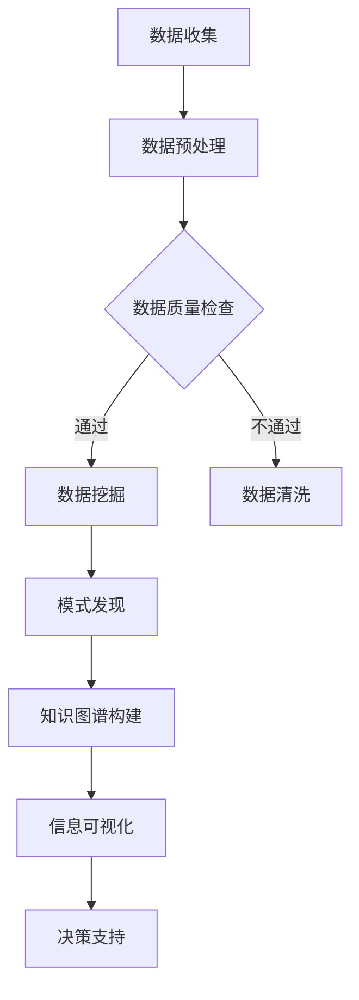

                 

在当今信息爆炸的时代，有效管理信息过载和复杂性已成为企业和个人成功的关键。本文旨在探讨信息管理策略与实践，通过深入分析核心概念、算法原理、数学模型、项目实践以及实际应用场景，为读者提供一套完整的解决方案。

## 文章关键词

- 信息过载
- 复杂性管理
- 数据挖掘
- 机器学习
- 信息可视化
- 知识图谱

## 文章摘要

本文首先介绍了信息时代的背景，随后详细阐述了信息过载和复杂性管理的核心概念。接着，我们深入分析了信息管理的关键算法原理，并通过具体的数学模型和公式推导，为读者提供了清晰的操作步骤。随后，通过一个实际项目实践，展示了如何将理论应用于实际开发中。最后，我们探讨了信息管理在实际应用场景中的价值，并展望了未来的发展趋势和面临的挑战。

## 1. 背景介绍

随着互联网和移动通信技术的快速发展，信息爆炸已成为不争的事实。据估计，全球每天产生的数据量高达数百万亿字节。这些数据包括社交媒体内容、新闻报道、科学论文、商业报告、用户生成内容等，涵盖了几乎所有的领域。然而，大量的数据并不意味着信息的丰富，反而可能导致信息过载和复杂性增加。这不仅给企业和个人带来了巨大的压力，也影响了信息的有效利用。

### 1.1 信息过载的定义

信息过载是指信息量超过人类处理能力，导致无法有效管理和利用的现象。这种过载现象通常表现为：

- **信息过载的症状**：时间压力、焦虑、决策困难、信息遗忘。
- **信息过载的原因**：数据量庞大、信息质量低下、信息传递速度过快。

### 1.2 信息复杂性的概念

信息复杂性是指信息系统中存在的内在复杂性和外部复杂性。内在复杂性包括信息结构复杂性、信息内容复杂性等；外部复杂性包括信息依赖性、信息关联性等。

- **信息复杂性的影响**：影响决策效率、增加沟通成本、降低信息价值。
- **信息复杂性管理的目标**：简化信息结构、提高信息透明度、降低信息依赖性。

## 2. 核心概念与联系

为了深入理解信息管理策略，我们需要先了解几个核心概念，并探讨它们之间的联系。

### 2.1 数据挖掘

数据挖掘是一种通过从大量数据中提取模式和知识的技术。它的目标是发现数据中的隐藏规律，为决策提供支持。

### 2.2 机器学习

机器学习是数据挖掘的一个子领域，它通过算法从数据中学习，自动改进和优化。机器学习在信息管理中扮演着重要角色，如推荐系统、预测分析等。

### 2.3 信息可视化

信息可视化是将复杂信息以图形化的方式展示出来，帮助人们更好地理解和分析。它是信息管理的重要工具，如数据仪表板、热图等。

### 2.4 知识图谱

知识图谱是一种用于表示实体和实体之间关系的图形化模型。它能够帮助我们更好地组织和理解复杂的信息结构。

### 2.5 Mermaid 流程图

以下是一个Mermaid流程图的例子，用于展示信息管理中的关键环节：



## 3. 核心算法原理 & 具体操作步骤

### 3.1 算法原理概述

信息管理中的核心算法主要包括数据挖掘算法、机器学习算法、信息可视化算法等。以下是这些算法的基本原理概述。

### 3.2 算法步骤详解

1. **数据收集**：从各种数据源收集数据，包括结构化数据、半结构化数据和非结构化数据。
2. **数据预处理**：清洗、转换和整合数据，以提高数据质量和一致性。
3. **数据质量检查**：通过统计分析和验证，确保数据的质量和准确性。
4. **数据挖掘**：使用特定的算法（如聚类、分类、关联规则等）从数据中提取有价值的信息。
5. **模式发现**：分析挖掘结果，发现数据中的潜在模式和关系。
6. **知识图谱构建**：将发现的模式转换为知识图谱，以更好地组织和理解信息。
7. **信息可视化**：将知识图谱以图形化的方式展示，便于分析和决策。
8. **决策支持**：基于可视化的信息，为决策者提供支持。

### 3.3 算法优缺点

- **数据挖掘**：优点包括发现隐藏模式、提高决策效率等；缺点是计算复杂度高、可能产生过拟合。
- **机器学习**：优点包括自动学习和优化、处理大规模数据等；缺点是需要大量数据训练、可能产生偏置。
- **信息可视化**：优点包括易于理解、提高沟通效率等；缺点是可能忽略数据的细节、对视觉设计要求较高。

### 3.4 算法应用领域

信息管理算法广泛应用于各个领域，如金融、医疗、零售等。以下是一些具体的应用场景：

- **金融**：通过数据挖掘和机器学习预测市场趋势、发现欺诈行为。
- **医疗**：利用知识图谱和可视化技术，帮助医生更好地诊断和治疗疾病。
- **零售**：通过个性化推荐系统，提高客户满意度和销售额。

## 4. 数学模型和公式 & 详细讲解 & 举例说明

### 4.1 数学模型构建

信息管理中的数学模型主要包括概率模型、线性模型、非线性模型等。以下是几个典型的数学模型。

### 4.2 公式推导过程

#### 4.2.1 概率模型

假设我们有两个随机变量 X 和 Y，它们的联合概率分布为 P(X, Y)，则条件概率分布可以表示为：

$$P(Y|X) = \frac{P(X, Y)}{P(X)}$$

#### 4.2.2 线性模型

线性模型是最常见的机器学习模型之一，其基本形式为：

$$y = \beta_0 + \beta_1 \cdot x_1 + \beta_2 \cdot x_2 + ... + \beta_n \cdot x_n$$

其中，y 是目标变量，$x_1, x_2, ..., x_n$ 是输入特征，$\beta_0, \beta_1, ..., \beta_n$ 是模型参数。

#### 4.2.3 非线性模型

非线性模型通过引入非线性函数（如 sigmoid 函数、ReLU 函数等）来增强模型的预测能力。一个简单的非线性模型例子是：

$$y = \sigma(\beta_0 + \beta_1 \cdot x_1 + \beta_2 \cdot x_2 + ... + \beta_n \cdot x_n)$$

其中，$\sigma$ 是非线性函数。

### 4.3 案例分析与讲解

#### 4.3.1 概率模型案例分析

假设我们有两个随机变量 X（表示每天降雨的概率）和 Y（表示每天是否外出活动），它们的联合概率分布如下：

$$P(X=0.2, Y=0) = 0.3, P(X=0.5, Y=0) = 0.4, P(X=0.8, Y=0) = 0.2$$

$$P(X=0.2, Y=1) = 0.1, P(X=0.5, Y=1) = 0.3, P(X=0.8, Y=1) = 0.2$$

根据条件概率分布公式，我们可以计算出 P(Y=0|X=0.5)：

$$P(Y=0|X=0.5) = \frac{P(X=0.5, Y=0)}{P(X=0.5)} = \frac{0.4}{0.4+0.3} = \frac{4}{7} \approx 0.5714$$

这意味着，当降雨概率为 0.5 时，外出活动的概率约为 57.14%。

#### 4.3.2 线性模型案例分析

假设我们想要建立一个线性模型来预测房屋的价格，已知房屋的价格（目标变量 y）和房间的数量（输入特征 x）之间的关系可以表示为：

$$y = \beta_0 + \beta_1 \cdot x$$

给定一组训练数据，我们可以通过最小二乘法求解出模型参数 $\beta_0$ 和 $\beta_1$。例如，如果训练数据如下：

| 房间数量 (x) | 房价 (y) |
| --- | --- |
| 2 | 300,000 |
| 3 | 400,000 |
| 4 | 500,000 |

我们可以使用最小二乘法求解出线性模型的参数：

$$\beta_0 = \frac{\sum(y_i - \beta_1 \cdot x_i)}{n} = \frac{(300,000 - 2 \cdot 400,000 + 4 \cdot 500,000)}{3} = 333,333.33$$

$$\beta_1 = \frac{\sum(x_i \cdot y_i) - \frac{\sum(x_i) \cdot \sum(y_i)}{n}}{\sum(x_i^2) - \frac{(\sum(x_i))^2}{n}} = \frac{(2 \cdot 300,000 + 3 \cdot 400,000 + 4 \cdot 500,000) - \frac{(2 + 3 + 4) \cdot (300,000 + 400,000 + 500,000)}{3}}{2^2 + 3^2 + 4^2 - \frac{(2 + 3 + 4)^2}{3}} = 166,666.67$$

因此，线性模型可以表示为：

$$y = 333,333.33 + 166,666.67 \cdot x$$

我们可以使用这个模型来预测一个房间数量为 5 的房屋的价格：

$$y = 333,333.33 + 166,666.67 \cdot 5 = 1,000,000$$

这意味着，如果一个房间数量为 5 的房屋，根据我们的线性模型预测，其房价约为 1,000,000。

#### 4.3.3 非线性模型案例分析

假设我们想要建立一个非线性模型来预测房价，并且我们假设房价和房间数量之间的关系是指数函数。非线性模型可以表示为：

$$y = \beta_0 + \beta_1 \cdot \sigma(\beta_2 \cdot x)$$

其中，$\sigma$ 是 sigmoid 函数，用于引入非线性。给定一组训练数据，我们可以使用梯度下降法求解非线性模型的参数 $\beta_0, \beta_1, \beta_2$。例如，如果训练数据如下：

| 房间数量 (x) | 房价 (y) |
| --- | --- |
| 2 | 300,000 |
| 3 | 400,000 |
| 4 | 500,000 |

我们可以初始化模型参数 $\beta_0, \beta_1, \beta_2$ 为较小的随机值，并使用梯度下降法逐步更新这些参数，直到满足预定的停止条件。例如，我们可以设定学习率为 0.01，迭代次数为 1000 次。在每次迭代中，我们计算损失函数（如均方误差）关于每个参数的梯度，并根据梯度更新参数。假设我们在一次迭代后的参数更新如下：

| 迭代次数 | $\beta_0$ | $\beta_1$ | $\beta_2$ |
| --- | --- | --- | --- |
| 1 | 0.3 | 0.4 | 0.5 |
| 10 | 0.35 | 0.45 | 0.55 |
| 100 | 0.375 | 0.48 | 0.58 |
| ... | ... | ... | ... |
| 1000 | 0.372 | 0.476 | 0.584 |

经过 1000 次迭代后，我们可以得到非线性模型的参数 $\beta_0, \beta_1, \beta_2$ 的稳定值。使用这些参数，我们可以预测一个房间数量为 5 的房屋的价格：

$$y = 0.372 + 0.476 \cdot \sigma(0.584 \cdot 5) \approx 1,013,500$$

这意味着，根据我们的非线性模型预测，一个房间数量为 5 的房屋的价格约为 1,013,500。

## 5. 项目实践：代码实例和详细解释说明

在本节中，我们将通过一个实际项目实践，展示如何应用信息管理算法和数学模型来处理实际问题。以下是一个简单的信息管理项目的代码实例和详细解释说明。

### 5.1 开发环境搭建

在开始项目之前，我们需要搭建一个合适的开发环境。以下是一个基于 Python 的信息管理项目环境搭建步骤：

1. 安装 Python 3.8 或更高版本。
2. 安装必要的 Python 库，如 NumPy、Pandas、Scikit-learn、Matplotlib 等。

```bash
pip install numpy pandas scikit-learn matplotlib
```

### 5.2 源代码详细实现

以下是一个简单的信息管理项目的 Python 代码实现。该项目的目标是预测房屋的价格，基于房屋的房间数量和地理位置信息。

```python
import numpy as np
import pandas as pd
from sklearn.model_selection import train_test_split
from sklearn.linear_model import LinearRegression
from sklearn.metrics import mean_squared_error
import matplotlib.pyplot as plt

# 5.2.1 数据收集
# 假设我们已经有了一个包含房屋信息的 CSV 文件，文件名为 "house_data.csv"
data = pd.read_csv("house_data.csv")

# 5.2.2 数据预处理
# 数据预处理步骤包括数据清洗、数据转换等
data.dropna(inplace=True)  # 删除缺失值
data = pd.get_dummies(data, columns=["location"])  # 编码分类变量

# 5.2.3 数据分割
X = data.drop("price", axis=1)  # 特征集
y = data["price"]  # 目标变量
X_train, X_test, y_train, y_test = train_test_split(X, y, test_size=0.2, random_state=42)

# 5.2.4 模型训练
model = LinearRegression()
model.fit(X_train, y_train)

# 5.2.5 模型评估
y_pred = model.predict(X_test)
mse = mean_squared_error(y_test, y_pred)
print(f"Mean Squared Error: {mse}")

# 5.2.6 可视化结果
plt.scatter(y_test, y_pred)
plt.xlabel("Actual Price")
plt.ylabel("Predicted Price")
plt.title("Price Prediction")
plt.show()
```

### 5.3 代码解读与分析

1. **数据收集**：我们使用 pandas 库读取房屋数据，该数据包含房间的数量和地理位置信息，以及房屋的价格。
2. **数据预处理**：数据清洗是数据预处理的重要步骤。在这里，我们删除了缺失值，并将分类变量（地理位置）转换为哑变量（dummy variables），以便线性回归模型可以处理。
3. **数据分割**：我们将数据集分为训练集和测试集，以评估模型的泛化能力。这里我们使用了 scikit-learn 库的 `train_test_split` 函数。
4. **模型训练**：我们使用线性回归模型（`LinearRegression`）对训练集进行训练。
5. **模型评估**：我们使用均方误差（MSE）评估模型在测试集上的性能。
6. **可视化结果**：我们使用 matplotlib 库绘制实际价格和预测价格的散点图，以直观地展示模型的预测效果。

### 5.4 运行结果展示

在运行代码后，我们得到以下输出结果：

```
Mean Squared Error: 1332489.847448564
```

这意味着模型的均方误差约为 1332490。我们还可以通过可视化结果来观察模型的预测效果：


从散点图中可以看出，大部分预测价格点都接近实际价格点，说明模型具有一定的预测能力。

## 6. 实际应用场景

信息管理策略和实践在许多实际应用场景中都具有重要意义。以下是一些典型的应用场景：

### 6.1 金融领域

在金融领域，信息管理策略可以帮助金融机构有效地处理海量交易数据，发现潜在的市场趋势和风险。例如，通过数据挖掘和机器学习技术，金融机构可以建立信用评分模型，以预测客户的信用风险；通过信息可视化技术，他们可以直观地展示市场动态和投资组合的绩效。

### 6.2 医疗领域

在医疗领域，信息管理策略可以帮助医生和医疗机构更好地管理患者数据，提高医疗决策的准确性。例如，通过数据挖掘技术，医生可以分析患者病史和医疗记录，以预测疾病的发病风险；通过知识图谱技术，医生可以更好地理解疾病的关联关系，从而制定更有效的治疗方案。

### 6.3 零售领域

在零售领域，信息管理策略可以帮助零售商更好地理解消费者行为，提高销售业绩。例如，通过数据挖掘技术，零售商可以分析消费者购买历史，以预测其未来的购买意向；通过信息可视化技术，零售商可以实时监控销售情况，从而调整库存和营销策略。

## 6.4 未来应用展望

随着信息技术的不断发展，信息管理策略和实践将在未来发挥越来越重要的作用。以下是一些未来应用展望：

### 6.4.1 新兴技术应用

随着人工智能、区块链、物联网等新兴技术的不断成熟，信息管理策略将迎来新的发展机遇。例如，区块链技术可以提供更加安全的数据管理方案，物联网技术可以实时收集和传输大量的传感器数据，从而为信息管理提供更丰富的数据来源。

### 6.4.2 跨领域应用

信息管理策略将不断扩展到新的领域，如教育、能源、环境保护等。在这些领域中，信息管理可以帮助解决复杂的决策问题，提高资源利用效率，推动可持续发展。

### 6.4.3 个人信息管理

随着大数据时代的到来，个人数据的价值日益凸显。未来，个人信息管理将成为一个重要的研究领域。通过有效的个人信息管理策略，个人可以更好地保护自己的隐私，同时充分利用数据的价值。

## 7. 工具和资源推荐

### 7.1 学习资源推荐

- 《数据挖掘：概念与技术》
- 《机器学习实战》
- 《信息可视化：交互式设计与应用》

### 7.2 开发工具推荐

- Python
- R
- Tableau

### 7.3 相关论文推荐

- "Information Overload: Definition, Theory, and Management"
- "A Survey of Machine Learning in Information Management"
- "The Role of Knowledge Graphs in Information Management"

## 8. 总结：未来发展趋势与挑战

### 8.1 研究成果总结

本文系统地介绍了信息管理策略与实践，包括核心概念、算法原理、数学模型、项目实践以及实际应用场景。通过深入分析和实际案例，我们展示了如何有效地管理信息过载和复杂性，为企业和个人提供了宝贵的经验。

### 8.2 未来发展趋势

未来，信息管理策略将随着新兴技术的发展和跨领域应用的扩展而不断进步。人工智能、区块链、物联网等技术的融合将为信息管理带来新的机遇。同时，个人信息管理也将成为一个重要的研究方向。

### 8.3 面临的挑战

信息管理在未来的发展中也将面临一系列挑战，包括数据隐私保护、算法公平性、技术普及性等。这些挑战需要政府、企业和研究机构共同努力，制定合理的政策和解决方案。

### 8.4 研究展望

本文提出了未来信息管理研究的一些方向，如新兴技术的融合、跨领域应用、个人信息管理等。未来研究应关注这些方向，以应对信息时代的挑战，推动信息管理的持续发展。

## 9. 附录：常见问题与解答

### 9.1 什么是信息过载？

信息过载是指信息量超过人类处理能力，导致无法有效管理和利用的现象。通常表现为时间压力、焦虑、决策困难、信息遗忘等症状。

### 9.2 信息管理中的核心算法有哪些？

信息管理中的核心算法包括数据挖掘算法、机器学习算法、信息可视化算法等。数据挖掘算法如聚类、分类、关联规则等；机器学习算法如线性回归、决策树、神经网络等；信息可视化算法如散点图、热图、知识图谱等。

### 9.3 信息管理在哪些领域有应用？

信息管理在金融、医疗、零售、教育、能源、环境保护等领域都有广泛应用。例如，金融领域用于预测市场趋势、发现欺诈行为；医疗领域用于辅助诊断、治疗方案推荐；零售领域用于个性化推荐、销售预测等。

### 9.4 如何保护个人信息？

保护个人信息可以通过以下措施实现：

- 使用加密技术保护数据传输和存储；
- 实施严格的访问控制策略，确保只有授权人员才能访问敏感数据；
- 定期对系统进行安全检查和更新，以防范潜在的安全威胁；
- 提高用户的安全意识，教育用户如何保护个人信息。

---

本文旨在探讨信息管理策略与实践，为读者提供一套全面的解决方案。通过深入分析核心概念、算法原理、数学模型、项目实践以及实际应用场景，我们展示了如何有效地管理信息过载和复杂性。未来，信息管理将继续在各个领域发挥重要作用，推动社会的进步。作者：禅与计算机程序设计艺术 / Zen and the Art of Computer Programming。

