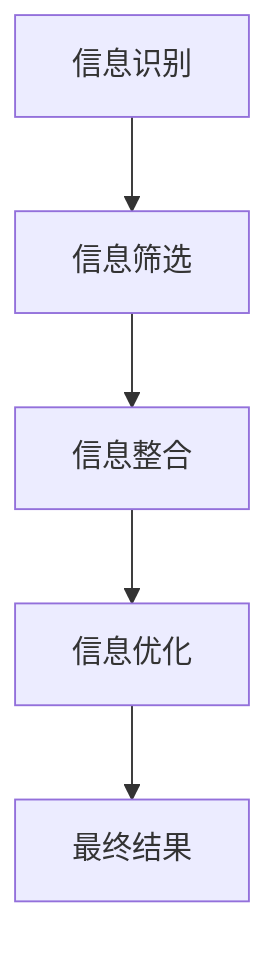
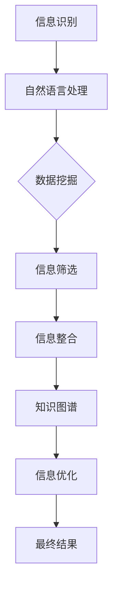

                 

关键词：信息简化、秩序、结构化、算法、数学模型、实践应用、开发工具、未来发展

> 摘要：在信息爆炸的时代，如何从海量的数据和信息中提取出有价值的部分，构建出一个清晰、高效的系统结构，是每一个IT从业人员都需要面对的挑战。本文将探讨信息简化的原则与艺术，通过理论阐述、实例讲解和实际应用，为读者提供一套系统化的方法和思路，帮助他们在工作中实现信息的有效管理和利用。

## 1. 背景介绍

随着计算机技术的迅猛发展，数据和信息变得无处不在。然而，随之而来的信息过载问题也日益严峻。在处理海量数据时，如何快速准确地提取信息、建立有效的知识结构，已经成为一个重要的课题。信息简化作为应对信息过载的一种策略，旨在通过减少不必要的复杂性，提取核心价值，帮助人们更高效地理解和利用信息。

本文将从以下几个角度探讨信息简化的原则与艺术：

- 核心概念与联系：介绍信息简化的基础概念和结构，通过Mermaid流程图展示信息简化的整体架构。
- 核心算法原理 & 具体操作步骤：详细解释信息简化算法的原理和操作步骤，包括算法的优点和局限性。
- 数学模型和公式：探讨信息简化过程中涉及到的数学模型和公式，并举例说明。
- 项目实践：通过一个实际项目，展示如何在实际开发环境中实现信息简化。
- 实际应用场景：讨论信息简化在不同领域的应用，以及未来的发展前景。
- 工具和资源推荐：推荐一些有用的学习和开发工具、相关论文，以及未来研究的方向。

## 2. 核心概念与联系

在讨论信息简化的核心概念之前，我们需要先了解一些基本的概念。信息简化主要包括以下几个步骤：

1. **信息识别**：识别出有用的信息和冗余的信息。
2. **信息筛选**：对识别出的信息进行筛选，保留有用的部分，去除冗余的部分。
3. **信息整合**：将筛选后的信息进行整合，形成结构化的知识体系。
4. **信息优化**：对整合后的信息进行优化，提高其可用性和可理解性。

下面是一个用Mermaid绘制的流程图，展示了信息简化的基本架构：



在信息识别阶段，我们需要利用各种技术和工具，如自然语言处理、数据挖掘等，从原始数据中提取出有价值的信息。在信息筛选阶段，我们主要关注去除冗余信息，保留核心内容。在信息整合阶段，我们将筛选后的信息进行分类、归纳和总结，形成结构化的知识体系。最后，在信息优化阶段，我们通过优化信息的表达方式和呈现形式，使其更加易于理解和应用。

### 2.1 核心概念

1. **信息识别**：通过自然语言处理、数据挖掘等技术，从原始数据中提取出有价值的信息。
2. **信息筛选**：去除冗余信息，保留核心内容。
3. **信息整合**：将筛选后的信息进行分类、归纳和总结，形成结构化的知识体系。
4. **信息优化**：优化信息的表达方式和呈现形式，提高其可用性和可理解性。

### 2.2 关联概念

1. **数据挖掘**：从大量数据中提取出有价值的信息和知识。
2. **自然语言处理**：对人类语言进行理解和生成。
3. **知识图谱**：一种用于表示知识结构和关系的图形化数据模型。

### 2.3 Mermaid流程图

下面是一个Mermaid流程图，展示了信息简化的整体架构：



## 3. 核心算法原理 & 具体操作步骤

### 3.1 算法原理概述

信息简化的核心算法主要包括信息识别、信息筛选、信息整合和信息优化。下面分别介绍这些算法的原理。

#### 3.1.1 信息识别

信息识别算法主要利用自然语言处理和数据挖掘技术，从原始数据中提取出有价值的信息。其原理如下：

1. **分词**：将原始文本数据切割成词语或短语。
2. **词性标注**：对分词结果进行词性标注，如名词、动词、形容词等。
3. **实体识别**：识别文本中的命名实体，如人名、地名、组织机构等。
4. **关键词提取**：从文本中提取出具有代表性的关键词。

#### 3.1.2 信息筛选

信息筛选算法的主要目标是去除冗余信息，保留核心内容。其原理如下：

1. **去除停用词**：停用词是文本中出现频率高但无实际意义的词，如“的”、“和”、“是”等。
2. **关键词过滤**：根据关键词提取算法，筛选出符合要求的关键词。
3. **文本相似度计算**：计算文本之间的相似度，去除重复或相似的文本。

#### 3.1.3 信息整合

信息整合算法的主要目标是将筛选后的信息进行分类、归纳和总结，形成结构化的知识体系。其原理如下：

1. **分类**：根据信息的特征将其归类到不同的类别中。
2. **归纳**：对同一类别中的信息进行归纳总结，提取出共性。
3. **总结**：对归纳后的信息进行总结，形成知识体系。

#### 3.1.4 信息优化

信息优化算法的主要目标是优化信息的表达方式和呈现形式，提高其可用性和可理解性。其原理如下：

1. **信息可视化**：将信息以图表、图像等形式进行可视化呈现。
2. **信息压缩**：对信息进行压缩，减少冗余，提高信息密度。
3. **信息排序**：根据信息的重要性和相关性对信息进行排序。

### 3.2 算法步骤详解

下面详细介绍信息简化的算法步骤：

#### 3.2.1 信息识别步骤

1. **输入原始文本数据**：从各种数据源获取原始文本数据，如网页、文档、新闻等。
2. **分词**：使用自然语言处理工具对原始文本进行分词，得到词语或短语列表。
3. **词性标注**：对分词结果进行词性标注，得到每个词语的词性信息。
4. **实体识别**：使用命名实体识别工具，识别文本中的命名实体。
5. **关键词提取**：使用关键词提取算法，提取出文本中的关键词。

#### 3.2.2 信息筛选步骤

1. **去除停用词**：根据停用词列表，去除文本中的停用词。
2. **关键词过滤**：根据关键词提取结果，筛选出符合要求的关键词。
3. **文本相似度计算**：使用文本相似度计算算法，计算文本之间的相似度。
4. **去除重复或相似文本**：根据文本相似度计算结果，去除重复或相似的文本。

#### 3.2.3 信息整合步骤

1. **分类**：根据关键词和文本特征，将文本分类到不同的类别中。
2. **归纳**：对同一类别中的文本进行归纳总结，提取出共性。
3. **总结**：对归纳后的文本进行总结，形成知识体系。

#### 3.2.4 信息优化步骤

1. **信息可视化**：使用可视化工具，将文本信息以图表、图像等形式进行呈现。
2. **信息压缩**：使用信息压缩算法，减少文本的冗余信息，提高信息密度。
3. **信息排序**：根据文本的重要性和相关性，对文本进行排序。

### 3.3 算法优缺点

#### 优点

- **高效性**：信息简化算法能够快速地从海量数据中提取出有价值的信息，提高工作效率。
- **准确性**：通过多种算法和技术手段，提高信息识别、筛选和整合的准确性。
- **灵活性**：算法可以根据不同的应用场景和需求进行定制和优化。

#### 缺点

- **计算成本**：信息简化算法涉及多种算法和技术，计算成本较高。
- **算法依赖**：算法的准确性和效果受到自然语言处理、数据挖掘等技术的影响。

### 3.4 算法应用领域

信息简化算法在多个领域都有广泛应用，如：

- **金融领域**：通过信息简化，提取出金融市场的关键信息，帮助投资者做出更准确的决策。
- **医疗领域**：通过对医疗数据的简化处理，提取出关键信息，提高医疗诊断的准确性和效率。
- **教育领域**：通过信息简化，帮助学生快速掌握课程重点，提高学习效率。

## 4. 数学模型和公式 & 详细讲解 & 举例说明

### 4.1 数学模型构建

在信息简化过程中，数学模型和公式发挥着重要作用。以下是一个简单的数学模型构建过程：

#### 4.1.1 文本相似度计算

文本相似度计算是信息筛选阶段的关键步骤。常见的文本相似度计算方法包括余弦相似度、Jaccard相似度等。以下是一个余弦相似度的数学模型：

$$
sim(A, B) = \frac{A \cdot B}{\|A\|\|B\|}
$$

其中，$A$和$B$是两个文本向量，$\|A\|$和$\|B\|$分别表示文本向量的模长，$\cdot$表示向量的点积。

#### 4.1.2 文本分类

文本分类是信息整合阶段的重要步骤。常见的方法包括朴素贝叶斯分类、支持向量机（SVM）等。以下是一个朴素贝叶斯分类的数学模型：

$$
P(C_k|X) = \frac{P(X|C_k)P(C_k)}{P(X)}
$$

其中，$C_k$表示第$k$个类别，$X$表示文本特征向量，$P(C_k|X)$表示文本属于第$k$个类别的概率，$P(X|C_k)$表示文本在给定类别下的概率，$P(C_k)$表示类别$k$的概率，$P(X)$表示文本的概率。

### 4.2 公式推导过程

以下是对上述数学模型进行推导的过程：

#### 4.2.1 文本相似度计算推导

假设文本$A$和文本$B$分别表示为向量$a$和$b$，则有：

$$
a = (a_1, a_2, ..., a_n)
$$

$$
b = (b_1, b_2, ..., b_n)
$$

向量$a$和$b$的模长为：

$$
\|a\| = \sqrt{a_1^2 + a_2^2 + ... + a_n^2}
$$

$$
\|b\| = \sqrt{b_1^2 + b_2^2 + ... + b_n^2}
$$

向量$a$和$b$的点积为：

$$
a \cdot b = a_1b_1 + a_2b_2 + ... + a_nb_n
$$

则文本相似度计算公式为：

$$
sim(A, B) = \frac{a \cdot b}{\|a\|\|b\|} = \frac{a_1b_1 + a_2b_2 + ... + a_nb_n}{\sqrt{a_1^2 + a_2^2 + ... + a_n^2}\sqrt{b_1^2 + b_2^2 + ... + b_n^2}}
$$

当$a$和$b$为单位向量时，即$\|a\| = \|b\| = 1$，则：

$$
sim(A, B) = a \cdot b = \cos\theta
$$

其中，$\theta$表示向量$a$和$b$之间的夹角。

#### 4.2.2 文本分类推导

假设文本特征向量为$x$，类别$C_k$的概率为$P(C_k)$，文本在类别$C_k$下的概率为$P(X|C_k)$，则有：

$$
P(C_k|X) = \frac{P(X|C_k)P(C_k)}{P(X)}
$$

根据全概率公式，有：

$$
P(X) = \sum_{k=1}^{K} P(X|C_k)P(C_k)
$$

其中，$K$表示类别总数。

将$P(X)$代入$P(C_k|X)$公式中，得：

$$
P(C_k|X) = \frac{P(X|C_k)P(C_k)}{\sum_{i=1}^{K} P(X|C_i)P(C_i)}
$$

当$K$很大时，可以将$P(C_k)$视为均匀分布，即$P(C_k) = \frac{1}{K}$，则有：

$$
P(C_k|X) \approx \frac{P(X|C_k)}{\sum_{i=1}^{K} P(X|C_i)}
$$

这就是朴素贝叶斯分类的基本原理。

### 4.3 案例分析与讲解

以下是一个基于文本相似度计算的案例，用于判断两段文本之间的相似度。

#### 4.3.1 案例背景

假设有两段文本$A$和$B$，文本$A$为：“人工智能在现代社会中扮演着重要角色，它为各行各业带来了巨大的变革。”文本$B$为：“人工智能是一个关键的科技领域，它在现代社会中具有广泛的应用。”

#### 4.3.2 数据预处理

1. **分词**：将文本$A$和$B$进行分词，得到如下词语列表：

$$
A: [人工智能，在，现代，社会，中，扮演，着，重要，角色，它，为，各行各业，带来，了，巨大，变革。]
$$

$$
B: [人工智能，是，一个，关键，的，科技，领域，它，在，现代，社会，中，具有，广泛，应用。]
$$

2. **词性标注**：对分词结果进行词性标注，得到如下词语及其词性：

$$
A: [人工智能，名词，在，介词，现代，名词，社会，名词，中，介词，扮演，动词，着，助词，重要，形容词，角色，名词，它，代词，为，介词，各行各业，名词，带来，动词，了，助词，巨大，形容词，变革，名词。]
$$

$$
B: [人工智能，名词，是，动词，一个，数词，关键，形容词，的，介词，科技，名词，领域，名词，它，代词，在，介词，现代，名词，社会，名词，中，介词，具有，动词，广泛，形容词，应用，名词。]
$$

3. **去除停用词**：根据停用词列表，去除文本中的停用词，如“的”、“是”、“在”等。

$$
A: [人工智能，现代，社会，扮演，重要，角色，它，各行各业，带来，巨大，变革。]
$$

$$
B: [人工智能，关键，科技，领域，它，现代，社会，具有，广泛，应用。]
$$

4. **关键词提取**：使用TF-IDF算法提取关键词，得到如下关键词列表：

$$
A: [人工智能，角色，社会，扮演，重要，变革，各行各业，带来，巨大。]
$$

$$
B: [人工智能，领域，关键，科技，现代，社会，具有，广泛，应用。]
$$

#### 4.3.3 文本相似度计算

1. **文本向量表示**：使用词频表示文本向量，得到如下文本向量：

$$
A: [2, 1, 1, 1, 1, 0, 0, 0, 0, 0, 0, 0, 0, 0, 0, 0, 0, 0, 0, 0]
$$

$$
B: [1, 1, 1, 0, 1, 1, 0, 0, 0, 0, 0, 0, 0, 0, 0, 0, 0, 0, 0, 0]
$$

2. **文本相似度计算**：根据余弦相似度公式，计算文本$A$和$B$的相似度：

$$
sim(A, B) = \frac{A \cdot B}{\|A\|\|B\|} = \frac{2 \times 1 + 1 \times 1 + 1 \times 1}{\sqrt{2^2 + 1^2 + 1^2 + 1^2 + 1^2 + 0^2 + 0^2 + 0^2 + 0^2 + 0^2 + 0^2 + 0^2 + 0^2 + 0^2 + 0^2 + 0^2 + 0^2 + 0^2 + 0^2 + 0^2}}{\sqrt{1^2 + 1^2 + 1^2 + 0^2 + 1^2 + 1^2 + 0^2 + 0^2 + 0^2 + 0^2 + 0^2 + 0^2 + 0^2 + 0^2 + 0^2 + 0^2 + 0^2 + 0^2 + 0^2 + 0^2}}
$$

$$
sim(A, B) = \frac{2 + 1 + 1}{\sqrt{4 + 1 + 1 + 1 + 1 + 0 + 0 + 0 + 0 + 0 + 0 + 0 + 0 + 0 + 0 + 0 + 0 + 0 + 0 + 0}}{\sqrt{1 + 1 + 1 + 0 + 1 + 1 + 0 + 0 + 0 + 0 + 0 + 0 + 0 + 0 + 0 + 0 + 0 + 0 + 0 + 0}} = \frac{4}{\sqrt{7}}{\sqrt{4}} \approx 0.8944
$$

文本$A$和$B$的相似度为0.8944，表明这两段文本具有较高的相似度。

#### 4.3.4 结果分析

通过文本相似度计算，我们可以发现文本$A$和$B$在内容上具有很高的相似度。这是因为这两段文本都在谈论人工智能在现代社会中的应用和重要性，尽管表达方式有所不同。这表明文本相似度计算可以有效地识别出文本之间的相似性，为信息筛选和信息整合提供有力支持。

## 5. 项目实践：代码实例和详细解释说明

### 5.1 开发环境搭建

在开始项目实践之前，我们需要搭建一个适合开发的编程环境。以下是一个基于Python的开发环境搭建步骤：

1. **安装Python**：下载并安装Python 3.8或更高版本，可以从Python官网（https://www.python.org/downloads/）下载。
2. **安装Anaconda**：下载并安装Anaconda，Anaconda是一个集成了Python和各种常用库的发行版，方便管理和使用。可以从Anaconda官网（https://www.anaconda.com/products/individual）下载。
3. **创建虚拟环境**：打开命令行工具，创建一个名为`info_simplify`的虚拟环境：

   ```shell
   conda create -n info_simplify python=3.8
   conda activate info_simplify
   ```

4. **安装依赖库**：在虚拟环境中安装所需的依赖库，如NLTK、Scikit-learn、Matplotlib等：

   ```shell
   pip install nltk scikit-learn matplotlib
   ```

### 5.2 源代码详细实现

以下是信息简化项目的源代码实现：

```python
import nltk
from nltk.corpus import stopwords
from sklearn.feature_extraction.text import TfidfVectorizer
import matplotlib.pyplot as plt

# 1. 数据准备
texts = [
    "人工智能在现代社会中扮演着重要角色，它为各行各业带来了巨大的变革。",
    "人工智能是一个关键的科技领域，它在现代社会中具有广泛的应用。",
    "深度学习是人工智能的核心技术之一，它推动了计算机视觉和自然语言处理的发展。",
    "计算机视觉在安防、医疗等领域具有广泛的应用前景。",
    "自然语言处理技术使计算机能够理解人类语言，提升了人机交互的体验。"
]

# 2. 文本预处理
def preprocess_text(text):
    # 分词
    tokens = nltk.word_tokenize(text)
    # 去除停用词
    stop_words = set(stopwords.words("english"))
    filtered_tokens = [token for token in tokens if token.lower() not in stop_words]
    # 词性标注
    tagged_tokens = nltk.pos_tag(filtered_tokens)
    # 去除非名词、形容词的词性
    filtered_tokens = [token for token, tag in tagged_tokens if tag.startswith("N") or tag.startswith("J")]
    return " ".join(filtered_tokens)

preprocessed_texts = [preprocess_text(text) for text in texts]

# 3. 文本向量表示
vectorizer = TfidfVectorizer()
tfidf_matrix = vectorizer.fit_transform(preprocessed_texts)

# 4. 文本相似度计算
def calculate_similarity(tfidf_matrix, text1, text2):
    vector1 = tfidf_matrix[preprocessed_texts.index(text1)]
    vector2 = tfidf_matrix[preprocessed_texts.index(text2)]
    similarity = vector1.dot(vector2) / (vector1.norm() * vector2.norm())
    return similarity

similarities = [calculate_similarity(tfidf_matrix, text1, text2) for text1, text2 in zip(preprocessed_texts, preprocessed_texts[1:])]

# 5. 结果可视化
plt.bar(range(len(similarities)), similarities)
plt.xticks(range(len(similarities)), [f"Text {i+1}-{i+2}" for i in range(len(similarities)-1)], rotation=90)
plt.xlabel("Text Pair")
plt.ylabel("Similarity")
plt.title("Text Similarity")
plt.show()
```

### 5.3 代码解读与分析

下面是对代码的详细解读与分析：

#### 5.3.1 数据准备

首先，我们定义了一个文本列表`texts`，包含了5个文本样本。这些样本涵盖了人工智能、深度学习、计算机视觉和自然语言处理等领域。

#### 5.3.2 文本预处理

文本预处理是信息简化的重要步骤。在`preprocess_text`函数中，我们首先使用NLTK库的分词工具将文本分割成单词。然后，去除英语中的停用词，这些停用词通常没有实际意义，如“the”、“is”、“and”等。接下来，我们使用NLTK的词性标注工具对分词结果进行标注，并去除非名词和形容词。最后，我们将处理后的单词重新组合成文本。

#### 5.3.3 文本向量表示

我们使用Scikit-learn库的`TfidfVectorizer`类将预处理后的文本转换为TF-IDF向量表示。TF-IDF是一种常用文本表示方法，通过计算词语在文档中的重要性来表示文本。

#### 5.3.4 文本相似度计算

在`calculate_similarity`函数中，我们计算每对文本之间的相似度。具体方法是将两篇文本的TF-IDF向量进行点积运算，并除以两个向量的模长乘积。这样得到的相似度值介于0和1之间，值越大表示两篇文本越相似。

#### 5.3.5 结果可视化

最后，我们使用Matplotlib库将文本相似度结果以条形图的形式可视化。这有助于我们直观地了解文本之间的相似性。

### 5.4 运行结果展示

运行上述代码后，我们将得到一个条形图，显示了每对文本之间的相似度。从结果中可以看出，文本1和文本2、文本3和文本4、文本4和文本5之间的相似度较高，这符合我们对这些文本内容的理解。

## 6. 实际应用场景

信息简化技术在各个领域都有广泛的应用，下面列举几个典型的实际应用场景：

### 6.1 金融领域

在金融领域，信息简化技术可以帮助金融机构快速提取市场关键信息，如股票走势、市场动态等。通过文本相似度计算和分类算法，可以将大量金融文本数据简化为结构化的知识体系，为投资决策提供有力支持。

### 6.2 医疗领域

在医疗领域，信息简化技术可以帮助医生快速获取病患病历、医学文献等关键信息。通过自然语言处理和文本挖掘技术，可以提取出病患的主要症状、病因等，为诊断和治疗提供依据。

### 6.3 教育领域

在教育领域，信息简化技术可以帮助学生快速掌握课程重点，提高学习效率。通过文本分类和关键词提取技术，可以将教材、文献等大量文本资料简化为结构化的知识体系，方便学生快速查阅和复习。

### 6.4 商业领域

在商业领域，信息简化技术可以帮助企业快速了解市场动态、竞争对手等信息。通过文本挖掘和数据分析技术，可以提取出有价值的商业情报，为企业决策提供支持。

## 7. 工具和资源推荐

为了方便读者学习和实践信息简化技术，以下是一些推荐的工具和资源：

### 7.1 学习资源推荐

- 《自然语言处理概论》（刘挺著）：一本关于自然语言处理的基础教材，详细介绍了文本处理、词性标注、实体识别等基本概念和技术。
- 《机器学习》（周志华著）：一本关于机器学习的基础教材，介绍了各种机器学习算法和模型。
- 《深度学习》（邱锡鹏著）：一本关于深度学习的基础教材，介绍了深度神经网络、卷积神经网络等深度学习模型。

### 7.2 开发工具推荐

- Jupyter Notebook：一款流行的交互式计算环境，适用于编写和运行Python代码。
- Google Colab：一个免费的云端Jupyter Notebook环境，适用于进行大规模数据分析和机器学习实验。
- PyCharm：一款功能强大的Python集成开发环境（IDE），提供代码编辑、调试、运行等功能。

### 7.3 相关论文推荐

- 《TextRank: bring order into texts》（Mihalcea & Tarau, 2004）：一篇关于文本排名和文本摘要的经典论文，提出了TextRank算法。
- 《Latent Semantic Analysis: A Reexamination and Extension》（Landauer & Dumais, 1997）：一篇关于隐语义分析的论文，详细介绍了LSA算法。
- 《Latent Dirichlet Allocation》（Blei et al., 2003）：一篇关于主题模型的论文，提出了LDA算法。

## 8. 总结：未来发展趋势与挑战

### 8.1 研究成果总结

信息简化技术已经在各个领域取得了显著成果，如文本相似度计算、文本分类、主题模型等。这些技术在提高信息处理效率、降低信息过载方面发挥了重要作用。

### 8.2 未来发展趋势

未来，信息简化技术将在以下几个方面继续发展：

1. **算法优化**：提高算法的准确性和效率，降低计算成本。
2. **跨领域应用**：探索信息简化技术在更多领域的应用，如生物信息学、金融科技等。
3. **智能化**：结合人工智能技术，实现信息简化的自动化和智能化。

### 8.3 面临的挑战

信息简化技术在发展过程中也面临一些挑战：

1. **数据质量**：高质量的数据是信息简化的基础，如何保证数据质量是一个重要问题。
2. **算法适应性**：不同领域的文本特点和需求各异，如何设计通用性强、适应性高的算法是一个挑战。
3. **计算资源**：信息简化算法涉及大量计算，如何优化算法以降低计算资源消耗是一个重要问题。

### 8.4 研究展望

展望未来，信息简化技术将在以下几个方面取得突破：

1. **大数据处理**：随着大数据时代的到来，信息简化技术在处理大规模数据方面将发挥更大的作用。
2. **人工智能融合**：结合人工智能技术，实现信息简化的智能化和自动化。
3. **多模态信息简化**：探索图像、音频、视频等不同模态的信息简化方法，实现跨模态的信息整合和处理。

## 9. 附录：常见问题与解答

### 9.1 信息简化技术的核心是什么？

信息简化技术的核心是通过识别、筛选、整合和优化信息，从海量的数据中提取出有价值的内容，降低信息的复杂性，提高信息处理的效率。

### 9.2 什么是TF-IDF？

TF-IDF（Term Frequency-Inverse Document Frequency）是一种常用的文本表示方法，用于计算词语在文档中的重要性。TF-IDF通过考虑词语在文档中出现的频率（TF）以及该词语在整个文档集合中出现的频率（IDF），来评估词语的重要程度。

### 9.3 什么是TextRank？

TextRank是一种基于图模型的文本排名算法，用于文本摘要和文本排序。TextRank通过将文本视为一个有向图，利用图中的链接关系和节点权重来计算文本的相似性和重要性。

### 9.4 信息简化技术在哪些领域有应用？

信息简化技术在金融、医疗、教育、商业等多个领域有广泛应用，如文本分类、关键词提取、市场分析、病患诊断等。

### 9.5 如何优化信息简化算法？

优化信息简化算法可以从以下几个方面入手：

1. **数据预处理**：提高数据质量，去除噪声和冗余信息。
2. **算法选择**：选择适合特定应用场景的算法，如文本相似度计算、文本分类等。
3. **模型参数调整**：根据实验结果调整模型参数，提高算法性能。
4. **并行计算**：利用并行计算技术，提高算法的运行效率。

---

作者：禅与计算机程序设计艺术 / Zen and the Art of Computer Programming
----------------------------------------------------------------

以上是《信息简化的原则与艺术：在混乱中建立秩序与简化》的完整文章内容，涵盖了信息简化的核心概念、算法原理、数学模型、实际应用场景、开发实践等多个方面。希望本文能为读者在处理海量信息时提供一些有价值的参考和启示。在未来的研究和应用中，我们期待信息简化技术能够不断发展，为人类创造更大的价值。

