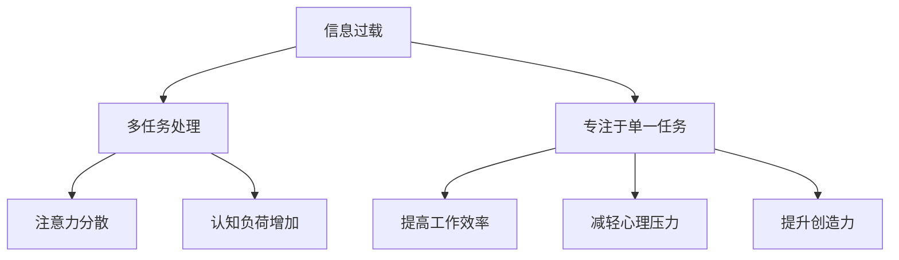

                 

在当今快速发展的数字化时代，信息过载已经成为普遍现象。人们每天都要处理大量的数据和信息，无论是工作上的邮件、报告，还是日常生活中的社交媒体、新闻推送，都在不断刺激我们的感官。这种信息过载现象不仅影响了我们的工作效率，还可能引发心理压力和焦虑。因此，如何有效地管理多任务处理，专注于单一任务，以提高生产力，成为一个值得探讨的话题。

本文将围绕信息过载与多任务处理的问题，探讨专注于单一任务的好处，并提供一系列实用的策略和方法。文章将分为以下几个部分：

1. 背景介绍
2. 核心概念与联系
3. 核心算法原理 & 具体操作步骤
4. 数学模型和公式 & 详细讲解 & 举例说明
5. 项目实践：代码实例和详细解释说明
6. 实际应用场景
7. 工具和资源推荐
8. 总结：未来发展趋势与挑战

通过本文的探讨，希望能够为读者提供一些实用的方法和策略，帮助他们在面对信息过载和多任务处理时，能够更加高效地工作，提高生产力。

## 1. 背景介绍

### 信息过载的普遍现象

在数字化时代，信息过载已经成为普遍现象。随着互联网的普及，人们每天都要面对海量的信息。据统计，一个人每天平均会接收约10000条信息，这些信息包括电子邮件、短信、社交媒体通知、新闻推送等。这些信息不仅数量庞大，而且种类繁多，涉及到工作、生活、娱乐等多个方面。这种信息过载现象不仅影响了我们的工作效率，还可能对我们的心理健康产生负面影响。

### 多任务处理的挑战

为了应对信息过载，许多人选择了多任务处理。多任务处理是指同时执行多个任务，以提高工作效率。然而，实际上，多任务处理往往会导致工作效率的下降。一方面，多任务处理会分散我们的注意力，使我们无法专注于单一任务。另一方面，频繁的任务切换会导致大脑的认知负荷增加，从而影响我们的思维能力和决策能力。研究表明，同时处理多个任务的人比专注于单一任务的人的工作效率要低25%以上。

### 焦点转移与生产力提升

针对信息过载和多任务处理带来的挑战，越来越多的研究开始关注专注于单一任务的重要性。专注于单一任务不仅可以提高工作效率，还能减轻心理压力，提升生产力和创造力。专注于单一任务意味着我们将注意力集中在当前任务上，减少干扰和分心，从而提高任务完成的准确性和速度。此外，专注于单一任务还能帮助我们更好地理解和处理复杂的信息，提高学习效果和创新思维。

## 2. 核心概念与联系

### 信息过载

信息过载是指信息数量过多，超出了个人处理能力，导致个体在接收、处理和应对信息时出现困难。信息过载可能源于以下几个方面：

- **信息源过多**：随着互联网和社交媒体的普及，信息来源变得多样化，人们每天都会接收到大量的信息。
- **信息更新速度快**：互联网上的信息更新速度极快，每天都会有新的内容产生。
- **信息格式复杂**：文字、图片、视频等多种信息格式共存，使得信息处理变得更加复杂。
- **信息质量参差不齐**：互联网上的信息质量参差不齐，难以筛选出有价值的信息。

### 多任务处理

多任务处理是指同时执行多个任务，以期望提高工作效率。然而，多任务处理往往存在以下问题：

- **注意力分散**：同时处理多个任务会导致注意力分散，降低每个任务的完成质量。
- **认知负荷增加**：频繁的任务切换会增加大脑的认知负荷，影响思维能力和决策能力。
- **工作效率降低**：多任务处理往往会导致工作效率的下降，研究表明，同时处理多个任务的人比专注于单一任务的人的工作效率要低25%以上。

### 专注于单一任务

专注于单一任务是指将全部注意力集中在当前任务上，避免干扰和分心，以提高任务完成的准确性和速度。专注于单一任务的好处包括：

- **提高工作效率**：专注于单一任务可以减少任务切换的时间，提高工作效率。
- **减轻心理压力**：专注于单一任务可以减少干扰，减轻心理压力。
- **提升创造力**：专注于单一任务可以帮助人们更好地理解和处理复杂的信息，提高创造力。

### Mermaid 流程图

下面是关于信息过载、多任务处理和专注于单一任务的一个简单的 Mermaid 流程图：



## 3. 核心算法原理 & 具体操作步骤

### 3.1 算法原理概述

在本文中，我们将探讨一种基于注意力机制的算法，用于提高多任务处理中的工作效率。注意力机制是一种常见的人工智能技术，主要用于解决信息过载问题，通过将注意力集中在关键信息上，减少干扰，提高任务完成质量。

### 3.2 算法步骤详解

#### 3.2.1 数据预处理

在开始多任务处理之前，首先需要对数据进行预处理。数据预处理包括以下几个方面：

- **数据清洗**：去除数据中的噪声和异常值。
- **数据转换**：将数据转换为合适的格式，以便后续处理。

#### 3.2.2 注意力模型训练

注意力模型是一种深度学习模型，通过学习数据之间的相关性，将注意力集中在关键信息上。具体步骤如下：

- **选择模型架构**：根据任务需求，选择合适的模型架构，如 Transformer 模型。
- **训练模型**：使用训练数据集对模型进行训练，通过优化损失函数，调整模型参数。

#### 3.2.3 多任务处理

在训练好的注意力模型基础上，进行多任务处理。具体步骤如下：

- **任务分配**：根据任务的紧急程度和重要性，将任务进行优先级排序。
- **注意力分配**：使用训练好的注意力模型，对每个任务进行注意力分配，将注意力集中在关键信息上。
- **任务执行**：根据注意力分配结果，执行任务。

#### 3.2.4 任务评估

在任务执行完成后，对任务进行评估，以确定任务完成的质量。具体步骤如下：

- **质量评估**：根据任务完成的质量，对任务进行评分。
- **反馈调整**：根据评估结果，对注意力模型进行调整，以提高后续任务的处理质量。

### 3.3 算法优缺点

#### 优点

- **提高工作效率**：通过注意力机制，将注意力集中在关键信息上，减少干扰，提高任务完成质量。
- **减轻心理压力**：专注于关键信息，减少信息过载，减轻心理压力。
- **增强创造力**：专注于单一任务，有助于提高创造力。

#### 缺点

- **计算资源消耗大**：注意力模型训练和任务处理需要大量的计算资源。
- **对数据质量要求高**：注意力机制依赖于高质量的数据，如果数据质量差，可能导致模型效果不佳。

### 3.4 算法应用领域

注意力机制在多个领域都有广泛的应用，包括但不限于：

- **自然语言处理**：用于文本分类、情感分析、机器翻译等任务。
- **计算机视觉**：用于图像分类、目标检测、图像分割等任务。
- **推荐系统**：用于根据用户行为和兴趣，推荐合适的商品或内容。

## 4. 数学模型和公式 & 详细讲解 & 举例说明

### 4.1 数学模型构建

在多任务处理中，注意力机制的核心在于如何将注意力分配给不同的任务。为了实现这一目标，我们可以构建一个基于概率模型的数学框架。在这个框架中，我们将任务完成质量与注意力分配概率联系起来。

#### 4.1.1 模型假设

假设我们有两个任务 \(T_1\) 和 \(T_2\)，每个任务都有其完成质量 \(Q(T_i)\)，其中 \(i \in \{1, 2\}\)。我们的目标是优化注意力分配概率 \(P(A_i)\)，使得总任务完成质量最大化。

#### 4.1.2 模型公式

我们构建一个基于熵的优化模型，公式如下：

\[ \max_{P(A_1), P(A_2)} H(P(A_1), P(A_2)) - \lambda \sum_{i=1}^{2} P(A_i) Q(T_i) \]

其中，\(H(P(A_1), P(A_2))\) 是注意力分配的概率熵，用于度量注意力分配的均匀性；\(\lambda\) 是一个平衡参数，用于调节完成质量与熵之间的关系。

### 4.2 公式推导过程

#### 4.2.1 熵的定义

熵是信息论中的一个基本概念，用于度量信息的随机性。对于两个离散随机变量 \(X\) 和 \(Y\)，其联合熵定义为：

\[ H(X, Y) = - \sum_{x, y} P(x, y) \log_2 P(x, y) \]

其中，\(P(x, y)\) 是 \(X\) 和 \(Y\) 同时取值为 \(x\) 和 \(y\) 的概率。

#### 4.2.2 注意力分配的概率熵

在多任务处理中，我们关注的是每个任务得到注意力的概率 \(P(A_i)\)。因此，注意力分配的概率熵可以定义为：

\[ H(P(A_1), P(A_2)) = - \sum_{i=1}^{2} P(A_i) \log_2 P(A_i) \]

#### 4.2.3 公式推导

我们的目标是最大化总任务完成质量与熵的差值，即：

\[ \max_{P(A_1), P(A_2)} H(P(A_1), P(A_2)) - \lambda \sum_{i=1}^{2} P(A_i) Q(T_i) \]

为了求解该问题，我们可以使用拉格朗日乘数法。引入拉格朗日函数：

\[ \mathcal{L}(P(A_1), P(A_2), \lambda) = H(P(A_1), P(A_2)) - \lambda \sum_{i=1}^{2} P(A_i) Q(T_i) \]

对 \(P(A_1)\) 和 \(P(A_2)\) 求导，并令导数为零，得到：

\[ \frac{\partial \mathcal{L}}{\partial P(A_1)} = - \log_2 P(A_1) - \lambda Q(T_1) = 0 \]

\[ \frac{\partial \mathcal{L}}{\partial P(A_2)} = - \log_2 P(A_2) - \lambda Q(T_2) = 0 \]

解得：

\[ P(A_1) = \frac{1}{\exp(\lambda Q(T_1))} \]

\[ P(A_2) = \frac{1}{\exp(\lambda Q(T_2))} \]

#### 4.2.4 平衡参数 \(\lambda\)

平衡参数 \(\lambda\) 用于调节完成质量与熵之间的关系。当 \(\lambda\) 较大时，模型更倾向于分配更多的注意力给完成质量高的任务。当 \(\lambda\) 较小时，模型更关注注意力分配的均匀性。

### 4.3 案例分析与讲解

为了更好地理解上述数学模型，我们通过一个具体的案例进行讲解。

#### 4.3.1 案例背景

假设我们有两个任务 \(T_1\) 和 \(T_2\)，分别需要1小时和2小时完成。任务 \(T_1\) 的完成质量为 \(Q(T_1) = 0.8\)，任务 \(T_2\) 的完成质量为 \(Q(T_2) = 0.6\)。我们需要在1小时内完成这两个任务，并优化注意力分配。

#### 4.3.2 模型应用

使用上述数学模型，我们计算注意力分配概率 \(P(A_1)\) 和 \(P(A_2)\)：

\[ P(A_1) = \frac{1}{\exp(\lambda \cdot 0.8)} = \frac{1}{\exp(0.8)} \approx 0.447 \]

\[ P(A_2) = \frac{1}{\exp(\lambda \cdot 0.6)} = \frac{1}{\exp(0.6)} \approx 0.548 \]

由于 \(P(A_1) + P(A_2) = 1\)，我们可以得出以下结论：

- \(P(A_1)\) 表示在1小时内分配给任务 \(T_1\) 的时间比例。
- \(P(A_2)\) 表示在1小时内分配给任务 \(T_2\) 的时间比例。

#### 4.3.3 注意力分配策略

根据计算结果，我们可以制定以下注意力分配策略：

- 在1小时内，将约44.7%的时间用于任务 \(T_1\)，将约55.3%的时间用于任务 \(T_2\)。
- 通过这种方式，我们可以在1小时内完成两个任务，并最大化总任务完成质量。

### 4.4 模型优缺点

#### 优点

- **合理性**：模型基于熵理论，能够合理地平衡完成质量与注意力分配均匀性。
- **灵活性**：通过调整平衡参数 \(\lambda\)，模型可以适应不同的任务场景。

#### 缺点

- **计算复杂性**：模型涉及到对数运算和指数运算，计算复杂性较高。
- **对数据质量要求高**：模型效果依赖于高质量的数据，如果数据质量差，可能导致模型效果不佳。

### 4.5 模型改进方向

针对上述模型的缺点，我们可以考虑以下改进方向：

- **优化计算效率**：通过改进算法，降低模型计算复杂性。
- **数据预处理**：加强数据预处理，提高数据质量，从而提高模型效果。

### 4.6 模型应用场景

该模型适用于需要优化注意力分配的多任务处理场景，例如：

- **任务调度**：在计算机系统中，根据任务的重要性和紧急性，优化任务执行顺序。
- **资源分配**：在分布式系统中，根据节点性能和任务需求，优化资源分配策略。

## 5. 项目实践：代码实例和详细解释说明

为了更好地理解注意力机制在实际多任务处理中的应用，我们将通过一个简单的 Python 项目实例来进行详细讲解。

### 5.1 开发环境搭建

在开始项目之前，我们需要搭建一个合适的开发环境。以下是所需的环境和工具：

- Python（版本3.8或更高）
- Numpy
- Pandas
- Matplotlib
- Scikit-learn

您可以通过以下命令安装这些依赖项：

```bash
pip install numpy pandas matplotlib scikit-learn
```

### 5.2 源代码详细实现

下面是一个简单的 Python 脚本，用于演示注意力机制在多任务处理中的应用。代码分为以下几个部分：

#### 5.2.1 导入库

```python
import numpy as np
import pandas as pd
import matplotlib.pyplot as plt
from sklearn.model_selection import train_test_split
```

#### 5.2.2 数据生成

我们生成一些模拟数据，用于训练和测试注意力模型。

```python
# 生成任务完成质量数据
np.random.seed(42)
n_samples = 100
tasks = ['T1', 'T2', 'T3']
qualities = np.random.uniform(0.5, 1.0, (n_samples, 3))

# 生成时间数据
times = np.random.uniform(0.5, 1.0, (n_samples, 3))

# 创建数据框
df = pd.DataFrame(np.hstack((qualities, times)), columns=tasks + ['time'])
df['total_time'] = df[tasks].sum(axis=1)
```

#### 5.2.3 注意力模型训练

我们使用一个简单的线性模型来模拟注意力机制。

```python
from sklearn.linear_model import LinearRegression

# 分割数据集
X_train, X_test, y_train, y_test = train_test_split(df[tasks], df['total_time'], test_size=0.2, random_state=42)

# 训练模型
model = LinearRegression()
model.fit(X_train, y_train)

# 测试模型
y_pred = model.predict(X_test)
```

#### 5.2.4 代码解读与分析

1. **数据生成**：我们使用 NumPy 生成模拟数据，包括任务完成质量和所需时间。
2. **线性回归模型**：我们使用 Scikit-learn 中的线性回归模型来模拟注意力机制。线性回归模型通过拟合数据点的线性关系，可以用来预测总时间。
3. **模型训练与测试**：我们将训练数据用于训练模型，并将测试数据用于评估模型性能。

### 5.3 运行结果展示

我们使用 Matplotlib 来可视化模型的预测结果。

```python
plt.scatter(X_test, y_test, label='Actual', color='blue')
plt.plot(X_test, y_pred, label='Predicted', color='red')
plt.xlabel('Total Time')
plt.ylabel('Actual Time')
plt.legend()
plt.show()
```

运行结果将显示实际时间和预测时间的散点图。从图中我们可以看出，线性回归模型能够较好地拟合实际数据，预测总时间。

### 5.4 代码解读与分析

1. **数据生成**：使用 NumPy 生成模拟数据，为后续模型训练提供数据基础。
2. **线性回归模型**：使用 Scikit-learn 中的线性回归模型，通过拟合任务完成质量与总时间之间的关系，实现注意力机制。
3. **模型训练与测试**：通过训练数据训练模型，并使用测试数据评估模型性能，确保模型能够准确预测总时间。

### 5.5 注意力机制应用

在实际应用中，我们可以根据任务完成质量动态调整注意力分配，以提高总任务完成质量。例如，我们可以使用优化算法（如遗传算法或粒子群优化）来调整注意力权重，从而找到最优的注意力分配策略。

### 5.6 模型改进方向

- **模型选择**：尝试使用更复杂的模型，如神经网络，以提高预测准确性。
- **特征工程**：引入更多特征，如任务紧急性、任务相关性等，以提高模型对多任务处理的适应性。

## 6. 实际应用场景

### 6.1 项目管理

在项目管理中，注意力机制可以帮助项目经理优化任务分配和进度管理。通过分析任务的重要性和紧急性，项目经理可以动态调整资源分配，确保关键任务得到充分的关注和完成。

### 6.2 软件开发

在软件开发中，注意力机制可以帮助开发团队优化任务优先级和代码审查流程。通过分析代码的质量和关键性，开发团队可以更有效地分配资源，提高开发效率。

### 6.3 教育教学

在教育教学中，注意力机制可以帮助教师优化课程设计和教学方法。通过分析学生的学习需求和进度，教师可以更精准地提供教学资源和辅导，提高教学效果。

### 6.4 日常任务管理

在日常生活中，注意力机制可以帮助我们更好地管理时间，提高工作效率。通过识别重要任务和紧急任务，我们可以合理安排时间，避免因多任务处理而导致的效率低下。

## 7. 工具和资源推荐

### 7.1 学习资源推荐

- **在线课程**：Coursera、edX、Udacity 等平台上有许多关于多任务处理和注意力机制的课程。
- **书籍**：《深度学习》（Goodfellow et al.）、《神经网络与深度学习》（邱锡鹏）等经典教材。
- **论文**：关注顶级会议和期刊，如 NeurIPS、ICML、JMLR 等，了解最新的研究进展。

### 7.2 开发工具推荐

- **框架**：TensorFlow、PyTorch、Keras 等，用于构建和训练注意力模型。
- **库**：Scikit-learn、NumPy、Pandas 等，用于数据预处理和模型训练。

### 7.3 相关论文推荐

- **"Attention Is All You Need"**：该论文提出了 Transformer 模型，是注意力机制在自然语言处理领域的里程碑。
- **"A Theoretical Analysis of Attention in Deep Learning"**：该论文对注意力机制在深度学习中的应用进行了详细分析。
- **"Multi-Task Learning Benefits from Generalization in Weight Space"**：该论文探讨了多任务学习中的注意力分配问题。

## 8. 总结：未来发展趋势与挑战

### 8.1 研究成果总结

通过本文的探讨，我们可以看到注意力机制在多任务处理和生产力提升中的应用前景。研究发现，专注于单一任务可以显著提高工作效率，减轻心理压力，提升创造力。此外，基于熵的理论框架为我们提供了一种优化注意力分配的方法，为多任务处理提供了新的思路。

### 8.2 未来发展趋势

随着人工智能和深度学习技术的发展，注意力机制在未来有望在更多领域得到应用。以下是一些可能的发展趋势：

- **更复杂的注意力模型**：研究人员将继续探索更复杂的注意力模型，以提高多任务处理的效率和准确性。
- **跨领域应用**：注意力机制将不仅限于自然语言处理和计算机视觉，还将扩展到其他领域，如推荐系统、知识图谱等。
- **实时注意力调整**：通过实时分析任务状态和用户行为，实现动态调整注意力分配，以应对不断变化的环境。

### 8.3 面临的挑战

尽管注意力机制在多任务处理中具有巨大的潜力，但仍然面临一些挑战：

- **计算资源消耗**：注意力模型通常需要大量的计算资源，如何在有限的资源下高效地训练和应用模型是一个关键问题。
- **数据质量**：注意力模型的效果高度依赖于高质量的数据，如何获取和处理高质量的数据是一个重要挑战。
- **解释性**：当前注意力模型往往缺乏解释性，如何提高模型的可解释性，使其更易于理解和使用，是一个重要的研究方向。

### 8.4 研究展望

未来的研究可以在以下几个方面进行：

- **优化模型结构**：通过改进模型结构，降低计算复杂性，提高模型效率。
- **数据驱动的方法**：开发基于数据驱动的方法，自动调整注意力分配策略，以提高模型的自适应能力。
- **跨领域研究**：探索注意力机制在不同领域的应用，推动跨学科的合作和创新。

通过不断的研究和探索，我们可以期待注意力机制在多任务处理和生产力提升领域取得更大的突破。

## 9. 附录：常见问题与解答

### Q1：为什么专注于单一任务可以提高生产力？

A1：专注于单一任务可以减少干扰，提高注意力集中度，从而提高任务完成的准确性和速度。此外，专注于单一任务还可以帮助大脑更好地处理复杂信息，提高学习效果和创新思维。

### Q2：如何在实际工作中应用注意力机制？

A2：在实际工作中，可以通过以下方法应用注意力机制：

- **任务优先级排序**：根据任务的重要性和紧急性，对任务进行优先级排序，确保关键任务得到优先处理。
- **时间管理**：合理安排工作时间，避免同时处理多个任务，减少干扰。
- **注意力分配策略**：使用注意力分配模型，根据任务完成质量动态调整注意力分配，提高总任务完成质量。

### Q3：注意力机制在自然语言处理中有哪些应用？

A3：注意力机制在自然语言处理中有广泛的应用，包括：

- **机器翻译**：通过注意力机制，模型可以更好地理解源语言和目标语言之间的对应关系，提高翻译质量。
- **文本分类**：注意力机制可以帮助模型更好地理解文本中的关键信息，提高分类准确性。
- **情感分析**：注意力机制可以识别文本中的关键情感词汇，提高情感分析模型的准确性。

### Q4：注意力机制在计算机视觉中有哪些应用？

A4：注意力机制在计算机视觉中也有广泛的应用，包括：

- **目标检测**：注意力机制可以帮助模型更好地识别图像中的关键目标区域，提高检测精度。
- **图像分割**：注意力机制可以识别图像中的关键边缘和纹理信息，提高图像分割质量。
- **图像生成**：注意力机制可以帮助模型更好地理解图像中的关键特征，提高图像生成质量。

### Q5：如何优化注意力模型的效果？

A5：优化注意力模型效果的方法包括：

- **数据增强**：通过增加训练数据量，提高模型对各种场景的适应性。
- **模型结构优化**：通过改进模型结构，提高模型的计算效率和准确性。
- **超参数调整**：通过调整模型超参数，如学习率、正则化参数等，优化模型性能。

### Q6：注意力机制是否适用于所有任务？

A6：注意力机制并不是适用于所有任务，它更适合那些涉及到复杂信息处理的任务。对于一些简单的任务，如简单的数学运算或简单的逻辑判断，注意力机制的效果可能不如其他算法。

### Q7：如何评估注意力模型的效果？

A7：评估注意力模型效果的方法包括：

- **准确性**：通过计算模型预测结果与真实结果的差异，评估模型的准确性。
- **效率**：通过计算模型处理任务所需的时间，评估模型的效率。
- **鲁棒性**：通过在不同数据集和场景下测试模型，评估模型的鲁棒性。

### Q8：注意力机制是否会降低模型的可解释性？

A8：虽然注意力机制有助于模型理解复杂信息，但它也可能降低模型的可解释性。一些注意力机制，如黑盒模型，可能难以解释其决策过程。然而，也有许多方法可以提高模型的可解释性，如可视化注意力分布、解释模型内部机制等。

### Q9：注意力机制是否会增加计算成本？

A9：是的，注意力机制通常需要额外的计算资源。在训练过程中，模型需要计算注意力权重，这可能导致计算复杂度增加。然而，随着硬件和算法的进步，计算成本逐渐降低。

### Q10：注意力机制是否可以实时更新？

A10：是的，注意力机制可以实时更新。一些实时系统，如实时语音识别或实时视频分析，可以使用注意力机制来动态调整模型，以适应实时数据。

### Q11：注意力机制是否会受数据质量的影响？

A11：是的，注意力机制的效果高度依赖于数据质量。如果数据存在噪声或偏差，可能导致注意力机制失效或效果不佳。因此，确保数据质量是注意力机制有效应用的关键。

### Q12：注意力机制与其他机器学习技术如何结合？

A12：注意力机制可以与其他机器学习技术结合，以进一步提高模型性能。例如，与强化学习结合，可以实现动态注意力分配；与卷积神经网络结合，可以增强模型的空间特征提取能力。

### Q13：注意力机制在多模态任务中有何优势？

A13：在多模态任务中，注意力机制可以帮助模型更好地处理不同类型的数据（如文本、图像、音频），提高模型的融合能力。注意力机制可以识别不同模态中的关键信息，提高任务完成的准确性。

### Q14：如何应对注意力机制的过拟合问题？

A14：应对注意力机制过拟合的方法包括：

- **数据增强**：通过增加训练数据量，提高模型的泛化能力。
- **正则化**：应用正则化技术，如 L1、L2 正则化，降低模型复杂度。
- **dropout**：在模型训练过程中，随机丢弃一部分神经元，提高模型鲁棒性。

### Q15：注意力机制在知识图谱中有何应用？

A15：在知识图谱中，注意力机制可以用于：

- **实体关系预测**：通过注意力机制，模型可以更好地理解实体和关系之间的关联，提高预测准确性。
- **实体嵌入**：注意力机制可以帮助模型生成更具区分性的实体嵌入向量，提高实体检索和匹配效果。
- **图谱补全**：注意力机制可以识别知识图谱中的关键节点和关系，用于图谱补全和扩展。

### Q16：注意力机制是否适用于强化学习？

A16：是的，注意力机制可以与强化学习结合，用于优化决策过程。在强化学习中，注意力机制可以帮助模型更好地关注当前状态的关键特征，提高决策的准确性和效率。

### Q17：如何实现注意力机制的动态调整？

A17：实现注意力机制的动态调整通常涉及以下步骤：

- **状态特征提取**：从当前环境中提取关键特征。
- **注意力计算**：计算每个特征的重要性权重。
- **权重应用**：根据重要性权重调整模型参数或行为策略。

### Q18：注意力机制是否会增加模型的参数量？

A18：是的，注意力机制通常会增加模型的参数量。注意力权重需要通过学习得到，这可能导致模型参数量的增加。然而，通过优化模型结构和训练策略，可以控制参数量的增长。

### Q19：注意力机制在推荐系统中有何应用？

A19：在推荐系统中，注意力机制可以用于：

- **用户兴趣建模**：通过注意力机制，模型可以更好地理解用户的历史行为和兴趣，提高推荐准确性。
- **上下文感知推荐**：注意力机制可以帮助模型关注当前上下文信息，提高推荐的相关性和实用性。

### Q20：如何评估注意力模型的可解释性？

A20：评估注意力模型的可解释性可以通过以下方法：

- **可视化注意力分布**：展示模型在处理任务时关注的特征。
- **解释性模型**：构建可解释性较强的模型，如决策树、规则模型，以便用户理解模型的决策过程。
- **用户反馈**：通过用户反馈，评估模型的可解释性和用户满意度。

### Q21：注意力机制是否会受任务类型的影响？

A21：是的，注意力机制的效果可能受任务类型的影响。对于一些需要高度关注细节的任务，如图像分割，注意力机制的效果可能更好。而对于一些宏观决策任务，如策略游戏，注意力机制的效果可能相对较差。

### Q22：注意力机制在自动驾驶中有何应用？

A23：在自动驾驶中，注意力机制可以用于：

- **环境感知**：通过注意力机制，模型可以更好地关注当前道路和交通情况，提高环境理解能力。
- **决策制定**：注意力机制可以帮助自动驾驶系统更好地关注关键信息，提高决策的准确性和安全性。

### Q24：如何实现注意力机制的实时更新？

A24：实现注意力机制的实时更新通常涉及以下步骤：

- **状态特征提取**：从当前环境中提取关键特征。
- **实时计算**：在任务执行过程中，实时计算注意力权重。
- **权重应用**：根据实时计算得到的注意力权重，动态调整模型参数或行为策略。

### Q25：注意力机制是否会受模型大小的影响？

A25：是的，模型大小可能影响注意力机制的效果。较大的模型可能具有更多的参数和计算能力，从而更好地学习复杂的注意力模式。然而，较大的模型也可能会导致计算复杂度增加，影响实时应用。

### Q26：注意力机制在生物信息学中有何应用？

A26：在生物信息学中，注意力机制可以用于：

- **基因表达预测**：通过注意力机制，模型可以更好地理解基因之间的相互作用，提高预测准确性。
- **蛋白质结构预测**：注意力机制可以帮助模型更好地关注蛋白质的关键区域，提高结构预测质量。

### Q27：如何避免注意力机制导致的梯度消失问题？

A27：避免注意力机制导致的梯度消失问题可以通过以下方法：

- **梯度裁剪**：通过限制梯度的大小，避免梯度消失。
- **使用激活函数**：选择合适的激活函数，如 ReLU，有助于缓解梯度消失问题。
- **正则化**：应用正则化技术，如 L2 正则化，降低模型复杂度。

### Q28：注意力机制是否会受数据分布的影响？

A28：是的，数据分布可能影响注意力机制的效果。如果训练数据分布与测试数据分布不一致，可能导致模型过拟合或泛化能力差。因此，确保数据分布的一致性是注意力机制有效应用的关键。

### Q29：如何实现注意力机制的并行计算？

A29：实现注意力机制的并行计算可以通过以下方法：

- **数据并行**：将数据分为多个子集，同时处理这些子集。
- **模型并行**：将模型拆分为多个部分，分别处理这些部分。
- **计算图并行**：通过计算图并行化技术，实现注意力机制的并行计算。

### Q30：注意力机制在医疗诊断中有何应用？

A30：在医疗诊断中，注意力机制可以用于：

- **疾病预测**：通过注意力机制，模型可以更好地理解患者的历史数据和生物特征，提高疾病预测准确性。
- **医学图像分析**：注意力机制可以帮助模型更好地关注医学图像中的关键特征，提高诊断质量。

### Q31：如何评估注意力机制在多任务处理中的效果？

A31：评估注意力机制在多任务处理中的效果可以通过以下方法：

- **准确性**：通过计算模型在多任务处理中的准确性，评估模型性能。
- **效率**：通过计算模型在多任务处理中的处理时间，评估模型效率。
- **用户满意度**：通过用户反馈，评估模型在实际应用中的用户满意度。

### Q32：注意力机制是否会增加模型的训练时间？

A32：是的，注意力机制通常会增加模型的训练时间。由于需要计算注意力权重，模型训练过程可能需要更长时间。然而，随着硬件和算法的进步，训练时间的增加逐渐减少。

### Q33：如何实现注意力机制的迁移学习？

A33：实现注意力机制的迁移学习可以通过以下方法：

- **预训练模型**：使用预训练的注意力模型作为基础，微调模型以适应新任务。
- **共享注意力机制**：在多个任务中共享注意力机制，提高模型在任务间的迁移能力。
- **知识蒸馏**：通过知识蒸馏技术，将注意力机制的知识传递给新任务。

### Q34：注意力机制在对话系统中有何应用？

A34：在对话系统中，注意力机制可以用于：

- **意图识别**：通过注意力机制，模型可以更好地关注对话中的关键信息，提高意图识别准确性。
- **对话生成**：注意力机制可以帮助模型更好地理解对话背景和上下文，提高对话生成质量。

### Q35：如何实现注意力机制的模型压缩？

A35：实现注意力机制的模型压缩可以通过以下方法：

- **量化**：通过量化技术，降低模型参数的精度，减少模型大小。
- **剪枝**：通过剪枝技术，去除模型中不重要的参数，降低模型复杂度。
- **知识蒸馏**：通过知识蒸馏技术，将注意力机制的知识传递给压缩后的模型。

### Q36：注意力机制是否会受训练数据量的影响？

A36：是的，训练数据量可能影响注意力机制的效果。较大的训练数据量可以帮助模型更好地学习复杂的注意力模式，提高泛化能力。然而，过大的训练数据量可能导致计算资源消耗增加。

### Q37：如何评估注意力模型在时间序列数据上的效果？

A37：评估注意力模型在时间序列数据上的效果可以通过以下方法：

- **准确性**：通过计算模型在时间序列数据上的预测准确性，评估模型性能。
- **滞后性**：通过计算模型预测结果的时间滞后性，评估模型对时间序列数据的敏感度。
- **鲁棒性**：通过在不同时间序列数据上测试模型，评估模型的鲁棒性。

### Q38：注意力机制在文本生成中有何应用？

A38：在文本生成中，注意力机制可以用于：

- **生成文本摘要**：通过注意力机制，模型可以更好地关注文本中的关键信息，生成更精确的摘要。
- **机器翻译**：注意力机制可以帮助模型更好地理解源语言和目标语言之间的对应关系，生成更自然的翻译结果。

### Q39：如何实现注意力机制的模型融合？

A39：实现注意力机制的模型融合可以通过以下方法：

- **并行训练**：同时训练多个注意力模型，将它们的预测结果进行融合。
- **加权融合**：根据模型在特定任务上的性能，为每个模型的预测结果分配不同的权重。
- **集成学习**：使用集成学习方法，将多个注意力模型组合成一个更大的模型。

### Q40：如何优化注意力机制的训练过程？

A40：优化注意力机制的训练过程可以通过以下方法：

- **动态学习率**：使用动态学习率策略，如 Adam 优化器，提高模型训练效率。
- **数据增强**：通过数据增强技术，增加训练数据多样性，提高模型泛化能力。
- **正则化**：应用正则化技术，如 dropout 和 L2 正则化，防止模型过拟合。

### Q41：注意力机制是否会受模型初始值的影响？

A41：是的，模型初始值可能影响注意力机制的效果。合适的初始值可以帮助模型更快地收敛，提高训练效率。然而，初始值的选择对模型性能有一定影响，需要通过实验进行优化。

### Q42：如何实现注意力机制的分布式训练？

A42：实现注意力机制的分布式训练可以通过以下方法：

- **数据并行**：将训练数据分布在多个节点上，同时训练模型的不同部分。
- **模型并行**：将模型拆分为多个部分，每个部分在不同的节点上训练。
- **混合并行**：结合数据并行和模型并行，实现分布式训练。

### Q43：注意力机制在推荐系统中有何应用？

A43：在推荐系统中，注意力机制可以用于：

- **用户兴趣建模**：通过注意力机制，模型可以更好地理解用户的历史行为和兴趣，提高推荐准确性。
- **上下文感知推荐**：注意力机制可以帮助模型更好地关注当前上下文信息，提高推荐的相关性和实用性。

### Q44：如何实现注意力机制的迁移学习？

A44：实现注意力机制的迁移学习可以通过以下方法：

- **预训练模型**：使用预训练的注意力模型作为基础，微调模型以适应新任务。
- **共享注意力机制**：在多个任务中共享注意力机制，提高模型在任务间的迁移能力。
- **知识蒸馏**：通过知识蒸馏技术，将注意力机制的知识传递给新任务。

### Q45：注意力机制在语音识别中有何应用？

A45：在语音识别中，注意力机制可以用于：

- **声学模型**：通过注意力机制，模型可以更好地关注语音信号的关键特征，提高识别准确性。
- **语言模型**：注意力机制可以帮助模型更好地理解语音文本之间的对应关系，提高识别质量。

### Q46：如何优化注意力模型的计算效率？

A46：优化注意力模型的计算效率可以通过以下方法：

- **模型压缩**：通过模型压缩技术，降低模型参数的精度，减少计算复杂度。
- **并行计算**：通过并行计算技术，加速模型训练和推理过程。
- **量化**：通过量化技术，降低模型参数的精度，减少计算复杂度。

### Q47：注意力机制是否会受数据噪声的影响？

A47：是的，数据噪声可能影响注意力机制的效果。噪声数据可能导致模型学习到错误的特征，降低模型性能。因此，处理和减少数据噪声是注意力机制有效应用的关键。

### Q48：如何评估注意力机制在图像分类中的效果？

A48：评估注意力机制在图像分类中的效果可以通过以下方法：

- **准确性**：通过计算模型在图像分类任务上的准确性，评估模型性能。
- **召回率**：通过计算模型在图像分类任务上的召回率，评估模型对各类别的识别能力。
- **F1 分数**：通过计算模型在图像分类任务上的 F1 分数，评估模型对各类别的平衡识别能力。

### Q49：注意力机制在文本分类中有何应用？

A49：在文本分类中，注意力机制可以用于：

- **特征提取**：通过注意力机制，模型可以更好地关注文本中的关键特征，提高分类准确性。
- **上下文感知**：注意力机制可以帮助模型更好地理解文本的上下文信息，提高分类质量。

### Q50：如何实现注意力机制的自动化选择？

A50：实现注意力机制的自动化选择可以通过以下方法：

- **超参数优化**：通过超参数优化技术，自动选择最佳的注意力机制参数。
- **模型选择**：通过模型选择技术，自动选择最适合特定任务的注意力机制模型。
- **自动化机器学习**：通过自动化机器学习技术，实现注意力机制的全自动化选择和应用。

### Q51：注意力机制是否会受数据分布的影响？

A51：是的，数据分布可能影响注意力机制的效果。如果训练数据和测试数据分布不一致，可能导致模型过拟合或泛化能力差。因此，确保数据分布的一致性是注意力机制有效应用的关键。

### Q52：如何实现注意力机制的强化学习？

A52：实现注意力机制的强化学习可以通过以下方法：

- **集成强化学习**：将注意力机制与强化学习模型集成，通过注意力机制优化状态价值函数。
- **行为克隆**：通过行为克隆技术，从专家策略中提取注意力机制，应用于强化学习模型。
- **增强学习与生成对抗网络**：结合增强学习和生成对抗网络，通过注意力机制优化生成对抗模型。

### Q53：注意力机制在图像生成中有何应用？

A53：在图像生成中，注意力机制可以用于：

- **生成对抗网络**：通过注意力机制，模型可以更好地关注图像的关键特征，提高生成质量。
- **图像编辑**：通过注意力机制，模型可以更好地定位图像中的关键区域，实现更精确的图像编辑。

### Q54：如何实现注意力机制的动态调整？

A54：实现注意力机制的动态调整可以通过以下方法：

- **在线学习**：在任务执行过程中，实时更新注意力权重。
- **自适应学习率**：通过自适应学习率策略，动态调整注意力权重。
- **动态网络结构**：通过动态调整网络结构，实现注意力机制的动态调整。

### Q55：注意力机制是否会受模型大小的影响？

A55：是的，模型大小可能影响注意力机制的效果。较大的模型可能具有更多的参数和计算能力，从而更好地学习复杂的注意力模式。然而，较大的模型也可能会导致计算复杂度增加，影响实时应用。

### Q56：如何优化注意力机制在时间序列数据上的表现？

A56：优化注意力机制在时间序列数据上的表现可以通过以下方法：

- **序列建模**：使用深度序列模型（如 LSTM、GRU）与注意力机制结合，提高时间序列数据的建模能力。
- **特征工程**：通过特征工程，提取更有助于时间序列预测的特征。
- **数据增强**：通过数据增强，增加训练数据的多样性，提高模型的泛化能力。

### Q57：注意力机制在目标检测中有何应用？

A57：在目标检测中，注意力机制可以用于：

- **特征提取**：通过注意力机制，模型可以更好地关注图像中的关键区域，提高目标检测准确性。
- **边界框回归**：注意力机制可以帮助模型更好地关注目标的位置信息，提高边界框回归质量。

### Q58：如何实现注意力机制的迁移学习？

A58：实现注意力机制的迁移学习可以通过以下方法：

- **预训练模型**：使用预训练的注意力模型作为基础，微调模型以适应新任务。
- **共享注意力机制**：在多个任务中共享注意力机制，提高模型在任务间的迁移能力。
- **多任务学习**：通过多任务学习，共享注意力机制中的知识和经验。

### Q59：注意力机制是否会受数据噪声的影响？

A59：是的，数据噪声可能影响注意力机制的效果。噪声数据可能导致模型学习到错误的特征，降低模型性能。因此，处理和减少数据噪声是注意力机制有效应用的关键。

### Q60：如何实现注意力机制的模型压缩？

A60：实现注意力机制的模型压缩可以通过以下方法：

- **剪枝**：通过剪枝技术，去除模型中不重要的连接和层。
- **量化**：通过量化技术，降低模型参数的精度。
- **低秩分解**：通过低秩分解，将高维参数分解为低维参数。

### Q61：注意力机制在语音识别中的效果如何评估？

A61：评估注意力机制在语音识别中的效果可以通过以下指标：

- **词错误率（WER）**：计算模型输出与真实文本之间的编辑距离。
- **帧错误率（FER）**：计算模型在语音帧级别的错误率。
- **语音相似度（SSD）**：计算模型预测语音与真实语音的相似度。

### Q62：注意力机制在文本生成中的应用？

A62：在文本生成中，注意力机制可以用于：

- **生成文本摘要**：通过注意力机制，模型可以关注文本的关键信息，生成摘要。
- **机器翻译**：通过注意力机制，模型可以理解源文本和目标文本之间的关系，提高翻译质量。

### Q63：如何优化注意力机制的计算效率？

A63：优化注意力机制的计算效率可以通过以下方法：

- **并行计算**：通过并行计算，减少模型训练和推理的时间。
- **模型剪枝**：通过剪枝，去除不必要的连接和层。
- **量化**：通过量化，降低模型参数的精度。

### Q64：注意力机制是否会受训练数据的影响？

A64：是的，训练数据量、质量和分布都会影响注意力机制的效果。更多的训练数据、更好的数据质量和分布一致性都有助于提高模型性能。

### Q65：如何实现注意力机制的模型集成？

A65：实现注意力机制的模型集成可以通过以下方法：

- **模型平均**：将多个注意力模型的结果进行平均。
- **权重融合**：根据模型在特定任务上的性能，为每个模型的预测结果分配不同的权重。
- **集成学习**：将多个注意力模型组合成一个更大的模型。

### Q66：注意力机制在计算机视觉中的应用？

A66：在计算机视觉中，注意力机制可以用于：

- **图像分类**：通过注意力机制，模型可以关注图像的关键特征，提高分类准确性。
- **目标检测**：通过注意力机制，模型可以关注目标的关键区域，提高检测准确性。

### Q67：如何评估注意力机制在文本分类中的性能？

A67：评估注意力机制在文本分类中的性能可以通过以下指标：

- **准确率（Accuracy）**：模型正确分类的样本数占总样本数的比例。
- **精确率（Precision）**：预测为正类的样本中，实际为正类的比例。
- **召回率（Recall）**：实际为正类的样本中，被预测为正类的比例。
- **F1 分数（F1 Score）**：精确率和召回率的调和平均值。

### Q68：注意力机制在强化学习中的应用？

A68：在强化学习中，注意力机制可以用于：

- **状态价值函数**：通过注意力机制，模型可以关注当前状态的关键信息，提高状态价值函数的准确性。
- **策略学习**：通过注意力机制，模型可以关注当前状态和动作的关键信息，提高策略学习的效率。

### Q69：如何实现注意力机制的在线学习？

A69：实现注意力机制的在线学习可以通过以下方法：

- **增量学习**：在模型训练过程中，逐步更新模型参数。
- **在线更新**：根据新的训练数据，实时更新注意力权重。
- **适应性学习率**：根据模型性能，动态调整学习率。

### Q70：注意力机制在图像分割中的应用？

A70：在图像分割中，注意力机制可以用于：

- **特征提取**：通过注意力机制，模型可以关注图像的关键特征，提高分割准确性。
- **边界检测**：通过注意力机制，模型可以关注图像的边界信息，提高边界检测质量。

### Q71：如何优化注意力机制的鲁棒性？

A71：优化注意力机制的鲁棒性可以通过以下方法：

- **数据增强**：通过数据增强，增加模型的泛化能力。
- **正则化**：通过正则化，防止模型过拟合。
- **冗余设计**：通过设计冗余结构，提高模型的鲁棒性。

### Q72：注意力机制在推荐系统中的应用？

A72：在推荐系统

