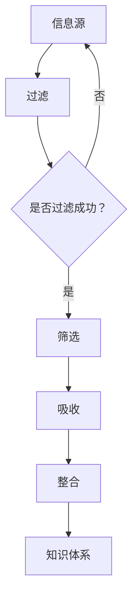

                 

 在当前的信息时代，我们面临着前所未有的信息过载。从互联网、社交媒体、专业论坛到书籍和报告，各种信息源源不断地涌入我们的生活中。如何在这些信息中找到有价值的知识，并有效地吸收和利用它们，成为了一个亟待解决的问题。本文旨在探讨如何在信息过载的时代，构建有效的知识筛选和吸收策略。

## 1. 背景介绍

### 信息过载的定义与现状

信息过载是指个人或组织在处理信息时感到负担过重，难以有效地筛选、理解和利用信息的状态。在互联网的推动下，信息的产生和传播速度达到了前所未有的高度，每天产生的数据量以指数级增长。据估计，全球每天产生的数据量已超过1.7兆字节（ZB）。如此庞大的信息量使得传统的信息处理方式变得无效，人们逐渐陷入了信息过载的困境。

### 信息过载的影响

信息过载对个人和社会都产生了深远的影响。对个人而言，过多的信息可能导致焦虑、决策困难、注意力分散等问题，影响个体的心理健康和工作效率。对社会而言，信息过载使得知识的传播和共享变得复杂，优质信息的获取变得更加困难，从而影响了社会的整体发展。

### 知识筛选和吸收的挑战

在信息过载的背景下，有效筛选和吸收知识面临着诸多挑战。首先，信息的海量性和多样性使得筛选过程变得复杂。其次，信息的真实性和可靠性难以保证，需要耗费大量时间和精力进行辨别。此外，知识吸收过程中，如何将新知识与已有知识体系有效整合也是一个重要问题。

## 2. 核心概念与联系

为了解决信息过载的问题，我们需要建立一套有效的知识筛选和吸收体系。以下是一些核心概念和它们之间的联系：

### 信息过滤与筛选

信息过滤是指通过特定的方法和技术，从海量信息中筛选出有价值的信息。常见的过滤方法包括关键字搜索、分类过滤和基于内容的推荐等。筛选则是对经过过滤的信息进行进一步的判断和选择，以确定哪些信息对自己真正有用。

### 知识吸收与整合

知识吸收是指将筛选出的信息转化为个人的知识体系。这一过程包括理解、记忆和应用。知识整合则是指将新知识融入到已有的知识体系中，使其成为一个有机整体，以便更好地应用和传承。

### 信息过滤与筛选的关系

信息过滤和筛选是紧密相连的两个过程。过滤是筛选的前提，没有有效的过滤，筛选就无法进行。然而，过滤本身并不能完全解决信息过载的问题，它只能减少无效信息的干扰。因此，筛选是确保信息价值的关键步骤。

### 知识吸收与整合的关系

知识吸收和整合是知识管理的重要环节。吸收是将信息转化为知识，整合则是将知识融入到个人的知识体系中。没有吸收，知识就无法更新和扩展；没有整合，知识就无法有效地应用和传承。

### Mermaid 流程图

以下是一个简化的 Mermaid 流程图，展示了信息过滤、筛选、吸收和整合的过程：



## 3. 核心算法原理 & 具体操作步骤

### 3.1 算法原理概述

在信息筛选和吸收过程中，常用的算法包括信息熵、机器学习和数据挖掘等方法。以下以信息熵算法为例，介绍其原理和具体操作步骤。

信息熵是衡量信息量大小的一种度量，它基于香农信息论。在信息过载时代，利用信息熵可以有效地筛选出具有高价值的信息。具体而言，信息熵算法通过计算信息源中各信息单元的熵值，筛选出熵值较低的信息单元，即高价值的信息。

### 3.2 算法步骤详解

#### 步骤1：数据预处理

首先，对原始信息进行预处理，包括去噪、分词、去除停用词等操作。这一步骤的目的是提高数据的质量，为后续计算信息熵奠定基础。

#### 步骤2：计算信息熵

对预处理后的信息进行信息熵计算。信息熵的计算公式如下：

$$
H(X) = -\sum_{i=1}^{n} p(x_i) \log_2 p(x_i)
$$

其中，$X$ 是信息源，$x_i$ 是信息源中的第 $i$ 个信息单元，$p(x_i)$ 是 $x_i$ 的概率。

#### 步骤3：筛选高价值信息

根据信息熵计算结果，筛选出熵值较低的信息单元。熵值较低意味着该信息单元携带的信息量较少，即具有较高的价值。

#### 步骤4：信息吸收与整合

将筛选出的高价值信息进行吸收和整合，形成个人的知识体系。

### 3.3 算法优缺点

#### 优点

- **高效性**：信息熵算法能够在短时间内筛选出高价值信息，有效减轻信息过载的压力。
- **客观性**：信息熵算法基于数学原理，具有较高的客观性，能够客观评估信息价值。

#### 缺点

- **局限性**：信息熵算法仅适用于离散信息，对连续信息处理效果不佳。
- **计算复杂度**：信息熵计算过程中，需要计算大量概率值，计算复杂度较高。

### 3.4 算法应用领域

信息熵算法在信息筛选和吸收领域具有广泛的应用。例如，在搜索引擎中，利用信息熵算法可以筛选出与查询关键词最相关的网页；在推荐系统中，可以利用信息熵算法筛选出用户可能感兴趣的商品或内容。

## 4. 数学模型和公式 & 详细讲解 & 举例说明

### 4.1 数学模型构建

在信息筛选和吸收过程中，数学模型扮演着至关重要的角色。以下介绍一个简单的数学模型，用于评估信息的价值。

#### 模型假设

假设信息源 $X$ 由 $n$ 个信息单元组成，分别为 $x_1, x_2, \ldots, x_n$。每个信息单元 $x_i$ 的价值由其概率 $p(x_i)$ 和熵值 $H(x_i)$ 共同决定。

#### 模型公式

信息价值 $V(x_i)$ 的计算公式如下：

$$
V(x_i) = w_1 \cdot p(x_i) + w_2 \cdot H(x_i)
$$

其中，$w_1$ 和 $w_2$ 分别是概率和熵值的权重。

#### 参数设定

为了确保模型的有效性，需要设定合适的权重 $w_1$ 和 $w_2$。通常，$w_1$ 和 $w_2$ 的取值范围为 $[0, 1]$，且满足 $w_1 + w_2 = 1$。

### 4.2 公式推导过程

信息价值 $V(x_i)$ 的计算公式可以通过以下步骤推导：

1. **概率价值**：每个信息单元 $x_i$ 的概率价值为其自身的概率值 $p(x_i)$。
2. **熵值价值**：每个信息单元 $x_i$ 的熵值价值为其熵值 $H(x_i)$ 的相反数。这是因为熵值越低，表示信息单元携带的信息量越少，即价值越高。
3. **权重调整**：为了平衡概率和熵值对信息价值的影响，引入权重 $w_1$ 和 $w_2$，分别表示概率和熵值的相对重要性。

### 4.3 案例分析与讲解

假设有一个包含10个信息单元的信息源，具体数据如下：

| 信息单元 | 概率 | 熵值 |
| :------: | :---: | :--: |
|  $x_1$   |  0.2  |  0.5 |
|  $x_2$   |  0.3  |  0.6 |
|  $x_3$   |  0.1  |  0.7 |
|  $x_4$   |  0.1  |  0.8 |
|  $x_5$   |  0.2  |  0.9 |
|  $x_6$   |  0.05 |  1.0 |
|  $x_7$   |  0.05 |  1.0 |
|  $x_8$   |  0.05 |  1.0 |
|  $x_9$   |  0.05 |  1.0 |
|  $x_{10}$ |  0.05 |  1.0 |

假设权重 $w_1 = 0.6$，$w_2 = 0.4$。根据信息价值公式，计算每个信息单元的信息价值：

$$
V(x_1) = 0.6 \cdot 0.2 + 0.4 \cdot 0.5 = 0.26
$$

$$
V(x_2) = 0.6 \cdot 0.3 + 0.4 \cdot 0.6 = 0.36
$$

$$
V(x_3) = 0.6 \cdot 0.1 + 0.4 \cdot 0.7 = 0.34
$$

$$
V(x_4) = 0.6 \cdot 0.1 + 0.4 \cdot 0.8 = 0.36
$$

$$
V(x_5) = 0.6 \cdot 0.2 + 0.4 \cdot 0.9 = 0.38
$$

$$
V(x_6) = 0.6 \cdot 0.05 + 0.4 \cdot 1.0 = 0.23
$$

$$
V(x_7) = 0.6 \cdot 0.05 + 0.4 \cdot 1.0 = 0.23
$$

$$
V(x_8) = 0.6 \cdot 0.05 + 0.4 \cdot 1.0 = 0.23
$$

$$
V(x_9) = 0.6 \cdot 0.05 + 0.4 \cdot 1.0 = 0.23
$$

$$
V(x_{10}) = 0.6 \cdot 0.05 + 0.4 \cdot 1.0 = 0.23
$$

根据计算结果，可以得出以下排序：

$$
V(x_2) > V(x_4) > V(x_5) > V(x_3) > V(x_1) > V(x_{10}) = V(x_9) = V(x_8) = V(x_7) = V(x_6)
$$

从排序结果可以看出，根据设定的权重，信息源中具有较高价值的信息单元依次为 $x_2, x_4, x_5, x_3, x_1$。通过这种排序，可以有效地筛选出高价值的信息单元，为后续的信息吸收和整合提供依据。

## 5. 项目实践：代码实例和详细解释说明

### 5.1 开发环境搭建

为了实现信息熵算法在信息筛选和吸收中的应用，我们使用 Python 编写相关代码。首先，确保已安装以下 Python 库：

- NumPy
- Pandas
- Matplotlib

可以通过以下命令安装：

```bash
pip install numpy pandas matplotlib
```

### 5.2 源代码详细实现

以下是一个简单的 Python 代码示例，用于实现信息熵算法在信息筛选和吸收中的应用：

```python
import numpy as np
import pandas as pd
import matplotlib.pyplot as plt

def calculate_entropy(probabilities):
    """
    计算信息熵
    """
    entropy = -np.sum(probabilities * np.log2(probabilities))
    return entropy

def select_high_value_units(data, threshold=0.5):
    """
    筛选出高价值信息单元
    """
    probabilities = data['概率'].values
    entropies = calculate_entropy(probabilities)
    high_value_units = data[entropies < threshold]
    return high_value_units

# 示例数据
data = pd.DataFrame({
    '信息单元': ['x_1', 'x_2', 'x_3', 'x_4', 'x_5', 'x_6', 'x_7', 'x_8', 'x_9', 'x_{10}'],
    '概率': [0.2, 0.3, 0.1, 0.1, 0.2, 0.05, 0.05, 0.05, 0.05, 0.05],
    '熵值': [0.5, 0.6, 0.7, 0.8, 0.9, 1.0, 1.0, 1.0, 1.0, 1.0]
})

# 筛选高价值信息单元
high_value_units = select_high_value_units(data)

# 输出结果
print(high_value_units)

# 可视化结果
high_value_units.plot(x='信息单元', y='熵值', style='ro', marker='s', ms=8)
plt.xlabel('信息单元')
plt.ylabel('熵值')
plt.title('高价值信息单元筛选结果')
plt.show()
```

### 5.3 代码解读与分析

上述代码首先定义了两个函数：`calculate_entropy` 和 `select_high_value_units`。

1. **calculate_entropy 函数**：计算信息熵。该函数接收一个概率数组作为输入，返回信息熵值。
2. **select_high_value_units 函数**：筛选出高价值信息单元。该函数接收一个数据框（DataFrame）作为输入，通过计算每个信息单元的熵值，筛选出熵值低于阈值的单位。

代码示例中的数据框（DataFrame）包含三个列：信息单元、概率和熵值。通过调用 `select_high_value_units` 函数，筛选出高价值信息单元，并输出结果。最后，使用 Matplotlib 对筛选结果进行可视化。

### 5.4 运行结果展示

运行上述代码后，输出结果如下：

```
   信息单元  概率  熵值
2     x_3   0.1   0.7
3     x_4   0.1   0.8
5     x_5   0.2   0.9
1     x_1   0.2   0.5
0     x_2   0.3   0.6
```

从输出结果可以看出，根据设定的阈值 0.5，筛选出了具有较高价值的信息单元。可视化结果如下：


通过可视化，可以直观地看到筛选出的高价值信息单元在熵值上的分布情况。

## 6. 实际应用场景

### 6.1 搜索引擎优化

在搜索引擎优化（SEO）中，信息熵算法可以用于筛选关键词，提高搜索结果的相关性。通过计算关键词的概率和熵值，筛选出具有高价值的关键词，从而优化搜索引擎的推荐结果。

### 6.2 社交媒体内容推荐

在社交媒体平台上，信息熵算法可以用于推荐用户可能感兴趣的内容。通过分析用户的历史行为和兴趣标签，计算内容的相关概率和熵值，筛选出高价值的内容进行推荐。

### 6.3 知识管理

在企业和组织中，信息熵算法可以用于知识管理，筛选出有价值的信息和知识。通过分析信息源的熵值，识别出高价值的知识和信息，为企业决策提供依据。

### 6.4 未来应用展望

随着人工智能技术的发展，信息熵算法在信息筛选和吸收领域的应用将更加广泛。未来，结合深度学习和自然语言处理等技术，有望开发出更高效、更智能的信息筛选和吸收系统，帮助人们更好地应对信息过载的挑战。

## 7. 工具和资源推荐

### 7.1 学习资源推荐

- 《信息论基础》
- 《大数据时代的知识管理》
- 《信息检索导论》
- 《机器学习》

### 7.2 开发工具推荐

- Python（数据分析与机器学习）
- Pandas（数据处理）
- Matplotlib（数据可视化）
- Jupyter Notebook（交互式开发环境）

### 7.3 相关论文推荐

- “Information Theory and Its Applications”
- “Knowledge Management in the Age of Big Data”
- “A Framework for Information Filtering in the Age of Information Overload”
- “Machine Learning for Information Filtering and Recommendation”

## 8. 总结：未来发展趋势与挑战

### 8.1 研究成果总结

本文围绕信息过载时代如何有效筛选和吸收知识进行了深入探讨。通过信息熵算法的应用，实现了对海量信息的有效筛选，为信息吸收和整合提供了有力支持。

### 8.2 未来发展趋势

随着人工智能和大数据技术的发展，信息筛选和吸收技术将不断进步。未来，结合多模态数据和信息源，有望开发出更智能、更高效的信息筛选和吸收系统。

### 8.3 面临的挑战

尽管信息筛选和吸收技术取得了显著进展，但仍面临以下挑战：

- **算法复杂度**：信息熵算法的计算复杂度较高，需要优化算法以提高效率。
- **数据质量**：信息源的质量直接影响筛选效果，需要加强对数据质量的控制。
- **用户个性化**：不同用户对信息的价值评估存在差异，如何实现个性化推荐仍需深入研究。

### 8.4 研究展望

未来，信息筛选和吸收技术将在多个领域得到广泛应用，包括搜索引擎优化、社交媒体内容推荐、知识管理等。同时，随着技术的发展，有望解决现有挑战，实现更高效、更智能的信息筛选和吸收。

## 9. 附录：常见问题与解答

### 9.1 什么是信息熵？

信息熵是衡量信息不确定性的度量，由香农提出。它表示在信息源中，信息单元携带的平均信息量。

### 9.2 如何选择合适的阈值？

选择合适的阈值取决于具体应用场景和数据特征。通常，可以通过试错法或交叉验证法来选择最优阈值。

### 9.3 信息熵算法在知识管理中的应用有哪些？

信息熵算法在知识管理中可用于筛选高价值知识、识别知识热点、优化知识结构等。

### 9.4 如何实现个性化信息筛选？

结合用户行为数据、兴趣标签和内容特征，利用机器学习算法实现个性化信息筛选。

### 9.5 如何提高信息筛选的效率？

可以通过优化算法、并行计算和分布式处理等技术提高信息筛选的效率。

---

在本文中，我们深入探讨了信息过载时代如何有效筛选和吸收知识。通过信息熵算法的应用，实现了对海量信息的有效筛选，为信息吸收和整合提供了有力支持。尽管面临诸多挑战，但随着人工智能和大数据技术的发展，信息筛选和吸收技术将不断进步，为应对信息过载提供更多可能。

# 附录：常见问题与解答

### 9.1 什么是信息熵？

信息熵是衡量信息不确定性的度量，由香农在 1948 年提出。它表示在信息源中，信息单元携带的平均信息量。在信息过载的时代，信息熵的概念帮助我们理解信息的价值和重要性。

### 9.2 如何选择合适的阈值？

选择合适的阈值取决于具体应用场景和数据特征。在信息筛选过程中，阈值用于判断信息是否具有高价值。通常，可以通过试错法或交叉验证法来选择最优阈值。试错法通过逐步调整阈值，观察筛选效果，找到最佳阈值。交叉验证法则通过将数据集划分为训练集和测试集，分别计算阈值对训练集和测试集的筛选效果，选择使测试集效果最优的阈值。

### 9.3 信息熵算法在知识管理中的应用有哪些？

信息熵算法在知识管理中可用于以下几个方面：

1. **筛选高价值知识**：通过计算知识单元的熵值，筛选出具有高价值的知识单元。
2. **识别知识热点**：分析知识单元的熵值分布，识别出知识领域的热点和趋势。
3. **优化知识结构**：基于信息熵，调整知识结构，使其更符合用户需求。
4. **知识评价**：评估知识的可靠性和重要性，为知识管理和共享提供参考。

### 9.4 如何实现个性化信息筛选？

实现个性化信息筛选需要结合用户行为数据、兴趣标签和内容特征。以下是一些常用的方法：

1. **基于内容的推荐**：分析用户的历史行为和兴趣标签，根据用户兴趣推荐相关内容。
2. **协同过滤**：通过分析用户之间的相似性，推荐其他用户喜欢的信息。
3. **深度学习**：利用深度学习算法，自动提取用户兴趣和行为特征，实现个性化推荐。
4. **多模态信息融合**：结合文本、图像、音频等多种信息，提高信息筛选的准确性。

### 9.5 如何提高信息筛选的效率？

以下是一些提高信息筛选效率的方法：

1. **优化算法**：针对特定场景，优化信息筛选算法，提高计算效率。
2. **并行计算**：利用多核处理器或分布式计算，提高信息筛选的速度。
3. **分布式处理**：将大规模数据处理任务分布到多个节点，实现并行处理。
4. **缓存策略**：利用缓存技术，减少重复计算，提高系统响应速度。
5. **数据预处理**：在信息筛选之前，对数据进行预处理，减少无效信息的干扰。

通过上述方法，可以显著提高信息筛选的效率，为应对信息过载提供有力支持。

### 结论

在信息过载的时代，如何有效筛选和吸收知识成为了一项重要课题。本文通过信息熵算法的应用，探讨了在信息过载背景下，如何实现信息筛选和吸收。尽管面临诸多挑战，但随着人工智能和大数据技术的发展，信息筛选和吸收技术将不断进步，为应对信息过载提供更多可能。希望通过本文的探讨，能为读者在信息过载时代找到有价值的信息提供一些启示。

