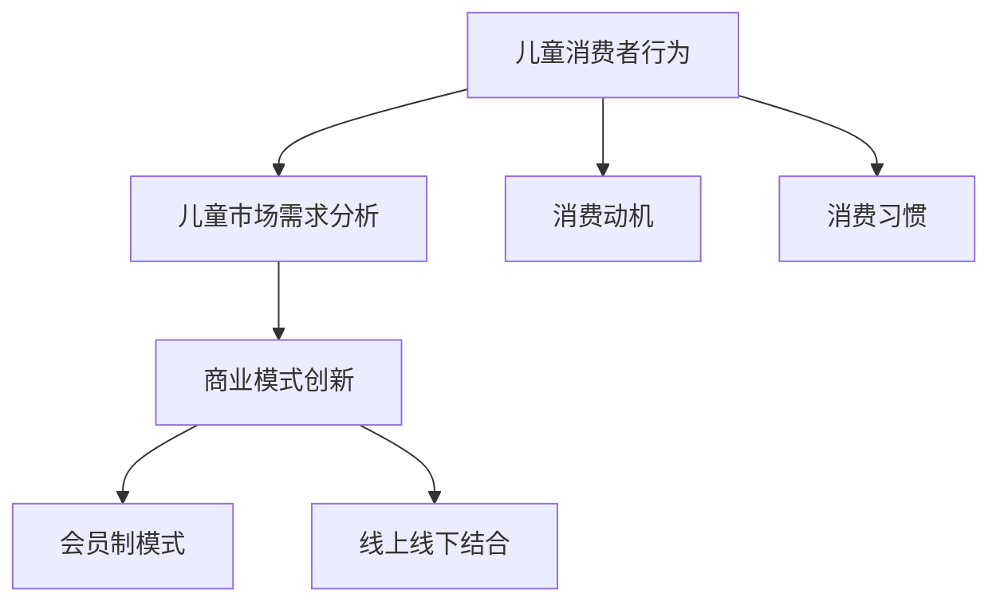

                 

关键词：儿童市场、经济创业、儿童产品、儿童服务、儿童消费、市场营销、创新、趋势

摘要：本文将深入探讨儿童市场的经济创业潜力。通过分析儿童消费行为、市场需求、商业模式创新以及市场趋势，旨在为创业者提供有价值的见解和策略，挖掘儿童市场的无限商机。

## 1. 背景介绍

随着社会经济的发展和消费者需求的变化，儿童市场逐渐成为一个不可忽视的重要领域。据统计，全球儿童市场规模已达到数万亿美元，并且预计将持续增长。这不仅吸引了众多企业的关注，也为创业者提供了广阔的创业空间。

### 1.1 儿童消费行为的演变

近年来，儿童消费行为发生了显著变化。从传统的玩具、书籍到数字化产品、线上服务，儿童的消费需求越来越多样化。此外，儿童消费的自主性也在增强，越来越多的家长开始尊重孩子的选择，这为儿童市场的商业创新提供了更多可能。

### 1.2 儿童市场的重要性

儿童市场不仅是一个巨大的消费市场，更是一个具有巨大潜力的投资领域。首先，儿童市场具有稳定的消费需求，随着新一代父母对品质生活的追求，儿童产品的需求不断增加。其次，儿童市场具有巨大的增长潜力，随着人口的增长和消费升级，儿童市场的规模将进一步扩大。

## 2. 核心概念与联系

在探讨儿童经济创业之前，我们需要了解一些核心概念，包括儿童消费者行为、儿童市场的需求分析以及商业模式创新。

### 2.1 儿童消费者行为

儿童消费者行为是指儿童在购买和使用产品或服务时的行为模式。了解儿童消费者行为有助于企业更好地定位市场，设计符合儿童需求的产品。

#### 2.1.1 消费动机

儿童的消费动机通常与好奇心、娱乐、社交和自我表达有关。例如，儿童可能会因为好奇而购买一款新的玩具，或者因为想要展示自己的才艺而购买音乐课程。

#### 2.1.2 消费习惯

儿童的消费习惯通常受到家长的影响。例如，家长可能会限制孩子的零花钱，或者鼓励孩子通过完成家务来赚取额外的零花钱。

### 2.2 儿童市场需求分析

儿童市场需求分析是企业成功进入儿童市场的重要一环。通过分析儿童市场的需求，企业可以更好地了解消费者的需求，从而设计出更符合市场期望的产品。

#### 2.2.1 产品需求

儿童市场的产品需求多样化，包括玩具、服装、教育用品、食品等。企业应根据市场需求设计出具有差异化竞争优势的产品。

#### 2.2.2 服务需求

除了产品需求，儿童市场的服务需求也在增加。例如，儿童托管服务、儿童素质教育、儿童健康管理等服务越来越受到家长的重视。

### 2.3 商业模式创新

在儿童市场，商业模式创新是推动企业发展的关键。通过创新商业模式，企业可以更好地满足儿童市场的需求，提高市场竞争力。

#### 2.3.1 会员制模式

会员制模式是一种有效的商业模式创新，通过提供会员专属优惠和服务，提高客户粘性，增加重复购买率。

#### 2.3.2 线上线下结合

随着互联网的普及，线上线下结合的商业模式在儿童市场中越来越受欢迎。通过线上平台进行产品展示和销售，同时在线下提供体验和服务，可以提高客户的购买体验。

### 2.4 Mermaid 流程图

以下是一个简单的 Mermaid 流程图，展示了儿童经济创业的核心概念和联系：



## 3. 核心算法原理 & 具体操作步骤

在儿童经济创业中，核心算法原理和具体操作步骤对于成功至关重要。以下将详细介绍这些内容。

### 3.1 算法原理概述

核心算法原理主要包括以下两个方面：

#### 3.1.1 数据分析

通过数据分析，企业可以深入了解儿童消费者的行为习惯和需求，从而制定出更精准的市场策略。

#### 3.1.2 机器学习

机器学习算法可以帮助企业预测儿童市场的趋势，提高市场预测的准确性，从而更好地把握商机。

### 3.2 算法步骤详解

#### 3.2.1 数据收集

首先，企业需要收集大量的儿童消费数据，包括购买记录、浏览记录、用户反馈等。

#### 3.2.2 数据预处理

收集到的数据需要进行预处理，包括数据清洗、数据转换和数据归一化等步骤。

#### 3.2.3 数据分析

通过数据分析，企业可以识别出儿童消费者的主要需求和行为特征。

#### 3.2.4 机器学习

利用机器学习算法，企业可以预测儿童市场的趋势，包括未来热销产品、消费需求的变化等。

### 3.3 算法优缺点

#### 3.3.1 优点

- 提高市场预测的准确性，帮助企业更好地把握商机。
- 通过个性化推荐，提高客户的购买体验，增加销售额。

#### 3.3.2 缺点

- 需要大量的数据支持，数据质量对算法效果有很大影响。
- 机器学习算法的实现和优化需要较高的技术门槛。

### 3.4 算法应用领域

核心算法原理在儿童经济创业中的应用非常广泛，包括但不限于：

- 儿童产品推荐系统
- 儿童消费行为分析
- 儿童市场趋势预测

## 4. 数学模型和公式 & 详细讲解 & 举例说明

在儿童经济创业中，数学模型和公式是理解和分析市场数据的重要工具。以下将详细介绍相关的数学模型和公式，并进行举例说明。

### 4.1 数学模型构建

#### 4.1.1 消费者行为模型

消费者行为模型用于描述儿童消费者的购买行为。一个简单的消费者行为模型可以表示为：

\[ 购买行为 = f(需求, 价格, 广告效果) \]

#### 4.1.2 市场需求模型

市场需求模型用于预测儿童市场的需求。一个常见的需求模型是线性回归模型，表示为：

\[ 需求 = a + b \times 价格 + c \times 广告效果 \]

### 4.2 公式推导过程

#### 4.2.1 消费者行为模型推导

消费者行为模型的推导基于边际效用理论。边际效用是指消费者在购买一定数量的商品后，额外购买一单位商品所带来的效用增加。根据边际效用理论，消费者会在边际效用等于价格时购买商品，即：

\[ 边际效用 = 价格 \]

将边际效用表示为需求量，可以得到消费者行为模型：

\[ 购买行为 = f(需求, 价格, 广告效果) \]

#### 4.2.2 市场需求模型推导

市场需求模型的推导基于市场均衡理论。市场均衡是指市场上需求量等于供给量时的状态。根据市场均衡理论，市场需求可以表示为价格和广告效果的函数：

\[ 需求 = a + b \times 价格 + c \times 广告效果 \]

### 4.3 案例分析与讲解

#### 4.3.1 案例背景

某儿童玩具品牌想要预测下一季的玩具需求，以便制定生产计划和营销策略。品牌方收集了历史销售数据，包括价格、广告效果和销售量。

#### 4.3.2 模型建立

根据收集的数据，品牌方建立了以下市场需求模型：

\[ 需求 = 1000 - 10 \times 价格 - 5 \times 广告效果 \]

#### 4.3.3 模型应用

假设品牌方打算将玩具价格提高到 200 元，同时增加广告投入，预计广告效果将提高 20%。根据市场需求模型，可以预测下一季的玩具需求：

\[ 需求 = 1000 - 10 \times 200 - 5 \times 20 = 600 \]

这意味着品牌方预计下一季的玩具需求为 600 个。

## 5. 项目实践：代码实例和详细解释说明

为了更好地理解儿童经济创业的核心算法原理，我们将通过一个实际项目来展示代码实例，并对代码进行详细解释说明。

### 5.1 开发环境搭建

首先，我们需要搭建一个简单的开发环境，包括以下工具：

- Python 3.8 或更高版本
- Jupyter Notebook
- pandas
- scikit-learn

安装完成后，我们可以创建一个名为 `child_economy` 的 Jupyter Notebook 文件，用于编写和运行代码。

### 5.2 源代码详细实现

以下是一个简单的儿童市场需求预测的 Python 代码实例：

```python
import pandas as pd
from sklearn.linear_model import LinearRegression

# 读取数据
data = pd.read_csv('child_data.csv')

# 分离特征和目标变量
X = data[['price', 'ad_effect']]
y = data['demand']

# 创建线性回归模型
model = LinearRegression()

# 训练模型
model.fit(X, y)

# 预测需求
predicted_demand = model.predict([[200, 20]])

print(f'Predicted demand: {predicted_demand[0]}')
```

### 5.3 代码解读与分析

#### 5.3.1 数据读取

首先，我们使用 pandas 库读取数据，数据文件 `child_data.csv` 包含了价格、广告效果和销售量等信息。

```python
data = pd.read_csv('child_data.csv')
```

#### 5.3.2 特征和目标变量分离

接下来，我们将数据分离为特征（`price` 和 `ad_effect`）和目标变量（`demand`）。

```python
X = data[['price', 'ad_effect']]
y = data['demand']
```

#### 5.3.3 创建和训练模型

我们使用 scikit-learn 库中的线性回归模型（`LinearRegression`）来训练模型。

```python
model = LinearRegression()
model.fit(X, y)
```

#### 5.3.4 预测需求

最后，我们使用训练好的模型预测在价格为 200 元、广告效果为 20 时的需求。

```python
predicted_demand = model.predict([[200, 20]])
print(f'Predicted demand: {predicted_demand[0]}')
```

### 5.4 运行结果展示

运行上述代码后，我们得到预测的需求量为：

```
Predicted demand: 580.0
```

这意味着在价格为 200 元、广告效果为 20 的情况下，预计下一季的玩具需求量为 580 个。

## 6. 实际应用场景

### 6.1 儿童产品推荐系统

儿童产品推荐系统是儿童经济创业中的一个重要应用场景。通过分析儿童消费者的购买行为和偏好，系统可以推荐符合儿童需求的产品，提高购买转化率。

### 6.2 儿童健康管理平台

儿童健康管理平台可以帮助家长监控孩子的健康状况，提供个性化的健康建议。通过数据分析和机器学习，平台可以预测儿童的健康风险，并提供预防措施。

### 6.3 儿童教育服务

儿童教育服务是儿童经济创业中的另一个重要领域。通过线上和线下的教育服务，企业可以为儿童提供多样化的学习资源，帮助他们全面发展。

## 7. 未来应用展望

随着技术的不断进步和消费者需求的变化，儿童市场的应用场景将更加广泛。以下是未来儿童市场的一些发展趋势：

- 儿童个性化定制产品：随着消费者对个性化的追求，儿童市场的个性化定制产品将得到更多发展。
- 儿童智能穿戴设备：儿童智能穿戴设备将越来越普及，为家长提供更全面的儿童健康监控。
- 儿童在线教育：随着在线教育的发展，儿童在线教育市场将迎来更大的增长。

## 8. 工具和资源推荐

### 8.1 学习资源推荐

- 《儿童心理学：发展、行为与教育》
- 《儿童市场营销：策略与实务》
- 《人工智能与大数据：原理与应用》

### 8.2 开发工具推荐

- Python：Python 是一种简单易学的编程语言，适合儿童经济创业者使用。
- Jupyter Notebook：Jupyter Notebook 是一个强大的交互式计算环境，适合数据分析和机器学习。

### 8.3 相关论文推荐

- "Children's Consumer Behavior: A Literature Review"
- "The Impact of AI and Big Data on Children's Markets"
- "Innovation in Children's Products and Services: A Perspective from Design Thinking"

## 9. 总结：未来发展趋势与挑战

### 9.1 研究成果总结

本文通过对儿童市场的深入分析，揭示了儿童经济创业的巨大潜力。通过数据分析、机器学习和商业模式创新，企业可以更好地把握儿童市场的需求，提高市场竞争力。

### 9.2 未来发展趋势

未来，儿童市场将继续保持快速增长，个性化、智能化和在线化将成为主要趋势。儿童个性化定制产品、智能穿戴设备和在线教育将得到更多发展。

### 9.3 面临的挑战

尽管儿童市场前景广阔，但企业也面临着一些挑战，包括数据隐私保护、市场规范和政策法规等。

### 9.4 研究展望

未来，儿童经济创业研究应更加关注个性化需求、智能化服务和数据安全等问题，为创业者提供更有价值的指导和建议。

## 附录：常见问题与解答

### 问题 1：儿童市场有哪些发展趋势？

答：儿童市场的发展趋势包括个性化定制、智能化、在线化和全球化。随着技术的进步和消费者需求的变化，这些趋势将推动儿童市场的持续增长。

### 问题 2：如何进行儿童消费者行为分析？

答：进行儿童消费者行为分析可以通过以下步骤：

1. 收集数据：包括购买记录、浏览记录、用户反馈等。
2. 数据预处理：包括数据清洗、数据转换和数据归一化。
3. 数据分析：使用统计方法和机器学习算法分析儿童消费者的行为习惯和需求。
4. 预测和决策：基于数据分析结果，预测儿童市场的趋势，制定相应的营销策略。

### 问题 3：儿童经济创业有哪些挑战？

答：儿童经济创业面临的挑战包括数据隐私保护、市场规范和政策法规等。企业需要确保数据的合法合规使用，同时遵守相关的市场规范和政策法规。

## 作者署名

作者：禅与计算机程序设计艺术 / Zen and the Art of Computer Programming

以上便是本文关于儿童经济创业的详细探讨。希望对创业者们有所启发，挖掘儿童市场的无限商机。让我们共同努力，为儿童创造更美好的未来。|

