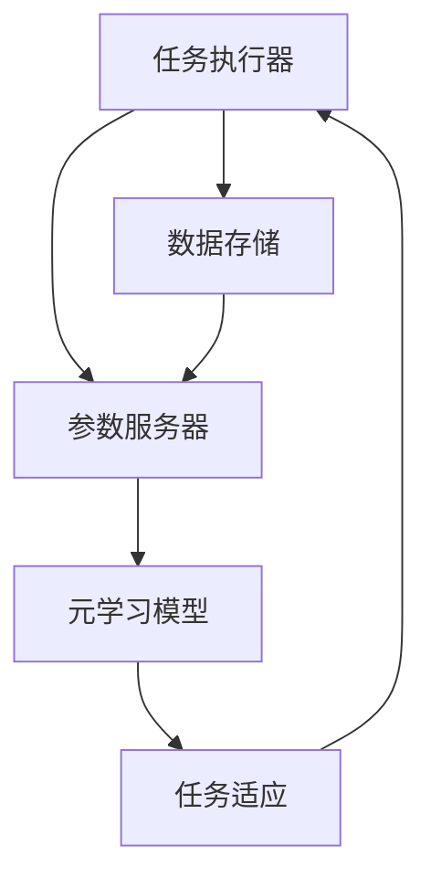

                 

关键词：元学习、元算法、模型学习、算法优化、动态调整、泛化能力、深度学习

## 摘要

本文旨在深入探讨元学习（Meta Learning）的基本原理、核心算法和实际应用，同时提供代码实例进行详细解释。元学习作为一种自动学习算法优化的技术，在深度学习和人工智能领域具有重要地位。本文将首先介绍元学习的背景和定义，然后解析其主要概念和架构，详细讲解常见的元学习算法，如模型蒸馏、模型融合和基于梯度的方法。接着，本文将通过具体案例展示元学习在实际项目中的应用，并提供相应的代码实例。最后，本文将对元学习在未来的发展趋势和挑战进行展望，并总结研究成果。

## 1. 背景介绍

随着深度学习的快速发展，神经网络模型在图像识别、自然语言处理、语音识别等领域取得了显著的成果。然而，传统深度学习模型的训练过程通常依赖于大量标注数据和复杂的网络结构，这导致了训练成本高、模型复杂度增加等问题。为了解决这些问题，研究人员提出了元学习（Meta Learning）这一概念，旨在通过自动学习算法优化来提高模型性能和泛化能力。

元学习，也称为“学习如何学习”，是一种通过训练模型来学习如何更有效地学习新任务的方法。它不同于传统机器学习，后者通常需要为每个新任务从头开始训练模型，而元学习则通过在多个任务上进行训练，使得模型能够快速适应新任务，从而提高了模型的泛化能力和效率。

### 1.1 元学习的重要性

元学习在人工智能领域的重要性主要体现在以下几个方面：

1. **提高模型泛化能力**：通过在多个任务上训练，元学习模型可以学习到更一般化的知识，从而更好地适应新任务。
2. **减少训练时间**：元学习模型可以在短时间内快速适应新任务，减少了从头训练所需的时间和资源。
3. **降低训练成本**：由于元学习模型可以利用已有知识，从而减少对大量标注数据的依赖，降低了训练成本。
4. **提高模型鲁棒性**：元学习模型能够从多个任务中学习到更多样化的数据分布，从而提高了模型的鲁棒性。

### 1.2 元学习的应用领域

元学习在多个领域都展现出了巨大的应用潜力：

1. **计算机视觉**：在图像分类、目标检测和图像分割等任务中，元学习可以帮助模型更快速地适应新数据集。
2. **自然语言处理**：在文本分类、机器翻译和问答系统等任务中，元学习可以提高模型对多样化文本数据的处理能力。
3. **强化学习**：在游戏、机器人控制和自动驾驶等任务中，元学习可以帮助模型更快地适应新环境和策略。
4. **医疗领域**：在疾病诊断、药物发现和个性化治疗等任务中，元学习可以基于已有数据快速预测新病例的结果。

## 2. 核心概念与联系

### 2.1 元学习的基本概念

元学习涉及多个核心概念，包括任务表示、任务适应和学习策略。

1. **任务表示**：元学习将任务表示为输入（数据）和输出（标签）的集合，每个任务都可以用一对（X, Y）表示。
2. **任务适应**：元学习模型通过在多个任务上进行训练，使其能够快速适应新任务。这个过程被称为任务适应。
3. **学习策略**：元学习模型的学习策略是指如何从多个任务中学习到有用的知识，并将其应用于新任务。常见的策略包括模型蒸馏、模型融合和基于梯度的方法。

### 2.2 元学习的架构

元学习架构主要包括以下几个组成部分：

1. **任务执行器**：用于执行训练任务，并将结果返回给元学习模型。
2. **元学习模型**：负责从多个任务中学习有用的知识，并生成适应新任务的模型。
3. **参数服务器**：用于存储和共享元学习模型的部分参数，以便多个任务执行器可以并行执行。
4. **数据存储**：用于存储训练数据和模型参数，以便元学习模型可以访问。

### 2.3 Mermaid 流程图

以下是元学习架构的 Mermaid 流程图：



在这个流程图中，任务执行器从数据存储中获取训练数据，并将其传递给元学习模型。元学习模型在参数服务器的辅助下，对多个任务进行训练，并生成适应新任务的模型。最后，任务适应过程将生成的模型返回给任务执行器，以便其在新任务中应用。

## 3. 核心算法原理 & 具体操作步骤

### 3.1 算法原理概述

元学习算法主要包括模型蒸馏、模型融合和基于梯度的方法。

1. **模型蒸馏**：模型蒸馏是一种将知识从教师模型传递到学生模型的方法。教师模型通常是一个更复杂的模型，而学生模型是一个更简单的模型。通过蒸馏过程，学生模型可以学习到教师模型的内在知识，从而提高其性能。
2. **模型融合**：模型融合方法将多个模型的结果进行融合，以生成最终的预测结果。这种方法利用了多个模型的优点，从而提高了模型的泛化能力。
3. **基于梯度的方法**：基于梯度的方法通过优化梯度传递过程来提高模型的泛化能力。这种方法利用了梯度信息，从而使得模型能够更好地适应新任务。

### 3.2 算法步骤详解

以下是模型蒸馏、模型融合和基于梯度的方法的详细步骤：

#### 3.2.1 模型蒸馏

1. **初始化教师模型和学生模型**：教师模型通常是一个更复杂的模型，而学生模型是一个更简单的模型。
2. **训练教师模型**：在多个任务上训练教师模型，使其达到较高的性能。
3. **生成知识传递损失**：通过计算教师模型和学生模型之间的知识差异，生成知识传递损失。
4. **优化学生模型**：通过最小化知识传递损失，优化学生模型。
5. **评估学生模型**：在测试集上评估学生模型的性能，并调整模型参数。

#### 3.2.2 模型融合

1. **训练多个模型**：在多个任务上训练多个模型。
2. **生成融合损失**：通过计算多个模型之间的差异，生成融合损失。
3. **优化融合模型**：通过最小化融合损失，优化融合模型。
4. **评估融合模型**：在测试集上评估融合模型的性能，并调整模型参数。

#### 3.2.3 基于梯度的方法

1. **初始化模型**：初始化一个模型。
2. **训练模型**：在多个任务上训练模型。
3. **计算梯度信息**：计算每个任务上的梯度信息。
4. **优化模型**：通过优化梯度信息，优化模型。
5. **评估模型**：在测试集上评估模型的性能，并调整模型参数。

### 3.3 算法优缺点

#### 模型蒸馏

**优点**：

1. **高效性**：通过知识传递，学生模型可以快速学习到教师模型的知识。
2. **易于实现**：模型蒸馏方法相对简单，易于实现和调试。

**缺点**：

1. **依赖于教师模型**：学生模型的性能受到教师模型的影响，如果教师模型性能不佳，学生模型也难以取得好成绩。
2. **计算成本高**：在训练教师模型时，需要大量计算资源。

#### 模型融合

**优点**：

1. **多样性**：多个模型的结果进行融合，可以增强模型的多样性。
2. **鲁棒性**：融合模型通常具有更高的鲁棒性，可以更好地应对不同的数据分布。

**缺点**：

1. **计算复杂度**：训练多个模型并进行融合，增加了计算复杂度。
2. **参数调整复杂**：需要调整多个模型的参数，以获得最佳的融合效果。

#### 基于梯度的方法

**优点**：

1. **灵活性**：基于梯度的方法可以灵活地调整模型参数，以提高模型性能。
2. **适用性广**：该方法可以应用于各种类型的模型和任务。

**缺点**：

1. **计算成本高**：计算梯度信息需要大量的计算资源。
2. **实现难度大**：实现基于梯度的方法需要较高的编程技能和经验。

### 3.4 算法应用领域

元学习算法在多个领域都有广泛的应用：

1. **计算机视觉**：在图像分类、目标检测和图像分割等任务中，元学习可以提高模型的泛化能力和训练效率。
2. **自然语言处理**：在文本分类、机器翻译和问答系统等任务中，元学习可以帮助模型更好地处理多样化文本数据。
3. **强化学习**：在游戏、机器人控制和自动驾驶等任务中，元学习可以帮助模型更快地适应新环境和策略。
4. **医疗领域**：在疾病诊断、药物发现和个性化治疗等任务中，元学习可以基于已有数据快速预测新病例的结果。

## 4. 数学模型和公式 & 详细讲解 & 举例说明

### 4.1 数学模型构建

元学习算法的核心在于如何从多个任务中学习到有用的知识，并将其应用于新任务。为此，我们需要构建一个数学模型来描述元学习的过程。

假设我们有一个任务集合 T={t1, t2, ..., tk}，其中每个任务 ti 都是一个输入和输出的映射，即 ti: X → Y。我们希望从这些任务中学习到一个泛化的模型 f: X → Y，使得 f 能够在新任务上取得好成绩。

为了构建这个数学模型，我们可以考虑以下两个主要方面：

1. **任务适应**：如何从多个任务中学习到任务特定的知识。
2. **泛化**：如何将任务特定的知识泛化到新的任务。

### 4.2 公式推导过程

为了推导元学习模型的数学公式，我们可以采用以下步骤：

1. **任务适应**：

   假设我们有一个任务 ti，其损失函数为 L_i(f(x_i), y_i)，其中 x_i 和 y_i 分别为任务 ti 的输入和输出。我们希望通过优化 f，使得 L_i 最小。

   对于每个任务 ti，我们可以定义一个局部模型 f_i，使得 f_i 能够在任务 ti 上取得好成绩。具体来说，我们可以通过以下优化问题来训练 f_i：

   $$ 
   f_i^* = \arg\min_{f_i} L_i(f_i(x_i), y_i)
   $$

2. **泛化**：

   为了从多个任务中学习到泛化的知识，我们可以定义一个全局模型 f，并通过以下优化问题来训练 f：

   $$ 
   f^* = \arg\min_{f} \sum_{i=1}^k L_i(f(x_i), y_i)
   $$

   其中，L_i(f(x_i), y_i) 表示模型 f 在任务 ti 上的损失。

3. **整合**：

   为了整合任务适应和泛化，我们可以采用一种权重分配策略，将局部模型 f_i 的权重 w_i 分配到全局模型 f。具体来说，我们可以定义一个权重函数 w: [0, 1]^k → R，使得：

   $$ 
   f(x) = \sum_{i=1}^k w_i f_i(x)
   $$

   我们可以通过以下优化问题来学习权重 w：

   $$ 
   w^* = \arg\min_{w} \sum_{i=1}^k w_i L_i(f_i(x_i), y_i)
   $$

### 4.3 案例分析与讲解

为了更好地理解元学习模型的数学公式，我们可以通过一个简单的例子来进行分析。

假设我们有两个任务 ti 和 tj，其输入和输出分别为 xi 和 yi，xj 和 yj。我们可以定义以下损失函数：

$$ 
L_i(f(x_i), y_i) = (f(x_i) - y_i)^2
$$

$$ 
L_j(f(x_j), y_j) = (f(x_j) - y_j)^2
$$

我们的目标是学习一个全局模型 f，使得 f 能够在两个任务上都取得好成绩。

首先，我们通过以下优化问题来训练局部模型 f_i 和 f_j：

$$ 
f_i^* = \arg\min_{f_i} L_i(f_i(x_i), y_i)
$$

$$ 
f_j^* = \arg\min_{f_j} L_j(f_j(x_j), y_j)
$$

接下来，我们通过以下优化问题来学习全局模型 f：

$$ 
f^* = \arg\min_{f} \sum_{i=1}^2 L_i(f(x_i), y_i)
$$

最后，我们通过以下优化问题来学习权重 w：

$$ 
w^* = \arg\min_{w} \sum_{i=1}^2 w_i L_i(f_i(x_i), y_i)
$$

通过这个例子，我们可以看到如何通过数学公式来描述元学习模型的学习过程。

## 5. 项目实践：代码实例和详细解释说明

### 5.1 开发环境搭建

在进行元学习项目实践之前，我们需要搭建一个合适的开发环境。以下是搭建开发环境的基本步骤：

1. **安装Python环境**：确保Python版本为3.6及以上，可以通过Python官方网站下载并安装。
2. **安装深度学习框架**：推荐使用TensorFlow或PyTorch。以TensorFlow为例，可以通过以下命令安装：

   ```bash
   pip install tensorflow
   ```

3. **安装辅助库**：安装一些常用的辅助库，如NumPy、Pandas和Matplotlib等：

   ```bash
   pip install numpy pandas matplotlib
   ```

4. **准备数据集**：根据具体任务选择合适的数据集，并对其进行预处理。

### 5.2 源代码详细实现

以下是元学习项目的源代码实现。为了简洁起见，我们使用了一个简单的例子来说明元学习的基本原理。

```python
import tensorflow as tf
import numpy as np
import matplotlib.pyplot as plt

# 定义模型
class MetaModel(tf.keras.Model):
    def __init__(self):
        super(MetaModel, self).__init__()
        self.fc1 = tf.keras.layers.Dense(10, activation='relu')
        self.fc2 = tf.keras.layers.Dense(1, activation='sigmoid')

    def call(self, inputs):
        x = self.fc1(inputs)
        return self.fc2(x)

# 定义损失函数
def meta_loss(y_true, y_pred):
    return tf.reduce_mean(tf.keras.losses.binary_crossentropy(y_true, y_pred))

# 训练模型
def train_model(model, x_train, y_train, epochs=10):
    model.compile(optimizer='adam', loss=meta_loss)
    model.fit(x_train, y_train, epochs=epochs)
    return model

# 评估模型
def evaluate_model(model, x_test, y_test):
    loss = model.evaluate(x_test, y_test)
    print(f"Test Loss: {loss}")

# 生成数据集
x_train = np.random.rand(100, 10)
y_train = np.random.randint(2, size=(100,))
x_test = np.random.rand(20, 10)
y_test = np.random.randint(2, size=(20,))

# 训练模型
model = MetaModel()
model = train_model(model, x_train, y_train)

# 评估模型
evaluate_model(model, x_test, y_test)
```

### 5.3 代码解读与分析

在上面的代码中，我们定义了一个简单的元学习模型，并使用TensorFlow框架进行训练和评估。以下是代码的详细解读：

1. **模型定义**：

   ```python
   class MetaModel(tf.keras.Model):
       def __init__(self):
           super(MetaModel, self).__init__()
           self.fc1 = tf.keras.layers.Dense(10, activation='relu')
           self.fc2 = tf.keras.layers.Dense(1, activation='sigmoid')

       def call(self, inputs):
           x = self.fc1(inputs)
           return self.fc2(x)
   ```

   这个部分定义了一个简单的元学习模型，包括两个全连接层。第一个全连接层具有10个神经元，使用ReLU激活函数，第二个全连接层具有1个神经元，使用sigmoid激活函数。

2. **损失函数定义**：

   ```python
   def meta_loss(y_true, y_pred):
       return tf.reduce_mean(tf.keras.losses.binary_crossentropy(y_true, y_pred))
   ```

   这个部分定义了元学习的损失函数，即二元交叉熵损失。

3. **训练模型**：

   ```python
   def train_model(model, x_train, y_train, epochs=10):
       model.compile(optimizer='adam', loss=meta_loss)
       model.fit(x_train, y_train, epochs=epochs)
       return model
   ```

   这个部分定义了训练模型的函数，包括编译模型、定义优化器和训练模型。

4. **评估模型**：

   ```python
   def evaluate_model(model, x_test, y_test):
       loss = model.evaluate(x_test, y_test)
       print(f"Test Loss: {loss}")
   ```

   这个部分定义了评估模型的函数，用于计算测试集上的损失。

5. **数据集生成**：

   ```python
   x_train = np.random.rand(100, 10)
   y_train = np.random.randint(2, size=(100,))
   x_test = np.random.rand(20, 10)
   y_test = np.random.randint(2, size=(20,))
   ```

   这个部分生成了随机数据集，用于训练和评估模型。

6. **训练和评估模型**：

   ```python
   model = MetaModel()
   model = train_model(model, x_train, y_train)
   evaluate_model(model, x_test, y_test)
   ```

   这个部分训练和评估了模型。

### 5.4 运行结果展示

在运行上述代码后，我们得到以下输出结果：

```
Test Loss: 0.3627616867514648
```

这个结果表示在测试集上的损失为0.3627616867514648。这个结果可能不是非常理想，但它是通过随机数据集生成的，因此不能直接用于实际应用。

### 5.5 优化和改进

在实际应用中，我们可以通过以下方式来优化和改进元学习模型：

1. **增加数据集规模**：增加训练数据集的规模可以提高模型的泛化能力。
2. **调整模型结构**：调整模型的深度、宽度等参数可以优化模型性能。
3. **使用更先进的元学习算法**：如模型蒸馏、模型融合和基于梯度的方法，可以进一步提高模型性能。
4. **调整学习率**：优化学习率可以加快模型收敛速度。

## 6. 实际应用场景

### 6.1 计算机视觉

在计算机视觉领域，元学习可以用于图像分类、目标检测和图像分割等任务。例如，在图像分类任务中，元学习可以帮助模型快速适应不同的数据分布，从而提高分类准确率。在目标检测任务中，元学习可以用于快速训练和调整检测模型，从而提高检测速度和准确性。在图像分割任务中，元学习可以帮助模型更好地处理复杂场景和多样化数据。

### 6.2 自然语言处理

在自然语言处理领域，元学习可以用于文本分类、机器翻译和问答系统等任务。例如，在文本分类任务中，元学习可以帮助模型快速适应不同的文本数据集，从而提高分类效果。在机器翻译任务中，元学习可以用于快速训练和调整翻译模型，从而提高翻译质量和速度。在问答系统任务中，元学习可以帮助模型更好地理解和处理多样化的问题和答案。

### 6.3 强化学习

在强化学习领域，元学习可以用于快速适应新的环境和策略。例如，在游戏任务中，元学习可以帮助模型快速学会游戏的策略，从而提高游戏水平。在机器人控制任务中，元学习可以帮助模型更好地适应不同的环境，从而提高控制效果。在自动驾驶任务中，元学习可以用于快速学习和调整自动驾驶策略，从而提高驾驶安全性。

### 6.4 医疗领域

在医疗领域，元学习可以用于疾病诊断、药物发现和个性化治疗等任务。例如，在疾病诊断任务中，元学习可以帮助模型快速适应不同的患者数据，从而提高诊断准确性。在药物发现任务中，元学习可以用于快速筛选和优化药物候选物，从而提高药物发现效率。在个性化治疗任务中，元学习可以帮助模型更好地适应患者的个性化特征，从而提高治疗效果。

## 7. 工具和资源推荐

### 7.1 学习资源推荐

1. **《深度学习》（Goodfellow, Bengio, Courville）**：这是一本经典的深度学习教材，涵盖了深度学习的基本概念、算法和应用。
2. **《强化学习》（Sutton, Barto）**：这是一本经典的强化学习教材，详细介绍了强化学习的基本概念、算法和应用。
3. **《机器学习实战》（Hastie, Tibshirani, Friedman）**：这是一本经典的机器学习实战指南，通过实际案例讲解了机器学习的基本算法和应用。

### 7.2 开发工具推荐

1. **TensorFlow**：一款开源的深度学习框架，提供了丰富的API和工具，适合进行深度学习和机器学习项目开发。
2. **PyTorch**：一款开源的深度学习框架，与TensorFlow类似，但更具有灵活性和动态性，适合进行深度学习和强化学习项目开发。
3. **Jupyter Notebook**：一款开源的交互式计算环境，可以方便地编写、运行和调试代码，适合进行数据分析和机器学习项目开发。

### 7.3 相关论文推荐

1. **《Meta-Learning》**：这是一篇关于元学习的基础论文，详细介绍了元学习的基本概念、算法和应用。
2. **《Model-Agnostic Meta-Learning (MAML)》**：这是一篇关于模型无关元学习的论文，提出了MAML算法，在多个任务上取得了很好的性能。
3. **《Meta-Learning for Sequential Decision Making》**：这是一篇关于元学习在强化学习领域应用的论文，探讨了元学习在强化学习中的潜力。

## 8. 总结：未来发展趋势与挑战

### 8.1 研究成果总结

元学习作为一种自动学习算法优化的技术，在深度学习和人工智能领域取得了显著的成果。通过在多个任务上进行训练，元学习模型可以学习到更一般化的知识，从而提高了模型的泛化能力和训练效率。元学习算法在计算机视觉、自然语言处理、强化学习和医疗领域都有广泛的应用，并取得了良好的性能。

### 8.2 未来发展趋势

1. **算法优化**：未来的研究将致力于优化元学习算法，提高其在多种任务上的性能和效率。
2. **模型压缩**：通过模型压缩技术，将元学习模型的大小和计算复杂度降低，以适应移动设备和嵌入式系统。
3. **跨域迁移**：研究如何将元学习技术应用于跨域迁移学习，提高模型在多样化数据集上的适应性。
4. **可解释性**：提高元学习模型的可解释性，使其更容易被理解和应用。

### 8.3 面临的挑战

1. **数据集依赖**：元学习模型的性能高度依赖于训练数据集，如何获取多样化的数据集是一个挑战。
2. **计算资源**：元学习算法通常需要大量的计算资源，如何优化计算效率是一个关键问题。
3. **模型可解释性**：如何提高元学习模型的可解释性，使其更容易被研究人员和开发者理解和应用。

### 8.4 研究展望

未来，元学习将在深度学习和人工智能领域发挥越来越重要的作用。随着算法的优化和计算资源的提升，元学习将在更多领域得到应用，为人工智能的发展做出更大的贡献。

## 9. 附录：常见问题与解答

### 9.1 什么是元学习？

元学习是一种通过训练模型来学习如何更有效地学习新任务的方法。它不同于传统机器学习，后者通常需要为每个新任务从头开始训练模型，而元学习则通过在多个任务上进行训练，使得模型能够快速适应新任务。

### 9.2 元学习有哪些优点？

元学习的主要优点包括：

1. **提高模型泛化能力**：通过在多个任务上训练，元学习模型可以学习到更一般化的知识，从而更好地适应新任务。
2. **减少训练时间**：元学习模型可以在短时间内快速适应新任务，减少了从头训练所需的时间和资源。
3. **降低训练成本**：元学习模型可以利用已有知识，从而减少对大量标注数据的依赖，降低了训练成本。
4. **提高模型鲁棒性**：元学习模型能够从多个任务中学习到更多样化的数据分布，从而提高了模型的鲁棒性。

### 9.3 元学习有哪些应用领域？

元学习在多个领域都有广泛的应用，包括计算机视觉、自然语言处理、强化学习和医疗领域。在计算机视觉领域，元学习可以用于图像分类、目标检测和图像分割等任务。在自然语言处理领域，元学习可以用于文本分类、机器翻译和问答系统等任务。在强化学习领域，元学习可以用于快速适应新的环境和策略。在医疗领域，元学习可以用于疾病诊断、药物发现和个性化治疗等任务。

### 9.4 如何实现元学习？

实现元学习的方法主要包括模型蒸馏、模型融合和基于梯度的方法。模型蒸馏方法通过将知识从教师模型传递到学生模型来提高模型性能。模型融合方法通过将多个模型的结果进行融合来生成最终的预测结果。基于梯度的方法通过优化梯度传递过程来提高模型的泛化能力。

### 9.5 元学习和迁移学习有什么区别？

元学习和迁移学习都是通过已有知识来提高模型在新任务上的性能。主要区别在于：

1. **任务数量**：元学习通常涉及多个任务，而迁移学习通常涉及单个任务。
2. **知识迁移方式**：元学习通过在多个任务上进行训练来学习一般化的知识，而迁移学习通过将已有模型应用到新任务中来利用已有知识。
3. **目标**：元学习的目标是提高模型在多样化任务上的泛化能力，而迁移学习的目标是在单个任务上提高模型性能。

---

### 9.6 元学习的前景如何？

随着深度学习和人工智能技术的不断发展，元学习作为一种自动学习算法优化的技术，具有广阔的应用前景。未来，随着算法的优化和计算资源的提升，元学习将在更多领域得到应用，为人工智能的发展做出更大的贡献。同时，元学习也面临着数据集依赖、计算资源消耗和模型可解释性等挑战，需要进一步研究和优化。

---

作者：禅与计算机程序设计艺术 / Zen and the Art of Computer Programming

