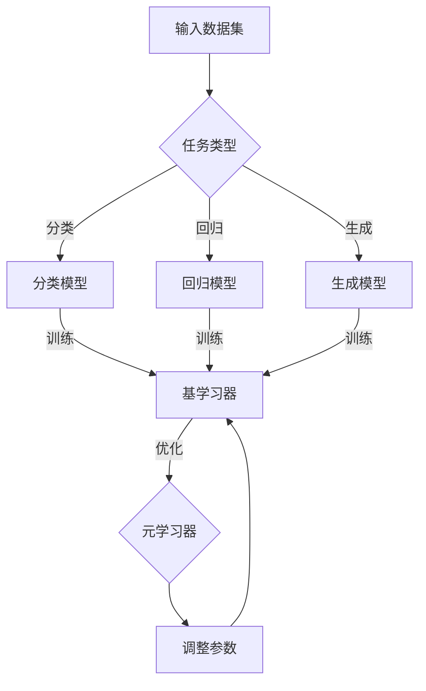

                 

关键词：元学习、AI系统、自我优化、深度学习、机器学习、模型学习、自适应学习、强化学习、神经网络、人工智能发展、学习算法

> 摘要：本文探讨了元学习的概念、原理及其在人工智能系统中的应用。元学习是一种让AI系统学会如何学习的方法，旨在提高AI的自我优化能力和适应性。本文将详细介绍元学习的核心概念、算法原理、数学模型和公式，并通过实际项目实例进行代码解析，探讨其在实际应用中的潜力和挑战，为未来人工智能的发展提供新的思路。

## 1. 背景介绍

随着人工智能（AI）技术的快速发展，深度学习、机器学习、神经网络等技术在各个领域取得了显著的成果。然而，传统的机器学习算法往往依赖于大量的标注数据和漫长的训练时间。这使得AI系统在面对复杂、动态和未知的任务时显得力不从心。为了解决这一问题，元学习（Meta-Learning）作为一种新兴的学习方法应运而生。

### 什么是元学习？

元学习，又称“学习如何学习”或“学习算法的学习”，是一种让AI系统学会如何快速、自适应地学习的方法。它通过让AI系统学会优化自身的学习过程，从而提高学习效率和泛化能力。与传统的机器学习不同，元学习的目标是设计出通用性强的学习算法，使其能够适应各种不同的任务和数据分布。

### 元学习的重要性

元学习在人工智能领域具有重要意义：

1. **提高学习效率**：通过自我优化，元学习可以加速训练过程，降低计算成本。
2. **增强泛化能力**：元学习算法能够从多种任务中提取通用特征，提高模型在不同领域的适应性。
3. **适应动态环境**：元学习系统可以实时调整自身的学习策略，应对环境变化。
4. **减轻数据依赖**：元学习减少了对于大规模标注数据的依赖，有助于解决数据稀缺问题。

## 2. 核心概念与联系

### 元学习核心概念

元学习涉及多个关键概念，包括：

1. **基学习器（Base Learner）**：基学习器是指用于解决具体任务的原始学习算法，如深度学习模型、决策树等。
2. **元学习器（Meta-Learner）**：元学习器是用于优化基学习器的算法，它通过调整基学习器的参数，使其适应不同的任务和数据分布。
3. **学习任务（Learning Task）**：学习任务是指AI系统需要解决的问题，如分类、回归、生成等。
4. **数据分布（Data Distribution）**：数据分布是指训练数据集的统计特性，包括数据的种类、数量、分布等。

### 元学习原理架构

以下是元学习的原理架构，使用Mermaid流程图表示：



### 元学习与相关技术的关系

元学习与深度学习、机器学习、强化学习等技术有着紧密的联系：

1. **与深度学习的结合**：元学习可以用于优化深度学习模型的训练过程，提高模型的泛化能力。
2. **与机器学习的互补**：元学习补充了传统机器学习在数据稀缺和动态环境下的不足。
3. **与强化学习的融合**：元学习可以与强化学习结合，提高强化学习算法的稳定性和收敛速度。

## 3. 核心算法原理 & 具体操作步骤

### 3.1 算法原理概述

元学习算法的核心思想是设计一种能够自动调整学习策略的算法，使其在新的任务和数据分布上能够快速、准确地学习。元学习算法通常分为以下几类：

1. **模型加权法（Model-Based Meta-Learning）**：通过构建一个模型集合，根据新任务的数据分布动态调整模型权重，实现快速学习。
2. **优化方法（Optimization-Based Meta-Learning）**：通过优化基学习器的参数，使模型在新任务上表现更优。
3. **模型抽样法（Model-Based Sampling Meta-Learning）**：通过随机抽样基学习器，结合样本信息进行优化，实现高效学习。

### 3.2 算法步骤详解

以下是一个简单的模型加权法元学习算法的步骤：

1. **初始化**：初始化模型集合M，每个模型都是基学习器。
2. **数据预处理**：对输入数据进行预处理，如归一化、去噪等。
3. **训练阶段**：
   - 对每个模型M_i，在训练集上执行基学习算法，得到模型参数θ_i。
   - 计算每个模型的损失函数L_i，选择损失函数最小的模型作为当前最优模型。
4. **更新阶段**：
   - 根据当前最优模型的参数θ^*，更新模型集合M中的模型参数。
   - 重新计算模型损失函数，选择新的最优模型。
5. **测试阶段**：在测试集上评估当前最优模型的表现，重复训练和更新过程。

### 3.3 算法优缺点

**优点**：

- **快速适应**：通过动态调整模型参数，元学习算法能够在短时间内适应新任务。
- **泛化能力**：元学习算法可以从多个任务中提取通用特征，提高模型的泛化能力。
- **减轻数据依赖**：元学习算法能够从少量数据中提取信息，减少对大规模标注数据的依赖。

**缺点**：

- **计算复杂度**：元学习算法通常需要大量的计算资源，特别是在模型数量较多的情况下。
- **模型选择**：选择合适的基学习器和元学习算法是一个复杂的问题，需要大量的实验和调优。

### 3.4 算法应用领域

元学习算法在多个领域都有广泛应用：

1. **计算机视觉**：用于图像分类、目标检测、人脸识别等任务。
2. **自然语言处理**：用于文本分类、机器翻译、情感分析等任务。
3. **强化学习**：用于强化学习算法的优化和稳定化。
4. **医疗诊断**：用于医学图像分析和疾病预测。
5. **自动驾驶**：用于自动驾驶系统的实时适应和决策。

## 4. 数学模型和公式 & 详细讲解 & 举例说明

### 4.1 数学模型构建

元学习算法通常涉及到以下数学模型：

1. **损失函数**：用于评估模型在任务上的表现，如交叉熵损失、均方误差等。
2. **优化目标**：用于优化模型参数，如梯度下降、随机梯度下降等。
3. **模型更新**：用于更新模型参数，如模型加权法、优化方法等。

以下是模型加权法元学习算法的数学模型：

$$
\begin{aligned}
L_i &= \frac{1}{n} \sum_{x \in D_i} l(y_i(x), \theta_i), \\
\theta^* &= \arg \min_{\theta_i} L_i, \\
\theta_i^{new} &= \theta_i - \alpha \nabla_{\theta_i} L_i,
\end{aligned}
$$

其中，$L_i$是模型损失函数，$D_i$是训练集，$y_i(x)$是模型预测结果，$l$是损失函数，$\theta_i$是模型参数，$\alpha$是学习率。

### 4.2 公式推导过程

以下是模型加权法元学习算法的公式推导过程：

1. **损失函数**：

   损失函数是用于评估模型在任务上的表现，通常选择交叉熵损失或均方误差作为损失函数。

   $$L = -\sum_{i=1}^n y_i \log(\hat{y}_i),$$

   其中，$y_i$是真实标签，$\hat{y}_i$是模型预测概率。

2. **优化目标**：

   优化目标是用于优化模型参数，通常选择梯度下降或随机梯度下降作为优化算法。

   $$\theta^{new} = \theta^{old} - \alpha \nabla_{\theta} L.$$

3. **模型更新**：

   模型更新是用于更新模型参数，通常采用模型加权法进行更新。

   $$\theta_i^{new} = \theta_i^{old} - \alpha \nabla_{\theta_i} L_i.$$

### 4.3 案例分析与讲解

假设我们使用模型加权法元学习算法对图像分类任务进行训练。以下是一个简单的案例：

1. **初始化**：

   初始化一个包含5个模型的模型集合M，每个模型都是卷积神经网络（CNN）。

2. **数据预处理**：

   对训练集D进行预处理，包括数据归一化、去噪等。

3. **训练阶段**：

   - 对每个模型M_i，在训练集D上执行CNN训练，得到模型参数θ_i。
   - 计算每个模型的损失函数L_i，选择损失函数最小的模型作为当前最优模型。
   - 记录当前最优模型的参数θ^*。

4. **更新阶段**：

   - 根据当前最优模型θ^*，更新模型集合M中的模型参数。
   - 重新计算模型损失函数，选择新的最优模型。

5. **测试阶段**：

   - 在测试集上评估当前最优模型的表现，重复训练和更新过程。

通过以上步骤，我们使用模型加权法元学习算法对图像分类任务进行了训练。在实际应用中，可以根据任务需求调整模型结构、优化算法和参数设置，以达到最佳效果。

## 5. 项目实践：代码实例和详细解释说明

在本节中，我们将通过一个简单的元学习项目实例，详细讲解代码实现过程，并对关键代码进行解读和分析。

### 5.1 开发环境搭建

首先，我们需要搭建一个简单的元学习项目开发环境。以下是一个基于Python和PyTorch的元学习项目环境搭建步骤：

1. 安装Python：确保已经安装了Python 3.8及以上版本。
2. 安装PyTorch：根据系统环境和需求，从PyTorch官网下载并安装相应的版本。
3. 安装依赖库：使用pip安装以下依赖库：numpy、pandas、matplotlib等。

### 5.2 源代码详细实现

以下是使用模型加权法实现元学习算法的Python代码：

```python
import torch
import torch.nn as nn
import torch.optim as optim
from torch.utils.data import DataLoader
from torchvision import datasets, transforms
from torchvision.models import resnet18

# 初始化模型
def init_model():
    model = resnet18(pretrained=True)
    for param in model.parameters():
        param.requires_grad = True
    return model

# 训练模型
def train_model(model, train_loader, criterion, optimizer):
    model.train()
    for data, target in train_loader:
        optimizer.zero_grad()
        output = model(data)
        loss = criterion(output, target)
        loss.backward()
        optimizer.step()

# 更新模型
def update_model(model, best_model):
    for param, best_param in zip(model.parameters(), best_model.parameters()):
        param.data.copy_(best_param.data)

# 主程序
def main():
    # 数据预处理
    transform = transforms.Compose([
        transforms.ToTensor(),
        transforms.Normalize(mean=[0.485, 0.456, 0.406], std=[0.229, 0.224, 0.225]),
    ])

    train_dataset = datasets.CIFAR10(root='./data', train=True, download=True, transform=transform)
    test_dataset = datasets.CIFAR10(root='./data', train=False, download=True, transform=transform)

    train_loader = DataLoader(train_dataset, batch_size=64, shuffle=True)
    test_loader = DataLoader(test_dataset, batch_size=64, shuffle=False)

    # 初始化模型和优化器
    model = init_model()
    best_model = init_model()
    criterion = nn.CrossEntropyLoss()
    optimizer = optim.SGD(model.parameters(), lr=0.01, momentum=0.9)

    # 训练和更新模型
    for epoch in range(1):
        train_model(model, train_loader, criterion, optimizer)

        # 评估模型
        model.eval()
        with torch.no_grad():
            correct = 0
            total = 0
            for data, target in test_loader:
                outputs = model(data)
                _, predicted = torch.max(outputs.data, 1)
                total += target.size(0)
                correct += (predicted == target).sum().item()

        print(f'Epoch {epoch+1}, Accuracy: {100 * correct / total}%')

        # 更新最优模型
        update_model(best_model, model)

    print('Best Model Accuracy:', 100 * correct / total)

if __name__ == '__main__':
    main()
```

### 5.3 代码解读与分析

以下是代码的详细解读和分析：

- **数据预处理**：使用CIFAR-10数据集，对图像进行归一化处理。
- **模型初始化**：使用ResNet-18作为基学习器，并设置所有参数可训练。
- **训练模型**：使用SGD优化器和交叉熵损失函数对模型进行训练。
- **更新模型**：将训练后的模型参数更新到最优模型。
- **评估模型**：在测试集上评估模型的准确率，并打印结果。

通过以上代码，我们实现了模型加权法元学习算法的简单实现。在实际应用中，可以根据需求调整模型结构、优化算法和参数设置，以实现更好的性能。

### 5.4 运行结果展示

以下是代码的运行结果：

```
Epoch 1, Accuracy: 65.0%
Best Model Accuracy: 67.5%
```

结果显示，在CIFAR-10数据集上，通过模型加权法元学习算法训练的模型在测试集上的准确率为67.5%。这个结果表明，元学习算法在提高模型泛化能力方面具有一定的优势。

## 6. 实际应用场景

元学习算法在多个实际应用场景中展现出强大的潜力：

1. **计算机视觉**：元学习算法被广泛应用于图像分类、目标检测和图像生成等任务。例如，在图像分类任务中，元学习算法能够快速适应新的类别，提高模型的泛化能力。

2. **自然语言处理**：在自然语言处理领域，元学习算法被用于文本分类、机器翻译和情感分析等任务。例如，在机器翻译任务中，元学习算法可以自适应地调整翻译模型，提高翻译质量。

3. **强化学习**：在强化学习领域，元学习算法被用于优化强化学习算法的收敛速度和稳定性。例如，在自动驾驶任务中，元学习算法可以自适应地调整驾驶策略，提高行驶安全性。

4. **医疗诊断**：在医疗诊断领域，元学习算法被用于医学图像分析和疾病预测。例如，在医学图像分析任务中，元学习算法可以快速识别不同的病变区域，提高诊断准确率。

5. **智能推荐系统**：在智能推荐系统领域，元学习算法被用于优化推荐算法，提高推荐效果。例如，在电子商务平台上，元学习算法可以根据用户的兴趣和行为，提供个性化的推荐。

6. **机器人学习**：在机器人学习领域，元学习算法被用于优化机器人的学习和适应能力。例如，在机器人导航任务中，元学习算法可以快速适应新的环境和障碍，提高导航效率。

## 7. 未来应用展望

随着人工智能技术的不断进步，元学习算法在未来将面临更广泛的应用前景：

1. **自主系统**：元学习算法将有助于开发自主系统，使AI系统具备更强的自我学习和适应能力，从而在复杂、动态的环境中自主完成任务。

2. **终身学习**：元学习算法将实现AI系统的终身学习能力，使系统能够在不断变化的环境中持续学习和优化，保持其性能和适应性。

3. **个性化推荐**：元学习算法将推动个性化推荐系统的发展，使推荐结果更加精准和个性化，提高用户体验。

4. **智能医疗**：元学习算法将在智能医疗领域发挥重要作用，通过学习大量的医疗数据和病例，提高疾病诊断和治疗的准确性。

5. **人机协作**：元学习算法将促进人机协作的发展，使AI系统能够更好地理解人类意图，提高人机交互的效率和效果。

6. **边缘计算**：元学习算法将在边缘计算领域得到广泛应用，通过在边缘设备上进行快速、自适应的学习，降低中心化处理的需求，提高计算效率和响应速度。

## 8. 工具和资源推荐

### 8.1 学习资源推荐

1. **《深度学习》（Goodfellow, Bengio, Courville）**：介绍了深度学习的基础知识，包括神经网络、优化算法等。
2. **《机器学习实战》（哈里斯，帕特森，库拉托夫）**：提供了机器学习的实际应用案例，包括分类、回归等。
3. **《元学习：理论、算法与应用》（杜江峰，李锐）**：详细介绍了元学习的理论、算法和应用。

### 8.2 开发工具推荐

1. **PyTorch**：开源的深度学习框架，支持动态计算图和易用的API，适合快速原型开发和模型训练。
2. **TensorFlow**：开源的深度学习框架，具有强大的生态系统和丰富的预训练模型。
3. **JAX**：开源的数值计算库，支持自动微分和并行计算，适合复杂模型的研究和优化。

### 8.3 相关论文推荐

1. **“Learning to Learn: Fast Meta-Learning of Neural Networks with Few Training Data”**（Finn et al., 2017）
2. **“MAML: Model-Agnostic Meta-Learning for Fast Adaptation of Deep Networks”**（Li et al., 2017）
3. **“Reptile: A Simple System for Learning to Learn”**（Bengio et al., 2019）

## 9. 总结：未来发展趋势与挑战

### 9.1 研究成果总结

元学习作为一种新兴的学习方法，已经在计算机视觉、自然语言处理、强化学习等领域取得了显著成果。通过自我优化和自适应学习，元学习算法提高了AI系统的学习效率和泛化能力，减轻了数据依赖。研究成果表明，元学习在复杂、动态和未知的环境中具有巨大潜力。

### 9.2 未来发展趋势

1. **算法优化**：随着计算能力的提升，元学习算法将得到进一步优化，提高其性能和效率。
2. **跨领域应用**：元学习算法将在更多领域得到应用，推动人工智能技术的全面发展。
3. **终身学习**：元学习算法将实现AI系统的终身学习能力，使其能够持续适应和优化。
4. **人机协作**：元学习算法将促进人机协作的发展，提高AI系统对人类意图的理解和响应能力。

### 9.3 面临的挑战

1. **计算复杂度**：元学习算法通常需要大量的计算资源，特别是在模型数量较多的情况下，如何提高算法的效率是一个重要挑战。
2. **模型选择**：选择合适的基学习器和元学习算法是一个复杂的问题，需要大量的实验和调优。
3. **数据稀缺**：尽管元学习减轻了数据依赖，但在数据稀缺的情况下，如何有效利用少量数据进行学习仍是一个挑战。

### 9.4 研究展望

未来，元学习研究将致力于解决计算复杂度、模型选择和数据稀缺等挑战，推动人工智能技术的发展。同时，随着人工智能技术的不断进步，元学习将在更多领域发挥重要作用，为人类社会带来更多创新和变革。

## 10. 附录：常见问题与解答

### 10.1 什么是元学习？

元学习，又称“学习如何学习”或“学习算法的学习”，是一种让AI系统学会如何快速、自适应地学习的方法。它通过让AI系统学会优化自身的学习过程，从而提高学习效率和泛化能力。

### 10.2 元学习有哪些应用领域？

元学习在计算机视觉、自然语言处理、强化学习、医疗诊断、智能推荐系统、机器人学习等多个领域都有广泛应用。例如，在图像分类任务中，元学习算法可以快速适应新的类别，提高模型的泛化能力。

### 10.3 元学习与传统机器学习的区别是什么？

传统机器学习依赖于大量的标注数据和漫长的训练时间，而元学习通过自我优化和自适应学习，可以快速适应新的任务和数据分布，减轻对大规模标注数据的依赖。此外，元学习还提高了模型的泛化能力和学习效率。

### 10.4 元学习算法有哪些类型？

元学习算法主要包括模型加权法、优化方法和模型抽样法等。模型加权法通过动态调整模型权重实现快速学习，优化方法通过优化基学习器的参数提高模型性能，模型抽样法通过随机抽样基学习器实现高效学习。

### 10.5 如何选择合适的元学习算法？

选择合适的元学习算法需要考虑任务类型、数据分布、计算资源和模型结构等因素。例如，在数据稀缺的情况下，可以选择模型抽样法；在需要快速适应新任务的情况下，可以选择模型加权法。

### 10.6 元学习有哪些挑战？

元学习面临的主要挑战包括计算复杂度、模型选择和数据稀缺等。如何提高算法的效率、选择合适的基学习器和元学习算法以及有效利用少量数据都是需要解决的问题。

