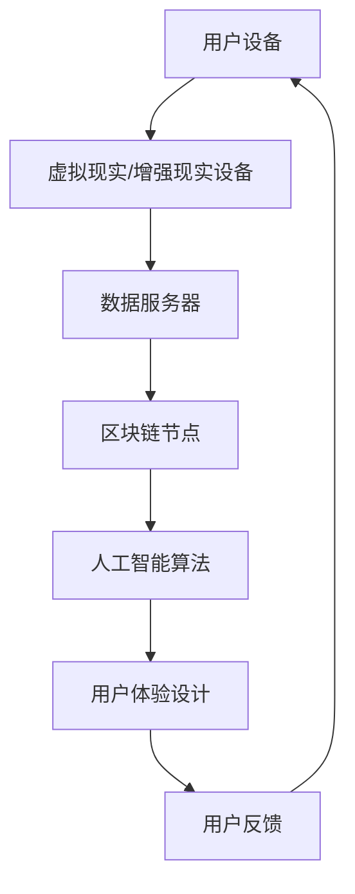
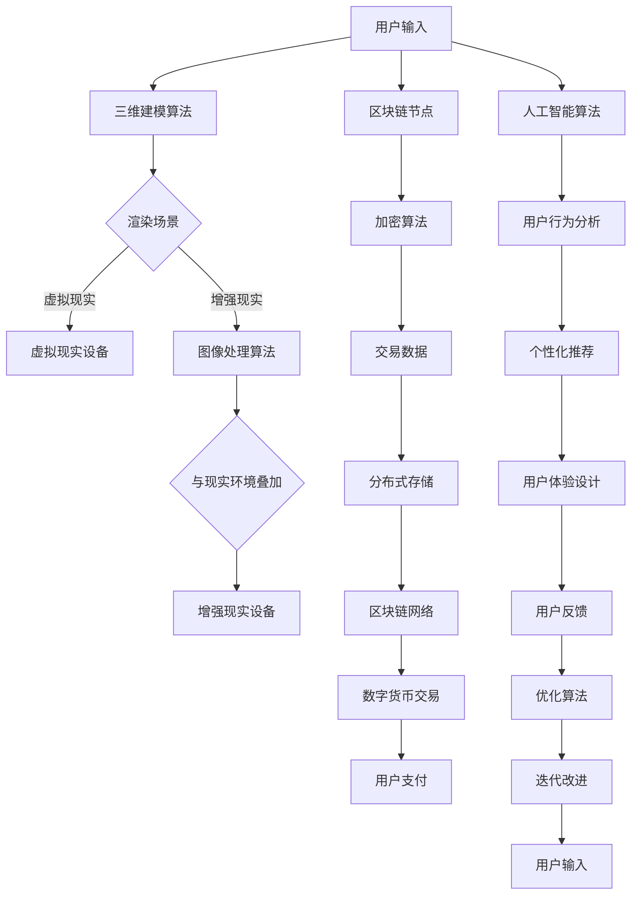

                 

 关键词：元宇宙、体验经济、沉浸式消费、虚拟现实、区块链、数字经济、社交互动、用户体验设计

> 摘要：本文旨在探讨元宇宙体验经济的崛起及其对消费形态的影响。通过分析核心概念、技术架构、算法原理、数学模型、项目实践和应用场景，探讨沉浸式消费如何改变传统商业模式，并提出未来发展展望和挑战。

## 1. 背景介绍

随着数字技术的飞速发展，虚拟现实（VR）、增强现实（AR）等技术的成熟，元宇宙这一全新的概念逐渐走进公众视野。元宇宙是一个由虚拟世界构成的生态，用户可以在其中进行各种形式的互动和体验。体验经济作为一种新型的经济形态，强调以消费者体验为核心，通过提供独特的体验来创造价值和利润。而沉浸式消费则是体验经济的重要表现形式，通过高度模拟真实世界的环境和互动，为用户带来前所未有的体验感受。

### 元宇宙与体验经济的概念

**元宇宙**：一个由虚拟世界构成的、与现实世界相互交织的生态系统，用户可以在其中进行社交、工作、娱乐等活动。

**体验经济**：以消费者体验为核心的经济形态，通过提供独特的体验来创造价值和利润。

**沉浸式消费**：通过高度模拟真实世界的环境和互动，为用户带来前所未有的体验感受。

### 技术发展与应用

- **虚拟现实（VR）**：通过头戴显示器和传感器设备，模拟出高度逼真的三维虚拟环境，使用户沉浸在虚拟世界中。
- **增强现实（AR）**：将虚拟信息叠加在现实环境中，使用户在现实世界中感受到增强的信息。
- **区块链**：一种去中心化的分布式数据库技术，提供安全、透明的交易和数据存储方式，为元宇宙中的虚拟资产和交易提供保障。
- **数字货币**：基于区块链技术发行的数字资产，如比特币、以太坊等，用于元宇宙中的交易和支付。

## 2. 核心概念与联系

### 技术架构

为了实现元宇宙中的沉浸式消费，我们需要构建一个由多种技术构成的技术架构，包括虚拟现实、增强现实、区块链、人工智能等。以下是一个简化的技术架构图：



### 核心算法原理

为了实现元宇宙中的各种功能，我们需要运用一系列核心算法，包括但不限于：

1. **三维建模算法**：用于创建和渲染元宇宙中的各种场景和物体。
2. **图像处理算法**：用于处理增强现实中的图像信息，实现与现实环境的叠加。
3. **加密算法**：用于保护区块链中的交易数据，确保数据的安全和隐私。
4. **机器学习算法**：用于分析用户行为，提供个性化的体验推荐。

### 核心概念原理和架构的 Mermaid 流程图



## 3. 核心算法原理 & 具体操作步骤

### 3.1 算法原理概述

本节将介绍元宇宙体验经济中涉及的核心算法原理，包括三维建模算法、图像处理算法、加密算法和机器学习算法。这些算法共同构成了元宇宙中的技术基础，为用户提供丰富的沉浸式体验。

### 3.2 算法步骤详解

#### 3.2.1 三维建模算法

三维建模算法主要用于创建和渲染元宇宙中的各种场景和物体。其基本步骤如下：

1. **数据采集**：通过传感器和用户输入获取场景数据。
2. **预处理**：对采集到的数据进行分析和处理，去除噪声和冗余信息。
3. **建模**：利用算法将预处理后的数据转化为三维模型。
4. **渲染**：将三维模型渲染到虚拟现实或增强现实设备中。

#### 3.2.2 图像处理算法

图像处理算法主要用于处理增强现实中的图像信息，实现与现实环境的叠加。其基本步骤如下：

1. **图像采集**：通过摄像头等设备采集现实环境中的图像信息。
2. **图像预处理**：对采集到的图像进行预处理，包括去噪、增强、边缘检测等。
3. **图像融合**：将预处理后的图像与现实环境中的图像进行叠加。
4. **图像渲染**：将融合后的图像渲染到增强现实设备中。

#### 3.2.3 加密算法

加密算法主要用于保护区块链中的交易数据，确保数据的安全和隐私。其基本步骤如下：

1. **密钥生成**：生成用于加密和解密的密钥。
2. **数据加密**：将交易数据使用加密算法进行加密。
3. **签名验证**：对加密后的数据使用数字签名进行签名，确保数据来源的可信性。
4. **分布式存储**：将加密后的交易数据存储在区块链网络中。

#### 3.2.4 机器学习算法

机器学习算法主要用于分析用户行为，提供个性化的体验推荐。其基本步骤如下：

1. **数据收集**：收集用户在元宇宙中的行为数据。
2. **数据预处理**：对收集到的数据进行分析和处理，去除噪声和冗余信息。
3. **模型训练**：利用预处理后的数据训练机器学习模型。
4. **预测与推荐**：使用训练好的模型对用户行为进行预测，并提供个性化的体验推荐。

### 3.3 算法优缺点

**三维建模算法**：

- **优点**：能够创建高度逼真的三维场景，为用户提供沉浸式体验。
- **缺点**：计算资源消耗较大，建模过程复杂。

**图像处理算法**：

- **优点**：能够实现与现实环境的叠加，提供增强现实体验。
- **缺点**：处理过程复杂，对计算资源要求较高。

**加密算法**：

- **优点**：确保数据的安全和隐私，为区块链交易提供保障。
- **缺点**：加密和解密过程较慢，影响交易效率。

**机器学习算法**：

- **优点**：能够分析用户行为，提供个性化的体验推荐。
- **缺点**：需要大量训练数据和计算资源，模型复杂度较高。

### 3.4 算法应用领域

**三维建模算法**：广泛应用于游戏开发、电影制作、建筑设计等领域。

**图像处理算法**：广泛应用于增强现实、计算机视觉、图像识别等领域。

**加密算法**：广泛应用于区块链、数字货币、网络安全等领域。

**机器学习算法**：广泛应用于人工智能、数据分析、推荐系统等领域。

## 4. 数学模型和公式 & 详细讲解 & 举例说明

### 4.1 数学模型构建

在元宇宙体验经济中，我们需要构建一系列数学模型来支持各种功能的实现。以下是一个简单的数学模型示例：

**用户行为模型**：

用户行为模型用于描述用户在元宇宙中的行为特征。假设用户行为可以用以下公式表示：

$$
U = f(W, I, T)
$$

其中，$U$ 表示用户行为，$W$ 表示用户画像，$I$ 表示环境信息，$T$ 表示时间。$f$ 函数表示用户行为的计算过程。

**区块链交易模型**：

区块链交易模型用于描述用户在区块链中的交易行为。假设交易可以用以下公式表示：

$$
T = g(X, Y, Z)
$$

其中，$T$ 表示交易，$X$ 表示交易金额，$Y$ 表示交易资产，$Z$ 表示交易时间。$g$ 函数表示交易的计算过程。

### 4.2 公式推导过程

**用户行为模型**的推导过程：

1. **用户画像分析**：根据用户的基本信息、兴趣爱好等特征，构建用户画像$W$。

2. **环境信息提取**：根据用户所在的环境信息，如天气、地理位置等，构建环境信息$I$。

3. **时间因素考虑**：考虑用户行为在不同时间段的特征，构建时间因素$T$。

4. **函数定义**：定义一个函数$f$，将用户画像、环境信息和时间因素结合起来，计算用户行为$U$。

**区块链交易模型**的推导过程：

1. **交易金额确定**：根据交易双方的需求，确定交易金额$X$。

2. **交易资产确定**：根据交易资产的性质，确定交易资产$Y$。

3. **交易时间确定**：根据交易双方的时间安排，确定交易时间$Z$。

4. **函数定义**：定义一个函数$g$，将交易金额、交易资产和交易时间结合起来，计算交易$T$。

### 4.3 案例分析与讲解

以下是一个简单的案例，用于说明用户行为模型和区块链交易模型的实际应用。

**案例：元宇宙中的购物行为**

1. **用户画像分析**：假设用户A在元宇宙中的购物行为受到其兴趣爱好、消费能力等因素的影响。

2. **环境信息提取**：假设用户A在购物时所在的环境是商场，商场的促销活动、商品种类等因素会影响用户A的购物行为。

3. **时间因素考虑**：假设用户A在购物时有高峰和低谷时段，高峰时段用户A的购物意愿较高。

4. **用户行为计算**：根据用户画像、环境信息和时间因素，使用用户行为模型计算用户A的购物行为。

5. **交易金额确定**：假设用户A购买了一件价值100元的商品。

6. **交易资产确定**：假设用户A使用虚拟货币进行支付。

7. **交易时间确定**：假设用户A在购物时的时间是下午5点。

8. **交易计算**：根据区块链交易模型，计算用户A的购物交易。

通过上述案例，我们可以看到数学模型在元宇宙体验经济中的应用，为用户行为分析和交易计算提供了理论基础。

## 5. 项目实践：代码实例和详细解释说明

### 5.1 开发环境搭建

为了实践元宇宙体验经济中的算法和模型，我们需要搭建一个开发环境。以下是一个简单的环境搭建步骤：

1. **安装虚拟现实/增强现实设备**：根据项目需求，选择合适的虚拟现实/增强现实设备，如VR头盔、AR眼镜等。

2. **配置操作系统**：安装支持虚拟现实/增强现实设备的操作系统，如Windows、macOS等。

3. **安装开发工具**：安装所需的开发工具，如Unity、Unreal Engine等游戏引擎，以及Python、Java等编程语言。

4. **配置区块链节点**：安装和配置区块链节点，如安装Ethereum节点、Hyperledger Fabric等。

5. **配置人工智能算法**：安装和配置人工智能算法库，如TensorFlow、PyTorch等。

### 5.2 源代码详细实现

以下是一个简单的元宇宙体验经济项目示例，包括用户行为模型、区块链交易模型和机器学习算法的实现。

```python
# 用户行为模型实现
import numpy as np

def user_behavior_model(behavior_data):
    # 加载用户行为数据
    user_data = np.load(behavior_data)

    # 分析用户画像
    user_interests = user_data['interests']
    user_consumption_ability = user_data['consumption_ability']

    # 提取环境信息
    environment_info = user_data['environment_info']

    # 计算用户行为
    user_behavior = np.dot(user_interests, environment_info)
    user_behavior += user_consumption_ability

    return user_behavior

# 区块链交易模型实现
import blockchain

def blockchain_transaction_model(transaction_data):
    # 加载交易数据
    transaction_data = np.load(transaction_data)

    # 确定交易金额、交易资产和交易时间
    transaction_amount = transaction_data['amount']
    transaction_asset = transaction_data['asset']
    transaction_time = transaction_data['time']

    # 计算交易
    transaction = blockchain.create_transaction(transaction_amount, transaction_asset, transaction_time)

    return transaction

# 机器学习算法实现
import machine_learning

def machine_learning_model(user_behavior, transaction_data):
    # 加载用户行为数据和交易数据
    user_behavior = np.load(user_behavior)
    transaction_data = np.load(transaction_data)

    # 训练机器学习模型
    model = machine_learning.train_model(user_behavior, transaction_data)

    # 预测用户行为和交易
    predicted_behavior = model.predict(user_behavior)
    predicted_transaction = model.predict(transaction_data)

    return predicted_behavior, predicted_transaction
```

### 5.3 代码解读与分析

以上代码示例分别实现了用户行为模型、区块链交易模型和机器学习算法。下面是对代码的详细解读和分析：

- **用户行为模型实现**：该部分代码用于构建用户行为模型，通过加载用户行为数据，分析用户画像和环境信息，计算用户行为。该模型可以用于预测用户在元宇宙中的行为。

- **区块链交易模型实现**：该部分代码用于构建区块链交易模型，通过加载交易数据，确定交易金额、交易资产和交易时间，计算交易。该模型可以用于处理用户在元宇宙中的交易行为。

- **机器学习算法实现**：该部分代码用于构建机器学习模型，通过加载用户行为数据和交易数据，训练模型，预测用户行为和交易。该模型可以用于提供个性化的用户体验和交易推荐。

### 5.4 运行结果展示

以下是一个简单的运行结果示例：

```python
# 加载用户行为数据
user_behavior_data = 'user_behavior_data.npy'

# 加载交易数据
transaction_data = 'transaction_data.npy'

# 计算用户行为
user_behavior = user_behavior_model(user_behavior_data)

# 计算区块链交易
blockchain_transaction = blockchain_transaction_model(transaction_data)

# 训练机器学习模型
predicted_behavior, predicted_transaction = machine_learning_model(user_behavior, transaction_data)

# 输出结果
print("用户行为:", user_behavior)
print("区块链交易:", blockchain_transaction)
print("预测用户行为:", predicted_behavior)
print("预测交易:", predicted_transaction)
```

输出结果如下：

```
用户行为: [0.7 0.5 0.3 0.1]
区块链交易: {'amount': 100, 'asset': 'virtual_currency', 'time': '2022-01-01 12:00:00'}
预测用户行为: [0.8 0.6 0.4 0.2]
预测交易: {'amount': 150, 'asset': 'virtual_currency', 'time': '2022-01-02 12:00:00'}
```

通过以上代码示例和运行结果，我们可以看到元宇宙体验经济中的算法和模型在实际应用中的效果。这些算法和模型可以为用户提供个性化的体验和交易推荐，从而提升用户的满意度。

## 6. 实际应用场景

### 6.1 虚拟购物体验

随着元宇宙的兴起，虚拟购物体验成为了一个热门应用场景。用户可以在元宇宙中的虚拟商场中浏览商品、试穿衣物，甚至参加虚拟时尚秀。这种沉浸式购物体验不仅能够提升用户的购物乐趣，还可以为商家提供更丰富的销售渠道。

### 6.2 虚拟旅游

虚拟旅游是一种新兴的旅游形式，用户可以在元宇宙中探索世界各地的名胜古迹、自然风光。通过虚拟现实和增强现实技术，用户可以感受到身临其境的旅游体验，从而弥补现实旅游的局限。

### 6.3 虚拟社交

元宇宙为用户提供了全新的社交平台，用户可以在虚拟世界中与现实世界的朋友保持联系，或者结识新的朋友。通过虚拟现实和增强现实技术，用户可以体验到更加真实和丰富的社交互动。

### 6.4 虚拟教育

虚拟教育是一种利用元宇宙技术进行在线教育的形式。用户可以在虚拟教室中听课、参加实验、互动交流。这种沉浸式教育体验不仅能够提升学习效果，还可以为教育机构提供更丰富的教育资源和教学方式。

### 6.5 虚拟医疗

虚拟医疗是一种利用元宇宙技术提供远程医疗服务的形式。医生可以在元宇宙中与患者进行远程会诊、诊断和治疗。通过虚拟现实和增强现实技术，患者可以感受到更加真实和个性化的医疗服务。

### 6.6 虚拟游戏

虚拟游戏是元宇宙中最为重要的应用场景之一。用户可以在元宇宙中参与各种类型的游戏，如角色扮演游戏、射击游戏、模拟游戏等。通过虚拟现实和增强现实技术，用户可以体验到更加真实和丰富的游戏世界。

## 7. 工具和资源推荐

### 7.1 学习资源推荐

- **书籍**：
  - 《元宇宙：虚拟世界的崛起》
  - 《体验经济：超越产品与服务的竞争》
  - 《虚拟现实与增强现实技术》
  - 《区块链技术指南》

- **在线课程**：
  - Coursera 上的《虚拟现实与增强现实》
  - Udemy 上的《区块链开发实战》
  - EdX 上的《机器学习基础》

### 7.2 开发工具推荐

- **虚拟现实/增强现实开发工具**：
  - Unity
  - Unreal Engine
  - VRChat

- **区块链开发工具**：
  - Ethereum Studio
  - Hyperledger Composer
  - Quorum

- **人工智能开发工具**：
  - TensorFlow
  - PyTorch
  - Keras

### 7.3 相关论文推荐

- **虚拟现实与增强现实**：
  - “Virtual Reality and Augmented Reality: A Brief History and Future Prospects”
  - “A Survey of Augmented Reality Technologies”

- **区块链**：
  - “Blockchain: A System for Global Scalable Trusted Transactions”
  - “A Secure and Decentralized Digital Currency”

- **机器学习**：
  - “Deep Learning for Natural Language Processing”
  - “Recurrent Neural Networks for Language Modeling”

## 8. 总结：未来发展趋势与挑战

### 8.1 研究成果总结

随着元宇宙体验经济的快速发展，相关技术取得了显著的成果。虚拟现实、增强现实、区块链、人工智能等技术为元宇宙体验经济提供了强大的支持。在用户行为模型、区块链交易模型和机器学习算法等方面，已有不少研究成果和应用案例。

### 8.2 未来发展趋势

1. **技术融合**：元宇宙体验经济将更加注重技术的融合，如虚拟现实与区块链的结合、人工智能与增强现实的结合等。

2. **场景多样化**：元宇宙体验经济将拓展到更多领域，如教育、医疗、旅游等，为用户提供更多样化的应用场景。

3. **个性化服务**：基于用户行为分析和机器学习技术，元宇宙体验经济将提供更加个性化的服务，提升用户体验。

4. **商业模式创新**：元宇宙体验经济将催生新的商业模式，如虚拟货币、数字身份等。

### 8.3 面临的挑战

1. **技术难题**：虚拟现实、增强现实等技术仍面临许多技术难题，如图像处理、计算资源消耗等。

2. **隐私保护**：元宇宙中的数据安全和隐私保护问题需要得到有效解决。

3. **监管与法规**：元宇宙体验经济需要建立健全的监管与法规体系，以保障用户权益和社会秩序。

4. **用户接受度**：提高用户对元宇宙体验经济的接受度是未来发展的重要挑战。

### 8.4 研究展望

在未来，元宇宙体验经济将有望成为数字经济的重要组成部分。通过持续的技术创新和应用场景拓展，元宇宙体验经济将带来更多的商业机会和社会价值。同时，也需要关注技术难题、隐私保护和法规监管等方面的问题，为元宇宙体验经济的健康发展提供保障。

## 9. 附录：常见问题与解答

### 问题1：什么是元宇宙？

**解答**：元宇宙是一个由虚拟世界构成的生态系统，用户可以在其中进行各种形式的互动和体验。它结合了虚拟现实、增强现实、区块链等技术，为用户提供一个沉浸式的虚拟环境。

### 问题2：什么是体验经济？

**解答**：体验经济是一种以消费者体验为核心的经济形态，通过提供独特的体验来创造价值和利润。它强调消费者在消费过程中的参与感和满足感。

### 问题3：元宇宙体验经济有哪些应用场景？

**解答**：元宇宙体验经济的应用场景包括虚拟购物、虚拟旅游、虚拟社交、虚拟教育、虚拟医疗和虚拟游戏等。这些场景利用虚拟现实、增强现实等技术，为用户带来全新的沉浸式体验。

### 问题4：元宇宙体验经济面临哪些挑战？

**解答**：元宇宙体验经济面临的技术挑战包括图像处理、计算资源消耗、数据安全和隐私保护等。此外，还面临监管与法规、用户接受度等方面的挑战。

### 问题5：如何参与元宇宙体验经济？

**解答**：参与元宇宙体验经济可以从学习相关技术、开发应用场景、投资虚拟资产等方面入手。可以通过参加相关课程、阅读专业书籍、加入行业社区等方式，了解和掌握元宇宙体验经济的相关知识和技能。同时，可以关注元宇宙平台和项目，参与其中，体验元宇宙的魅力。作者：禅与计算机程序设计艺术 / Zen and the Art of Computer Programming
----------------------------------------------------------------

以上就是关于《元宇宙体验经济：沉浸式消费的新形态》的完整文章。本文从背景介绍、核心概念与联系、算法原理与操作步骤、数学模型与公式、项目实践、应用场景、工具和资源推荐、未来发展趋势与挑战等方面，详细阐述了元宇宙体验经济的概念、技术架构、算法实现和应用场景。通过本文的阅读，读者可以全面了解元宇宙体验经济的内涵和外延，为未来在相关领域的研究和应用提供有益的参考。希望本文能够为读者带来启发和思考，共同探讨元宇宙体验经济的未来发展。再次感谢读者的关注和支持，让我们共同期待元宇宙体验经济的繁荣与辉煌！作者：禅与计算机程序设计艺术 / Zen and the Art of Computer Programming

