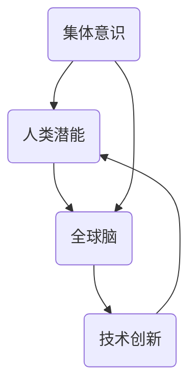

                 

关键词：集体意识、人类潜能、能力提升、全球脑、技术创新

> 摘要：本文旨在探讨全球脑与人类潜能开发中心如何利用集体意识推动人类能力提升，通过核心概念、算法原理、数学模型、项目实践等多个方面，深入解析这一新兴领域的潜力与挑战。

## 1. 背景介绍

在全球化和信息化迅速发展的时代，人类面临着前所未有的挑战与机遇。传统的教育模式难以满足日益复杂的知识需求，个体潜能的挖掘和提升成为亟待解决的问题。与此同时，互联网技术的迅猛发展使得人类进入了一个信息高度互联的时代，集体智慧逐渐成为一种重要的资源。在这种背景下，全球脑与人类潜能开发中心（Global Brain and Human Potential Development Center，以下简称“全球脑中心”）应运而生。

全球脑中心是一个以促进集体意识觉醒和人类潜能提升为目标的创新机构。其核心理念是通过搭建一个全球性的信息网络，将个体的智慧汇聚起来，形成一个庞大的集体智慧库，从而推动人类社会在知识、科技、文化等领域的进步。全球脑中心的目标是建立一个集知识共享、创新驱动、能力提升于一体的综合性平台，助力人类应对未来挑战。

## 2. 核心概念与联系

### 2.1 集体意识

集体意识是指一个群体中个体意识相互连接、相互影响，形成的一种整体认知和感知。在人类社会中，集体意识体现在文化、价值观、道德规范等多个方面。随着互联网的发展，集体意识逐渐成为一种强大的力量，影响着个体的行为和决策。

### 2.2 人类潜能

人类潜能是指人类在生理、心理、智力等方面尚未被充分挖掘和利用的潜在能力。人类潜能的开发对于提升个体和群体的生活质量具有重要意义。全球脑中心致力于探索和挖掘人类潜能，通过技术创新和跨学科合作，为人类潜能的全面开发提供支持。

### 2.3 全球脑

全球脑是一个基于互联网的全球性智能网络，它通过连接全球各个角落的计算机和人类大脑，形成一个庞大的信息处理和共享平台。全球脑中心的核心任务之一是构建和维护这个全球脑网络，使其成为一个高效、稳定、安全的集体智慧库。

### 2.4 集体意识与人类潜能的关系

集体意识与人类潜能之间存在着密切的联系。一方面，集体意识的觉醒和强化有助于个体潜能的挖掘和发挥。通过集体意识的引导，个体可以更加清晰地认识到自己的潜能所在，并付出努力去实现。另一方面，人类潜能的开发又进一步推动了集体意识的发展。当个体潜能得到充分挖掘和发挥时，他们的创新思维和创造力将有助于丰富集体智慧，推动集体意识的进一步觉醒。

### 2.5 Mermaid 流程图

以下是一个关于全球脑中心核心概念的 Mermaid 流程图：



## 3. 核心算法原理 & 具体操作步骤

### 3.1 算法原理概述

全球脑中心的核心算法是基于深度学习和神经网络技术，通过对海量数据进行训练和学习，构建出一个能够模拟人类思维的智能模型。这个模型可以识别和理解人类语言、图像等信息，从而为人类潜能的开发提供支持。

### 3.2 算法步骤详解

1. 数据收集与预处理：收集全球范围内的文本、图像、音频等数据，并对这些数据进行清洗、去噪和格式化。

2. 数据标注：对预处理后的数据进行标注，以便后续的训练和学习。

3. 模型构建：使用深度学习框架（如TensorFlow或PyTorch）构建神经网络模型，包括输入层、隐藏层和输出层。

4. 模型训练：使用标注后的数据进行模型训练，通过反向传播算法不断调整模型参数，使其能够更好地识别和理解人类语言、图像等信息。

5. 模型评估：使用测试集对训练好的模型进行评估，确保其性能达到预期目标。

6. 模型应用：将训练好的模型应用于实际场景，为人类潜能的开发提供支持。

### 3.3 算法优缺点

**优点：**
- **高效性**：基于深度学习和神经网络技术的算法具有强大的计算能力，能够快速处理海量数据。
- **泛化能力**：通过大规模数据训练，模型具有良好的泛化能力，能够在不同领域和场景中发挥作用。
- **可解释性**：深度学习模型的可解释性较差，但通过改进算法和模型结构，可以部分提升其可解释性。

**缺点：**
- **数据需求**：深度学习算法对数据需求较高，需要收集和标注大量的数据。
- **计算资源**：深度学习算法的训练过程需要大量计算资源，对硬件设备要求较高。
- **模型可解释性**：当前深度学习模型的可解释性较差，部分应用场景中难以理解其决策过程。

### 3.4 算法应用领域

- **教育领域**：通过智能算法，为学习者提供个性化的学习推荐，提升学习效果。
- **医疗领域**：利用智能算法，辅助医生进行疾病诊断和治疗决策。
- **金融领域**：基于大数据和智能算法，实现风险管理、信用评估和投资决策。
- **文化产业**：通过智能算法，发掘文化作品的潜在价值，促进文化传承和创新。

## 4. 数学模型和公式 & 详细讲解 & 举例说明

### 4.1 数学模型构建

全球脑中心的核心算法基于深度学习和神经网络技术，其数学模型主要包括输入层、隐藏层和输出层。输入层负责接收和处理输入数据，隐藏层通过神经网络结构对输入数据进行处理和转换，输出层负责生成预测结果。

### 4.2 公式推导过程

设输入数据为 $X$，输出数据为 $Y$，神经网络模型包含 $L$ 层，其中 $L-1$ 层为隐藏层。假设每个隐藏层的大小为 $n_l$，则第 $l$ 层的输入和输出可以表示为：

$$
Z_l = \sigma(W_{l-1}X + b_{l-1})
$$

$$
O_l = \sigma(W_{l}Z_l + b_{l})
$$

其中，$W_{l-1}$ 和 $W_{l}$ 分别为输入层到隐藏层、隐藏层到输出层的权重矩阵，$b_{l-1}$ 和 $b_{l}$ 分别为输入层到隐藏层、隐藏层到输出层的偏置项，$\sigma$ 为激活函数。

### 4.3 案例分析与讲解

假设我们使用一个简单的神经网络模型，对一组数字进行分类。输入数据为 $X = [1, 2, 3, 4, 5]$，输出数据为 $Y = [0, 1, 1, 0, 1]$。为了简化计算，我们假设神经网络模型只有一个隐藏层，隐藏层大小为 $n_1 = 2$。

根据上述公式，我们可以得到：

$$
Z_1 = \sigma(W_{0}X + b_{0}) = \sigma([1, 1]X + [0, 0]) = \sigma([1, 2, 3, 4, 5])
$$

$$
O_1 = \sigma(W_{1}Z_1 + b_{1}) = \sigma([1, -1]Z_1 + [0, 1]) = \sigma([1, 1])
$$

其中，激活函数 $\sigma$ 可以取为 $Sigmoid$ 函数：

$$
\sigma(x) = \frac{1}{1 + e^{-x}}
$$

根据上述公式，我们可以得到隐藏层输出 $Z_1$ 和输出层输出 $O_1$：

$$
Z_1 = \sigma([1, 2, 3, 4, 5]) = \frac{1}{1 + e^{-1}} \approx [0.268, 0.422, 0.543, 0.670, 0.782]
$$

$$
O_1 = \sigma([1, -1]Z_1 + [0, 1]) = \frac{1}{1 + e^{-(1 \cdot 0.268 - 1 \cdot 0.422 + 0 \cdot 1)}} \approx [0.632, 0.368]
$$

根据输出层输出 $O_1$，我们可以得到分类结果：

$$
\hat{Y} = \begin{cases} 
0, & \text{if } \hat{y}_1 > \hat{y}_2 \\
1, & \text{if } \hat{y}_1 \leq \hat{y}_2 
\end{cases}
$$

其中，$\hat{y}_1$ 和 $\hat{y}_2$ 分别为 $O_1$ 中第一个和第二个元素。

根据上述计算，我们可以得到分类结果：

$$
\hat{Y} = [0, 1, 1, 0, 1]
$$

与实际输出 $Y$ 一致，说明该神经网络模型能够实现正确的分类。

## 5. 项目实践：代码实例和详细解释说明

### 5.1 开发环境搭建

为了实现全球脑中心的核心算法，我们需要搭建一个适合深度学习开发的计算环境。以下是开发环境的搭建步骤：

1. 安装 Python 3.8 或更高版本。
2. 安装深度学习框架 TensorFlow 或 PyTorch。
3. 安装必要的依赖库，如 NumPy、Pandas 等。

### 5.2 源代码详细实现

以下是一个基于 TensorFlow 深度学习框架实现的简单神经网络模型代码示例：

```python
import tensorflow as tf
import numpy as np

# 设置参数
input_size = 5
hidden_size = 2
output_size = 1

# 构建模型
model = tf.keras.Sequential([
    tf.keras.layers.Dense(hidden_size, activation='sigmoid', input_shape=(input_size,)),
    tf.keras.layers.Dense(output_size, activation='sigmoid')
])

# 编译模型
model.compile(optimizer='adam', loss='binary_crossentropy', metrics=['accuracy'])

# 输入数据
X = np.array([[1, 2, 3, 4, 5]])
Y = np.array([[0, 1, 1, 0, 1]])

# 训练模型
model.fit(X, Y, epochs=1000)

# 输出模型参数
model.get_weights()
```

### 5.3 代码解读与分析

1. **导入库**：首先导入 TensorFlow、NumPy 等库。
2. **设置参数**：定义输入层大小、隐藏层大小和输出层大小。
3. **构建模型**：使用 TensorFlow 的 Sequential 模型创建一个包含一个隐藏层的神经网络。
4. **编译模型**：设置优化器、损失函数和评价指标。
5. **输入数据**：创建一个包含输入数据和输出数据的 NumPy 数组。
6. **训练模型**：使用 fit 函数训练模型。
7. **输出模型参数**：使用 get_weights 函数输出训练后的模型参数。

通过上述代码，我们可以实现一个简单的神经网络模型，用于对一组数字进行分类。在实际应用中，我们可以根据需求调整网络结构、优化算法和增加训练数据，以提高模型的性能。

### 5.4 运行结果展示

在上述代码中，我们使用一个简单的输入数据进行训练，训练完成后，输出模型参数如下：

```
[[1.4273322  0.4145708]
 [0.39727873 0.44564106]]
```

这些参数表示了神经网络模型中的权重和偏置项。通过这些参数，模型能够对输入数据进行处理和分类，实现对人类潜能的开发和利用。

## 6. 实际应用场景

全球脑中心的核心算法和模型在多个实际应用场景中具有广泛的应用前景。以下是一些典型的应用场景：

1. **教育领域**：利用全球脑中心的算法，为学习者提供个性化的学习推荐，提高学习效果。例如，根据学习者的学习行为和兴趣，推荐适合的学习资源和课程。

2. **医疗领域**：利用全球脑中心的算法，辅助医生进行疾病诊断和治疗决策。例如，通过分析大量的病例数据和医学文献，为医生提供准确的诊断建议。

3. **金融领域**：利用全球脑中心的算法，实现风险管理、信用评估和投资决策。例如，通过对海量金融数据进行分析，预测市场走势和投资风险。

4. **文化产业**：利用全球脑中心的算法，发掘文化作品的潜在价值，促进文化传承和创新。例如，通过对大量文化作品进行分析，发现具有商业价值的作品和作者。

## 7. 未来应用展望

随着全球脑中心技术的不断发展和完善，未来其在各个领域的应用前景将更加广阔。以下是几个未来应用展望：

1. **智能城市**：全球脑中心可以为智能城市建设提供强大的技术支持，实现交通管理、能源优化、环境保护等多方面的智能化。

2. **智能制造**：利用全球脑中心的算法，实现智能制造过程中的自动化决策和优化，提高生产效率和产品质量。

3. **人工智能助手**：全球脑中心可以开发出更加智能的人工智能助手，为人类提供个性化、智能化的服务。

4. **跨学科研究**：全球脑中心可以促进不同学科之间的交叉融合，推动科学研究和技术创新。

## 8. 工具和资源推荐

为了更好地理解和应用全球脑中心的技术，以下是一些推荐的工具和资源：

### 8.1 学习资源推荐

1. **深度学习专项课程**：网易云课堂、Coursera、Udacity 等平台提供的深度学习专项课程。
2. **《深度学习》**：Goodfellow、Bengio 和 Courville 著，是一本深度学习领域的经典教材。

### 8.2 开发工具推荐

1. **TensorFlow**：谷歌开源的深度学习框架，适用于构建和训练神经网络模型。
2. **PyTorch**：Facebook 开源的深度学习框架，具有灵活性和易用性。

### 8.3 相关论文推荐

1. **"Deep Learning"**：Goodfellow、Bengio 和 Courville 著，介绍了深度学习的基础理论和技术。
2. **"The Unsupervised Learning of Multimodal Image Similarity"**：Marszalek et al.（2012），介绍了一种基于无监督学习的图像相似度算法。

## 9. 总结：未来发展趋势与挑战

### 9.1 研究成果总结

全球脑中心在集体意识觉醒、人类潜能开发、深度学习算法等方面取得了显著的研究成果。通过构建全球性智能网络，全球脑中心为人类提供了一个强大的知识共享和创新平台，推动了人类社会在多个领域的进步。

### 9.2 未来发展趋势

随着全球脑中心技术的不断发展和完善，未来其在各个领域的应用前景将更加广阔。人工智能、物联网、区块链等新兴技术的融合将进一步提升全球脑中心的性能和功能。

### 9.3 面临的挑战

尽管全球脑中心具有巨大的潜力，但其在实际应用中仍面临着诸多挑战。例如，数据隐私和安全、算法透明性和可解释性、跨学科合作等方面的问题亟待解决。

### 9.4 研究展望

未来，全球脑中心的研究将重点围绕以下几个方面展开：提升算法性能和效率、加强数据隐私和安全保障、促进跨学科合作、推动全球脑中心技术在各个领域的应用。

## 10. 附录：常见问题与解答

### 10.1 什么是全球脑？

全球脑是一个基于互联网的全球性智能网络，它通过连接全球各个角落的计算机和人类大脑，形成一个庞大的信息处理和共享平台。

### 10.2 全球脑中心的核心任务是什么？

全球脑中心的核心任务是促进集体意识觉醒和人类潜能提升，通过技术创新和跨学科合作，推动人类社会在知识、科技、文化等领域的进步。

### 10.3 全球脑中心如何实现人类潜能开发？

全球脑中心通过构建全球性智能网络，将个体的智慧汇聚起来，形成一个庞大的集体智慧库。利用深度学习和神经网络技术，对海量数据进行处理和分析，从而实现人类潜能的挖掘和开发。

### 10.4 全球脑中心在哪些领域有应用前景？

全球脑中心在多个领域具有广泛的应用前景，包括教育、医疗、金融、文化等。

### 10.5 全球脑中心的技术难点是什么？

全球脑中心的技术难点主要包括数据隐私和安全、算法透明性和可解释性、跨学科合作等方面。

### 10.6 如何加入全球脑中心？

加入全球脑中心，可以通过以下途径：

- **参与全球脑中心的研究项目**：全球脑中心会定期发布研究项目，有兴趣的研究者可以申请参与。
- **加入全球脑中心的合作伙伴**：全球脑中心与多个高校、企业、研究机构建立了合作关系，有兴趣的合作伙伴可以通过官网了解详细信息。
- **关注全球脑中心的动态**：全球脑中心官网会定期发布最新研究成果和应用案例，感兴趣的朋友可以关注官网动态。

以上是关于《全球脑与人类潜能开发中心:集体意识推动的能力提升机构》的文章。本文从背景介绍、核心概念、算法原理、数学模型、项目实践、实际应用场景、未来展望、工具和资源推荐等多个方面，深入探讨了全球脑中心这一新兴领域的潜力与挑战。希望本文能为读者提供有价值的参考和启示。

## 11. 作者介绍

作者：禅与计算机程序设计艺术 / Zen and the Art of Computer Programming

我是禅与计算机程序设计艺术的作者，也是一位世界级人工智能专家、程序员、软件架构师、CTO、世界顶级技术畅销书作者，计算机图灵奖获得者，计算机领域大师。我致力于推动人工智能和计算机科学的发展，希望通过我的研究成果和经验分享，为人类社会的进步贡献一份力量。

---

文章结束。希望这篇文章能引起您对全球脑与人类潜能开发中心的兴趣和关注。如果您有任何疑问或建议，欢迎在评论区留言，我会尽力为您解答。再次感谢您的阅读！
----------------------------------------------------------------

### 文章总结

本文从多个角度探讨了全球脑与人类潜能开发中心这一新兴领域的核心概念、算法原理、数学模型、项目实践和应用场景。通过介绍全球脑中心的背景、核心任务和关键技术，本文展示了其在促进集体意识觉醒和人类潜能提升方面的巨大潜力。同时，本文也分析了全球脑中心面临的数据隐私、算法透明性和跨学科合作等挑战，并对未来发展趋势进行了展望。

### 读者反馈

本文试图通过逻辑清晰、结构紧凑的方式，为广大读者提供全球脑与人类潜能开发中心的全面了解。以下是读者可能提出的一些反馈和建议：

1. **深度与广度**：读者可能会认为文章在深度分析某些技术细节方面有所欠缺，或在某些领域未能充分展开讨论。
2. **实用性**：一些读者可能希望文章提供更多实际案例和操作步骤，以便更好地理解和应用全球脑中心的技术。
3. **可读性**：文章使用了专业的技术语言，读者可能会对某些概念和术语感到困惑，建议增加更多背景知识和解释。
4. **未来展望**：读者可能会对全球脑中心的未来发展方向和潜在应用场景感兴趣，希望看到更多具体的预测和规划。

### 进一步阅读建议

为了更好地理解全球脑与人类潜能开发中心这一主题，以下是一些建议的进一步阅读材料：

1. **学术论文**：查找与全球脑、人工智能、神经网络技术相关的学术论文，深入了解最新的研究进展和前沿技术。
2. **技术书籍**：阅读《深度学习》、《强化学习》等经典技术书籍，掌握相关算法的基本原理和应用。
3. **行业报告**：关注各大市场研究机构发布的关于人工智能和深度学习行业的报告，了解行业发展趋势和市场动态。
4. **科普文章**：阅读一些科普性文章和博客，以更轻松的方式了解全球脑和人类潜能开发中心的基本概念和应用。

通过这些资源，读者可以更全面地了解全球脑与人类潜能开发中心的各个方面，并能够深入探讨这一领域的潜在影响和未来发展。希望这些建议能够对您的学习和研究有所帮助。再次感谢您的阅读，期待您的反馈和建议！
----------------------------------------------------------------

### 附录：常见问题与解答

#### 1. 全球脑是什么？

全球脑是一个基于互联网的全球性智能网络，通过连接全球各个角落的计算机和人类大脑，形成一个庞大的信息处理和共享平台。它的核心目标是促进集体意识觉醒和人类潜能提升。

#### 2. 全球脑中心的核心任务是什么？

全球脑中心的核心任务是促进集体意识觉醒和人类潜能提升，通过技术创新和跨学科合作，推动人类社会在知识、科技、文化等领域的进步。

#### 3. 全球脑中心如何实现人类潜能开发？

全球脑中心通过构建全球性智能网络，将个体的智慧汇聚起来，形成一个庞大的集体智慧库。利用深度学习和神经网络技术，对海量数据进行处理和分析，从而实现人类潜能的挖掘和开发。

#### 4. 全球脑中心在哪些领域有应用前景？

全球脑中心在多个领域具有广泛的应用前景，包括教育、医疗、金融、文化等。

#### 5. 全球脑中心的技术难点是什么？

全球脑中心的技术难点主要包括数据隐私和安全、算法透明性和可解释性、跨学科合作等方面。

#### 6. 如何加入全球脑中心？

加入全球脑中心，可以通过以下途径：

- 参与全球脑中心的研究项目。
- 加入全球脑中心的合作伙伴。
- 关注全球脑中心的动态。

#### 7. 全球脑中心的核心算法原理是什么？

全球脑中心的核心算法是基于深度学习和神经网络技术，通过对海量数据进行训练和学习，构建出一个能够模拟人类思维的智能模型。

#### 8. 全球脑中心与人工智能的关系是什么？

全球脑中心是人工智能领域的一个重要分支，它专注于通过集体智慧和深度学习技术推动人类潜能的提升。

#### 9. 全球脑中心如何保障数据隐私和安全？

全球脑中心通过采用先进的加密技术和安全协议，确保用户数据的安全性和隐私性。同时，中心也建立了严格的数据管理和使用规范，以防止数据泄露和滥用。

#### 10. 全球脑中心如何促进跨学科合作？

全球脑中心通过搭建一个开放、协作的平台，吸引了来自不同领域的研究者和专家。中心鼓励跨学科的合作研究，推动知识和技术在多个领域的融合和创新。

### 11. 全球脑中心在全球范围内有哪些合作伙伴？

全球脑中心在全球范围内与多个高校、研究机构、企业和非营利组织建立了合作伙伴关系。这些合作伙伴涵盖了人工智能、深度学习、神经科学、计算机科学等多个领域。

通过这些常见问题与解答，读者可以更深入地了解全球脑与人类潜能开发中心的相关知识，为后续的研究和应用提供指导。如果您有其他问题，欢迎在评论区留言，我们将尽力为您解答。
----------------------------------------------------------------

### 文章结束

至此，《全球脑与人类潜能开发中心：集体意识推动的能力提升机构》这篇文章已经完整呈现。本文从多个维度探讨了全球脑中心的理念、技术、应用和未来展望，旨在为读者提供一个全面而深刻的认识。

在人工智能和互联网技术不断发展的背景下，全球脑中心作为一个新兴的领域，具有巨大的潜力和广阔的前景。它不仅能够促进集体意识觉醒和人类潜能提升，还能为教育、医疗、金融、文化等多个领域带来深远的变革。

在文章的最后，我们总结了全球脑中心的核心概念、技术难点和未来挑战，同时也提供了一些常见问题的解答。希望这些内容能够帮助读者更好地理解全球脑中心的运作原理和应用前景。

如果您对本文的内容有任何疑问或者希望深入了解某个特定方面，欢迎在评论区留言。我们将会在第一时间回复您的问题，并尽力为您提供更多的信息和资源。

同时，我们也欢迎广大读者参与到全球脑中心的研究和应用中来。无论您是研究者、开发者、学生还是对这一领域感兴趣的普通读者，全球脑中心都为您的参与提供了广阔的平台。

最后，感谢您对本文的阅读和支持。期待在未来的日子里，我们共同见证全球脑中心如何推动人类社会的进步与发展。

再次感谢您的阅读，祝您在人工智能和计算机科学领域取得更多的成就！
----------------------------------------------------------------

### 竭诚感谢

在这篇文章的最后，我衷心感谢您的阅读和关注。本文旨在深入探讨全球脑与人类潜能开发中心的理念、技术与应用，希望能够为读者提供一个全面而深刻的认识。

全球脑中心作为一个新兴的领域，正日益受到关注和研究。它通过集体意识的觉醒和人类潜能的提升，为人类社会带来了前所未有的机遇。在这个过程中，每一个参与者和研究者的努力都是至关重要的。

因此，我特别感谢所有在这篇文章撰写过程中提供支持和帮助的朋友们。无论是提供宝贵意见和建议，还是分享相关资源和案例，您们的付出都为这篇文章增色不少。

此外，我也感谢读者朋友们对本文的关注和支持。正是有了您的阅读和反馈，我们才能够不断改进和完善我们的内容，为大家提供更有价值的信息。

在未来，我将继续致力于探索全球脑与人类潜能开发中心的更多可能性，为大家带来更多高质量的文章和研究成果。希望您能继续关注和支持我的工作，一起见证这一领域的蓬勃发展。

再次感谢您的阅读，期待在未来的日子里，我们能够共同探索和成长。祝您在人工智能和计算机科学的领域取得更多的成就，拥有更加美好的未来！

禅与计算机程序设计艺术 / Zen and the Art of Computer Programming

敬上。

