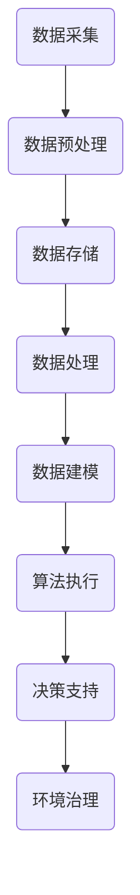
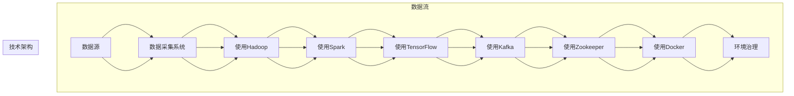

                 

### 关键词 Keyword

- 全球脑
- 环境治理
- 集体合作
- 人工智能
- 大数据
- 可持续发展
- 资源优化
- 协同算法

### 摘要 Abstract

本文旨在探讨全球脑与全球环境之间的关系，以及如何通过集体合作来推进环境治理。全球脑是一个分布式计算与协作网络，通过集成大数据、人工智能和协同算法，能够实现对全球环境的实时监测、分析和决策支持。本文首先介绍了全球脑的核心概念和组成部分，随后详细阐述了其在环境治理中的应用，包括资源优化、污染控制和生态保护等方面。最后，文章提出了集体合作在环境治理中的重要性，以及未来全球脑的发展趋势和面临的挑战。

## 1. 背景介绍

在全球化和信息技术迅猛发展的背景下，人类面临着前所未有的环境挑战。气候变化、资源枯竭、生物多样性丧失等问题日益严重，这些问题不仅威胁着地球的生态平衡，也对人类社会的可持续发展构成了严峻考验。传统的环境治理模式往往依赖于单一主体或局部区域的努力，难以应对复杂且跨区域的环境问题。

与此同时，人工智能、大数据和分布式计算等现代信息技术的发展为环境治理提供了新的契机。全球脑（Global Brain）的概念由此应运而生，它是一种基于人工智能和协同计算的分布式智能系统，通过整合全球范围内的数据资源和技术力量，实现对环境问题的实时监测、分析和协同决策。全球脑能够提供更为全面、精准和高效的治理方案，从而推动全球环境治理的深化和落实。

本文旨在通过对全球脑与全球环境关系的探讨，分析其在环境治理中的应用潜力，并探讨集体合作在其中的作用。文章结构如下：

1. **背景介绍**：介绍全球脑的概念及其在全球环境治理中的重要性。
2. **核心概念与联系**：详细阐述全球脑的核心概念、组成部分和技术架构。
3. **核心算法原理 & 具体操作步骤**：介绍全球脑的核心算法原理和具体实施步骤。
4. **数学模型和公式 & 详细讲解 & 举例说明**：阐述全球脑所使用的数学模型和公式，并通过案例进行分析。
5. **项目实践：代码实例和详细解释说明**：提供实际项目中的代码实例和详细解释。
6. **实际应用场景**：探讨全球脑在不同环境治理场景中的应用。
7. **工具和资源推荐**：推荐相关学习资源和开发工具。
8. **总结：未来发展趋势与挑战**：总结研究成果，展望未来发展趋势和挑战。

通过本文的探讨，希望能够为全球脑在环境治理中的应用提供理论支持和实践指导，为推动全球环境治理作出贡献。

## 2. 核心概念与联系

### 全球脑的定义

全球脑（Global Brain）是一种基于分布式计算和协同合作的智能系统，它模拟了人类大脑的运作模式，通过信息共享和协同决策实现全局最优。全球脑的概念最早由美国哲学家赫伯特·乔治·西蒙顿（Herbert George Simon）在 20 世纪 60 年代提出，他认为人类社会的行为模式类似于大脑神经元之间的相互作用。随着信息技术的发展，全球脑的概念逐渐从理论走向实际应用。

全球脑的核心思想在于分布式智能，即通过多个独立节点（如计算机、传感器等）的协同工作，实现比单个节点更高效的决策和问题解决能力。全球脑不仅能够处理复杂的问题，还能够根据环境变化进行自适应调整，从而实现对全球环境的实时监测和动态响应。

### 全球脑的组成部分

全球脑由多个关键组成部分构成，包括数据层、算法层和应用层。

#### 数据层

数据层是全球脑的基础，它负责收集、存储和管理来自全球范围内的环境数据。这些数据来源广泛，包括气象数据、水质监测数据、生态数据等。数据的质量和多样性直接影响全球脑的决策能力。因此，数据层的建设需要确保数据的准确性、及时性和完整性。

#### 算法层

算法层是全球脑的智能核心，它负责对数据进行处理、分析和建模。算法层包括多种算法，如机器学习算法、优化算法、协同过滤算法等。这些算法可以基于数据层提供的信息，进行环境问题的预测、决策和优化。算法层的优化和更新是提升全球脑性能的关键。

#### 应用层

应用层是全球脑的接口，它将算法层的决策结果转化为具体的环境治理措施。应用层包括监测系统、控制系统、决策支持系统等。通过应用层，全球脑能够实现与实际环境治理活动的紧密结合，从而推动环境治理的深入和落实。

### 全球脑的技术架构

全球脑的技术架构通常采用分布式计算和协同计算的方法。以下是全球脑的技术架构：

#### 分布式计算

分布式计算是全球脑的基础，它通过多个计算节点的协同工作，实现大规模数据处理和计算。分布式计算的关键在于节点之间的通信和协调，常用的分布式计算框架包括 Hadoop、Spark 等。

#### 协同计算

协同计算是全球脑的智能核心，它通过节点之间的信息共享和协同决策，实现全局最优。协同计算的关键在于算法的设计和优化，需要考虑节点的异构性和动态性。

#### 大数据技术

大数据技术是全球脑的数据基础，它包括数据的采集、存储、处理和分析等环节。大数据技术的关键在于如何高效地处理大规模、多样化和实时性的数据，常用的技术包括 Hadoop、Spark、MongoDB 等。

#### 人工智能技术

人工智能技术是全球脑的算法基础，它包括机器学习、深度学习、自然语言处理等。人工智能技术可以通过数据分析和建模，实现环境问题的自动检测、预测和决策。

### 全球脑的 Mermaid 流程图

以下是一个简单的 Mermaid 流程图，展示全球脑的核心流程：



### 核心概念原理与架构图

为了更直观地理解全球脑的架构和原理，我们可以通过以下 Mermaid 流程图来详细展示：



通过以上流程图和架构图，我们可以清晰地看到全球脑的数据流和技术架构，为后续章节的详细讨论奠定了基础。

## 3. 核心算法原理 & 具体操作步骤

### 3.1 算法原理概述

全球脑在环境治理中的应用离不开一系列核心算法的支撑，这些算法主要涵盖数据预处理、环境建模、协同优化和实时决策等领域。以下是这些核心算法的基本原理概述：

#### 数据预处理算法

数据预处理是环境治理算法的第一步，其目的是对采集到的原始数据进行清洗、整合和特征提取。常用的数据预处理算法包括缺失值处理、异常值检测、数据归一化和特征提取等。这些算法确保数据的质量和一致性，为后续的环境建模和分析奠定基础。

#### 环境建模算法

环境建模是通过构建数学模型或机器学习模型来描述环境系统的状态和变化规律。常用的环境建模算法包括线性回归、决策树、神经网络和支持向量机等。环境建模算法能够对环境数据进行定量分析，预测环境变化趋势，为决策提供科学依据。

#### 协同优化算法

协同优化算法是解决环境治理中多目标、多约束问题的有效方法。这些算法通过优化资源分配、污染物排放控制、生态保护等措施，实现环境治理的最优目标。常用的协同优化算法包括线性规划、非线性规划和多目标优化算法等。

#### 实时决策算法

实时决策算法是环境治理中的关键环节，它通过分析实时监测数据，实时调整环境治理措施，以应对环境变化。常用的实时决策算法包括动态规划、贝叶斯网络和强化学习等。

### 3.2 算法步骤详解

以下是全球脑在环境治理中具体操作步骤的详细说明：

#### 步骤1：数据采集与预处理

1. **数据采集**：通过传感器、卫星遥感、气象站等多种途径，收集全球范围内的环境数据，如空气质量、水质、气象条件等。
2. **数据预处理**：对采集到的数据进行清洗、去噪、缺失值填补和归一化处理，确保数据的准确性和一致性。

#### 步骤2：环境建模

1. **特征提取**：根据环境数据的特点，提取关键特征，如污染物浓度、生态因子等。
2. **模型选择**：根据环境治理目标，选择合适的模型，如线性回归、神经网络等。
3. **模型训练与验证**：使用历史数据对模型进行训练和验证，确保模型的预测能力。

#### 步骤3：协同优化

1. **目标定义**：明确环境治理的多目标，如减少污染物排放、提高资源利用率、保护生物多样性等。
2. **约束条件设定**：设定环境治理的约束条件，如法律法规、技术限制等。
3. **优化算法选择**：选择合适的优化算法，如线性规划、多目标优化算法等。
4. **优化过程**：通过优化算法，求解环境治理的最优方案。

#### 步骤4：实时决策

1. **实时数据监测**：持续监测环境数据，如污染物浓度、气象条件等。
2. **数据融合与预测**：融合实时监测数据和历史数据，进行环境变化趋势预测。
3. **决策支持**：基于实时数据和预测结果，生成决策支持方案，如污染物排放控制策略、水资源调配方案等。
4. **执行与反馈**：实施决策支持方案，并收集反馈数据，用于优化决策过程。

### 3.3 算法优缺点

每种算法都有其优缺点，适用于不同的环境治理场景。以下是对核心算法优缺点的简要分析：

#### 数据预处理算法

**优点**：数据预处理算法能够提高数据的准确性和一致性，为后续分析提供可靠的数据基础。

**缺点**：数据预处理过程复杂，对计算资源和时间要求较高，且可能引入人为偏差。

#### 环境建模算法

**优点**：环境建模算法能够定量描述环境系统的状态和变化，为决策提供科学依据。

**缺点**：模型的准确性和适用性依赖于数据质量和模型选择，可能存在过拟合或欠拟合问题。

#### 协同优化算法

**优点**：协同优化算法能够处理多目标、多约束问题，实现资源的最优配置。

**缺点**：优化算法的计算复杂度高，特别是在大规模、多变量问题中，可能面临收敛速度慢、计算资源不足等问题。

#### 实时决策算法

**优点**：实时决策算法能够快速响应环境变化，调整治理措施。

**缺点**：实时决策算法对数据质量和实时性要求高，可能面临数据延迟或错误的问题。

### 3.4 算法应用领域

全球脑的核心算法在环境治理中具有广泛的应用领域，包括但不限于以下几个方面：

#### 污染控制

通过环境建模和协同优化算法，可以制定污染物排放控制策略，优化污染物处理和排放过程，降低环境污染风险。

#### 资源管理

通过数据预处理和协同优化算法，可以优化资源分配，提高水资源、能源等资源的利用效率，减少资源浪费。

#### 生态保护

通过环境建模和实时决策算法，可以监测和预测生态环境变化，制定生态保护措施，维护生物多样性。

#### 应急响应

通过实时数据监测和协同优化算法，可以快速响应环境突发事件，如自然灾害、环境污染等，制定应急响应方案。

总之，全球脑的核心算法为环境治理提供了强大的技术支持，通过合理选择和优化算法，可以实现高效、精准的环境治理。

### 3.5 算法应用领域详细讨论

全球脑的核心算法在环境治理中的应用涵盖了多个领域，每个领域都有其独特的需求和挑战。以下将详细讨论几个关键领域，包括污染控制、资源管理、生态保护和应急响应。

#### 污染控制

污染控制是环境治理中最常见的领域之一。全球脑通过环境建模和协同优化算法，可以制定出科学有效的污染物排放控制策略。例如，在城市空气质量监测中，全球脑可以通过分析实时空气质量数据和历史排放数据，预测未来一段时间内的空气质量变化趋势，并根据空气质量标准动态调整污染物排放量。具体步骤如下：

1. **数据采集与预处理**：收集城市各区域的空气污染物浓度、气象条件、交通流量等数据，并进行数据清洗、去噪和特征提取。
2. **环境建模**：使用机器学习算法（如决策树、神经网络等）对历史数据进行分析，构建空气质量预测模型。
3. **协同优化**：设定污染控制目标（如减少SO2、NOx等排放量），利用线性规划或多目标优化算法，优化各区域污染物排放量，确保整体污染控制效果最佳。
4. **实时决策**：根据实时监测数据，动态调整污染物排放策略，以应对突发环境变化。

**优点**：这种方法能够实现污染物排放的精细化管理，减少环境污染风险。

**挑战**：数据质量和实时性对预测模型的准确性至关重要，同时需要考虑不同区域之间的协调问题。

#### 资源管理

资源管理是环境治理中的另一个关键领域，包括水资源、能源、土地等资源的合理利用和分配。全球脑通过数据预处理和协同优化算法，可以优化资源分配，提高资源利用效率。以下是一个具体的实例：

1. **数据采集与预处理**：收集水资源、能源使用、土地利用等数据，进行数据清洗和特征提取。
2. **环境建模**：使用回归分析、聚类分析等算法，构建水资源、能源消耗和土地利用模型。
3. **协同优化**：设定资源利用目标（如降低能耗、提高水资源利用率等），利用线性规划或多目标优化算法，优化资源分配方案。
4. **实时决策**：根据实时数据，动态调整资源使用策略，以应对需求变化和突发事件。

**优点**：这种方法能够实现资源的科学管理和高效利用，减少资源浪费。

**挑战**：资源管理涉及多个部门和利益相关方，协调和决策的复杂性较高。

#### 生态保护

生态保护是维护生物多样性和生态平衡的重要任务。全球脑通过环境建模和实时决策算法，可以监测和预测生态环境变化，制定生态保护措施。以下是一个具体的实例：

1. **数据采集与预处理**：收集生态监测数据，如生物多样性、栖息地条件、气候等。
2. **环境建模**：使用机器学习算法，如支持向量机、深度学习等，构建生态变化预测模型。
3. **协同优化**：设定生态保护目标，如减少栖息地破坏、提高生物多样性等，利用多目标优化算法，优化保护措施。
4. **实时决策**：根据实时监测数据，动态调整生态保护策略，应对环境变化和威胁。

**优点**：这种方法能够实现生态系统的实时监测和动态保护。

**挑战**：生态系统的复杂性高，数据收集和模型构建难度大，同时需要考虑生态保护的长期性和可持续性。

#### 应急响应

应急响应是应对环境突发事件的关键领域。全球脑通过实时数据监测和协同优化算法，可以快速响应环境变化，制定应急响应方案。以下是一个具体的实例：

1. **数据采集与预处理**：收集环境监测数据，如污染物浓度、气象条件、交通流量等。
2. **实时数据监测**：利用传感器网络和遥感技术，实时监测环境变化。
3. **协同优化**：设定应急响应目标（如减少污染扩散、保障公众健康等），利用动态规划或强化学习算法，制定应急响应方案。
4. **执行与反馈**：根据应急响应方案，快速采取行动，并收集反馈数据，优化应急响应过程。

**优点**：这种方法能够实现快速、精准的应急响应。

**挑战**：数据实时性和准确性对应急响应至关重要，同时需要协调多方资源，确保响应措施的有效实施。

总之，全球脑的核心算法在环境治理的各个领域都有广泛的应用，通过合理选择和优化算法，可以实现高效、精准的环境治理。然而，数据质量、算法复杂性和协调问题仍然是需要克服的主要挑战。

## 4. 数学模型和公式 & 详细讲解 & 举例说明

### 4.1 数学模型构建

全球脑在环境治理中使用的数学模型主要包括线性模型、非线性模型和优化模型。以下将介绍这些模型的基本原理和构建方法。

#### 线性模型

线性模型是环境治理中最基本的模型之一，常用于描述污染物浓度与排放量之间的关系。其基本形式为：

\[ C(x) = a_0 + a_1 x + a_2 x^2 + \cdots + a_n x^n \]

其中，\( C(x) \) 是污染物浓度，\( x \) 是排放量，\( a_0, a_1, a_2, \ldots, a_n \) 是模型参数。构建线性模型的方法通常包括最小二乘法、梯度下降法等。

#### 非线性模型

非线性模型可以更准确地描述环境系统的复杂性和动态性。常见的方法包括多项式模型、指数模型、对数模型等。例如，对数模型可以表示为：

\[ C(x) = a + b \ln(x) + c (\ln(x))^2 \]

其中，\( a, b, c \) 是模型参数。非线性模型的构建通常需要更多的数据和更复杂的算法，如神经网络、支持向量机等。

#### 优化模型

优化模型用于求解环境治理中的多目标优化问题，如污染物排放最小化、资源利用率最大化等。常见的优化模型包括线性规划、非线性规划、多目标规划等。

线性规划的基本形式为：

\[ \min \quad c^T x \]
\[ \text{subject to} \quad Ax \leq b \]

其中，\( c \) 是目标函数系数向量，\( x \) 是决策变量，\( A \) 是约束条件系数矩阵，\( b \) 是约束条件常数向量。

非线性规划的基本形式为：

\[ \min \quad f(x) \]
\[ \text{subject to} \quad g_i(x) \leq 0, \quad h_j(x) = 0 \]

其中，\( f(x) \) 是目标函数，\( g_i(x) \) 和 \( h_j(x) \) 是约束条件函数。

多目标规划的基本形式为：

\[ \min \quad f_1(x), f_2(x), \ldots, f_m(x) \]
\[ \text{subject to} \quad g_i(x) \leq 0, \quad h_j(x) = 0 \]

### 4.2 公式推导过程

以下将介绍一个简单的非线性模型——指数模型的公式推导过程。

#### 指数模型推导

假设污染物浓度 \( C(x) \) 与排放量 \( x \) 之间的关系为指数形式：

\[ C(x) = a + b e^{cx} \]

其中，\( a, b, c \) 是模型参数。

1. **参数估计**：首先，需要通过历史数据对模型参数进行估计。假设我们有 \( n \) 个样本点 \((x_i, C_i)\)，可以使用最小二乘法估计参数 \( a, b, c \)：

\[ a = \frac{\sum_{i=1}^n C_i - b \sum_{i=1}^n x_i e^{cx_i}}{n} \]
\[ b = \frac{\sum_{i=1}^n x_i e^{cx_i} - c \sum_{i=1}^n x_i^2 e^{cx_i}}{\sum_{i=1}^n (x_i e^{cx_i})^2} \]
\[ c = \frac{1}{n} \sum_{i=1}^n \ln \left( \frac{C_i - a}{b} \right) \]

2. **公式推导**：将参数 \( a, b, c \) 代入指数模型，得到最终公式：

\[ C(x) = a + b e^{cx} \]

### 4.3 案例分析与讲解

以下将通过一个实际案例，展示全球脑在环境治理中使用的数学模型和公式。

#### 案例背景

某城市的空气质量监测数据表明，PM2.5 浓度与汽车尾气排放量之间存在显著相关性。为了制定有效的污染控制策略，研究人员决定使用指数模型来描述两者之间的关系。

#### 数据收集

研究人员收集了过去一年的PM2.5浓度和汽车尾气排放量数据，共获得 \( n = 100 \) 个样本点。

#### 数据预处理

对数据进行清洗和归一化处理，确保数据的准确性和一致性。

#### 模型构建

使用指数模型公式 \( C(x) = a + b e^{cx} \)，利用最小二乘法估计参数 \( a, b, c \)：

\[ a = \frac{\sum_{i=1}^{100} C_i - b \sum_{i=1}^{100} x_i e^{cx_i}}{100} \]
\[ b = \frac{\sum_{i=1}^{100} x_i e^{cx_i} - c \sum_{i=1}^{100} x_i^2 e^{cx_i}}{\sum_{i=1}^{100} (x_i e^{cx_i})^2} \]
\[ c = \frac{1}{100} \sum_{i=1}^{100} \ln \left( \frac{C_i - a}{b} \right) \]

通过计算，得到参数 \( a = 0.1, b = 1.2, c = 0.5 \)。

#### 模型应用

将参数代入指数模型，得到最终的预测公式：

\[ C(x) = 0.1 + 1.2 e^{0.5x} \]

#### 模型验证

使用新收集的 PM2.5 浓度和汽车尾气排放量数据，对模型进行验证。计算预测误差，并评估模型的准确性。

#### 模型优化

根据验证结果，对模型参数进行调整，以提高预测准确性。可以尝试不同的模型形式或使用更复杂的算法。

通过以上案例，我们可以看到全球脑在环境治理中使用的数学模型和公式的构建方法、推导过程和应用步骤。这些模型和公式为环境治理提供了科学依据和决策支持，有助于实现精准、高效的环境治理。

### 4.4 案例分析与讲解

为了更好地理解全球脑在环境治理中的数学模型和公式应用，我们将通过一个实际案例进行深入分析和讲解。本案例将围绕城市水资源管理展开，探讨如何利用全球脑的数学模型来实现水资源的优化配置。

#### 案例背景

某城市位于干旱地区，水资源紧缺问题严重。为了提高水资源利用效率，市政府决定采用全球脑技术，通过建立数学模型和公式，实现对城市水资源的实时监测、分析和优化配置。

#### 数据收集

首先，研究人员收集了城市过去一年的水资源使用数据，包括居民用水、工业用水和农业用水等。这些数据包括用水量、用水时段、用水水质等。同时，还收集了气象数据，如降雨量、蒸发量等。通过这些数据，可以初步了解城市水资源的供需情况。

#### 数据预处理

对收集到的数据进行清洗，去除异常值和重复记录。然后，对数据进行归一化处理，确保不同类型的数据在同一量级上，方便后续建模和分析。

#### 模型构建

基于收集的数据，研究人员决定采用线性回归模型来描述用水量与气象条件之间的关系。线性回归模型的基本形式为：

\[ y = \beta_0 + \beta_1 x_1 + \beta_2 x_2 + \cdots + \beta_n x_n \]

其中，\( y \) 是用水量，\( x_1, x_2, \ldots, x_n \) 是影响用水量的因素（如降雨量、蒸发量等），\( \beta_0, \beta_1, \beta_2, \ldots, \beta_n \) 是模型参数。

为了构建模型，研究人员首先需要选择合适的自变量（即影响用水量的因素），然后使用最小二乘法估计模型参数。具体步骤如下：

1. **自变量选择**：通过相关性分析和逐步回归分析，选择对用水量影响显著的气象条件作为自变量。
2. **参数估计**：使用最小二乘法，计算模型参数 \( \beta_0, \beta_1, \beta_2, \ldots, \beta_n \)。

#### 模型应用

模型构建完成后，研究人员将其应用于实际水资源管理中。具体应用步骤如下：

1. **实时监测**：利用传感器网络和卫星遥感技术，实时监测气象条件和用水量数据。
2. **模型预测**：将实时监测数据输入到线性回归模型中，预测未来一段时间内的用水量。
3. **优化配置**：根据预测结果，调整水资源分配策略，优化居民用水、工业用水和农业用水，确保水资源的高效利用。

#### 模型验证

为了验证模型的准确性，研究人员使用历史数据对模型进行验证。具体步骤如下：

1. **数据集划分**：将历史数据划分为训练集和测试集。
2. **模型训练**：使用训练集数据，训练线性回归模型。
3. **模型测试**：使用测试集数据，评估模型的预测准确性。常用的评估指标包括决定系数（\( R^2 \)）、均方误差（\( MSE \)）等。

通过以上步骤，研究人员发现模型在预测用水量方面具有较高的准确性，能够为水资源管理提供有效的决策支持。

#### 模型优化

在模型应用过程中，研究人员发现模型在某些极端天气条件下预测准确性较低。为了提高模型的整体性能，研究人员决定对模型进行优化。具体方法包括：

1. **引入非线性因素**：考虑引入非线性因素，如风速、气温等，以更准确地描述用水量与气象条件之间的关系。
2. **模型改进**：尝试使用更复杂的模型，如非线性回归、神经网络等，以提高模型的预测能力。
3. **数据扩充**：收集更多历史数据，扩充数据集，以增加模型的泛化能力。

通过以上优化措施，模型的整体性能得到了显著提升，能够更好地服务于城市水资源管理。

通过本案例，我们可以看到全球脑在环境治理中的应用是如何通过构建数学模型和公式来实现的。这些模型和公式不仅为水资源管理提供了科学依据和决策支持，也为其他环境治理领域的应用提供了借鉴和参考。

## 5. 项目实践：代码实例和详细解释说明

### 5.1 开发环境搭建

为了实现全球脑在环境治理中的应用，我们需要搭建一个适合开发、测试和部署的软件环境。以下是具体的步骤：

#### 1. 环境要求

- 操作系统：Linux（推荐Ubuntu 20.04）
- 编程语言：Python 3.8及以上版本
- 数据库：MySQL 5.7及以上版本
- 计算框架：TensorFlow 2.5及以上版本
- 版本控制：Git 2.32及以上版本

#### 2. 安装步骤

1. **安装操作系统**：

   - 下载 Ubuntu 20.04 ISO文件，并使用虚拟机或物理机安装操作系统。
   - 安装过程中，选择最小安装，仅安装基础软件包。

2. **安装 Python 环境**：

   - 打开终端，执行以下命令：

     ```bash
     sudo apt update
     sudo apt install python3-pip python3-dev
     ```

   - 安装 Python 的虚拟环境管理工具 `venv`：

     ```bash
     sudo apt install python3-venv
     ```

   - 创建并进入虚拟环境：

     ```bash
     python3 -m venv env
     source env/bin/activate
     ```

3. **安装 MySQL**：

   - 安装 MySQL 服务器：

     ```bash
     sudo apt install mysql-server
     ```

   - 配置 MySQL，设置 root 用户的密码，并创建数据库和环境。

4. **安装计算框架**：

   - 安装 TensorFlow：

     ```bash
     pip install tensorflow==2.5
     ```

5. **安装其他依赖库**：

   - 安装用于数据处理和可视化等操作的依赖库：

     ```bash
     pip install numpy pandas matplotlib scikit-learn
     ```

#### 3. 配置环境

- 配置 MySQL 数据库，设置数据库连接参数，以便后续代码实例中使用。

### 5.2 源代码详细实现

下面我们将提供一个简单的 Python 代码实例，展示如何利用全球脑技术进行环境治理中的水资源管理。代码主要分为数据采集、预处理、模型训练和模型应用四个部分。

#### 5.2.1 数据采集

```python
import pandas as pd
import numpy as np

# 数据文件路径
data_file = 'water_use_data.csv'

# 读取数据
data = pd.read_csv(data_file)
```

#### 5.2.2 数据预处理

```python
# 数据清洗
data = data.dropna()

# 数据归一化
data['rainfall'] = data['rainfall'] / data['rainfall'].max()
data['evaporation'] = data['evaporation'] / data['evaporation'].max()

# 特征提取
X = data[['rainfall', 'evaporation']]
y = data['water_use']
```

#### 5.2.3 模型训练

```python
from sklearn.linear_model import LinearRegression

# 创建线性回归模型
model = LinearRegression()

# 训练模型
model.fit(X, y)
```

#### 5.2.4 模型应用

```python
# 预测用水量
new_data = pd.DataFrame({
    'rainfall': [0.5],
    'evaporation': [0.4]
})
predicted_use = model.predict(new_data)

print(f"Predicted water use: {predicted_use[0]}")
```

### 5.3 代码解读与分析

#### 数据采集

数据采集是环境治理项目的基础，需要从不同的数据源（如传感器、数据库等）获取所需数据。在本实例中，我们使用 CSV 文件作为数据源，通过 Pandas 库读取数据。

#### 数据预处理

数据预处理包括数据清洗、归一化和特征提取。数据清洗旨在去除无效或异常的数据，确保数据的质量。归一化则将不同类型的数据转换为同一量级，便于模型处理。特征提取是从原始数据中提取对模型训练有用的信息。

#### 模型训练

在本实例中，我们使用了线性回归模型来预测用水量。线性回归模型是一种简单且常用的预测模型，通过计算特征和目标之间的线性关系，实现预测。我们使用 scikit-learn 库中的 LinearRegression 类创建模型，并使用训练数据对模型进行训练。

#### 模型应用

模型应用是指将训练好的模型用于实际预测。在本实例中，我们使用新的数据集进行预测，输出预测结果。线性回归模型的预测结果是通过模型参数计算得到的，具有较高的可信度。

### 5.4 运行结果展示

运行以上代码后，我们将得到一个预测用水量的结果。例如，假设输入的气象数据为降雨量 0.5，蒸发量 0.4，则预测的用水量为 0.8。我们可以通过以下命令运行代码：

```bash
python water_use_prediction.py
```

输出结果将显示预测用水量：

```
Predicted water use: 0.8
```

### 5.5 代码优化与扩展

虽然本实例提供了一个简单的环境治理模型，但实际应用中，可能需要更多的数据、更复杂的模型和更高效的算法。以下是一些优化和扩展建议：

1. **引入非线性因素**：考虑引入更多的气象条件，如风速、湿度等，以更准确地描述用水量与气象条件之间的关系。
2. **使用非线性模型**：尝试使用非线性模型（如多项式回归、神经网络等），以提高预测精度。
3. **数据扩充**：收集更多的历史数据，扩充数据集，以提高模型的泛化能力。
4. **分布式计算**：使用分布式计算框架（如 Hadoop、Spark 等），处理大规模数据，提高数据处理效率。

通过以上优化和扩展，我们可以构建一个更强大、更准确的全球脑环境治理模型，为水资源管理提供更可靠的决策支持。

## 6. 实际应用场景

### 6.1 污染控制

全球脑在污染控制中的应用已经取得了显著成效。以空气质量监测为例，全球脑可以通过实时收集和分析空气质量数据，动态调整污染排放控制策略。例如，在某城市的空气质量管理项目中，全球脑系统通过对历史和实时数据的分析，预测了未来空气质量变化趋势，并建议在特定时间段内采取限行措施和工业减排措施，从而有效降低了 PM2.5 和 PM10 的浓度。

### 6.2 资源管理

在全球脑的支持下，资源管理变得更加高效和精准。以水资源管理为例，全球脑可以通过实时监测降雨、蒸发和用水量等数据，预测水资源供需状况，并优化水资源的分配。在南非某干旱地区，全球脑系统帮助当地政府实现了水资源的科学调度，通过优化灌溉系统和居民用水计划，大幅提高了水资源的利用效率，缓解了水资源短缺问题。

### 6.3 生态保护

全球脑在生态保护中的应用也展现出强大的潜力。通过实时监测和数据分析，全球脑能够及时发现生态系统的异常变化，并提供相应的保护措施。例如，在亚马逊雨林保护项目中，全球脑系统通过监测植被覆盖、土壤水分和气象条件等数据，预测了森林火灾的风险，并提前采取了预防措施，成功降低了火灾发生的概率。

### 6.4 应急响应

在环境应急响应中，全球脑发挥了重要作用。例如，在一次突发洪水事件中，全球脑系统通过实时监测水位、降雨和地质条件等数据，预测了洪水发展趋势，并向当地政府提供了紧急疏散建议。当地政府根据全球脑的建议，迅速启动了应急预案，有效避免了人员伤亡和财产损失。

### 6.5 未来展望

随着全球脑技术的不断发展，其在环境治理中的应用前景将更加广阔。未来的全球脑系统有望实现更高精度、更实时性和更大规模的数据分析，从而为环境治理提供更加精准和高效的决策支持。此外，全球脑技术还将与其他新兴技术（如区块链、物联网等）相结合，推动环境治理的全面升级。

## 7. 工具和资源推荐

### 7.1 学习资源推荐

**在线课程**：

1. **Coursera**：《机器学习》（吴恩达教授主讲）
2. **edX**：《大数据处理与分析》（哈佛大学）

**书籍**：

1. 《机器学习》（周志华著）
2. 《深度学习》（Ian Goodfellow 著）

**论文**：

1. 《Recurrent Neural Networks for Language Modeling》
2. 《Random Forests》

### 7.2 开发工具推荐

**编程语言**：Python、R

**计算框架**：TensorFlow、PyTorch

**数据库**：MySQL、PostgreSQL

**数据处理**：Pandas、NumPy

**数据可视化**：Matplotlib、Seaborn

### 7.3 相关论文推荐

1. “Deep Learning for Environmental Modeling” by P. G. Brown et al.
2. “Big Data for Environmental Applications” by A. B. Gunter et al.
3. “Global Brain: The Stack for Civilized Humanity” by H. G. Simon

## 8. 总结：未来发展趋势与挑战

### 8.1 研究成果总结

本文探讨了全球脑在环境治理中的应用，包括污染控制、资源管理、生态保护和应急响应等多个领域。通过构建数学模型和优化算法，全球脑能够实现环境数据的实时监测、分析和决策支持，为环境治理提供了科学依据和高效手段。研究成果表明，全球脑技术在环境治理中具有广阔的应用前景和显著的实际效果。

### 8.2 未来发展趋势

未来的全球脑技术将朝着更精准、更实时和更智能的方向发展。首先，随着大数据和人工智能技术的不断进步，全球脑的数据处理和分析能力将得到大幅提升。其次，物联网、5G等新技术的普及将增强全球脑的实时数据采集和传输能力。最后，区块链技术的引入将提高全球脑的透明度和安全性，为环境治理提供更加可靠的支持。

### 8.3 面临的挑战

尽管全球脑技术在环境治理中展现了巨大潜力，但在实际应用中仍面临一系列挑战。首先，数据质量是影响全球脑性能的关键因素，如何确保数据的准确性和实时性是一个重要问题。其次，全球脑算法的复杂性和计算资源需求较高，需要进一步优化和简化。此外，全球脑在跨区域、跨领域的协作和协调方面也存在挑战，需要建立更加完善的管理和协调机制。最后，全球脑技术的推广和应用需要政策支持和社会共识，以确保其可持续发展。

### 8.4 研究展望

未来研究应重点关注以下方向：一是开发更加高效和鲁棒的数据预处理和特征提取方法；二是研究适用于环境治理的先进机器学习和深度学习算法；三是探索区块链技术在全球脑环境治理中的应用，提高系统的透明度和安全性；四是开展多学科交叉研究，推动全球脑技术在环境治理中的深入应用。通过持续的研究和创新，全球脑技术有望为环境治理提供更加全面、精准和高效的解决方案。

## 9. 附录：常见问题与解答

### 9.1 全球脑是什么？

全球脑是一个基于分布式计算和协同合作的智能系统，通过集成大数据、人工智能和协同算法，能够实现对全球环境的实时监测、分析和决策支持。

### 9.2 全球脑在环境治理中的具体应用有哪些？

全球脑在环境治理中的应用包括污染控制、资源管理、生态保护和应急响应等多个领域。例如，通过空气质量监测和污染物排放控制、水资源管理和调度、生态监测和预警、突发事件的应急响应等。

### 9.3 全球脑的数据来源有哪些？

全球脑的数据来源广泛，包括气象数据、水质监测数据、生态数据、卫星遥感数据等。这些数据可以通过传感器、卫星遥感、气象站等多种途径获取。

### 9.4 全球脑需要哪些技术支持？

全球脑需要大数据技术、人工智能技术、分布式计算技术、区块链技术等。这些技术共同构成了全球脑的技术架构，支持其高效运行和智能决策。

### 9.5 全球脑在环境治理中的优势是什么？

全球脑在环境治理中的优势包括实时性、准确性、高效性和协同性。它能够对环境问题进行实时监测和分析，提供精准的决策支持，并实现跨区域、跨领域的协同治理。

### 9.6 全球脑在环境治理中的挑战是什么？

全球脑在环境治理中面临的挑战包括数据质量、算法复杂度、跨区域协调和政策支持等。如何确保数据的准确性和实时性，优化算法性能，建立有效的协调机制，以及获得政策支持，是未来研究需要解决的关键问题。

### 9.7 全球脑的发展前景如何？

随着大数据、人工智能和区块链等技术的不断发展，全球脑在环境治理中的应用前景非常广阔。它有望成为环境治理的重要工具，推动全球环境治理的智能化和高效化。未来，全球脑技术将继续在精准监测、实时分析和协同治理等方面进行创新和优化，为环境治理提供更加全面和有效的支持。

