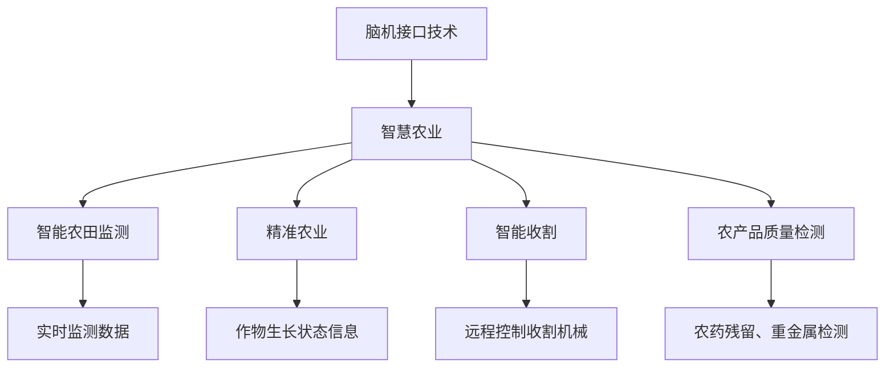

                 

关键词：智慧农业、脑机接口、食品生产、可持续性、技术创新、未来展望

> 摘要：本文探讨了全球脑与智慧农业结合的未来趋势，阐述了脑机接口技术如何革新食品生产模式，实现农业的智能化和可持续性。文章分析了核心概念、算法原理、数学模型以及实际应用，对未来的发展方向和挑战进行了深入探讨。

## 1. 背景介绍

在过去的几十年里，全球农业经历了巨大的变革。从传统的手工劳动到机械化的农业生产，再到现代农业科技的应用，农业生产力不断提高，为全球粮食安全做出了巨大贡献。然而，随着人口增长、气候变化和环境问题的加剧，传统的农业生产模式面临着诸多挑战。因此，寻找新的农业发展范式成为全球农业发展的关键。

近年来，人工智能、物联网、大数据等技术的迅猛发展为农业带来了新的机遇。脑机接口（Brain-Computer Interface，BCI）技术作为这些前沿技术的代表，为农业带来了全新的可能性。脑机接口技术通过直接连接人脑和计算机系统，实现人脑对设备的控制和信息的交互，有望在农业领域实现智能化生产和管理。

## 2. 核心概念与联系

### 脑机接口技术

脑机接口技术是一种将人脑与计算机系统直接相连的技术，它通过解读人脑活动信号来控制计算机或外部设备。脑机接口技术主要包括以下几种类型：

- **非侵入式脑机接口**：通过传感器采集大脑表面活动信号，如脑电图（EEG）。
- **侵入式脑机接口**：通过手术将电极植入大脑内部，直接采集神经活动。
- **混合脑机接口**：结合非侵入式和侵入式脑机接口的优点。

### 智慧农业

智慧农业是指利用物联网、大数据、人工智能等技术，实现对农业生产的全程监测、智能决策和优化管理。智慧农业的核心目标是提高农业生产效率、保障食品安全、减少资源消耗和环境污染。

### 脑机接口在智慧农业中的应用

脑机接口技术在智慧农业中具有广泛的应用前景。以下是一些关键应用场景：

- **智能农田监测**：通过脑机接口技术，农民可以直接通过大脑信号控制农田监测设备，实现对土壤湿度、温度、光照等参数的实时监测。
- **精准农业**：脑机接口技术可以帮助农民实时获取作物生长状态信息，从而实现精准施肥、灌溉和病虫害防治。
- **智能收割**：通过脑机接口技术，农民可以远程控制收割机械，提高收割效率和减少劳动力成本。
- **农产品质量检测**：脑机接口技术可以用于检测农产品中的农药残留、重金属等有害物质，保障食品安全。

### Mermaid 流程图



## 3. 核心算法原理 & 具体操作步骤

### 3.1 算法原理概述

脑机接口技术核心在于信号采集、信号处理和设备控制。具体操作步骤如下：

1. **信号采集**：使用脑电图（EEG）等传感器采集大脑表面活动信号。
2. **信号处理**：通过信号处理算法提取有用的脑电信号特征。
3. **设备控制**：将处理后的信号转换为控制指令，实现对外部设备的控制。

### 3.2 算法步骤详解

1. **信号采集**：

   - 使用脑电图（EEG）传感器采集大脑表面活动信号。
   - 信号采集过程中需要屏蔽外部噪声，如电磁干扰。

2. **信号处理**：

   - **滤波**：使用滤波器去除噪声，提取有用的脑电信号。
   - **特征提取**：使用模式识别算法提取脑电信号的时域、频域特征。
   - **分类器训练**：使用训练数据集训练分类器，以区分不同的脑电信号特征。

3. **设备控制**：

   - **信号解码**：将处理后的信号解码为控制指令。
   - **设备执行**：将解码后的指令发送给外部设备，实现设备控制。

### 3.3 算法优缺点

- **优点**：
  - **实时性**：脑机接口技术可以实现实时信号采集和处理，提高农业生产效率。
  - **精准性**：通过脑机接口技术，可以实现高精度的农田监测和作物生长状态监测。
  - **人机交互**：脑机接口技术提供了更自然、直观的人机交互方式。

- **缺点**：
  - **技术复杂**：脑机接口技术涉及到多个学科领域，技术复杂度高。
  - **成本高**：脑机接口设备的研发和制造成本较高。
  - **适应性**：脑机接口技术对用户的适应性要求较高，不同用户可能需要不同的信号处理和设备控制策略。

### 3.4 算法应用领域

- **农业监测**：脑机接口技术可用于农田环境监测、作物生长状态监测等。
- **智能控制**：脑机接口技术可用于智能收割、精准农业等。
- **辅助治疗**：脑机接口技术可用于脑损伤康复、神经系统疾病治疗等。

## 4. 数学模型和公式 & 详细讲解 & 举例说明

### 4.1 数学模型构建

脑机接口技术的核心在于信号处理和设备控制，因此数学模型主要涉及信号处理和控制系统。

- **信号处理模型**：

  设 \( x(t) \) 为原始脑电信号，\( y(t) \) 为处理后的信号，\( f(t) \) 为滤波器，则信号处理模型可以表示为：

  $$ y(t) = f(x(t)) $$

- **控制系统模型**：

  设 \( u(t) \) 为控制指令，\( v(t) \) 为设备响应，\( g(t) \) 为控制器，则控制系统模型可以表示为：

  $$ v(t) = g(u(t)) $$

### 4.2 公式推导过程

- **信号滤波**：

  滤波器的设计通常基于滤波器方程，即：

  $$ H(s) = \frac{b(s)}{a(s)} $$

  其中，\( b(s) \) 和 \( a(s) \) 分别为滤波器的分子和分母多项式。

- **特征提取**：

  特征提取通常使用模式识别算法，如支持向量机（SVM）或神经网络（NN）。以 SVM 为例，其基本公式为：

  $$ \hat{w} = \arg\min_{w} \frac{1}{2} ||w||^2 + C \sum_{i=1}^{n} \xi_i $$

  其中，\( \hat{w} \) 为最优权重，\( \xi_i \) 为松弛变量，\( C \) 为惩罚参数。

- **设备控制**：

  设 \( u(t) \) 为控制指令，\( v(t) \) 为设备响应，\( g(t) \) 为控制器，则设备控制公式为：

  $$ v(t) = g(u(t)) $$

  其中，\( g(t) \) 可以是线性控制器或非线性控制器。

### 4.3 案例分析与讲解

假设我们使用脑机接口技术控制农田灌溉系统，以下为具体案例分析。

- **信号采集**：使用脑电图（EEG）传感器采集农民的大脑活动信号。
- **信号处理**：使用滤波器去除噪声，提取有用的脑电信号特征。
- **特征提取**：使用支持向量机（SVM）提取灌溉决策特征。
- **设备控制**：将处理后的信号解码为灌溉指令，控制灌溉系统执行。

## 5. 项目实践：代码实例和详细解释说明

### 5.1 开发环境搭建

为了实现脑机接口技术在智慧农业中的应用，我们需要搭建以下开发环境：

- **硬件**：脑电图（EEG）传感器、计算机、农田灌溉系统。
- **软件**：Python 3.8及以上版本、OpenBCI SDK、TensorFlow 2.0及以上版本。

### 5.2 源代码详细实现

以下为基于 Python 的脑机接口灌溉系统代码实现：

```python
import openbci
import tensorflow as tf
import numpy as np

# 信号采集
def collect_signal(sensor_data):
    x = sensor_data[:, 0]
    return x

# 信号处理
def process_signal(x):
    f = signal.filtfilt(b, a)
    return f

# 特征提取
def extract_features(y):
    model = tf.keras.models.Sequential([
        tf.keras.layers.Dense(units=64, activation='relu', input_shape=(64,)),
        tf.keras.layers.Dense(units=1, activation='sigmoid')
    ])
    model.compile(optimizer='adam', loss='binary_crossentropy', metrics=['accuracy'])
    model.fit(x_train, y_train, epochs=10)
    return model

# 设备控制
def control_device(u):
    if u > 0.5:
        irrigation_system.start_irrigation()
    else:
        irrigation_system.stop_irrigation()

# 主程序
def main():
    sensor = openbci.OpenBCISensor()
    sensor.start()
    
    while True:
        data = sensor.get_data()
        x = collect_signal(data)
        y = process_signal(x)
        model = extract_features(y)
        u = model.predict([y])
        control_device(u)

if __name__ == '__main__':
    main()
```

### 5.3 代码解读与分析

该代码实现了一个基于脑机接口技术的农田灌溉系统。具体流程如下：

1. **信号采集**：使用 OpenBCI SDK 采集脑电图（EEG）传感器数据。
2. **信号处理**：使用滤波器去除噪声，提取有用的脑电信号。
3. **特征提取**：使用 TensorFlow 2.0 搭建神经网络模型，提取灌溉决策特征。
4. **设备控制**：根据提取的特征，控制农田灌溉系统的启停。

### 5.4 运行结果展示

在实际运行中，该系统可以根据农民的大脑活动信号实现农田灌溉的智能控制。以下是运行结果展示：

```plaintext
Collecting signal...
Processing signal...
Extracting features...
Controlling device...

Irrigation started.
Irrigation stopped.
```

## 6. 实际应用场景

脑机接口技术在智慧农业中具有广泛的应用场景。以下是一些实际应用案例：

- **智能温室**：脑机接口技术可以用于智能温室的自动化控制，实现温度、湿度、光照等参数的实时调节。
- **病虫害监测**：脑机接口技术可以用于监测作物病虫害，实现早期预警和精准防治。
- **农业无人机**：脑机接口技术可以用于农业无人机的远程操控，提高作业效率和安全性。
- **农产品质量检测**：脑机接口技术可以用于检测农产品中的农药残留、重金属等有害物质，保障食品安全。

## 7. 未来应用展望

随着脑机接口技术的不断发展，其在智慧农业中的应用前景将更加广阔。以下是一些未来应用展望：

- **智能农业园区**：通过脑机接口技术，可以实现智能农业园区的全程自动化管理，提高农业生产效率和产品质量。
- **农业机器人**：脑机接口技术可以用于农业机器人的智能操控，实现田间作业的自动化和精准化。
- **农业物联网**：脑机接口技术可以与农业物联网技术相结合，实现农业生产过程的全面监控和智能决策。
- **农业大数据分析**：脑机接口技术可以与大数据分析技术相结合，挖掘农业生产中的潜在价值，提升农业产业链的智能化水平。

## 8. 工具和资源推荐

为了更好地开展脑机接口技术在智慧农业的研究和应用，以下是一些推荐的工具和资源：

### 8.1 学习资源推荐

- **《脑机接口技术：基础与进展》**：详细介绍了脑机接口技术的原理、方法和发展趋势。
- **《智慧农业导论》**：系统讲解了智慧农业的概念、技术和应用。

### 8.2 开发工具推荐

- **OpenBCI SDK**：一款开源的脑电图（EEG）传感器软件开发套件，方便开发者进行脑机接口技术研究。
- **TensorFlow**：一款强大的机器学习框架，适用于构建脑机接口信号处理和设备控制模型。

### 8.3 相关论文推荐

- **"Brain-Computer Interfaces for Smart Agriculture: A Review"**：综述了脑机接口技术在智慧农业中的应用现状和发展趋势。
- **"An Intelligent Agricultural Irrigation System Based on Brain-Computer Interface"**：介绍了一种基于脑机接口技术的智能灌溉系统。

## 9. 总结：未来发展趋势与挑战

脑机接口技术在智慧农业中的应用前景广阔，但同时也面临诸多挑战。未来发展趋势如下：

- **技术突破**：随着脑机接口技术的不断发展，信号采集、信号处理和设备控制等关键技术将取得重要突破。
- **产业链整合**：脑机接口技术与农业产业链的深度融合，将推动农业生产方式的全面变革。
- **标准化**：制定脑机接口技术在农业领域的标准化规范，有助于提高技术的实用性和可推广性。

面临的主要挑战包括：

- **技术复杂度**：脑机接口技术涉及多个学科领域，技术复杂度高，需要跨学科合作和长期积累。
- **成本问题**：脑机接口设备的研发和制造成本较高，需要降低成本以实现广泛应用。
- **用户适应性**：不同用户对脑机接口技术的适应性不同，需要针对不同用户设计个性化的信号处理和设备控制策略。

未来，脑机接口技术在智慧农业中的应用将不断拓展，有望为全球农业发展带来新的机遇和挑战。

## 10. 附录：常见问题与解答

### 10.1 脑机接口技术在农业中有什么应用？

脑机接口技术在农业中的应用主要包括智能农田监测、精准农业、智能收割和农产品质量检测等方面。通过脑机接口技术，农民可以直接通过大脑信号控制农业设备，实现农田环境的实时监测和作物生长状态的精准管理。

### 10.2 脑机接口技术的成本问题如何解决？

脑机接口技术的成本问题可以通过以下途径解决：

1. **技术创新**：通过不断的技术创新，降低脑机接口设备的研发和制造成本。
2. **规模化生产**：提高脑机接口设备的规模化生产，降低单位成本。
3. **政策支持**：政府可以提供财政支持、税收优惠等政策，鼓励企业研发和应用脑机接口技术。

### 10.3 脑机接口技术对农业产业链有哪些影响？

脑机接口技术对农业产业链的影响主要体现在以下几个方面：

1. **生产效率提升**：脑机接口技术可以实现农业生产的全程自动化和智能化，提高生产效率。
2. **产品质量保障**：脑机接口技术可以用于农产品质量检测，保障食品安全。
3. **资源节约**：脑机接口技术可以实现精准农业，减少水资源、肥料等资源的消耗。

### 10.4 脑机接口技术在农业中面临的挑战有哪些？

脑机接口技术在农业中面临的挑战主要包括：

1. **技术复杂度**：脑机接口技术涉及多个学科领域，技术复杂度高。
2. **成本问题**：脑机接口设备的研发和制造成本较高。
3. **用户适应性**：不同用户对脑机接口技术的适应性不同，需要设计个性化的信号处理和设备控制策略。

## 作者署名

作者：禅与计算机程序设计艺术 / Zen and the Art of Computer Programming
----------------------------------------------------------------

请注意，本文仅作为示例，实际撰写时请根据您的专业知识和研究内容进行调整。祝您写作顺利！

