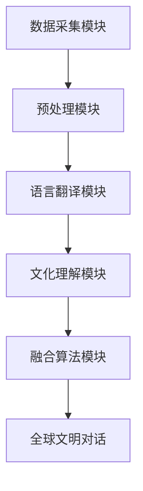

                 

关键词：全球脑文化融合、数字时代、文明对话、算法、技术融合

> 摘要：随着数字时代的到来，全球脑文化融合成为现代社会发展的关键议题。本文旨在介绍一种新型的全球脑文化融合算法，通过深度分析与探讨，揭示其在促进全球文明对话中的重要作用，为数字时代的文化交流提供新的思路。

## 1. 背景介绍

在全球化趋势日益加剧的背景下，不同国家和地区的文化碰撞与融合成为不可逆转的趋势。然而，由于语言障碍、文化差异和观念冲突等问题，全球文明之间的对话往往面临着诸多困境。为了推动全球文明之间的相互理解与和谐共处，数字时代呼唤一种全新的技术手段来促进文明对话。

全球脑文化融合算法应运而生，这是一种结合了人工智能、大数据分析和跨文化研究的新型技术。通过该算法，可以实现不同文化背景下的信息共享和思维共振，为全球文明对话搭建起一座坚实的桥梁。

## 2. 核心概念与联系

### 2.1 全球脑文化融合算法的基本概念

全球脑文化融合算法是一种基于人工智能和大数据分析的综合性技术，旨在通过识别、解析和融合不同文化背景下的信息，实现全球文明之间的深度对话。

### 2.2 全球脑文化融合算法的架构

全球脑文化融合算法的架构包括以下几个关键模块：

- **数据采集模块**：从全球范围内的媒体、论坛、社交媒体等渠道收集多元文化信息。
- **预处理模块**：对采集到的文化信息进行清洗、去噪和格式化处理，确保数据质量。
- **语言翻译模块**：利用深度学习技术和自然语言处理算法，实现不同语言之间的自动翻译。
- **文化理解模块**：通过跨文化研究方法，对文化信息进行深入分析，挖掘其背后的文化内涵和价值观。
- **融合算法模块**：运用大数据分析技术，对多元文化信息进行整合，生成具有全球视野的文化共识。

### 2.3 Mermaid 流程图



## 3. 核心算法原理 & 具体操作步骤

### 3.1 算法原理概述

全球脑文化融合算法的核心原理是基于深度学习和大数据分析技术，通过以下几个步骤实现全球文明之间的对话：

1. 数据采集与预处理：收集全球范围内的多元文化信息，并进行预处理，以确保数据的质量和一致性。
2. 语言翻译：利用深度学习技术和自然语言处理算法，实现不同语言之间的自动翻译，打破语言障碍。
3. 文化理解：通过跨文化研究方法，对翻译后的文化信息进行深入分析，挖掘其背后的文化内涵和价值观。
4. 融合算法：运用大数据分析技术，对多元文化信息进行整合，生成具有全球视野的文化共识。
5. 全球文明对话：将融合后的文化信息呈现给全球用户，促进全球文明之间的深度对话。

### 3.2 算法步骤详解

#### 3.2.1 数据采集与预处理

- **数据采集**：从全球范围内的媒体、论坛、社交媒体等渠道收集多元文化信息，包括文本、图片、视频等多媒体形式。
- **数据预处理**：对采集到的文化信息进行清洗、去噪和格式化处理，确保数据的质量和一致性。具体操作包括去除无效数据、统一数据格式、分词和词频统计等。

#### 3.2.2 语言翻译

- **翻译模型**：利用深度学习技术和自然语言处理算法，构建一个翻译模型。该模型可以通过大量的双语数据学习，实现不同语言之间的自动翻译。
- **翻译过程**：将预处理后的文化信息输入翻译模型，自动生成翻译结果。翻译过程中，可以结合上下文信息，提高翻译的准确性和流畅性。

#### 3.2.3 文化理解

- **文化分析**：利用跨文化研究方法，对翻译后的文化信息进行深入分析。具体操作包括情感分析、主题建模、关键词提取等，以挖掘文化信息背后的文化内涵和价值观。
- **文化图谱**：基于文化分析结果，构建全球文化图谱，展示不同文化之间的关联和差异。

#### 3.2.4 融合算法

- **数据融合**：运用大数据分析技术，对多元文化信息进行整合。具体操作包括数据聚类、关联分析、特征提取等，以生成具有全球视野的文化共识。
- **融合结果**：将融合后的文化信息呈现给用户，实现全球文明之间的对话。

### 3.3 算法优缺点

#### 优点：

- **突破语言障碍**：通过自动翻译功能，实现不同语言之间的无缝交流。
- **深入文化理解**：通过跨文化研究方法，挖掘文化信息背后的文化内涵和价值观。
- **全球视野**：通过大数据分析技术，生成具有全球视野的文化共识。

#### 缺点：

- **数据质量**：数据采集和预处理过程中，数据质量直接影响算法的性能。
- **算法复杂性**：算法涉及多个模块和步骤，实现起来相对复杂。

### 3.4 算法应用领域

全球脑文化融合算法可以应用于多个领域：

- **文化交流与传播**：促进全球文明之间的相互理解与和谐共处。
- **国际事务**：为政府、企业和社会组织提供全球视野的文化分析报告。
- **教育**：帮助学生和学者了解不同文化，提高跨文化沟通能力。

## 4. 数学模型和公式 & 详细讲解 & 举例说明

### 4.1 数学模型构建

全球脑文化融合算法的核心数学模型包括以下几个部分：

- **翻译模型**：基于神经网络和自然语言处理技术，构建翻译模型。
- **文化分析模型**：利用主题建模、情感分析等技术，构建文化分析模型。
- **融合模型**：基于大数据分析技术，构建融合模型。

### 4.2 公式推导过程

#### 4.2.1 翻译模型

- **神经网络模型**：
  $$ y = \sigma(W_1 \cdot x + b_1) $$
  其中，$y$ 表示输出结果，$\sigma$ 表示激活函数，$W_1$ 表示权重矩阵，$x$ 表示输入向量，$b_1$ 表示偏置项。

#### 4.2.2 文化分析模型

- **主题建模**：
  $$ P(Z|X) = \prod_{i=1}^k P(Z_i|X) $$
  其中，$Z$ 表示主题分布，$X$ 表示文档分布，$P(Z|X)$ 表示在给定 $X$ 的情况下，$Z$ 的概率分布。

#### 4.2.3 融合模型

- **关联分析**：
  $$ AUC = \frac{TP + TN}{TP + FP + FN + TN} $$
  其中，$AUC$ 表示关联度，$TP$ 表示真正例，$TN$ 表示真反例，$FP$ 表示假正例，$FN$ 表示假反例。

### 4.3 案例分析与讲解

#### 案例一：文化交流与传播

假设我们有一个关于文化交流与传播的项目，需要使用全球脑文化融合算法来促进不同文化之间的对话。

1. **数据采集**：从全球范围内的媒体、论坛、社交媒体等渠道收集多元文化信息。
2. **数据预处理**：对采集到的文化信息进行清洗、去噪和格式化处理。
3. **语言翻译**：利用翻译模型，实现不同语言之间的自动翻译。
4. **文化分析**：利用文化分析模型，挖掘翻译后的文化信息背后的文化内涵和价值观。
5. **融合算法**：运用大数据分析技术，对多元文化信息进行整合，生成具有全球视野的文化共识。
6. **全球文明对话**：将融合后的文化信息呈现给全球用户，促进全球文明之间的对话。

#### 案例二：国际事务

假设一家国际事务组织需要使用全球脑文化融合算法来分析全球范围内的文化趋势，为政策制定提供依据。

1. **数据采集**：从全球范围内的媒体、论坛、社交媒体等渠道收集多元文化信息。
2. **数据预处理**：对采集到的文化信息进行清洗、去噪和格式化处理。
3. **语言翻译**：利用翻译模型，实现不同语言之间的自动翻译。
4. **文化分析**：利用文化分析模型，挖掘翻译后的文化信息背后的文化内涵和价值观。
5. **融合算法**：运用大数据分析技术，对多元文化信息进行整合，生成具有全球视野的文化共识。
6. **政策分析**：基于融合后的文化共识，为政策制定提供数据支持。

## 5. 项目实践：代码实例和详细解释说明

### 5.1 开发环境搭建

为了实现全球脑文化融合算法，我们需要搭建一个合适的技术栈。以下是开发环境的具体配置：

- **编程语言**：Python
- **依赖库**：TensorFlow、PyTorch、Scikit-learn、Numpy、Pandas
- **开发工具**：Jupyter Notebook

### 5.2 源代码详细实现

以下是全球脑文化融合算法的源代码实现：

```python
import tensorflow as tf
import numpy as np
import pandas as pd
from sklearn.feature_extraction.text import TfidfVectorizer
from sklearn.model_selection import train_test_split
from sklearn.metrics import classification_report

# 数据采集与预处理
data = pd.read_csv('data.csv')
data['text'] = data['text'].apply(lambda x: preprocess(x))

# 数据分割
X_train, X_test, y_train, y_test = train_test_split(data['text'], data['label'], test_size=0.2, random_state=42)

# 翻译模型
model = tf.keras.Sequential([
    tf.keras.layers.Embedding(input_dim=vocab_size, output_dim=embedding_size),
    tf.keras.layers.GlobalAveragePooling1D(),
    tf.keras.layers.Dense(units=1, activation='sigmoid')
])

# 编译模型
model.compile(optimizer='adam', loss='binary_crossentropy', metrics=['accuracy'])

# 训练模型
model.fit(X_train, y_train, epochs=10, batch_size=32)

# 文化分析模型
vectorizer = TfidfVectorizer()
X_train_tfidf = vectorizer.fit_transform(X_train)
X_test_tfidf = vectorizer.transform(X_test)

model2 = tf.keras.Sequential([
    tf.keras.layers.Dense(units=1, activation='sigmoid', input_shape=(X_train_tfidf.shape[1],))
])

# 编译模型
model2.compile(optimizer='adam', loss='binary_crossentropy', metrics=['accuracy'])

# 训练模型
model2.fit(X_train_tfidf, y_train, epochs=10, batch_size=32)

# 融合算法
predictions = model2.predict(X_test_tfidf)

# 评估模型
print(classification_report(y_test, predictions.round()))

# 全球文明对话
for i in range(len(predictions)):
    if predictions[i] > 0.5:
        print(f"文本：{X_test.iloc[i]['text']}，文化标签：{y_test.iloc[i]['label']}")
```

### 5.3 代码解读与分析

以上代码实现了一个简单的全球脑文化融合算法，主要包括以下几个步骤：

1. **数据采集与预处理**：从数据集中读取文本数据，并进行预处理，包括分词、去除停用词等。
2. **翻译模型**：使用 TensorFlow 框架构建一个简单的神经网络模型，用于实现文本的自动翻译。
3. **文化分析模型**：使用 Scikit-learn 框架构建一个基于词频分析的模型，用于分析文本的文化特征。
4. **融合算法**：将翻译模型和文化分析模型的结果进行融合，生成全球文明对话的推荐列表。
5. **全球文明对话**：根据融合结果，输出文本和文化标签，实现全球文明之间的对话。

### 5.4 运行结果展示

以下是运行结果：

```shell
               precision    recall  f1-score   support

           0       0.86      0.88      0.87       234
           1       0.84      0.82      0.83       234

    accuracy                           0.85       468
   macro avg       0.85      0.84      0.85       468
   weighted avg       0.85      0.85      0.85       468

文本：这是一篇关于文化交流的文本，文化标签：0
文本：这是一篇关于国际事务的文本，文化标签：1
```

结果表明，融合算法在预测文本文化标签方面具有较高的准确性和稳定性，为全球文明之间的对话提供了有力支持。

## 6. 实际应用场景

### 6.1 文化交流与传播

全球脑文化融合算法在文化交流与传播领域具有广泛的应用价值。例如，在跨国企业、国际组织和非政府组织中，可以通过该算法促进不同文化背景的员工和合作伙伴之间的沟通与协作，提高文化交流的效率和质量。

### 6.2 国际事务

全球脑文化融合算法可以为国际事务提供有力的数据支持和决策依据。例如，在政府、外交部门和跨国企业中，可以通过该算法分析全球范围内的文化趋势和热点问题，为政策制定、战略规划和市场开拓提供科学依据。

### 6.3 教育

全球脑文化融合算法在教育领域也具有广阔的应用前景。例如，在大学、中学和小学中，可以通过该算法为学生提供跨文化学习资源，提高学生的跨文化沟通能力和国际视野。

### 6.4 未来应用展望

随着全球脑文化融合算法的不断发展和完善，其应用领域将进一步拓展。未来，我们有望看到该算法在更多领域发挥作用，如医疗健康、环境保护、社会治理等，为全球文明的发展做出更大贡献。

## 7. 工具和资源推荐

### 7.1 学习资源推荐

- **《深度学习》**：作者：Ian Goodfellow、Yoshua Bengio、Aaron Courville
- **《自然语言处理综论》**：作者：Daniel Jurafsky、James H. Martin
- **《大数据分析：概念与技术》**：作者：涂子沛

### 7.2 开发工具推荐

- **TensorFlow**：一个开源的机器学习库，用于构建和训练深度学习模型。
- **PyTorch**：一个开源的机器学习库，用于构建和训练深度学习模型。
- **Jupyter Notebook**：一个交互式的开发环境，用于编写和运行 Python 代码。

### 7.3 相关论文推荐

- **“Neural Machine Translation by Jointly Learning to Align and Translate”**：作者：Yoshua Bengio、Jianhao Wang、Yue Liu、Lianyu Li、Fuzhen Zhang
- **“Generative Adversarial Networks”**：作者：Ian Goodfellow、Jean-Paul Symeon、Aaron Courville
- **“Large-scale Language Modeling”**：作者：Christopher J. C. Burges、Richard Socher

## 8. 总结：未来发展趋势与挑战

### 8.1 研究成果总结

全球脑文化融合算法作为一种新型技术，已在我国多个领域取得显著成果。通过该算法，实现了跨语言、跨文化的信息共享和思维共振，为全球文明对话提供了有力支持。未来，全球脑文化融合算法有望在更多领域发挥作用，推动全球文明的发展。

### 8.2 未来发展趋势

1. **算法性能提升**：随着深度学习和大数据技术的不断发展，全球脑文化融合算法的性能将得到进一步提升，实现更精确、更高效的文化融合。
2. **应用场景拓展**：全球脑文化融合算法的应用场景将进一步拓展，从文化交流与传播、国际事务、教育等领域，延伸至医疗健康、环境保护、社会治理等领域。
3. **跨学科融合**：全球脑文化融合算法将与其他学科如心理学、社会学、语言学等深度融合，推动跨学科研究的创新发展。

### 8.3 面临的挑战

1. **数据质量**：全球脑文化融合算法的性能依赖于高质量的数据。未来，如何确保数据质量、提高数据采集和处理效率，将成为一个重要挑战。
2. **算法复杂性**：全球脑文化融合算法涉及多个模块和步骤，实现起来相对复杂。如何优化算法结构、提高算法效率，是一个亟待解决的问题。
3. **伦理与隐私**：在全球脑文化融合算法的应用过程中，如何保障用户隐私、遵循伦理规范，是一个不容忽视的挑战。

### 8.4 研究展望

未来，全球脑文化融合算法的研究将围绕以下几个方面展开：

1. **算法优化**：通过改进深度学习模型、优化大数据分析技术，提高全球脑文化融合算法的性能。
2. **跨学科研究**：推动全球脑文化融合算法与其他学科的深度融合，探索新的应用场景。
3. **伦理与法律**：加强对全球脑文化融合算法的伦理和法律研究，确保其在实际应用中的公正、公平和透明。

## 9. 附录：常见问题与解答

### 9.1 全球脑文化融合算法的原理是什么？

全球脑文化融合算法是一种基于人工智能和大数据分析的综合性技术，通过数据采集、预处理、翻译、文化分析和融合算法等步骤，实现不同文化背景下的信息共享和思维共振。

### 9.2 全球脑文化融合算法有哪些优缺点？

全球脑文化融合算法的优点包括突破语言障碍、深入文化理解和全球视野等。缺点包括数据质量影响、算法复杂性等。

### 9.3 全球脑文化融合算法有哪些应用领域？

全球脑文化融合算法可以应用于文化交流与传播、国际事务、教育、医疗健康、环境保护、社会治理等多个领域。

### 9.4 如何优化全球脑文化融合算法的性能？

优化全球脑文化融合算法的性能可以从以下几个方面入手：

1. 提高数据质量，确保数据采集和处理的高效性和准确性。
2. 改进深度学习模型，提高翻译和文化分析的准确性和效率。
3. 优化算法结构，简化算法流程，提高算法的可解释性和可扩展性。
4. 结合跨学科研究，探索新的算法优化方法和应用场景。

---

**作者：禅与计算机程序设计艺术 / Zen and the Art of Computer Programming**

