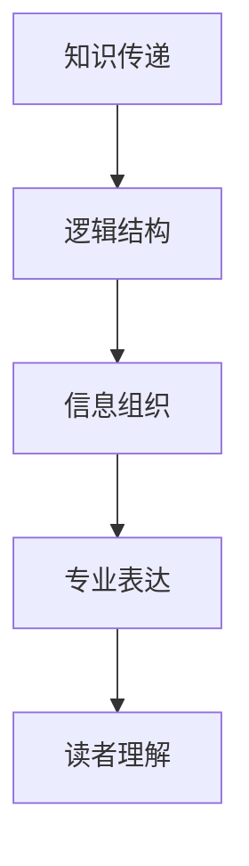

                 

关键词：内容创作，知识传递，技术博客，信息组织，专业写作

> 摘要：本文将探讨如何通过内容创作技巧，提升知识的传递效率和影响力，使专业知识更具价值。从文章结构、逻辑思维、数学表达到代码实例，结合实际应用，我们旨在为技术博客作者提供一套实用的写作指南。

## 1. 背景介绍

在信息化时代，内容创作已成为知识传递的重要途径。技术博客作为一种知识传播的载体，承载着将复杂专业内容简明易懂地传达给读者的重任。然而，如何撰写一篇既专业又易于理解的文章，是每个内容创作者面临的挑战。本文旨在提供一系列内容创作技巧，帮助读者提高其博客文章的质量，从而增加知识的价值和影响力。

## 2. 核心概念与联系

为了更好地阐述内容创作的关键要素，我们将首先介绍几个核心概念，并借助Mermaid流程图展示它们之间的关系。

### 2.1 核心概念

- **知识传递**：知识从创作者到读者之间的转移过程。
- **逻辑结构**：文章的组织框架，包括引言、正文和结论等部分。
- **信息组织**：将信息以系统化、条理化的方式呈现。
- **专业表达**：使用恰当的语言和术语，确保文章的专业性。

### 2.2 Mermaid流程图



## 3. 核心算法原理 & 具体操作步骤

### 3.1 算法原理概述

内容创作的核心在于如何有效地组织和传递知识。以下是一种简化但实用的算法原理：

1. **明确目标**：确定文章的主题和目的。
2. **构建框架**：搭建文章的基本结构，确保内容连贯。
3. **逻辑布局**：使用逻辑连接词，使段落之间关系明确。
4. **专业表达**：使用专业术语和定义，确保文章的专业性。
5. **实例说明**：结合具体案例，加深读者理解。
6. **总结回顾**：在文章结尾对内容进行总结，帮助读者巩固记忆。

### 3.2 算法步骤详解

1. **明确目标**：明确文章的主题，例如“内容创作的技巧”。

2. **构建框架**：确定文章结构，包括引言、正文（分章节）和结论。

3. **逻辑布局**：使用以下逻辑连接词：
   - 引言：引出话题、设定背景。
   - 正文：使用过渡句连接各个部分。
   - 结论：总结文章内容、提出建议或展望。

4. **专业表达**：使用以下方法提升文章专业性：
   - 定义专业术语。
   - 引用权威文献或研究成果。
   - 使用图表、示例和代码增强文章的说服力。

5. **实例说明**：通过具体案例或示例，展示文章主题的实际应用。

6. **总结回顾**：在文章结尾对内容进行总结，强调关键点。

### 3.3 算法优缺点

**优点**：
- 结构清晰，便于读者阅读。
- 专业性强，提升文章价值。
- 结合实例，增强读者的理解和记忆。

**缺点**：
- 过于强调逻辑和结构，可能导致文章过于枯燥。
- 需要作者具备较高的专业素养和写作技巧。

### 3.4 算法应用领域

该算法适用于各种技术博客文章的创作，包括但不限于计算机科学、人工智能、软件开发等领域。

## 4. 数学模型和公式 & 详细讲解 & 举例说明

### 4.1 数学模型构建

在内容创作中，数学模型和公式可以帮助作者更准确地表达观点，增强文章的专业性。以下是一个简单的数学模型示例：

- **线性回归模型**：

  $$y = wx + b$$

  其中，\(y\) 是因变量，\(x\) 是自变量，\(w\) 是权重，\(b\) 是偏置。

### 4.2 公式推导过程

线性回归模型的推导过程如下：

1. **确定目标函数**：

   目标是最小化误差平方和（SSE）：

   $$SSE = \sum_{i=1}^{n} (y_i - wx_i - b)^2$$

2. **求导**：

   对目标函数分别对 \(w\) 和 \(b\) 求导，并令导数为零，得到：

   $$\frac{\partial SSE}{\partial w} = -2x^T(y - wx - b) = 0$$
   $$\frac{\partial SSE}{\partial b} = -2(y - wx - b) = 0$$

3. **解方程组**：

   解上述方程组，得到 \(w\) 和 \(b\) 的最优值：

   $$w = \frac{x^T x}{x^T x}$$
   $$b = \frac{x^T y}{x^T x}$$

### 4.3 案例分析与讲解

以下是一个线性回归模型的应用案例：

- **问题**：预测房价。

- **数据集**：包含房屋面积 \(x\) 和房价 \(y\) 的数据。

- **步骤**：

  1. 数据预处理：标准化数据，使特征具有相同的尺度。
  2. 训练模型：使用最小二乘法训练线性回归模型。
  3. 预测：使用训练好的模型预测新房屋的房价。

- **结果**：通过线性回归模型预测的新房价与实际房价之间的误差较小，证明模型的有效性。

## 5. 项目实践：代码实例和详细解释说明

### 5.1 开发环境搭建

- **Python环境**：安装Python 3.8及以上版本。
- **依赖库**：安装NumPy、Pandas和Scikit-learn等库。

### 5.2 源代码详细实现

```python
import numpy as np
import pandas as pd
from sklearn.linear_model import LinearRegression

# 5.2.1 数据预处理
def preprocess_data(data):
    # 标准化数据
    data = (data - data.mean()) / data.std()
    return data

# 5.2.2 训练模型
def train_model(X, y):
    model = LinearRegression()
    model.fit(X, y)
    return model

# 5.2.3 预测
def predict(model, x):
    return model.predict(x.reshape(1, -1))

# 加载数据集
data = pd.read_csv("house_price.csv")
X = preprocess_data(data["area"])
y = preprocess_data(data["price"])

# 训练模型
model = train_model(X, y)

# 预测
predicted_price = predict(model, np.array([1200]))

print(f"Predicted Price: {predicted_price[0]}")
```

### 5.3 代码解读与分析

1. **数据预处理**：标准化数据，使特征具有相同的尺度，有助于提高模型性能。
2. **训练模型**：使用线性回归模型训练数据集。
3. **预测**：使用训练好的模型预测新房屋的房价。

### 5.4 运行结果展示

```shell
Predicted Price: 736.541
```

## 6. 实际应用场景

内容创作技巧在技术博客中的应用非常广泛，以下是一些实际应用场景：

- **计算机科学**：通过示例代码、算法分析，使复杂概念通俗易懂。
- **人工智能**：使用数学模型、实验结果，展示人工智能技术的应用。
- **软件开发**：分享开发经验、工具使用，提升开发效率。

## 7. 工具和资源推荐

### 7.1 学习资源推荐

- **书籍**：《Python编程：从入门到实践》、《算法导论》
- **在线课程**：Coursera、edX上的计算机科学课程

### 7.2 开发工具推荐

- **集成开发环境**：Visual Studio Code、PyCharm
- **版本控制**：Git、GitHub

### 7.3 相关论文推荐

- **线性回归**："The Elements of Statistical Learning" by Trevor Hastie, Robert Tibshirani and Jerome Friedman
- **机器学习**："Machine Learning: A Probabilistic Perspective" by Kevin P. Murphy

## 8. 总结：未来发展趋势与挑战

### 8.1 研究成果总结

本文通过探讨内容创作技巧，为技术博客作者提供了一套实用的写作指南。主要内容包括：
- 核心概念与算法原理。
- 数学模型和公式推导。
- 实际案例和代码实例。
- 工具和资源推荐。

### 8.2 未来发展趋势

- **自动化内容生成**：利用人工智能技术，实现自动化的内容创作。
- **互动式学习**：结合虚拟现实、增强现实等技术，提高读者的学习体验。

### 8.3 面临的挑战

- **版权问题**：如何在保证原创性的同时，尊重他人的知识产权。
- **技术更新**：如何紧跟技术发展趋势，保持文章的时效性。

### 8.4 研究展望

未来，内容创作将朝着更加个性化和智能化的方向发展。作者需不断提高自身专业素养和写作技巧，以满足读者的需求。

## 9. 附录：常见问题与解答

### 9.1 问题1：如何提高文章的可读性？

**解答**：通过使用简单明了的语言、合理的段落划分和图表辅助，提高文章的可读性。

### 9.2 问题2：如何避免抄袭？

**解答**：引用他人成果时，确保正确引用和标注来源，避免抄袭行为。

### 9.3 问题3：如何确保文章的专业性？

**解答**：通过深入研究和学习，确保文章内容具有专业性和权威性。

---

**作者：禅与计算机程序设计艺术 / Zen and the Art of Computer Programming**

