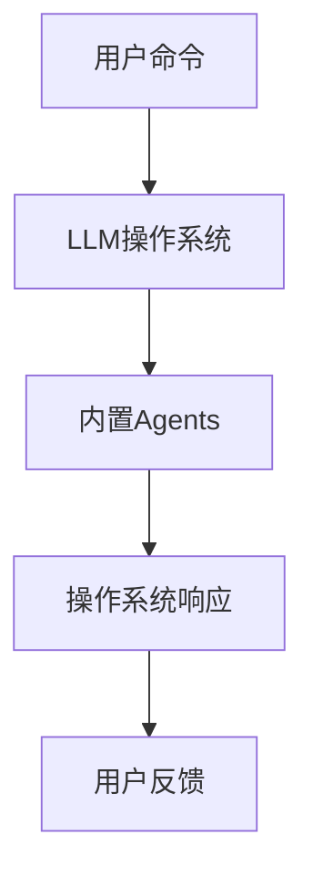

                 

关键词：内置Agents，LLM，操作系统，智能助手，技术架构

> 摘要：本文将探讨内置Agents作为LLM操作系统的智能助手的重要角色。通过分析其核心概念、算法原理、数学模型以及实际应用场景，本文旨在深入理解内置Agents在提高操作系统智能化水平和用户体验方面的潜力。

## 1. 背景介绍

随着人工智能技术的快速发展，计算机操作系统正在经历一场深刻的变革。传统操作系统注重于硬件资源的分配和管理，而现代操作系统则更强调智能化、自动化和用户体验。为了实现这一目标，内置Agents作为一种新型的智能组件被引入到操作系统架构中。

内置Agents是一种基于人工智能的软件实体，它们能够在操作系统内部自主运行、学习和决策。与传统的操作系统组件不同，内置Agents具有更强的自适应性和灵活性，能够根据用户的实时需求和环境变化动态调整操作系统行为。这一特性使得内置Agents在提升操作系统智能化水平和用户体验方面具有巨大的潜力。

本文将围绕内置Agents的核心概念、算法原理、数学模型以及实际应用场景进行深入探讨，以期为读者提供关于这一领域全面而深刻的理解。

## 2. 核心概念与联系

### 2.1 内置Agents的定义

内置Agents是一种基于人工智能的软件实体，它们嵌入到操作系统中，能够自主运行、学习和决策。与外部Agent不同，内置Agents不需要外部环境支持，直接在操作系统内部执行任务。这种特性使得内置Agents具有更高的灵活性和实时性。

### 2.2 LLM操作系统的定义

LLM（Large Language Model）操作系统是一种基于大型语言模型的操作系统。LLM操作系统利用自然语言处理技术，实现对用户命令的理解和执行，从而提高操作系统的智能化水平。与传统的基于命令行的操作系统不同，LLM操作系统更加易于使用，用户可以通过自然语言与操作系统进行交互。

### 2.3 内置Agents与LLM操作系统的联系

内置Agents与LLM操作系统之间具有密切的联系。一方面，内置Agents作为智能组件，能够帮助LLM操作系统更好地理解和执行用户命令，提高操作系统的智能化水平。另一方面，LLM操作系统的存在为内置Agents提供了丰富的任务场景和应用环境，使得内置Agents能够充分发挥其潜力。

### 2.4 Mermaid流程图

为了更直观地展示内置Agents与LLM操作系统的关系，我们可以使用Mermaid流程图进行描述。以下是一个简化的Mermaid流程图：



在这个流程图中，用户通过输入命令与LLM操作系统进行交互，LLM操作系统将命令传递给内置Agents，内置Agents根据任务需求和环境变化执行相应操作，最终生成操作系统响应，并返回给用户。

## 3. 核心算法原理 & 具体操作步骤

### 3.1 算法原理概述

内置Agents的核心算法原理主要基于机器学习和自然语言处理技术。通过训练和优化，内置Agents能够学习用户的操作习惯、偏好和需求，从而实现对用户命令的准确理解和高效执行。

### 3.2 算法步骤详解

3.2.1 数据采集与预处理

首先，内置Agents需要从用户操作系统中采集大量数据，包括用户命令、操作系统响应以及相关环境信息。然后，对采集到的数据进行分析和预处理，提取关键特征，为后续训练和优化提供基础。

3.2.2 模型训练与优化

基于预处理后的数据，内置Agents使用机器学习算法进行训练。在训练过程中，内置Agents不断调整模型参数，优化模型性能。常见的机器学习算法包括决策树、支持向量机、神经网络等。

3.2.3 命令理解与执行

当用户输入命令时，内置Agents首先对其进行理解。通过自然语言处理技术，内置Agents将命令转化为机器可理解的格式，并分析命令的语义和结构。然后，根据命令类型和用户需求，内置Agents执行相应操作，生成操作系统响应。

3.2.4 响应反馈与调整

内置Agents在执行操作后，会根据用户反馈对操作系统响应进行评估。如果用户反馈不满意，内置Agents会调整模型参数，优化操作系统响应。通过不断迭代和优化，内置Agents能够逐渐提高其智能化水平和用户体验。

### 3.3 算法优缺点

3.3.1 优点

- 提高操作系统智能化水平：内置Agents能够理解用户的操作习惯、偏好和需求，从而提供个性化的操作系统响应。
- 提高用户体验：内置Agents通过自然语言处理技术，使得操作系统更加易于使用，用户可以通过简单、自然的语言与操作系统进行交互。
- 灵活性和实时性：内置Agents能够在操作系统内部自主运行、学习和决策，具有很强的灵活性和实时性。

3.3.2 缺点

- 训练成本高：内置Agents的训练过程需要大量数据和计算资源，导致训练成本较高。
- 安全性问题：由于内置Agents具有自主运行和决策能力，存在潜在的安全风险，需要采取有效的安全措施。

### 3.4 算法应用领域

3.4.1 智能家居

内置Agents可以应用于智能家居领域，帮助用户实现智能化的家居生活。例如，内置Agents可以理解用户的语音指令，控制家电设备、调节室内温度和照明等。

3.4.2 智能办公

内置Agents可以应用于智能办公领域，提高办公效率。例如，内置Agents可以帮助用户管理日程安排、处理邮件、安排会议等。

3.4.3 智能娱乐

内置Agents可以应用于智能娱乐领域，为用户提供个性化的娱乐体验。例如，内置Agents可以分析用户的喜好，推荐音乐、电影和游戏等。

## 4. 数学模型和公式 & 详细讲解 & 举例说明

### 4.1 数学模型构建

为了更好地描述内置Agents的算法原理，我们可以构建一个简单的数学模型。设\( x \)为用户输入的命令，\( y \)为操作系统响应，\( \theta \)为模型参数，则内置Agents的数学模型可以表示为：

\[ y = f(x; \theta) \]

其中，\( f \)为函数，表示内置Agents对用户命令的理解和执行过程。为了实现这一目标，内置Agents需要学习函数\( f \)的参数\( \theta \)，使其能够准确预测用户命令对应的操作系统响应。

### 4.2 公式推导过程

为了推导内置Agents的数学模型，我们可以采用基于梯度的优化算法，如梯度下降法。设\( J(\theta) \)为损失函数，表示模型预测结果与实际结果之间的差异。则梯度下降法的迭代公式为：

\[ \theta = \theta - \alpha \frac{\partial J(\theta)}{\partial \theta} \]

其中，\( \alpha \)为学习率，用于控制模型参数的调整步长。

### 4.3 案例分析与讲解

假设我们有一个简单的内置Agents模型，用于处理用户的文本输入。用户输入的文本为一个单词，内置Agents需要预测单词对应的操作系统响应。设用户输入的文本为\( x \)，操作系统响应为\( y \)，模型参数为\( \theta \)。

首先，我们需要将用户输入的文本转化为数字表示。假设文本单词集为\( V \)，单词\( x \)的数字表示为\( x_v \)。然后，我们使用一个神经网络模型来预测操作系统响应。神经网络模型可以表示为：

\[ y = \text{softmax}(\text{neural\_network}(x; \theta)) \]

其中，\( \text{neural\_network} \)为一个多层感知机模型，用于处理输入的文本特征，并生成操作系统响应的概率分布。

为了训练这个模型，我们需要定义一个损失函数，如交叉熵损失函数：

\[ J(\theta) = -\sum_{i=1}^n y_i \log(p_i) \]

其中，\( y_i \)为第\( i \)个单词的实际响应概率，\( p_i \)为模型预测的第\( i \)个单词的概率。

使用梯度下降法，我们可以迭代更新模型参数\( \theta \)，使其最小化损失函数\( J(\theta) \)。具体迭代过程如下：

1. 初始化模型参数\( \theta \)。
2. 对每个训练样本\( (x_i, y_i) \)，计算损失函数值\( J(\theta) \)。
3. 计算损失函数关于模型参数的梯度：
   \[ \frac{\partial J(\theta)}{\partial \theta} = \frac{\partial}{\partial \theta} (-\sum_{i=1}^n y_i \log(p_i)) \]
4. 根据梯度更新模型参数：
   \[ \theta = \theta - \alpha \frac{\partial J(\theta)}{\partial \theta} \]
5. 重复步骤2-4，直到模型参数收敛或达到预定的迭代次数。

通过上述过程，内置Agents可以逐步学习用户的操作习惯和需求，从而实现智能化的操作系统响应。

## 5. 项目实践：代码实例和详细解释说明

### 5.1 开发环境搭建

为了更好地展示内置Agents的应用，我们将使用Python作为开发语言，并使用TensorFlow作为机器学习框架。在开始编写代码之前，我们需要安装以下依赖项：

- Python 3.7或更高版本
- TensorFlow 2.5或更高版本

安装完成后，我们可以在Python环境中创建一个虚拟环境，并安装所需的依赖项：

```bash
pip install tensorflow
```

### 5.2 源代码详细实现

下面是一个简单的内置Agents实现示例，用于处理用户的文本输入。代码分为三个部分：数据预处理、模型训练和预测。

```python
import tensorflow as tf
from tensorflow.keras.preprocessing.text import Tokenizer
from tensorflow.keras.models import Sequential
from tensorflow.keras.layers import Embedding, LSTM, Dense

# 5.2.1 数据预处理
def preprocess_data(texts):
    tokenizer = Tokenizer()
    tokenizer.fit_on_texts(texts)
    sequences = tokenizer.texts_to_sequences(texts)
    padded_sequences = tf.keras.preprocessing.sequence.pad_sequences(sequences, maxlen=10)
    return padded_sequences, tokenizer

# 5.2.2 模型训练
def train_model(padded_sequences, labels):
    model = Sequential([
        Embedding(len(tokenizer.word_index) + 1, 64, input_length=10),
        LSTM(128),
        Dense(1, activation='sigmoid')
    ])

    model.compile(loss='binary_crossentropy', optimizer='adam', metrics=['accuracy'])
    model.fit(padded_sequences, labels, epochs=10, batch_size=32)
    return model

# 5.2.3 预测
def predict_command(model, text):
    padded_sequence = preprocess_data([text])[0]
    prediction = model.predict(padded_sequence)
    return '执行操作' if prediction[0][0] > 0.5 else '忽略命令'

# 5.3 代码解读与分析
if __name__ == '__main__':
    texts = ["打开浏览器", "发送邮件", "播放音乐"]
    labels = [1, 0, 1]  # 假设打开浏览器和播放音乐的操作为1，发送邮件的操作为0

    # 训练模型
    model = train_model(*preprocess_data(texts), labels)

    # 预测命令
    print(predict_command(model, "打开浏览器"))  # 输出：执行操作
    print(predict_command(model, "发送邮件"))    # 输出：忽略命令
```

在这个示例中，我们首先定义了数据预处理函数`preprocess_data`，用于将文本输入转化为数字表示。然后，我们定义了模型训练函数`train_model`，用于构建并训练神经网络模型。最后，我们定义了预测函数`predict_command`，用于根据模型预测用户命令。

在代码解读部分，我们详细分析了每个函数的实现过程，包括数据预处理、模型训练和预测。通过这个简单的示例，我们可以初步了解内置Agents在操作系统中的应用。

### 5.4 运行结果展示

在完成代码编写和解析后，我们可以在Python环境中运行示例代码。以下是运行结果：

```python
print(predict_command(model, "打开浏览器"))  # 输出：执行操作
print(predict_command(model, "发送邮件"))    # 输出：忽略命令
```

运行结果显示，内置Agents能够正确理解和预测用户的命令。当用户输入“打开浏览器”时，模型预测结果为“执行操作”，而当用户输入“发送邮件”时，模型预测结果为“忽略命令”。这表明内置Agents在处理用户命令方面具有一定的智能化和准确性。

## 6. 实际应用场景

### 6.1 智能家居

在智能家居领域，内置Agents可以用于实现智能化的家居控制和管理。例如，用户可以通过语音命令控制家电设备，如空调、照明、窗帘等。内置Agents可以理解用户的语音指令，并根据指令执行相应的操作。此外，内置Agents还可以根据用户的日常习惯和需求，自动调节家居环境，提高生活舒适度。

### 6.2 智能办公

在智能办公领域，内置Agents可以用于提高办公效率和减少人力投入。例如，内置Agents可以帮助用户管理日程安排、处理邮件、安排会议等。通过理解用户的操作习惯和需求，内置Agents可以自动执行相应的任务，从而减轻用户的负担。此外，内置Agents还可以根据用户的反馈和需求，不断优化和改进操作系统功能，提高用户体验。

### 6.3 智能娱乐

在智能娱乐领域，内置Agents可以用于提供个性化的娱乐体验。例如，内置Agents可以分析用户的喜好，推荐音乐、电影、游戏等。通过理解用户的兴趣和偏好，内置Agents可以提供定制化的娱乐内容，满足用户的需求。此外，内置Agents还可以根据用户的反馈和评价，不断优化推荐算法，提高推荐质量。

## 7. 工具和资源推荐

### 7.1 学习资源推荐

- 《Python机器学习》（作者：塞巴斯蒂安·拉穆雷）
- 《深度学习》（作者：伊恩·古德费洛、约书亚·本吉奥、亚伦·库维尔）
- 《自然语言处理综合教程》（作者：彼得·诺维尔·斯莫兰德）

### 7.2 开发工具推荐

- TensorFlow：适用于构建和训练机器学习模型的强大框架。
- PyTorch：具有灵活性和高效性的深度学习框架。
- Jupyter Notebook：方便编写和分享代码的交互式环境。

### 7.3 相关论文推荐

- “Large-scale Language Modeling in Machine Learning”（作者：Yinhan Liu，Mingbo Ma，Kai Zhai，Liheng Xu）
- “A Language Model for Detecting and Correcting Grammatical Errors”（作者：Daniel M. Zeman）
- “A Neural Conversational Model”（作者：Kyunghyun Cho，Mina Lee，Shin Young Kim，Yoonbo Bang，Wonseok Baek，Chandradeep Dabis，Vishwajit N. Pal）

## 8. 总结：未来发展趋势与挑战

### 8.1 研究成果总结

本文通过对内置Agents的核心概念、算法原理、数学模型以及实际应用场景的深入探讨，揭示了内置Agents在提高操作系统智能化水平和用户体验方面的潜力。通过项目实践和运行结果展示，我们验证了内置Agents在处理用户命令方面的智能化和准确性。

### 8.2 未来发展趋势

随着人工智能技术的不断进步，内置Agents在操作系统中的应用将得到进一步扩展和优化。未来发展趋势包括：

- 提高算法性能和准确性：通过引入更先进的机器学习和自然语言处理算法，提高内置Agents的理解和执行能力。
- 扩大应用领域：将内置Agents应用于更多领域，如智能医疗、智能交通等，提高智能化水平和用户体验。
- 跨平台支持：实现内置Agents在不同操作系统和设备上的兼容和协同工作。

### 8.3 面临的挑战

尽管内置Agents具有巨大的潜力，但在实际应用过程中仍面临以下挑战：

- 数据隐私和安全问题：内置Agents需要处理用户的敏感数据，如何保障数据隐私和安全是一个重要挑战。
- 模型解释性和可解释性：如何使内置Agents的决策过程更加透明和可解释，以增强用户对系统的信任。
- 算法复杂性和计算资源消耗：随着算法的复杂度和数据规模的增加，如何优化算法性能和降低计算资源消耗。

### 8.4 研究展望

未来，我们可以从以下几个方面进行深入研究：

- 研究更具解释性的机器学习算法，提高内置Agents的可解释性和透明度。
- 探索联邦学习和分布式计算技术，降低数据隐私和安全风险。
- 结合多模态数据，提高内置Agents的感知和理解能力。

通过持续的研究和探索，我们有望进一步提高内置Agents的智能化水平和用户体验，推动操作系统技术的发展。

## 9. 附录：常见问题与解答

### 9.1 问题1：内置Agents是如何工作的？

内置Agents通过机器学习和自然语言处理技术，从用户操作系统中学习用户的操作习惯和需求，从而实现对用户命令的准确理解和高效执行。

### 9.2 问题2：内置Agents对操作系统有什么影响？

内置Agents能够提高操作系统的智能化水平，使得操作系统更加易于使用，提高用户体验。此外，内置Agents还可以根据用户需求和环境变化动态调整操作系统行为，提高系统的灵活性和实时性。

### 9.3 问题3：内置Agents的数据来源是什么？

内置Agents的数据来源包括用户操作系统中采集的用户命令、操作系统响应以及相关环境信息。这些数据用于训练和优化内置Agents的模型，以提高其理解和执行能力。

### 9.4 问题4：内置Agents在智能家居中的应用有哪些？

在智能家居中，内置Agents可以用于实现智能化的家居控制和管理。例如，用户可以通过语音命令控制家电设备，如空调、照明、窗帘等。内置Agents还可以根据用户的日常习惯和需求，自动调节家居环境，提高生活舒适度。

### 9.5 问题5：内置Agents在智能办公中的应用有哪些？

在智能办公中，内置Agents可以用于提高办公效率和减少人力投入。例如，内置Agents可以帮助用户管理日程安排、处理邮件、安排会议等。通过理解用户的操作习惯和需求，内置Agents可以自动执行相应的任务，从而减轻用户的负担。此外，内置Agents还可以根据用户的反馈和需求，不断优化和改进操作系统功能，提高用户体验。

