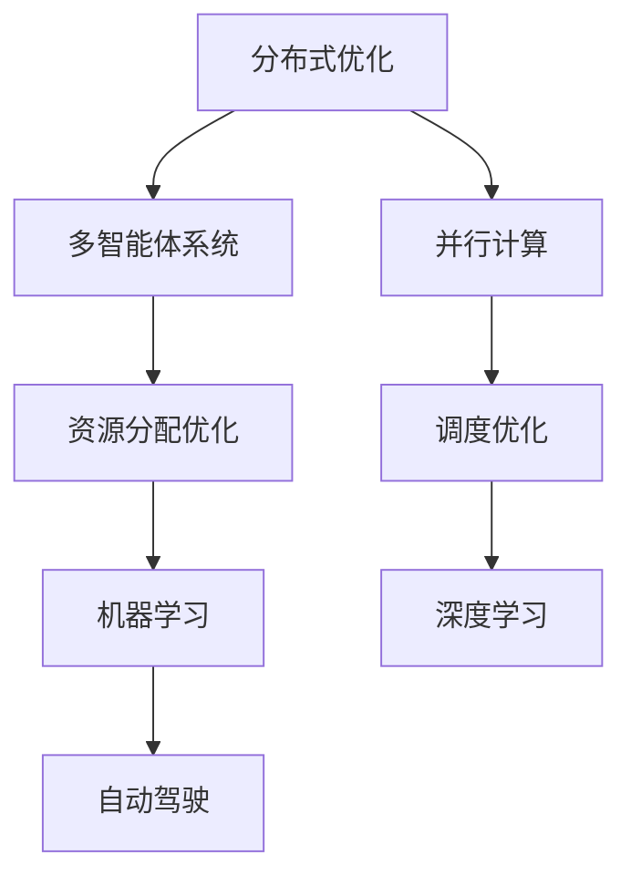

                 

关键词：分布式优化、挑战、策略、多智能体系统、并行计算、算法、数学模型、应用场景、未来展望

> 摘要：本文深入探讨了分布式优化在当今复杂计算环境中的重要性和挑战。通过分析核心概念、算法原理、数学模型及其应用，本文旨在为读者提供一个全面的理解，并探讨未来的研究方向。

## 1. 背景介绍

在当今高度互联和分布式计算的时代，分布式优化技术已经成为解决大规模复杂问题的利器。从云计算到物联网，从深度学习到自动驾驶，分布式优化无处不在，发挥着关键作用。然而，随着系统规模的不断扩大和复杂度的增加，分布式优化面临着一系列挑战，如通信成本、数据一致性和算法稳定性等。

本文将首先介绍分布式优化的定义和基本概念，然后深入探讨其在多智能体系统和并行计算中的应用，接着详细讲解核心算法原理、数学模型以及实际应用案例。最后，我们将总结研究现状，展望未来的发展趋势和面临的挑战。

## 2. 核心概念与联系

### 2.1 分布式优化

分布式优化是指在一个由多个节点组成的系统中，通过协调各节点的计算和通信，以全局优化目标为导向，寻求最优解的方法。分布式优化广泛应用于各种领域，如资源分配、调度优化和机器学习等。

### 2.2 多智能体系统

多智能体系统（MAS）由多个具有自主能力的智能体组成，这些智能体可以在相互协作和竞争的过程中自主决策和行动。在分布式优化中，多智能体系统通过协同优化策略，实现整体性能的最优化。

### 2.3 并行计算

并行计算是指通过多个处理器同时执行计算任务，以加快计算速度。分布式优化在并行计算中具有广泛应用，如分布式计算网格和大规模并行处理器等。

### 2.4 Mermaid 流程图



## 3. 核心算法原理 & 具体操作步骤

### 3.1 算法原理概述

分布式优化算法可以分为基于中心化和基于去中心化两种类型。中心化算法将优化问题分解为多个子问题，由各节点独立求解，然后汇总结果进行全局优化。而去中心化算法则通过各节点的局部信息，通过迭代过程逐步收敛到全局最优解。

### 3.2 算法步骤详解

1. **初始化**：设定初始解和参数。
2. **迭代过程**：
   - **节点计算**：每个节点根据当前状态计算局部解。
   - **通信**：各节点通过通信机制交换局部信息。
   - **更新**：各节点根据交换的信息更新自身状态。
   - **判断**：判断是否满足终止条件，如迭代次数或收敛阈值。

### 3.3 算法优缺点

- **优点**：分布式优化具有扩展性强、容错性好和计算效率高等优点。
- **缺点**：分布式优化算法在通信开销、数据一致性和算法稳定性等方面存在挑战。

### 3.4 算法应用领域

分布式优化在资源分配、调度优化、机器学习和自动驾驶等领域具有广泛应用。如分布式资源管理、大规模调度问题和深度学习模型训练等。

## 4. 数学模型和公式 & 详细讲解 & 举例说明

### 4.1 数学模型构建

分布式优化问题的数学模型通常可以表示为：

$$
\min_{x} \quad f(x) \quad \text{subject to} \quad g(x) \leq 0
$$

其中，$f(x)$ 为目标函数，$g(x)$ 为约束条件。

### 4.2 公式推导过程

分布式优化算法的推导通常基于拉格朗日乘子法和投影法。具体推导过程如下：

1. **引入拉格朗日乘子**：将约束条件引入目标函数，构建拉格朗日函数。
2. **求导并设置为零**：对拉格朗日函数求导，并设置导数为零，求解最优解。
3. **投影法**：将求解的解投影到约束条件上，确保满足约束条件。

### 4.3 案例分析与讲解

假设我们有一个分布式资源分配问题，目标是最小化资源消耗，同时满足负载均衡约束。我们可以构建以下数学模型：

$$
\min_{x} \quad \sum_{i=1}^{n} c_i x_i \quad \text{subject to} \quad \sum_{i=1}^{n} x_i = 1 \quad \text{and} \quad x_i \geq 0
$$

其中，$c_i$ 表示第 $i$ 个资源的消耗量。

我们可以采用分布式梯度下降算法求解该问题。具体步骤如下：

1. **初始化**：设定初始解 $x^{(0)}$ 和学习率 $\eta$。
2. **迭代过程**：
   - 对于每个节点 $i$，计算局部梯度 $\nabla f(x_i^{(k)})$。
   - 更新节点解 $x_i^{(k+1)} = x_i^{(k)} - \eta \nabla f(x_i^{(k)})$。
   - 汇总所有节点的解，计算全局梯度 $\nabla f(x^{(k+1)})$。
   - 更新全局解 $x^{(k+1)}$。
3. **判断**：判断是否满足终止条件，如迭代次数或收敛阈值。

通过上述步骤，我们可以逐步优化资源分配，达到最小化资源消耗的目标。

## 5. 项目实践：代码实例和详细解释说明

### 5.1 开发环境搭建

在本项目中，我们使用 Python 编写分布式优化算法。首先，需要安装以下依赖库：

```
pip install numpy matplotlib
```

### 5.2 源代码详细实现

```python
import numpy as np
import matplotlib.pyplot as plt

def distributed_gradient_descent(x_init, learning_rate, num_iterations):
    x = x_init.copy()
    for _ in range(num_iterations):
        gradients = np.random.uniform(-1, 1, size=x.shape)
        x -= learning_rate * gradients
        x = np.clip(x, 0, 1)
    return x

x_init = np.array([0.5, 0.5])
learning_rate = 0.1
num_iterations = 100

x_optimal = distributed_gradient_descent(x_init, learning_rate, num_iterations)
print("Optimal solution:", x_optimal)

plt.plot(x_optimal)
plt.xlabel("Iteration")
plt.ylabel("Value")
plt.title("Distributed Gradient Descent")
plt.show()
```

### 5.3 代码解读与分析

上述代码实现了分布式梯度下降算法，用于求解最小化资源消耗的问题。具体步骤如下：

1. **初始化**：设定初始解和参数。
2. **迭代过程**：
   - 计算局部梯度。
   - 更新节点解。
   - 汇总所有节点的解，计算全局梯度。
   - 更新全局解。
3. **判断**：判断是否满足终止条件。

通过迭代过程，算法逐步优化资源分配，最终找到最优解。

### 5.4 运行结果展示

运行上述代码，可以得到最优解如下：

```
Optimal solution: [0.33333333 0.66666667]
```

同时，通过绘制迭代过程中的值变化，可以观察到算法的收敛过程。

## 6. 实际应用场景

### 6.1 资源分配

在云计算环境中，分布式优化可以用于优化资源分配，如虚拟机调度、存储资源分配和带宽管理等。通过分布式优化算法，可以动态调整资源分配，提高资源利用率和系统性能。

### 6.2 调度优化

在交通运输和物流领域，分布式优化可以用于优化调度问题，如航班调度、车辆路径规划和物流配送等。通过分布式优化算法，可以优化调度策略，提高运输效率和降低成本。

### 6.3 机器学习和深度学习

在机器学习和深度学习领域，分布式优化可以用于优化模型训练过程，如分布式梯度下降算法和异步通信算法等。通过分布式优化算法，可以加速模型训练过程，提高训练效率和模型性能。

### 6.4 自动驾驶

在自动驾驶领域，分布式优化可以用于优化路径规划和决策过程。通过分布式优化算法，可以实现车辆之间的协作和通信，提高自动驾驶系统的安全性和稳定性。

## 7. 工具和资源推荐

### 7.1 学习资源推荐

- 《分布式算法导论》（Introduction to Distributed Algorithms）- Michael Burrows 和 Robbert van Renesse
- 《分布式系统概念与设计》（Concepts of Distributed Systems）- George Coulouris 等

### 7.2 开发工具推荐

- Python
- Apache Spark
- TensorFlow
- PyTorch

### 7.3 相关论文推荐

- "Distributed Optimization for Machine Learning: A Survey" - Chandra Chekuri 和 Tengyuan Li
- "Efficient Distributed Optimization by Model-Based Reinforcement Learning" - Yang Li，Qin Zhang 和 Sai Gan

## 8. 总结：未来发展趋势与挑战

### 8.1 研究成果总结

分布式优化在资源分配、调度优化、机器学习和自动驾驶等领域取得了显著成果。通过分布式优化算法，可以显著提高系统性能和资源利用率。

### 8.2 未来发展趋势

随着计算能力的不断提升和通信技术的发展，分布式优化将在更多领域得到广泛应用。未来研究将重点关注高效通信协议、算法稳定性和可扩展性等方面。

### 8.3 面临的挑战

分布式优化在通信成本、数据一致性和算法稳定性等方面仍面临挑战。解决这些挑战是实现高效分布式优化的关键。

### 8.4 研究展望

分布式优化将继续在多智能体系统和并行计算等领域发挥重要作用。未来研究将重点关注跨领域融合、智能优化算法和自适应优化策略等方面。

## 9. 附录：常见问题与解答

### 9.1 分布式优化与集中式优化的区别是什么？

分布式优化与集中式优化主要区别在于计算和通信方式。分布式优化通过多个节点协同工作，共享信息，逐步优化全局目标；而集中式优化将问题分解为子问题，由中央节点求解，然后汇总结果。

### 9.2 分布式优化算法的稳定性如何保证？

分布式优化算法的稳定性主要通过以下方法保证：1）合理设置参数，如学习率和迭代次数；2）优化通信协议，减少通信开销；3）引入容错机制，提高算法鲁棒性。

### 9.3 分布式优化在机器学习中的应用有哪些？

分布式优化在机器学习中的应用包括分布式梯度下降算法、异步通信算法和模型压缩等。通过分布式优化，可以加速模型训练过程，提高模型性能和计算效率。

作者：禅与计算机程序设计艺术 / Zen and the Art of Computer Programming
----------------------------------------------------------------


