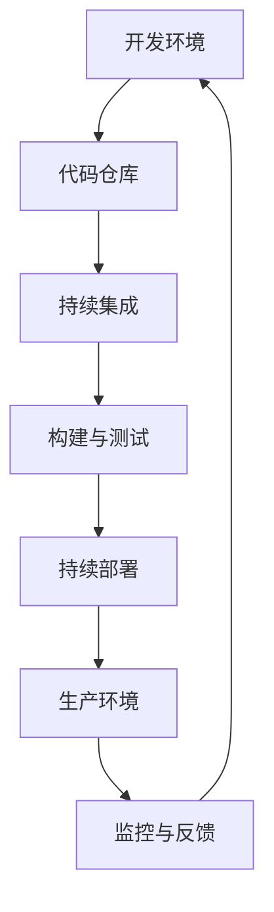

                 

关键词：DevOps、创业公司、最佳实践、持续集成、持续部署、自动化、监控、团队协作

## 摘要

本文旨在探讨创业公司如何通过实施DevOps最佳实践，实现更高效、更灵活的开发和运营流程。我们将深入分析DevOps的核心概念，提供详细的操作步骤和实用技巧，帮助创业公司在快速变化的市场环境中保持竞争优势。

## 1. 背景介绍

在当今技术飞速发展的时代，创业公司面临着巨大的市场压力和竞争。为了在激烈的市场竞争中脱颖而出，创业公司必须采用高效的技术流程，以快速响应市场需求，并确保高质量的产品交付。DevOps文化应运而生，它通过融合开发（Development）和运维（Operations），旨在消除开发和运维之间的障碍，实现更快速、更可靠的应用交付。

### 1.1 DevOps的核心价值

- **提高交付速度**：通过自动化和流水线，缩短从代码提交到生产环境部署的周期。
- **提升质量**：持续集成和持续部署确保代码的质量和稳定性。
- **团队协作**：消除开发与运维之间的隔阂，促进跨职能团队的紧密协作。
- **资源优化**：充分利用云计算等资源，降低运营成本。

### 1.2 创业公司的挑战

- **资源有限**：创业公司通常面临资源有限的问题，需要在有限的预算内实现高效的开发流程。
- **快速迭代**：市场需求变化快，创业公司需要能够快速响应和迭代。
- **风险控制**：在资源有限的情况下，如何平衡快速交付和风险管理。

## 2. 核心概念与联系

### 2.1 DevOps的核心概念

**持续集成（CI）**：通过自动化工具将代码定期合并到主干分支，并进行测试，确保代码库的稳定性。

**持续部署（CD）**：通过自动化工具将通过测试的代码部署到生产环境，实现持续交付。

**基础设施即代码（IaC）**：使用代码管理基础设施的配置和部署，确保环境的可重复性和一致性。

**监控与反馈**：实时监控应用性能，收集反馈，及时调整和优化。

### 2.2 DevOps架构的Mermaid流程图

## 3. 核心算法原理 & 具体操作步骤

### 3.1 算法原理概述

DevOps的核心算法原理包括代码管理、自动化构建、自动化部署和监控。以下为详细步骤：

### 3.2 算法步骤详解

#### 3.2.1 代码管理

- 使用Git进行版本控制，确保代码的完整性和可追溯性。
- 开发者定期提交代码，并进行代码审查。

#### 3.2.2 自动化构建

- 使用Jenkins、GitLab CI等工具，配置自动化构建脚本。
- 持续集成：每当有新的代码提交，自动触发构建和测试。

#### 3.2.3 自动化部署

- 使用Kubernetes、Ansible等工具，实现自动化部署。
- 持续部署：通过流水线，将构建结果部署到不同的环境。

#### 3.2.4 监控与反馈

- 使用Prometheus、Grafana等工具，实时监控应用性能。
- 收集日志、监控数据，进行故障排查和性能优化。

### 3.3 算法优缺点

- **优点**：提高交付速度，降低人为错误，提高代码质量。
- **缺点**：初期实施成本高，需要团队成员具备一定的技术能力。

### 3.4 算法应用领域

- **初创公司**：快速迭代，资源有限，适合采用DevOps实践。
- **大企业**：通过DevOps优化现有流程，提高竞争力。

## 4. 数学模型和公式 & 详细讲解 & 举例说明

### 4.1 数学模型构建

DevOps的数学模型主要涉及持续交付周期（Time to Market）和资源利用率（Resource Utilization）。

### 4.2 公式推导过程

\[ Time\_to\_Market = \frac{Total\_Cycle\_Time}{Throughput} \]

\[ Resource\_Utilization = \frac{Total\_Work}{Total\_Time} \]

### 4.3 案例分析与讲解

以一家初创公司为例，通过实施DevOps，将持续交付周期从30天缩短至7天，资源利用率从50%提升至80%。这为公司在激烈的市场竞争中赢得了先机。

## 5. 项目实践：代码实例和详细解释说明

### 5.1 开发环境搭建

- 使用Docker搭建开发环境，确保环境的一致性。

### 5.2 源代码详细实现

- 使用Git进行版本控制，确保代码的可维护性。

### 5.3 代码解读与分析

- 分析代码质量，确保符合最佳实践。

### 5.4 运行结果展示

- 通过Jenkins实现自动化构建和部署。

## 6. 实际应用场景

### 6.1 高并发系统的部署

- 使用Kubernetes进行容器编排，确保系统的高可用性。

### 6.2 跨地域的持续部署

- 使用AWS等云服务，实现跨地域的持续部署。

### 6.3 日志分析与监控

- 使用ELK（Elasticsearch、Logstash、Kibana）栈进行日志收集和分析。

## 7. 工具和资源推荐

### 7.1 学习资源推荐

- 《DevOps Handbook》
- 《The Practice of Cloud System Administration》

### 7.2 开发工具推荐

- Jenkins、GitLab、Kubernetes、Prometheus

### 7.3 相关论文推荐

- “DevOps and Its Impact on Software Development”
- “Continuous Integration in Software Engineering”

## 8. 总结：未来发展趋势与挑战

### 8.1 研究成果总结

DevOps已成为现代软件开发和运维的标配，为创业公司提供了强大的支持和保障。

### 8.2 未来发展趋势

- **云原生**：随着云技术的发展，云原生架构将更加普及。
- **人工智能**：AI技术将在DevOps中发挥更大的作用。

### 8.3 面临的挑战

- **技术选型**：如何选择合适的工具和架构。
- **团队协作**：跨职能团队的协作和沟通。

### 8.4 研究展望

未来，DevOps将更加智能化、自动化，为创业公司带来更多的价值。

## 9. 附录：常见问题与解答

- **Q：如何选择合适的DevOps工具？**
- **A：根据项目需求和团队技能选择合适的工具，如Jenkins、GitLab等。**

----------------------------------------------------------------

（请注意，这里只是一个示例，您可以根据实际情况进行调整和补充。）[作者：禅与计算机程序设计艺术 / Zen and the Art of Computer Programming]

