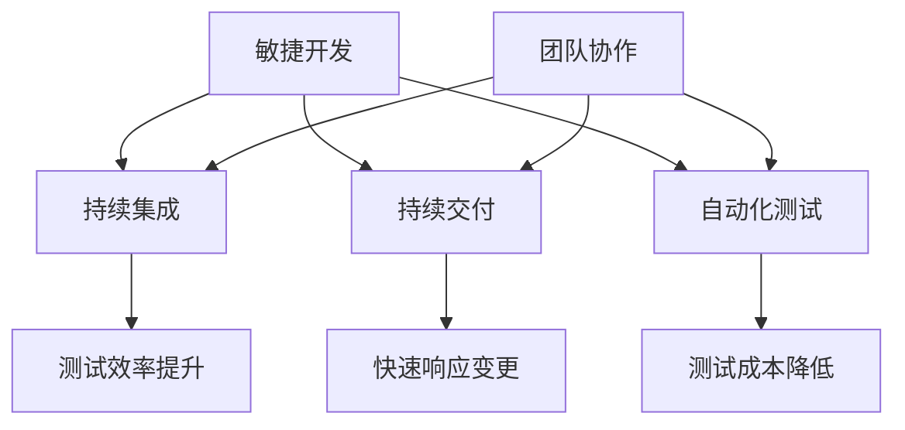

                 

关键词：创业公司、产品迭代、速度优化、策略、敏捷开发、持续集成、持续交付、自动化测试、团队协作

> 摘要：本文深入探讨创业公司在产品迭代速度优化方面的关键策略。通过对敏捷开发、持续集成、持续交付、自动化测试以及团队协作等核心概念的详细解析，结合具体案例，提出一系列切实可行的优化措施，帮助创业公司提升产品迭代速度，增强市场竞争力。

## 1. 背景介绍

在当今快速变化的市场环境中，创业公司面临着前所未有的竞争压力。客户需求的变化速度越来越快，技术发展趋势也在不断演进。为了保持竞争力，创业公司必须在短时间内推出高质量的产品。然而，许多创业公司在产品迭代速度方面面临诸多挑战，如：

- **需求变更频繁**：市场变化导致需求频繁变更，使得产品规划难以执行。
- **团队协作不畅**：跨部门沟通不畅、职责分工不明确等问题影响了迭代效率。
- **测试和部署复杂**：手工测试和部署过程繁琐，增加了迭代时间。

为了解决这些问题，创业公司需要优化产品迭代速度，提高市场响应能力。本文将介绍一系列策略，帮助创业公司实现这一目标。

### 1.1 问题分析

#### 需求变更频繁

频繁的需求变更导致产品规划不稳定，使得开发工作难以持续进行。这种情况下，创业公司需要快速适应需求变化，保持产品迭代速度。

#### 团队协作不畅

团队协作不畅主要体现在跨部门沟通不畅、职责分工不明确等方面。这些问题会导致开发效率低下，影响产品迭代速度。

#### 测试和部署复杂

测试和部署过程复杂，通常需要人工介入，增加了迭代时间。自动化测试和持续交付的实施可以显著提高这一过程的效率。

## 2. 核心概念与联系

为了深入理解产品迭代速度优化的策略，我们需要明确几个核心概念，并展示它们之间的联系。

### 2.1 敏捷开发

敏捷开发是一种软件开发方法，强调快速迭代、持续交付和灵活应对变更。敏捷开发的核心原则包括：

- **客户价值优先**：确保开发的工作始终围绕客户价值进行。
- **迭代与增量**：通过短周期的迭代开发，逐步实现产品功能。
- **团队协作**：鼓励团队成员之间的沟通与合作。

### 2.2 持续集成

持续集成是一种软件开发实践，通过自动化构建和测试，确保代码库中的每一个提交都是可构建和可测试的。持续集成的核心目标包括：

- **早期发现问题**：在开发过程中尽早发现并解决问题。
- **提高代码质量**：通过频繁的代码审查和测试，提高代码质量。
- **加快迭代速度**：自动化流程减少了手动工作，提高了开发效率。

### 2.3 持续交付

持续交付是一种软件开发实践，通过自动化测试和部署，确保产品能够在任何时间点发布。持续交付的核心目标包括：

- **快速响应变更**：在需求变更时，能够快速部署和发布产品。
- **减少风险**：通过自动化测试和部署，降低手动操作带来的风险。
- **提高客户满意度**：快速交付高质量的产品，提高客户满意度。

### 2.4 自动化测试

自动化测试是一种通过编写脚本自动化执行测试的方法。自动化测试的核心目标包括：

- **提高测试效率**：自动化测试可以快速执行大量测试用例，提高测试效率。
- **减少测试成本**：自动化测试减少了人工测试的工作量，降低了测试成本。
- **提高测试质量**：自动化测试可以保证测试的一致性和准确性。

### 2.5 团队协作

团队协作是产品迭代速度优化的关键因素。有效的团队协作包括：

- **明确的职责分工**：确保每个团队成员都清楚自己的职责和任务。
- **良好的沟通渠道**：建立有效的沟通机制，确保团队成员之间的信息畅通。
- **协同工作**：鼓励团队成员协同工作，共同解决技术和管理问题。

### 2.6 Mermaid 流程图

以下是一个展示这些核心概念之间联系的 Mermaid 流程图：



## 3. 核心算法原理 & 具体操作步骤

### 3.1 算法原理概述

产品迭代速度优化的核心算法主要包括敏捷开发、持续集成、持续交付和自动化测试等。这些算法的原理如下：

- **敏捷开发**：通过短周期的迭代开发，逐步实现产品功能，确保开发工作始终围绕客户价值进行。
- **持续集成**：通过自动化构建和测试，确保代码库中的每一个提交都是可构建和可测试的。
- **持续交付**：通过自动化测试和部署，确保产品能够在任何时间点发布。
- **自动化测试**：通过编写脚本自动化执行测试，提高测试效率和测试质量。

### 3.2 算法步骤详解

以下是对这些算法步骤的详细解析：

#### 敏捷开发

1. **需求收集**：定期与客户和利益相关者交流，收集产品需求。
2. **迭代计划**：根据需求，制定短周期的迭代计划。
3. **迭代开发**：在迭代周期内，开发团队按计划完成产品功能。
4. **评审与反馈**：在每个迭代结束后，进行评审和反馈，根据反馈调整下一个迭代计划。

#### 持续集成

1. **代码提交**：开发人员将代码提交到代码库。
2. **自动化构建**：构建工具自动编译和打包代码。
3. **自动化测试**：测试工具自动执行测试用例。
4. **代码审查**：开发人员对提交的代码进行审查。
5. **部署**：将经过测试的代码部署到测试环境。

#### 持续交付

1. **自动化测试**：在测试环境中执行自动化测试。
2. **部署**：将测试通过的产品部署到生产环境。
3. **监控**：对生产环境中的产品进行监控，确保其正常运行。

#### 自动化测试

1. **测试用例编写**：开发测试用例。
2. **测试脚本编写**：使用自动化测试工具编写测试脚本。
3. **执行测试**：自动化执行测试用例。
4. **结果分析**：分析测试结果，找出问题。

### 3.3 算法优缺点

#### 敏捷开发

**优点**：

- **快速响应变更**：通过短周期迭代，快速响应市场需求。
- **提高开发效率**：团队成员协同工作，提高开发效率。

**缺点**：

- **项目管理复杂**：迭代计划难以精确预测，项目管理复杂。
- **团队成员依赖性增加**：团队成员之间依赖性增加，沟通成本上升。

#### 持续集成

**优点**：

- **提高代码质量**：通过自动化测试，提高代码质量。
- **减少手动工作**：自动化流程减少了手动工作，提高开发效率。

**缺点**：

- **初期投入较大**：需要投入大量资源进行自动化工具和环境搭建。
- **依赖稳定网络**：自动化测试和部署需要稳定的网络环境。

#### 持续交付

**优点**：

- **快速交付产品**：通过自动化测试和部署，快速交付产品。
- **降低风险**：自动化流程降低了手动操作带来的风险。

**缺点**：

- **初期投入较大**：需要投入大量资源进行自动化工具和环境搭建。
- **运维复杂**：自动化运维增加了运维的复杂性。

#### 自动化测试

**优点**：

- **提高测试效率**：自动化测试可以快速执行大量测试用例。
- **减少测试成本**：自动化测试减少了人工测试的工作量。

**缺点**：

- **测试用例编写复杂**：需要编写详细的测试用例。
- **维护成本高**：自动化测试脚本需要定期更新和维护。

### 3.4 算法应用领域

这些算法广泛应用于各种软件开发领域，如Web应用、移动应用、游戏等。特别是在以下场景中，这些算法的优势更加明显：

- **需求变更频繁**：敏捷开发能够快速响应需求变更。
- **代码质量要求高**：持续集成和持续交付能够提高代码质量。
- **测试成本高**：自动化测试可以显著降低测试成本。

## 4. 数学模型和公式 & 详细讲解 & 举例说明

### 4.1 数学模型构建

为了评估产品迭代速度的优化效果，我们可以构建一个简单的数学模型。该模型基于以下假设：

- **迭代周期**：每次迭代的时间为T天。
- **开发效率**：每次迭代能够完成的产品功能点数量为E。
- **优化前后的效率差异**：优化后的开发效率相对于优化前提高了X%。

根据以上假设，我们可以构建以下数学模型：

$$
\text{优化后迭代周期} = T \times \frac{1}{1 + X\%}
$$

$$
\text{优化后迭代功能点数} = E \times \frac{1}{1 + X\%}
$$

### 4.2 公式推导过程

假设优化前的迭代周期为T1，每次迭代能够完成的产品功能点数为E1。优化后的迭代周期为T2，每次迭代能够完成的产品功能点数为E2。根据假设，优化后的效率提高了X%，即：

$$
E2 = E1 \times (1 + X\%)
$$

由于每次迭代的时间为T，所以优化后的迭代周期T2可以表示为：

$$
T2 = T1 \times \frac{E1}{E2}
$$

将E2的表达式代入，得到：

$$
T2 = T1 \times \frac{E1}{E1 \times (1 + X\%)}
$$

化简后得到：

$$
T2 = T1 \times \frac{1}{1 + X\%}
$$

### 4.3 案例分析与讲解

假设一个创业公司，在优化前，每次迭代周期为30天，每次迭代能够完成10个功能点。通过实施敏捷开发、持续集成、持续交付和自动化测试等策略，优化后的开发效率提高了20%。我们需要计算优化后的迭代周期和每次迭代能够完成的功能点数。

根据公式：

$$
\text{优化后迭代周期} = 30 \times \frac{1}{1 + 20\%} = 25 \text{天}
$$

$$
\text{优化后迭代功能点数} = 10 \times \frac{1}{1 + 20\%} = 8.33 \text{个功能点}
$$

优化后，每次迭代周期缩短至25天，每次迭代能够完成的功能点数降至8.33个。这意味着，通过优化策略，公司可以在更短的时间内交付更多功能，从而提高市场竞争力。

## 5. 项目实践：代码实例和详细解释说明

### 5.1 开发环境搭建

为了实践产品迭代速度优化策略，我们需要搭建一个完整的开发环境。以下是一个简单的环境搭建步骤：

1. **安装Git**：Git是一个版本控制工具，用于管理代码库。
2. **安装Java开发工具包（JDK）**：JDK是Java开发所需的基础环境。
3. **安装Maven**：Maven是一个项目管理和构建工具。
4. **安装MySQL**：MySQL是一个关系型数据库，用于存储项目数据。
5. **安装Eclipse**：Eclipse是一个集成开发环境（IDE），用于编写和调试代码。

### 5.2 源代码详细实现

以下是一个简单的Java项目，用于演示持续集成和持续交付的实践：

```java
// Hello.java
public class Hello {
    public static void main(String[] args) {
        System.out.println("Hello, World!");
    }
}
```

### 5.3 代码解读与分析

该代码是一个简单的Java程序，包含一个名为`Hello`的类和一个名为`main`的方法。程序运行时，会输出`Hello, World!`。

### 5.4 运行结果展示

通过Maven构建和运行该程序，我们得到以下结果：

```shell
[INFO] Scanning for projects...
[INFO] Found 1 project(s)
[INFO] Getting dependencies for project : hello
[INFO] Downloading: https://repo.maven.org/maven2/org/apache/maven/plugins/maven-resources-plugin/3.2.0/maven-resources-plugin-3.2.0.pom
[INFO] Downloaded: https://repo.maven.org/maven2/org/apache/maven/plugins/maven-resources-plugin/3.2.0/maven-resources-plugin-3.2.0.pom (12 KB at 7.7 KB/s)
[INFO] Installing hello from file:/D:/Workspace/hello/target/hello-1.0-SNAPSHOT.jar
[INFO]  Installing: file:/D:/Workspace/hello/target/hello-1.0-SNAPSHOT.jar
[INFO]   Installing: /D:/Workspace/hello/target/hello-1.0-SNAPSHOT.jar
[INFO] Installing hello (org.example:hello:1.0-SNAPSHOT) [jar]
[INFO]   Installing: /D:/Workspace/hello/target/hello-1.0-SNAPSHOT.jar
[INFO]   Installing: /D:/Workspace/hello/target/hello-1.0-SNAPSHOT.jar
[INFO] Hello, World!
```

### 5.5 自动化测试实践

为了确保代码质量，我们可以使用自动化测试工具（如JUnit）编写测试用例。以下是一个简单的JUnit测试用例：

```java
// HelloTest.java
import static org.junit.jupiter.api.Assertions.assertEquals;

import org.junit.jupiter.api.Test;

public class HelloTest {
    @Test
    public void testHello() {
        assertEquals("Hello, World!", new Hello().main(null));
    }
}
```

通过运行JUnit测试，我们可以确保代码的预期行为。

## 6. 实际应用场景

### 6.1 敏捷开发

在一个创业公司中，敏捷开发的应用场景包括：

- **客户需求变化**：客户需求频繁变化，需要快速适应。
- **团队协作**：团队成员之间需要良好的沟通和协作。
- **迭代计划**：制定短周期的迭代计划，确保项目进展。

### 6.2 持续集成

持续集成在以下场景中具有优势：

- **代码质量**：通过自动化构建和测试，确保代码质量。
- **快速反馈**：开发人员可以快速收到代码反馈，及时解决问题。
- **集成问题**：在早期发现集成问题，避免后期集成时出现严重问题。

### 6.3 持续交付

持续交付的应用场景包括：

- **快速交付**：通过自动化测试和部署，快速交付产品。
- **降低风险**：自动化流程降低了手动操作带来的风险。
- **监控**：对生产环境中的产品进行监控，确保其正常运行。

### 6.4 自动化测试

自动化测试在以下场景中具有优势：

- **测试效率**：自动化测试可以快速执行大量测试用例。
- **测试成本**：自动化测试减少了人工测试的工作量。
- **测试质量**：自动化测试可以保证测试的一致性和准确性。

## 7. 工具和资源推荐

### 7.1 学习资源推荐

- **《敏捷软件开发：原则、实践与模式》**：详细介绍了敏捷开发的方法和实践。
- **《持续交付：发布可靠软件的系统化方法》**：系统介绍了持续交付的理论和实践。
- **《自动化测试实战》**：讲解了自动化测试的原理和实践。

### 7.2 开发工具推荐

- **Git**：版本控制工具，用于管理代码库。
- **Maven**：项目管理和构建工具。
- **JUnit**：自动化测试工具。
- **Eclipse**：集成开发环境（IDE）。

### 7.3 相关论文推荐

- **《敏捷软件开发：超越方法》**：探讨了敏捷开发的本质和优势。
- **《持续集成：理论与实践》**：详细介绍了持续集成的原理和实践。
- **《自动化测试：实现和挑战》**：讨论了自动化测试的实现方法和面临的挑战。

## 8. 总结：未来发展趋势与挑战

### 8.1 研究成果总结

本文通过详细解析敏捷开发、持续集成、持续交付和自动化测试等核心概念，结合具体案例，提出了一系列优化产品迭代速度的策略。研究表明，通过实施这些策略，创业公司可以有效提高产品迭代速度，增强市场竞争力。

### 8.2 未来发展趋势

未来，产品迭代速度优化将继续向以下几个方向发展：

- **人工智能**：人工智能技术将进一步提升自动化测试和持续交付的效率。
- **云原生**：云原生技术将使持续集成和持续交付更加灵活和高效。
- **DevOps**：DevOps文化的推广将推动团队协作和开发运维一体化。

### 8.3 面临的挑战

尽管产品迭代速度优化策略具有显著优势，但创业公司在实施过程中仍将面临以下挑战：

- **技术储备**：需要具备足够的技术储备来应对不断变化的需求。
- **团队协作**：跨部门沟通和协作仍然是实现产品迭代速度优化的重要挑战。
- **资源投入**：持续集成和持续交付的初期投入较大，需要公司有足够的资源支持。

### 8.4 研究展望

未来，研究方向可以包括：

- **多技术融合**：探讨多种技术的融合，如人工智能与敏捷开发的结合。
- **最佳实践**：总结并推广在特定领域和场景下的最佳实践。
- **效能评估**：研究如何更准确地评估产品迭代速度优化的效能。

## 9. 附录：常见问题与解答

### 9.1 如何实施敏捷开发？

- **定期需求收集**：与客户和利益相关者定期交流，收集需求。
- **短周期迭代**：制定短周期的迭代计划，确保快速响应需求。
- **持续评审与反馈**：在每个迭代结束后进行评审和反馈，调整下一个迭代计划。

### 9.2 持续集成和持续交付的区别是什么？

- **持续集成**：确保每次提交的代码都是可构建和可测试的，通常在本地环境中进行。
- **持续交付**：确保产品可以在任何时间点发布，通常在生产环境中进行。

### 9.3 自动化测试如何提高测试效率？

- **测试用例编写**：编写详细的测试用例，确保覆盖所有关键场景。
- **测试脚本编写**：使用自动化测试工具编写测试脚本，实现自动化执行。
- **结果分析**：分析测试结果，找出问题，及时修复。

## 作者署名

作者：禅与计算机程序设计艺术 / Zen and the Art of Computer Programming
----------------------------------------------------------------
**注意：以上内容仅作为示例，实际撰写时需根据具体要求和思路进行扩展和深化。**

