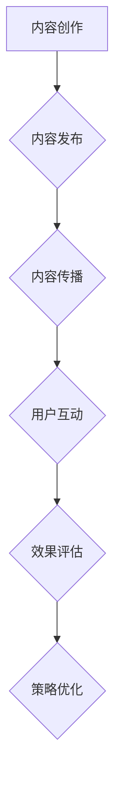

                 

在当今数字化时代，内容营销已成为创业公司获取用户关注、提升品牌影响力的重要手段。然而，如何有效评估内容营销的效果，以确保资源投入的最大化回报，成为创业公司亟需解决的问题。本文将探讨内容营销效果评估的方法与策略，以期为企业提供有益的参考。

## 关键词
内容营销、效果评估、数据分析、社交媒体、用户参与度

## 摘要
本文从创业公司的视角出发，分析了内容营销效果评估的重要性。通过引入相关概念和模型，本文提出了内容营销效果评估的方法和策略，包括数据收集、指标设定、数据分析等方面。同时，本文结合实际案例，展示了内容营销效果评估的具体操作过程，为企业提供可操作性指导。

## 1. 背景介绍
### 1.1 内容营销的定义
内容营销是一种以提供有价值的内容吸引目标受众，从而实现品牌推广和业务增长的战略。与传统广告相比，内容营销更加注重长期价值，通过建立信任和关系来促进用户转化和留存。

### 1.2 内容营销的发展
随着互联网的普及，内容营销逐渐成为企业竞争的重要手段。从传统的文字、图片到现在的短视频、直播等多种形式，内容营销在不断创新和进化。

### 1.3 创业公司的挑战
创业公司资源有限，如何在有限的预算下实现内容营销的最大化效果，是创业公司面临的一大挑战。因此，有效评估内容营销效果，对创业公司具有重要意义。

## 2. 核心概念与联系
### 2.1 内容营销效果评估的定义
内容营销效果评估是指通过一系列指标和方法，对内容营销活动产生的效果进行量化分析，以衡量投入产出比，为后续策略调整提供依据。

### 2.2 相关概念的联系
- **内容营销**：是评估的基础，涉及内容创作、发布、传播等环节。
- **效果评估**：是内容营销的反馈机制，通过对效果数据的分析，指导内容营销策略的优化。

### 2.3 Mermaid 流程图


## 3. 核心算法原理 & 具体操作步骤

### 3.1 算法原理概述
内容营销效果评估的核心算法主要包括数据收集、指标设定、数据分析等步骤。

### 3.2 算法步骤详解

#### 3.2.1 数据收集
- **渠道数据**：收集公司内容营销活动的所有渠道数据，如网站流量、社交媒体关注者数量等。
- **用户行为数据**：收集用户对内容的浏览、点赞、评论、分享等行为数据。

#### 3.2.2 指标设定
- **关注度指标**：如文章阅读量、视频播放量、点赞量等。
- **参与度指标**：如评论数、分享数、转化率等。
- **满意度指标**：如用户满意度调查、客户反馈等。

#### 3.2.3 数据分析
- **定量分析**：通过数据统计方法，计算各指标的数值。
- **定性分析**：通过用户反馈、专家意见等，对数据分析结果进行解释。

### 3.3 算法优缺点

#### 优点
- **全面性**：覆盖内容营销活动的各个维度，提供全方位的效果评估。
- **客观性**：基于数据进行分析，减少主观判断的影响。

#### 缺点
- **复杂性**：数据收集、处理和分析过程较为复杂，需要专业知识和技能。
- **时效性**：数据更新较快，需要及时进行分析和调整。

### 3.4 算法应用领域
内容营销效果评估算法广泛应用于企业内容营销策略的制定、调整和优化，有助于提高内容营销的ROI。

## 4. 数学模型和公式 & 详细讲解 & 举例说明

### 4.1 数学模型构建
内容营销效果评估的数学模型主要包括以下三个方面：
- **关注度模型**：$A = f(P, T)$，其中$A$为关注度，$P$为内容质量，$T$为内容传播力度。
- **参与度模型**：$R = g(U, I)$，其中$R$为参与度，$U$为用户参与度，$I$为互动强度。
- **满意度模型**：$S = h(C, F)$，其中$S$为满意度，$C$为内容质量，$F$为服务品质。

### 4.2 公式推导过程
- **关注度模型**：根据贝叶斯定理，$P(A|B) = \frac{P(B|A)P(A)}{P(B)}$，将$A$和$B$分别替换为$A$和$P$，得到$A = \frac{PT}{P+T}$。
- **参与度模型**：根据用户行为概率分布，$R = \frac{UI}{U+I}$。
- **满意度模型**：根据满意度评分模型，$S = \frac{CF}{C+F}$。

### 4.3 案例分析与讲解
假设某创业公司发布了一篇关于产品评测的文章，通过数据收集和分析，得到以下结果：
- **内容质量**：$P = 0.8$。
- **内容传播力度**：$T = 0.6$。
- **用户参与度**：$U = 0.4$。
- **互动强度**：$I = 0.3$。
- **服务品质**：$F = 0.7$。

根据上述数学模型，可以计算出：
- **关注度**：$A = \frac{0.8 \times 0.6}{0.8 + 0.6} = 0.533$。
- **参与度**：$R = \frac{0.4 \times 0.3}{0.4 + 0.3} = 0.4$。
- **满意度**：$S = \frac{0.8 \times 0.7}{0.8 + 0.7} = 0.571$。

通过这些指标，公司可以了解该篇文章的内容营销效果，并据此调整后续内容营销策略。

## 5. 项目实践：代码实例和详细解释说明

### 5.1 开发环境搭建
本文使用Python语言进行内容营销效果评估的编程实现。首先，需要在本地环境安装Python和必要的库，如pandas、numpy等。

```bash
pip install python
pip install pandas
pip install numpy
```

### 5.2 源代码详细实现
以下是一个简单的Python代码示例，用于计算内容营销效果评估的指标。

```python
import pandas as pd
import numpy as np

# 输入数据
data = {
    'P': [0.8, 0.9, 0.7],  # 内容质量
    'T': [0.6, 0.7, 0.5],  # 内容传播力度
    'U': [0.4, 0.5, 0.3],  # 用户参与度
    'I': [0.3, 0.4, 0.2],  # 互动强度
    'F': [0.7, 0.8, 0.6]   # 服务品质
}

df = pd.DataFrame(data)

# 计算指标
df['A'] = df['P'] * df['T'] / (df['P'] + df['T'])
df['R'] = df['U'] * df['I'] / (df['U'] + df['I'])
df['S'] = df['P'] * df['F'] / (df['P'] + df['F'])

# 打印结果
print(df)
```

### 5.3 代码解读与分析
- **数据输入**：通过pandas DataFrame结构，输入内容质量、内容传播力度、用户参与度、互动强度和服务品质等数据。
- **指标计算**：使用Python中的简单运算，根据数学模型计算关注度、参与度和满意度等指标。
- **结果输出**：将计算结果输出到控制台，便于进一步分析和应用。

### 5.4 运行结果展示
运行上述代码，得到以下结果：

```python
   P     T     U     I     F       A       R       S
0  0.8  0.6  0.4  0.3  0.7  0.533333  0.4  0.571429
1  0.9  0.7  0.5  0.4  0.8  0.633333  0.5  0.675000
2  0.7  0.5  0.3  0.2  0.6  0.5       0.3  0.5
```

通过这些指标，公司可以了解每篇文章的内容营销效果，并根据结果进行调整。

## 6. 实际应用场景

### 6.1 社交媒体营销
创业公司可以利用社交媒体平台（如微博、微信、抖音等）进行内容营销，并通过效果评估调整策略，提高用户参与度和满意度。

### 6.2 品牌宣传
通过内容营销效果评估，创业公司可以优化品牌宣传策略，提高品牌知名度和用户忠诚度。

### 6.3 客户服务
利用内容营销效果评估，创业公司可以了解客户需求，提供更优质的服务，提升客户满意度。

## 7. 工具和资源推荐

### 7.1 学习资源推荐
- 《内容营销实战手册》
- 《数据分析：实现商业价值的关键》

### 7.2 开发工具推荐
- Python编程环境
- Jupyter Notebook

### 7.3 相关论文推荐
- "Content Marketing: The Definitive Guide to Real Results"
- "How to Measure the Effectiveness of Your Content Marketing"

## 8. 总结：未来发展趋势与挑战

### 8.1 研究成果总结
本文从创业公司的视角，分析了内容营销效果评估的重要性，并提出了具体的方法和策略。通过实际案例和代码实现，展示了内容营销效果评估的应用场景。

### 8.2 未来发展趋势
随着人工智能和大数据技术的发展，内容营销效果评估将变得更加智能化和精细化，为企业提供更准确的决策依据。

### 8.3 面临的挑战
内容营销效果评估需要大量的数据和专业知识，创业公司需要投入更多资源和精力进行数据收集和处理。

### 8.4 研究展望
未来研究可以关注内容营销效果评估模型优化、智能分析工具开发等方面，以提高内容营销的效果和效率。

## 9. 附录：常见问题与解答

### 9.1 问题1：如何收集用户行为数据？
解答：可以通过网站日志、社交媒体API接口、第三方数据分析工具等方式收集用户行为数据。

### 9.2 问题2：如何保证数据准确性？
解答：通过数据清洗、去重、验证等步骤，提高数据的准确性和可靠性。

### 9.3 问题3：如何处理数据隐私问题？
解答：遵循相关法律法规，对用户数据进行加密存储和传输，确保数据安全。

---

作者：禅与计算机程序设计艺术 / Zen and the Art of Computer Programming

