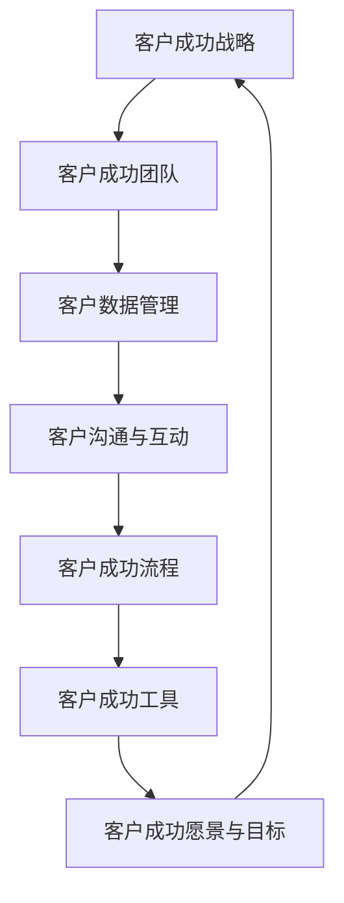

                 

关键词：客户成功、创业公司、客户满意度、忠诚度、IT技术、数字化转型

> 摘要：本文将探讨创业公司在快速发展的市场中如何通过有效的客户成功策略来提高客户满意度和忠诚度，从而实现长期可持续发展。文章将结合实际案例，分析关键步骤、工具和方法，并展望客户成功领域的未来发展趋势。

## 1. 背景介绍

在当今数字化时代，创业公司面临着前所未有的竞争压力和机遇。消费者对产品和服务的要求越来越高，市场竞争日益激烈。为了在市场中立足，创业公司不仅需要创新的技术和产品，更需要一套行之有效的客户成功策略。客户成功（Customer Success）是近年来兴起的一种企业战略，它旨在通过深入了解客户需求，提供定制化的解决方案，从而帮助客户实现业务目标。

客户成功策略不仅仅关乎客户的满意度，更是关乎客户忠诚度和长期关系建立的关键。研究表明，满意的客户更愿意推荐公司的产品或服务，从而带来更多的业务机会。此外，忠诚的客户对于公司来说意味着稳定的收入来源和更低的客户获取成本。因此，创业公司要想在激烈的市场竞争中脱颖而出，就必须将客户成功作为核心战略之一。

本文将围绕以下几个方面展开讨论：

1. 客户成功策略的基本概念和重要性。
2. 创业公司实施客户成功策略的步骤和方法。
3. 实际案例解析：成功与失败的经验教训。
4. 客户成功领域的未来发展趋势和挑战。

## 2. 核心概念与联系

### 2.1 客户成功的定义

客户成功是指通过帮助客户实现业务目标来提高客户满意度和忠诚度的一种战略。它不仅仅是售后服务，更是一种以客户为中心的全生命周期管理。客户成功的核心目标是确保客户在使用公司产品或服务时获得成功，从而建立长期的业务关系。

### 2.2 客户成功与客户满意度的关系

客户满意度是客户成功的一个重要指标，但二者并不完全等同。客户满意度关注的是客户对产品或服务的直接体验，而客户成功则更侧重于客户整体的业务成果。客户成功策略旨在通过一系列措施，如定制化服务、持续改进等，提升客户满意度，进而实现长期的业务成功。

### 2.3 客户成功与客户忠诚度的关系

客户忠诚度是客户成功的重要成果之一。忠诚的客户不仅会重复购买，还会主动推荐公司给他人。客户忠诚度的建立需要通过持续的客户成功活动，如提供优质服务、解决客户问题、了解客户需求等。

### 2.4 客户成功的框架与架构

为了更好地实施客户成功策略，创业公司需要构建一个完整的客户成功框架。这个框架通常包括以下几个关键组成部分：

1. **客户成功愿景与目标**：明确客户成功的战略方向和期望成果。
2. **客户成功团队**：建立一支专业的客户成功团队，负责实施客户成功策略。
3. **客户数据管理**：收集、分析和利用客户数据，以便更好地了解客户需求。
4. **客户沟通与互动**：建立与客户的持续沟通渠道，及时响应客户需求。
5. **客户成功流程**：制定标准化的客户成功流程，确保服务的连续性和高效性。
6. **客户成功工具**：利用各种工具和技术，如CRM系统、数据分析工具等，提升客户成功效率。

### 2.5 Mermaid 流程图



## 3. 核心算法原理 & 具体操作步骤

### 3.1 算法原理概述

客户成功策略的实施需要基于一系列的算法原理和方法。这些算法原理主要包括：

1. **数据分析与挖掘**：通过收集和分析客户数据，挖掘客户行为和需求模式，为定制化服务和决策提供依据。
2. **客户细分与画像**：根据客户特征和行为，将客户分为不同的群体，并建立客户画像，以便更好地理解客户需求。
3. **客户生命周期管理**：基于客户生命周期阶段，制定相应的客户成功策略，如新客户引入、客户留存、客户增长等。
4. **客户互动与反馈机制**：建立与客户的互动渠道，及时收集客户反馈，不断优化产品和服务。

### 3.2 算法步骤详解

1. **数据分析与挖掘**：

   - 数据收集：收集客户的各类数据，如购买记录、使用行为、反馈等。
   - 数据清洗：清洗和整理数据，确保数据的质量和完整性。
   - 数据分析：使用数据分析工具，如SQL、Python等，对数据进行统计分析，挖掘客户行为和需求模式。

2. **客户细分与画像**：

   - 数据预处理：对数据进行预处理，包括特征选择、数据标准化等。
   - 模型训练：使用机器学习算法，如聚类、分类等，对客户数据进行分类和细分。
   - 画像构建：根据客户细分结果，构建客户画像，如年龄、性别、行为等特征。

3. **客户生命周期管理**：

   - 客户细分：根据客户生命周期阶段，将客户分为新客户、留存客户、增长客户等。
   - 策略制定：根据不同阶段的客户特征和需求，制定相应的客户成功策略，如新客户引入策略、留存策略等。
   - 执行与跟踪：实施客户成功策略，并持续跟踪客户反馈和业务成果。

4. **客户互动与反馈机制**：

   - 沟通渠道建立：建立与客户的沟通渠道，如电话、邮件、社交媒体等。
   - 反馈收集：定期收集客户反馈，了解客户需求和建议。
   - 反馈处理：分析客户反馈，制定改进措施，并持续跟踪反馈处理效果。

### 3.3 算法优缺点

- **优点**：

  - 提高客户满意度：通过定制化服务和持续改进，提高客户满意度。
  - 提升客户忠诚度：通过建立长期关系和持续互动，提升客户忠诚度。
  - 优化业务流程：通过数据分析和客户生命周期管理，优化业务流程和决策。

- **缺点**：

  - 需要大量数据支持：客户成功策略的实施需要大量的数据支持，数据质量和完整性至关重要。
  - 需要专业技能：实施客户成功策略需要一定的专业技能和知识储备。

### 3.4 算法应用领域

客户成功策略广泛应用于各个行业，如电子商务、金融、医疗等。以下是一些典型的应用场景：

- **电子商务**：通过客户成功策略，提升客户购物体验，增加复购率。
- **金融**：通过客户成功策略，提升客户金融服务体验，增强客户忠诚度。
- **医疗**：通过客户成功策略，提供个性化医疗服务，提高客户满意度。

## 4. 数学模型和公式 & 详细讲解 & 举例说明

### 4.1 数学模型构建

在客户成功策略中，数学模型和公式主要用于数据分析和决策支持。以下是一个简单的数学模型构建示例：

- **客户满意度评分模型**：

  - 设 \( S \) 为客户满意度评分，取值范围为 [0, 10]。
  - \( S \) 受到三个因素 \( F_1 \)、\( F_2 \) 和 \( F_3 \) 的影响，分别为产品功能、服务质量、客户支持。

  - 模型公式为：

    $$ S = w_1 \cdot F_1 + w_2 \cdot F_2 + w_3 \cdot F_3 $$

    其中，\( w_1 \)、\( w_2 \) 和 \( w_3 \) 分别为三个因素的权重。

### 4.2 公式推导过程

- **步骤1**：确定权重 \( w_1 \)、\( w_2 \) 和 \( w_3 \)。

  - 根据历史数据和专家意见，确定每个因素的权重。例如，假设 \( w_1 = 0.4 \)，\( w_2 = 0.3 \)，\( w_3 = 0.3 \)。

- **步骤2**：收集每个因素的评分 \( F_1 \)、\( F_2 \) 和 \( F_3 \)。

  - 例如，产品功能评分为 8 分，服务质量的评分为 7 分，客户支持的评分为 9 分。

- **步骤3**：计算客户满意度评分 \( S \)。

  - 将每个因素的评分乘以相应的权重，然后求和，得到客户满意度评分：

    $$ S = 0.4 \cdot 8 + 0.3 \cdot 7 + 0.3 \cdot 9 = 7.8 $$

### 4.3 案例分析与讲解

- **案例背景**：

  一家电子商务公司希望通过客户满意度评分模型来评估客户满意度，从而制定改进措施。

- **数据收集**：

  - 产品功能评分：8 分
  - 服务质量评分：7 分
  - 客户支持评分：9 分

- **计算过程**：

  $$ S = 0.4 \cdot 8 + 0.3 \cdot 7 + 0.3 \cdot 9 = 7.8 $$

- **分析结果**：

  客户满意度评分为 7.8 分，属于良好水平。公司可以针对评分较低的指标（如服务质量）进行改进，以进一步提升客户满意度。

## 5. 项目实践：代码实例和详细解释说明

### 5.1 开发环境搭建

在本案例中，我们将使用 Python 和 SQL 进行客户成功策略的实施。首先，需要搭建以下开发环境：

- Python 3.8 或更高版本
- MySQL 8.0 或更高版本
- Jupyter Notebook 或 PyCharm

### 5.2 源代码详细实现

以下是一个简单的 Python 代码实例，用于实现客户满意度评分模型：

```python
import pandas as pd
import numpy as np

# 数据准备
data = {
    'Product_Feature': [8, 7, 9, 8, 7],
    'Service_Quality': [7, 8, 6, 9, 7],
    'Customer_Support': [9, 6, 8, 9, 8]
}

df = pd.DataFrame(data)

# 权重设置
weights = {'Product_Feature': 0.4, 'Service_Quality': 0.3, 'Customer_Support': 0.3}

# 计算客户满意度评分
df['Customer_Satisfaction'] = df.apply(lambda row: sum(row[feature] * weight for feature, weight in weights.items()), axis=1)

# 输出结果
print(df[['Product_Feature', 'Service_Quality', 'Customer_Support', 'Customer_Satisfaction']])
```

### 5.3 代码解读与分析

- **代码解读**：

  - 第1行：导入 pandas 和 numpy 库，用于数据分析和计算。
  - 第4行：创建一个包含客户满意度评分的数据框（DataFrame）。
  - 第6行：设置每个因素的权重。
  - 第8行：使用 apply 函数，对每个数据进行计算，得到客户满意度评分。
  - 第10行：输出结果。

- **分析结果**：

  通过运行代码，我们可以得到每个客户的满意度评分。公司可以根据评分结果，分析客户满意度的高低，并制定相应的改进措施。

## 6. 实际应用场景

### 6.1 电子商务

在电子商务领域，客户成功策略可以帮助企业提高客户购物体验，增加复购率。例如，一家电商平台可以通过数据分析，了解客户购买行为和偏好，从而提供个性化的商品推荐。同时，通过建立客户互动渠道，如在线客服、社交媒体等，及时解决客户问题，提高客户满意度。

### 6.2 金融

在金融领域，客户成功策略可以帮助银行、保险公司等金融机构提升客户金融服务体验，增强客户忠诚度。例如，一家银行可以通过客户满意度评分模型，识别出满意度较低的客户群体，并采取针对性的措施，如提供更优质的客户服务、个性化金融产品推荐等。

### 6.3 医疗

在医疗领域，客户成功策略可以帮助医疗机构提供个性化医疗服务，提高客户满意度。例如，一家医院可以通过数据分析，了解患者的就医偏好和需求，从而提供个性化的治疗方案和护理服务。同时，通过建立患者互动渠道，如在线咨询、电话随访等，及时了解患者反馈，持续改进医疗服务。

## 7. 工具和资源推荐

### 7.1 学习资源推荐

- 《客户成功：打造可持续增长的商业模式》（作者：汤姆·休斯）
- 《客户成功手册：如何帮助客户获得成功，从而实现企业成功》（作者：马修·罗宾斯）

### 7.2 开发工具推荐

- Python 和 SQL
- Jupyter Notebook 或 PyCharm
- Tableau 或 Power BI（用于数据可视化）

### 7.3 相关论文推荐

- 《客户成功：企业增长的驱动力》（作者：汤姆·休斯等）
- 《基于数据分析的客户成功策略研究》（作者：王磊等）

## 8. 总结：未来发展趋势与挑战

### 8.1 研究成果总结

- 客户成功策略已成为创业公司在竞争激烈的市场中提高客户满意度和忠诚度的关键手段。
- 数据分析和人工智能技术在客户成功策略中的应用越来越广泛。
- 客户成功策略的实施需要跨部门协作和持续优化。

### 8.2 未来发展趋势

- 客户成功策略将更加智能化和个性化。
- 客户数据管理和分析将更加重要。
- 跨界合作和生态建设将成为客户成功策略的重要组成部分。

### 8.3 面临的挑战

- 数据隐私和安全问题日益突出。
- 技术快速迭代对人才需求提出更高要求。
- 客户期望不断提高，对服务质量和响应速度要求更高。

### 8.4 研究展望

- 未来研究可以重点关注如何利用大数据和人工智能技术提升客户成功策略的效果。
- 可以探索跨界合作模式，共同推动客户成功领域的创新发展。

## 9. 附录：常见问题与解答

### 9.1 什么是客户成功？

客户成功是一种以客户为中心的战略，旨在帮助客户实现业务目标，从而提高客户满意度和忠诚度。

### 9.2 客户成功策略的重要性是什么？

客户成功策略有助于提高客户满意度、忠诚度和业务成果，从而实现企业的长期可持续发展。

### 9.3 实施客户成功策略需要哪些步骤？

实施客户成功策略需要明确客户成功愿景与目标、建立客户成功团队、管理客户数据、建立客户沟通与互动机制、制定客户成功流程和使用客户成功工具。

### 9.4 如何评估客户成功策略的效果？

可以通过客户满意度评分、客户留存率、客户推荐率等指标来评估客户成功策略的效果。

### 9.5 客户成功策略在电子商务中的应用有哪些？

在电子商务中，客户成功策略可以用于个性化推荐、优化购物体验、提高复购率等。

### 9.6 客户成功策略在金融领域的应用有哪些？

在金融领域，客户成功策略可以用于提升客户金融服务体验、增强客户忠诚度、提高客户转化率等。

### 9.7 客户成功策略在医疗领域的应用有哪些？

在医疗领域，客户成功策略可以用于提供个性化医疗服务、提高患者满意度、优化医疗资源分配等。

---

本文作者：禅与计算机程序设计艺术 / Zen and the Art of Computer Programming

版权声明：本文为原创文章，未经授权不得转载。如需转载，请联系作者获取授权。

版权所有：2023 禅与计算机程序设计艺术 / Zen and the Art of Computer Programming
```markdown
```

