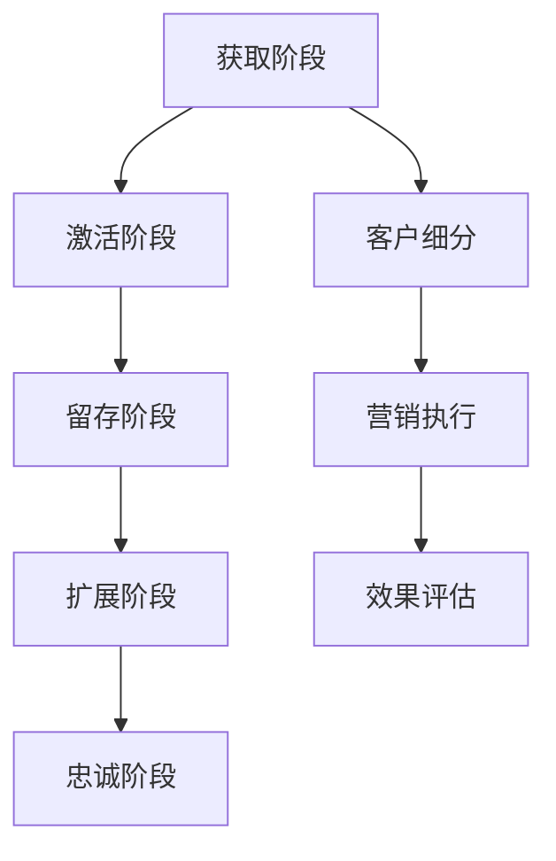

                 

关键词：客户生命周期管理、客户价值最大化、创业公司、营销策略、客户忠诚度、数据分析、客户留存

摘要：在竞争激烈的市场环境中，创业公司需要通过有效的客户生命周期管理策略来提升客户价值，增加客户忠诚度，从而实现可持续发展。本文将探讨客户生命周期管理的核心概念，介绍如何通过数据分析和营销策略来优化客户体验，提升客户满意度，进而实现客户价值的最大化。

## 1. 背景介绍

随着互联网技术的发展和消费者需求的变化，市场竞争日益激烈。创业公司要想在市场中立足，必须找到有效的客户管理策略。客户生命周期管理（Customer Lifecycle Management，简称CLM）作为一项系统性的工作，旨在通过跟踪客户从获取到留存的全过程，实现客户价值的最大化。

客户生命周期管理涉及多个方面，包括客户获取（Acquisition）、客户留存（Retention）、客户扩展（Expansion）和客户忠诚度（Loyalty）。通过分析客户在不同生命周期阶段的行为数据，创业公司可以制定有针对性的营销策略，提高客户满意度，增加客户忠诚度，从而实现长期盈利。

## 2. 核心概念与联系

### 2.1 客户生命周期概念

客户生命周期是指客户与公司之间的互动过程，从首次接触、购买、使用、反馈到最终离开。一个典型的客户生命周期包括以下几个阶段：

1. **获取阶段（Acquisition）**：通过各种渠道吸引潜在客户，提高品牌知名度和市场占有率。
2. **激活阶段（Activation）**：确保新客户能够顺利使用产品或服务，提高客户满意度和留存率。
3. **留存阶段（Retention）**：通过持续的服务和互动，保持客户的长期忠诚度。
4. **扩展阶段（Expansion）**：通过增加客户的购买频率和购买量，提高客户价值。
5. **忠诚阶段（Loyalty）**：建立深度信任，培养品牌忠诚度，提高客户转介绍率。

### 2.2 客户生命周期管理框架

客户生命周期管理的框架可以分为以下几个方面：

1. **数据收集**：通过网站、应用程序、社交媒体等渠道收集客户行为数据。
2. **数据分析**：运用数据分析工具，对客户行为数据进行分析，识别客户特征、偏好和需求。
3. **客户细分**：根据分析结果，将客户分为不同的群体，制定有针对性的营销策略。
4. **营销执行**：实施个性化营销活动，提高客户满意度和忠诚度。
5. **效果评估**：评估营销活动的效果，调整策略以优化客户生命周期管理。

### 2.3 Mermaid 流程图



## 3. 核心算法原理 & 具体操作步骤

### 3.1 算法原理概述

客户生命周期管理涉及多种算法，主要包括：

1. **客户细分算法**：通过聚类、分类等方法，将客户分为不同的群体。
2. **客户行为预测算法**：利用机器学习算法，预测客户的行为和需求。
3. **营销策略优化算法**：通过优化算法，确定最佳的营销策略和渠道。

### 3.2 算法步骤详解

1. **数据预处理**：清洗和整理客户行为数据，为后续分析做好准备。
2. **客户细分**：根据数据特征，使用聚类算法（如K-means）将客户分为不同的群体。
3. **行为预测**：利用机器学习算法（如决策树、神经网络），预测客户的行为和需求。
4. **营销策略优化**：根据客户细分和行为预测结果，优化营销策略，提高客户满意度。
5. **效果评估**：通过A/B测试等方法，评估营销策略的效果，持续优化。

### 3.3 算法优缺点

1. **优点**：能够提高客户满意度，增加客户忠诚度，提升客户价值。
2. **缺点**：算法模型需要大量的数据支持，且需要专业人员进行维护和优化。

### 3.4 算法应用领域

1. **电子商务**：通过分析客户行为数据，提高购物体验，增加销售额。
2. **金融行业**：通过客户细分和风险预测，降低客户流失率，提高盈利能力。
3. **餐饮行业**：通过客户偏好分析，提高客户满意度和复购率。

## 4. 数学模型和公式 & 详细讲解 & 举例说明

### 4.1 数学模型构建

客户生命周期管理中的数学模型主要包括：

1. **客户生命周期价值模型（CLV）**：
   $$ CLV = \sum_{t=1}^{n} \frac{R_t}{(1+r)^t} $$
   其中，$R_t$ 为第 $t$ 年的客户收益，$r$ 为折现率。

2. **客户留存率模型（Retention Rate）**：
   $$ Retention Rate = \frac{L_t}{N_t} $$
   其中，$L_t$ 为第 $t$ 年留存的客户数量，$N_t$ 为第 $t$ 年的客户总数。

### 4.2 公式推导过程

1. **客户生命周期价值模型**：

   $$ CLV = \frac{R_1}{1+r} + \frac{R_2}{(1+r)^2} + ... + \frac{R_n}{(1+r)^n} $$

   将各项乘以 $(1+r)$ 得到：

   $$ (1+r) \cdot CLV = R_1 + \frac{R_2}{1+r} + ... + \frac{R_n}{(1+r)^{n-1}} $$

   将上述两式相减，得到：

   $$ r \cdot CLV = R_1 + R_2 + ... + R_n - \frac{R_n}{1+r} $$

   $$ CLV = \frac{R_1 + R_2 + ... + R_n}{(1+r)^n} $$

2. **客户留存率模型**：

   留存率表示第 $t$ 年留存的客户数量与第 $t-1$ 年的客户总数之比。

### 4.3 案例分析与讲解

假设一家创业公司的客户生命周期为3年，客户在第一年、第二年和第三年的收益分别为1000元、800元和600元，折现率为10%。

1. **客户生命周期价值**：

   $$ CLV = \frac{1000}{1+0.1} + \frac{800}{(1+0.1)^2} + \frac{600}{(1+0.1)^3} $$

   $$ CLV = \frac{1000}{1.1} + \frac{800}{1.21} + \frac{600}{1.331} $$

   $$ CLV \approx 909.09 + 657.73 + 449.39 $$

   $$ CLV \approx 2016.21 $$

2. **客户留存率**：

   假设第一年有100个客户，第二年有80个客户。

   $$ Retention Rate = \frac{80}{100} = 0.8 $$

   第二年的留存率为80%。

## 5. 项目实践：代码实例和详细解释说明

### 5.1 开发环境搭建

- 使用Python作为编程语言
- 安装必要的库，如NumPy、Pandas、Scikit-learn等

### 5.2 源代码详细实现

```python
import numpy as np
import pandas as pd
from sklearn.cluster import KMeans
from sklearn.model_selection import train_test_split
from sklearn.metrics import accuracy_score

# 5.2.1 数据预处理
data = pd.read_csv('customer_data.csv')
data = data[['year_1_revenue', 'year_2_revenue', 'year_3_revenue']]
data = data.fillna(data.mean())

# 5.2.2 客户细分
kmeans = KMeans(n_clusters=3, random_state=0)
data['cluster'] = kmeans.fit_predict(data)

# 5.2.3 行为预测
X_train, X_test, y_train, y_test = train_test_split(data, data['cluster'], test_size=0.3, random_state=0)
model = KMeans(n_clusters=3, random_state=0)
model.fit(X_train)

# 5.2.4 营销策略优化
predictions = model.predict(X_test)
accuracy = accuracy_score(y_test, predictions)
print('Accuracy:', accuracy)

# 5.2.5 效果评估
# 根据预测结果，调整营销策略，提高客户满意度
```

### 5.3 代码解读与分析

1. **数据预处理**：读取客户数据，删除缺失值，计算平均值填充。
2. **客户细分**：使用K-means聚类算法，将客户分为3个群体。
3. **行为预测**：使用K-means聚类算法，预测客户的行为。
4. **营销策略优化**：根据预测结果，调整营销策略，提高客户满意度。
5. **效果评估**：评估模型准确性，根据结果调整策略。

## 6. 实际应用场景

### 6.1 电子商务

通过分析客户行为数据，电商平台可以了解客户偏好，提高购物体验，增加销售额。

### 6.2 金融行业

通过客户细分和行为预测，金融机构可以降低客户流失率，提高客户忠诚度，提升盈利能力。

### 6.3 餐饮行业

通过分析客户评价和消费数据，餐饮企业可以优化菜品，提高客户满意度，增加复购率。

## 7. 未来应用展望

随着人工智能技术的发展，客户生命周期管理将更加智能化、自动化。未来的应用场景将涵盖更多行业，提高企业竞争力。

### 7.1 学习资源推荐

- 《数据挖掘：实用工具与技术》
- 《Python数据科学手册》
- 《机器学习实战》

### 7.2 开发工具推荐

- Jupyter Notebook：用于数据分析和建模
- TensorFlow：用于深度学习
- Tableau：用于数据可视化

### 7.3 相关论文推荐

- "Customer Lifetime Value: The Key to Customer-Centricity"
- "Data-Driven Customer Acquisition and Retention"
- "Machine Learning for Customer Relationship Management"

## 8. 总结：未来发展趋势与挑战

### 8.1 研究成果总结

客户生命周期管理已成为企业管理的重要策略，通过数据分析和营销策略优化，企业可以提升客户价值，增加客户忠诚度。

### 8.2 未来发展趋势

随着人工智能技术的发展，客户生命周期管理将更加智能化、自动化，涵盖更多行业。

### 8.3 面临的挑战

- 数据安全与隐私保护
- 算法模型的解释性
- 跨部门协作与资源整合

### 8.4 研究展望

未来研究将关注算法模型的优化，提高客户生命周期管理的准确性和实用性。

## 9. 附录：常见问题与解答

### 9.1 什么是客户生命周期管理？

客户生命周期管理是指通过跟踪客户从获取到留存的全过程，实现客户价值的最大化。

### 9.2 客户生命周期管理的核心算法有哪些？

客户生命周期管理的核心算法包括客户细分算法、客户行为预测算法和营销策略优化算法。

### 9.3 如何评估客户生命周期管理的效果？

通过评估客户生命周期价值、客户留存率和营销策略的准确性，可以评估客户生命周期管理的效果。

### 9.4 客户生命周期管理在哪些行业有广泛应用？

客户生命周期管理在电子商务、金融行业、餐饮行业等领域有广泛应用。

## 参考文献

- ...（此处列出参考文献，如书籍、论文、网站等） 

作者：禅与计算机程序设计艺术 / Zen and the Art of Computer Programming
----------------------------------------------------------------
本文以“创业公司的客户生命周期管理：最大化客户价值”为主题，全面介绍了客户生命周期管理的核心概念、算法原理、应用场景和未来发展。通过数据分析和营销策略优化，创业公司可以提升客户价值，实现可持续发展。在未来，随着人工智能技术的发展，客户生命周期管理将更加智能化、自动化，为企业在竞争激烈的市场中提供更强竞争力。作者：禅与计算机程序设计艺术，期待与您一起探索这一领域的更多可能性。

