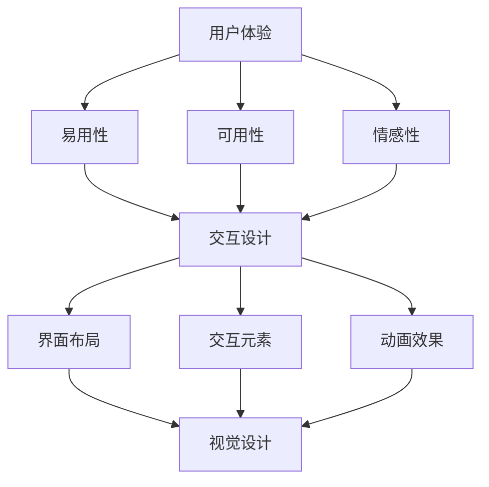

                 

关键词：创业公司、用户界面设计、用户体验、设计趋势、交互设计、响应式设计、视觉设计

> 摘要：本文将探讨创业公司在用户界面设计方面的最新趋势，包括用户体验、交互设计、响应式设计和视觉设计等方面。通过对这些趋势的深入分析，旨在为创业公司在设计用户界面时提供有价值的参考和指导。

## 1. 背景介绍

在当今数字化时代，用户界面设计成为创业公司成功的关键因素之一。一个优秀的用户界面设计不仅能够提高用户体验，还能够增加用户留存率和用户忠诚度。因此，创业公司在设计用户界面时需要密切关注市场趋势，不断创新和优化设计方案。本文将介绍创业公司在用户界面设计方面的一些重要趋势，以帮助创业者更好地把握市场动向。

### 1.1 用户体验的重要性

用户体验（User Experience，简称 UX）是用户在使用产品过程中的整体感受。一个优秀的用户体验能够带来以下好处：

1. 提高用户满意度：良好的用户体验能够使用户在使用产品时感到愉悦，从而提高满意度。
2. 增加用户留存率：用户在初次使用产品后，如果能够感受到良好的用户体验，他们更有可能继续使用产品，从而提高留存率。
3. 增强用户忠诚度：用户体验直接影响用户对品牌的认知和情感，良好的用户体验能够增加用户对品牌的忠诚度。

### 1.2 用户界面设计的发展趋势

随着科技的发展，用户界面设计也在不断演进。以下是一些当前用户界面设计的重要趋势：

1. 响应式设计：随着移动设备的普及，响应式设计成为设计用户界面的首要考虑因素。
2. 视觉设计：简洁、直观、美观的视觉设计能够吸引用户的注意力，提升用户体验。
3. 交互设计：人性化的交互设计能够提高用户操作的便利性，降低用户的学习成本。

## 2. 核心概念与联系

为了更好地理解用户界面设计的相关概念，我们首先需要了解一些核心概念和它们之间的联系。以下是几个关键概念及其在用户界面设计中的重要性：

### 2.1 用户体验（UX）

用户体验是指用户在使用产品过程中所产生的感受和体验。它包括以下几个方面：

1. **易用性（Usability）**：产品是否易于使用，用户能否快速学会如何操作。
2. **可用性（Accessibility）**：产品是否能够满足各种用户的需求，包括老年用户、残障人士等。
3. **可用性（Utility）**：产品是否能够实现用户的目标，解决用户的问题。
4. **情感性（Affectivity）**：产品是否能够带给用户愉悦、满足等情感体验。

### 2.2 交互设计（UI）

交互设计是指设计用户与产品之间的交互方式，使其更加直观、便捷和愉悦。交互设计包括以下几个方面：

1. **界面布局**：如何将功能模块合理地布局在界面上，使用户能够轻松找到所需功能。
2. **交互元素**：如按钮、图标、输入框等，如何设计这些元素以提高用户操作的便利性。
3. **动画效果**：如何使用动画效果来引导用户操作，提升用户体验。

### 2.3 视觉设计（Visual Design）

视觉设计是指通过颜色、字体、排版等元素来设计用户界面的视觉效果，使其更加美观、吸引人。视觉设计包括以下几个方面：

1. **色彩搭配**：如何选择合适的颜色搭配，以提升界面的视觉吸引力。
2. **字体选择**：如何选择适合产品的字体，以提升阅读体验。
3. **排版设计**：如何布局文字和图像，使其在界面上呈现最佳视觉效果。

### 2.4 核心概念原理和架构的 Mermaid 流程图

以下是一个简单的 Mermaid 流程图，展示了用户体验、交互设计和视觉设计之间的关系：



## 3. 核心算法原理 & 具体操作步骤

### 3.1 算法原理概述

在用户界面设计中，核心算法主要包括以下几个方面：

1. **信息架构（Information Architecture）**：设计产品的信息结构和内容组织方式，使信息易于浏览和理解。
2. **交互逻辑（Interaction Logic）**：设计用户与产品之间的交互方式，包括用户的操作行为和产品的响应。
3. **视觉呈现（Visual Representation）**：通过视觉元素来展示产品的功能和信息，提升用户体验。

### 3.2 算法步骤详解

#### 3.2.1 信息架构设计

1. **需求分析**：了解用户需求，确定产品功能模块和内容结构。
2. **内容规划**：对内容进行分类和整理，确定各模块的优先级和关联关系。
3. **导航设计**：设计产品的导航结构，使用户能够快速找到所需信息。
4. **信息可视化**：使用图表、列表等可视化元素，使信息更加直观易懂。

#### 3.2.2 交互逻辑设计

1. **用户流程**：分析用户的操作流程，确定每个步骤的操作方式和结果。
2. **交互反馈**：设计交互过程中的反馈机制，如提示、动画等，提高用户操作的满意度。
3. **异常处理**：设计异常情况的处理逻辑，确保产品在遇到问题时能够及时应对。

#### 3.2.3 视觉呈现设计

1. **视觉元素选择**：选择合适的颜色、字体、图标等视觉元素，符合产品风格和用户体验。
2. **界面布局**：根据信息架构和交互逻辑，设计界面的布局和排版。
3. **动画设计**：添加动画效果，提升界面的趣味性和用户体验。

### 3.3 算法优缺点

#### 优点

1. **提高用户体验**：通过合理的信息架构、交互逻辑和视觉呈现设计，提高用户对产品的满意度。
2. **降低开发成本**：通过提前规划和设计，降低开发过程中的修改和调整成本。
3. **提高产品竞争力**：优秀的用户界面设计能够提升产品的市场竞争力。

#### 缺点

1. **设计成本较高**：用户界面设计需要投入大量人力和时间，可能会增加开发成本。
2. **用户体验不一致**：不同设计师可能有不同的设计理念，导致用户体验不一致。
3. **维护成本较高**：随着产品功能的不断更新，用户界面设计可能需要不断调整和优化。

### 3.4 算法应用领域

用户界面设计算法广泛应用于各种类型的产品，如：

1. **移动应用**：如社交媒体、电子商务、游戏等。
2. **网站**：如电商平台、新闻门户、在线教育平台等。
3. **智能设备**：如智能手机、智能手表、智能家居设备等。

## 4. 数学模型和公式 & 详细讲解 & 举例说明

### 4.1 数学模型构建

在用户界面设计中，我们可以构建以下数学模型：

1. **用户体验评分模型**：根据用户反馈，构建一个评分模型，评估用户对产品的整体体验。
2. **交互效率模型**：根据用户操作行为，构建一个效率模型，评估用户在产品中的操作效率。
3. **视觉吸引力模型**：根据视觉设计元素，构建一个吸引力模型，评估产品界面的视觉吸引力。

### 4.2 公式推导过程

以下是一个简单的用户体验评分模型的推导过程：

设用户对产品的整体体验评分为 $U$，用户对产品的各个方面的评分分别为 $U_1, U_2, U_3, \ldots, U_n$，则用户体验评分模型可以表示为：

$$
U = \frac{U_1 + U_2 + U_3 + \ldots + U_n}{n}
$$

其中，$n$ 表示用户评价的方面数量。

### 4.3 案例分析与讲解

假设有一个创业公司，其产品是一款社交媒体应用。用户对该产品的评分如下：

1. **易用性**：4分
2. **可用性**：5分
3. **情感性**：3分

根据用户体验评分模型，我们可以计算出该产品的整体体验评分：

$$
U = \frac{4 + 5 + 3}{3} = 4
$$

因此，该产品的整体体验评分为4分。根据这个评分，我们可以分析用户对产品的各个方面是否存在改进空间。

## 5. 项目实践：代码实例和详细解释说明

### 5.1 开发环境搭建

在开始编写用户界面设计相关的代码之前，我们需要搭建一个合适的开发环境。以下是一个简单的开发环境搭建步骤：

1. 安装操作系统：选择一个适合的开发操作系统，如macOS、Windows或Linux。
2. 安装编程工具：选择一个适合的编程工具，如Visual Studio Code、IntelliJ IDEA或Sublime Text。
3. 安装开发框架：根据项目需求，选择一个合适的开发框架，如React、Vue或Angular。

### 5.2 源代码详细实现

以下是一个简单的用户界面设计代码实例，使用React框架实现一个社交媒体应用的首页界面。

```jsx
import React from 'react';

const Home = () => {
  return (
    <div className="home">
      <h1>Welcome to our social media app!</h1>
      <p>Connect with friends, share photos and videos, and discover new interests.</p>
      <button>Get Started</button>
    </div>
  );
};

export default Home;
```

### 5.3 代码解读与分析

这个代码实例是一个简单的React组件，实现了社交媒体应用的首页界面。下面是对代码的详细解读和分析：

1. **导入React库**：首先，我们需要导入React库，以便使用React提供的功能。
2. **创建组件**：使用`const Home =`创建一个名为`Home`的React组件。
3. **组件结构**：在`Home`组件中，我们定义了一个`div`元素，作为整个界面的容器。该元素包含一个标题元素`h1`，一个段落元素`p`和一个按钮元素`button`。
4. **样式**：使用CSS样式，我们为界面添加了基本的布局和样式。例如，使用`margin`和`padding`调整元素之间的间距，使用`font-size`和`color`设置字体大小和颜色。

### 5.4 运行结果展示

在浏览器中运行上述代码，我们可以看到一个简单的社交媒体应用首页界面。界面显示了一个标题、一个段落和一个按钮，如下所示：

```html
<div class="home">
  <h1>Welcome to our social media app!</h1>
  <p>Connect with friends, share photos and videos, and discover new interests.</p>
  <button>Get Started</button>
</div>
```

## 6. 实际应用场景

用户界面设计在创业公司的产品中扮演着至关重要的角色。以下是一些实际应用场景：

1. **移动应用**：如社交媒体、电子商务、在线教育等。优秀的用户界面设计能够提升用户的使用体验，增加用户留存率和用户忠诚度。
2. **网站**：如电商平台、新闻门户、在线办公等。网站的用户界面设计直接影响用户的访问体验和转化率。
3. **智能设备**：如智能手机、智能手表、智能家居设备等。用户界面设计直接影响用户对智能设备的操作体验和满意度。

### 6.1 创业公司如何设计用户界面

创业公司在设计用户界面时，可以遵循以下原则：

1. **明确用户需求**：深入了解目标用户的需求和痛点，确保设计出的界面能够满足用户的需求。
2. **关注用户体验**：注重用户体验，提高界面的易用性、可用性和情感性。
3. **持续迭代优化**：在产品上线后，持续收集用户反馈，对用户界面进行迭代优化。
4. **遵循设计规范**：遵循业界公认的设计规范和最佳实践，确保设计出的界面具有一致性。

### 6.2 用户界面设计的挑战

用户界面设计在创业公司中面临着一系列挑战：

1. **资源有限**：创业公司在资源方面可能相对有限，需要高效利用资源进行用户界面设计。
2. **时间紧迫**：创业公司通常面临时间紧迫的压力，需要在有限的时间内完成用户界面设计。
3. **用户需求变化**：用户需求可能随时变化，需要快速响应和调整用户界面设计。
4. **技术限制**：某些技术限制可能影响用户界面设计的实现，需要寻找合适的解决方案。

### 6.3 用户界面设计的发展趋势

未来，用户界面设计将呈现以下发展趋势：

1. **更加智能化**：随着人工智能技术的发展，用户界面设计将更加智能化，能够根据用户行为和偏好进行个性化调整。
2. **更加个性化和多样化**：用户界面设计将更加注重个性化和多样化，满足不同用户群体的需求。
3. **更加沉浸式**：虚拟现实（VR）和增强现实（AR）技术的不断发展，将使得用户界面设计更加沉浸式。
4. **更加可持续化**：用户界面设计将更加注重可持续性，采用绿色设计、低碳设计等理念。

## 7. 工具和资源推荐

为了帮助创业公司在用户界面设计中取得更好的效果，以下是一些工具和资源的推荐：

### 7.1 学习资源推荐

1. **书籍**：
   - 《设计心理学》（Design Psychology） by Don Norman
   - 《用户体验要素》（The Elements of User Experience） by Jesse James Garrett
   - 《交互设计指南》（Interaction Design Guidelines） by Robert L. Glass

2. **在线课程**：
   - Coursera上的《用户体验设计》课程
   - Udemy上的《React Hooks：用React Hooks创建交互式UI》课程
   - Udacity上的《UI/UX设计基础》课程

### 7.2 开发工具推荐

1. **UI设计工具**：
   - Sketch：一款专业的UI设计工具，适用于Mac平台。
   - Adobe XD：一款易于使用的界面设计工具，支持跨平台使用。
   - Figma：一款基于云的界面设计工具，支持团队协作。

2. **开发工具**：
   - Visual Studio Code：一款强大的代码编辑器，适用于多种编程语言。
   - React Studio：一款专为React项目设计的界面设计工具。
   - Angular CLI：用于创建和生成Angular项目的命令行工具。

### 7.3 相关论文推荐

1. **《用户体验设计的原则和方法》**：一篇关于用户体验设计原则和方法的综述论文。
2. **《移动应用用户界面设计指南》**：一篇关于移动应用用户界面设计的研究论文。
3. **《响应式设计的最佳实践》**：一篇关于响应式设计最佳实践的研究论文。

## 8. 总结：未来发展趋势与挑战

用户界面设计在创业公司的产品中扮演着至关重要的角色。随着科技的不断发展，用户界面设计将呈现智能化、个性化、沉浸化和可持续化等趋势。然而，创业公司在用户界面设计过程中也将面临资源有限、时间紧迫、用户需求变化和技术限制等挑战。为了应对这些挑战，创业公司需要关注用户需求，注重用户体验，持续迭代优化用户界面设计，并充分利用现有工具和资源。

## 9. 附录：常见问题与解答

### 9.1 什么是用户体验（UX）？

用户体验（UX）是指用户在使用产品或服务过程中所产生的感受和体验。它包括产品的易用性、可用性和情感性等方面。

### 9.2 用户界面设计的重要性是什么？

用户界面设计对产品的成功至关重要。一个优秀的用户界面设计可以提高用户体验，增加用户留存率和用户忠诚度，从而提升产品的市场竞争力。

### 9.3 响应式设计与移动应用设计有何区别？

响应式设计是指通过设计使网站或应用在不同设备上具有良好展示效果。移动应用设计则是指专门为移动设备设计的应用，需要考虑设备的屏幕大小、操作系统和交互方式等特点。

### 9.4 如何提高用户界面设计的效率？

提高用户界面设计效率的方法包括：

1. **明确设计目标**：在开始设计之前，明确产品的设计目标和用户需求。
2. **合理分配资源**：合理分配设计资源，确保设计工作高效进行。
3. **使用设计模板**：使用现有的设计模板，减少重复设计的工作量。
4. **采用敏捷开发方法**：采用敏捷开发方法，快速迭代和优化设计方案。

### 9.5 如何评估用户界面设计的质量？

评估用户界面设计的质量可以从以下几个方面进行：

1. **用户体验**：通过用户调研和反馈，了解用户对产品的整体体验。
2. **可用性**：评估用户在产品中的操作效率和满意度。
3. **视觉效果**：评估产品的视觉效果是否符合设计预期。
4. **兼容性**：评估产品在不同设备和操作系统上的展示效果。

[作者：禅与计算机程序设计艺术 / Zen and the Art of Computer Programming]

