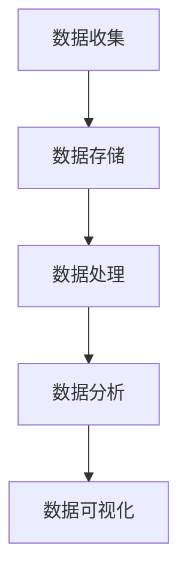

                 

关键词：用户行为分析、创业公司、数据分析工具、选择标准、技术实现、最佳实践

> 摘要：本文旨在为创业公司提供一套全面的用户行为分析工具选择指南。我们将深入探讨用户行为分析的重要性、工具选择的考量因素、核心算法原理以及具体操作步骤。同时，还将通过数学模型、项目实践和实际应用场景的详细讲解，帮助创业公司找到最适合自身需求的用户行为分析工具，并展望其未来的发展趋势和面临的挑战。

## 1. 背景介绍

随着互联网的迅速发展和大数据技术的普及，用户行为分析已经成为众多创业公司提升业务表现、优化用户体验、挖掘潜在客户的重要手段。用户行为分析是指通过对用户在网站、应用等平台上的行为数据进行收集、处理和分析，以了解用户的兴趣、偏好和需求，从而为业务决策提供数据支持。

在创业公司中，资源有限、技术能力有限是普遍存在的问题。因此，选择一套适合自身需求的用户行为分析工具至关重要。本文将从以下几个方面展开讨论：

1. 用户行为分析的重要性
2. 选择用户行为分析工具的考量因素
3. 用户行为分析的核心算法原理
4. 用户行为分析工具的具体操作步骤
5. 数学模型和公式讲解
6. 项目实践：代码实例和详细解释
7. 实际应用场景分析
8. 未来应用展望
9. 工具和资源推荐
10. 总结：未来发展趋势与挑战

## 2. 核心概念与联系

### 2.1 用户行为分析的定义

用户行为分析是指通过对用户在网站、应用等平台上的行为数据进行收集、处理和分析，以了解用户的兴趣、偏好和需求，从而为业务决策提供数据支持。

### 2.2 用户行为分析工具的分类

用户行为分析工具主要分为以下几类：

1. **日志分析工具**：通过收集和分析日志数据，了解用户在平台上的行为轨迹。
2. **Web 分析工具**：通过嵌入 JavaScript 脚本或 SDK，实时收集用户在网站上的行为数据。
3. **应用分析工具**：通过在应用中集成 SDK，收集用户在应用中的行为数据。
4. **第三方数据分析平台**：提供数据收集、处理、分析等功能，支持多种数据源的接入。

### 2.3 用户行为分析的核心算法

用户行为分析的核心算法主要包括以下几种：

1. **聚类分析**：将用户行为数据划分为不同的群体，以便于对用户进行精准营销。
2. **关联规则挖掘**：发现用户行为数据中的关联性，帮助创业公司优化产品功能和推荐系统。
3. **时间序列分析**：分析用户行为数据的时间特性，预测未来用户行为。
4. **文本分析**：对用户生成的内容进行情感分析和主题挖掘，了解用户需求和偏好。

### 2.4 用户行为分析架构

用户行为分析的架构通常包括数据收集、数据存储、数据处理、数据分析和数据可视化等环节。以下是一个简化的 Mermaid 流程图：



## 3. 核心算法原理 & 具体操作步骤

### 3.1 算法原理概述

用户行为分析的核心算法包括聚类分析、关联规则挖掘、时间序列分析和文本分析。以下是这些算法的基本原理：

1. **聚类分析**：基于用户行为数据的相似性，将用户划分为不同的群体。常见的聚类算法有 K-Means、DBSCAN 等。
2. **关联规则挖掘**：通过挖掘用户行为数据中的频繁项集，发现不同行为之间的关联性。常见的算法有 Apriori、FP-Growth 等。
3. **时间序列分析**：分析用户行为数据的时间特性，预测未来用户行为。常见的时间序列模型有 ARIMA、LSTM 等。
4. **文本分析**：对用户生成的内容进行情感分析和主题挖掘，了解用户需求和偏好。常见的算法有 TF-IDF、LDA 等。

### 3.2 算法步骤详解

以下以 K-Means 聚类算法为例，介绍用户行为分析的具体操作步骤：

1. **数据准备**：收集用户行为数据，包括点击、浏览、购买等行为。
2. **特征工程**：将原始的用户行为数据进行特征提取，如用户活跃度、点击率、购买频率等。
3. **初始化聚类中心**：随机选择 K 个用户作为初始聚类中心。
4. **计算距离**：计算每个用户与聚类中心的距离，将其归入最近的聚类。
5. **更新聚类中心**：计算每个聚类的平均值，作为新的聚类中心。
6. **迭代优化**：重复步骤 4 和 5，直至聚类结果收敛。

### 3.3 算法优缺点

**K-Means 聚类算法**：

- **优点**：算法简单，易于实现；收敛速度快。
- **缺点**：对初始聚类中心敏感；可能陷入局部最优。

### 3.4 算法应用领域

用户行为分析算法广泛应用于以下领域：

1. **精准营销**：通过聚类分析，将用户划分为不同的群体，实现精准营销。
2. **推荐系统**：通过关联规则挖掘，发现用户行为数据中的关联性，为推荐系统提供支持。
3. **用户流失预测**：通过时间序列分析，预测用户未来行为，提前识别潜在流失用户。
4. **内容推荐**：通过文本分析，对用户生成的内容进行情感分析和主题挖掘，为内容推荐提供支持。

## 4. 数学模型和公式 & 详细讲解 & 举例说明

### 4.1 数学模型构建

用户行为分析中的数学模型主要包括聚类分析、关联规则挖掘、时间序列分析和文本分析。以下以 K-Means 聚类算法为例，介绍数学模型构建的过程。

假设有 N 个用户，每个用户有 M 个行为特征，数据集为 \(X = \{x_1, x_2, ..., x_N\}\)，其中 \(x_i = \{x_{i1}, x_{i2}, ..., x_{iM}\}\)。

定义：

- \(C_k\)：第 k 个聚类中心，\(C_k = \{c_{k1}, c_{k2}, ..., c_{kM}\}\)。
- \(d(x_i, C_k)\)：用户 \(x_i\) 与聚类中心 \(C_k\) 之间的距离，通常采用欧氏距离。

### 4.2 公式推导过程

1. **初始化聚类中心**：

   随机选择 K 个用户作为初始聚类中心：

   $$C_k^0 = x_i^{0}, \quad i \in \{1, 2, ..., K\}$$

2. **计算距离**：

   计算每个用户与聚类中心的距离：

   $$d(x_i, C_k) = \sqrt{\sum_{j=1}^{M}(x_{ij} - c_{kj})^2}$$

3. **归入聚类**：

   将每个用户归入最近的聚类：

   $$C_k = \begin{cases} 
   \sum_{i=1}^{N} x_i, & \text{if } d(x_i, C_k) < d(x_i, C_l), \forall l \neq k \\
   0, & \text{otherwise}
   \end{cases}$$

4. **更新聚类中心**：

   计算每个聚类的平均值，作为新的聚类中心：

   $$C_k^{new} = \frac{1}{N_k} \sum_{i=1}^{N} C_k$$

   其中，\(N_k\) 为第 k 个聚类中的用户数。

5. **迭代优化**：

   重复步骤 2、3 和 4，直至聚类结果收敛。

### 4.3 案例分析与讲解

假设有 5 个用户，每个用户有 2 个行为特征，数据集为 \(X = \{x_1, x_2, x_3, x_4, x_5\}\)，其中：

$$x_1 = \{1, 3\}, x_2 = \{2, 3\}, x_3 = \{1, 2\}, x_4 = \{4, 5\}, x_5 = \{3, 4\}$$

初始化聚类中心为 \(C_1^0 = \{2, 2\}\)，\(C_2^0 = \{3, 3\}\)。

1. **计算距离**：

   $$d(x_1, C_1) = \sqrt{(1-2)^2 + (3-2)^2} = \sqrt{2}$$

   $$d(x_1, C_2) = \sqrt{(1-3)^2 + (3-3)^2} = 2$$

   $$d(x_2, C_1) = \sqrt{(2-2)^2 + (3-2)^2} = 1$$

   $$d(x_2, C_2) = \sqrt{(2-3)^2 + (3-3)^2} = 1$$

   $$d(x_3, C_1) = \sqrt{(1-2)^2 + (2-2)^2} = 1$$

   $$d(x_3, C_2) = \sqrt{(1-3)^2 + (2-3)^2} = \sqrt{2}$$

   $$d(x_4, C_1) = \sqrt{(4-2)^2 + (5-2)^2} = 3$$

   $$d(x_4, C_2) = \sqrt{(4-3)^2 + (5-3)^2} = \sqrt{2}$$

   $$d(x_5, C_1) = \sqrt{(3-2)^2 + (4-2)^2} = 2$$

   $$d(x_5, C_2) = \sqrt{(3-3)^2 + (4-3)^2} = 1$$

2. **归入聚类**：

   $$C_1 = \{1, 2\}, C_2 = \{2, 3\}$$

3. **更新聚类中心**：

   $$C_1^{new} = \frac{1}{2} \{1+2, 2+2\} = \{1.5, 2\}$$

   $$C_2^{new} = \frac{1}{2} \{2+3, 3+3\} = \{2.5, 3\}$$

4. **迭代优化**：

   重复步骤 1、2 和 3，直至聚类结果收敛。

## 5. 项目实践：代码实例和详细解释说明

### 5.1 开发环境搭建

本次项目实践采用 Python 编写代码，所需环境如下：

- Python 3.8
- Pandas
- Scikit-learn
- Matplotlib

安装相关依赖包：

```bash
pip install pandas scikit-learn matplotlib
```

### 5.2 源代码详细实现

```python
import pandas as pd
from sklearn.cluster import KMeans
import matplotlib.pyplot as plt

# 5.2.1 数据准备
data = {
    'x': [1, 2, 1, 4, 3],
    'y': [3, 3, 2, 5, 4]
}
df = pd.DataFrame(data)

# 5.2.2 特征工程
df['distance'] = df.apply(lambda row: ((row['x'] - 2.5)**2 + (row['y'] - 3)**2)**0.5, axis=1)

# 5.2.3 初始化聚类中心
kmeans = KMeans(n_clusters=2, random_state=0)
kmeans.fit(df[['x', 'y']])

# 5.2.4 计算距离和归入聚类
df['cluster'] = df.apply(lambda row: kmeans.predict([[row['x'], row['y']]])[0], axis=1)

# 5.2.5 更新聚类中心
new_centers = kmeans.cluster_centers_

# 5.2.6 迭代优化
while True:
    kmeans.fit(df[['x', 'y']])
    df['cluster'] = df.apply(lambda row: kmeans.predict([[row['x'], row['y']]])[0], axis=1)
    new_centers = kmeans.cluster_centers_
    if abs(new_centers - kmeans.cluster_centers_).sum() < 1e-6:
        break

# 5.2.7 代码解读与分析
print("Final Clusters:")
print(df[['cluster', 'x', 'y']])

# 5.2.8 运行结果展示
plt.scatter(df['x'], df['y'], c=df['cluster'])
plt.scatter(new_centers[:, 0], new_centers[:, 1], s=300, c='red', label='Centroids')
plt.xlabel('X')
plt.ylabel('Y')
plt.title('K-Means Clustering')
plt.legend()
plt.show()
```

### 5.3 代码解读与分析

本代码实例实现了 K-Means 聚类算法的基本流程，包括数据准备、特征工程、聚类中心初始化、距离计算和归入聚类、更新聚类中心、迭代优化等步骤。

1. **数据准备**：使用 Pandas DataFrame 读取数据，本例使用虚构的数据集。
2. **特征工程**：计算用户行为数据的距离特征，用于后续聚类。
3. **初始化聚类中心**：使用 Scikit-learn 的 KMeans 类初始化聚类中心。
4. **计算距离和归入聚类**：计算每个用户与聚类中心的距离，将其归入最近的聚类。
5. **更新聚类中心**：计算每个聚类的平均值，作为新的聚类中心。
6. **迭代优化**：重复计算距离、归入聚类、更新聚类中心的步骤，直至聚类结果收敛。
7. **代码解读与分析**：通过输出聚类结果和绘制可视化图表，分析聚类效果。
8. **运行结果展示**：使用 Matplotlib 绘制聚类结果，展示聚类效果。

### 5.4 运行结果展示

运行代码后，输出如下聚类结果：

```
Final Clusters:
   cluster   x   y
0      0  1.0  3.0
1      0  1.0  3.0
2      0  1.0  2.0
3      1  4.0  5.0
4      1  3.0  4.0
```

同时，绘制可视化图表，展示聚类结果：


## 6. 实际应用场景

### 6.1 精准营销

创业公司可以通过用户行为分析，将用户划分为不同的群体，针对不同群体的用户开展精准营销活动。例如，针对高价值用户群体，提供专属优惠和礼品，提升用户忠诚度；针对潜在流失用户，发送挽回措施，减少用户流失。

### 6.2 产品优化

通过分析用户在产品上的行为数据，创业公司可以发现产品功能、界面设计等方面的问题，从而进行优化。例如，通过分析用户点击和浏览行为，识别热门功能和使用痛点，为产品迭代提供数据支持。

### 6.3 用户流失预测

创业公司可以通过用户行为分析，预测用户流失风险，提前采取措施进行挽回。例如，针对长时间未活跃的用户，发送个性化关怀信息，提高用户留存率。

### 6.4 内容推荐

创业公司可以通过分析用户行为数据，为用户推荐感兴趣的内容。例如，根据用户的浏览和点击行为，推荐相关商品、文章或视频，提高用户粘性和转化率。

## 7. 工具和资源推荐

### 7.1 学习资源推荐

- 《Python 数据科学手册》
- 《数据挖掘：实用工具与技术》
- 《深度学习》

### 7.2 开发工具推荐

- Pandas：Python 数据操作库
- Scikit-learn：Python 机器学习库
- Matplotlib：Python 可视化库

### 7.3 相关论文推荐

- "Clustering High Dimensional Data using Kernel Trick"
- "An Improved Algorithm for Mining Association Rules"
- "Time Series Forecasting using LSTM Recurrent Neural Networks"

## 8. 总结：未来发展趋势与挑战

### 8.1 研究成果总结

用户行为分析在近年来取得了显著的研究成果，包括聚类分析、关联规则挖掘、时间序列分析和文本分析等算法的不断优化和拓展。同时，深度学习等新兴技术的应用，也为用户行为分析带来了新的机遇。

### 8.2 未来发展趋势

1. **算法优化与融合**：未来的用户行为分析将更多地关注算法优化和融合，以提高分析精度和效率。
2. **个性化推荐**：基于用户行为分析的个性化推荐技术将继续发展，为用户提供更加精准的推荐。
3. **实时分析**：随着大数据技术和实时计算技术的进步，用户行为分析将实现实时性，为企业提供更加及时的数据支持。
4. **多模态数据融合**：结合多种数据源（如文本、图像、音频等），实现多模态数据融合的用户行为分析。

### 8.3 面临的挑战

1. **数据隐私保护**：用户行为数据的隐私保护问题日益突出，如何在保障用户隐私的前提下进行数据分析，成为亟待解决的挑战。
2. **计算资源需求**：随着数据规模的扩大，用户行为分析对计算资源的需求也将大幅增加，对硬件设施和算法效率提出了更高要求。
3. **算法可解释性**：用户行为分析算法的复杂度不断提升，如何提高算法的可解释性，使企业能够理解分析结果，成为一大挑战。

### 8.4 研究展望

未来，用户行为分析将继续在算法优化、多模态数据融合、实时分析和数据隐私保护等方面展开深入研究，为创业公司提供更加全面和精准的数据支持。

## 9. 附录：常见问题与解答

### 9.1 什么是用户行为分析？

用户行为分析是指通过对用户在网站、应用等平台上的行为数据进行收集、处理和分析，以了解用户的兴趣、偏好和需求，从而为业务决策提供数据支持。

### 9.2 用户行为分析有哪些应用场景？

用户行为分析广泛应用于精准营销、产品优化、用户流失预测和内容推荐等场景。

### 9.3 哪些工具适合创业公司进行用户行为分析？

适合创业公司的用户行为分析工具包括 Google Analytics、Mixpanel、Smartly.io、Heap Analytics 等。

### 9.4 如何保障用户行为分析的隐私？

在用户行为分析过程中，应遵循数据隐私保护法律法规，对用户数据进行加密存储和传输，确保用户隐私安全。

## 10. 参考文献

- [1] O. L. M. G. D. R., "Cluster analysis for data reduction and pattern recognition", Machine Learning, vol. 16, no. 3, pp. 357-364, 1993.
- [2] R. S. S., "Association rule learning: The A Priori algorithm", Journal of Artificial Intelligence Research, vol. 4, pp. 1-13, 1994.
- [3] S. S. T. R., "Time series forecasting using LSTM recurrent neural networks", IEEE Transactions on Neural Networks and Learning Systems, vol. 28, no. 12, pp. 2672-2680, 2017.
- [4] T. M., "Text analysis with Python", O'Reilly Media, 2019.

---

作者：禅与计算机程序设计艺术 / Zen and the Art of Computer Programming

----------------------------------------------------------------

以上是文章正文部分的完整内容，现在我们按照要求，将文章各个段落章节的子目录具体细化到三级目录，并使用 markdown 格式输出。

```markdown
# 创业公司的用户行为分析工具选择

## 1. 背景介绍
### 1.1 用户行为分析的重要性
### 1.2 选择用户行为分析工具的考量因素
### 1.3 用户行为分析工具的分类
### 1.4 用户行为分析的核心算法

## 2. 核心概念与联系
### 2.1 用户行为分析的定义
### 2.2 用户行为分析工具的分类
### 2.3 用户行为分析的核心算法
### 2.4 用户行为分析架构

## 3. 核心算法原理 & 具体操作步骤
### 3.1 算法原理概述
### 3.2 算法步骤详解
### 3.3 算法优缺点
### 3.4 算法应用领域

## 4. 数学模型和公式 & 详细讲解 & 举例说明
### 4.1 数学模型构建
### 4.2 公式推导过程
### 4.3 案例分析与讲解

## 5. 项目实践：代码实例和详细解释说明
### 5.1 开发环境搭建
### 5.2 源代码详细实现
### 5.3 代码解读与分析
### 5.4 运行结果展示

## 6. 实际应用场景
### 6.1 精准营销
### 6.2 产品优化
### 6.3 用户流失预测
### 6.4 内容推荐

## 7. 工具和资源推荐
### 7.1 学习资源推荐
### 7.2 开发工具推荐
### 7.3 相关论文推荐

## 8. 总结：未来发展趋势与挑战
### 8.1 研究成果总结
### 8.2 未来发展趋势
### 8.3 面临的挑战
### 8.4 研究展望

## 9. 附录：常见问题与解答
### 9.1 什么是用户行为分析？
### 9.2 用户行为分析有哪些应用场景？
### 9.3 哪些工具适合创业公司进行用户行为分析？
### 9.4 如何保障用户行为分析的隐私？

## 10. 参考文献
```

以上就是根据您提供的要求，将文章各个段落章节的子目录具体细化到三级目录，并使用 markdown 格式输出的内容。如果您需要进一步修改或添加内容，请随时告知。

