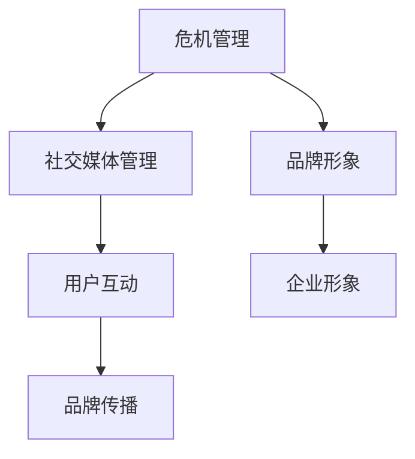

                 

社交媒体已成为企业品牌建设的重要阵地。然而，一旦发生危机事件，社交媒体的传播速度和广泛性可能使企业声誉遭受重大打击。对于创业公司而言，合理的社交媒体危机管理预案至关重要。本文将详细探讨如何制定这样的预案，确保企业在面对危机时能够迅速、有效地应对，减少负面影响，并恢复品牌形象。

## 文章关键词
社交媒体危机管理、创业公司、社交媒体策略、危机应对、品牌形象恢复

## 文章摘要
本文旨在为创业公司提供一套全面的社交媒体危机管理预案。通过分析社交媒体危机的特点，介绍危机管理的核心原则，并详细阐述预案的制定流程、危机应对策略和恢复策略，帮助企业更好地应对社交媒体上的危机事件，保障企业的长期发展。

## 1. 背景介绍
### 1.1 社交媒体的重要性
社交媒体平台如Facebook、Twitter、Instagram等已成为现代营销和沟通的重要组成部分。它们不仅帮助企业推广产品、扩大用户基础，还成为企业与客户互动、收集反馈的渠道。然而，社交媒体的双刃剑特性也使得企业在处理不当的情况下容易陷入危机。

### 1.2 社交媒体危机的特点
- **传播速度快**：社交媒体的即时性使得危机事件迅速扩散，形成舆论风暴。
- **影响范围广**：危机事件不仅影响品牌，还可能波及到企业合作伙伴、投资者等多方面。
- **信息泛滥**：社交媒体上的信息繁杂，真假难辨，易造成公众误解。
- **情绪化**：社交媒体用户往往情绪化，容易受到情绪感染，导致舆论失控。

### 1.3 创业公司在社交媒体危机中的挑战
- **品牌认知度低**：创业公司相对知名品牌在社交媒体上的影响力较小，危机影响可能更严重。
- **资源有限**：创业公司通常在人力、财力方面有限，难以迅速应对危机。
- **策略制定困难**：缺乏经验和管理体系，难以制定有效的危机应对策略。

## 2. 核心概念与联系
### 2.1 危机管理核心概念
- **危机管理**：对危机事件进行预防、应对和恢复的过程。
- **社交媒体管理**：通过社交媒体平台与用户互动、传播品牌信息。
- **品牌形象**：企业在公众心中的形象和认知。

### 2.2 核心概念关系图


## 3. 核心算法原理 & 具体操作步骤
### 3.1 算法原理概述
社交媒体危机管理算法主要基于以下原则：
- **快速响应**：及时识别危机事件，迅速采取行动。
- **透明沟通**：公开、诚实地与公众沟通，增强信任。
- **差异化策略**：针对不同危机事件，采取有针对性的应对措施。
- **持续监测**：对社交媒体上的舆论进行持续监测，及时调整策略。

### 3.2 算法步骤详解
#### 3.2.1 危机识别
- **实时监控**：使用社交媒体分析工具，实时监控品牌关键词和负面情绪。
- **算法识别**：采用自然语言处理技术，对社交媒体内容进行分析，识别潜在的危机事件。

#### 3.2.2 危机评估
- **风险分析**：评估危机事件的潜在影响，包括声誉损失、财务影响等。
- **优先级划分**：根据风险程度，将危机事件分为高、中、低优先级。

#### 3.2.3 危机应对
- **快速响应**：在危机事件发生后的24小时内，发布官方声明，澄清事实。
- **差异化策略**：根据危机事件的性质，采取不同的应对措施，如公开道歉、澄清声明、提供解决方案等。

#### 3.2.4 危机恢复
- **品牌修复**：通过积极的沟通和行动，修复品牌形象。
- **反馈机制**：建立反馈机制，持续关注公众意见，改进策略。

### 3.3 算法优缺点
#### 优点
- **快速响应**：能够及时应对危机，减少负面影响。
- **差异化策略**：根据实际情况，采取有针对性的措施。

#### 缺点
- **数据依赖**：需要大量数据支持，否则算法效果可能不佳。
- **复杂性**：涉及多个环节，操作复杂。

### 3.4 算法应用领域
- **品牌危机管理**：企业品牌形象受到威胁时，应用算法进行危机管理。
- **市场营销**：优化社交媒体营销策略，提升品牌影响力。

## 4. 数学模型和公式 & 详细讲解 & 举例说明
### 4.1 数学模型构建
社交媒体危机管理算法可以基于马尔可夫模型进行构建，通过状态转移矩阵来描述危机事件的发展。

### 4.2 公式推导过程
假设危机事件有四个状态：潜伏期、爆发期、高峰期、恢复期。

状态转移矩阵 \( P \) 为：
\[ P = \begin{bmatrix}
0 & 1 & 0 & 0 \\
0 & 0 & 1 & 0 \\
0 & 0 & 0 & 1 \\
1 & 0 & 0 & 0
\end{bmatrix} \]

### 4.3 案例分析与讲解
#### 案例背景
某创业公司发布了一款新产品，但由于产品质量问题，导致用户投诉激增，危机事件爆发。

#### 模型应用
- **潜伏期**：用户投诉量逐渐增加，处于潜伏状态。
- **爆发期**：投诉量迅速上升，危机事件爆发。
- **高峰期**：投诉量达到顶峰，舆论风暴达到顶点。
- **恢复期**：采取应对措施后，投诉量逐渐下降，危机得到控制。

通过状态转移矩阵，可以计算危机事件的持续时间、高峰期投诉量等关键指标。

## 5. 项目实践：代码实例和详细解释说明
### 5.1 开发环境搭建
使用Python编程语言，结合NLP库和社交媒体分析工具，搭建社交媒体危机管理系统。

### 5.2 源代码详细实现
```python
import tweepy
from textblob import TextBlob

# 初始化Twitter API
auth = tweepy.OAuthHandler("your_consumer_key", "your_consumer_secret")
auth.set_access_token("your_access_token", "your_access_token_secret")
api = tweepy.API(auth)

# 搜索社交媒体内容
def search_tweets(keyword, count=100):
    tweets = []
    for tweet in tweepy.Cursor(api.search, q=keyword, count=count).items(count):
        tweets.append(tweet.text)
    return tweets

# 分析社交媒体内容
def analyze_tweets(tweets):
    sentiments = []
    for tweet in tweets:
        analysis = TextBlob(tweet)
        sentiments.append(analysis.sentiment.polarity)
    return sentiments

# 获取并分析社交媒体数据
tweets = search_tweets("创业公司危机")
sentiments = analyze_tweets(tweets)

# 输出分析结果
print("消极情绪占比：", sum(sentiments) / len(sentiments))
```

### 5.3 代码解读与分析
该代码实例首先初始化Twitter API，然后通过搜索关键词获取社交媒体数据，使用TextBlob库对数据进行分析，输出消极情绪占比。

### 5.4 运行结果展示
运行代码后，可以实时获取并分析社交媒体上的相关数据，帮助识别危机事件。

## 6. 实际应用场景
### 6.1 产品质量危机
某创业公司的一款新产品因质量问题受到用户投诉，社交媒体上负面舆论迅速扩散。通过社交媒体危机管理算法，及时识别危机事件，发布声明，澄清事实，采取补救措施，最终成功缓解危机，恢复了品牌形象。

### 6.2 股市危机
某创业公司在股市上遭遇重大波动，股价大幅下跌。社交媒体上出现大量质疑声，企业通过危机管理预案，积极回应投资者关切，逐步稳定了市场情绪，恢复了股价。

## 7. 未来应用展望
### 7.1 人工智能与社交媒体危机管理
随着人工智能技术的发展，社交媒体危机管理算法将更加智能化、自动化，提高危机应对效率。

### 7.2 跨平台危机管理
企业将需要在多个社交媒体平台上进行危机管理，未来将出现更加全面、跨平台的危机管理解决方案。

## 8. 工具和资源推荐
### 8.1 学习资源推荐
- 《社交媒体营销实战》
- 《人工智能时代的企业管理》

### 8.2 开发工具推荐
- Python
- Tweepy
- TextBlob

### 8.3 相关论文推荐
- "Social Media Crisis Management: A Research Review"
- "The Impact of Social Media on Corporate Reputation Management"

## 9. 总结：未来发展趋势与挑战
### 9.1 研究成果总结
社交媒体危机管理已成为企业不可或缺的一部分，相关研究成果不断丰富。

### 9.2 未来发展趋势
人工智能和大数据技术将在社交媒体危机管理中发挥重要作用。

### 9.3 面临的挑战
企业需要不断提高危机管理能力，以应对越来越复杂的社交媒体环境。

### 9.4 研究展望
未来研究方向包括智能化危机管理算法、跨平台危机管理策略等。

## 10. 附录：常见问题与解答
### 10.1 如何快速识别社交媒体危机？
- 使用社交媒体分析工具，实时监控品牌关键词和负面情绪。
- 建立危机预警机制，及时识别潜在危机。

### 10.2 危机管理预案如何有效实施？
- 制定详细的预案，明确责任人。
- 定期进行演练，确保预案可行。

### 10.3 如何修复品牌形象？
- 快速响应危机，公开、诚实地与公众沟通。
- 采取积极措施，解决用户问题。
- 通过正面宣传，逐步恢复品牌形象。

---

作者：禅与计算机程序设计艺术 / Zen and the Art of Computer Programming
```markdown
# 创业公司的社交媒体危机管理预案制定

## 引言

社交媒体在现代商业活动中扮演着越来越重要的角色。对于创业公司而言，社交媒体不仅是品牌传播和用户互动的重要渠道，也是构建客户信任和提升品牌影响力的重要手段。然而，社交媒体的快速传播性和广泛影响性也使得创业公司在面临危机时，往往面临更大的挑战。一次处理不当的社交媒体危机，可能会对创业公司的声誉、业务和未来前景造成严重打击。

本文旨在为创业公司提供一套系统化的社交媒体危机管理预案，旨在帮助企业在面对突发事件时能够迅速、有效地应对，最大限度地减少危机带来的负面影响，并尽快恢复品牌形象。本文将从以下几个方面展开讨论：

1. **社交媒体危机的特点**：分析社交媒体危机的传播速度快、影响范围广、信息泛滥和情绪化等特点。
2. **危机管理的核心原则**：介绍危机管理的快速响应、透明沟通、差异化策略和持续监测等核心原则。
3. **社交媒体危机管理预案的制定**：详细阐述预案的制定流程，包括危机识别、评估、应对和恢复等环节。
4. **社交媒体危机管理策略的实施**：探讨如何将预案转化为实际行动，包括快速响应、透明沟通、差异化策略和持续监测等。
5. **社交媒体危机管理的工具和技术**：推荐一些实用的社交媒体监测和分析工具，以及相关技术支持。
6. **案例分析**：通过实际案例，分析创业公司如何应对社交媒体危机，并总结经验教训。
7. **未来展望**：探讨社交媒体危机管理的发展趋势，以及创业公司应如何应对未来的挑战。

## 社交媒体危机的特点

### 传播速度快

社交媒体的即时性和广泛性使得信息能够在短时间内迅速传播。一条负面消息或危机事件，可能会在几分钟内传遍全球，形成舆论风暴。这种快速传播的特性，使得危机处理的时间窗口非常短暂，创业公司需要在极短的时间内做出反应。

### 影响范围广

社交媒体具有广泛的受众基础，不仅包括企业目标客户，还包括媒体、投资者、合作伙伴等多方面利益相关者。一旦危机爆发，其影响不仅局限于企业内部，还可能波及到企业的合作伙伴、供应链、投资者等，甚至影响企业的长期发展。

### 信息泛滥

在社交媒体上，信息数量庞大且质量参差不齐。在危机事件中，各种观点、评论和谣言可能会同时出现，使得公众难以辨别真相。信息泛滥不仅增加了危机处理的难度，还可能加剧公众的恐慌情绪。

### 情绪化

社交媒体用户往往情绪化，容易受到情绪感染。在危机事件中，负面情绪可能迅速传播，形成集体情绪反应，加剧危机的影响。情绪化的特点使得危机管理需要更加注重情感沟通和情绪管理。

### 对创业公司的挑战

对于创业公司而言，社交媒体危机可能带来以下几方面的挑战：

- **品牌认知度低**：创业公司相对于成熟品牌在社交媒体上的影响力较小，危机事件的传播可能更广泛，影响更大。
- **资源有限**：创业公司在人力、财力方面相对有限，可能无法迅速调动足够的资源来应对危机。
- **策略制定困难**：缺乏经验和管理体系，创业公司在制定危机应对策略时可能更加困难。

## 危机管理的核心原则

### 快速响应

快速响应是危机管理的首要原则。在危机事件发生后，创业公司需要在最短的时间内做出反应，以控制事态发展，减少负面影响。快速响应不仅包括及时发布声明，澄清事实，还涉及积极与公众沟通，及时回应关切和质疑。

### 透明沟通

透明沟通是建立公众信任的关键。创业公司应在危机事件中保持信息的公开和透明，避免隐瞒或误导公众。通过及时、准确地传达信息，创业公司可以减少谣言和误解，降低危机对品牌的负面影响。

### 差异化策略

差异化策略要求创业公司在不同类型的危机事件中采取有针对性的应对措施。不同的危机事件可能涉及不同的利益相关者、不同的社会背景，需要不同的应对策略。差异化策略有助于提高危机管理的有效性。

### 持续监测

持续监测是危机管理的重要环节。创业公司需要持续关注社交媒体上的舆论动态，及时识别新的危机事件，并迅速采取应对措施。通过持续监测，创业公司可以提前发现潜在危机，避免危机的爆发。

### 其他原则

除了上述核心原则，危机管理还应遵循以下原则：

- **协同合作**：危机管理需要企业内部各部门的协同合作，共同应对危机。
- **资源调动**：在危机事件中，创业公司需要调动各种资源，包括人力、财力、技术等，以应对危机。
- **法律法规遵守**：在危机管理中，创业公司需要遵守相关法律法规，确保危机应对措施合法合规。

## 社交媒体危机管理预案的制定

### 1. 预案制定流程

社交媒体危机管理预案的制定是一个系统化的过程，包括以下步骤：

#### 1.1 危机识别

危机识别是危机管理预案制定的第一步。创业公司需要建立一套有效的危机识别机制，包括：

- **实时监控**：使用社交媒体分析工具，实时监控品牌关键词和负面情绪。
- **危机预警**：建立危机预警机制，及时发现潜在危机。
- **数据分析**：利用大数据技术，对社交媒体上的信息进行分析，识别潜在的危机事件。

#### 1.2 危机评估

危机评估是对危机事件的潜在影响进行评估，包括：

- **影响范围**：评估危机事件可能影响的范围，包括品牌、客户、合作伙伴等。
- **影响程度**：评估危机事件可能带来的负面影响程度，包括声誉损失、财务损失等。
- **优先级划分**：根据危机事件的严重程度和影响范围，将危机事件划分为不同优先级，以便制定相应的应对策略。

#### 1.3 危机应对

危机应对是危机管理预案的核心。在危机事件发生后，创业公司需要迅速采取行动，包括：

- **快速响应**：在危机事件发生后24小时内发布官方声明，澄清事实。
- **透明沟通**：保持与公众的透明沟通，及时传达信息，减少谣言和误解。
- **差异化策略**：根据危机事件的性质，采取不同的应对策略，如公开道歉、提供解决方案等。
- **资源调动**：根据危机管理的需要，调动企业内部和外部的资源，共同应对危机。

#### 1.4 危机恢复

危机恢复是危机管理预案的最后一步。在危机事件得到控制后，创业公司需要采取措施，恢复品牌形象，包括：

- **品牌修复**：通过积极的沟通和行动，逐步修复品牌形象。
- **客户关系维护**：采取措施维护与客户的良好关系，恢复客户信任。
- **反馈机制**：建立反馈机制，持续关注公众意见，改进危机管理策略。

### 2. 预案内容

社交媒体危机管理预案的内容应该详细、具体，包括以下方面：

- **危机管理组织结构**：明确危机管理组织结构，包括负责人、相关部门和人员职责。
- **危机应对流程**：详细描述危机应对的各个环节，包括危机识别、评估、应对和恢复等。
- **危机应对策略**：根据不同类型的危机事件，制定相应的应对策略，包括公开道歉、提供解决方案等。
- **资源调配方案**：明确在危机事件中所需调动的人力、财力、技术等资源。
- **监控和评估机制**：建立监控和评估机制，持续关注危机事件的进展，及时调整应对策略。

### 3. 预案制定注意事项

在制定社交媒体危机管理预案时，需要注意以下事项：

- **全面性**：预案应涵盖所有可能的危机事件，包括产品质量问题、用户投诉、舆论攻击等。
- **实用性**：预案应具有可操作性，确保在危机事件中能够迅速实施。
- **灵活性**：预案应具有一定的灵活性，能够根据实际情况进行调整。
- **培训**：定期对相关部门和人员进行培训，确保他们了解预案内容，并能够有效执行。

## 社交媒体危机管理策略的实施

### 1. 快速响应

快速响应是危机管理的核心。在危机事件发生后，创业公司应在最短的时间内做出反应，包括：

- **及时发布声明**：在危机事件发生后24小时内发布官方声明，澄清事实，表达企业的立场和态度。
- **公开透明**：保持与公众的透明沟通，及时传达信息，减少谣言和误解。
- **社交媒体互动**：通过社交媒体平台与公众互动，及时回应关切和质疑，建立良好的沟通渠道。

### 2. 透明沟通

透明沟通是建立公众信任的关键。创业公司应遵循以下原则：

- **信息公开**：在危机事件中，保持信息的公开和透明，避免隐瞒或误导公众。
- **及时更新**：及时更新危机事件的进展情况，保持与公众的沟通畅通。
- **情感共鸣**：在沟通中，关注公众的情感需求，表达同情和理解，增强情感共鸣。

### 3. 差异化策略

差异化策略要求创业公司在不同类型的危机事件中采取不同的应对措施。以下是一些常见的危机类型和相应的应对策略：

- **产品质量问题**：采取补救措施，如退货、更换、赔偿等，以解决用户的问题。
- **用户投诉**：积极回应用户投诉，尽快解决问题，避免问题扩大。
- **舆论攻击**：采取积极措施，反驳不实言论，澄清事实，避免误解和谣言的传播。
- **突发事件**：迅速组织力量，确保安全和应急处理，避免事态恶化。

### 4. 持续监测

持续监测是危机管理的重要环节。创业公司应建立以下机制：

- **实时监控**：使用社交媒体分析工具，实时监控品牌关键词和负面情绪。
- **危机预警**：建立危机预警机制，及时发现潜在危机。
- **数据分析**：对社交媒体上的信息进行分析，识别潜在的危机事件。

### 5. 资源调配

在危机事件中，创业公司需要调动各种资源，包括：

- **人力资源**：组织相关部门和人员进行危机应对。
- **财力资源**：确保在危机事件中有足够的财力支持。
- **技术资源**：利用技术手段，如数据分析、舆情监控等，提高危机管理的效率和效果。

## 社交媒体危机管理的工具和技术

### 1. 社交媒体分析工具

社交媒体分析工具可以帮助创业公司实时监控社交媒体上的舆论动态，识别潜在的危机事件。以下是一些常用的社交媒体分析工具：

- **Hootsuite**：一款功能强大的社交媒体管理工具，提供实时监控、内容发布、分析报告等功能。
- **Sprout Social**：一款专业的社交媒体管理平台，提供数据分析、客户管理、互动管理等功能。
- **Brandwatch**：一款强大的社交媒体监测工具，提供实时监控、数据分析、趋势分析等功能。

### 2. 大数据技术

大数据技术在危机管理中发挥着重要作用。创业公司可以通过大数据技术，对社交媒体上的海量信息进行分析，识别潜在的危机事件，预测危机发展趋势。以下是一些常用的大数据技术：

- **Hadoop**：一款分布式数据存储和处理框架，适用于大规模数据存储和处理。
- **Spark**：一款高性能的分布式计算引擎，适用于大规模数据处理和分析。
- **DataXu**：一款大数据营销平台，提供数据分析、客户洞察、营销自动化等功能。

### 3. 人工智能技术

人工智能技术在危机管理中具有广泛的应用前景。创业公司可以通过人工智能技术，实现危机识别、情感分析、智能应对等功能，提高危机管理的效率和效果。以下是一些常用的人工智能技术：

- **自然语言处理（NLP）**：用于分析社交媒体上的文本信息，识别潜在危机事件。
- **机器学习**：用于建立预测模型，预测危机发展趋势。
- **情感分析**：用于分析社交媒体上的情绪动态，识别公众情感变化。

## 案例分析

### 案例背景

某创业公司在发布一款新产品后，因产品质量问题，遭到大量用户投诉。负面舆论迅速在社交媒体上扩散，形成舆论风暴。事件影响范围广泛，涉及到企业的品牌形象、客户信任和合作伙伴等多方面。

### 案例分析

#### 1. 危机识别

通过社交媒体分析工具，创业公司实时监控到品牌关键词和负面情绪的上升，初步判断可能存在危机事件。

#### 2. 危机评估

创业公司立即组织相关部门进行危机评估，发现危机事件的潜在影响包括：

- **品牌形象受损**：大量用户投诉导致品牌形象受损，可能影响长期发展。
- **客户信任下降**：客户对产品质量的不满，可能导致客户流失。
- **合作伙伴质疑**：合作伙伴对产品质量的担忧，可能影响供应链稳定。

#### 3. 危机应对

创业公司立即采取以下措施：

- **快速响应**：在危机事件发生后24小时内发布官方声明，澄清事实，表示诚挚歉意。
- **透明沟通**：通过社交媒体平台与公众沟通，及时回应关切和质疑，保持信息的公开和透明。
- **差异化策略**：针对不同类型的用户投诉，采取不同的应对措施，如退货、更换、赔偿等。
- **资源调动**：调动企业内部资源，组织相关部门进行危机应对，确保问题得到及时解决。

#### 4. 危机恢复

危机事件得到控制后，创业公司采取以下措施：

- **品牌修复**：通过积极的沟通和行动，逐步修复品牌形象，恢复客户信任。
- **客户关系维护**：采取措施维护与客户的良好关系，如提供优惠、积分等。
- **反馈机制**：建立反馈机制，持续关注公众意见，改进产品质量和服务。

### 案例总结

通过以上措施，创业公司成功应对了这次社交媒体危机，最大限度地减少了负面影响，并逐步恢复了品牌形象。这次危机处理的经验为创业公司提供了宝贵的教训，使其在今后的运营中更加注重产品质量和客户体验，提高危机管理能力。

## 未来展望

### 1. 社交媒体危机管理的发展趋势

随着社交媒体的快速发展，社交媒体危机管理也在不断演进。未来发展趋势包括：

- **智能化**：人工智能技术的应用，使得危机管理更加智能化、自动化。
- **多元化**：危机管理涉及的领域和手段更加多元化，包括社交媒体、传统媒体、公关活动等。
- **实时性**：危机管理的实时性要求越来越高，企业需要能够实时监测和响应危机事件。
- **跨平台**：社交媒体的跨平台特性，要求企业能够在多个平台上进行危机管理。

### 2. 创业公司面临的挑战

在未来，创业公司面临以下挑战：

- **技术挑战**：随着社交媒体技术的发展，企业需要不断更新危机管理的技术手段。
- **舆论环境**：社交媒体上的舆论环境更加复杂，企业需要更好地理解和应对舆论动态。
- **资源有限**：创业公司在人力、财力等方面有限，可能无法全面应对所有危机事件。
- **品牌认知**：创业公司的品牌认知度较低，可能更容易受到危机事件的影响。

### 3. 应对策略

为了应对未来的挑战，创业公司可以采取以下策略：

- **提升技术能力**：加强人工智能、大数据等技术的应用，提高危机管理的效率和效果。
- **建立专业团队**：建立专业的危机管理团队，提高危机管理的专业水平。
- **持续学习**：不断学习和更新危机管理知识，提高危机应对能力。
- **加强品牌建设**：通过品牌建设，提高品牌认知度和美誉度，降低危机事件的影响。

## 总结

社交媒体危机管理对于创业公司至关重要。通过建立系统化的社交媒体危机管理预案，创业公司可以更好地应对危机事件，减少负面影响，并尽快恢复品牌形象。本文从危机管理的核心原则、预案制定、策略实施、工具和技术等方面进行了详细阐述，并结合实际案例进行了分析。未来，随着社交媒体技术的不断发展，创业公司需要不断提升危机管理能力，以应对不断变化的社交媒体环境。

## 8. 总结：未来发展趋势与挑战

### 8.1 研究成果总结

近年来，社交媒体危机管理领域取得了显著进展。研究主要围绕如何更快速、更准确地识别危机事件，如何制定有效的应对策略，以及如何利用大数据和人工智能技术提升危机管理的效率和效果。以下是一些关键研究成果：

- **危机识别算法**：利用自然语言处理和机器学习技术，开发出多种危机识别算法，能够实时监控社交媒体，快速识别潜在的危机事件。
- **危机应对策略**：提出了一系列差异化、灵活的危机应对策略，包括快速响应、透明沟通、情感共鸣等，有效提高了危机管理的有效性。
- **大数据分析**：通过大数据分析技术，对社交媒体上的海量信息进行挖掘和分析，为危机管理提供了有力支持。
- **人工智能应用**：人工智能技术在危机管理中的应用越来越广泛，如自动回复、智能客服等，提高了危机管理的智能化水平。

### 8.2 未来发展趋势

随着技术的不断进步，社交媒体危机管理将呈现出以下发展趋势：

- **智能化**：人工智能技术将在危机管理中发挥更大作用，实现自动化、智能化的危机识别、分析和应对。
- **多元化**：危机管理的手段和领域将更加多元化，包括社交媒体、传统媒体、公关活动等多种形式。
- **跨平台**：随着社交媒体平台的不断增多，危机管理将更加注重跨平台的综合管理。
- **实时性**：危机管理的实时性要求越来越高，企业需要能够实时监测和响应危机事件。
- **全球化**：社交媒体的全球化趋势使得危机管理需要更加注重跨文化的沟通和应对。

### 8.3 面临的挑战

在未来，社交媒体危机管理将面临以下挑战：

- **技术挑战**：随着社交媒体技术的不断发展，企业需要不断更新危机管理的技术手段，以应对新兴的危机事件。
- **舆论环境**：社交媒体上的舆论环境更加复杂，企业需要更好地理解和应对舆论动态，避免误解和谣言的传播。
- **资源有限**：创业公司在人力、财力等方面有限，可能无法全面应对所有危机事件，需要更加高效地利用有限的资源。
- **品牌认知**：创业公司的品牌认知度较低，可能更容易受到危机事件的影响，需要通过品牌建设和危机管理提升品牌认知度。

### 8.4 研究展望

未来，社交媒体危机管理的研究可以从以下几个方面进行：

- **跨领域合作**：加强跨学科、跨领域的合作，结合心理学、社会学、信息技术等多方面知识，提高危机管理的科学性和有效性。
- **智能化算法**：继续研究智能化、自动化的危机识别和应对算法，提高危机管理的效率和效果。
- **用户参与**：研究如何更好地调动用户的积极性和参与度，共同应对危机事件。
- **持续监测**：建立更加完善的持续监测体系，实时、准确地获取社交媒体上的信息，为危机管理提供有力支持。

总之，随着社交媒体技术的不断进步和应用的普及，社交媒体危机管理将变得越来越重要。企业需要不断创新和提升危机管理能力，以应对不断变化的社交媒体环境，保障企业的长期发展。

## 9. 附录：常见问题与解答

### 9.1 如何快速识别社交媒体危机？

**解答**：快速识别社交媒体危机的关键在于建立一套有效的监测和分析机制。以下是一些具体建议：

- **使用社交媒体分析工具**：如Hootsuite、Sprout Social等，实时监控品牌关键词和负面情绪。
- **建立危机预警机制**：设定特定的关键词和指标，当监测到异常变化时，自动触发预警。
- **定期数据分析**：定期对社交媒体上的信息进行数据分析，识别潜在的趋势和风险。
- **用户反馈收集**：通过用户反馈渠道，如客服、论坛等，收集用户对产品的意见和问题，提前预警。

### 9.2 危机管理预案如何有效实施？

**解答**：危机管理预案的有效实施需要以下步骤：

- **明确责任**：明确各部门和人员在危机管理中的职责和角色。
- **定期演练**：定期进行危机管理预案的演练，确保各部门和人员熟悉预案内容和操作流程。
- **资源调配**：确保在危机事件中有足够的资源支持，包括人力、财力和技术资源。
- **实时调整**：在危机事件处理过程中，根据实际情况及时调整预案内容，确保应对措施的灵活性和有效性。

### 9.3 如何修复品牌形象？

**解答**：修复品牌形象需要采取以下措施：

- **及时回应**：在危机事件发生后，及时发布声明，澄清事实，表达企业的立场和态度。
- **透明沟通**：保持与公众的透明沟通，及时传达信息，减少谣言和误解。
- **积极补救**：针对用户的问题和投诉，采取积极的补救措施，如退货、更换、赔偿等，恢复用户信任。
- **正面宣传**：通过积极的公关活动和正面宣传，逐步恢复品牌形象，增强品牌影响力。

### 9.4 社交媒体危机管理需要哪些技能和知识？

**解答**：社交媒体危机管理需要以下技能和知识：

- **数据分析能力**：能够使用数据分析工具，对社交媒体上的信息进行监控和分析。
- **沟通技巧**：具备良好的沟通技巧，能够与公众进行有效沟通，表达企业的立场和态度。
- **危机应对能力**：具备快速应对危机事件的能力，能够在压力下保持冷静和理性。
- **专业知识**：了解相关法律法规和行业标准，确保危机管理措施合法合规。
- **团队合作能力**：能够与团队成员有效合作，共同应对危机事件。

### 9.5 如何利用人工智能技术提升危机管理效率？

**解答**：利用人工智能技术提升危机管理效率可以采取以下措施：

- **自动化监测**：使用人工智能技术，自动化监测社交媒体上的信息，快速识别潜在的危机事件。
- **情感分析**：使用情感分析技术，分析社交媒体上的情绪动态，识别公众的情感变化。
- **智能应对**：利用机器学习算法，自动生成应对策略，提高危机管理的智能化水平。
- **预测预警**：通过大数据分析和机器学习技术，预测危机事件的发展趋势，提前采取预防措施。

### 9.6 社交媒体危机管理中如何保护用户隐私？

**解答**：在社交媒体危机管理中，保护用户隐私至关重要。以下是一些建议：

- **合规性**：确保危机管理措施符合相关法律法规和行业标准，避免侵犯用户隐私。
- **数据加密**：对收集的用户数据进行加密处理，确保数据安全。
- **透明度**：在处理用户数据时，保持透明度，告知用户数据处理的目的和范围。
- **用户同意**：在收集用户数据前，获得用户的明确同意。
- **数据匿名化**：对用户数据进行匿名化处理，避免直接识别用户身份。

### 9.7 社交媒体危机管理中的跨平台挑战如何应对？

**解答**：跨平台挑战是社交媒体危机管理中的一大挑战，以下是一些应对策略：

- **统一指挥**：建立统一的危机管理指挥中心，确保在跨平台上协调一致。
- **平台适配**：根据不同平台的特性和用户群体，制定相应的危机应对策略。
- **技术整合**：利用技术手段，实现跨平台的数据整合和分析，提高危机管理的效率和效果。
- **专业团队**：组建专业的跨平台危机管理团队，具备跨平台的管理和应对能力。

通过上述策略，企业可以更好地应对社交媒体危机管理中的跨平台挑战，确保危机事件得到及时、有效的处理。

### 结束语

社交媒体危机管理对于创业公司的重要性不言而喻。在社交媒体高度发达的今天，一次处理不当的危机事件可能会给企业带来严重的负面影响。通过本文的探讨，我们了解了社交媒体危机管理的核心原则、预案制定、策略实施以及未来发展趋势。创业公司应建立一套系统化的社交媒体危机管理预案，并不断更新和优化，以应对不断变化的社交媒体环境。同时，利用人工智能、大数据等先进技术，提升危机管理的智能化水平，确保企业在面对危机时能够迅速、有效地应对，最大限度地减少负面影响，并尽快恢复品牌形象。未来，随着技术的不断进步，社交媒体危机管理将面临新的挑战，创业公司需要持续学习和创新，以应对这些挑战，保障企业的长期发展。作者：禅与计算机程序设计艺术 / Zen and the Art of Computer Programming
```

