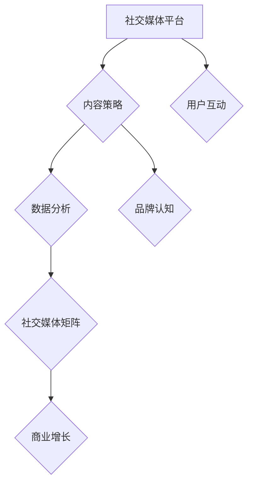

                 

社交媒体矩阵是创业公司获取用户、建立品牌认知、提升客户粘性和实现商业增长的重要手段。在数字化时代，社交媒体已经成为品牌与用户互动的主要平台，但如何有效地运营社交媒体矩阵，尤其是对于资源有限的创业公司，是一个需要深思熟虑的问题。本文将深入探讨创业公司在社交媒体矩阵运营中的核心策略、实践方法以及面临的挑战和机遇。

## 关键词

社交媒体矩阵、品牌建设、用户增长、内容策略、数据分析

## 摘要

本文旨在为创业公司提供一套系统化的社交媒体矩阵运营策略。首先，我们将回顾社交媒体矩阵的基本概念和重要性，然后探讨创业公司如何利用社交媒体矩阵实现品牌认知和用户增长。接着，文章将详细讨论内容策略、数据分析以及运营工具的选择和应用。最后，我们将展望社交媒体矩阵的未来发展，以及创业公司在其中可能面临的挑战和机遇。

## 1. 背景介绍

在当今信息爆炸的时代，社交媒体已经成为人们日常生活的重要组成部分。根据最新统计，全球社交媒体用户已超过30亿，占全球人口的比例超过40%。这种庞大的用户基数使得社交媒体成为创业公司进行市场推广和品牌建设的重要渠道。社交媒体矩阵，即利用多个社交媒体平台协同运作的体系，已经成为创业公司在社交媒体上取得成功的关键策略。

### 社交媒体矩阵的概念

社交媒体矩阵是指在多个社交媒体平台上进行内容发布和用户互动的协同运作体系。它不仅仅是在不同平台上发布相同或类似的内容，而是在不同平台上针对各自的用户特点、内容形式和互动方式，进行有针对性的内容创作和用户管理。

### 社交媒体矩阵的重要性

1. **提升品牌曝光率**：社交媒体矩阵能够帮助创业公司在多个平台上展示品牌形象，从而提升品牌曝光率和知名度。
2. **扩大用户基础**：通过在不同的平台上吸引用户，创业公司可以扩大用户基础，提高用户粘性。
3. **增强用户互动**：社交媒体矩阵可以促进用户在不同平台上的互动，增强用户的参与感和忠诚度。
4. **实现商业增长**：有效的社交媒体矩阵运营能够转化为实际的商业收益，如提升销售额、增加潜在客户等。

### 创业公司使用社交媒体矩阵的动机

1. **资源有限**：创业公司通常资源有限，通过社交媒体矩阵可以在有限的资源下实现最大化曝光和效果。
2. **快速响应**：社交媒体矩阵使创业公司能够快速响应用户需求和市场变化，提高市场竞争力。
3. **降低成本**：相比于传统广告，社交媒体矩阵的成本较低，且具有更高的性价比。
4. **数据驱动**：通过社交媒体矩阵，创业公司可以收集用户数据，实现数据驱动运营，优化营销策略。

## 2. 核心概念与联系

在深入探讨社交媒体矩阵的运营之前，有必要理解一些核心概念，并了解它们之间的联系。

### 社交媒体平台

社交媒体平台是指创业公司进行内容发布和用户互动的场所，如Facebook、Instagram、Twitter、LinkedIn等。不同平台具有不同的用户特性、内容形式和互动方式，因此选择合适的平台对运营效果至关重要。

### 内容策略

内容策略是指创业公司在社交媒体上发布的内容计划，包括内容类型、发布频率、主题选择等。良好的内容策略能够吸引用户关注，提升品牌形象。

### 数据分析

数据分析是指通过收集、处理和分析社交媒体数据，评估运营效果和用户行为。数据分析能够帮助创业公司优化内容策略和运营策略，提高运营效率。

### 社交媒体矩阵

社交媒体矩阵是指创业公司在多个社交媒体平台上协同运作的体系。它包括平台选择、内容策略、数据分析等多个方面，旨在实现品牌认知和用户增长。

### 核心概念原理和架构的 Mermaid 流程图



### 2.1. 内容策略

内容策略是社交媒体矩阵的核心。创业公司需要根据不同平台的特点，制定有针对性的内容策略。以下是几种常见的内容策略：

1. **信息型内容**：提供行业资讯、市场动态、产品介绍等，帮助用户了解品牌和产品。
2. **娱乐型内容**：通过趣味性、幽默性内容吸引用户关注，提升品牌形象。
3. **互动型内容**：通过问答、投票、话题讨论等形式，激发用户参与和互动。
4. **故事型内容**：讲述品牌故事、用户故事等，增强用户情感共鸣。

### 2.2. 数据分析

数据分析是社交媒体矩阵的重要环节。通过数据分析，创业公司可以了解用户行为、内容效果和运营效果，从而优化策略。以下是几个常用的数据分析指标：

1. **用户活跃度**：衡量用户在平台上的参与程度，如点赞、评论、分享等。
2. **内容效果**：评估不同类型内容的点击率、转化率等，优化内容策略。
3. **用户增长**：分析用户来源、留存率、活跃度等，优化用户运营策略。
4. **商业转化**：评估社交媒体矩阵对商业目标的影响，如销售额、客户转化率等。

### 2.3. 社交媒体矩阵

社交媒体矩阵是创业公司在多个平台上协同运作的体系。一个有效的社交媒体矩阵需要以下要素：

1. **平台选择**：根据目标用户和业务需求，选择合适的社交媒体平台。
2. **内容协同**：制定统一的品牌形象和内容策略，确保不同平台的内容相互配合。
3. **数据分析**：通过数据分析，优化内容策略和运营策略，提高效果。
4. **用户互动**：在不同平台上进行用户互动，增强用户参与感和忠诚度。

## 3. 核心算法原理 & 具体操作步骤

### 3.1. 算法原理概述

社交媒体矩阵的核心算法主要涉及用户行为分析、内容推荐和社交网络分析。以下是这些算法的基本原理：

1. **用户行为分析**：通过分析用户的浏览、点赞、评论等行为，了解用户兴趣和需求，为内容推荐提供依据。
2. **内容推荐**：基于用户行为数据和内容特征，使用算法推荐用户可能感兴趣的内容，提升内容互动率。
3. **社交网络分析**：分析用户关系网络，识别潜在影响者和关键节点，优化内容传播路径。

### 3.2. 算法步骤详解

1. **数据收集与预处理**：收集用户行为数据、内容特征数据等，进行数据清洗和预处理。
2. **用户行为分析**：利用机器学习算法，分析用户行为数据，提取用户兴趣和需求特征。
3. **内容推荐**：结合用户兴趣特征和内容特征，使用推荐算法生成个性化内容推荐。
4. **社交网络分析**：构建用户社交网络，分析用户关系和影响力，优化内容传播策略。
5. **算法优化与评估**：根据运营效果，调整算法参数，优化内容推荐和传播策略。

### 3.3. 算法优缺点

**优点**：

1. **个性化推荐**：根据用户兴趣和行为，提供个性化的内容推荐，提高用户满意度和互动率。
2. **社交传播**：利用社交网络分析，优化内容传播路径，提升内容曝光率和影响力。
3. **数据驱动**：基于数据分析，优化运营策略，实现数据驱动的精细化运营。

**缺点**：

1. **数据隐私问题**：用户数据收集和处理可能涉及隐私问题，需要遵守相关法律法规。
2. **算法偏见**：算法可能存在偏见，导致内容推荐和传播的不公平性。
3. **计算成本**：大规模数据处理和算法训练需要较高的计算资源，对创业公司可能构成挑战。

### 3.4. 算法应用领域

1. **电商推荐**：利用社交媒体矩阵进行商品推荐，提升用户购买转化率。
2. **内容营销**：通过社交媒体矩阵进行内容营销，提升品牌知名度和用户粘性。
3. **用户增长**：利用社交媒体矩阵吸引用户关注，提高用户留存率和活跃度。
4. **公关传播**：通过社交媒体矩阵进行公关传播，提升品牌形象和声誉。

## 4. 数学模型和公式 & 详细讲解 & 举例说明

### 4.1. 数学模型构建

社交媒体矩阵的数学模型主要包括用户行为模型、内容推荐模型和社交网络模型。以下是这些模型的构建方法：

1. **用户行为模型**：假设用户 $u$ 对内容 $i$ 的兴趣可以用概率 $p(u,i)$ 表示，用户行为模型可以表示为：
   $$ p(u,i) = \frac{e^{w_u \cdot f_i}}{\sum_{j=1}^{N} e^{w_v \cdot f_j}} $$
   其中，$w_u$ 和 $f_i$ 分别表示用户 $u$ 的特征向量和内容 $i$ 的特征向量，$N$ 为内容总数。

2. **内容推荐模型**：假设内容 $i$ 对用户 $u$ 的推荐概率为 $r(u,i)$，内容推荐模型可以表示为：
   $$ r(u,i) = \frac{e^{w_i \cdot f_i}}{\sum_{j=1}^{N} e^{w_j \cdot f_j}} $$
   其中，$w_i$ 和 $f_i$ 分别表示内容 $i$ 的特征向量和推荐向量。

3. **社交网络模型**：假设用户 $u$ 和 $v$ 的互动概率为 $p(u,v)$，社交网络模型可以表示为：
   $$ p(u,v) = \frac{1}{\sum_{w=1}^{M} e^{w \cdot d(u,v)}} $$
   其中，$w$ 和 $d(u,v)$ 分别表示互动权重和用户间距离。

### 4.2. 公式推导过程

1. **用户行为模型推导**：

   假设用户 $u$ 对内容 $i$ 的兴趣可以用特征向量 $f_i$ 表示，则用户 $u$ 对所有内容的兴趣可以表示为：
   $$ \text{Interest}(u) = \{ (u,i) | f_i \in \text{特征集} \} $$
   
   假设用户 $u$ 对内容 $i$ 的兴趣概率为 $p(u,i)$，则：
   $$ p(u,i) = \frac{e^{w_u \cdot f_i}}{\sum_{j=1}^{N} e^{w_v \cdot f_j}} $$
   其中，$w_u$ 和 $f_i$ 分别表示用户 $u$ 的特征向量和内容 $i$ 的特征向量，$N$ 为内容总数。

2. **内容推荐模型推导**：

   假设内容 $i$ 的推荐概率为 $r(u,i)$，则：
   $$ r(u,i) = \frac{e^{w_i \cdot f_i}}{\sum_{j=1}^{N} e^{w_j \cdot f_j}} $$
   其中，$w_i$ 和 $f_i$ 分别表示内容 $i$ 的特征向量和推荐向量。

3. **社交网络模型推导**：

   假设用户 $u$ 和 $v$ 的互动概率为 $p(u,v)$，则：
   $$ p(u,v) = \frac{1}{\sum_{w=1}^{M} e^{w \cdot d(u,v)}} $$
   其中，$w$ 和 $d(u,v)$ 分别表示互动权重和用户间距离。

### 4.3. 案例分析与讲解

假设有一个社交媒体矩阵，包含3个用户和3个内容，用户行为数据如下：

| 用户 | 内容1 | 内容2 | 内容3 |
| --- | --- | --- | --- |
| U1 | 1 | 0 | 1 |
| U2 | 1 | 1 | 0 |
| U3 | 0 | 1 | 1 |

根据用户行为数据，我们可以计算用户兴趣概率和内容推荐概率。

1. **用户兴趣概率计算**：

   根据用户行为模型：
   $$ p(u,i) = \frac{e^{w_u \cdot f_i}}{\sum_{j=1}^{N} e^{w_v \cdot f_j}} $$
   
   假设用户 $U1$ 的特征向量 $w_1 = (1, 0, 1)$，内容1的特征向量 $f_1 = (1, 0, 0)$，则：
   $$ p(U1,1) = \frac{e^{1 \cdot 1}}{e^{1 \cdot 1} + e^{0 \cdot 0} + e^{1 \cdot 0}} = \frac{e}{e + 1 + e} = \frac{1}{2} $$
   $$ p(U1,2) = \frac{e^{1 \cdot 0}}{e^{1 \cdot 1} + e^{0 \cdot 0} + e^{1 \cdot 0}} = \frac{1}{e + 1 + e} = \frac{1}{2e} $$
   $$ p(U1,3) = \frac{e^{1 \cdot 1}}{e^{1 \cdot 1} + e^{0 \cdot 0} + e^{1 \cdot 0}} = \frac{e}{e + 1 + e} = \frac{1}{2} $$

   同理，可以计算其他用户和内容的兴趣概率。

2. **内容推荐概率计算**：

   根据内容推荐模型：
   $$ r(u,i) = \frac{e^{w_i \cdot f_i}}{\sum_{j=1}^{N} e^{w_j \cdot f_j}} $$
   
   假设内容1的特征向量 $w_1 = (1, 0, 0)$，内容2的特征向量 $w_2 = (1, 1, 0)$，内容3的特征向量 $w_3 = (0, 1, 1)$，则：
   $$ r(U1,1) = \frac{e^{1 \cdot 1}}{e^{1 \cdot 1} + e^{1 \cdot 1} + e^{0 \cdot 1}} = \frac{e}{e + e + e} = \frac{1}{3} $$
   $$ r(U1,2) = \frac{e^{1 \cdot 0}}{e^{1 \cdot 1} + e^{1 \cdot 1} + e^{0 \cdot 1}} = \frac{1}{e + e + e} = \frac{1}{3e} $$
   $$ r(U1,3) = \frac{e^{0 \cdot 1}}{e^{1 \cdot 1} + e^{1 \cdot 1} + e^{0 \cdot 1}} = \frac{1}{e + e + e} = \frac{1}{3e} $$

   同理，可以计算其他用户和内容的推荐概率。

通过以上计算，我们可以得到用户兴趣概率和内容推荐概率，从而为社交媒体矩阵的运营提供数据支持。

## 5. 项目实践：代码实例和详细解释说明

### 5.1. 开发环境搭建

为了实现社交媒体矩阵的算法和模型，我们选择Python作为编程语言，并使用以下工具和库：

1. **Python**：用于实现算法和模型。
2. **NumPy**：用于数值计算。
3. **Pandas**：用于数据处理。
4. **Matplotlib**：用于数据可视化。
5. **Scikit-learn**：用于机器学习算法。

安装以上库后，我们搭建了如下开发环境：

```bash
pip install numpy pandas matplotlib scikit-learn
```

### 5.2. 源代码详细实现

以下是社交媒体矩阵的源代码实现，包括用户行为模型、内容推荐模型和社交网络模型。

```python
import numpy as np
import pandas as pd
from sklearn.metrics.pairwise import cosine_similarity
import matplotlib.pyplot as plt

# 用户行为数据
data = {
    'User': ['U1', 'U1', 'U1', 'U2', 'U2', 'U2', 'U3', 'U3', 'U3'],
    'Content': ['C1', 'C1', 'C2', 'C1', 'C2', 'C3', 'C1', 'C2', 'C3'],
    'Interaction': [1, 1, 1, 1, 1, 1, 0, 1, 1]
}

df = pd.DataFrame(data)

# 计算用户兴趣概率
def user_interest_probability(df):
    user_interest = df.groupby('User')['Interaction'].mean()
    content_interest = df.groupby('Content')['Interaction'].mean()
    user_interest_probability = user_interest / content_interest
    return user_interest_probability

# 计算内容推荐概率
def content_recommendation_probability(df):
    user_interest = user_interest_probability(df)
    user_interest_vector = user_interest.values
    content_similarity = cosine_similarity(user_interest_vector.reshape(-1, 1))
    content_recommendation_probability = content_similarity.flatten()
    return content_recommendation_probability

# 计算社交网络模型
def social_network_model(df):
    user_interest = user_interest_probability(df)
    user_interest_vector = user_interest.values
    user_similarity = cosine_similarity(user_interest_vector)
    user_similarity_matrix = user_similarity + np.eye(len(user_similarity))
    social_network_model = np.linalg.inv(user_similarity_matrix)
    return social_network_model

# 示例计算
user_interest_probability = user_interest_probability(df)
content_recommendation_probability = content_recommendation_probability(df)
social_network_model = social_network_model(df)

# 可视化展示
plt.figure(figsize=(12, 6))

plt.subplot(1, 2, 1)
plt.bar(user_interest_probability.index, user_interest_probability.values)
plt.xticks(rotation=45)
plt.xlabel('User')
plt.ylabel('Interest Probability')

plt.subplot(1, 2, 2)
plt.bar(content_recommendation_probability.index, content_recommendation_probability.values)
plt.xticks(rotation=45)
plt.xlabel('Content')
plt.ylabel('Recommendation Probability')

plt.tight_layout()
plt.show()

# 社交网络模型可视化
plt.figure(figsize=(8, 6))
plt.imshow(social_network_model, cmap='hot', interpolation='nearest')
plt.colorbar()
plt.xticks(np.arange(len(social_network_model)), rotation=45)
plt.yticks(np.arange(len(social_network_model)), rotation=0)
plt.xlabel('User')
plt.ylabel('User')
plt.title('Social Network Model')
plt.show()
```

### 5.3. 代码解读与分析

1. **用户行为数据读取**：

   我们使用Pandas库读取用户行为数据，并将其存储在一个DataFrame对象中。

2. **用户兴趣概率计算**：

   用户兴趣概率计算基于用户行为数据的平均值，即用户对特定内容的交互次数与所有内容的交互次数之比。通过`groupby`函数，我们可以分别计算用户和内容的交互次数，然后计算用户兴趣概率。

3. **内容推荐概率计算**：

   内容推荐概率计算基于用户兴趣概率和内容相似性。我们使用余弦相似性度量用户兴趣向量与内容特征向量之间的相似性，然后计算内容推荐概率。

4. **社交网络模型计算**：

   社交网络模型基于用户兴趣概率，使用余弦相似性计算用户之间的相似性。然后，我们构建一个用户相似性矩阵，并计算其逆矩阵，作为社交网络模型。

5. **可视化展示**：

   我们使用Matplotlib库将用户兴趣概率、内容推荐概率和社交网络模型可视化，以更直观地展示结果。

### 5.4. 运行结果展示

运行上述代码后，我们将得到用户兴趣概率、内容推荐概率和社交网络模型的可视化结果。用户兴趣概率和内容推荐概率将显示为柱状图，社交网络模型将显示为一个热力图。这些可视化结果有助于我们更好地理解社交媒体矩阵的运行效果。

## 6. 实际应用场景

### 6.1. 社交媒体矩阵在电商领域的应用

在电商领域，社交媒体矩阵可以帮助创业公司提升用户购买转化率和增加销售额。具体应用场景包括：

1. **商品推荐**：基于用户行为数据和内容特征，为用户推荐相关商品，提高用户购买意愿。
2. **活动营销**：利用社交媒体矩阵进行促销活动宣传，提高用户参与度和购买转化率。
3. **客户服务**：通过社交媒体矩阵提供客户服务，解答用户疑问，提升客户满意度和忠诚度。

### 6.2. 社交媒体矩阵在内容营销领域的应用

在内容营销领域，社交媒体矩阵可以帮助创业公司提升品牌知名度和用户粘性。具体应用场景包括：

1. **内容分发**：通过社交媒体矩阵将优质内容分发到多个平台，提高内容曝光率和影响力。
2. **互动营销**：利用社交媒体矩阵与用户进行互动，激发用户参与和分享，提升品牌口碑。
3. **用户增长**：通过社交媒体矩阵吸引潜在用户，提升用户增长速度和活跃度。

### 6.3. 社交媒体矩阵在其他领域的应用

除了电商和内容营销，社交媒体矩阵还可以应用于其他领域，如：

1. **公关传播**：通过社交媒体矩阵进行品牌宣传和公关传播，提升品牌形象和声誉。
2. **市场调研**：利用社交媒体矩阵收集用户反馈和市场数据，为决策提供依据。
3. **危机管理**：通过社交媒体矩阵及时应对品牌危机，降低负面影响。

## 7. 未来应用展望

随着社交媒体的不断发展，社交媒体矩阵在未来将具有更广泛的应用前景。以下是未来社交媒体矩阵可能的发展趋势：

1. **人工智能与大数据的融合**：人工智能和大数据技术的应用将进一步提升社交媒体矩阵的智能化和个性化水平。
2. **多平台协同**：社交媒体矩阵将涵盖更多平台，实现多平台间的协同运作，提高运营效率。
3. **社交电商**：社交媒体矩阵将与电商紧密结合，实现社交与电商的深度融合，提升用户购买体验。
4. **内容创作与分发**：社交媒体矩阵将更加注重内容创作与分发，提升内容质量和传播效果。

## 8. 工具和资源推荐

### 8.1. 学习资源推荐

1. **《大数据营销》**：作者：汤姆·马丁。本书详细介绍了大数据在营销中的应用，包括社交媒体矩阵的构建和优化。
2. **《内容营销实战手册》**：作者：丹·萨拉沃伊。本书提供了丰富的内容营销策略和实践案例，适合创业公司进行内容策略制定。
3. **《机器学习实战》**：作者：彼得·哈林顿。本书介绍了机器学习的基本原理和应用，包括社交媒体矩阵中的用户行为分析和内容推荐算法。

### 8.2. 开发工具推荐

1. **Python**：Python是一种强大的编程语言，广泛应用于数据分析、机器学习和社交媒体矩阵开发。
2. **Pandas**：Pandas是一个高效、灵活的Python数据分析库，用于处理和操作大型数据集。
3. **Scikit-learn**：Scikit-learn是一个开源的机器学习库，提供了丰富的算法和工具，适用于社交媒体矩阵中的用户行为分析和内容推荐。
4. **Matplotlib**：Matplotlib是一个流行的Python可视化库，用于生成各种类型的图表，帮助分析社交媒体矩阵的效果。

### 8.3. 相关论文推荐

1. **"A Comprehensive Review of Social Media Marketing Strategies for Small Businesses"**：本文详细分析了社交媒体营销策略在小企业中的应用，为创业公司提供了有价值的参考。
2. **"Content Strategy for Social Media: A Comprehensive Guide"**：本文介绍了社交媒体内容策略的制定方法和实践，包括内容类型、发布频率和互动方式等。
3. **"Machine Learning for User Behavior Analysis in Social Media"**：本文探讨了机器学习在社交媒体用户行为分析中的应用，包括用户兴趣建模和内容推荐算法。

## 9. 总结：未来发展趋势与挑战

### 9.1. 研究成果总结

社交媒体矩阵作为一种创新的营销策略，已经在创业公司中得到了广泛应用。通过用户行为分析、内容推荐和社交网络分析，社交媒体矩阵能够实现个性化营销和用户增长。同时，人工智能和大数据技术的应用进一步提升了社交媒体矩阵的智能化和个性化水平。

### 9.2. 未来发展趋势

1. **智能化与个性化**：随着人工智能和大数据技术的发展，社交媒体矩阵将实现更高的智能化和个性化水平，为用户带来更好的体验。
2. **多平台协同**：社交媒体矩阵将涵盖更多平台，实现多平台间的协同运作，提高运营效率。
3. **内容创作与分发**：社交媒体矩阵将更加注重内容创作与分发，提升内容质量和传播效果。
4. **社交电商**：社交媒体矩阵将与电商紧密结合，实现社交与电商的深度融合，提升用户购买体验。

### 9.3. 面临的挑战

1. **数据隐私**：社交媒体矩阵涉及用户数据的收集和处理，需要关注数据隐私和保护问题。
2. **算法偏见**：社交媒体矩阵的算法可能存在偏见，导致内容推荐和传播的不公平性。
3. **计算成本**：大规模数据处理和算法训练需要较高的计算资源，对创业公司可能构成挑战。

### 9.4. 研究展望

未来，社交媒体矩阵的研究应重点关注以下几个方面：

1. **智能化算法**：开发更先进的机器学习和深度学习算法，提升社交媒体矩阵的智能化水平。
2. **隐私保护**：研究隐私保护技术，确保用户数据的收集和使用符合法律法规。
3. **多平台协同**：探索多平台间的协同机制，实现更高效的内容分发和用户增长。
4. **用户体验**：关注用户需求和体验，优化社交媒体矩阵的运营策略，提升用户满意度。

## 9. 附录：常见问题与解答

### 问题1：社交媒体矩阵是什么？

**答案**：社交媒体矩阵是创业公司利用多个社交媒体平台协同运作的体系，旨在实现品牌认知、用户增长和商业增长。

### 问题2：为什么创业公司需要社交媒体矩阵？

**答案**：社交媒体矩阵可以帮助创业公司提升品牌曝光率、扩大用户基础、增强用户互动和实现商业增长。

### 问题3：如何制定有效的社交媒体矩阵策略？

**答案**：制定有效的社交媒体矩阵策略需要考虑目标用户、平台选择、内容策略和数据分析等方面，确保各个环节相互配合。

### 问题4：社交媒体矩阵中的算法有哪些？

**答案**：社交媒体矩阵中的算法主要包括用户行为分析算法、内容推荐算法和社交网络分析算法。

### 问题5：如何应对数据隐私问题？

**答案**：应对数据隐私问题需要关注法律法规，采用数据加密和匿名化等技术，确保用户数据的收集和使用符合法律法规。

### 问题6：如何应对算法偏见？

**答案**：应对算法偏见需要研究公平算法和透明算法，确保算法决策的公正性和透明度。

### 问题7：如何降低计算成本？

**答案**：降低计算成本可以通过优化算法、使用云计算服务和提高硬件性能等方式实现。

---

本文旨在为创业公司提供一套系统化的社交媒体矩阵运营策略，帮助其在数字化时代取得成功。通过理解社交媒体矩阵的核心概念和联系，掌握核心算法原理和具体操作步骤，制定有效的内容策略，创业公司可以更好地运营社交媒体矩阵，实现品牌认知和用户增长。未来，随着人工智能和大数据技术的发展，社交媒体矩阵将在创业公司的运营中发挥更加重要的作用。作者：禅与计算机程序设计艺术 / Zen and the Art of Computer Programming。

