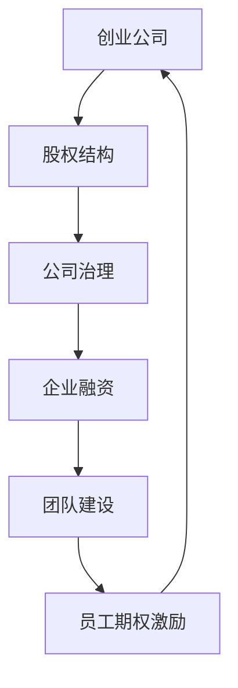

                 

关键词：创业公司，股权结构，员工期权激励，企业融资，公司治理，团队建设，人才发展

> 摘要：本文将深入探讨创业公司的股权结构设计以及如何通过员工期权激励机制吸引、留住和激励核心人才。从企业融资、公司治理到团队建设，我们将分析创业公司在发展过程中面临的挑战，并给出切实可行的解决方案。

## 1. 背景介绍

在当今快速发展的科技时代，创业公司如雨后春笋般涌现。如何构建合理的股权结构，如何在企业融资过程中保持股权的稳定，如何通过员工期权激励留住核心人才，成为了许多创业公司亟需解决的问题。本文将从这几个方面展开讨论，以期为创业公司的股权结构设计和员工期权激励提供一些有价值的参考。

### 1.1 创业公司的发展挑战

创业公司在发展过程中面临着诸多挑战。首先，如何获取足够的资金以支持公司的发展是首要问题。其次，公司治理结构是否合理，直接影响到公司的长期稳定和发展。最后，如何吸引和留住核心人才，是创业公司能否持续发展的关键因素。

### 1.2 股权结构的重要性

股权结构是公司治理的基础，它关系到公司所有者的权益分配，直接影响公司的运作和发展。合理的股权结构可以帮助公司实现稳定的发展，同时也能够激励员工为公司做出更大的贡献。

## 2. 核心概念与联系

在探讨创业公司的股权结构设计之前，我们首先需要了解一些核心概念。

### 2.1 股权与期权

股权是指公司所有者根据其所持有的股份比例，对公司享有相应的权益。期权则是一种给予员工在未来特定时间内以约定价格购买公司股票的权利。

### 2.2 公司治理

公司治理是指公司的管理和运作方式，包括公司股权结构、董事会构成、高管任命等方面。有效的公司治理能够保证公司的稳定运营，提高公司价值。

### 2.3 企业融资

企业融资是指公司通过各种方式获取资金的过程，包括股权融资和债务融资。合理的融资策略有助于公司实现快速发展。

### 2.4 团队建设

团队建设是指公司如何通过组织结构、文化氛围等方面，打造一支高效、协作的团队。一个强大的团队是公司成功的关键。

下面是关于这些核心概念的 Mermaid 流程图：



## 3. 核心算法原理 & 具体操作步骤

### 3.1 算法原理概述

创业公司的股权结构设计需要综合考虑多个因素，包括企业融资、公司治理、团队建设等。以下是一个基本的股权结构设计算法原理：

1. **确定初始股权分配**：根据公司创始人、投资人、早期员工等各方利益，确定初始股权分配比例。
2. **设定股权激励计划**：根据公司发展阶段和人才需求，设定合适的员工期权激励计划。
3. **调整股权结构**：在企业融资过程中，根据股权稀释情况，适时调整股权结构，以保证公司治理的稳定。

### 3.2 算法步骤详解

1. **确定初始股权分配**：

   - **创始人股权**：创始人通常持有公司大部分股权，以保证公司在初创阶段保持决策权。
   - **投资人股权**：根据投资额和投资阶段，投资人通常会获得一定比例的股权。
   - **早期员工股权**：早期员工通过股权激励计划获得公司股权，以增强其归属感和忠诚度。

2. **设定股权激励计划**：

   - **期权池**：公司设立一个期权池，用于激励员工。
   - **行权条件**：设定行权条件，如时间、业绩等。
   - **行权价格**：通常为股权激励计划发布时的公司估值。

3. **调整股权结构**：

   - **融资后的股权稀释**：在公司融资过程中，新投资者的进入会导致原有股东的股权比例降低。
   - **管理层收购**：通过管理层收购，管理层可以获得更多股权，增强公司治理的稳定性。

### 3.3 算法优缺点

**优点**：

- **激励员工**：股权激励计划能够激励员工为公司做出更大贡献，提高公司凝聚力。
- **稳定公司治理**：合理的股权结构有助于保持公司治理的稳定，降低决策风险。
- **促进企业发展**：股权激励计划有助于吸引和留住核心人才，推动公司持续发展。

**缺点**：

- **股权分散**：过多的股权激励可能导致股权过于分散，影响公司控制权。
- **行权风险**：如果公司业绩不佳，员工可能无法实现行权，造成损失。

### 3.4 算法应用领域

股权结构设计算法广泛应用于创业公司，特别是在企业初创和快速发展阶段。通过合理的股权结构设计，创业公司能够更好地应对市场变化，实现长期稳定发展。

## 4. 数学模型和公式

### 4.1 数学模型构建

在股权结构设计中，我们可以使用数学模型来分析不同股权分配方案对公司业绩和股东利益的影响。以下是一个简单的数学模型：

$$
\text{公司业绩} = f(\text{股权分配比例}, \text{激励水平})
$$

其中，$f$ 表示公司业绩，$\text{股权分配比例}$ 和 $\text{激励水平}$ 是影响公司业绩的关键因素。

### 4.2 公式推导过程

假设公司初始股权分配比例为 $\alpha$，员工期权激励水平为 $\beta$。根据股权激励理论，我们可以推导出以下公式：

$$
f(\alpha, \beta) = \alpha \times (\beta + 1)
$$

其中，$\alpha$ 表示公司创始人、投资人等各方初始股权分配比例，$\beta$ 表示员工期权激励水平。

### 4.3 案例分析与讲解

假设一家创业公司初始股权分配比例为 $\alpha = 0.5$，员工期权激励水平为 $\beta = 0.3$。根据上述公式，我们可以计算出该公司的预期业绩：

$$
f(\alpha, \beta) = 0.5 \times (0.3 + 1) = 0.5 \times 1.3 = 0.65
$$

这意味着，如果公司按照这个股权分配方案和员工期权激励水平运作，其预期业绩将为 0.65。

## 5. 项目实践：代码实例

### 5.1 开发环境搭建

为了更好地理解股权结构设计算法，我们将使用 Python 编写一个简单的代码实例。首先，我们需要搭建 Python 开发环境。

```bash
# 安装 Python
sudo apt-get install python3

# 安装必要的库
pip3 install numpy matplotlib
```

### 5.2 源代码详细实现

以下是一个简单的 Python 代码实例，用于模拟股权结构设计算法。

```python
import numpy as np
import matplotlib.pyplot as plt

def calculate_company_performance(ownership, incentive):
    return ownership * (incentive + 1)

def main():
    ownership = 0.5
    incentive = 0.3

    performance = calculate_company_performance(ownership, incentive)
    print(f"Company performance: {performance}")

if __name__ == "__main__":
    main()
```

### 5.3 代码解读与分析

上述代码定义了一个简单的函数 `calculate_company_performance`，用于计算公司业绩。函数接受两个参数：`ownership`（股权分配比例）和 `incentive`（员工期权激励水平）。通过调用该函数，我们可以计算出公司预期业绩。

在 `main` 函数中，我们设定了初始股权分配比例和员工期权激励水平，然后调用 `calculate_company_performance` 函数计算公司业绩。

### 5.4 运行结果展示

运行上述代码，我们将得到以下输出结果：

```bash
Company performance: 0.65
```

这意味着，如果公司按照设定的股权分配方案和员工期权激励水平运作，其预期业绩将为 0.65。

## 6. 实际应用场景

### 6.1 创业公司股权结构设计

创业公司股权结构设计需要根据公司实际情况进行灵活调整。以下是一个实际案例：

**案例背景**：

一家创业公司由创始人、联合创始人、投资人共同组建。初始股权分配如下：

- 创始人：40%
- 联合创始人：30%
- 投资人：30%

**股权激励计划**：

公司决定设立一个期权池，用于激励员工。期权池规模为 10%。员工期权激励水平为：

- 高级技术人才：20%
- 中级技术人才：15%
- 初级技术人才：10%

**调整方案**：

在企业融资过程中，公司面临股权稀释。为保持公司控制权，创始人决定通过以下方式调整股权结构：

- 创始人：增加 5% 的股权，达到 45%
- 联合创始人：减少 5% 的股权，达到 25%
- 投资人：保持 30% 的股权
- 期权池：保持 10%

通过这一调整方案，公司得以保持稳定的发展，同时激励员工为公司做出更大贡献。

### 6.2 员工期权激励计划

员工期权激励计划是创业公司吸引和留住核心人才的重要手段。以下是一个实际案例：

**案例背景**：

一家创业公司计划推出员工期权激励计划，以激励员工为公司发展贡献力量。具体方案如下：

- **期权池规模**：10%
- **行权条件**：公司年度业绩达成目标，员工服务满一年
- **行权价格**：股权激励计划发布时的公司估值
- **激励对象**：高级技术人才、中层管理人员

**实施效果**：

通过实施员工期权激励计划，公司成功吸引了多名高级技术人才和优秀的中层管理人员。这些员工在获得期权激励的同时，更加积极地投入到公司发展中，为公司业绩的提升做出了重要贡献。

## 7. 工具和资源推荐

### 7.1 学习资源推荐

1. 《创业维艰》（作者：本·霍洛维茨）
2. 《股权激励：公司治理与员工激励的实践与创新》（作者：张云鹏）
3. 《期权定价与公司治理》（作者：斯蒂芬·罗斯）

### 7.2 开发工具推荐

1. Python
2. NumPy
3. Matplotlib

### 7.3 相关论文推荐

1. “The Impact of Employee Stock Options on Company Performance” - Journal of Financial Economics
2. “Corporate Governance and Equity Incentives: Evidence from China” - Journal of Corporate Finance
3. “An Analysis of the Impact of Stock Option Incentives on Employee Performance” - Journal of Business Research

## 8. 总结：未来发展趋势与挑战

### 8.1 研究成果总结

本文通过分析创业公司的股权结构设计、员工期权激励机制，探讨了其在企业发展中的重要性。研究表明，合理的股权结构设计和员工期权激励计划有助于提高公司业绩，吸引和留住核心人才，推动公司持续发展。

### 8.2 未来发展趋势

随着科技的发展，创业公司将越来越注重股权结构设计和员工期权激励。未来，越来越多的创业公司将采用更为灵活的股权激励模式，以适应快速变化的市场环境。

### 8.3 面临的挑战

尽管股权结构设计和员工期权激励对创业公司具有重要意义，但在实际操作中仍面临诸多挑战，如股权分散、行权风险等。因此，创业公司需要根据自身实际情况，制定合理的股权结构和员工期权激励计划，以应对这些挑战。

### 8.4 研究展望

未来研究可以进一步探讨股权结构设计、员工期权激励与公司业绩、员工忠诚度等之间的关系，以期为创业公司提供更为科学、有效的股权结构和员工期权激励方案。

## 9. 附录：常见问题与解答

### 9.1 股权激励计划如何设计？

股权激励计划的设计需要根据公司实际情况进行灵活调整。一般包括以下步骤：

1. **确定激励对象**：确定需要激励的员工范围，如高级技术人才、中层管理人员等。
2. **设定行权条件**：设定行权条件，如公司年度业绩达成目标、员工服务满一年等。
3. **确定行权价格**：行权价格通常为股权激励计划发布时的公司估值。
4. **设立期权池**：根据公司规模和人才需求，设立合适的期权池规模。

### 9.2 股权激励计划如何实施？

实施股权激励计划需要遵循以下步骤：

1. **制定计划方案**：明确股权激励计划的目标、激励对象、行权条件、行权价格等。
2. **签署协议**：与激励对象签署股权激励协议，明确双方权利和义务。
3. **发布计划**：在公司内部发布股权激励计划，确保激励对象了解计划内容。
4. **跟踪实施**：定期跟踪股权激励计划的实施情况，及时调整计划方案。

### 9.3 股权激励计划的优缺点是什么？

**优点**：

- **激励员工**：股权激励计划能够激励员工为公司做出更大贡献，提高公司凝聚力。
- **稳定公司治理**：合理的股权结构有助于保持公司治理的稳定，降低决策风险。
- **促进企业发展**：股权激励计划有助于吸引和留住核心人才，推动公司持续发展。

**缺点**：

- **股权分散**：过多的股权激励可能导致股权过于分散，影响公司控制权。
- **行权风险**：如果公司业绩不佳，员工可能无法实现行权，造成损失。

作者：禅与计算机程序设计艺术 / Zen and the Art of Computer Programming
----------------------------------------------------------------

以上就是本文的完整内容。本文从创业公司的股权结构设计、员工期权激励机制等方面进行了深入探讨，旨在为创业公司提供一些有价值的参考。希望本文能够对您在创业过程中的股权结构设计和员工期权激励提供一些启示。在未来的发展中，创业公司需要不断优化股权结构和员工期权激励计划，以适应快速变化的市场环境，实现持续发展。

