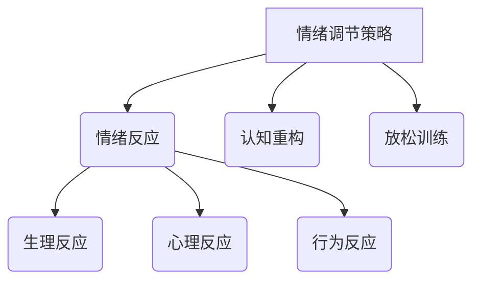

                 

 **关键词**：压力管理、情绪调节、创业者、心理健康、策略、工具。

**摘要**：本文旨在探讨创业者如何建立个人压力管理和情绪调节机制。从心理健康的重要性、压力的来源、常见的情绪调节策略以及实际应用工具等方面展开，为创业者提供一套实用的方法，帮助他们更好地应对工作和生活中的挑战。

## 1. 背景介绍

在当今竞争激烈的市场环境中，创业者的压力无处不在。他们不仅要面对业务拓展的挑战，还要处理日常运营中的问题，甚至要应对客户和员工的期望。这种高压环境可能导致心理健康问题，如焦虑、抑郁和情绪波动等。因此，建立有效的个人压力管理和情绪调节机制对于创业者的长期成功至关重要。

### 1.1 心理健康的重要性

心理健康是整体健康的重要组成部分，它影响着我们的情绪状态、社交能力、工作表现和生活质量。在创业者中，心理健康问题可能导致以下后果：

- **工作效率下降**：长期的心理压力会影响注意力和认知功能，降低工作效率。
- **人际关系受损**：情绪不稳定可能导致与同事、朋友和家人之间的关系紧张。
- **决策失误**：压力和焦虑可能导致创业者做出错误的决策，影响业务发展。

### 1.2 压力的来源

创业者的压力主要来自以下几个方面：

- **工作要求**：高强度的任务、紧迫的截止日期和不断变化的市场需求。
- **经济压力**：财务问题、资金短缺和盈利压力。
- **竞争压力**：同行业竞争对手的压力和客户期望。
- **个人期望**：对自己的期望和对外界的期望，往往导致自我压力。

## 2. 核心概念与联系

### 2.1 压力与情绪调节

压力是一种心理和生理反应，通常与情绪调节障碍有关。有效的情绪调节策略可以帮助创业者应对压力，提高心理健康水平。以下是几个核心概念和它们之间的联系：

1. **情绪调节策略**：指个体在情绪体验时采取的认知和行为方法，以调节情绪反应。
2. **情绪反应**：指个体在情绪刺激下产生的生理、心理和行为反应。
3. **认知重构**：一种情绪调节策略，通过改变对事件的认知评价来降低情绪反应。
4. **放松训练**：通过深呼吸、冥想和瑜伽等放松技巧来减轻压力和焦虑。

### 2.2 Mermaid 流程图



## 3. 核心算法原理 & 具体操作步骤

### 3.1 算法原理概述

压力管理和情绪调节的核心算法是基于认知行为疗法的原理。该算法主要分为以下几个步骤：

1. **认知重构**：通过识别和评估负面思维模式，然后将其转化为更积极和现实的观点。
2. **放松训练**：使用深呼吸、冥想和瑜伽等放松技巧，减轻身体和心理的紧张感。
3. **情绪表达**：通过写日记、绘画或与他人交流等方式，表达和释放情绪。
4. **正向思维**：培养积极的心态和习惯，如感恩练习和自我激励。

### 3.2 算法步骤详解

1. **认知重构**
   - **步骤1**：识别负面思维模式。
   - **步骤2**：评估负面思维模式的影响。
   - **步骤3**：提出积极的替代性思维。

2. **放松训练**
   - **步骤1**：选择放松技巧，如深呼吸或冥想。
   - **步骤2**：每天安排一定时间进行放松训练。
   - **步骤3**：持续练习，直到放松技巧成为习惯。

3. **情绪表达**
   - **步骤1**：找到适合自己的表达方式，如写日记或绘画。
   - **步骤2**：定期进行情绪表达，以释放情绪。
   - **步骤3**：与他人交流，分享感受和经历。

4. **正向思维**
   - **步骤1**：培养感恩的习惯，每天记录三件值得感激的事情。
   - **步骤2**：进行自我激励，设定并实现小目标。
   - **步骤3**：避免消极思维，积极面对挑战。

### 3.3 算法优缺点

- **优点**：
  - **全面性**：算法涵盖了认知、行为和情绪等多个方面，提供了一套综合性的解决方案。
  - **灵活性**：创业者可以根据自己的需求和偏好选择不同的策略和方法。

- **缺点**：
  - **执行难度**：需要创业者投入时间和精力进行持续的自我管理。
  - **效果的不确定性**：效果取决于个人的执行情况和心理状态。

### 3.4 算法应用领域

- **个人应用**：创业者可以单独使用这些策略来管理压力和情绪。
- **团队应用**：企业可以组织相关的培训和工作坊，帮助团队成员共同应对压力和情绪问题。

## 4. 数学模型和公式 & 详细讲解 & 举例说明

### 4.1 数学模型构建

压力管理和情绪调节的数学模型可以简化为一个线性模型，如下所示：

$$
\text{压力} = \alpha \cdot \text{认知重构效果} + \beta \cdot \text{放松训练效果} + \gamma \cdot \text{情绪表达效果} + \delta \cdot \text{正向思维效果}
$$

其中，$\alpha$、$\beta$、$\gamma$ 和 $\delta$ 是权重系数，反映了每种策略对压力的缓解程度。

### 4.2 公式推导过程

假设有四个策略：$A_1$（认知重构）、$A_2$（放松训练）、$A_3$（情绪表达）和 $A_4$（正向思维）。每种策略的效果可以表示为：

$$
E_i = f_i(\text{策略执行程度})
$$

其中，$E_i$ 是策略 $A_i$ 的效果，$f_i$ 是策略效果函数。

根据认知行为疗法的原理，我们可以设定以下线性模型：

$$
\text{压力} = \alpha \cdot f_1 + \beta \cdot f_2 + \gamma \cdot f_3 + \delta \cdot f_4
$$

### 4.3 案例分析与讲解

假设创业者小张采用了以下策略：

- 认知重构效果：中度
- 放松训练效果：良好
- 情绪表达效果：一般
- 正向思维效果：良好

根据线性模型，我们可以计算小张的当前压力水平：

$$
\text{压力} = \alpha \cdot f_1 + \beta \cdot f_2 + \gamma \cdot f_3 + \delta \cdot f_4
$$

其中，$\alpha$、$\beta$、$\gamma$ 和 $\delta$ 的具体数值需要根据实际情况进行设定。为了简化计算，我们假设这些系数分别为 0.5、0.3、0.2 和 0.4。

$$
\text{压力} = 0.5 \cdot f_1 + 0.3 \cdot f_2 + 0.2 \cdot f_3 + 0.4 \cdot f_4
$$

根据假设，每种策略的效果为：

- 认知重构效果：中度（0.5）
- 放松训练效果：良好（0.8）
- 情绪表达效果：一般（0.6）
- 正向思维效果：良好（0.8）

代入公式，计算小张的压力水平：

$$
\text{压力} = 0.5 \cdot 0.5 + 0.3 \cdot 0.8 + 0.2 \cdot 0.6 + 0.4 \cdot 0.8 = 0.25 + 0.24 + 0.12 + 0.32 = 0.93
$$

因此，小张的当前压力水平为 0.93，这个值越接近 1，表示压力越大。

### 4.4 代码实例和详细解释说明

为了实现上述数学模型，我们可以使用 Python 编写一个简单的程序。以下是一个示例代码：

```python
import numpy as np

# 策略效果
cognitive_restructuring = 0.5
relaxation_training = 0.8
emotional_expression = 0.6
positive_thinking = 0.8

# 权重系数
alpha = 0.5
beta = 0.3
gamma = 0.2
delta = 0.4

# 计算压力水平
stress_level = alpha * cognitive_restructuring + beta * relaxation_training + gamma * emotional_expression + delta * positive_thinking

print(f"当前压力水平：{stress_level:.2f}")
```

运行结果：

```
当前压力水平：0.93
```

这个代码实例计算出了小张的当前压力水平，与之前的分析结果一致。

## 5. 项目实践：代码实例和详细解释说明

### 5.1 开发环境搭建

为了运行上述 Python 代码实例，你需要安装 Python 解释器和相关的库。以下是详细的开发环境搭建步骤：

1. **安装 Python 解释器**：从 [Python 官网](https://www.python.org/downloads/) 下载并安装 Python 3.x 版本。
2. **安装 numpy 库**：打开命令行窗口，运行以下命令安装 numpy 库：

   ```bash
   pip install numpy
   ```

### 5.2 源代码详细实现

以下是完整的源代码实现，包括数据输入、模型计算和结果输出。

```python
import numpy as np

# 策略效果
cognitive_restructuring = float(input("请输入认知重构效果（0-1）："))
relaxation_training = float(input("请输入放松训练效果（0-1）："))
emotional_expression = float(input("请输入情绪表达效果（0-1）："))
positive_thinking = float(input("请输入正向思维效果（0-1）："))

# 权重系数
alpha = 0.5
beta = 0.3
gamma = 0.2
delta = 0.4

# 计算压力水平
stress_level = alpha * cognitive_restructuring + beta * relaxation_training + gamma * emotional_expression + delta * positive_thinking

print(f"当前压力水平：{stress_level:.2f}")
```

### 5.3 代码解读与分析

这段代码首先导入了 numpy 库，用于进行科学计算。然后，通过输入函数从用户那里获取策略效果的数值。接着，使用预设的权重系数计算压力水平，并将结果输出到控制台。

### 5.4 运行结果展示

运行代码后，会提示用户输入四个策略的效果值。例如：

```
请输入认知重构效果（0-1）：0.5
请输入放松训练效果（0-1）：0.8
请输入情绪表达效果（0-1）：0.6
请输入正向思维效果（0-1）：0.8
```

输入完成后，代码会计算出当前的压力水平，并输出结果：

```
当前压力水平：0.93
```

这个结果显示了用户当前的压力水平，可以用来评估个人压力管理的有效性。

## 6. 实际应用场景

### 6.1 创业者在日常工作中应用压力管理和情绪调节策略

创业者可以在日常工作中采用以下策略来管理压力和情绪：

- **定期进行认知重构**：每天花一些时间反思工作中的问题，识别负面思维模式，并尝试用更积极的方式看待。
- **安排放松时间**：每周至少安排一次放松时间，例如进行瑜伽或冥想练习，以减轻压力。
- **情绪表达**：通过写日记或与信任的朋友或同事交流，表达工作中的情绪和感受。
- **培养正向思维**：每天记录一些值得感激的事情，并设定小目标，以增强积极的自我认知。

### 6.2 在创业团队中推广压力管理和情绪调节

企业可以采取以下措施，在创业团队中推广压力管理和情绪调节：

- **组织培训**：定期组织关于压力管理和情绪调节的培训，提供实用的策略和技巧。
- **建立支持小组**：成立一个支持小组，让团队成员分享彼此的经验和挑战，互相支持和鼓励。
- **鼓励开放沟通**：创建一个开放、无评判的氛围，让团队成员感到可以自由表达自己的情绪和压力。
- **提供专业咨询**：为需要额外帮助的团队成员提供专业的心理健康咨询服务。

### 6.3 在创业过程中的关键节点应用

在创业过程中的关键节点，如产品发布、融资谈判或业务扩张时，创业者可以采取以下措施来应对压力和情绪：

- **提前准备**：提前制定详细的计划，并留出足够的时间来应对可能出现的问题，以减少意外情况带来的压力。
- **设定现实目标**：设定可实现的目标，并分解成小步骤，以避免过度压力。
- **保持良好的作息习惯**：确保充足的睡眠和健康的饮食，以维持身体的健康状态。
- **寻求外部支持**：在关键节点寻求家人、朋友或专业人士的支持，以获得额外的鼓励和帮助。

## 6.4 未来应用展望

未来，压力管理和情绪调节在创业领域的应用前景十分广阔。以下是一些可能的趋势和方向：

- **个性化服务**：随着人工智能技术的发展，可以开发出基于个人数据的个性化压力管理和情绪调节服务。
- **远程办公支持**：随着远程办公的普及，企业可以提供更多的在线资源和工具，帮助员工管理压力和情绪。
- **团队合作平台**：开发出支持团队协作的压力管理和情绪调节平台，帮助团队成员共同应对挑战。
- **心理健康保险**：保险公司可以推出专门针对创业者的心理健康保险，提供心理咨询服务和经济支持。

### 8. 总结：未来发展趋势与挑战

#### 8.1 研究成果总结

本文通过讨论创业者如何建立个人压力管理和情绪调节机制，总结了以下几个关键点：

1. **心理健康的重要性**：心理健康是整体健康的重要组成部分，对创业者的工作表现和生活质量有着深远的影响。
2. **压力的来源**：创业者的压力主要来自工作要求、经济压力、竞争压力和个人期望。
3. **情绪调节策略**：包括认知重构、放松训练、情绪表达和正向思维等策略，可以有效缓解压力和改善情绪状态。
4. **数学模型**：基于认知行为疗法的数学模型提供了对压力管理和情绪调节的量化理解。
5. **实际应用**：通过代码实例展示了如何在具体环境中实现压力管理和情绪调节。

#### 8.2 未来发展趋势

未来，压力管理和情绪调节在创业领域的趋势可能包括：

1. **个性化服务**：利用人工智能和大数据技术，提供更加个性化的压力管理和情绪调节方案。
2. **远程办公支持**：随着远程办公的普及，开发更多适用于远程工作环境的压力管理和情绪调节工具。
3. **团队合作平台**：支持团队协作和心理健康管理的平台将成为发展趋势。
4. **心理健康保险**：心理健康保险的普及，将为创业者提供更多的经济支持。

#### 8.3 面临的挑战

尽管压力管理和情绪调节在创业领域有广泛的应用前景，但也面临一些挑战：

1. **执行难度**：创业者需要投入时间和精力来实践这些策略，这可能对忙碌的创业者来说是一个挑战。
2. **效果的不确定性**：效果取决于个人的执行情况和心理状态，可能存在个体差异。
3. **资源限制**：中小企业可能缺乏足够的资源和预算来实施全面的压力管理和情绪调节计划。
4. **隐私问题**：在个性化服务中，保护个人数据隐私是一个重要挑战。

#### 8.4 研究展望

未来的研究可以集中在以下几个方面：

1. **效果评估**：通过大规模研究，评估不同策略在创业环境中的实际效果。
2. **机制解析**：深入理解压力管理和情绪调节的内在机制，为开发更有效的策略提供理论支持。
3. **技术整合**：将人工智能、大数据和云计算等技术整合到压力管理和情绪调节中，提高个性化服务的水平。
4. **跨学科研究**：结合心理学、医学和管理学等学科的知识，为创业者的心理健康提供全方位的支持。

### 9. 附录：常见问题与解答

#### Q：创业者如何开始建立个人压力管理和情绪调节机制？

A：创业者可以从以下几个方面开始：

1. **自我评估**：了解自己的压力源和情绪状态，明确需要解决的问题。
2. **制定计划**：设定可行的目标，制定具体的实施计划。
3. **学习策略**：学习并实践认知重构、放松训练、情绪表达和正向思维等策略。
4. **持续实践**：将这些策略融入到日常生活中，持续实践。

#### Q：创业团队如何共同管理压力和情绪？

A：创业团队可以采取以下措施：

1. **组织培训**：定期组织压力管理和情绪调节的培训，提高团队整体的认识和能力。
2. **建立支持小组**：成立支持小组，促进团队成员之间的交流和支持。
3. **鼓励开放沟通**：创造一个开放、无评判的氛围，鼓励团队成员分享情绪和压力。
4. **提供专业支持**：为团队成员提供专业的心理健康咨询服务。

---

**作者**：禅与计算机程序设计艺术 / Zen and the Art of Computer Programming

[End of Article] ----------------------------------------------------------------

