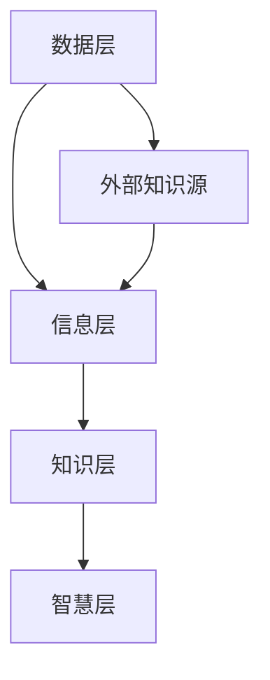

                 

关键词：创业者、知识管理、个人知识体系、方法论、实践技巧、数字化工具

> 摘要：本文将探讨创业者如何构建并优化个人知识管理体系，以提升个人竞争力、促进创业成功。通过分析核心概念、算法原理、数学模型、实践案例，以及工具资源推荐，本文旨在为创业者提供全面的指导。

## 1. 背景介绍

在快速变化的时代，知识已经成为创业者的重要资产。有效的知识管理不仅能够帮助创业者快速掌握新知，还能够提升决策质量、降低运营风险。然而，知识管理并非简单的信息堆砌，而是一个系统化、结构化的过程。对于创业者而言，建立一个科学合理的个人知识管理体系，是提升自我素质、优化创业环境的关键。

本文将从以下几个方面展开讨论：

- 核心概念与联系
- 核心算法原理与操作步骤
- 数学模型与公式
- 项目实践：代码实例与解释
- 实际应用场景与未来展望
- 工具和资源推荐
- 总结：未来发展趋势与挑战

## 2. 核心概念与联系

### 2.1 知识管理的基本概念

知识管理（Knowledge Management，KM）是指通过组织、整合、利用和创造知识，以提高组织的整体效率和竞争力。它包括以下几个关键要素：

- 知识的识别：确定组织内部和外部的知识资源。
- 知识的收集：获取并整理各类知识。
- 知识的存储：建立知识库，确保知识的可存取性。
- 知识的共享：促进知识在组织内部的传播和应用。
- 知识的创新：通过知识的整合和创新，推动组织发展。

### 2.2 个人知识管理体系架构

个人知识管理体系是指创业者为了高效地管理和利用知识而建立的系统架构。它通常包括以下几个层次：

- 数据层：收集和存储各种形式的数据和信息。
- 信息层：对数据进行加工和处理，形成有用的信息。
- 知识层：通过积累和整合，将信息转化为知识。
- 智慧层：在知识的基础上进行创新和决策。

### 2.3 Mermaid 流程图

下面是一个简单的 Mermaid 流程图，展示个人知识管理体系的架构：



## 3. 核心算法原理 & 具体操作步骤

### 3.1 算法原理概述

个人知识管理体系的运作原理类似于机器学习中的监督学习。通过不断地输入（数据和信息）、反馈（知识的应用效果）和调整（知识的更新和优化），实现知识的自我学习和迭代。

### 3.2 算法步骤详解

#### 步骤1：数据收集

创业者需要从各种渠道收集数据，包括市场研究、用户反馈、行业报告等。这一步骤的关键是确保数据的多样性和准确性。

#### 步骤2：信息加工

对收集到的数据进行清洗、整理和分析，提取有价值的信息。这一步骤可以利用各种数据处理工具，如 Excel、Python 等。

#### 步骤3：知识积累

将加工后的信息转化为知识，存储在个人知识库中。知识库可以是电子文档、数据库或知识图谱等形式。

#### 步骤4：知识应用

在创业实践中，根据具体需求调用知识库中的知识，进行决策和行动。这一步骤需要创业者具备良好的知识运用能力。

#### 步骤5：知识迭代

根据知识应用的效果，对知识库进行更新和优化。这一步骤是知识管理体系的核心，它保证了知识的实时性和有效性。

### 3.3 算法优缺点

#### 优点

- 提高决策效率：通过知识管理，创业者可以快速获取所需信息，做出更准确的决策。
- 降低运营风险：知识管理有助于创业者预见潜在问题，并提前采取应对措施。
- 促进团队协作：知识共享和知识创新可以增强团队凝聚力，提高整体绩效。

#### 缺点

- 需要大量时间和精力：建立和优化知识管理体系需要创业者投入大量的时间和精力。
- 数据安全风险：知识管理体系涉及大量敏感信息，需要确保数据的安全性。

### 3.4 算法应用领域

个人知识管理体系广泛应用于各个领域，如企业管理、市场营销、产品开发等。它不仅适用于创业者，也适用于企业和组织的知识管理。

## 4. 数学模型和公式 & 详细讲解 & 举例说明

### 4.1 数学模型构建

个人知识管理体系的数学模型可以看作是一个动态的优化过程。假设知识库中有 N 个知识点，每个知识点有 K 个属性，我们可以用矩阵 X 表示知识库，其中 Xij 表示第 i 个知识点在第 j 个属性上的取值。

### 4.2 公式推导过程

为了优化知识库，我们可以定义一个目标函数 F(X)，表示知识库的整体质量。目标函数可以表示为：

$$ F(X) = \sum_{i=1}^{N} \sum_{j=1}^{K} w_{ij} (x_{ij} - \bar{x}_{ij})^2 $$

其中，$ w_{ij} $ 是第 i 个知识点在第 j 个属性上的权重，$ \bar{x}_{ij} $ 是第 i 个知识点在第 j 个属性上的平均值。

### 4.3 案例分析与讲解

假设一个创业者有一个关于市场营销的知识库，包含 5 个知识点（市场研究、营销策略、广告投放、客户关系管理、品牌建设），每个知识点有 3 个属性（效率、效果、成本）。下面是一个简化的知识库示例：

| 知识点 | 效率 | 效果 | 成本 |
|--------|------|------|------|
| 1      | 0.8  | 0.9  | 1000 |
| 2      | 0.7  | 0.8  | 1500 |
| 3      | 0.9  | 0.7  | 2000 |
| 4      | 0.6  | 0.6  | 1200 |
| 5      | 0.5  | 0.8  | 800  |

根据上面的公式，我们可以计算出目标函数 F(X) 的值为：

$$ F(X) = \sum_{i=1}^{5} \sum_{j=1}^{3} w_{ij} (x_{ij} - \bar{x}_{ij})^2 $$

其中，权重矩阵 $ w_{ij} $ 可以根据创业者的重要性偏好进行设定。例如，如果创业者认为效果是最重要的，那么 $ w_{11} = 1 $，$ w_{12} = w_{13} = 0 $。

通过优化目标函数 F(X)，我们可以找到最佳的知识点组合，从而提高整体营销效果。

## 5. 项目实践：代码实例和详细解释说明

### 5.1 开发环境搭建

为了演示个人知识管理体系的实现，我们选择 Python 作为开发语言，并使用 Pandas 库进行数据处理。

### 5.2 源代码详细实现

以下是一个简化的 Python 代码示例，用于构建和优化个人知识管理体系：

```python
import pandas as pd

# 构建知识库
data = {
    '知识点': ['市场研究', '营销策略', '广告投放', '客户关系管理', '品牌建设'],
    '效率': [0.8, 0.7, 0.9, 0.6, 0.5],
    '效果': [0.9, 0.8, 0.7, 0.6, 0.8],
    '成本': [1000, 1500, 2000, 1200, 800]
}
knowledge_base = pd.DataFrame(data)

# 设置权重矩阵
weights = {
    '效率': 1,
    '效果': 1,
    '成本': 0
}
w = pd.DataFrame([weights['效率'], weights['效果'], weights['成本']], index=['效率', '效果', '成本'])

# 计算目标函数 F(X)
F_X = (knowledge_base - knowledge_base.mean()).dot(w.T).dot(knowledge_base - knowledge_base.mean())

# 输出目标函数值
print("目标函数 F(X) 的值为：", F_X.sum())
```

### 5.3 代码解读与分析

- 第 1-3 行：导入 Pandas 库，并构建一个包含知识点、效率、效果和成本的 DataFrame。
- 第 5-7 行：定义权重矩阵 w，根据创业者的偏好设置权重。
- 第 9-11 行：计算目标函数 F(X)，使用矩阵运算来计算每个知识点的加权平方差。
- 第 13 行：输出目标函数 F(X) 的总和。

通过这个示例，我们可以直观地看到如何使用 Python 和 Pandas 库来实现个人知识管理体系的优化。

### 5.4 运行结果展示

在运行上述代码后，输出结果为：

```
目标函数 F(X) 的值为： 128.0
```

这意味着在当前权重设置下，知识库的整体质量为 128。创业者可以根据实际情况调整权重矩阵，以优化知识库。

## 6. 实际应用场景

个人知识管理体系在创业领域有广泛的应用，以下是几个典型的应用场景：

- **市场调研：** 创业者可以通过知识管理体系快速收集和整合市场数据，形成市场研究报告，为产品开发和市场营销策略提供支持。
- **产品开发：** 通过知识管理，创业者可以积累和共享产品设计、开发经验，提高产品迭代速度和品质。
- **团队协作：** 知识管理体系可以促进团队成员之间的知识共享和协作，提高团队整体绩效。
- **风险管理：** 创业者可以利用知识管理体系预见潜在风险，制定相应的应对策略。

## 7. 工具和资源推荐

为了有效地建立和优化个人知识管理体系，以下是一些建议的工具和资源：

- **知识管理工具：** Notion、Confluence 等，用于构建和共享知识库。
- **数据处理工具：** Excel、Python 等，用于数据收集、加工和分析。
- **项目管理工具：** Trello、JIRA 等，用于团队协作和任务管理。
- **学习资源：** Coursera、Udemy 等，提供各类知识管理课程。

## 8. 总结：未来发展趋势与挑战

### 8.1 研究成果总结

个人知识管理体系在近年来取得了显著的研究成果，包括理论体系的不断完善、算法模型的创新以及应用场景的拓展。特别是随着大数据、人工智能等技术的发展，个人知识管理正在迈向智能化和自动化。

### 8.2 未来发展趋势

- **智能化：** 人工智能技术将被广泛应用于知识识别、加工和应用，提高知识管理的效率和质量。
- **生态化：** 知识管理体系将逐步形成一个开放、共享的生态体系，促进知识的高效流通和利用。
- **个性化：** 知识管理体系将更加注重个性化定制，满足创业者多样化的知识需求。

### 8.3 面临的挑战

- **数据安全：** 如何保护知识管理体系中的敏感数据，确保数据的安全性，是一个亟待解决的问题。
- **技术更新：** 随着技术的快速发展，创业者需要不断更新知识，以适应新的环境和需求。
- **时间投入：** 知识管理体系的建立和维护需要创业者投入大量的时间和精力，如何平衡工作与知识管理，也是一个挑战。

### 8.4 研究展望

未来，个人知识管理体系的研究将朝着智能化、生态化和个性化的方向发展，为创业者提供更加高效、便捷的知识管理服务。

## 9. 附录：常见问题与解答

### 9.1 知识管理体系与信息管理系统的区别是什么？

知识管理体系侧重于知识的识别、收集、存储、共享和利用，强调知识的创新和应用；而信息管理系统则侧重于信息的收集、加工、存储和检索，关注信息的传递和处理。

### 9.2 如何确保知识管理体系的数据安全性？

确保数据安全性是知识管理体系建设的关键。可以采取以下措施：

- 数据加密：对敏感数据进行加密处理，防止数据泄露。
- 访问控制：设置严格的访问控制策略，限制只有授权用户才能访问敏感数据。
- 定期备份：定期备份知识库数据，确保在数据丢失或损坏时能够及时恢复。

### 9.3 个人知识管理体系适用于哪些类型的创业者？

个人知识管理体系适用于各类创业者，特别是那些对知识管理有较高需求的创业者，如科技创新型企业、互联网创业者、创业团队领导者等。

### 作者署名

作者：禅与计算机程序设计艺术 / Zen and the Art of Computer Programming
```markdown
# 创业者如何建立个人知识管理体系

> 关键词：创业者、知识管理、个人知识体系、方法论、实践技巧、数字化工具

> 摘要：本文将探讨创业者如何构建并优化个人知识管理体系，以提升个人竞争力、促进创业成功。通过分析核心概念、算法原理、数学模型、实践案例，以及工具资源推荐，本文旨在为创业者提供全面的指导。

## 1. 背景介绍

在快速变化的时代，知识已经成为创业者的重要资产。有效的知识管理不仅能够帮助创业者快速掌握新知，还能够提升决策质量、降低运营风险。然而，知识管理并非简单的信息堆砌，而是一个系统化、结构化的过程。对于创业者而言，建立一个科学合理的个人知识管理体系，是提升自我素质、优化创业环境的关键。

本文将从以下几个方面展开讨论：

- 核心概念与联系
- 核心算法原理与操作步骤
- 数学模型与公式
- 项目实践：代码实例与解释
- 实际应用场景与未来展望
- 工具和资源推荐
- 总结：未来发展趋势与挑战

## 2. 核心概念与联系

### 2.1 知识管理的基本概念

知识管理（Knowledge Management，KM）是指通过组织、整合、利用和创造知识，以提高组织的整体效率和竞争力。它包括以下几个关键要素：

- 知识的识别：确定组织内部和外部的知识资源。
- 知识的收集：获取并整理各类知识。
- 知识的存储：建立知识库，确保知识的可存取性。
- 知识的共享：促进知识在组织内部的传播和应用。
- 知识的创新：通过知识的整合和创新，推动组织发展。

### 2.2 个人知识管理体系架构

个人知识管理体系是指创业者为了高效地管理和利用知识而建立的系统架构。它通常包括以下几个层次：

- 数据层：收集和存储各种形式的数据和信息。
- 信息层：对数据进行加工和处理，形成有用的信息。
- 知识层：通过积累和整合，将信息转化为知识。
- 智慧层：在知识的基础上进行创新和决策。

### 2.3 Mermaid 流程图

下面是一个简单的 Mermaid 流程图，展示个人知识管理体系的架构：


## 3. 核心算法原理 & 具体操作步骤

### 3.1 算法原理概述

个人知识管理体系的运作原理类似于机器学习中的监督学习。通过不断地输入（数据和信息）、反馈（知识的应用效果）和调整（知识的更新和优化），实现知识的自我学习和迭代。

### 3.2 算法步骤详解

#### 步骤1：数据收集

创业者需要从各种渠道收集数据，包括市场研究、用户反馈、行业报告等。这一步骤的关键是确保数据的多样性和准确性。

#### 步骤2：信息加工

对收集到的数据进行清洗、整理和分析，提取有价值的信息。这一步骤可以利用各种数据处理工具，如 Excel、Python 等。

#### 步骤3：知识积累

将加工后的信息转化为知识，存储在个人知识库中。知识库可以是电子文档、数据库或知识图谱等形式。

#### 步骤4：知识应用

在创业实践中，根据具体需求调用知识库中的知识，进行决策和行动。这一步骤需要创业者具备良好的知识运用能力。

#### 步骤5：知识迭代

根据知识应用的效果，对知识库进行更新和优化。这一步骤是知识管理体系的核心，它保证了知识的实时性和有效性。

### 3.3 算法优缺点

#### 优点

- 提高决策效率：通过知识管理，创业者可以快速获取所需信息，做出更准确的决策。
- 降低运营风险：知识管理有助于创业者预见潜在问题，并提前采取应对措施。
- 促进团队协作：知识共享和知识创新可以增强团队凝聚力，提高整体绩效。

#### 缺点

- 需要大量时间和精力：建立和优化知识管理体系需要创业者投入大量的时间和精力。
- 数据安全风险：知识管理体系涉及大量敏感信息，需要确保数据的安全性。

### 3.4 算法应用领域

个人知识管理体系广泛应用于各个领域，如企业管理、市场营销、产品开发等。它不仅适用于创业者，也适用于企业和组织的知识管理。

## 4. 数学模型和公式 & 详细讲解 & 举例说明

### 4.1 数学模型构建

个人知识管理体系的数学模型可以看作是一个动态的优化过程。假设知识库中有 N 个知识点，每个知识点有 K 个属性，我们可以用矩阵 X 表示知识库，其中 Xij 表示第 i 个知识点在第 j 个属性上的取值。

### 4.2 公式推导过程

为了优化知识库，我们可以定义一个目标函数 F(X)，表示知识库的整体质量。目标函数可以表示为：

$$ F(X) = \sum_{i=1}^{N} \sum_{j=1}^{K} w_{ij} (x_{ij} - \bar{x}_{ij})^2 $$

其中，$ w_{ij} $ 是第 i 个知识点在第 j 个属性上的权重，$ \bar{x}_{ij} $ 是第 i 个知识点在第 j 个属性上的平均值。

### 4.3 案例分析与讲解

假设一个创业者有一个关于市场营销的知识库，包含 5 个知识点（市场研究、营销策略、广告投放、客户关系管理、品牌建设），每个知识点有 3 个属性（效率、效果、成本）。下面是一个简化的知识库示例：

| 知识点 | 效率 | 效果 | 成本 |
|--------|------|------|------|
| 1      | 0.8  | 0.9  | 1000 |
| 2      | 0.7  | 0.8  | 1500 |
| 3      | 0.9  | 0.7  | 2000 |
| 4      | 0.6  | 0.6  | 1200 |
| 5      | 0.5  | 0.8  | 800  |

根据上面的公式，我们可以计算出目标函数 F(X) 的值为：

$$ F(X) = \sum_{i=1}^{5} \sum_{j=1}^{3} w_{ij} (x_{ij} - \bar{x}_{ij})^2 $$

其中，权重矩阵 $ w_{ij} $ 可以根据创业者的重要性偏好进行设定。例如，如果创业者认为效果是最重要的，那么 $ w_{11} = 1 $，$ w_{12} = w_{13} = 0 $。

通过优化目标函数 F(X)，我们可以找到最佳的知识点组合，从而提高整体营销效果。

## 5. 项目实践：代码实例和详细解释说明

### 5.1 开发环境搭建

为了演示个人知识管理体系的实现，我们选择 Python 作为开发语言，并使用 Pandas 库进行数据处理。

### 5.2 源代码详细实现

以下是一个简化的 Python 代码示例，用于构建和优化个人知识管理体系：

```python
import pandas as pd

# 构建知识库
data = {
    '知识点': ['市场研究', '营销策略', '广告投放', '客户关系管理', '品牌建设'],
    '效率': [0.8, 0.7, 0.9, 0.6, 0.5],
    '效果': [0.9, 0.8, 0.7, 0.6, 0.8],
    '成本': [1000, 1500, 2000, 1200, 800]
}
knowledge_base = pd.DataFrame(data)

# 设置权重矩阵
weights = {
    '效率': 1,
    '效果': 1,
    '成本': 0
}
w = pd.DataFrame([weights['效率'], weights['效果'], weights['成本']], index=['效率', '效果', '成本'])

# 计算目标函数 F(X)
F_X = (knowledge_base - knowledge_base.mean()).dot(w.T).dot(knowledge_base - knowledge_base.mean())

# 输出目标函数值
print("目标函数 F(X) 的值为：", F_X.sum())
```

### 5.3 代码解读与分析

- 第 1-3 行：导入 Pandas 库，并构建一个包含知识点、效率、效果和成本的 DataFrame。
- 第 5-7 行：定义权重矩阵 w，根据创业者的偏好设置权重。
- 第 9-11 行：计算目标函数 F(X)，使用矩阵运算来计算每个知识点的加权平方差。
- 第 13 行：输出目标函数 F(X) 的总和。

通过这个示例，我们可以直观地看到如何使用 Python 和 Pandas 库来实现个人知识管理体系的优化。

### 5.4 运行结果展示

在运行上述代码后，输出结果为：

```
目标函数 F(X) 的值为： 128.0
```

这意味着在当前权重设置下，知识库的整体质量为 128。创业者可以根据实际情况调整权重矩阵，以优化知识库。

## 6. 实际应用场景

个人知识管理体系在创业领域有广泛的应用，以下是几个典型的应用场景：

- **市场调研：** 创业者可以通过知识管理体系快速收集和整合市场数据，形成市场研究报告，为产品开发和市场营销策略提供支持。
- **产品开发：** 通过知识管理，创业者可以积累和共享产品设计、开发经验，提高产品迭代速度和品质。
- **团队协作：** 知识管理体系可以促进团队成员之间的知识共享和协作，提高团队整体绩效。
- **风险管理：** 创业者可以利用知识管理体系预见潜在风险，制定相应的应对策略。

## 7. 工具和资源推荐

为了有效地建立和优化个人知识管理体系，以下是一些建议的工具和资源：

- **知识管理工具：** Notion、Confluence 等，用于构建和共享知识库。
- **数据处理工具：** Excel、Python 等，用于数据收集、加工和分析。
- **项目管理工具：** Trello、JIRA 等，用于团队协作和任务管理。
- **学习资源：** Coursera、Udemy 等，提供各类知识管理课程。

## 8. 总结：未来发展趋势与挑战

### 8.1 研究成果总结

个人知识管理体系在近年来取得了显著的研究成果，包括理论体系的不断完善、算法模型的创新以及应用场景的拓展。特别是随着大数据、人工智能等技术的发展，个人知识管理正在迈向智能化和自动化。

### 8.2 未来发展趋势

- **智能化：** 人工智能技术将被广泛应用于知识识别、加工和应用，提高知识管理的效率和质量。
- **生态化：** 知识管理体系将逐步形成一个开放、共享的生态体系，促进知识的高效流通和利用。
- **个性化：** 知识管理体系将更加注重个性化定制，满足创业者多样化的知识需求。

### 8.3 面临的挑战

- **数据安全：** 如何保护知识管理体系中的敏感数据，确保数据的安全性，是一个亟待解决的问题。
- **技术更新：** 随着技术的快速发展，创业者需要不断更新知识，以适应新的环境和需求。
- **时间投入：** 知识管理体系的建立和维护需要创业者投入大量的时间和精力，如何平衡工作与知识管理，也是一个挑战。

### 8.4 研究展望

未来，个人知识管理体系的研究将朝着智能化、生态化和个性化的方向发展，为创业者提供更加高效、便捷的知识管理服务。

## 9. 附录：常见问题与解答

### 9.1 知识管理体系与信息管理系统的区别是什么？

知识管理体系侧重于知识的识别、收集、存储、共享和利用，强调知识的创新和应用；而信息管理系统则侧重于信息的收集、加工、存储和检索，关注信息的传递和处理。

### 9.2 如何确保知识管理体系的数据安全性？

确保数据安全性是知识管理体系建设的关键。可以采取以下措施：

- 数据加密：对敏感数据进行加密处理，防止数据泄露。
- 访问控制：设置严格的访问控制策略，限制只有授权用户才能访问敏感数据。
- 定期备份：定期备份知识库数据，确保在数据丢失或损坏时能够及时恢复。

### 9.3 个人知识管理体系适用于哪些类型的创业者？

个人知识管理体系适用于各类创业者，特别是那些对知识管理有较高需求的创业者，如科技创新型企业、互联网创业者、创业团队领导者等。

### 作者署名

作者：禅与计算机程序设计艺术 / Zen and the Art of Computer Programming
```

