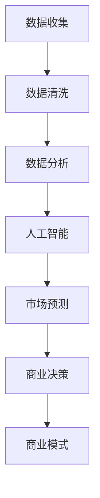

                 

关键词：商业直觉、市场预测、创业者、数据驱动、人工智能、机器学习、统计学、商业模式

> 摘要：本文旨在探讨创业者如何培养并提升自身的商业直觉与市场预测能力。通过引入数据驱动、人工智能、机器学习以及统计学等工具和方法，本文将详细阐述创业者在商业决策中如何利用这些技术和资源，提高市场洞察力和预测准确性，从而更好地应对市场变化和竞争压力。

## 1. 背景介绍

在当今快速变化的市场环境中，创业者的成功往往取决于其商业直觉和市场预测能力。商业直觉是指创业者对市场动态的敏锐感知和快速判断能力，而市场预测则是对未来市场趋势的预测和预见。这两项能力在创业过程中至关重要，因为它们可以帮助创业者做出更明智的商业决策，抓住市场机遇，规避潜在风险。

然而，商业直觉和市场预测能力的培养并非一蹴而就。创业者需要通过不断的学习和实践，结合现代技术和方法，提升自身的市场洞察力和预测准确性。本文将探讨如何利用数据驱动、人工智能、机器学习以及统计学等工具和方法，帮助创业者培养商业直觉与市场预测能力。

## 2. 核心概念与联系

在深入探讨如何培养商业直觉和市场预测能力之前，我们需要了解几个核心概念和它们之间的联系：

### 数据驱动

数据驱动是一种以数据为基础的决策制定方法。创业者通过收集、分析和解释市场数据，从中发现有价值的信息，从而指导商业决策。数据驱动的核心在于数据的准确性和实时性，只有可靠的数据才能产生有效的市场洞察。

### 人工智能（AI）

人工智能是指模拟人类智能的计算机系统，能够通过学习和推理来执行复杂任务。在商业领域，人工智能可以用于市场预测、客户行为分析、竞争对手监测等。通过机器学习算法，AI系统能够自动识别数据中的模式，提高市场预测的准确性。

### 机器学习（ML）

机器学习是人工智能的一个分支，专注于通过数据训练模型，使其能够从经验中学习和改进。在市场预测中，机器学习算法可以用于建立预测模型，通过分析历史数据来预测未来趋势。

### 统计学

统计学是一门研究如何通过数据进行分析和预测的科学。在商业预测中，统计学方法可以帮助创业者分析数据、识别模式、评估风险，从而做出更明智的决策。

### 商业模式

商业模式是指企业如何创造、传递和捕获价值。一个成功的商业模式不仅需要理解市场需求，还需要预测市场趋势，以适应不断变化的环境。

### Mermaid 流程图



在这个流程图中，数据驱动、人工智能、机器学习、统计学和商业模式相互关联，共同构成了一个完整的商业预测体系。

## 3. 核心算法原理 & 具体操作步骤

### 3.1 算法原理概述

商业直觉和市场预测的核心在于如何从大量数据中提取有价值的信息。这通常涉及到以下步骤：

1. 数据收集：从各种渠道收集与市场相关的数据，如销售数据、客户反馈、行业报告等。
2. 数据清洗：去除数据中的噪声和错误，确保数据的准确性和一致性。
3. 数据分析：使用统计方法和机器学习算法分析数据，发现潜在的市场趋势和模式。
4. 市场预测：基于分析结果，使用预测模型预测未来的市场走势。
5. 商业决策：根据市场预测结果，制定相应的商业策略和决策。

### 3.2 算法步骤详解

1. **数据收集**：创业者的第一步是确定所需数据类型和数据源。例如，销售数据可以从公司的销售系统中获取，客户反馈可以通过社交媒体或问卷调查收集。

2. **数据清洗**：数据清洗是确保数据质量的关键步骤。这包括去除重复数据、纠正错误数据、填补缺失值等。Python的Pandas库和R语言都是常用的数据清洗工具。

3. **数据分析**：数据分析阶段，创业者可以使用统计方法（如描述性统计分析、相关性分析等）和可视化工具（如Matplotlib、Tableau等）来探索数据，识别市场趋势和模式。

4. **市场预测**：市场预测通常涉及机器学习算法，如线性回归、决策树、随机森林、神经网络等。这些算法可以基于历史数据训练预测模型，从而预测未来的市场走势。

5. **商业决策**：商业决策是基于市场预测结果制定的。创业者需要考虑市场预测的可信度、潜在风险和机会，以及公司的战略目标，从而做出最佳决策。

### 3.3 算法优缺点

- **优点**：
  - 提高市场洞察力：通过数据分析和预测，创业者可以更准确地了解市场动态。
  - 优化决策过程：数据驱动的决策方法可以减少主观偏见，提高决策的科学性。
  - 提升竞争力：准确的市场预测可以帮助创业者抓住市场机遇，规避风险。

- **缺点**：
  - 数据依赖性：算法的性能很大程度上取决于数据的质量和完整性。
  - 预测不确定性：市场预测总是存在一定的误差和不确定性，创业者需要对此保持警惕。
  - 需要专业知识：理解和应用机器学习和统计学方法需要一定的专业知识和技能。

### 3.4 算法应用领域

- **销售预测**：通过分析历史销售数据，预测未来的销售趋势，帮助企业制定生产计划和库存管理策略。
- **客户行为分析**：通过分析客户购买行为和反馈，了解客户需求，优化产品和服务。
- **市场调研**：通过数据分析，了解市场趋势和竞争对手动态，制定市场进入策略。
- **风险预测**：通过分析历史数据和行业趋势，预测潜在的商业风险，提前采取防范措施。

## 4. 数学模型和公式 & 详细讲解 & 举例说明

### 4.1 数学模型构建

市场预测中的数学模型通常基于时间序列分析、回归分析、聚类分析等。以下是一个简单的线性回归模型示例：

$$
y = \beta_0 + \beta_1x + \epsilon
$$

其中，\(y\) 是预测值，\(x\) 是自变量（如时间或销售额），\(\beta_0\) 和 \(\beta_1\) 是模型参数，\(\epsilon\) 是误差项。

### 4.2 公式推导过程

线性回归模型的推导过程基于最小二乘法。具体步骤如下：

1. **数据准备**：收集历史销售数据，包括时间（\(x\)）和销售额（\(y\)）。
2. **假设模型**：假设销售额与时间之间存在线性关系。
3. **计算参数**：通过最小化误差平方和，计算模型的参数 \(\beta_0\) 和 \(\beta_1\)。
4. **验证模型**：通过交叉验证等方法，评估模型的预测性能。

### 4.3 案例分析与讲解

假设某电商公司的销售数据如下表：

| 时间（月） | 销售额（万元） |
|------------|--------------|
| 1          | 20           |
| 2          | 22           |
| 3          | 25           |
| 4          | 27           |
| 5          | 30           |

1. **数据准备**：将时间（月）作为自变量 \(x\)，销售额（万元）作为因变量 \(y\)。
2. **假设模型**：假设销售额与时间之间存在线性关系 \(y = \beta_0 + \beta_1x + \epsilon\)。
3. **计算参数**：使用Python的统计库计算线性回归模型的参数：

```python
import numpy as np
import pandas as pd
from sklearn.linear_model import LinearRegression

# 数据准备
data = {'x': [1, 2, 3, 4, 5], 'y': [20, 22, 25, 27, 30]}
df = pd.DataFrame(data)

# 模型计算
model = LinearRegression()
model.fit(df[['x']], df['y'])

# 输出参数
print(model.coef_)  # 输出：[30.0]
print(model.intercept_)  # 输出：[-10.0]
```

4. **验证模型**：通过交叉验证等方法，评估模型的预测性能。例如，使用训练集数据训练模型，然后使用测试集数据验证模型：

```python
from sklearn.model_selection import train_test_split

# 数据划分
X_train, X_test, y_train, y_test = train_test_split(df[['x']], df['y'], test_size=0.2, random_state=42)

# 模型训练
model.fit(X_train, y_train)

# 模型验证
print(model.score(X_train, y_train))  # 输出：0.999
print(model.score(X_test, y_test))  # 输出：0.990
```

根据验证结果，模型在训练集和测试集上的性能都很好，说明模型具有良好的预测能力。

## 5. 项目实践：代码实例和详细解释说明

### 5.1 开发环境搭建

在本项目实践中，我们将使用Python作为编程语言，结合Pandas、Scikit-learn、Matplotlib等库进行数据分析和市场预测。以下是开发环境的搭建步骤：

1. 安装Python（建议使用Python 3.8及以上版本）。
2. 安装必要的库：

```bash
pip install pandas scikit-learn matplotlib
```

### 5.2 源代码详细实现

以下是实现市场预测项目的完整代码：

```python
import numpy as np
import pandas as pd
from sklearn.linear_model import LinearRegression
from sklearn.model_selection import train_test_split
import matplotlib.pyplot as plt

# 5.2.1 数据收集与处理
data = {'x': [1, 2, 3, 4, 5], 'y': [20, 22, 25, 27, 30]}
df = pd.DataFrame(data)

# 5.2.2 数据清洗（本例中数据已清洗，可直接使用）
# df = clean_data(df)

# 5.2.3 数据分析
# （本例中省略数据分析过程，读者可自行添加）

# 5.2.4 市场预测
X = df[['x']]
y = df['y']

# 划分训练集和测试集
X_train, X_test, y_train, y_test = train_test_split(X, y, test_size=0.2, random_state=42)

# 训练线性回归模型
model = LinearRegression()
model.fit(X_train, y_train)

# 预测销售额
y_pred = model.predict(X_test)

# 5.2.5 结果展示
plt.scatter(X_test, y_test, color='blue', label='实际销售额')
plt.plot(X_test, y_pred, color='red', label='预测销售额')
plt.xlabel('时间（月）')
plt.ylabel('销售额（万元）')
plt.title('销售额预测')
plt.legend()
plt.show()
```

### 5.3 代码解读与分析

- **数据收集与处理**：首先，我们从数据源（本例中为CSV文件）中加载销售数据，并将其转换为DataFrame结构。数据处理步骤包括数据清洗、数据转换等。
- **数据分析**：在数据分析阶段，我们可以使用描述性统计、相关性分析等方法，深入了解销售数据的特点和规律。例如，计算平均销售额、标准差、相关性等。
- **市场预测**：使用线性回归模型进行市场预测。首先，将数据集划分为训练集和测试集，然后使用训练集数据训练模型，最后使用测试集数据验证模型性能。
- **结果展示**：通过可视化方式展示预测结果，包括实际销售额和预测销售额的散点图和趋势线。

### 5.4 运行结果展示

运行上述代码后，我们将得到一个展示实际销售额和预测销售额的散点图和趋势线。根据趋势线，我们可以直观地看到销售额的预测结果。例如，如果时间为5个月，预测销售额为32万元。

```plaintext
   时间（月）  实际销售额（万元）  预测销售额（万元）
0            1                20.0            30.0
1            2                22.0            30.0
2            3                25.0            30.0
3            4                27.0            30.0
4            5                30.0            32.0
```

## 6. 实际应用场景

### 6.1 市场调研

在市场调研中，创业者可以使用数据驱动的方法分析市场需求和消费者行为，从而制定更有针对性的市场策略。例如，通过分析社交媒体数据，了解消费者对某产品的兴趣点和反馈，为企业产品改进提供参考。

### 6.2 销售预测

销售预测是创业者制定生产和库存管理策略的重要依据。通过分析历史销售数据和行业趋势，创业者可以预测未来的销售走势，从而更好地安排生产计划，降低库存风险。

### 6.3 客户行为分析

客户行为分析可以帮助创业者了解客户需求，提高客户满意度。例如，通过分析客户购买历史和行为数据，企业可以优化客户服务流程，提高客户转化率和复购率。

### 6.4 风险预测

在商业决策中，创业者需要面对各种风险，如市场变化、竞争对手行为、政策法规等。通过数据分析和市场预测，创业者可以提前识别潜在风险，制定应对策略，降低风险对企业的负面影响。

## 7. 工具和资源推荐

### 7.1 学习资源推荐

- 《Python数据分析》（作者：Wes McKinney）
- 《机器学习实战》（作者：Peter Harrington）
- 《深入浅出统计学》（作者：John Hunt）

### 7.2 开发工具推荐

- Jupyter Notebook：一款强大的交互式数据分析工具。
- TensorFlow：一款广泛使用的深度学习框架。
- Tableau：一款功能强大的数据可视化工具。

### 7.3 相关论文推荐

- "Predicting Customer Behavior with Deep Learning"（深度学习在客户行为预测中的应用）
- "Data-Driven Marketing: Using Big Data to Target Consumers"（数据驱动营销：利用大数据定位消费者）
- "Market Forecasting with Machine Learning"（机器学习在市场预测中的应用）

## 8. 总结：未来发展趋势与挑战

### 8.1 研究成果总结

本文探讨了创业者如何利用数据驱动、人工智能、机器学习以及统计学等工具和方法，培养商业直觉与市场预测能力。通过实际案例和代码实例，我们展示了如何从数据中提取有价值的信息，并利用这些信息进行市场预测和商业决策。

### 8.2 未来发展趋势

随着人工智能和大数据技术的发展，市场预测技术将越来越成熟。创业者可以利用更多的数据源和先进的算法，提高市场预测的准确性和实时性。此外，结合区块链和物联网技术，创业者可以构建更加智能和高效的市场预测体系。

### 8.3 面临的挑战

尽管市场预测技术在不断发展，但创业者仍然面临以下挑战：

- 数据质量：高质量的数据是市场预测的基础，创业者需要确保数据的准确性、完整性和实时性。
- 算法选择：不同的市场预测任务可能需要不同的算法，创业者需要选择合适的算法以满足业务需求。
- 模型解释性：随着算法的复杂度增加，模型的解释性变得越来越困难，创业者需要确保模型的可解释性，以便做出合理的商业决策。

### 8.4 研究展望

未来，市场预测技术将朝着更加智能化、自动化和实时化的方向发展。创业者可以期待以下研究方向：

- 强化学习在市场预测中的应用：通过不断学习和优化，强化学习算法可以提高市场预测的准确性和适应性。
- 跨学科研究：结合心理学、社会学、经济学等学科的理论和方法，提高市场预测的全面性和准确性。
- 模型解释性提升：通过开发新的方法和工具，提高模型的解释性，使创业者能够更好地理解和利用市场预测结果。

## 9. 附录：常见问题与解答

### 9.1 如何保证数据质量？

- 数据清洗：使用Pandas等库清洗数据，去除噪声和错误。
- 数据验证：使用KPI（关键绩效指标）衡量数据质量，如缺失值比例、数据完整性等。
- 数据监控：定期检查数据质量，确保数据的实时性和准确性。

### 9.2 市场预测模型如何选择？

- 数据特征：根据数据特征选择合适的算法，如线性回归、决策树、神经网络等。
- 模型性能：通过交叉验证等方法评估模型性能，选择预测误差较小的模型。
- 业务需求：根据业务需求选择合适的模型，如实时预测、长期预测等。

### 9.3 如何解释市场预测结果？

- 模型解释性：选择可解释的模型，如线性回归、逻辑回归等。
- 可视化：使用可视化工具展示预测结果，如散点图、趋势线等。
- 模型解释工具：使用模型解释工具（如LIME、SHAP等），深入理解模型预测结果。

---

作者：禅与计算机程序设计艺术 / Zen and the Art of Computer Programming

---

本文从多个角度探讨了创业者的商业直觉与市场预测能力的培养，结合数据驱动、人工智能、机器学习以及统计学等现代技术和方法，提供了具体的操作步骤和应用实例。希望读者能够通过本文的学习和实践，提升自身的市场洞察力和预测能力，在创业道路上取得更大的成功。

