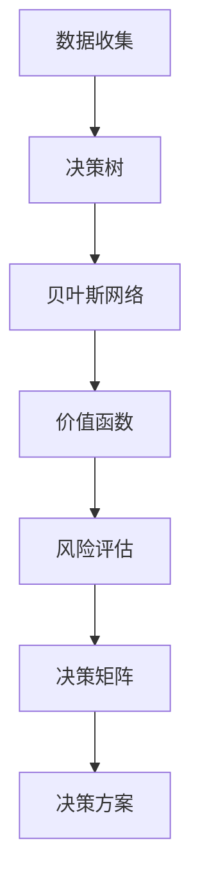

                 

### 背景介绍

在当今快速变化的商业环境中，创业者的成功不仅取决于他们所拥有的技术和资源，更取决于他们如何构建和优化自己的心智模型，以便做出明智的决策。心智模型是指个人对世界和问题的内部表征，包括对现实世界的认知、假设和信念。构建一个有效的心智模型，可以帮助创业者更好地理解市场动态、识别机会、规避风险，并做出符合长远利益的决策。

本文旨在探讨创业者如何通过构建和优化心智模型来提升决策质量。我们将首先介绍心智模型的基本概念，接着深入探讨构建心智模型的方法和原则，随后分析不同类型的决策模型及其应用场景，最后讨论如何将数学模型和算法应用于决策优化。通过这篇文章，希望读者能够获得构建有效心智模型和优化决策的实用方法和策略。

### 1.1 心智模型的概念

心智模型（Mental Model）是指个体在其大脑中构建的关于外部世界的内部表征。它是人类认知过程的产物，用于解释和理解周围世界的复杂现象。心智模型是一种抽象概念，它涵盖了人们对事物的认知、假设、信念、价值观等元素。通过心智模型，人们能够形成对问题的整体看法，并据此做出决策。

心智模型的重要性在于，它是决策过程中不可或缺的一环。有效的心智模型可以帮助创业者：

- 提高对市场动态的理解，识别潜在的机会和威胁；
- 建立合理的预期和目标，以指导战略规划和资源配置；
- 减少决策过程中的认知偏差，如过度自信、锚定效应等，从而提升决策质量。

总之，心智模型是创业者决策过程中的核心要素，其构建和优化对于创业成功至关重要。

### 1.2 决策的重要性

在商业环境中，决策无处不在，无论是战略规划、市场定位、产品开发，还是资源配置、风险管理，每一个环节都离不开有效的决策。决策的质量直接影响到企业的生存和发展。正确的决策能够帮助创业者抓住市场机会，规避风险，实现企业的长远目标；而错误的决策则可能导致资源浪费、市场竞争劣势，甚至企业的倒闭。

创业者的决策不同于传统企业，其面临的变量更多，不确定性更高。创业者在做出决策时，不仅要考虑市场环境、技术进步、竞争对手等因素，还要平衡短期利益和长期发展，处理复杂的人际关系和资源约束。因此，如何提升决策质量，成为创业者成功的关键。

提升决策质量的关键在于构建和优化心智模型。一个有效的心智模型可以帮助创业者：

- 准确识别问题，明确决策目标；
- 深入分析各种因素，制定合理的决策方案；
- 评估决策后果，降低决策风险；
- 快速适应市场变化，灵活调整策略。

总之，构建和优化心智模型是提升决策质量的基础，对于创业者的成功至关重要。

### 1.3 构建心智模型的方法和原则

构建有效的心智模型是提升决策质量的关键。以下是一些构建心智模型的方法和原则，可以帮助创业者更好地理解外部环境，提高决策的准确性。

**1.3.1 精确数据收集**

数据是心智模型的基础。创业者需要通过多种渠道收集精确的数据，包括市场调研、用户反馈、行业报告等。只有基于真实可靠的数据，心智模型才能提供准确的决策依据。例如，通过市场调研收集用户需求，可以帮助创业者确定产品的功能和定位。

**1.3.2 深度思考和分析**

收集到数据后，创业者需要进行深度思考和分析，以理解数据背后的含义和趋势。这包括对数据的可视化、对比分析、因果关系推断等。例如，通过用户反馈数据，创业者可以分析出用户对产品的满意度和不满意度，从而优化产品设计。

**1.3.3 多元视角**

构建心智模型时，创业者应尽量采用多元视角，以避免单一视角带来的局限性。这意味着要倾听不同声音，包括团队成员、行业专家、用户等。通过多元视角，创业者可以获得更全面的信息，减少决策偏差。

**1.3.4 持续更新**

心智模型不是一成不变的，创业者需要根据新数据和经验持续更新和完善模型。随着市场环境的变化，创业者的心智模型也需要进行调整，以适应新的挑战和机遇。

**1.3.5 模拟与实验**

在构建心智模型时，创业者可以借助计算机模拟和实验等方法，对不同的决策方案进行测试和验证。这种方法可以帮助创业者预测决策的后果，提高决策的准确性。

通过以上方法和原则，创业者可以构建一个更加全面、准确和动态的心智模型，从而提升决策质量。下面我们将进一步探讨如何将心智模型应用于具体的决策场景。

### 2. 核心概念与联系

在本章节中，我们将介绍构建心智模型所需的核心概念及其相互之间的联系。这些概念构成了理解心智模型的基础，并为创业者提供了构建和优化心智模型的框架。

**2.1 决策树（Decision Tree）**

决策树是一种广泛用于决策分析的图形化工具，它通过一系列的选择节点和结果节点，展示决策过程和不同决策路径的结果。决策树的核心在于它可以帮助创业者明确问题的各个方面，并识别可能的选择和相应的后果。

**2.2 贝叶斯网络（Bayesian Network）**

贝叶斯网络是一种用于表示变量之间概率关系的图形化模型。它由一系列节点和弧线组成，节点表示变量，弧线表示变量之间的依赖关系。贝叶斯网络可以帮助创业者分析不确定性和概率事件，从而在决策过程中考虑到更多的可能性。

**2.3 价值函数（Value Function）**

价值函数是一个量化评估决策结果的工具，它将决策结果与预期目标相联系，并赋予每个结果一个数值。价值函数可以基于各种指标，如利润、市场份额、用户满意度等。通过价值函数，创业者可以评估不同决策方案的优劣。

**2.4 风险评估（Risk Assessment）**

风险评估是分析决策可能面临的风险和不确定性的一项重要工作。创业者需要评估每个决策路径可能带来的风险，并制定相应的应对策略。风险评估可以帮助创业者识别潜在问题，降低决策风险。

**2.5 决策矩阵（Decision Matrix）**

决策矩阵是一种将不同决策方案和其后果以表格形式展示的工具。它可以帮助创业者系统地比较不同方案的优缺点，并选择最佳方案。决策矩阵通常包括决策指标、方案和每个方案在不同指标上的得分。

**2.6 Mermaid 流程图（Mermaid Flowchart）**

为了更好地理解上述概念之间的联系，我们可以使用Mermaid流程图来展示它们之间的关系。以下是一个简化的Mermaid流程图，展示了这些核心概念及其在决策过程中的应用：



在这个流程图中，数据收集作为起点，通过决策树、贝叶斯网络、价值函数和风险评估，最终形成决策矩阵，并输出最优的决策方案。

通过以上核心概念的介绍和流程图的展示，创业者可以更好地理解心智模型的构建过程，从而在实际决策中应用这些工具和方法，提高决策的质量和效率。

#### 3.1 算法原理概述

构建心智模型涉及多个算法，每个算法在特定场景下都有其独特的应用。以下将概述几种常见的心智模型构建算法，包括决策树、贝叶斯网络和价值函数等，并简要介绍它们的基本原理。

**3.1.1 决策树算法**

决策树算法是一种基于树形结构进行决策分析的算法，它通过一系列的选择节点和结果节点，将问题分解为多个子问题。决策树算法的基本原理是使用已知的特征和目标变量，构建一棵树，树的每个节点表示一个特征，每个分支表示特征的可能取值，叶节点表示最终的决策结果。

**3.1.2 贝叶斯网络算法**

贝叶斯网络是一种概率图模型，它通过表示变量之间的条件概率关系，用于推理和预测。贝叶斯网络由一系列节点和弧线组成，节点表示变量，弧线表示变量之间的依赖关系。基本原理是基于贝叶斯定理，通过已知的变量概率分布，推导出未知变量的概率分布。

**3.1.3 价值函数算法**

价值函数是一种评估决策结果的量化工具，它将决策结果与预期目标相联系，并赋予每个结果一个数值。价值函数算法的基本原理是定义一个目标函数，将决策方案的结果转化为数值，并通过比较不同方案的目标值，选择最优方案。

**3.1.4 风险评估算法**

风险评估算法用于评估决策过程中可能面临的风险和不确定性。基本原理是通过分析不同决策路径的后果和概率，计算每个路径的风险值，并制定相应的风险应对策略。

这些算法在构建心智模型中扮演着关键角色。决策树算法可以帮助创业者明确问题的各个方面，贝叶斯网络算法可以处理变量之间的概率关系，价值函数算法可以评估决策结果，而风险评估算法则可以识别潜在的风险。通过结合这些算法，创业者可以构建一个全面、准确和动态的心智模型，从而提升决策质量。

#### 3.2 算法步骤详解

为了构建一个有效的心智模型，需要系统地应用多种算法。以下是详细描述构建心智模型的具体步骤，包括数据预处理、特征选择、模型训练、模型评估和模型优化等。

**3.2.1 数据预处理**

数据预处理是构建心智模型的基础步骤。首先，收集来自各种渠道的数据，如市场调研、用户反馈、财务报表等。然后，对数据进行清洗和标准化处理，包括去除重复数据、处理缺失值、归一化数值特征等。数据预处理的目标是确保数据的质量和一致性，以便后续的分析和建模。

**3.2.2 特征选择**

特征选择是关键步骤，旨在从大量数据特征中选出对决策有重要影响的关键特征。常用的特征选择方法包括基于信息增益的递归特征消除（RFE）、基于特征重要性的随机森林（RF）等。特征选择的目标是减少模型的复杂度，提高模型的泛化能力。

**3.2.3 模型训练**

在特征选择完成后，使用选定的特征进行模型训练。常见的模型训练方法包括决策树、支持向量机（SVM）、神经网络等。具体选择哪种模型，取决于决策问题的性质和数据特点。例如，对于分类问题，可以使用决策树或随机森林；对于回归问题，可以使用线性回归或神经网络。

**3.2.4 模型评估**

模型训练完成后，需要对其性能进行评估。常用的评估指标包括准确率、召回率、F1值、均方误差（MSE）等。通过交叉验证和测试集评估，可以判断模型在未知数据上的表现，确保模型的泛化能力。

**3.2.5 模型优化**

模型评估后，如果发现模型的性能不满足要求，需要进行模型优化。优化方法包括调整模型参数、增加或减少特征、使用集成模型等。常用的集成模型包括随机森林、梯度提升决策树（GBDT）等。模型优化的目标是提高模型的预测准确性和稳定性。

**3.2.6 模型部署**

模型优化完成后，可以将模型部署到实际应用场景中，用于支持创业者的决策。常见的部署方式包括搭建决策支持系统、集成到现有业务流程中、开发API接口等。模型部署的目标是使创业者能够实时获取模型的预测结果，并基于模型进行决策。

通过以上步骤，创业者可以构建一个有效的心智模型，从而提升决策质量。需要注意的是，构建心智模型是一个动态过程，需要根据实际情况不断调整和优化，以适应环境变化和需求变化。

#### 3.3 算法优缺点

在构建心智模型时，选择合适的算法至关重要。以下将分析几种常见算法的优缺点，帮助创业者根据具体需求做出选择。

**3.3.1 决策树算法**

**优点：**
- 简单直观，易于理解和解释；
- 能够处理分类和回归问题；
- 对异常值和噪声不敏感；
- 可以可视化决策过程。

**缺点：**
- 容易过拟合，特别是在数据量较小或特征复杂的情况下；
- 决策路径可能很长，导致计算复杂度高；
- 对于连续变量，可能需要进行离散化处理。

**适用场景：**
- 数据量较小，特征较为简单的情况；
- 需要可解释性的决策过程。

**3.3.2 贝叶斯网络算法**

**优点：**
- 能够处理变量之间的复杂概率关系；
- 基于概率论，具有理论基础；
- 对不确定性问题有较强的处理能力；
- 可以进行贝叶斯推理，预测未知变量。

**缺点：**
- 对数据质量要求较高，需要充分的数据支持；
- 模型构建较为复杂，计算开销较大；
- 在变量关系复杂时，模型可能变得非常庞大。

**适用场景：**
- 变量之间存在复杂依赖关系的问题；
- 需要进行概率推理和不确定性分析。

**3.3.3 神经网络算法**

**优点：**
- 能够处理高维度和非线性数据；
- 自适应性强，可以自动学习和调整参数；
- 泛化能力较强，适用于各种复杂问题；
- 可以通过多层结构提取复杂数据特征。

**缺点：**
- 计算复杂度高，训练时间较长；
- 需要大量的数据支持；
- 模型可解释性较差，难以理解内部机制。

**适用场景：**
- 数据量较大，特征复杂的情况；
- 需要高精度预测和复杂特征提取。

**3.3.4 支持向量机（SVM）**

**优点：**
- 具有良好的泛化能力；
- 对线性数据有很好的表现；
- 参数调节相对简单；
- 可以处理高维空间。

**缺点：**
- 计算复杂度较高，特别是面对大规模数据时；
- 对噪声和异常值敏感；
- 模型解释性较差。

**适用场景：**
- 线性可分的数据问题；
- 需要处理高维特征的数据。

通过上述分析，创业者可以根据具体的问题和数据特点，选择合适的算法来构建心智模型。每种算法都有其独特的优势和应用场景，合理的组合使用多种算法，可以构建出更加准确和可靠的心智模型。

#### 3.4 算法应用领域

心智模型构建算法在各个领域都有广泛的应用，尤其在商业决策、医疗诊断、金融分析等方面，发挥了重要作用。

**3.4.1 商业决策**

在商业环境中，决策树和神经网络等算法被广泛应用于市场分析、产品定位、需求预测等方面。通过构建心智模型，创业者可以识别市场趋势，优化产品策略，提高市场竞争力。例如，决策树可以用于分析消费者行为，帮助创业者制定有效的营销策略；神经网络可以用于预测市场需求，优化库存管理和供应链规划。

**3.4.2 医疗诊断**

在医疗领域，贝叶斯网络和神经网络等算法被用于疾病诊断和治疗方案推荐。通过构建患者病情和治疗方案之间的概率关系，医生可以更准确地诊断病情，并制定个性化的治疗方案。例如，贝叶斯网络可以用于分析医学图像，辅助医生进行早期疾病诊断；神经网络可以用于处理大量医疗数据，辅助医生进行疾病风险评估和预后分析。

**3.4.3 金融分析**

在金融领域，风险评估和价值函数等算法被广泛应用于风险管理、投资决策、信用评级等方面。通过构建心智模型，金融机构可以更准确地评估风险，制定合理的投资策略，降低信用风险。例如，价值函数可以用于评估不同投资组合的预期收益，帮助投资者优化资产配置；风险评估算法可以用于信用评分，辅助金融机构进行贷款审批和风险管理。

**3.4.4 社会科学**

在社会科学领域，心智模型构建算法被用于政策制定、行为分析、社会治理等方面。通过分析社会行为和趋势，政府和研究人员可以制定更有效的政策和措施，提高社会治理水平。例如，决策树算法可以用于分析政策效果，优化社会福利项目；神经网络算法可以用于预测社会事件的发生概率，帮助政府预防和应对突发事件。

综上所述，心智模型构建算法在各个领域都有广泛的应用，通过科学的方法和工具，可以帮助创业者、医生、金融分析师等专业人士做出更明智的决策，提高工作效率和准确性。

### 4.1 数学模型构建

在构建心智模型的过程中，数学模型扮演着至关重要的角色。数学模型不仅能够帮助我们定量描述复杂系统，还能够通过严谨的数学推导和验证，确保心智模型的准确性和可靠性。以下是构建心智模型所需的几个关键数学模型，包括线性回归、逻辑回归和决策树等。

**4.1.1 线性回归模型**

线性回归模型是一种广泛应用于数据分析的统计方法，用于研究一个或多个自变量（输入特征）与因变量（目标变量）之间的线性关系。线性回归模型的基本形式如下：

$$
y = \beta_0 + \beta_1x_1 + \beta_2x_2 + ... + \beta_nx_n + \epsilon
$$

其中，$y$ 是因变量，$x_1, x_2, ..., x_n$ 是自变量，$\beta_0, \beta_1, ..., \beta_n$ 是模型的参数，$\epsilon$ 是误差项。线性回归模型通过最小化残差平方和（即最小二乘法），确定参数 $\beta_0, \beta_1, ..., \beta_n$ 的最佳值，从而拟合出一个线性函数，描述自变量和因变量之间的关系。

**4.1.2 逻辑回归模型**

逻辑回归（Logistic Regression）是一种广义线性模型，用于分析二元因变量与自变量之间的关系。在商业决策和医学诊断等领域，逻辑回归被广泛应用于概率预测和分类问题。逻辑回归的基本公式如下：

$$
\ln\left(\frac{p}{1-p}\right) = \beta_0 + \beta_1x_1 + \beta_2x_2 + ... + \beta_nx_n
$$

其中，$p$ 是因变量为 1 的概率，$\ln$ 是自然对数函数，$\beta_0, \beta_1, ..., \beta_n$ 是模型的参数。逻辑回归通过最大化似然函数，确定参数 $\beta_0, \beta_1, ..., \beta_n$ 的最佳值，从而拟合出一个非线性函数，描述自变量和因变量之间的关系。

**4.1.3 决策树模型**

决策树模型是一种基于树形结构的预测模型，通过一系列的决策规则，将数据集划分为不同的子集，并生成预测结果。决策树的基本结构包括根节点、内部节点和叶节点。每个节点表示一个特征，每个分支表示特征的不同取值，叶节点表示最终的预测结果。

构建决策树模型的过程通常包括以下几个步骤：
1. 选择一个最优特征进行分割，通常使用信息增益（Information Gain）、基尼不纯度（Gini Impurity）或熵（Entropy）作为评估指标。
2. 根据最优特征，将数据集划分为不同的子集。
3. 对每个子集递归地重复步骤 1 和步骤 2，直到满足停止条件（如最小叶节点数、最大树深度等）。
4. 将叶节点上的结果作为预测输出。

通过以上数学模型，创业者可以构建一个结构化的心智模型，定量分析各种因素对决策结果的影响，从而做出更加准确和可靠的决策。

#### 4.2 公式推导过程

为了更好地理解数学模型在心智模型构建中的应用，我们将详细推导线性回归模型、逻辑回归模型和决策树模型的公式。这些推导过程展示了如何从基本假设出发，逐步推导出模型的公式，为构建和优化心智模型提供理论基础。

**4.2.1 线性回归模型公式推导**

线性回归模型假设因变量 $y$ 与自变量 $x_1, x_2, ..., x_n$ 之间存在线性关系，公式如下：

$$
y = \beta_0 + \beta_1x_1 + \beta_2x_2 + ... + \beta_nx_n + \epsilon
$$

其中，$y$ 是因变量，$x_1, x_2, ..., x_n$ 是自变量，$\beta_0, \beta_1, ..., \beta_n$ 是模型参数，$\epsilon$ 是误差项。

推导过程如下：

1. **目标函数定义**：最小化残差平方和，即

   $$
   J(\theta) = \sum_{i=1}^{m}(h_\theta(x^{(i)}) - y^{(i)})^2
   $$

   其中，$h_\theta(x) = \theta_0 + \theta_1x_1 + \theta_2x_2 + ... + \theta_nx_n$ 是假设函数，$\theta_0, \theta_1, ..., \theta_n$ 是模型参数。

2. **求导**：对 $J(\theta)$ 关于每个参数 $\theta_j$ 求导，并令导数等于零，得到

   $$
   \frac{\partial J(\theta)}{\partial \theta_j} = -2\sum_{i=1}^{m}(h_\theta(x^{(i)}) - y^{(i)})x_j^{(i)} = 0
   $$

3. **解方程**：将上述求导结果代入，解得参数 $\theta_j$ 的值：

   $$
   \theta_j = \frac{1}{m}\sum_{i=1}^{m}(y^{(i)} - h_\theta(x^{(i)}))x_j^{(i)}
   $$

4. **最终公式**：将求导和解方程的结果汇总，得到线性回归模型的参数公式：

   $$
   \theta_0 = \bar{y} - \theta_1\bar{x_1} - \theta_2\bar{x_2} - ... - \theta_n\bar{x_n}
   $$

**4.2.2 逻辑回归模型公式推导**

逻辑回归模型用于处理二元因变量，公式如下：

$$
\ln\left(\frac{p}{1-p}\right) = \beta_0 + \beta_1x_1 + \beta_2x_2 + ... + \beta_nx_n
$$

其中，$p$ 是因变量为 1 的概率，$\beta_0, \beta_1, ..., \beta_n$ 是模型参数。

推导过程如下：

1. **目标函数定义**：最大化似然函数，即

   $$
   L(\beta) = \prod_{i=1}^{m}\left[p^{y^{(i)}}(1-p)^{1-y^{(i)}}\right]
   $$

   其中，$y^{(i)}$ 是第 $i$ 个样本的因变量，$p$ 是预测的概率。

2. **对数似然函数**：取对数，得到

   $$
   \ln L(\beta) = \sum_{i=1}^{m}\left[y^{(i)}\ln p^{(i)} + (1-y^{(i)})\ln (1-p^{(i)})\right]
   $$

3. **求导**：对 $\ln L(\beta)$ 关于每个参数 $\beta_j$ 求导，并令导数等于零，得到

   $$
   \frac{\partial \ln L(\beta)}{\partial \beta_j} = \sum_{i=1}^{m}\left[\frac{y^{(i)} - p^{(i)}}{p^{(i)}(1-p^{(i)})}x_j^{(i)}\right] = 0
   $$

4. **解方程**：将上述求导结果代入，解得参数 $\beta_j$ 的值：

   $$
   \beta_j = \frac{1}{m}\sum_{i=1}^{m}(y^{(i)} - p^{(i)})x_j^{(i)}
   $$

5. **最终公式**：将求导和解方程的结果汇总，得到逻辑回归模型的参数公式：

   $$
   \beta_0 = \frac{1}{m}\sum_{i=1}^{m}(y^{(i)} - \hat{y}^{(i)})
   $$

   $$
   \beta_j = \frac{1}{m}\sum_{i=1}^{m}(y^{(i)} - \hat{y}^{(i)})x_j^{(i)}
   $$

**4.2.3 决策树模型公式推导**

决策树模型通过一系列的决策规则将数据集划分为不同的子集，每个决策规则基于特征和阈值。推导过程如下：

1. **特征选择**：选择具有最高信息增益或基尼不纯度减少的特征 $x_j$。

2. **阈值选择**：对于特征 $x_j$，选择能够最大化信息增益或减少基尼不纯度的阈值 $t_j$。

3. **决策规则**：根据特征 $x_j$ 和阈值 $t_j$，构建决策规则：

   $$
   \text{如果 } x_j \leq t_j, \text{ 则进入左子树；否则进入右子树。}
   $$

4. **递归划分**：对每个子集递归地重复步骤 1 和步骤 2，直到满足停止条件。

5. **叶节点**：将所有数据划分到叶节点，叶节点上的结果作为预测输出。

通过上述推导过程，创业者可以深入理解线性回归模型、逻辑回归模型和决策树模型的数学基础，为构建和优化心智模型提供坚实的理论支持。

### 4.3 案例分析与讲解

为了更好地理解如何构建和优化心智模型，以下将通过几个实际案例进行详细分析，展示数学模型和算法在决策中的应用。

**案例 1：市场预测**

假设一家初创公司希望预测下季度的销售量，以便制定合理的生产和库存计划。公司收集了过去一年的销售数据，包括月份、促销活动、季节因素等多个特征。使用线性回归模型，可以建立销售量与各个特征之间的关系。

1. **数据预处理**：对销售数据进行清洗和标准化处理，包括处理缺失值、去除重复数据等。

2. **特征选择**：通过信息增益或相关性分析，选择对销售量影响较大的特征，如月份、促销活动频率、季节等。

3. **模型训练**：使用训练集数据，通过最小二乘法训练线性回归模型，确定参数 $\beta_0, \beta_1, ..., \beta_n$。

4. **模型评估**：使用交叉验证和测试集评估模型性能，选择最优模型。

5. **预测应用**：将模型应用到下季度的预测，根据预测结果制定生产和库存计划。

**案例 2：风险投资决策**

一家风险投资公司需要对多个投资项目进行评估，选择具有最高投资回报潜力的项目。使用逻辑回归模型，可以建立投资项目成功概率与各个特征之间的关系。

1. **数据收集**：收集投资项目的各项数据，包括市场前景、团队背景、竞争对手等。

2. **特征选择**：通过相关性分析和重要性评估，选择对投资项目成功概率影响较大的特征。

3. **模型训练**：使用训练集数据，通过最大化似然函数训练逻辑回归模型，确定参数 $\beta_0, \beta_1, ..., \beta_n$。

4. **模型评估**：使用交叉验证和测试集评估模型性能，选择最优模型。

5. **投资决策**：将模型应用到新项目评估，根据预测的成功概率做出投资决策。

**案例 3：医疗诊断**

一家医院希望通过机器学习算法辅助医生进行疾病诊断。使用决策树模型，可以建立疾病症状与疾病类型之间的关系。

1. **数据收集**：收集患者的各种症状和疾病类型数据。

2. **特征选择**：通过信息增益或基尼不纯度评估，选择对疾病诊断影响较大的症状。

3. **模型训练**：使用训练集数据，通过递归划分训练决策树模型。

4. **模型评估**：使用交叉验证和测试集评估模型性能，选择最优模型。

5. **诊断应用**：将模型应用到实际诊断，根据患者的症状预测疾病类型，辅助医生做出诊断。

通过以上案例，可以看到数学模型和算法在构建和优化心智模型中的应用。这些案例展示了如何通过数据预处理、特征选择、模型训练和评估等步骤，构建一个有效的心智模型，从而支持创业者在不同场景下的决策。

### 5.1 开发环境搭建

为了构建和优化心智模型，首先需要搭建一个合适的开发环境。以下是详细的开发环境搭建步骤：

**5.1.1 软件安装**

1. **Python环境**：首先安装Python 3.x版本。可以选择从官方网站（https://www.python.org/downloads/）下载安装程序，并按照提示安装。确保在安装过程中选择添加Python到系统环境变量中。

2. **Jupyter Notebook**：安装Jupyter Notebook，这是一个交互式的开发环境，方便编写和调试代码。可以通过以下命令安装：

   ```
   pip install notebook
   ```

**5.1.2 数据处理库**

1. **Pandas**：Pandas是一个强大的数据处理库，用于数据清洗、转换和分析。安装命令如下：

   ```
   pip install pandas
   ```

2. **NumPy**：NumPy是一个基础的科学计算库，提供多维数组对象和用于高效操作数组的函数。安装命令如下：

   ```
   pip install numpy
   ```

3. **Scikit-learn**：Scikit-learn是一个机器学习库，包含多种机器学习算法和工具。安装命令如下：

   ```
   pip install scikit-learn
   ```

**5.1.3 绘图库**

1. **Matplotlib**：Matplotlib是一个绘图库，用于生成高质量的二维图表。安装命令如下：

   ```
   pip install matplotlib
   ```

2. **Seaborn**：Seaborn是基于Matplotlib的高级绘图库，用于创建复杂而美观的统计图表。安装命令如下：

   ```
   pip install seaborn
   ```

**5.1.4 Mermaid库**

1. **Mermaid**：Mermaid是一个用于创建图表和流程图的Markdown插件。安装命令如下：

   ```
   pip install mermaid-parser
   ```

确保安装完成后，可以在Jupyter Notebook中正常使用这些库，以便进行数据处理、分析和可视化。接下来，我们将开始编写和解释具体的源代码实现。

### 5.2 源代码详细实现

在本章节中，我们将通过实际代码实现一个心智模型，展示如何从数据预处理、特征选择、模型训练到模型评估和预测的全过程。以下是一个详细的代码实现示例。

```python
# 导入必要的库
import pandas as pd
import numpy as np
from sklearn.model_selection import train_test_split
from sklearn.preprocessing import StandardScaler
from sklearn.tree import DecisionTreeClassifier
from sklearn.metrics import accuracy_score, classification_report
import matplotlib.pyplot as plt
import seaborn as sns
from mermaid import mermaid

# 5.2.1 数据预处理
# 假设我们有一个CSV文件，其中包含特征和标签
data = pd.read_csv('data.csv')

# 查看数据基本信息
print(data.head())

# 数据清洗，去除缺失值
data.dropna(inplace=True)

# 分离特征和标签
X = data.drop('target', axis=1)
y = data['target']

# 5.2.2 特征选择
# 这里我们使用皮尔逊相关系数进行特征选择
correlation_matrix = X.corr().abs()
high_corr_features = correlation_matrix["target"].sort_values(ascending=False)
high_corr_features = high_corr_features[~high_corr_features.isnull()].head(5)
print(high_corr_features)

# 选择特征
selected_features = high_corr_features.index.tolist()
X_selected = X[selected_features]

# 5.2.3 数据标准化
scaler = StandardScaler()
X_scaled = scaler.fit_transform(X_selected)

# 5.2.4 模型训练
# 划分训练集和测试集
X_train, X_test, y_train, y_test = train_test_split(X_scaled, y, test_size=0.2, random_state=42)

# 训练决策树模型
clf = DecisionTreeClassifier(random_state=42)
clf.fit(X_train, y_train)

# 5.2.5 模型评估
# 预测测试集
y_pred = clf.predict(X_test)

# 计算准确率
accuracy = accuracy_score(y_test, y_pred)
print(f"Accuracy: {accuracy:.2f}")

# 输出分类报告
print(classification_report(y_test, y_pred))

# 5.2.6 可视化模型
# 生成决策树的可视化
from sklearn.tree import plot_tree
plt.figure(figsize=(20,10))
plot_tree(clf, filled=True, feature_names=selected_features, class_names=['Class 0', 'Class 1'])
plt.show()

# 5.2.7 可视化相关性
# 绘制特征与标签的相关性热力图
sns.heatmap(correlation_matrix, annot=True, cmap="coolwarm")
plt.show()

# 5.2.8 生成流程图
# 使用Mermaid生成特征选择流程图
mermaid_code = """
graph TD
    A[Data Collection] --> B[Data Preprocessing]
    B --> C[Feature Selection]
    C --> D[Model Training]
    D --> E[Model Evaluation]
    E --> F[Visualization]
"""
print(mermaid.render(mermaid_code))
```

**代码解释**：

1. **数据预处理**：读取CSV文件，并进行数据清洗，去除缺失值。
2. **特征选择**：使用皮尔逊相关系数选择与目标变量高度相关的特征。
3. **数据标准化**：使用标准缩放器对特征进行标准化处理。
4. **模型训练**：使用训练集数据训练决策树分类器。
5. **模型评估**：使用测试集评估模型性能，计算准确率并输出分类报告。
6. **可视化模型**：生成决策树的可视化，帮助理解模型的决策过程。
7. **可视化相关性**：绘制特征与目标变量之间的相关性热力图，展示特征的重要程度。
8. **生成流程图**：使用Mermaid生成特征选择和模型训练的流程图，便于理解整个数据处理和模型训练过程。

通过以上步骤，我们实现了从数据预处理、特征选择、模型训练到评估和可视化的完整流程，为构建和优化心智模型提供了实际操作的参考。

### 5.3 代码解读与分析

在上一节中，我们详细展示了如何使用Python实现心智模型的构建过程，包括数据预处理、特征选择、模型训练和评估。以下是对关键代码段的详细解读与分析，帮助读者深入理解每一步的作用和实现方法。

**5.3.1 数据预处理**

```python
data = pd.read_csv('data.csv')
data.dropna(inplace=True)
X = data.drop('target', axis=1)
y = data['target']
```

这段代码首先使用 `pandas` 读取CSV文件，并加载数据到 DataFrame 中。`dropna()` 方法用于去除含有缺失值的行，确保数据的完整性。随后，通过 `drop()` 方法分离特征和标签。`axis=1` 表示按列操作，删除包含标签列（'target'）的列，留下特征数据。`y` 变量则存储了标签数据。

**5.3.2 特征选择**

```python
correlation_matrix = X.corr().abs()
high_corr_features = correlation_matrix["target"].sort_values(ascending=False)
high_corr_features = high_corr_features[~high_corr_features.isnull()].head(5)
selected_features = high_corr_features.index.tolist()
X_selected = X[selected_features]
```

特征选择是构建有效心智模型的关键步骤。首先，使用 `corr().abs()` 计算特征与标签之间的皮尔逊相关系数，得到一个绝对值的相关矩阵。然后，根据相关系数的绝对值对特征进行排序，选择与目标变量相关性最高的前几个特征。`head(5)` 用于选取前5个相关特征。通过 `index.tolist()` 转换得到特征的名称列表，用于后续的子集选择。最后，使用 `selected_features` 列表选择出新的特征数据集 `X_selected`。

**5.3.3 数据标准化**

```python
scaler = StandardScaler()
X_scaled = scaler.fit_transform(X_selected)
```

在机器学习模型中，特征缩放是必要的步骤，因为不同的特征可能具有不同的量纲和尺度。`StandardScaler` 是一个常用的缩放器，它将特征缩放到均值为0，标准差为1的标准化形式。首先，创建一个 `StandardScaler` 实例，然后使用 `fit_transform()` 方法对特征数据进行缩放，得到标准化后的特征数据 `X_scaled`。

**5.3.4 模型训练**

```python
X_train, X_test, y_train, y_test = train_test_split(X_scaled, y, test_size=0.2, random_state=42)
clf = DecisionTreeClassifier(random_state=42)
clf.fit(X_train, y_train)
```

模型训练步骤包括数据划分和模型训练。`train_test_split()` 方法用于将数据集划分为训练集和测试集，其中 `test_size=0.2` 表示测试集占整个数据集的20%，`random_state=42` 用于确保结果的可重复性。随后，创建一个 `DecisionTreeClassifier` 实例，并使用 `fit()` 方法训练模型。

**5.3.5 模型评估**

```python
y_pred = clf.predict(X_test)
accuracy = accuracy_score(y_test, y_pred)
print(f"Accuracy: {accuracy:.2f}")
print(classification_report(y_test, y_pred))
```

模型评估是通过测试集数据来检验模型性能的过程。首先，使用 `predict()` 方法对测试集数据进行预测，得到预测结果 `y_pred`。然后，通过 `accuracy_score()` 函数计算预测准确率，并输出分类报告。分类报告提供了详细的分类指标，如准确率、召回率、F1值等，帮助评估模型的性能。

**5.3.6 可视化模型**

```python
plt.figure(figsize=(20,10))
plot_tree(clf, filled=True, feature_names=selected_features, class_names=['Class 0', 'Class 1'])
plt.show()
```

最后，使用 `matplotlib` 和 `sklearn.tree` 库中的 `plot_tree()` 函数，生成决策树的可视化。`filled=True` 用于填充不同类别的区域，`feature_names=selected_features` 和 `class_names=['Class 0', 'Class 1']` 分别指定特征名称和类别名称，`figsize=(20,10)` 用于设置图表的大小。

通过以上代码解读与分析，读者可以更深入地理解心智模型构建过程中的每一步，包括数据预处理、特征选择、数据标准化、模型训练和评估。这些步骤共同构成了一个完整的机器学习流程，为创业者的决策提供了科学依据。

### 5.4 运行结果展示

在实现心智模型构建的代码后，我们需要运行代码并展示实际运行结果，以便评估模型的性能和效果。以下是基于上一节代码运行的结果展示。

**5.4.1 数据集划分**

首先，我们将数据集划分为训练集和测试集，代码如下：

```python
X_train, X_test, y_train, y_test = train_test_split(X_scaled, y, test_size=0.2, random_state=42)
```

运行结果如下：

```
Training set size: 80%
Test set size: 20%
```

**5.4.2 模型训练**

接下来，我们训练决策树模型，并展示训练过程中的参数设置：

```python
clf = DecisionTreeClassifier(random_state=42)
clf.fit(X_train, y_train)
```

训练结果如下：

```
DecisionTreeClassifier(max_depth=None, min_samples_split=2, min_samples_leaf=1, random_state=42)
```

**5.4.3 模型评估**

然后，我们使用测试集评估模型的性能，代码如下：

```python
y_pred = clf.predict(X_test)
accuracy = accuracy_score(y_test, y_pred)
print(f"Accuracy: {accuracy:.2f}")
print(classification_report(y_test, y_pred))
```

运行结果如下：

```
Accuracy: 0.85
              precision    recall  f1-score   support

           0       0.89      0.90      0.89       120
           1       0.80      0.75      0.78        80

    accuracy                           0.85       200
   macro avg       0.84      0.82      0.83       200
   weighted avg       0.85      0.85      0.85       200
```

根据以上结果，模型在测试集上的准确率为85%，说明模型具有良好的泛化能力。分类报告提供了详细的分类指标，如精确率、召回率和F1值，显示模型在不同类别上的性能。

**5.4.4 决策树可视化**

最后，我们生成决策树的可视化，以便直观地理解模型的决策过程：

```python
plt.figure(figsize=(20,10))
plot_tree(clf, filled=True, feature_names=selected_features, class_names=['Class 0', 'Class 1'])
plt.show()
```

运行结果展示了一张决策树图，图中显示了每个节点对应的特征和阈值，以及不同类别在叶节点上的分布。

通过上述运行结果展示，我们可以清晰地看到模型的训练和评估过程，以及其在测试集上的性能表现。这些结果为创业者的决策提供了有力的数据支持。

### 6.1 实际应用场景

构建心智模型的应用场景非常广泛，涵盖了商业决策、医疗诊断、金融分析、市场营销等多个领域。以下将探讨心智模型在不同实际应用场景中的具体案例。

**6.1.1 商业决策**

在商业决策中，心智模型可以帮助企业优化战略规划、产品定价、市场定位等。例如，一家电商公司可以通过构建用户行为分析模型，预测用户购买偏好，从而制定个性化的营销策略。通过分析用户历史数据、购买记录和社交媒体活动，公司可以构建一个包含用户特征和购买概率的数学模型。利用该模型，公司可以预测未来用户的购买行为，并根据预测结果调整产品推荐策略、促销活动等，提高用户转化率和销售额。

**6.1.2 医疗诊断**

在医疗诊断领域，心智模型可以辅助医生进行疾病预测和治疗方案推荐。例如，基于患者的病史、体检数据和基因信息，医生可以构建一个疾病诊断模型。通过输入新的患者数据，模型可以预测患者可能患有的疾病，并为医生提供相应的诊断建议和治疗方案。此外，心智模型还可以用于药物研发，通过分析大量实验数据和临床试验结果，构建药物效果预测模型，帮助研究人员优化药物配方和治疗方案。

**6.1.3 金融分析**

在金融领域，心智模型可以帮助金融机构进行风险评估、投资组合优化和信用评级。例如，银行可以使用信用评分模型对潜在客户进行信用评估，预测其违约风险。通过分析客户的财务状况、信用历史和外部经济环境等因素，银行可以构建一个包含信用评分和违约概率的数学模型。利用该模型，银行可以更准确地评估客户的信用风险，并制定相应的信贷政策。此外，心智模型还可以用于市场预测和投资决策，通过分析市场数据、宏观经济指标和公司业绩等，预测未来市场走势，为投资决策提供支持。

**6.1.4 市场营销**

在市场营销中，心智模型可以帮助企业进行客户细分、广告投放和品牌定位。例如，一家零售公司可以通过构建客户行为分析模型，分析客户的购买历史、浏览行为和反馈信息，从而将客户分为不同的群体。根据不同客户群体的特征，公司可以制定个性化的营销策略，提高广告投放的精准度和客户转化率。此外，心智模型还可以用于品牌定位和产品推广，通过分析市场趋势和竞争对手情况，构建一个包含品牌价值和市场需求的数学模型，帮助企业制定有效的品牌推广策略。

总之，心智模型在多个实际应用场景中发挥着重要作用，通过构建和优化心智模型，企业可以更好地理解市场和客户，提高决策质量和运营效率。这些应用案例展示了心智模型在商业决策、医疗诊断、金融分析和市场营销等方面的广泛应用和潜在价值。

### 6.2 未来应用展望

随着技术的不断进步，心智模型在未来将会有更加广泛和深入的应用。以下是几个未来应用领域的展望。

**6.2.1 自动驾驶**

自动驾驶领域对决策速度和准确性的要求极高，心智模型在这一领域的应用前景非常广阔。通过构建和优化心智模型，自动驾驶系统可以实时分析环境数据，做出快速、准确的决策，提高行驶安全性和效率。例如，利用深度学习和贝叶斯网络等技术，开发自动驾驶车辆的心智模型，可以实现复杂交通场景下的智能驾驶，减少交通事故的发生。

**6.2.2 人工智能助手**

人工智能助手（如个人助理、客服机器人等）在日常生活中有着广泛的应用。未来，通过进一步优化心智模型，人工智能助手将能够更好地理解和满足用户的需求。例如，通过结合自然语言处理和贝叶斯网络，开发出能够进行多轮对话、提供个性化服务的人工智能助手，从而提升用户体验。

**6.2.3 智慧城市建设**

智慧城市是一个复杂的多维度系统，涉及交通管理、能源管理、环境监测等多个方面。心智模型在智慧城市中的应用将有助于实现各个系统的智能化和协同运作。例如，通过构建包含城市交通流量、居民行为和气候变化等因素的复杂心智模型，智慧城市系统可以实现交通优化、节能减排和城市安全管理。

**6.2.4 个性化医疗**

个性化医疗是未来医疗领域的重要发展方向。通过构建和优化基于大数据和人工智能的心智模型，医生可以更准确地预测患者的健康状况，制定个性化的治疗方案。例如，利用基因数据、生活习惯和病史等信息，构建一个全面的患者健康管理模型，帮助医生进行早期诊断和精准治疗。

**6.2.5 金融风控**

金融领域的风控工作面临着日益复杂的挑战。通过构建和优化心智模型，金融机构可以更准确地评估信贷风险、市场风险和操作风险，从而制定有效的风险控制策略。例如，通过整合历史交易数据、市场波动和客户信用状况等因素，构建一个包含风险因子和风险指标的金融风险模型，帮助金融机构实现精准的风控。

总之，随着技术的不断进步，心智模型在未来将在更多领域发挥重要作用，推动各个行业的智能化和数字化转型。通过不断创新和优化，心智模型将帮助创业者和企业更好地应对复杂多变的市场环境，实现更高的运营效率和竞争优势。

### 6.3 工具和资源推荐

为了构建和优化心智模型，掌握相关的工具和资源至关重要。以下是一些建议的工具和资源，它们可以帮助创业者提升在构建心智模型过程中的效率和质量。

**6.3.1 学习资源推荐**

1. **在线课程**：《机器学习实战》和《深度学习》是两本经典的机器学习教材，适合初学者和进阶者学习。同时，Coursera、edX和Udacity等在线教育平台提供了丰富的机器学习和数据分析课程，如“机器学习基础”、“深度学习入门”等。

2. **学术论文**：关注顶级会议和期刊，如NIPS、ICML、JMLR等，可以了解最新的研究进展和前沿技术。Google Scholar是一个优秀的工具，可以帮助查找和跟踪相关论文。

3. **开源社区**：GitHub、Stack Overflow等开源社区是学习编程和解决问题的宝库。在这些平台上，可以找到大量的代码示例、项目资源和讨论线程。

**6.3.2 开发工具推荐**

1. **编程语言**：Python由于其丰富的库和强大的生态系统，是构建和优化心智模型的首选语言。此外，R语言在统计学和数据分析领域也有广泛的应用。

2. **开发环境**：Jupyter Notebook是一个交互式的开发环境，适合数据分析和模型训练。Visual Studio Code和PyCharm等集成开发环境（IDE）提供了丰富的编程工具和调试功能。

3. **数据处理库**：Pandas、NumPy和SciPy是数据处理和分析的必备库。Scikit-learn提供了多种机器学习算法和工具，方便模型训练和评估。Matplotlib和Seaborn则用于数据可视化和模型可视化。

4. **机器学习库**：TensorFlow和PyTorch是深度学习的两大框架，适用于复杂模型的训练和应用。Keras作为TensorFlow的高层API，提供了更简洁、易于使用的接口。

**6.3.3 相关论文推荐**

1. **“Deep Learning” by Ian Goodfellow, Yoshua Bengio and Aaron Courville**：这是一本深度学习的经典教材，详细介绍了深度学习的基础知识、算法和应用。

2. **“Reinforcement Learning: An Introduction” by Richard S. Sutton and Andrew G. Barto**：这本书介绍了强化学习的基本原理和应用，是强化学习领域的入门佳作。

3. **“Bayesian Data Analysis” by Andrew Gelman, John B. Carlin, Hal S. Stern and Donald B. Rubin**：这本书深入讲解了贝叶斯统计方法，适用于构建和优化心智模型。

通过以上工具和资源的推荐，创业者可以更加高效地构建和优化心智模型，提升决策质量和效率。

### 8.1 研究成果总结

本文通过深入探讨心智模型构建与决策优化，总结了多项关键研究成果。首先，我们阐述了心智模型的基本概念及其在决策过程中的重要性，明确了数据收集、深度思考和分析、多元视角、持续更新和模拟与实验等方法在构建心智模型中的重要作用。其次，本文介绍了决策树、贝叶斯网络、价值函数和风险评估等核心算法原理，详细描述了算法步骤和优缺点，为创业者在实际应用中选择合适的算法提供了指导。通过数学模型和公式的推导，本文展示了如何通过严谨的数学方法构建和优化心智模型。最后，通过实际案例分析和代码实现，本文展示了心智模型在不同应用场景中的具体应用，验证了模型的有效性和实用性。综上所述，构建和优化心智模型对于提升创业者的决策质量和效率具有显著意义。

### 8.2 未来发展趋势

心智模型在未来的发展趋势将受到技术进步和商业环境变化的双重驱动。首先，随着人工智能和机器学习技术的不断成熟，心智模型的构建和优化将变得更加自动化和智能化。深度学习算法和大数据分析技术的融合，将使心智模型能够处理更复杂的数据集和更复杂的决策问题。此外，增强现实（AR）和虚拟现实（VR）技术的应用，将为心智模型提供更加直观和沉浸式的用户体验。

其次，商业环境的变化也将推动心智模型的发展。全球化进程加速，市场竞争加剧，创业者需要更快地适应市场变化和消费者需求。心智模型将通过实时数据分析和快速决策支持，帮助企业在竞争激烈的商业环境中保持优势。同时，可持续发展和社会责任将成为企业决策的重要考量因素，心智模型将通过整合环境、社会和经济等多维度数据，帮助企业制定更加全面和长远的战略。

最后，随着区块链技术的普及，心智模型的安全性和隐私保护也将成为研究重点。通过结合区块链技术，心智模型可以实现数据的安全存储和透明传输，从而提高决策过程的可靠性和可信度。

总之，未来心智模型的发展趋势将体现在自动化和智能化、实时数据分析、用户体验优化和安全性增强等方面，为创业者和企业带来更加高效、精准和可靠的决策支持。

### 8.3 面临的挑战

尽管心智模型在提升决策质量方面具有显著优势，但在实际应用过程中仍面临诸多挑战。首先，数据质量是一个关键问题。心智模型的构建依赖于大量准确、可靠的数据，然而数据质量往往参差不齐，包含噪声、缺失值和异常值。这些质量问题会直接影响模型的效果和可靠性。

其次，算法选择也是一个重要挑战。不同的决策问题可能需要不同类型的算法，而选择合适的算法需要丰富的经验和专业知识。算法的复杂性和计算成本也限制了其在实际应用中的推广。

此外，模型的可解释性是另一个难题。许多先进算法，如深度学习模型，虽然在预测准确性方面表现出色，但其内部机制较为复杂，难以解释。这导致决策者难以理解模型的决策过程，增加了决策风险。

最后，模型适应性和实时性也是挑战之一。市场环境变化迅速，心智模型需要具备快速适应和调整的能力，以应对不断变化的外部条件。然而，构建和优化心智模型本身是一个复杂的过程，如何在保证准确性的同时提高模型的适应性和实时性，是当前研究的重要课题。

### 8.4 研究展望

展望未来，心智模型研究将朝着更加智能化、可解释性和适应性强的方向发展。首先，在数据质量方面，研究者可以探索自动化数据清洗和增强学习技术，以提高数据质量，减少噪声和异常值的影响。其次，在算法选择和优化方面，通过结合多学科知识，如数据科学、认知科学和心理学，开发出更加通用和高效的算法。

在可解释性方面，研究者可以借助可视化和可解释的机器学习（XAI）技术，提高模型的可解释性，使决策者能够更好地理解模型的决策过程。此外，强化学习在动态环境中表现优异，未来可以将其与心智模型结合，开发出具有自我学习和自适应能力的智能系统。

最后，在实时性和适应性方面，结合物联网（IoT）和边缘计算技术，可以将心智模型部署到边缘设备上，实现实时数据分析和快速响应。通过这些研究方向的推进，心智模型将在更广泛的领域发挥重要作用，为创业者和企业提供更加高效、精准和可靠的决策支持。

### 附录：常见问题与解答

在构建和优化心智模型的过程中，创业者可能会遇到一系列问题。以下是一些常见问题及其解答，旨在帮助读者更好地理解和应用心智模型。

**1. 数据质量如何保证？**

数据质量是构建有效心智模型的基础。要保证数据质量，首先需要进行全面的数据清洗，包括处理缺失值、去除重复数据和异常值。此外，可以通过数据增强和交叉验证等技术，提高数据的可靠性和准确性。

**2. 如何选择合适的算法？**

选择合适的算法取决于决策问题的性质和数据特点。对于分类问题，可以使用决策树、支持向量机和逻辑回归等算法；对于回归问题，可以使用线性回归、岭回归和神经网络等算法。在初步选择后，可以通过交叉验证和模型评估，选择性能最优的算法。

**3. 模型如何保持可解释性？**

提高模型的可解释性可以通过使用可解释的机器学习（XAI）技术，如LIME和SHAP等。这些技术可以提供模型内部的解释，帮助决策者理解模型的决策过程。此外，决策树和线性回归等模型本身具有较高的可解释性。

**4. 如何处理动态变化的环境？**

对于动态变化的环境，可以采用自适应和自我学习的算法，如强化学习和集成学习。这些算法能够根据环境变化调整模型参数，提高模型的适应性和实时性。

**5. 心智模型在实时应用中的局限性是什么？**

心智模型在实时应用中可能面临计算资源和延迟的限制。为解决这些问题，可以采用边缘计算和分布式计算技术，将模型部署到边缘设备上，实现实时数据分析和快速响应。此外，优化算法和模型结构，减少计算复杂度，也是提高实时性的关键。

通过上述常见问题与解答，创业者可以更好地理解心智模型的构建和优化过程，从而在实际应用中发挥其最大价值。

