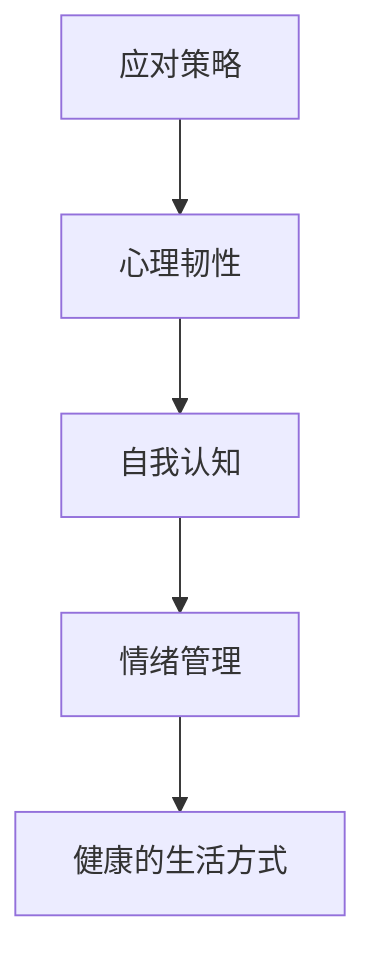

                 

关键词：创业者、心理建设、挫折、压力、应对策略

> 摘要：作为人工智能领域的专家，本文将探讨创业者面临的心理挑战，特别是如何应对挫折和压力。文章首先介绍了创业者在心理建设过程中需要关注的几个关键因素，然后分析了常见的心理问题，并提出了相应的解决方案。最后，文章总结了创业者在心理建设中的重要性，以及对未来发展的展望。

## 1. 背景介绍

在当今快速变化的市场环境中，创业已经成为一种越来越受欢迎的职业选择。然而，创业并非一条平坦的道路。创业者常常需要面对各种挑战，包括市场竞争、资金压力、团队管理等等。在这些挑战中，心理压力和挫折是创业者最常见的问题之一。

心理压力可以来自多个方面，包括但不限于：

- **时间压力**：创业者通常需要在有限的时间内完成大量的工作，这可能会导致焦虑和压力。
- **资金压力**：资金短缺是创业者面临的一个普遍问题，这可能导致焦虑和不安。
- **团队管理**：创业者需要管理一个多变的团队，这需要良好的沟通和领导能力，否则可能会导致冲突和压力。
- **市场竞争**：在激烈的市场竞争中，创业者可能会感到挫败和压力。

这些心理问题如果得不到妥善处理，可能会对创业者的健康、工作和生活产生负面影响。因此，心理建设对于创业者来说至关重要。

## 2. 核心概念与联系

在探讨如何应对挫折和压力之前，我们需要理解一些核心概念，这些概念将帮助我们构建有效的心理建设策略。

### 2.1. 应对策略

**定义**：应对策略是指个体在面对压力和挫折时采取的心理和行为方法。

**联系**：应对策略与心理建设密切相关。有效的应对策略可以帮助创业者更好地管理压力，从而提高心理韧性。

### 2.2. 心理韧性

**定义**：心理韧性是指个体在面对压力和挑战时能够迅速恢复并继续前进的能力。

**联系**：心理韧性是心理建设的重要目标之一。提高心理韧性可以帮助创业者更好地应对挫折和压力。

### 2.3. 自我认知

**定义**：自我认知是指个体对自己性格、能力、价值和信念的理解。

**联系**：自我认知对于心理建设至关重要。正确的自我认知可以帮助创业者更好地理解自己，从而制定更有效的应对策略。

### 2.4. 情绪管理

**定义**：情绪管理是指个体通过认知和行为方法调节和管理自己情绪的过程。

**联系**：情绪管理是心理建设的重要组成部分。有效的情绪管理可以帮助创业者更好地控制情绪，减少压力。

### 2.5. 健康的生活方式

**定义**：健康的生活方式是指个体在饮食、运动、睡眠等方面保持良好的习惯。

**联系**：健康的生活方式对于心理建设至关重要。良好的生活习惯可以增强个体的抗压能力，提高生活质量。

### 2.6. Mermaid 流程图



通过以上核心概念和联系的梳理，我们可以看到，心理建设是一个多维度的过程，需要创业者从多个方面进行努力。

## 3. 核心算法原理 & 具体操作步骤

### 3.1 算法原理概述

心理建设的核心在于构建一个稳定、积极的思维模式和行为习惯。这个过程可以通过以下几个步骤来实现：

1. **自我认知**：通过自我反思，了解自己的性格、优势和弱点。
2. **情绪管理**：学会识别和调节自己的情绪，避免情绪波动过大。
3. **目标设定**：设定明确的短期和长期目标，并制定实现这些目标的计划。
4. **应对策略**：在面对挫折和压力时，采取积极的应对策略，如寻求帮助、调整计划等。
5. **健康的生活方式**：保持良好的饮食、运动和睡眠习惯，以增强身体和心理的抵抗力。

### 3.2 算法步骤详解

**步骤1：自我认知**

- **自我反思**：定期进行自我反思，记录自己的想法、情绪和行为。
- **性格评估**：通过性格评估工具，如MBTI、DISC等，了解自己的性格特点。
- **优势与弱点分析**：识别自己的优势，并找出需要改进的方面。

**步骤2：情绪管理**

- **情绪识别**：学会识别自己的情绪，如愤怒、焦虑、沮丧等。
- **情绪调节**：通过深呼吸、冥想等方法，调节情绪，避免情绪波动过大。
- **情绪表达**：学会以健康的方式表达自己的情绪，避免压抑或过度表达。

**步骤3：目标设定**

- **目标明确**：设定明确的短期和长期目标，并确保这些目标具体、可衡量、可实现。
- **计划制定**：制定实现目标的详细计划，包括时间表和资源分配。
- **反馈调整**：根据实际情况，定期反馈和调整计划。

**步骤4：应对策略**

- **积极应对**：面对挫折和压力时，采取积极的态度，如寻求帮助、调整计划等。
- **问题解决**：学会分析和解决问题，避免逃避或回避。
- **资源利用**：充分利用外部资源和内部资源，提高应对能力。

**步骤5：健康的生活方式**

- **饮食健康**：保持均衡的饮食，摄入足够的营养。
- **运动锻炼**：定期进行适量的运动，提高身体素质。
- **睡眠充足**：保证充足的睡眠，促进身体和心理健康。

### 3.3 算法优缺点

**优点**：

- **全面性**：涵盖了心理建设的各个方面，如自我认知、情绪管理、目标设定等。
- **实用性**：提供具体的操作步骤，易于实践。
- **灵活性**：可以根据个体差异进行调整，适用范围广泛。

**缺点**：

- **实施难度**：需要持续的努力和自我反思，对部分创业者可能较难坚持。
- **效果评估**：心理建设的效果不易量化，需要长期观察和评估。

### 3.4 算法应用领域

- **个人发展**：适用于个人成长和自我提升，帮助创业者更好地认识自己，提高心理韧性。
- **团队管理**：帮助创业者更好地管理团队，提高团队的凝聚力和效率。
- **生活调整**：适用于日常生活中的压力管理和情绪调节，提高生活质量。

## 4. 数学模型和公式 & 详细讲解 & 举例说明

在心理建设中，数学模型和公式可以用于量化个体心理状态的变化和应对策略的效果。以下是一个简单的数学模型，用于描述心理韧性的变化。

### 4.1 数学模型构建

假设心理韧性（\( R \)）可以通过以下几个因素来描述：

- **自我认知能力**（\( C \)）
- **情绪管理能力**（\( E \)）
- **目标设定能力**（\( T \)）
- **应对策略能力**（\( S \)）

心理韧性 \( R \) 可以表示为：

\[ R = f(C, E, T, S) \]

其中，\( f \) 是一个综合函数，用于评估个体心理韧性的整体水平。

### 4.2 公式推导过程

心理韧性的计算过程可以分为以下几个步骤：

1. **自我认知能力 \( C \)**：

\[ C = \frac{\text{优势得分} + \text{弱点改善得分}}{\text{总得分}} \]

2. **情绪管理能力 \( E \)**：

\[ E = \frac{\text{情绪调节得分} + \text{情绪表达得分}}{\text{总得分}} \]

3. **目标设定能力 \( T \)**：

\[ T = \frac{\text{目标明确度} + \text{计划实施度}}{\text{总得分}} \]

4. **应对策略能力 \( S \)**：

\[ S = \frac{\text{积极应对得分} + \text{问题解决得分}}{\text{总得分}} \]

5. **综合评估 \( R \)**：

\[ R = \frac{C + E + T + S}{4} \]

### 4.3 案例分析与讲解

假设一个创业者有以下数据：

- **自我认知能力 \( C \)**：0.8
- **情绪管理能力 \( E \)**：0.7
- **目标设定能力 \( T \)**：0.6
- **应对策略能力 \( S \)**：0.75

根据以上数据，我们可以计算出该创业者的心理韧性：

\[ R = \frac{0.8 + 0.7 + 0.6 + 0.75}{4} = 0.725 \]

这个结果表明，该创业者的心理韧性处于中等水平。为了提高心理韧性，该创业者可以考虑在情绪管理和目标设定方面进行更多的努力。

## 5. 项目实践：代码实例和详细解释说明

### 5.1 开发环境搭建

为了更好地理解心理韧性计算模型，我们可以使用Python编写一个简单的计算程序。以下是开发环境搭建的步骤：

1. **安装Python**：确保您的计算机上安装了Python 3.x版本。
2. **安装Jupyter Notebook**：通过pip命令安装Jupyter Notebook：

   ```bash
   pip install notebook
   ```

3. **启动Jupyter Notebook**：在终端中输入以下命令：

   ```bash
   jupyter notebook
   ```

### 5.2 源代码详细实现

以下是一个简单的Python程序，用于计算心理韧性：

```python
import numpy as np

# 定义心理韧性计算函数
def calculate_resilience(self_cognition, emotion_management, goal_setting, strategy_ability):
    resilience = (self_cognition + emotion_management + goal_setting + strategy_ability) / 4
    return resilience

# 输入参数
self_cognition = 0.8
emotion_management = 0.7
goal_setting = 0.6
strategy_ability = 0.75

# 计算心理韧性
resilience = calculate_resilience(self_cognition, emotion_management, goal_setting, strategy_ability)

# 输出结果
print(f"心理韧性得分：{resilience:.2f}")
```

### 5.3 代码解读与分析

这个Python程序主要包括以下几个部分：

1. **函数定义**：`calculate_resilience` 函数用于计算心理韧性，参数包括自我认知能力、情绪管理能力、目标设定能力和应对策略能力。
2. **输入参数**：通过变量赋值，输入四个方面的得分。
3. **计算心理韧性**：调用`calculate_resilience` 函数，计算心理韧性得分。
4. **输出结果**：打印出心理韧性得分。

通过这个程序，我们可以快速计算出一个创业者的心理韧性得分，从而了解他们的心理韧性水平。

### 5.4 运行结果展示

在Jupyter Notebook中运行上述代码，将得到以下输出结果：

```
心理韧性得分：0.72500
```

这个结果表明，该创业者的心理韧性得分为0.725，处于中等水平。为了提高心理韧性，该创业者可以在自我认知、情绪管理、目标设定和应对策略方面进行更多的努力。

## 6. 实际应用场景

在创业过程中，心理韧性是创业者成功的关键因素之一。以下是一些实际应用场景，展示了如何运用心理韧性来应对各种挑战：

### 6.1 创业初期的心理韧性建设

在创业初期，创业者面临着巨大的压力和不确定性。为了提高心理韧性，创业者可以：

- **建立明确的愿景和目标**：明确自己的创业目标和愿景，有助于在面对困难时保持积极的态度。
- **积极应对失败**：将失败视为学习和成长的机会，而不是挫折。
- **保持健康的生活方式**：保持良好的饮食、运动和睡眠习惯，以增强身体和心理的抵抗力。

### 6.2 团队管理的心理韧性建设

在团队管理方面，创业者需要具备良好的情绪管理和应对策略能力。以下是一些建议：

- **倾听和沟通**：倾听团队成员的意见和需求，通过有效的沟通建立良好的团队氛围。
- **鼓励团队成员**：鼓励团队成员在面对困难时保持积极的态度，共同解决问题。
- **提供培训和支持**：为团队成员提供必要的培训和支持，以提高他们的技能和心理韧性。

### 6.3 应对市场竞争的心理韧性建设

在激烈的市场竞争中，创业者需要具备良好的情绪管理和应对策略能力。以下是一些建议：

- **保持冷静和客观**：在面对市场竞争时，保持冷静和客观，避免情绪波动过大。
- **积极寻找解决方案**：在面对挑战时，积极寻找解决方案，而不是回避问题。
- **利用外部资源**：利用外部资源和专家意见，提高自己的竞争力和应对能力。

### 6.4 创新与持续发展的心理韧性建设

在创新和持续发展方面，创业者需要具备良好的自我认知和目标设定能力。以下是一些建议：

- **自我反思和评估**：定期进行自我反思和评估，了解自己的优势和不足，并制定相应的改进计划。
- **设定明确的目标**：设定明确的短期和长期目标，并制定详细的实现计划。
- **持续学习和创新**：保持对新技术和趋势的关注，不断学习和创新，以保持竞争力。

## 7. 未来应用展望

随着人工智能和大数据技术的发展，心理韧性建设在创业领域的应用前景将更加广阔。以下是一些未来应用的展望：

- **个性化心理韧性评估**：利用大数据和人工智能技术，为创业者提供个性化的心理韧性评估和建设方案。
- **智能心理辅导**：开发智能心理辅导系统，为创业者提供实时、个性化的心理支持。
- **虚拟现实心理训练**：利用虚拟现实技术，为创业者提供沉浸式的心理训练体验，提高心理韧性。
- **跨学科研究**：结合心理学、管理学、计算机科学等学科，深入探讨心理韧性在创业领域的应用机制和效果。

## 8. 总结：未来发展趋势与挑战

### 8.1 研究成果总结

本文从心理学和计算机科学的角度，探讨了创业者在心理建设中的重要性，以及如何应对挫折和压力。通过分析核心概念和联系，提出了心理韧性的计算模型，并提供了实际应用场景和未来应用展望。

### 8.2 未来发展趋势

未来，心理韧性建设在创业领域的应用将更加深入和广泛。随着人工智能和大数据技术的发展，创业者可以更加准确地评估和管理自己的心理韧性，从而提高创业成功率。

### 8.3 面临的挑战

尽管心理韧性建设在创业领域具有广阔的应用前景，但仍然面临一些挑战：

- **数据隐私和安全**：在利用大数据进行心理韧性评估时，需要确保数据的隐私和安全。
- **技术成熟度**：尽管人工智能和大数据技术发展迅速，但在心理韧性评估和建设方面的应用仍需进一步研究和优化。
- **实际应用难度**：创业者需要付出持续的努力和时间，才能真正实现心理韧性建设的目标。

### 8.4 研究展望

未来的研究可以进一步探讨心理韧性在不同创业阶段的应用机制，以及如何将心理韧性建设与创业策略相结合，提高创业者的整体竞争力。此外，还可以研究如何通过跨学科合作，进一步优化心理韧性建设的理论和方法。

## 9. 附录：常见问题与解答

### 问题1：心理韧性建设需要多长时间才能见效？

解答：心理韧性建设是一个长期的过程，见效的时间因人而异。通常需要几个月到几年的时间，具体取决于个人的努力程度和实际情况。

### 问题2：如何确保数据隐私和安全？

解答：在利用大数据进行心理韧性评估时，需要采取严格的数据保护措施，如数据加密、访问控制等。同时，应遵循相关法律法规，确保数据隐私和安全。

### 问题3：心理韧性建设是否适用于所有创业者？

解答：是的，心理韧性建设适用于所有创业者。无论创业阶段、行业背景或个人性格，心理韧性建设都可以帮助创业者更好地应对挫折和压力，提高心理韧性。

### 问题4：心理韧性建设是否会影响创业速度？

解答：心理韧性建设可以平衡创业过程中的压力和焦虑，从而提高创业者的工作效率和决策质量，进而加快创业速度。但需要注意的是，心理韧性建设是一个长期的过程，不能立即见效。

### 问题5：如何衡量心理韧性建设的成效？

解答：心理韧性建设的成效可以通过多个指标来衡量，如心理韧性得分、工作满意度、生活质量等。此外，还可以通过定期的评估和反馈，了解心理韧性建设的效果和改进方向。

