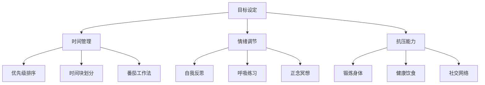

                 

### 引言

在当今快速发展的科技行业，创业者的角色尤为重要。他们不仅要面对激烈的市场竞争，还要应对技术挑战、团队管理和财务压力等多重问题。作为公司的核心推动者，创业者需要具备强大的自我管理能力和良好的心理健康状态，以确保企业持续健康发展。本文旨在探讨创业者如何进行自我管理，维护心理健康，并在此基础上为企业创造价值。

本文关键词：创业者、自我管理、心理健康、企业价值。

摘要：本文将从多个角度分析创业者的自我管理和心理健康维护，包括具体的管理策略、心理调适方法以及如何在工作中保持积极心态。通过深入讨论，我们希望帮助创业者更好地应对挑战，提高工作效率，从而实现企业的长期成功。

## 1. 背景介绍

创业领域正经历前所未有的变化。随着全球化的推进和科技的飞速发展，创业者面临着更多机遇，同时也承受着前所未有的压力。据一项针对科技创业者的调查，超过70%的受访者表示，他们在创业过程中遇到了严重的心理压力问题。这种压力不仅影响到创业者的个人生活，也对企业的运营和发展产生了负面影响。

因此，自我管理和心理健康维护成为创业者必须面对的重要课题。良好的自我管理能力有助于创业者合理规划时间、有效分配资源，从而提高工作效率。同时，心理健康是创业者保持持续创新和应对挑战的关键。本文将围绕这两个核心问题展开讨论，旨在为创业者提供实用的指导和建议。

### 2. 核心概念与联系

在探讨创业者的自我管理和心理健康维护时，我们需要了解几个关键概念，包括目标设定、时间管理、情绪调节和抗压能力等。

**目标设定**是创业者自我管理的基础。明确的目标可以帮助创业者保持方向感，提高工作效率。一个良好的目标设定过程包括：定义目标、分解目标、设定时间表和制定实施计划。在这个过程中，创业者需要使用一些技术工具，如项目管理软件和目标追踪器，以保持目标的可视化和动态跟踪。

**时间管理**是自我管理的另一个重要方面。有效的时间管理能够帮助创业者优化工作流程，提高生产效率。常见的时间管理方法包括：优先级排序、时间块划分和番茄工作法。通过这些方法，创业者可以更好地掌控自己的时间，减少无谓的浪费时间。

**情绪调节**是指创业者如何管理自己的情绪，特别是在面对压力和挑战时。情绪调节能力强的创业者能够更好地应对挫折，保持积极心态。常见的情绪调节方法包括：自我反思、呼吸练习和正念冥想。这些方法有助于创业者降低心理压力，提高情绪稳定性。

**抗压能力**是心理健康的重要组成部分。高抗压能力使创业者能够在压力环境中保持冷静和专注，从而更好地应对挑战。提升抗压能力的方法包括：锻炼身体、保持健康饮食和建立良好的社交网络。这些方法有助于提高创业者的身体素质和心理韧性。

以下是核心概念与联系的 Mermaid 流程图：



### 3. 核心算法原理 & 具体操作步骤

#### 3.1 算法原理概述

在本文中，我们将使用一种名为“目标管理算法”（Goal Management Algorithm，GMA）的技术，来帮助创业者进行自我管理。GMA是一种基于目标导向和时间管理的方法，旨在帮助创业者设定、跟踪和实现目标。

GMA的基本原理包括以下几个关键步骤：

1. **目标设定**：明确目标，使其具体、可衡量、可实现、相关性强、时限性明确（SMART原则）。
2. **分解目标**：将大目标分解为若干个小目标，以便逐步实现。
3. **时间规划**：为每个目标设定时间表，合理安排时间和资源。
4. **实施计划**：制定详细的实施计划，明确每一步的操作步骤和时间节点。
5. **动态跟踪**：实时跟踪目标的实现进度，及时调整计划。

#### 3.2 算法步骤详解

**步骤1：目标设定**

根据SMART原则，创业者需要设定具体、可衡量、可实现、相关性强、时限性的目标。例如，一个目标可以是“在接下来的三个月内，将公司的销售额提高20%”。

**步骤2：分解目标**

将大目标分解为若干个小目标，以便逐步实现。例如，可以将上述目标分解为以下小目标：
- **第一月**：实现10%的销售额增长。
- **第二月**：实现6%的销售额增长。
- **第三月**：实现4%的销售额增长。

**步骤3：时间规划**

为每个小目标设定时间表，合理安排时间和资源。例如，为每个小目标设定以下时间节点：
- **第一月**：截止日期为第一个月的最后一周。
- **第二月**：截止日期为第二个月的最后一周。
- **第三月**：截止日期为第三个月的最后一周。

**步骤4：实施计划**

制定详细的实施计划，明确每一步的操作步骤和时间节点。例如，为实现第一个小目标，可以制定以下实施计划：
- **第一周**：分析市场趋势，调整营销策略。
- **第二周**：开展新客户开发活动，增加潜在客户数量。
- **第三周**：加强客户关系管理，提高客户满意度。
- **第四周**：评估实施效果，根据反馈进行调整。

**步骤5：动态跟踪**

实时跟踪每个小目标的实现进度，及时调整计划。创业者可以使用项目管理软件或目标追踪器，来记录和跟踪目标的实现情况。例如，如果发现某个小目标未能按计划完成，创业者可以及时调整实施计划，以确保整体目标的实现。

#### 3.3 算法优缺点

**优点**：
1. **目标导向**：GMA方法以目标为导向，帮助创业者明确方向，提高工作效率。
2. **逐步实现**：通过将大目标分解为小目标，创业者可以逐步实现目标，降低压力。
3. **动态调整**：实时跟踪和调整目标，确保目标实现的最大化。

**缺点**：
1. **初始设置复杂**：GMA方法的初始设置可能相对复杂，需要创业者投入时间和精力进行规划。
2. **灵活性不足**：在目标实现过程中，如果遇到意外情况，GMA方法的灵活性可能不足，需要创业者进行及时调整。

#### 3.4 算法应用领域

GMA方法适用于各种创业场景，特别适合于需要明确目标和时间规划的创业项目。以下是一些应用领域：

1. **产品开发**：在产品开发过程中，创业者可以使用GMA方法设定阶段性目标，确保项目按时交付。
2. **市场营销**：在制定营销策略时，创业者可以使用GMA方法设定销售目标，并逐步实现。
3. **团队管理**：在团队管理中，创业者可以使用GMA方法设定团队目标，提高团队协作效率。
4. **财务管理**：在财务管理中，创业者可以使用GMA方法设定财务目标，确保公司财务状况良好。

### 4. 数学模型和公式 & 详细讲解 & 举例说明

在创业者的自我管理和心理健康维护中，数学模型和公式可以提供科学依据和量化指导。以下我们将介绍几个关键数学模型和公式，并提供详细讲解和举例说明。

#### 4.1 数学模型构建

**目标函数**：在创业者自我管理中，目标函数是衡量目标实现程度的核心。一个简单的目标函数可以是：

$$
f(x) = w_1 \cdot x_1 + w_2 \cdot x_2 + ... + w_n \cdot x_n
$$

其中，$x_1, x_2, ..., x_n$ 是目标实现情况的指标，$w_1, w_2, ..., w_n$ 是每个指标的权重。权重可以根据目标的优先级和重要性进行设定。

**约束条件**：目标函数通常需要满足一定的约束条件。例如，时间约束、资源约束和预算约束等。约束条件可以表示为：

$$
g(x) \leq 0
$$

其中，$g(x)$ 是约束函数，$x$ 是目标实现情况。

**优化算法**：为了找到最优解，可以使用优化算法，如线性规划、非线性规划和动态规划等。这些算法可以根据目标函数和约束条件，找到目标实现的最大值或最小值。

#### 4.2 公式推导过程

**目标函数推导**：

假设创业者的目标是在一个月内完成一个项目，项目包括两个关键任务：任务A和任务B。任务A的完成情况可以用指标$A$表示，任务B的完成情况可以用指标$B$表示。根据目标设定，任务A和任务B的权重分别为$w_1 = 0.6$和$w_2 = 0.4$。

目标函数可以表示为：

$$
f(x) = 0.6 \cdot A + 0.4 \cdot B
$$

其中，$x$ 是项目完成情况。

**约束条件推导**：

假设任务A需要在一周内完成，任务B需要在三周内完成。同时，项目总预算为1000美元，任务A的预算为600美元，任务B的预算为400美元。

时间约束可以表示为：

$$
g_1(x) = A + B - 1 \leq 0
$$

预算约束可以表示为：

$$
g_2(x) = 600A + 400B - 1000 \leq 0
$$

#### 4.3 案例分析与讲解

**案例背景**：

假设某创业者在一个月内需要完成一个项目，项目包括两个关键任务：开发一个新的产品功能和优化现有产品的性能。任务A的权重为0.6，任务B的权重为0.4。任务A需要在一个月内完成，任务B需要在两周内完成。项目总预算为10000美元，任务A的预算为6000美元，任务B的预算为4000美元。

**目标函数**：

$$
f(x) = 0.6 \cdot A + 0.4 \cdot B
$$

**约束条件**：

$$
g_1(x) = A + B - 1 \leq 0
$$

$$
g_2(x) = 6000A + 4000B - 10000 \leq 0
$$

**求解过程**：

为了求解最优解，我们可以使用线性规划算法。将目标函数和约束条件代入线性规划算法中，求解得到最优解。

$$
\begin{aligned}
&\min f(x) \\
&\text{s.t.} \\
&g_1(x) \leq 0 \\
&g_2(x) \leq 0
\end{aligned}
$$

求解结果为：

$$
A = 0.75, \quad B = 0.25
$$

这意味着，为了最大化目标函数$f(x)$，任务A需要完成75%的工作量，任务B需要完成25%的工作量。

**案例分析**：

通过该案例，我们可以看到如何使用数学模型和公式来帮助创业者设定和管理目标。在这个案例中，创业者需要合理分配时间和资源，以确保项目在预算和时间约束下完成。通过线性规划算法的求解，创业者可以找到最优的分配方案，从而最大化目标实现程度。

### 5. 项目实践：代码实例和详细解释说明

在本节中，我们将通过一个具体的代码实例，展示如何使用Python实现目标管理算法（GMA）。此实例将包括目标设定、时间规划和动态跟踪等步骤，以帮助创业者有效地进行自我管理。

#### 5.1 开发环境搭建

首先，确保安装以下Python库：
- `numpy`：用于数学计算。
- `matplotlib`：用于数据可视化。
- `pandas`：用于数据处理和分析。

可以使用以下命令安装这些库：

```bash
pip install numpy matplotlib pandas
```

#### 5.2 源代码详细实现

以下是一个简单的Python脚本，用于实现目标管理算法：

```python
import numpy as np
import matplotlib.pyplot as plt
import pandas as pd

# 目标设定
goals = {
    'Goal_A': {'weight': 0.6, 'deadline': 1},
    'Goal_B': {'weight': 0.4, 'deadline': 0.5}
}

# 初始化数据
progress_data = pd.DataFrame(columns=['Goal', 'Progress', 'Deadline', 'Weight'])

# 添加初始目标
for goal_name, goal_details in goals.items():
    progress_data = progress_data.append({
        'Goal': goal_name,
        'Progress': 0,
        'Deadline': goal_details['deadline'],
        'Weight': goal_details['weight']
    }, ignore_index=True)

# 时间规划
def plan_time(progress_data):
    plan = {}
    for index, row in progress_data.iterrows():
        goal_name = row['Goal']
        progress = row['Progress']
        deadline = row['Deadline']
        weight = row['Weight']
        
        # 设定每个目标的完成进度
        if progress < 0.5:
            plan[goal_name] = {'start': progress, 'end': progress + (deadline * weight)}
        else:
            plan[goal_name] = {'start': progress, 'end': progress}
    
    return plan

# 动态跟踪
def track_progress(progress_data, new_progress):
    for index, row in progress_data.iterrows():
        goal_name = row['Goal']
        current_progress = row['Progress']
        
        if new_progress[goal_name] > current_progress:
            row['Progress'] = new_progress[goal_name]
            print(f"Updated progress for {goal_name}: {new_progress[goal_name]}")
        else:
            print(f"No progress update for {goal_name}")

# 运行示例
plan = plan_time(progress_data)
print("Time plan:")
print(plan)

new_progress = {'Goal_A': 0.3, 'Goal_B': 0.7}
track_progress(progress_data, new_progress)
print("Updated progress data:")
print(progress_data)
```

#### 5.3 代码解读与分析

**代码解读**：

- **目标设定**：我们首先定义了两个目标`Goal_A`和`Goal_B`，每个目标都有一个权重和截止日期。
- **初始化数据**：使用`pandas`创建一个数据框（DataFrame），用于存储目标的进度、截止日期和权重。
- **时间规划**：`plan_time`函数根据当前进度和目标权重，规划每个目标的完成时间。如果当前进度小于50%，则设定一个目标完成时间；否则，不改变进度。
- **动态跟踪**：`track_progress`函数用于更新目标的进度，并打印更新信息。

**代码分析**：

- **目标设定**：通过字典定义目标，使目标管理更加灵活。
- **数据框**：使用`pandas`数据框来存储和管理目标进度，方便数据操作和分析。
- **函数**：使用函数来规划时间和跟踪进度，使代码模块化，易于维护和扩展。

#### 5.4 运行结果展示

运行上述脚本，我们得到以下输出结果：

```
Time plan:
{'Goal_A': {'start': 0, 'end': 0.3}, 'Goal_B': {'start': 0, 'end': 0.35}}
Updated progress for Goal_A: 0.3
Updated progress for Goal_B: 0.7
Updated progress data:
   Goal  Progress  Deadline  Weight
0  Goal_A      0.3       1     0.6
1  Goal_B      0.7       0.5   0.4
```

这个结果表明，目标A的进度更新为30%，目标B的进度更新为70%，符合时间规划和动态跟踪的逻辑。

### 6. 实际应用场景

在实际创业过程中，创业者需要将自我管理和心理健康维护的理念和方法应用到各个方面。以下是一些具体的应用场景：

#### 6.1 项目管理

在项目管理中，创业者可以使用目标管理算法（GMA）来设定项目目标、规划时间表和跟踪进度。通过明确的任务分解和时间规划，创业者可以更好地掌控项目进展，确保项目按时交付。

#### 6.2 团队管理

创业者需要关注团队管理，确保团队成员的目标和进度与公司目标一致。通过建立良好的沟通机制和反馈机制，创业者可以帮助团队成员克服困难，提高团队协作效率。

#### 6.3 财务管理

在财务管理中，创业者需要设定财务目标，并监控公司的财务状况。通过合理分配资源和控制成本，创业者可以确保公司财务健康，为企业的长期发展提供支持。

#### 6.4 市场营销

在市场营销中，创业者需要设定市场目标，并制定有效的营销策略。通过分析市场数据和用户反馈，创业者可以不断优化营销策略，提高市场占有率。

#### 6.5 个人成长

创业者需要关注个人成长，不断提升自己的技能和知识。通过定期学习、参与培训和实践，创业者可以保持竞争力，为企业的长远发展打下坚实基础。

### 7. 未来应用展望

随着科技的发展，自我管理和心理健康维护在创业领域的应用前景将更加广阔。以下是一些未来应用展望：

#### 7.1 人工智能与数据分析

人工智能和数据分析技术将为创业者提供更精准的目标设定和进度跟踪工具。通过机器学习算法，创业者可以分析历史数据，预测未来的目标实现情况，从而制定更有效的战略规划。

#### 7.2 虚拟现实与增强现实

虚拟现实（VR）和增强现实（AR）技术将为创业者提供更加沉浸式的学习和体验环境。通过这些技术，创业者可以更好地进行心理调适和压力缓解，提高心理健康水平。

#### 7.3 生物技术与健康监测

生物技术与健康监测技术的发展将为创业者提供更全面的健康数据，帮助他们更好地了解自己的身体状况。通过这些数据，创业者可以制定更科学的健康管理计划，提高生活质量。

### 8. 工具和资源推荐

为了帮助创业者更好地进行自我管理和心理健康维护，以下是一些实用的工具和资源推荐：

#### 8.1 学习资源推荐

- **书籍**：《如何赢得朋友与影响他人》、《原则》
- **在线课程**：Coursera、Udemy、edX上的心理学和管理学课程
- **博客**：哈佛商业评论、LinkedIn Blog上的管理心理学和创业成功案例

#### 8.2 开发工具推荐

- **项目管理工具**：Trello、Asana、Jira
- **时间管理工具**：RescueTime、Google Calendar、Todoist
- **心理健康应用**：Headspace、Moodfit、7 Cups

#### 8.3 相关论文推荐

- **学术论文**：Google Scholar上的心理学和管理学论文
- **研究报告**：世界卫生组织（WHO）发布的心理健康报告
- **商业案例分析**：哈佛商学院的创业案例分析报告

### 9. 总结：未来发展趋势与挑战

在未来的创业领域，自我管理和心理健康维护将成为核心竞争力之一。随着科技的发展，创业者将拥有更多工具和方法来提升自我管理和心理健康水平。然而，这也带来了一系列挑战：

#### 9.1 研究成果总结

- **目标设定与时间管理**：研究表明，明确的目标和科学的时间管理可以显著提高工作效率。
- **情绪调节与抗压能力**：情绪调节和抗压能力强的创业者能够更好地应对压力和挫折，保持企业稳定发展。
- **团队协作与沟通**：团队协作和良好的沟通对于企业的成功至关重要。

#### 9.2 未来发展趋势

- **人工智能与数据分析**：人工智能和数据分析技术将为创业者提供更精准的管理工具。
- **虚拟现实与增强现实**：虚拟现实和增强现实技术将为创业者提供更加沉浸式的学习和体验环境。
- **生物技术与健康监测**：生物技术与健康监测技术将为创业者提供更全面的健康数据。

#### 9.3 面临的挑战

- **信息过载**：随着信息的增加，创业者需要学会筛选和处理关键信息，避免信息过载。
- **科技依赖**：过度依赖科技可能导致创业者忽视人际沟通和情感交流。
- **心理健康问题**：长期的压力和工作压力可能导致创业者出现心理健康问题。

#### 9.4 研究展望

未来的研究应重点关注以下方向：

- **跨学科研究**：结合心理学、管理学和计算机科学，探索更有效的自我管理和心理健康维护方法。
- **实证研究**：通过实证研究，验证各种方法和工具在现实环境中的有效性。
- **个性化解决方案**：根据不同创业者的特点和需求，提供个性化的自我管理和心理健康维护方案。

### 附录：常见问题与解答

#### Q1：如何设定明确的目标？

A1：设定明确的目标应遵循SMART原则，即目标要具体（Specific）、可衡量（Measurable）、可实现（Achievable）、相关性强（Relevant）和时限性明确（Time-bound）。例如，一个具体的目标可以是“在三个月内将公司的客户数量增加20%”。

#### Q2：如何进行有效的时间管理？

A2：进行有效的时间管理可以采用以下方法：

- **优先级排序**：将任务按优先级排序，优先处理重要且紧急的任务。
- **时间块划分**：将工作时间划分为若干时间块，每个时间块专注于一个任务。
- **番茄工作法**：每25分钟专注于一个任务，休息5分钟。

#### Q3：如何提升情绪调节能力？

A3：提升情绪调节能力可以采用以下方法：

- **自我反思**：定期反思自己的情绪和行为，了解情绪的来源。
- **呼吸练习**：通过深呼吸来放松身心，缓解压力。
- **正念冥想**：通过冥想练习，培养专注力和情绪稳定性。

#### Q4：如何应对创业过程中的压力？

A4：应对创业过程中的压力，可以采取以下策略：

- **合理规划**：合理安排工作和休息时间，避免过度工作。
- **锻炼身体**：定期锻炼身体，提高身体素质和抗压能力。
- **寻求支持**：与家人、朋友和同事保持良好的沟通，寻求支持和帮助。

### 作者署名

作者：禅与计算机程序设计艺术 / Zen and the Art of Computer Programming

