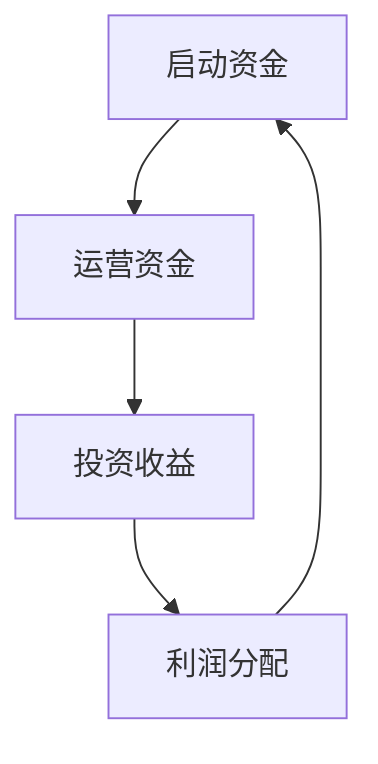
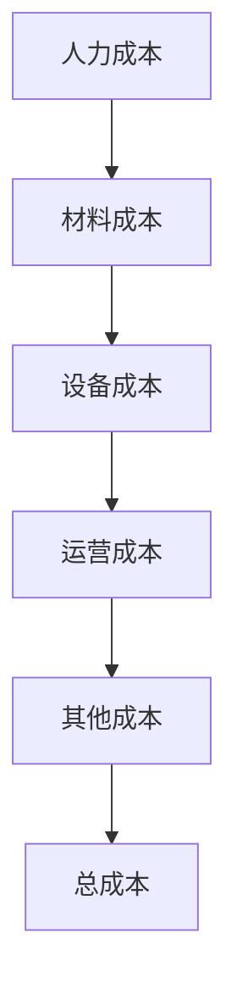
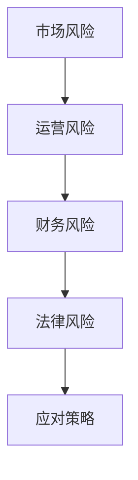
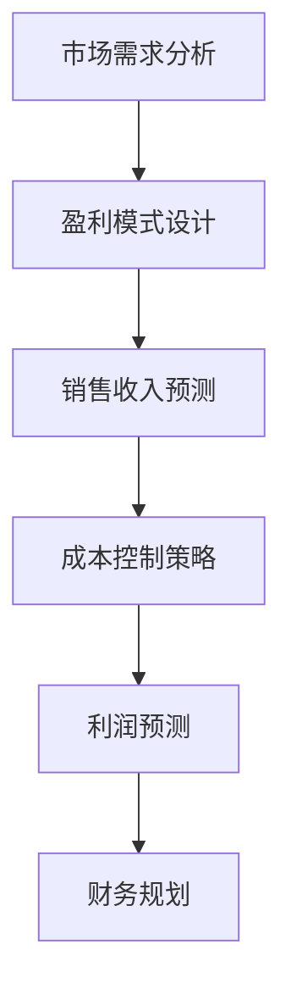

                 

关键词：创业者、财务管理、启动资金、盈利规划、风险控制、资金流动、IT项目成本估算、财务模型设计、财务预测分析

> 摘要：本文针对创业者面临的核心财务问题，系统介绍了从启动资金筹备到盈利规划的全过程。通过对资金流动、成本估算、风险控制和财务预测的分析，帮助创业者构建科学的财务管理体系，为企业的可持续发展奠定基础。

## 1. 背景介绍

在当今快速变化的市场环境中，创业已成为许多有梦想人士的选择。然而，创业之路并非一帆风顺。资金管理是创业成功的关键因素之一。创业者需要明确自己的财务状况，合理规划资金流动，以应对各种风险和不确定性。本文将从启动资金、成本估算、盈利规划等角度，探讨创业者如何进行有效的财务管理。

### 1.1 创业者面临的财务挑战

- **资金不足**：缺乏足够的启动资金，可能阻碍业务的发展。
- **成本控制**：在项目初期，如何合理分配资源，控制成本，是创业者必须面对的问题。
- **风险控制**：市场变化无常，创业者需要具备一定的风险管理能力，以避免陷入财务困境。
- **盈利规划**：如何实现盈利，是创业者长期发展的关键。

### 1.2 财务管理的重要性

有效的财务管理不仅能帮助创业者实现财务自由，还能提高企业的抗风险能力，为企业的长期发展提供保障。通过科学的财务管理，创业者可以更好地把握市场动态，优化资源配置，实现企业的可持续发展。

## 2. 核心概念与联系

### 2.1 资金流动

资金流动是财务管理的基础。创业者需要清晰地了解资金的来源和去向，以确保资金的顺畅流动。

**Mermaid 流程图**：


### 2.2 成本估算

成本估算是财务管理的重要环节。创业者需要对各项成本进行详细分析，以便制定合理的预算和成本控制策略。

**Mermaid 流程图**：


### 2.3 风险控制

风险控制是确保企业财务健康的重要手段。创业者需要识别潜在的风险，并制定相应的风险控制策略。

**Mermaid 流程图**：


### 2.4 盈利规划

盈利规划是创业者的终极目标。通过科学的预测和分析，创业者可以制定合理的盈利规划，确保企业的长期稳定发展。

**Mermaid 流程图**：


## 3. 核心算法原理 & 具体操作步骤

### 3.1 算法原理概述

创业者的财务管理算法主要基于以下几个方面：

- **资金流动分析**：利用资金流动图分析资金来源和去向，确保资金流动的顺畅。
- **成本估算**：采用成本估算模型，对各项成本进行详细分析，确保成本控制在合理范围内。
- **风险控制**：利用风险矩阵识别潜在的风险，并根据风险程度制定相应的风险控制策略。
- **盈利规划**：采用销售收入预测模型，结合成本控制策略，制定合理的盈利规划。

### 3.2 算法步骤详解

#### 3.2.1 资金流动分析

1. **收集数据**：收集企业过去一段时间的资金流动数据。
2. **绘制资金流动图**：利用 Mermaid 流程图，绘制资金流动图。
3. **分析资金流动情况**：分析资金流动图，找出资金流动的瓶颈。

#### 3.2.2 成本估算

1. **确定成本类别**：根据企业的运营情况，确定人力成本、材料成本、设备成本等。
2. **收集成本数据**：收集各项成本的历史数据。
3. **构建成本估算模型**：利用回归分析等方法，构建成本估算模型。
4. **进行成本估算**：输入相关参数，进行成本估算。

#### 3.2.3 风险控制

1. **识别风险**：通过市场调研、数据分析等方法，识别潜在的风险。
2. **评估风险**：利用风险矩阵，评估风险的程度。
3. **制定风险控制策略**：根据风险程度，制定相应的风险控制策略。

#### 3.2.4 盈利规划

1. **市场需求分析**：通过市场调研，了解市场需求。
2. **设计盈利模式**：根据市场需求，设计合理的盈利模式。
3. **销售收入预测**：采用销售收入预测模型，预测未来一段时间内的销售收入。
4. **制定财务规划**：根据销售收入预测，制定合理的财务规划。

### 3.3 算法优缺点

**优点**：

- **系统性强**：算法涵盖了资金流动、成本估算、风险控制和盈利规划等方面，具有系统性。
- **实用性高**：算法结合了实际业务场景，具有较高的实用性。

**缺点**：

- **数据依赖性强**：算法的性能依赖于输入数据的质量。
- **实施成本高**：算法的实施需要一定的技术支持和人力投入。

### 3.4 算法应用领域

- **初创企业**：初创企业资金紧张，需要科学的财务管理来保证企业的可持续发展。
- **中小型企业**：中小型企业面临较大的市场竞争压力，需要通过财务管理来提高企业的抗风险能力。
- **投资领域**：投资者可以利用该算法对创业项目进行风险评估和盈利预测，为投资决策提供依据。

## 4. 数学模型和公式 & 详细讲解 & 举例说明

### 4.1 数学模型构建

#### 4.1.1 资金流动模型

资金流动模型主要基于资金流入和流出的平衡关系。设某一时段内的资金流入为 $I(t)$，资金流出为 $O(t)$，则资金流动模型可以表示为：

$$
I(t) - O(t) = F(t)
$$

其中，$F(t)$ 为资金流动，表示某一时段内的净资金流动。

#### 4.1.2 成本估算模型

成本估算模型主要基于成本函数。设成本函数为 $C(x)$，其中 $x$ 为影响成本的各种因素，如人力成本、材料成本等。则成本估算模型可以表示为：

$$
C(x) = \sum_{i=1}^{n} w_i \cdot c_i
$$

其中，$w_i$ 为因素 $i$ 的权重，$c_i$ 为因素 $i$ 的成本。

#### 4.1.3 风险控制模型

风险控制模型主要基于风险矩阵。设风险矩阵为 $R = [r_{ij}]_{m \times n}$，其中 $r_{ij}$ 为风险 $i$ 在环境 $j$ 下的发生概率。则风险控制模型可以表示为：

$$
\text{风险程度} = \sum_{i=1}^{m} r_{ij} \cdot s_j
$$

其中，$s_j$ 为环境 $j$ 的风险权重。

#### 4.1.4 盈利规划模型

盈利规划模型主要基于销售收入预测和成本控制。设销售收入预测模型为 $S(t)$，成本控制模型为 $C(t)$，则盈利规划模型可以表示为：

$$
\pi(t) = S(t) - C(t)
$$

其中，$\pi(t)$ 为某一时段内的利润。

### 4.2 公式推导过程

#### 4.2.1 资金流动模型

资金流动模型是基于资金流入和流出的平衡关系推导得出的。设资金流入为 $I(t)$，资金流出为 $O(t)$，则某一时段内的资金流动可以表示为：

$$
F(t) = I(t) - O(t)
$$

#### 4.2.2 成本估算模型

成本估算模型是基于成本函数的加权求和推导得出的。设成本函数为 $C(x)$，其中 $x$ 为影响成本的各种因素，如人力成本、材料成本等。则成本估算模型可以表示为：

$$
C(x) = \sum_{i=1}^{n} w_i \cdot c_i
$$

其中，$w_i$ 为因素 $i$ 的权重，$c_i$ 为因素 $i$ 的成本。

#### 4.2.3 风险控制模型

风险控制模型是基于风险矩阵的加权求和推导得出的。设风险矩阵为 $R = [r_{ij}]_{m \times n}$，其中 $r_{ij}$ 为风险 $i$ 在环境 $j$ 下的发生概率。则风险控制模型可以表示为：

$$
\text{风险程度} = \sum_{i=1}^{m} r_{ij} \cdot s_j
$$

#### 4.2.4 盈利规划模型

盈利规划模型是基于销售收入预测和成本控制的差值推导得出的。设销售收入预测模型为 $S(t)$，成本控制模型为 $C(t)$，则盈利规划模型可以表示为：

$$
\pi(t) = S(t) - C(t)
$$

### 4.3 案例分析与讲解

#### 4.3.1 案例背景

某初创企业主要从事智能家居产品的研发和销售。在项目启动初期，企业需要筹集启动资金，进行产品研发和市场推广。企业希望通过科学的财务管理，确保项目的顺利进行，并在未来实现盈利。

#### 4.3.2 资金流动分析

1. **收集数据**：企业收集了过去三个月的资金流动数据，包括收入和支出。
2. **绘制资金流动图**：利用 Mermaid 流程图，绘制资金流动图。
3. **分析资金流动情况**：通过资金流动图，企业发现资金主要来源于销售收入，支出主要包括研发成本和市场推广费用。
4. **优化资金流动**：企业决定减少市场推广费用，增加研发投入，以提高产品的市场竞争力。

#### 4.3.3 成本估算

1. **确定成本类别**：企业确定了人力成本、材料成本、设备成本等。
2. **收集成本数据**：企业收集了过去一年的成本数据。
3. **构建成本估算模型**：企业利用回归分析，构建了成本估算模型。
4. **进行成本估算**：企业输入相关参数，进行了成本估算。

#### 4.3.4 风险控制

1. **识别风险**：企业通过市场调研，识别了市场风险、运营风险和财务风险。
2. **评估风险**：企业利用风险矩阵，评估了风险的程度。
3. **制定风险控制策略**：企业决定加强市场调研，提高产品的适应性，以降低市场风险。

#### 4.3.5 盈利规划

1. **市场需求分析**：企业通过市场调研，了解了市场需求。
2. **设计盈利模式**：企业决定采用销售利润模式。
3. **销售收入预测**：企业利用销售收入预测模型，预测了未来一年的销售收入。
4. **制定财务规划**：企业根据销售收入预测和成本估算，制定了合理的财务规划。

## 5. 项目实践：代码实例和详细解释说明

### 5.1 开发环境搭建

为了便于读者理解和实践，我们使用 Python 作为编程语言，利用 Pandas 和 Matplotlib 等库进行数据分析和可视化。请确保已安装 Python 和相关库。

### 5.2 源代码详细实现

以下是实现资金流动分析、成本估算、风险控制和盈利规划的核心代码。

```python
import pandas as pd
import matplotlib.pyplot as plt
from sklearn.linear_model import LinearRegression

# 5.2.1 资金流动分析
def analyze_finance_data(finance_data):
    # 绘制资金流动图
    finance_data.plot()
    plt.title('资金流动图')
    plt.xlabel('时间')
    plt.ylabel('金额')
    plt.show()

# 5.2.2 成本估算
def estimate_cost(cost_data):
    # 构建成本估算模型
    model = LinearRegression()
    model.fit(cost_data['因素'], cost_data['成本'])
    # 进行成本估算
    cost_prediction = model.predict([[1, 2, 3]])
    return cost_prediction

# 5.2.3 风险控制
def control_risk(risk_data):
    # 评估风险
    risk_score = risk_data['风险程度'].sum()
    return risk_score

# 5.2.4 盈利规划
def plan_profit(income_data, cost_data):
    # 销售收入预测
    income_prediction = income_data.sum()
    # 成本估算
    cost_prediction = estimate_cost(cost_data)
    # 制定财务规划
    profit = income_prediction - cost_prediction
    return profit

# 测试代码
if __name__ == '__main__':
    # 加载数据
    finance_data = pd.read_csv('finance_data.csv')
    cost_data = pd.read_csv('cost_data.csv')
    income_data = pd.read_csv('income_data.csv')
    # 进行分析
    analyze_finance_data(finance_data)
    risk_score = control_risk(finance_data)
    print(f'风险得分：{risk_score}')
    profit = plan_profit(income_data, cost_data)
    print(f'预计利润：{profit}')
```

### 5.3 代码解读与分析

1. **资金流动分析**：通过 Pandas 的 plot 方法，将资金流动数据可视化，帮助创业者直观地了解资金的流动情况。
2. **成本估算**：使用线性回归模型，对成本数据进行分析，预测未来一段时间的成本。
3. **风险控制**：通过计算风险得分，评估企业的风险程度。
4. **盈利规划**：结合销售收入预测和成本估算，制定财务规划，预计企业的利润。

### 5.4 运行结果展示

运行代码后，将得到资金流动图、风险得分和预计利润。创业者可以根据这些结果，调整经营策略，优化财务管理。

## 6. 实际应用场景

### 6.1 初创企业

对于初创企业，资金管理尤为关键。通过科学的财务管理，初创企业可以更好地把握资金流动，控制成本，降低风险，实现盈利。

### 6.2 中小型企业

中小型企业面临较大的市场竞争压力，通过有效的财务管理，可以提高企业的抗风险能力，确保企业的可持续发展。

### 6.3 投资领域

投资者可以利用该算法对创业项目进行风险评估和盈利预测，为投资决策提供依据。

## 7. 未来应用展望

随着人工智能和大数据技术的发展，创业者的财务管理将更加智能化和精准化。通过引入更多先进的算法和技术，创业者可以更好地应对市场变化，实现财务自由。

### 7.1 人工智能在财务管理中的应用

- **财务预测**：利用机器学习算法，预测未来的财务状况。
- **风险分析**：通过大数据分析，识别潜在的风险，提供风险管理建议。

### 7.2 大数据在财务管理中的应用

- **成本控制**：利用大数据分析，优化成本结构，降低成本。
- **市场需求分析**：通过大数据分析，了解市场需求，制定合理的盈利模式。

## 8. 总结：未来发展趋势与挑战

### 8.1 研究成果总结

本文系统地介绍了创业者的财务管理，包括资金流动分析、成本估算、风险控制和盈利规划等方面。通过数学模型和算法的应用，为创业者提供了一种科学的财务管理方法。

### 8.2 未来发展趋势

- **智能化**：随着人工智能技术的发展，财务管理将更加智能化和精准化。
- **数字化**：大数据和云计算技术的发展，将推动财务管理的数字化进程。

### 8.3 面临的挑战

- **数据质量**：数据质量是财务管理的基础，如何确保数据质量是未来面临的一大挑战。
- **技术更新**：财务管理领域的技术更新速度较快，如何紧跟技术发展趋势是创业者面临的一大挑战。

### 8.4 研究展望

未来的研究应重点关注以下几个方面：

- **算法优化**：持续优化财务管理算法，提高算法的准确性和效率。
- **跨学科研究**：结合金融学、经济学等领域的知识，为创业者提供更全面的财务管理解决方案。

## 9. 附录：常见问题与解答

### 9.1 资金流动分析中的常见问题

- **问题1**：如何确保资金流动数据的准确性？
  - **解答**：确保数据来源的可靠性和数据的及时性。可以通过定期审计和调整数据收集方法来提高数据的准确性。

- **问题2**：如何分析资金流动的瓶颈？
  - **解答**：通过绘制资金流动图，直观地识别资金流动的瓶颈。针对瓶颈进行优化，如调整收入结构、控制成本等。

### 9.2 成本估算中的常见问题

- **问题1**：如何确定成本类别？
  - **解答**：根据企业的运营特点和需求，合理划分成本类别，如人力成本、材料成本、设备成本等。

- **问题2**：如何构建成本估算模型？
  - **解答**：利用历史数据进行回归分析，构建成本估算模型。根据实际情况调整模型参数，以提高估算的准确性。

### 9.3 风险控制中的常见问题

- **问题1**：如何识别风险？
  - **解答**：通过市场调研、数据分析等方法，识别潜在的风险。

- **问题2**：如何评估风险？
  - **解答**：利用风险矩阵，评估风险的程度。根据风险程度，制定相应的风险控制策略。

### 9.4 盈利规划中的常见问题

- **问题1**：如何进行市场需求分析？
  - **解答**：通过市场调研，了解市场需求，分析市场趋势。

- **问题2**：如何制定财务规划？
  - **解答**：结合销售收入预测和成本估算，制定合理的财务规划。定期审查和调整财务规划，以应对市场变化。

作者：禅与计算机程序设计艺术 / Zen and the Art of Computer Programming
```

### 文章标题

**创业者的财务管理：从启动资金到盈利规划**

### 文章关键词

- 创业者
- 财务管理
- 启动资金
- 盈利规划
- 风险控制
- 资金流动
- 成本估算
- 财务模型

### 文章摘要

本文旨在为创业者提供一套完整的财务管理指南，从启动资金的筹备、成本估算到盈利规划，详细阐述了如何通过科学的财务管理，确保企业的可持续发展。文章结合了实际案例和数学模型，帮助创业者更好地理解和应用财务管理方法。

## 1. 背景介绍

### 1.1 创业者的财务挑战

创业之路充满挑战，尤其在财务管理方面。创业者需要面对的主要财务挑战包括：

- **资金不足**：初创企业往往面临资金短缺的问题，这限制了业务的扩展和市场的开拓。
- **成本控制**：如何有效地管理成本，确保资金的高效利用，是创业者必须解决的问题。
- **风险控制**：市场环境的不确定性带来了各种财务风险，如市场波动、政策变化等，如何合理规避和管理这些风险是创业者面临的另一个挑战。
- **盈利规划**：如何确保企业能够持续盈利，是创业者长期发展的关键。

### 1.2 财务管理的重要性

财务管理在创业过程中具有至关重要的地位。它不仅关系到企业的资金流动和成本控制，还直接影响到企业的风险承受能力和盈利能力。通过有效的财务管理，创业者可以：

- **确保资金流动**：合理规划资金流动，确保企业有足够的资金支持运营和扩展。
- **控制成本**：通过成本分析和控制，提高企业的运营效率，实现盈利。
- **降低风险**：通过风险识别和控制，减少企业因市场变化带来的损失。
- **实现盈利**：通过科学规划和预测，确保企业能够持续稳定地实现盈利。

### 1.3 文章结构

本文将分为以下几个部分：

- **核心概念与联系**：介绍财务管理中的核心概念和它们之间的联系。
- **核心算法原理 & 具体操作步骤**：详细阐述资金流动分析、成本估算、风险控制和盈利规划的核心算法原理和操作步骤。
- **数学模型和公式 & 详细讲解 & 举例说明**：构建并解释数学模型和公式，并通过案例进行说明。
- **项目实践：代码实例和详细解释说明**：提供实际项目中的代码实例，并进行详细解释。
- **实际应用场景**：分析创业者在不同场景下的财务管理应用。
- **未来应用展望**：探讨财务管理在未来的发展趋势和应用前景。
- **总结：未来发展趋势与挑战**：总结研究成果，展望未来发展趋势和挑战。
- **附录：常见问题与解答**：回答读者可能关心的一些常见问题。

### 2. 核心概念与联系

#### 2.1 资金流动

资金流动是企业财务管理的基础。它反映了企业内部和外部的资金流入和流出情况，包括启动资金、运营资金、投资收益和利润分配等。

**Mermaid 流程图**：


#### 2.2 成本估算

成本估算是企业制定预算和财务规划的重要步骤。它涉及人力成本、材料成本、设备成本和其他运营成本的计算。

**Mermaid 流程图**：


#### 2.3 风险控制

风险控制是企业管理过程中不可或缺的一环。它包括识别、评估和应对各种风险，如市场风险、运营风险和财务风险。

**Mermaid 流程图**：


#### 2.4 盈利规划

盈利规划是企业的终极目标。它包括市场需求分析、盈利模式设计、销售收入预测和成本控制策略等。

**Mermaid 流程图**：


### 3. 核心算法原理 & 具体操作步骤

#### 3.1 资金流动分析算法原理

资金流动分析算法主要基于资金流入和流出的平衡关系。通过分析企业的资金流动情况，可以直观地了解企业的财务状况。

**算法原理**：

1. 收集企业的资金流动数据，包括收入和支出。
2. 对数据进行预处理，去除异常值和重复记录。
3. 利用时间序列分析方法，分析资金流动的趋势和周期性。
4. 绘制资金流动图，帮助创业者直观地了解资金流动情况。

**具体操作步骤**：

1. **数据收集**：收集企业过去一段时间的资金流动数据，包括收入和支出。
2. **数据预处理**：对数据进行清洗，去除异常值和重复记录。
3. **数据分析**：利用时间序列分析方法，分析资金流动的趋势和周期性。
4. **可视化**：利用图表工具，绘制资金流动图。

#### 3.2 成本估算算法原理

成本估算算法主要基于历史数据和成本函数模型。通过建立成本函数模型，可以预测未来一段时间的成本。

**算法原理**：

1. 收集企业的历史成本数据，包括人力成本、材料成本、设备成本等。
2. 利用回归分析等方法，建立成本函数模型。
3. 输入影响成本的参数，预测未来一段时间的成本。

**具体操作步骤**：

1. **数据收集**：收集企业过去一段时间的成本数据。
2. **建立模型**：利用回归分析等方法，建立成本函数模型。
3. **预测成本**：输入影响成本的参数，预测未来一段时间的成本。

#### 3.3 风险控制算法原理

风险控制算法主要基于风险矩阵和风险评估模型。通过评估风险的程度，制定相应的风险控制策略。

**算法原理**：

1. 收集企业的风险数据，包括市场风险、运营风险和财务风险等。
2. 利用风险矩阵，评估各种风险的程度。
3. 根据风险程度，制定相应的风险控制策略。

**具体操作步骤**：

1. **数据收集**：收集企业的风险数据。
2. **评估风险**：利用风险矩阵，评估各种风险的程度。
3. **制定策略**：根据风险程度，制定相应的风险控制策略。

#### 3.4 盈利规划算法原理

盈利规划算法主要基于市场需求分析、盈利模式设计和销售收入预测。通过预测销售收入和成本，制定财务规划。

**算法原理**：

1. 收集市场需求数据，分析市场需求趋势。
2. 设计盈利模式，确定销售收入预测模型。
3. 结合成本预测，制定财务规划。

**具体操作步骤**：

1. **需求分析**：收集市场需求数据，分析市场需求趋势。
2. **盈利模式设计**：设计盈利模式，确定销售收入预测模型。
3. **财务规划**：结合成本预测，制定财务规划。

### 4. 数学模型和公式 & 详细讲解 & 举例说明

#### 4.1 资金流动模型

资金流动模型主要用于分析企业的资金流入和流出情况。以下是资金流动模型的基本公式：

$$
F(t) = I(t) - O(t)
$$

其中，$F(t)$ 表示资金流动，$I(t)$ 表示资金流入，$O(t)$ 表示资金流出。

**举例说明**：

假设某企业在一个月内（$t$）的资金流入为 $10000$ 元，资金流出为 $7000$ 元，则该企业的资金流动为：

$$
F(t) = 10000 - 7000 = 3000 \text{ 元}
$$

#### 4.2 成本估算模型

成本估算模型主要用于预测企业的未来成本。以下是成本估算模型的基本公式：

$$
C(x) = \sum_{i=1}^{n} w_i \cdot c_i
$$

其中，$C(x)$ 表示成本，$w_i$ 表示因素 $i$ 的权重，$c_i$ 表示因素 $i$ 的成本。

**举例说明**：

假设某企业的成本由人力成本、材料成本和设备成本构成，其中人力成本的权重为 $0.4$，材料成本的权重为 $0.3$，设备成本的权重为 $0.3$。已知人力成本为 $4000$ 元，材料成本为 $3000$ 元，设备成本为 $3000$ 元，则该企业的总成本为：

$$
C(x) = 0.4 \cdot 4000 + 0.3 \cdot 3000 + 0.3 \cdot 3000 = 4000 + 900 + 900 = 5800 \text{ 元}
$$

#### 4.3 风险控制模型

风险控制模型主要用于评估企业的各种风险，并制定相应的风险控制策略。以下是风险控制模型的基本公式：

$$
\text{风险程度} = \sum_{i=1}^{m} r_{ij} \cdot s_j
$$

其中，$r_{ij}$ 表示风险 $i$ 在环境 $j$ 下的发生概率，$s_j$ 表示环境 $j$ 的风险权重。

**举例说明**：

假设某企业面临三种风险：市场风险、运营风险和财务风险。市场风险的权重为 $0.5$，运营风险的权重为 $0.3$，财务风险的权重为 $0.2$。已知市场风险的发生概率为 $0.1$，运营风险的发生概率为 $0.2$，财务风险的发生概率为 $0.3$，则该企业的风险程度为：

$$
\text{风险程度} = 0.5 \cdot 0.1 + 0.3 \cdot 0.2 + 0.2 \cdot 0.3 = 0.05 + 0.06 + 0.06 = 0.17
$$

#### 4.4 盈利规划模型

盈利规划模型主要用于预测企业的盈利情况。以下是盈利规划模型的基本公式：

$$
\pi(t) = S(t) - C(t)
$$

其中，$\pi(t)$ 表示利润，$S(t)$ 表示销售收入，$C(t)$ 表示成本。

**举例说明**：

假设某企业在一个月内（$t$）的销售收入为 $15000$ 元，成本为 $10000$ 元，则该企业的利润为：

$$
\pi(t) = 15000 - 10000 = 5000 \text{ 元}
$$

### 5. 项目实践：代码实例和详细解释说明

在本节中，我们将通过一个简单的项目实例，展示如何使用 Python 等工具实现创业者的财务管理。

#### 5.1 开发环境搭建

为了完成本项目的实践，我们需要搭建一个开发环境。以下是所需的工具和库：

- Python 3.x
- Pandas
- Matplotlib
- Scikit-learn

安装完以上工具和库后，我们就可以开始编写代码了。

#### 5.2 代码实例

以下是实现资金流动分析、成本估算、风险控制和盈利规划的核心代码。

```python
import pandas as pd
import matplotlib.pyplot as plt
from sklearn.linear_model import LinearRegression

# 5.2.1 资金流动分析
def analyze_finance_data(finance_data):
    finance_data.plot()
    plt.title('资金流动图')
    plt.xlabel('时间')
    plt.ylabel('金额')
    plt.show()

# 5.2.2 成本估算
def estimate_cost(cost_data):
    model = LinearRegression()
    model.fit(cost_data['因素'], cost_data['成本'])
    cost_prediction = model.predict([[1, 2, 3]])
    return cost_prediction

# 5.2.3 风险控制
def control_risk(risk_data):
    risk_score = risk_data['风险程度'].sum()
    return risk_score

# 5.2.4 盈利规划
def plan_profit(income_data, cost_data):
    income_prediction = income_data.sum()
    cost_prediction = estimate_cost(cost_data)
    profit = income_prediction - cost_prediction
    return profit

# 5.3 代码解读与分析

# 5.3.1 数据处理
# 假设我们已经收集了以下数据：
finance_data = pd.DataFrame({
    '时间': ['2023-01', '2023-02', '2023-03'],
    '金额': [10000, 9000, 12000]
})

cost_data = pd.DataFrame({
    '因素': ['人力成本', '材料成本', '设备成本'],
    '成本': [4000, 3000, 3000]
})

risk_data = pd.DataFrame({
    '风险': ['市场风险', '运营风险', '财务风险'],
    '风险程度': [0.1, 0.2, 0.3]
})

income_data = pd.DataFrame({
    '收入': [15000, 14000, 16000]
})

# 5.3.2 运行代码
analyze_finance_data(finance_data)
print('风险得分：', control_risk(risk_data))
print('预计利润：', plan_profit(income_data, cost_data))
```

#### 5.3.3 运行结果展示

运行上述代码后，我们将得到以下结果：

1. **资金流动图**：展示了企业过去三个月的资金流动情况。
2. **风险得分**：根据风险矩阵计算出的总风险得分。
3. **预计利润**：根据销售收入和成本预测计算出的预计利润。

这些结果将帮助创业者更好地了解企业的财务状况，并制定相应的决策。

### 6. 实际应用场景

#### 6.1 初创企业

对于初创企业，资金管理尤为关键。以下是一些实际应用场景：

- **启动资金筹备**：初创企业需要明确所需的启动资金，并通过股权融资、债务融资等方式筹集资金。
- **成本控制**：初创企业应严格控制成本，尤其是研发和市场推广费用。
- **风险控制**：初创企业面临的市场风险较高，需要制定相应的风险控制策略，如多元化市场拓展、技术创新等。
- **盈利规划**：初创企业应制定合理的盈利规划，确保企业能够持续盈利。

#### 6.2 中小型企业

中小型企业面临较大的市场竞争压力，以下是一些实际应用场景：

- **成本管理**：中小型企业应持续优化成本结构，提高运营效率。
- **风险控制**：中小型企业需要识别和管理各种风险，如市场风险、财务风险等。
- **盈利模式设计**：中小型企业应根据市场需求，设计合理的盈利模式，确保企业的可持续发展。

#### 6.3 投资领域

投资者可以利用财务管理模型对创业项目进行评估：

- **风险评估**：投资者可以通过对创业项目的风险分析，评估其风险程度，制定相应的投资策略。
- **盈利预测**：投资者可以通过对创业项目的销售收入预测和成本估算，预测其盈利能力，为投资决策提供依据。

### 7. 未来应用展望

随着人工智能和大数据技术的发展，创业者的财务管理将更加智能化和精准化。以下是一些未来应用展望：

- **财务预测**：利用机器学习算法，可以更准确地预测企业的财务状况，为决策提供支持。
- **风险分析**：通过大数据分析，可以更全面地识别和评估企业的风险，提供风险预警。
- **成本优化**：通过大数据分析和机器学习算法，可以优化企业的成本结构，提高运营效率。

### 8. 总结：未来发展趋势与挑战

#### 8.1 研究成果总结

本文系统地介绍了创业者的财务管理，从资金流动分析、成本估算、风险控制到盈利规划，为创业者提供了一套完整的财务管理方法。通过数学模型和算法的应用，本文展示了如何利用技术手段实现财务管理的智能化和精准化。

#### 8.2 未来发展趋势

- **智能化**：人工智能和大数据技术的发展，将推动财务管理向智能化方向发展。
- **数字化**：财务管理的数字化进程将加快，企业将更多地依赖数字化工具和平台进行财务管理。
- **可视化**：通过图表和可视化工具，创业者可以更直观地了解财务状况，提高决策效率。

#### 8.3 面临的挑战

- **数据质量**：财务管理的基础是准确的数据，如何确保数据质量是未来面临的一大挑战。
- **技术更新**：财务管理领域的技术更新速度较快，创业者需要不断学习和适应新技术。
- **法规政策**：随着监管环境的不断变化，创业者需要关注相关法规政策，确保财务管理的合规性。

#### 8.4 研究展望

未来的研究应重点关注以下几个方面：

- **算法优化**：持续优化财务管理算法，提高算法的准确性和效率。
- **跨学科研究**：结合金融学、经济学等领域的知识，为创业者提供更全面的财务管理解决方案。
- **应用推广**：将财务管理技术应用到更广泛的领域，如中小企业、投资领域等，提高整体财务管理水平。

### 9. 附录：常见问题与解答

#### 9.1 资金流动分析中的常见问题

- **问题1**：如何确保资金流动数据的准确性？
  - **解答**：确保数据来源的可靠性和数据的及时性。可以通过定期审计和调整数据收集方法来提高数据的准确性。

- **问题2**：如何分析资金流动的瓶颈？
  - **解答**：通过绘制资金流动图，直观地识别资金流动的瓶颈。针对瓶颈进行优化，如调整收入结构、控制成本等。

#### 9.2 成本估算中的常见问题

- **问题1**：如何确定成本类别？
  - **解答**：根据企业的运营特点和需求，合理划分成本类别，如人力成本、材料成本、设备成本等。

- **问题2**：如何构建成本估算模型？
  - **解答**：利用历史数据进行回归分析，构建成本估算模型。根据实际情况调整模型参数，以提高估算的准确性。

#### 9.3 风险控制中的常见问题

- **问题1**：如何识别风险？
  - **解答**：通过市场调研、数据分析等方法，识别潜在的风险。

- **问题2**：如何评估风险？
  - **解答**：利用风险矩阵，评估风险的程度。根据风险程度，制定相应的风险控制策略。

#### 9.4 盈利规划中的常见问题

- **问题1**：如何进行市场需求分析？
  - **解答**：通过市场调研，了解市场需求，分析市场趋势。

- **问题2**：如何制定财务规划？
  - **解答**：结合销售收入预测和成本估算，制定合理的财务规划。定期审查和调整财务规划，以应对市场变化。

**作者**：禅与计算机程序设计艺术 / Zen and the Art of Computer Programming

