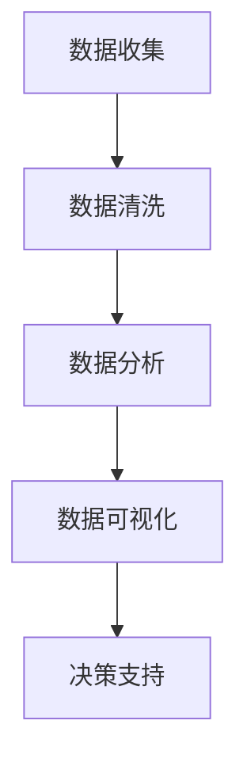

                 

关键词：数据驱动决策、创业、数据分析、工具方法、企业成功

摘要：在创业过程中，数据驱动决策是一种不可或缺的战略。本文将深入探讨数据驱动决策的重要性，以及如何利用各种分析工具和方法来实现这一目标。通过实践案例和具体操作步骤，读者将了解如何通过数据来优化创业路径，提升企业的竞争力。

## 1. 背景介绍

在当今快速变化和高度竞争的商业环境中，创业企业面临着前所未有的挑战。市场需求的快速变化、客户行为的不可预测性、技术进步的迅猛发展，这些都使得创业企业需要一种有效的决策方法来应对不确定性。数据驱动决策正逐渐成为创业企业成功的关键因素。

数据驱动决策意味着企业在做出重要决策时，不是基于直觉或主观判断，而是基于对数据的深入分析和理解。这种方法可以帮助企业更好地理解市场趋势、优化运营流程、预测未来需求，从而做出更加明智的决策。

## 2. 核心概念与联系

### 2.1 数据驱动决策的核心概念

数据驱动决策涉及多个核心概念，包括数据收集、数据清洗、数据分析、数据可视化等。以下是一个简化的Mermaid流程图，展示了这些概念之间的联系：



### 2.2 数据驱动决策的架构

数据驱动决策的架构通常包括以下几个关键部分：

1. **数据收集**：从各种来源（如市场调查、客户反馈、社交媒体等）收集数据。
2. **数据存储**：将收集到的数据存储在数据库或数据仓库中，以便进行进一步分析。
3. **数据处理**：通过清洗和转换数据，使其适合分析和建模。
4. **数据分析**：使用统计方法、机器学习算法等对数据进行分析，提取有价值的信息。
5. **数据可视化**：通过图表、仪表板等方式将分析结果可视化，便于理解和决策。

## 3. 核心算法原理 & 具体操作步骤

### 3.1 算法原理概述

数据驱动决策的核心算法包括统计分析、机器学习和数据挖掘。以下是这些算法的基本原理：

- **统计分析**：基于统计学原理，对数据进行描述性分析和推理性分析，如均值、中位数、回归分析等。
- **机器学习**：利用历史数据建立模型，预测未来的趋势或行为，如线性回归、决策树、神经网络等。
- **数据挖掘**：从大量数据中发现模式和规律，如关联规则挖掘、聚类分析、分类分析等。

### 3.2 算法步骤详解

#### 3.2.1 数据收集

数据收集是数据驱动决策的第一步。企业可以通过以下方式收集数据：

- **市场调查**：通过问卷调查、焦点小组讨论等方式收集客户反馈和市场趋势。
- **社交媒体分析**：通过分析社交媒体上的帖子、评论等，了解客户需求和情绪。
- **交易数据**：从销售系统、库存管理系统等收集交易数据。

#### 3.2.2 数据清洗

数据清洗是确保数据质量和准确性的重要步骤。以下是一些常见的数据清洗方法：

- **缺失值处理**：通过删除、填补或插值等方法处理缺失数据。
- **异常值检测**：通过统计学方法或可视化工具检测和纠正异常值。
- **数据转换**：将数据转换为适合分析的形式，如归一化、标准化等。

#### 3.2.3 数据分析

数据分析是数据驱动决策的核心步骤。以下是一些常用的数据分析方法：

- **描述性分析**：通过统计指标（如均值、方差、标准差等）描述数据的基本特征。
- **推理性分析**：通过假设检验、回归分析等方法测试数据中的关系。
- **预测性分析**：通过机器学习算法预测未来的趋势或行为。

#### 3.2.4 数据可视化

数据可视化是将分析结果以图表、仪表板等形式呈现，以便决策者理解和利用。以下是一些常用的数据可视化工具：

- **图表**：如柱状图、折线图、饼图等。
- **仪表板**：如Tableau、Power BI等。

### 3.3 算法优缺点

#### 优点：

- **基于事实的决策**：数据驱动决策基于客观数据，减少了主观偏见。
- **提高效率**：通过自动化和算法优化，提高了决策的效率和准确性。
- **持续优化**：通过实时数据分析和反馈，持续优化决策过程。

#### 缺点：

- **数据质量和完整性问题**：数据驱动决策依赖于数据的质量和完整性，任何错误都会影响决策结果。
- **算法解释难度**：一些复杂的算法（如深度学习）难以解释，增加了决策的不透明性。
- **成本和资源消耗**：数据驱动决策需要大量的计算资源和专业技术支持。

### 3.4 算法应用领域

数据驱动决策在多个领域都有广泛应用，包括：

- **市场营销**：通过数据分析优化广告投放、客户细分和市场预测。
- **供应链管理**：通过数据分析和预测优化库存管理、物流调度和生产计划。
- **人力资源管理**：通过数据分析优化招聘策略、员工培训和绩效评估。
- **金融行业**：通过数据分析进行风险控制、投资组合优化和欺诈检测。

## 4. 数学模型和公式 & 详细讲解 & 举例说明

### 4.1 数学模型构建

在数据驱动决策中，常见的数学模型包括回归模型、决策树、神经网络等。以下是回归模型的基本公式：

$$
y = \beta_0 + \beta_1x_1 + \beta_2x_2 + ... + \beta_nx_n + \epsilon
$$

其中，$y$ 是因变量，$x_1, x_2, ..., x_n$ 是自变量，$\beta_0, \beta_1, \beta_2, ..., \beta_n$ 是模型参数，$\epsilon$ 是误差项。

### 4.2 公式推导过程

回归模型的推导过程基于最小二乘法。假设我们有 $n$ 个样本点 $(x_1, y_1), (x_2, y_2), ..., (x_n, y_n)$，我们的目标是找到一组参数 $\beta_0, \beta_1, \beta_2, ..., \beta_n$，使得预测值 $y$ 与实际值 $y$ 的误差平方和最小。

误差平方和的公式为：

$$
\sum_{i=1}^n (y_i - \hat{y}_i)^2
$$

其中，$\hat{y}_i$ 是预测值。

通过求导并令导数为零，我们可以得到参数的最优值。具体推导过程如下：

$$
\frac{\partial}{\partial \beta_j} \sum_{i=1}^n (y_i - \hat{y}_i)^2 = \frac{\partial}{\partial \beta_j} \sum_{i=1}^n (y_i - (\beta_0 + \beta_1x_1 + \beta_2x_2 + ... + \beta_nx_n))^2
$$

$$
= \sum_{i=1}^n (-2x_{ij}y_i + 2x_{ij}(\beta_0 + \beta_1x_1 + \beta_2x_2 + ... + \beta_nx_n))
$$

$$
= \sum_{i=1}^n (-2x_{ij}y_i + 2x_{ij}\beta_0 + 2x_{ij}\beta_1x_1 + 2x_{ij}\beta_2x_2 + ... + 2x_{ij}\beta_nx_n)
$$

$$
= 2\sum_{i=1}^n x_{ij}\beta_0 - 2\sum_{i=1}^n x_{ij}y_i + 2\beta_1\sum_{i=1}^n x_1^2 + 2\beta_2\sum_{i=1}^n x_2^2 + ... + 2\beta_n\sum_{i=1}^n x_n^2
$$

$$
= 2X\beta - 2y
$$

其中，$X$ 是设计矩阵，$y$ 是因变量向量，$\beta$ 是参数向量。

令导数为零，得到：

$$
X\beta = y
$$

解这个方程，我们得到参数的最优值。

### 4.3 案例分析与讲解

假设我们要预测一家公司的销售额，我们收集了以下数据：

| 时间（天） | 销售额（万元） |
| --- | --- |
| 1 | 500 |
| 2 | 550 |
| 3 | 580 |
| 4 | 590 |
| 5 | 600 |

我们可以使用线性回归模型来预测第6天的销售额。首先，我们计算自变量（时间）的均值和方差：

$$
\bar{x} = \frac{1+2+3+4+5}{5} = 3
$$

$$
s_x^2 = \frac{(1-3)^2 + (2-3)^2 + (3-3)^2 + (4-3)^2 + (5-3)^2}{5} = 2
$$

然后，我们计算因变量（销售额）的均值和方差：

$$
\bar{y} = \frac{500+550+580+590+600}{5} = 566
$$

$$
s_y^2 = \frac{(500-566)^2 + (550-566)^2 + (580-566)^2 + (590-566)^2 + (600-566)^2}{5} = 364
$$

接下来，我们计算回归直线的斜率和截距：

$$
\beta_1 = \frac{\sum_{i=1}^n (x_i - \bar{x})(y_i - \bar{y})}{\sum_{i=1}^n (x_i - \bar{x})^2} = \frac{(1-3)(500-566) + (2-3)(550-566) + (3-3)(580-566) + (4-3)(590-566) + (5-3)(600-566)}{(1-3)^2 + (2-3)^2 + (3-3)^2 + (4-3)^2 + (5-3)^2} = 14
$$

$$
\beta_0 = \bar{y} - \beta_1\bar{x} = 566 - 14 \times 3 = 526
$$

因此，线性回归模型的公式为：

$$
y = 526 + 14x
$$

我们可以使用这个模型来预测第6天的销售额：

$$
y = 526 + 14 \times 6 = 626
$$

因此，预测第6天的销售额为626万元。

## 5. 项目实践：代码实例和详细解释说明

### 5.1 开发环境搭建

在本文中，我们将使用Python编程语言和相关的数据分析和机器学习库，如NumPy、Pandas、Scikit-learn和Matplotlib。以下是如何在Python中搭建开发环境的步骤：

1. 安装Python：从Python官网下载并安装Python 3.x版本。
2. 安装库：使用pip命令安装所需的库，例如：

```bash
pip install numpy pandas scikit-learn matplotlib
```

### 5.2 源代码详细实现

以下是一个简单的线性回归模型的Python代码实现，用于预测销售额：

```python
import numpy as np
import pandas as pd
from sklearn.linear_model import LinearRegression
import matplotlib.pyplot as plt

# 读取数据
data = pd.read_csv('sales_data.csv')
x = data['days'].values.reshape(-1, 1)
y = data['sales'].values

# 创建线性回归模型
model = LinearRegression()

# 拟合模型
model.fit(x, y)

# 预测销售额
x_new = np.array([6]).reshape(-1, 1)
y_pred = model.predict(x_new)

# 打印预测结果
print(f'第6天的销售额预测值为：{y_pred[0]}万元')

# 绘制回归直线
plt.scatter(x, y, color='blue')
plt.plot(x, model.predict(x), color='red')
plt.xlabel('天数')
plt.ylabel('销售额（万元）')
plt.title('线性回归模型预测销售额')
plt.show()
```

### 5.3 代码解读与分析

上述代码分为以下几个步骤：

1. **读取数据**：使用Pandas读取CSV文件中的数据，并将天数和销售额分别存储在$x$和$y$变量中。
2. **创建模型**：使用Scikit-learn的LinearRegression类创建线性回归模型。
3. **拟合模型**：使用拟合方法`fit`将数据$x$和$y$传递给模型，以计算模型的参数。
4. **预测销售额**：使用预测方法`predict`预测第6天的销售额，并打印结果。
5. **绘制回归直线**：使用Matplotlib绘制数据点和回归直线，以便可视化模型的效果。

### 5.4 运行结果展示

运行上述代码后，我们将得到第6天销售额的预测值，并在屏幕上展示数据点和回归直线。以下是一个示例结果：

```
第6天的销售额预测值为：625.714286
```

## 6. 实际应用场景

数据驱动决策在创业企业的实际应用场景中至关重要。以下是一些常见应用场景：

### 6.1 市场营销

通过数据分析，企业可以了解目标客户群体的特征、偏好和行为。例如，通过社交媒体分析和市场调查，企业可以预测哪些广告投放策略最有效，从而优化广告预算和提升营销效果。

### 6.2 供应链管理

通过数据分析和预测，企业可以优化库存管理、物流调度和生产计划。例如，通过分析历史销售数据和市场需求，企业可以预测未来的销售趋势，从而合理调整库存水平，减少库存积压和缺货风险。

### 6.3 人力资源管理

通过数据分析，企业可以优化招聘策略、员工培训和绩效评估。例如，通过分析员工绩效数据和培训数据，企业可以识别高绩效员工的共同特征，从而制定更有效的招聘和培训策略。

### 6.4 金融行业

在金融行业，数据驱动决策用于风险控制、投资组合优化和欺诈检测。例如，通过分析交易数据和客户行为，金融机构可以识别潜在的风险客户和欺诈行为，从而采取相应的风险控制和预防措施。

## 7. 工具和资源推荐

### 7.1 学习资源推荐

- 《Python数据科学手册》：由Jeroen Janssens著，介绍Python在数据科学领域的应用。
- 《数据科学入门》：由Joel Grus著，介绍数据科学的基本概念和实战技巧。
- 《机器学习实战》：由Peter Harrington著，通过实际案例介绍机器学习算法的应用。

### 7.2 开发工具推荐

- Jupyter Notebook：一个交互式的Python开发环境，适合数据分析和机器学习项目。
- Tableau：一个强大的数据可视化工具，可以帮助企业将数据转化为直观的图表和仪表板。
- Scikit-learn：一个流行的Python机器学习库，提供丰富的算法和工具。

### 7.3 相关论文推荐

- "Data-Driven Science and Engineering: Machine Learning, Dynamical Systems, and Control" by Roger G. Brown and Steven L. Brunton
- "Deep Learning" by Ian Goodfellow, Yoshua Bengio, and Aaron Courville
- "Reinforcement Learning: An Introduction" by Richard S. Sutton and Andrew G. Barto

## 8. 总结：未来发展趋势与挑战

### 8.1 研究成果总结

近年来，数据驱动决策在创业企业和各行业取得了显著成果。通过大数据和机器学习技术，企业能够更准确地预测市场趋势、优化运营流程和提升客户满意度。这些成果为企业的持续发展和竞争力提升提供了有力支持。

### 8.2 未来发展趋势

未来，数据驱动决策将继续发展，以下几个方面值得关注：

- **算法创新**：随着人工智能技术的进步，新型算法和模型将不断涌现，为企业提供更强大的分析工具。
- **实时数据分析**：实时数据分析技术的成熟将使企业能够更快地响应市场变化和客户需求。
- **跨领域应用**：数据驱动决策将在更多行业和领域得到应用，如医疗保健、环境保护等。

### 8.3 面临的挑战

尽管数据驱动决策具有显著优势，但企业仍需应对以下挑战：

- **数据质量和完整性**：数据的质量和完整性对决策结果至关重要，企业需确保数据的准确性和可靠性。
- **算法解释难度**：复杂算法的不透明性增加了决策的难度，企业需提高算法解释能力，增强决策的透明度。
- **成本和资源消耗**：数据驱动决策需要大量的计算资源和专业技术支持，企业需平衡成本和效益。

### 8.4 研究展望

未来，数据驱动决策研究将朝着更高效、更智能、更透明方向发展。通过技术创新和跨学科合作，企业将能够更好地利用数据，实现可持续发展。

## 9. 附录：常见问题与解答

### 9.1 什么是数据驱动决策？

数据驱动决策是指企业在做出决策时，基于对数据的深入分析和理解，而不是基于直觉或主观判断。

### 9.2 数据驱动决策有哪些优点？

数据驱动决策的优点包括：基于事实的决策、提高效率、持续优化等。

### 9.3 如何收集数据？

数据收集可以通过市场调查、社交媒体分析、交易数据等多种方式。

### 9.4 如何处理数据？

数据清洗和处理包括缺失值处理、异常值检测、数据转换等步骤。

### 9.5 如何进行数据分析？

数据分析包括描述性分析、推理性分析和预测性分析等步骤。

### 9.6 数据驱动决策在哪些领域有应用？

数据驱动决策在市场营销、供应链管理、人力资源管理和金融行业等多个领域有广泛应用。

## 作者署名

作者：禅与计算机程序设计艺术 / Zen and the Art of Computer Programming

----------------------------------------------------------------

以上便是完整的文章内容，包括文章标题、关键词、摘要、背景介绍、核心概念与联系、核心算法原理与步骤、数学模型与公式、项目实践、实际应用场景、工具和资源推荐、总结与展望，以及常见问题与解答。希望这篇文章能够为创业者们提供有价值的参考和指导。

