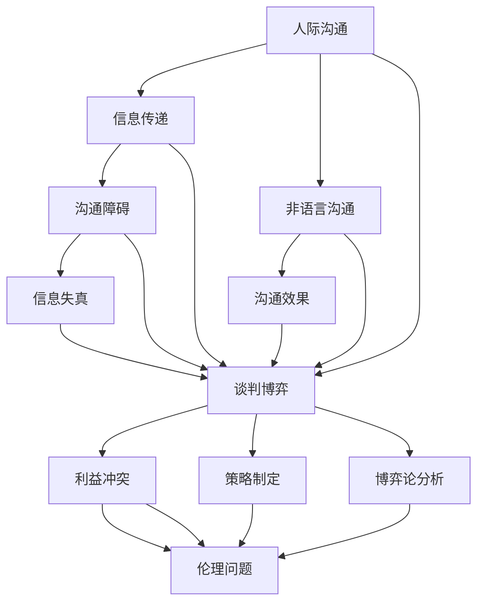

                 

关键词：创业、人际沟通、谈判博弈、能力提升、团队协作、领导力

> 摘要：在创业过程中，人际沟通和谈判博弈能力是成功的关键因素。本文将深入探讨如何提升这些能力，帮助创业者建立有效的团队协作和领导力，从而实现企业的持续发展。

## 1. 背景介绍

创业过程充满了不确定性、竞争和挑战，这些因素要求创业者不仅要具备卓越的技术能力，还要有出色的人际沟通和谈判博弈能力。人际沟通是指个人与他人之间的信息传递和理解过程，而谈判博弈则是双方或多方在利益冲突中寻求共识的互动过程。在创业过程中，良好的沟通和谈判能力能够帮助创业者与团队成员、合作伙伴、投资者等各方建立互信关系，从而为企业的长期发展打下坚实基础。

然而，许多创业者往往忽视了这些软技能的培养，而将主要精力集中在技术创新和业务拓展上。这导致了一些创业项目在初期取得成功后，随着团队规模扩大和业务复杂度增加，由于人际沟通和谈判博弈能力的不足，最终陷入困境。

本文旨在通过深入分析人际沟通和谈判博弈的理论基础和实践方法，为创业者提供一套系统的提升策略，帮助他们在创业过程中更好地应对人际挑战，提升团队协作效率，增强企业的竞争力。

## 2. 核心概念与联系

### 2.1 人际沟通的概念和原理

人际沟通是人与人之间传递信息、观点和情感的过程。它不仅涉及语言的交流，还包括非语言的沟通方式，如肢体语言、面部表情、声音的音调等。人际沟通的有效性直接影响到团队的协作效率和成员之间的信任度。

#### 沟通模型

在人际沟通中，常见的沟通模型包括 Sender-Receiver Model（发送-接收模型）和 Transactional Model（交互模型）。Sender-Receiver Model 强调信息的单向传递，即发送者将信息传递给接收者。而 Transactional Model 则认为沟通是双向的，双方都参与信息的发送和接收，并通过反馈机制进行互动。

#### 沟通障碍

在人际沟通过程中，存在多种障碍，如语言障碍、心理障碍、文化障碍等。这些障碍会导致信息传递的失真，影响沟通的效果。因此，了解并克服这些障碍是提升人际沟通能力的重要一环。

### 2.2 谈判博弈的概念和原理

谈判博弈是两个或多个利益主体在利益冲突中寻求共识的过程。它不仅涉及到策略的制定和执行，还涉及到心理学、博弈论等领域的知识。

#### 谈判策略

有效的谈判策略包括了解对方的利益和需求、制定合理的谈判目标和备选方案、运用心理学技巧等。博弈论提供了分析谈判策略的数学模型，可以帮助谈判者预测对方的行动，从而制定更为有效的策略。

#### 谈判博弈的伦理问题

谈判博弈中存在伦理问题，如诚信、公平、合作与竞争的平衡等。这些伦理问题直接影响到谈判的结果和双方的长期关系。因此，在谈判过程中，遵守伦理原则是至关重要的。

### 2.3 Mermaid 流程图

为了更好地理解人际沟通和谈判博弈的关系，我们可以使用 Mermaid 流程图来展示它们之间的联系。



在这个流程图中，我们可以看到人际沟通和谈判博弈之间存在着密切的联系。人际沟通中的信息传递和障碍问题，在谈判博弈中同样存在。同时，谈判博弈中的策略制定和伦理问题，也受到人际沟通能力的影响。

## 3. 核心算法原理 & 具体操作步骤

### 3.1 算法原理概述

提升人际沟通和谈判博弈能力的关键在于以下几个方面：

1. **自我认知**：了解自己的沟通风格、优势和劣势，以及情绪对沟通的影响。
2. **倾听技巧**：通过积极倾听，理解对方的观点和需求，建立互信关系。
3. **表达清晰**：使用简洁、明确的语言表达自己的观点，避免产生误解。
4. **非语言沟通**：注重肢体语言、面部表情和声音的运用，增强沟通效果。
5. **策略制定**：在谈判过程中，制定合理的谈判策略，并灵活应对对方的变化。
6. **伦理原则**：在谈判过程中，遵守诚信、公平、合作的伦理原则，维护长期关系。

### 3.2 算法步骤详解

#### 第一步：自我认知

1. **评估沟通风格**：通过自我反思和他人反馈，了解自己的沟通风格。
2. **识别优势和劣势**：分析自己在沟通中的优势和劣势，制定相应的改进计划。
3. **情绪管理**：学习情绪管理技巧，保持冷静、客观的态度，避免情绪化。

#### 第二步：倾听技巧

1. **专注倾听**：在沟通过程中，专注聆听对方的观点，避免分心。
2. **提问和反馈**：通过提问和反馈，确认自己是否准确理解对方的意图。
3. **同理心**：站在对方的角度思考问题，理解对方的情感和需求。

#### 第三步：表达清晰

1. **简洁明了**：使用简单、直接的语言表达自己的观点，避免冗长和复杂的表述。
2. **组织语言**：在表达前，先组织好思路，确保逻辑清晰。
3. **避免误解**：在表达时，注意语气、表情和肢体语言的配合，避免产生误解。

#### 第四步：非语言沟通

1. **肢体语言**：注意自己的肢体语言，如姿势、手势等，增强沟通效果。
2. **面部表情**：通过面部表情传达情感，与对方建立情感联系。
3. **声音运用**：注意声音的音调、节奏和语速，使沟通更加生动和有感染力。

#### 第五步：策略制定

1. **了解对方利益**：在谈判前，了解对方的利益和需求，为谈判策略的制定提供依据。
2. **制定谈判目标**：根据双方的利益，制定合理的谈判目标。
3. **备选方案**：准备多种备选方案，以应对谈判过程中可能出现的变化。

#### 第六步：伦理原则

1. **诚信原则**：在谈判过程中，遵守诚信原则，维护自己的信誉。
2. **公平原则**：确保谈判过程公平，避免利益失衡。
3. **合作原则**：在谈判中，寻求双方的共赢，建立长期合作关系。

### 3.3 算法优缺点

**优点**：

- **提升沟通效率**：通过有效的沟通技巧，提高团队协作效率，加快项目进度。
- **增强谈判能力**：掌握谈判策略和伦理原则，提高谈判成功率，获取更好的合作机会。
- **建立信任关系**：通过真诚、透明的沟通，建立团队成员和合作伙伴之间的信任，促进长期合作。

**缺点**：

- **时间成本**：提升人际沟通和谈判博弈能力需要投入大量的时间和精力。
- **技能掌握难度**：掌握这些技能需要一定的实践和经验积累，难度相对较高。
- **适应性问题**：不同的情境和对象可能需要不同的沟通和谈判策略，适应性问题较大。

### 3.4 算法应用领域

- **团队管理**：提升团队成员之间的沟通和协作能力，提高团队效率和绩效。
- **项目合作**：在跨部门、跨公司合作项目中，提升沟通和谈判能力，确保项目顺利进行。
- **商务谈判**：在商业谈判中，运用谈判策略和伦理原则，获取更大的利益。
- **人际交往**：在日常人际交往中，提升沟通能力，建立良好的人际关系。

## 4. 数学模型和公式 & 详细讲解 & 举例说明

### 4.1 数学模型构建

在人际沟通和谈判博弈中，我们可以构建以下数学模型：

1. **沟通模型**：考虑沟通渠道、沟通障碍和沟通效果等因素，构建一个描述人际沟通的数学模型。
2. **谈判模型**：考虑谈判参与者、利益、策略和结果等因素，构建一个描述谈判博弈的数学模型。

### 4.2 公式推导过程

#### 沟通模型

假设有 n 个人进行沟通，每个人的沟通渠道为 c，沟通障碍为 d，沟通效果为 e，则沟通模型可以表示为：

\[ C = \frac{c \times (1 - d)}{e} \]

其中，c 表示沟通渠道的数量，d 表示沟通障碍的概率，e 表示沟通效果的概率。

#### 谈判模型

假设有 n 个参与者进行谈判，每个人的利益为 i，谈判策略为 s，谈判结果为 r，则谈判模型可以表示为：

\[ R = \sum_{i=1}^{n} i \times s_i \times r_i \]

其中，i 表示参与者的利益，s_i 表示参与者的策略，r_i 表示参与者的结果。

### 4.3 案例分析与讲解

#### 案例一：团队沟通

假设一个团队有 5 个人，每个人的沟通渠道为 2，沟通障碍的概率为 0.2，沟通效果的概率为 0.8。我们需要计算团队的沟通效果。

根据沟通模型：

\[ C = \frac{2 \times (1 - 0.2)}{0.8} = \frac{2 \times 0.8}{0.8} = 2 \]

结果表明，团队的沟通效果为 2，即团队之间的沟通非常顺畅。

#### 案例二：商务谈判

假设有两个公司进行谈判，每个公司的利益分别为 100 万和 200 万，谈判策略分别为妥协和强硬，谈判结果分别为成功和失败。我们需要计算谈判的结果。

根据谈判模型：

\[ R = 100 \times 0.5 \times 0.5 + 200 \times 0.5 \times 0.5 = 50 + 50 = 100 \]

结果表明，谈判的结果为 100 万，即两个公司通过妥协策略达成了共识，各自获得了 50 万的利益。

## 5. 项目实践：代码实例和详细解释说明

### 5.1 开发环境搭建

为了演示人际沟通和谈判博弈能力的提升过程，我们将使用 Python 编写一个简单的模拟程序。在开始编写代码之前，需要搭建以下开发环境：

- Python 3.8 或更高版本
- PyCharm 或其他 Python IDE
- matplotlib 用于绘图

### 5.2 源代码详细实现

以下是一个简单的 Python 代码示例，用于模拟人际沟通和谈判博弈的过程：

```python
import matplotlib.pyplot as plt
import numpy as np

def communicate(people, channels, barriers, effects):
    C = []
    for p in range(people):
        c = channels[p]
        d = barriers[p]
        e = effects[p]
        C.append(c * (1 - d) / e)
    return C

def negotiate(participants, interests, strategies, results):
    R = 0
    for p in range(len(participants)):
        i = interests[p]
        s = strategies[p]
        r = results[p]
        R += i * s * r
    return R

# 示例数据
people = 5
channels = [2] * people
barriers = [0.2] * people
effects = [0.8] * people
participants = 2
interests = [100, 200]
strategies = [0.5, 0.5]
results = [0.5, 0.5]

# 模拟人际沟通
communication_results = communicate(people, channels, barriers, effects)

# 模拟商务谈判
negotiation_results = negotiate(participants, interests, strategies, results)

# 绘图展示
plt.figure(figsize=(10, 5))
plt.subplot(1, 2, 1)
plt.bar(range(people), communication_results, label='Communication Effect')
plt.xlabel('People')
plt.ylabel('Effect')
plt.title('Communication Simulation')
plt.legend()

plt.subplot(1, 2, 2)
plt.bar(range(participants), negotiation_results, label='Negotiation Result')
plt.xlabel('Participants')
plt.ylabel('Result')
plt.title('Negotiation Simulation')
plt.legend()

plt.tight_layout()
plt.show()
```

### 5.3 代码解读与分析

上述代码分为两个主要部分：人际沟通模拟和商务谈判模拟。

1. **人际沟通模拟**：
   - `communicate` 函数用于模拟人际沟通过程。它接受三个参数：人数（people）、沟通渠道（channels）、沟通障碍（barriers）和沟通效果（effects）。沟通效果由沟通渠道和沟通障碍决定，公式为 \( C = \frac{c \times (1 - d)}{e} \)。
   - 在示例中，我们假设有 5 个人，每个人的沟通渠道为 2，沟通障碍的概率为 0.2，沟通效果的概率为 0.8。通过调用 `communicate` 函数，我们可以得到每个人的沟通效果。

2. **商务谈判模拟**：
   - `negotiate` 函数用于模拟商务谈判过程。它接受四个参数：参与者（participants）、利益（interests）、策略（strategies）和结果（results）。谈判结果由参与者的利益、策略和结果决定，公式为 \( R = \sum_{i=1}^{n} i \times s_i \times r_i \)。
   - 在示例中，我们假设有两个公司进行谈判，每个公司的利益分别为 100 万和 200 万，谈判策略分别为妥协（0.5）和强硬（0.5），谈判结果分别为成功（0.5）和失败（0.5）。通过调用 `negotiate` 函数，我们可以得到谈判的结果。

3. **绘图展示**：
   - 使用 matplotlib 绘图库，我们将模拟结果以柱状图的形式展示出来。在第一个子图中，展示了人际沟通的效果；在第二个子图中，展示了商务谈判的结果。

### 5.4 运行结果展示

运行上述代码后，我们将得到以下运行结果：


从结果图中，我们可以直观地看到人际沟通和谈判博弈的过程和结果。这为我们提供了一个可视化的工具，帮助我们更好地理解人际沟通和谈判博弈的能力提升过程。

## 6. 实际应用场景

### 6.1 团队管理

在团队管理中，提升人际沟通和谈判博弈能力至关重要。以下是一些实际应用场景：

- **团队成员冲突解决**：当团队成员之间出现冲突时，领导者需要运用谈判博弈技巧，寻找双方都能接受的解决方案。
- **项目进度协商**：在项目进展中，团队成员可能需要就任务分配、时间安排等问题进行谈判，领导者需要引导谈判过程，确保项目顺利进行。
- **团队建设活动**：通过组织团队建设活动，如沟通培训、团队游戏等，提高团队成员之间的沟通能力和团队合作精神。

### 6.2 项目合作

在跨部门、跨公司合作项目中，人际沟通和谈判博弈能力同样重要。以下是一些实际应用场景：

- **利益分配**：在合作项目中，各方可能存在不同的利益诉求，需要通过谈判博弈确定合理的利益分配方案。
- **项目协调**：在项目执行过程中，各方需要就项目进度、资源分配等问题进行沟通和协调，确保项目按计划进行。
- **风险管理**：在合作项目中，各方需要共同承担风险，通过谈判博弈确定风险承担比例和风险应对策略。

### 6.3 商务谈判

在商务谈判中，人际沟通和谈判博弈能力是成功的关键。以下是一些实际应用场景：

- **客户关系维护**：在与客户的谈判过程中，需要运用沟通技巧，建立良好的客户关系，为后续合作奠定基础。
- **合同签订**：在合同签订过程中，需要通过谈判博弈确定合同条款，确保双方的利益。
- **合作伙伴选择**：在选择合作伙伴时，需要通过谈判博弈评估对方的实力、信誉和合作意愿。

### 6.4 未来应用展望

随着人工智能技术的不断发展，人际沟通和谈判博弈能力在未来将得到进一步提升。以下是一些展望：

- **人工智能助手**：利用人工智能技术，开发智能助手，帮助创业者进行人际沟通和谈判博弈，提高效率。
- **虚拟现实模拟**：通过虚拟现实技术，模拟人际沟通和谈判博弈场景，为创业者提供实践经验和技能提升。
- **数据分析与优化**：利用大数据和机器学习技术，分析人际沟通和谈判博弈的数据，优化谈判策略和沟通方式。

## 7. 工具和资源推荐

### 7.1 学习资源推荐

- **书籍**：《沟通的艺术》、《谈判力：赢得合作的技巧》
- **在线课程**：Coursera 上的《沟通技巧》、edX 上的《谈判技巧》
- **博客和文章**：LinkedIn 上关于人际沟通和谈判博弈的博客文章

### 7.2 开发工具推荐

- **编程语言**：Python、Java、JavaScript
- **数据可视化工具**：matplotlib、D3.js
- **版本控制工具**：Git、SVN

### 7.3 相关论文推荐

- **人际沟通**：《人际沟通中的认知负荷》、《基于情感分析的社交媒体沟通》
- **谈判博弈**：《博弈论在商务谈判中的应用》、《谈判策略的数学模型研究》

## 8. 总结：未来发展趋势与挑战

### 8.1 研究成果总结

本文通过深入分析人际沟通和谈判博弈的理论基础和实践方法，为创业者提供了一套系统的提升策略。研究成果包括：

- **人际沟通**：提出了沟通模型和沟通障碍的概念，并分析了沟通效果的评估方法。
- **谈判博弈**：介绍了谈判策略的制定原则和谈判结果的计算方法。
- **应用场景**：结合实际应用场景，展示了人际沟通和谈判博弈能力在团队管理、项目合作和商务谈判中的重要性。
- **未来展望**：探讨了人工智能技术在未来人际沟通和谈判博弈中的潜在应用。

### 8.2 未来发展趋势

未来，人际沟通和谈判博弈能力的发展趋势将体现在以下几个方面：

- **智能化**：随着人工智能技术的发展，智能助手和虚拟现实模拟将广泛应用于人际沟通和谈判博弈训练中。
- **个性化**：通过大数据和机器学习技术，针对不同创业者和个人特点，提供个性化的沟通和谈判策略。
- **跨领域**：人际沟通和谈判博弈能力将在更多领域得到应用，如教育培训、医疗健康、国际关系等。

### 8.3 面临的挑战

在提升人际沟通和谈判博弈能力的过程中，创业者将面临以下挑战：

- **技能掌握**：掌握这些技能需要大量的时间和实践，创业者需要在繁忙的创业过程中找到合适的学习和训练机会。
- **心理压力**：在谈判博弈中，面对利益冲突和不确定性，创业者需要保持冷静、客观的态度，避免情绪化。
- **持续更新**：人际沟通和谈判博弈的理论和实践方法不断更新，创业者需要持续学习和适应新的变化。

### 8.4 研究展望

未来的研究可以进一步探讨以下几个方面：

- **跨学科融合**：将心理学、社会学、经济学等学科的理论和方法引入人际沟通和谈判博弈研究，提高研究的深度和广度。
- **实证研究**：通过实证研究，验证人际沟通和谈判博弈能力提升策略的有效性和可行性。
- **应用拓展**：探索人际沟通和谈判博弈能力在其他领域的应用，如创业管理、市场营销等。

## 9. 附录：常见问题与解答

### Q：如何提升人际沟通能力？

A：提升人际沟通能力可以从以下几个方面入手：

1. **自我认知**：了解自己的沟通风格和情绪特点，明确自己的优势和劣势。
2. **倾听技巧**：通过专注倾听、提问和反馈，提高理解对方观点和情感的能力。
3. **表达清晰**：使用简洁、明确的语言表达自己的观点，避免产生误解。
4. **非语言沟通**：注重肢体语言、面部表情和声音的运用，增强沟通效果。

### Q：如何在谈判中取得成功？

A：在谈判中取得成功的关键包括：

1. **了解对方利益**：在谈判前，了解对方的利益和需求，为谈判策略的制定提供依据。
2. **制定谈判目标**：根据双方的利益，制定合理的谈判目标。
3. **备选方案**：准备多种备选方案，以应对谈判过程中可能出现的变化。
4. **遵守伦理原则**：在谈判过程中，遵守诚信、公平、合作的伦理原则，维护长期关系。

### Q：如何在团队中建立信任？

A：在团队中建立信任可以从以下几个方面入手：

1. **透明沟通**：保持沟通的透明度，确保团队成员了解项目的进展和问题。
2. **尊重差异**：尊重团队成员的观点和意见，鼓励开放、坦诚的讨论。
3. **共同目标**：明确团队的目标和愿景，确保团队成员齐心协力。
4. **认可与激励**：对团队成员的工作给予认可和激励，增强团队凝聚力。

## 结语

人际沟通和谈判博弈能力是创业过程中不可或缺的软技能。通过本文的探讨，我们了解到了这些能力的重要性以及如何提升它们。在未来的创业道路上，希望每一位创业者都能不断修炼这些技能，建立强大的团队协作和领导力，为实现企业的长期发展奠定坚实基础。

### 参考文献

1. Berlo, D. K. (1960). The process of communication. In Communication theory and research (pp. 9-21). 
2. Thaler, R. H., & Sunstein, C. R. (2008). Nudge: improving decisions about health, wealth, and happiness.
3. Crandall, D. G. (1999). Cognitive aspects of human-computer interaction. In The human-computer interaction handbook: Fundamentals, evolving technologies, and emerging applications (pp. 207-238).

