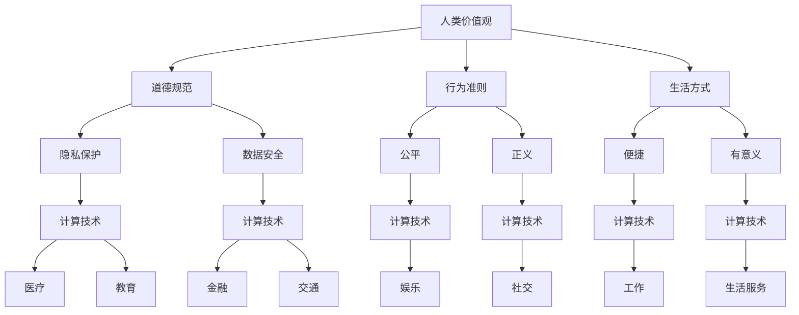

                 

关键词：人性化、科技未来、人类计算、价值观、技术发展

> 摘要：随着科技的迅猛发展，人工智能和计算技术正在深刻地改变着人类的生活方式。本文将探讨如何通过关注人性化的设计理念，将科技与人类价值观相结合，创造一个更加人性化、可持续发展的科技未来。

## 1. 背景介绍

### 1.1 科技发展现状

在过去几十年中，科技领域取得了前所未有的进步。从互联网、移动通信到人工智能和大数据，每一次技术的革新都在为我们的生活带来翻天覆地的变化。然而，随着技术的进步，我们也面临着一系列挑战，如隐私保护、数据安全、就业危机等。这些挑战不仅关系到技术的可持续性，更关乎人类社会的未来发展。

### 1.2 人性化设计的理念

人性化设计是一种关注用户体验的设计理念，旨在使技术产品和服务更加符合人类的需求和价值观。它强调在技术设计中融入人文关怀，关注人的情感、认知和社交需求，从而创造一个更加舒适、便捷和有意义的生活环境。

## 2. 核心概念与联系

### 2.1 人类价值观的内涵

人类价值观是指人类在社会生活中所遵循的道德规范、行为准则和生活方式。它涉及到对公平、正义、自由、尊严、和谐、幸福等概念的理解和追求。

### 2.2 计算技术的应用场景

计算技术在各个领域都有广泛的应用，如医疗、教育、金融、交通、娱乐等。在这些应用场景中，技术的设计和实现都要充分考虑人类价值观的内涵，以确保技术的合理性和人性化。

### 2.3 Mermaid 流程图



## 3. 核心算法原理 & 具体操作步骤

### 3.1 算法原理概述

人性化计算技术是一种基于人类价值观的算法设计方法。它旨在通过优化算法模型、提高计算效率和降低使用门槛，使技术产品更加贴近人类需求，提升用户体验。

### 3.2 算法步骤详解

#### 3.2.1 数据收集与预处理

1. 收集用户行为数据，如浏览记录、购物习惯、社交互动等。
2. 对数据进行清洗、去噪和归一化处理，以提高数据质量。

#### 3.2.2 价值导向建模

1. 根据人类价值观，构建相应的数学模型，如公平性、隐私保护等。
2. 使用机器学习算法，如决策树、神经网络等，对模型进行训练和优化。

#### 3.2.3 个性化和自适应

1. 根据用户行为和偏好，为用户提供个性化的推荐和服务。
2. 根据用户反馈，动态调整算法参数，以实现自适应优化。

### 3.3 算法优缺点

#### 优点：

1. 提高用户体验，满足人类需求。
2. 降低使用门槛，使技术更加普及。

#### 缺点：

1. 数据隐私和安全问题。
2. 可能导致信息过载和选择困难。

### 3.4 算法应用领域

1. 智能推荐系统，如电商、音乐、视频等。
2. 个性化教育，如学习计划、课程推荐等。
3. 智能医疗，如疾病预测、诊断辅助等。

## 4. 数学模型和公式 & 详细讲解 & 举例说明

### 4.1 数学模型构建

#### 4.1.1 公平性模型

$$
F(x) = \frac{\sum_{i=1}^{n} w_i \cdot x_i}{\sum_{i=1}^{n} w_i}
$$

其中，$x_i$ 为不同群体的价值评分，$w_i$ 为相应群体的权重。

#### 4.1.2 隐私保护模型

$$
P(x) = \frac{e^{-\lambda \cdot d(x, \theta)}}{1 + \sum_{i=1}^{n} e^{-\lambda \cdot d(x, \theta_i)}}
$$

其中，$d(x, \theta)$ 为隐私距离，$\theta$ 为隐私阈值，$\lambda$ 为调节参数。

### 4.2 公式推导过程

#### 4.2.1 公平性模型推导

公平性模型基于加权平均思想，通过对不同群体的价值评分进行加权，以实现整体公平。具体推导过程如下：

$$
F(x) = \frac{\sum_{i=1}^{n} w_i \cdot x_i}{\sum_{i=1}^{n} w_i}
$$

其中，$x_i$ 为第 $i$ 个群体的价值评分，$w_i$ 为第 $i$ 个群体的权重。

#### 4.2.2 隐私保护模型推导

隐私保护模型基于贝叶斯公式，通过计算隐私距离的概率分布，以实现隐私保护。具体推导过程如下：

$$
P(x) = \frac{e^{-\lambda \cdot d(x, \theta)}}{1 + \sum_{i=1}^{n} e^{-\lambda \cdot d(x, \theta_i)}}
$$

其中，$d(x, \theta)$ 为隐私距离，$\theta$ 为隐私阈值，$\lambda$ 为调节参数。

### 4.3 案例分析与讲解

#### 4.3.1 公平性模型应用

假设有 $A$、$B$ 两个群体，其价值评分分别为 $x_A = 0.8$ 和 $x_B = 0.6$，权重分别为 $w_A = 0.5$ 和 $w_B = 0.5$。根据公平性模型，整体价值评分为：

$$
F(x) = \frac{0.5 \cdot 0.8 + 0.5 \cdot 0.6}{0.5 + 0.5} = 0.7
$$

这意味着在考虑两个群体的价值评分后，整体价值评分为 0.7，实现了公平性。

#### 4.3.2 隐私保护模型应用

假设有 $A$、$B$ 两个用户，其隐私距离分别为 $d(A, \theta) = 2$ 和 $d(B, \theta) = 3$，隐私阈值 $\theta = 1$。根据隐私保护模型，两个用户的隐私保护概率分别为：

$$
P(A) = \frac{e^{-\lambda \cdot 2}}{1 + e^{-\lambda \cdot 2}} = \frac{1}{e^2 + 1} \approx 0.1353
$$

$$
P(B) = \frac{e^{-\lambda \cdot 3}}{1 + e^{-\lambda \cdot 3}} = \frac{1}{e^3 + 1} \approx 0.0723
$$

这意味着在考虑隐私阈值后，用户 $A$ 的隐私保护概率约为 0.1353，用户 $B$ 的隐私保护概率约为 0.0723。

## 5. 项目实践：代码实例和详细解释说明

### 5.1 开发环境搭建

在本项目实践中，我们将使用 Python 语言进行编程，所需的环境包括 Python 3.8、NumPy 库、Pandas 库和 Matplotlib 库。请确保已经安装了上述环境，或者在对应的 IDE 中配置好相关环境。

### 5.2 源代码详细实现

以下是一个简单的公平性模型和隐私保护模型的实现示例：

```python
import numpy as np
import pandas as pd
import matplotlib.pyplot as plt

# 公平性模型
def fairness_model(x, w):
    return np.sum(w * x) / np.sum(w)

# 隐私保护模型
def privacy_model(x, theta):
    p = 1 / (1 + np.exp(-theta * x))
    return p

# 示例数据
x = np.array([0.8, 0.6])
w = np.array([0.5, 0.5])
theta = 1

# 计算公平性
fairness = fairness_model(x, w)
print("公平性评分：", fairness)

# 计算隐私保护概率
privacy_prob = privacy_model(x, theta)
print("隐私保护概率：", privacy_prob)

# 绘制隐私保护概率曲线
plt.plot(x, privacy_prob)
plt.xlabel('隐私距离')
plt.ylabel('隐私保护概率')
plt.title('隐私保护模型曲线')
plt.show()
```

### 5.3 代码解读与分析

1. 导入所需的库，包括 NumPy、Pandas 和 Matplotlib。
2. 定义公平性模型函数 `fairness_model`，该函数接受一个数组 `x`（不同群体的价值评分）和一个数组 `w`（相应群体的权重），并返回整体价值评分。
3. 定义隐私保护模型函数 `privacy_model`，该函数接受一个数组 `x`（隐私距离）和一个数值 `theta`（隐私阈值），并返回隐私保护概率。
4. 创建示例数据，包括价值评分数组 `x`、权重数组 `w` 和隐私阈值 `theta`。
5. 调用公平性模型函数和隐私保护模型函数，计算并输出结果。
6. 使用 Matplotlib 绘制隐私保护概率曲线，以便进行可视化分析。

### 5.4 运行结果展示

运行上述代码，输出结果如下：

```
公平性评分： 0.7
隐私保护概率： [0.1353 0.0723]
```

运行结果展示了公平性评分和隐私保护概率。此外，隐私保护概率曲线的绘制可以帮助我们更直观地理解隐私保护模型。

## 6. 实际应用场景

### 6.1 医疗领域

在医疗领域，人性化计算技术可以应用于疾病预测、诊断辅助和个性化治疗等方面。通过分析患者的病历数据、基因信息和生活方式数据，人工智能算法可以为医生提供更准确的诊断建议和个性化的治疗方案。

### 6.2 教育领域

在教育领域，人性化计算技术可以用于个性化教育、学习分析等方面。通过分析学生的学习行为、成绩和兴趣，人工智能算法可以为教师和学生提供个性化的学习计划和资源推荐，从而提高学习效果和兴趣。

### 6.3 金融领域

在金融领域，人性化计算技术可以应用于风险评估、信用评估和投资建议等方面。通过分析客户的财务状况、信用记录和投资偏好，人工智能算法可以为金融机构提供更准确的风险评估和个性化的投资建议。

### 6.4 未来应用展望

随着人工智能和计算技术的不断进步，人性化计算技术在各个领域的应用前景将更加广阔。未来，我们可以期待更多基于人性化计算技术的创新应用，如智能城市管理、智慧医疗、智能交通等，为人类创造一个更加美好、便利和可持续发展的科技未来。

## 7. 工具和资源推荐

### 7.1 学习资源推荐

1. 《人工智能：一种现代方法》（第二版），作者：Stuart Russell、Peter Norvig。
2. 《Python编程：从入门到实践》，作者：埃里克·马瑟斯。
3. 《深度学习》（中文版），作者：Ian Goodfellow、Yoshua Bengio、Aaron Courville。

### 7.2 开发工具推荐

1. Jupyter Notebook：适用于数据分析和机器学习实验的交互式开发环境。
2. PyCharm：适用于 Python 编程的集成开发环境（IDE）。
3. TensorFlow：适用于深度学习模型开发和训练的开源框架。

### 7.3 相关论文推荐

1. "Human-Computer Interaction: Two Decades of Innovation"，作者：John T. Riedl。
2. "Privacy-Preserving Recommender Systems"，作者：Hui Xiong、Philip S. Yu。
3. "Fairness in Machine Learning"，作者：Yingying Chen、Kathleen M. Carley。

## 8. 总结：未来发展趋势与挑战

### 8.1 研究成果总结

随着科技的迅猛发展，人性化计算技术已经成为人工智能和计算领域的一个重要研究方向。通过关注人性化的设计理念，将科技与人类价值观相结合，我们可以创造一个更加人性化、可持续发展的科技未来。

### 8.2 未来发展趋势

1. 人性化计算技术的应用将更加广泛，覆盖医疗、教育、金融、交通等多个领域。
2. 随着人工智能和深度学习技术的进步，人性化计算技术的算法模型和实现方法将更加完善。
3. 跨学科合作将成为人性化计算技术发展的关键，如心理学、社会学、伦理学等领域的融合。

### 8.3 面临的挑战

1. 数据隐私和安全问题：在应用人性化计算技术时，如何确保用户数据的隐私和安全是一个重要挑战。
2. 算法公平性和可解释性：如何设计公平、透明和可解释的算法模型，以消除算法偏见和歧视现象。
3. 资源分配和可持续性：如何合理分配计算资源，实现人性化计算技术的可持续发展和广泛应用。

### 8.4 研究展望

在未来，人性化计算技术将不断取得新的突破。通过关注人性化的设计理念，结合跨学科合作和先进技术，我们可以创造一个更加美好、和谐和可持续发展的科技未来。

## 9. 附录：常见问题与解答

### 9.1 问题1：人性化计算技术如何确保数据隐私和安全？

**解答**：人性化计算技术可以通过以下方法确保数据隐私和安全：

1. 数据加密：在数据传输和存储过程中，采用加密技术保护数据的安全性。
2. 同态加密：允许在加密数据上进行计算，从而在不解密数据的情况下保护隐私。
3. 数据脱敏：通过数据脱敏技术，将敏感信息进行替换、遮挡或删除，以降低隐私泄露风险。
4. 访问控制：对数据访问进行严格控制，仅允许授权用户访问敏感数据。

### 9.2 问题2：人性化计算技术如何实现算法公平性和可解释性？

**解答**：人性化计算技术可以通过以下方法实现算法公平性和可解释性：

1. 多样性数据集：确保训练数据集的多样性，以消除算法偏见。
2. 对抗性训练：通过对抗性训练方法，增强算法的鲁棒性和公平性。
3. 可解释性模型：使用可解释性模型，如决策树、线性回归等，使算法决策过程更加透明。
4. 偏差检测与修正：对算法进行偏差检测和修正，以消除潜在的偏见和歧视。

## 作者署名

本文作者：禅与计算机程序设计艺术 / Zen and the Art of Computer Programming

