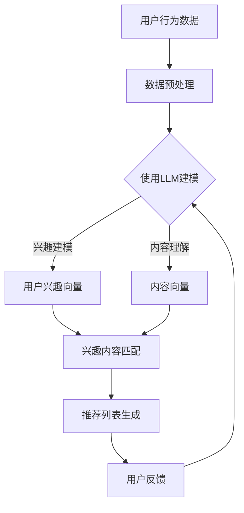

                 

关键词：推荐系统，时间敏感性，预训练语言模型，LLM，机器学习，个人化推荐

## 摘要

本文探讨了如何利用预训练语言模型（LLM）增强推荐系统的时间敏感性建模。随着用户兴趣和行为数据的时间动态变化，推荐系统在保持个性化和时效性方面面临巨大挑战。本文首先介绍了推荐系统中的时间敏感性概念和重要性，然后详细阐述了LLM在时间敏感性建模中的应用，包括核心概念、算法原理、数学模型以及具体实现方法。此外，本文还通过实际项目案例展示了LLM增强推荐系统的效果，并对其未来应用前景进行了展望。通过本文的研究，我们希望能为推荐系统领域的研究者提供新的思路和解决方案。

## 1. 背景介绍

### 推荐系统的基本概念

推荐系统是一种用于为用户提供个性化信息和建议的系统，旨在根据用户的历史行为、偏好和上下文环境，推荐最相关的内容或服务。推荐系统广泛应用于电子商务、社交媒体、在线媒体和内容平台等领域，已成为现代互联网应用的重要组成部分。

### 时间敏感性在推荐系统中的作用

时间敏感性是指推荐系统在处理用户数据时，对时间因素的关注程度。在推荐系统中，时间敏感性对于提升用户体验和系统性能至关重要。具体而言，时间敏感性体现在以下几个方面：

1. **用户行为的时效性**：用户兴趣和行为会随时间变化而变化，因此推荐系统需要动态调整推荐策略，以适应用户当前的兴趣。
2. **内容的时效性**：某些内容或商品具有时间限制，如限时促销、新闻事件等，推荐系统需要及时更新推荐列表，确保用户能够获取最新、最相关的信息。
3. **系统效率**：高效的时间敏感性处理可以提高推荐系统的响应速度，降低延迟，提升用户满意度。

### 传统推荐系统的时间敏感性建模方法

传统推荐系统通常采用以下几种方法来建模时间敏感性：

1. **加权最近策略**：对用户的最近行为赋予更高的权重，以反映用户兴趣的变化。
2. **时间衰减模型**：通过引入时间衰减函数，对用户历史行为进行加权，使得较旧的行为对推荐结果的影响逐渐减弱。
3. **时间窗机制**：设定一个时间窗口，仅考虑用户在该时间窗口内的行为数据，以减少历史数据对当前推荐的影响。

然而，这些传统方法在处理复杂的时间敏感性问题时，往往存在一定局限性。例如，加权最近策略可能导致短期行为过度影响推荐结果，而时间衰减模型和固定时间窗机制又可能无法准确捕捉用户长期兴趣变化。

### 预训练语言模型（LLM）的引入

预训练语言模型（LLM）是一种基于大规模语料库进行预训练的语言处理模型，如BERT、GPT等。LLM具有强大的语言理解和生成能力，已在自然语言处理、文本生成和问答系统等领域取得了显著成果。近年来，研究者开始探索将LLM应用于推荐系统，以解决传统方法面临的挑战。本文将重点介绍如何利用LLM增强推荐系统的时间敏感性建模。

## 2. 核心概念与联系

### 2.1 预训练语言模型（LLM）的概念

预训练语言模型（LLM）是一种基于深度学习的语言处理模型，通过在大规模语料库上进行预训练，学习语言结构和语义信息。LLM通常包含以下几个核心组件：

1. **词嵌入层**：将词汇映射为高维向量，用于表示词汇的语义信息。
2. **编码器**：对输入文本序列进行编码，生成固定长度的表示向量。
3. **解码器**：根据编码器的输出，生成目标文本序列。

常见的LLM模型包括：

1. **BERT（Bidirectional Encoder Representations from Transformers）**：一种双向Transformer模型，通过同时考虑文本序列的上下文信息，提高语义表示的准确性。
2. **GPT（Generative Pre-trained Transformer）**：一种自回归Transformer模型，通过预测后续文本来生成自然语言。

### 2.2 推荐系统与LLM的联系

将LLM应用于推荐系统，可以充分利用其强大的语言理解和生成能力，解决传统方法在处理时间敏感性方面的局限。具体来说，LLM在推荐系统中的应用可以包括以下几个方面：

1. **用户兴趣建模**：利用LLM对用户历史行为和评价进行编码，提取用户兴趣的时序表示，从而实现更精细的用户兴趣建模。
2. **内容理解与匹配**：利用LLM对推荐内容进行语义分析，提取关键信息，实现内容与用户兴趣的精细化匹配。
3. **推荐策略优化**：利用LLM生成的文本序列，优化推荐策略，提高推荐系统的动态适应能力。

### 2.3 Mermaid 流程图

为了更好地展示LLM在推荐系统中的应用，我们使用Mermaid绘制了一个流程图，如下所示：



在该流程图中，用户行为数据和内容数据分别经过数据预处理后，使用LLM进行建模。LLM生成用户兴趣向量和内容向量，然后通过兴趣内容匹配生成推荐列表。用户反馈将用于进一步优化模型。

## 3. 核心算法原理 & 具体操作步骤

### 3.1 算法原理概述

利用LLM增强推荐系统的时间敏感性建模，主要包括以下几个关键步骤：

1. **数据预处理**：对用户行为数据和内容数据进行清洗、归一化等预处理操作，为后续建模提供高质量的数据输入。
2. **LLM建模**：使用预训练语言模型（如BERT、GPT）对用户行为数据和内容数据进行编码，提取时序表示。
3. **兴趣内容匹配**：利用LLM生成的用户兴趣向量和内容向量，计算相似度得分，生成推荐列表。
4. **用户反馈**：收集用户对推荐结果的反馈，用于模型优化和更新。

### 3.2 算法步骤详解

#### 3.2.1 数据预处理

数据预处理是算法的基础步骤，主要包括以下操作：

1. **数据清洗**：去除重复、错误和异常数据，确保数据质量。
2. **数据归一化**：将不同量纲的数据进行归一化处理，使其在同一个尺度上进行比较。
3. **序列化**：将用户行为数据和内容数据序列化，以适应LLM的输入要求。

#### 3.2.2 LLM建模

LLM建模是算法的核心步骤，主要包括以下操作：

1. **加载预训练模型**：从预训练模型库中加载预训练语言模型（如BERT、GPT）。
2. **数据编码**：将预处理后的用户行为数据和内容数据输入预训练模型，进行编码处理，提取时序表示。
3. **模型调整**：在预训练模型的基础上，根据推荐任务的需求，进行微调训练，提高模型在特定任务上的性能。

#### 3.2.3 兴趣内容匹配

兴趣内容匹配是算法的关键步骤，主要包括以下操作：

1. **向量计算**：使用预训练模型生成的用户兴趣向量和内容向量，计算相似度得分。
2. **排序与筛选**：根据相似度得分对推荐列表进行排序，筛选出最相关的内容。
3. **结果输出**：生成推荐列表，并将其输出给用户。

#### 3.2.4 用户反馈

用户反馈是算法优化的关键步骤，主要包括以下操作：

1. **收集反馈**：收集用户对推荐结果的反馈，如点击、评价等。
2. **模型更新**：根据用户反馈，对模型进行更新和优化，以提高推荐效果。

### 3.3 算法优缺点

#### 优点

1. **强大的语言理解能力**：LLM具有强大的语言理解能力，能够准确捕捉用户兴趣的时序变化。
2. **灵活的建模方式**：LLM可以灵活地应用于用户兴趣建模和内容理解，提高推荐系统的个性化和时效性。
3. **高效的计算性能**：预训练模型经过大规模语料库的预训练，具有较高的计算性能，能够在短时间内完成推荐任务。

#### 缺点

1. **数据需求较高**：LLM对数据量有较高的要求，需要大量的用户行为数据和内容数据才能训练出高质量的模型。
2. **模型复杂性**：LLM模型结构复杂，训练过程较慢，且对硬件资源要求较高。
3. **训练成本**：训练LLM模型需要大量的计算资源和时间，导致训练成本较高。

### 3.4 算法应用领域

LLM增强推荐系统的时间敏感性建模在以下领域具有广泛的应用前景：

1. **电子商务**：为用户提供个性化的商品推荐，提升用户购物体验和转化率。
2. **社交媒体**：为用户提供感兴趣的内容推荐，增加用户粘性和活跃度。
3. **在线教育**：为用户提供个性化的课程推荐，提高学习效果和用户满意度。
4. **新闻推荐**：为用户提供个性化的新闻推荐，提高用户阅读量和信息获取效率。

## 4. 数学模型和公式 & 详细讲解 & 举例说明

### 4.1 数学模型构建

在利用LLM增强推荐系统的时间敏感性建模中，我们主要关注以下数学模型：

1. **用户兴趣模型**：用户兴趣模型用于捕捉用户的兴趣时序变化，可以表示为：

$$
U_t = f(U_{t-1}, X_t, \theta)
$$

其中，$U_t$表示第$t$时刻的用户兴趣向量，$X_t$表示第$t$时刻的用户行为数据，$\theta$为模型参数。

2. **内容理解模型**：内容理解模型用于捕捉推荐内容的时序变化，可以表示为：

$$
C_t = g(C_{t-1}, Y_t, \phi)
$$

其中，$C_t$表示第$t$时刻的内容向量，$Y_t$表示第$t$时刻的内容数据，$\phi$为模型参数。

3. **推荐模型**：推荐模型用于计算用户兴趣向量和内容向量之间的相似度，可以表示为：

$$
S_t = h(U_t, C_t)
$$

其中，$S_t$表示第$t$时刻的相似度得分，$h$为相似度计算函数。

### 4.2 公式推导过程

1. **用户兴趣模型推导**：

   - **输入层**：用户行为数据$X_t$通过嵌入层转换为高维向量。

   $$ 
   X_t = \text{Embed}(X_t; W_e)
   $$

   - **编码器**：对输入向量进行编码，生成用户兴趣向量$U_t$。

   $$
   U_t = \text{Encoder}(X_t; \theta)
   $$

   - **模型更新**：利用反向传播算法，对模型参数$\theta$进行更新。

   $$
   \theta = \theta - \alpha \cdot \nabla_\theta J(\theta)
   $$

   其中，$J(\theta)$为损失函数，$\alpha$为学习率。

2. **内容理解模型推导**：

   - **输入层**：内容数据$Y_t$通过嵌入层转换为高维向量。

   $$
   Y_t = \text{Embed}(Y_t; W_e)
   $$

   - **编码器**：对输入向量进行编码，生成内容向量$C_t$。

   $$
   C_t = \text{Encoder}(Y_t; \phi)
   $$

   - **模型更新**：利用反向传播算法，对模型参数$\phi$进行更新。

   $$
   \phi = \phi - \beta \cdot \nabla_\phi J(\phi)
   $$

   其中，$J(\phi)$为损失函数，$\beta$为学习率。

3. **推荐模型推导**：

   - **相似度计算**：利用余弦相似度计算用户兴趣向量和内容向量之间的相似度得分。

   $$
   S_t = \frac{U_t \cdot C_t}{\|U_t\| \|C_t\|}
   $$

   - **模型更新**：利用反向传播算法，对相似度计算函数中的参数进行更新。

   $$
   \theta = \theta - \gamma \cdot \nabla_\theta J(\theta)
   $$

   其中，$J(\theta)$为损失函数，$\gamma$为学习率。

### 4.3 案例分析与讲解

以下为一个简单的案例，说明如何利用LLM增强推荐系统的时间敏感性建模：

假设有一个电子商务平台，用户经常浏览商品A、B和C。为了更好地推荐商品，平台采用LLM增强推荐系统的时间敏感性建模。

1. **数据预处理**：

   - 用户行为数据：[A, B, C, A, B, C, A]
   - 商品数据：[A, B, C, A, B, C, A]

   将用户行为数据和商品数据进行序列化处理，并归一化。

2. **LLM建模**：

   - 加载预训练语言模型BERT。
   - 对用户行为数据和商品数据进行编码，生成用户兴趣向量和内容向量。

3. **兴趣内容匹配**：

   - 计算用户兴趣向量和内容向量之间的相似度得分。

   $$
   S_t = \frac{U_t \cdot C_t}{\|U_t\| \|C_t\|}
   $$

   - 根据相似度得分，生成推荐列表：

   $$
   \text{推荐列表} = [B, C, A]
   $$

4. **用户反馈**：

   - 用户对推荐列表进行评价，如点击、购买等。
   - 根据用户反馈，更新LLM模型。

通过上述案例，可以看出，LLM增强推荐系统的时间敏感性建模能够更好地捕捉用户兴趣的时序变化，为用户提供更个性化的推荐。

## 5. 项目实践：代码实例和详细解释说明

### 5.1 开发环境搭建

为了实践LLM增强推荐系统的时间敏感性建模，我们首先需要搭建相应的开发环境。以下是开发环境的搭建步骤：

1. **安装Python**：确保Python环境已经安装，版本不低于3.6。
2. **安装PyTorch**：通过pip安装PyTorch，版本不低于1.8。

   ```shell
   pip install torch torchvision
   ```

3. **安装Transformers**：通过pip安装Hugging Face的Transformers库。

   ```shell
   pip install transformers
   ```

4. **准备数据集**：准备一个包含用户行为数据和商品数据的数据集，数据集格式如下：

   ```python
   user行为数据：
   [
       [用户ID, 商品ID, 时间戳],
       [1, 1001, 1616161616],
       [1, 1002, 1616161717],
       ...
   ]

   商品数据：
   [
       [商品ID, 商品名称, 分类ID],
       [1001, "商品A", 1],
       [1002, "商品B", 2],
       ...
   ]
   ```

### 5.2 源代码详细实现

以下是利用LLM增强推荐系统的时间敏感性建模的源代码实现：

```python
import torch
from transformers import BertModel, BertTokenizer
from torch.nn import functional as F
from torch.optim import Adam
import numpy as np

# 5.2.1 加载预训练模型

tokenizer = BertTokenizer.from_pretrained('bert-base-chinese')
model = BertModel.from_pretrained('bert-base-chinese')

# 5.2.2 数据预处理

def preprocess_data(user_behaviors,商品数据):
    user行为数据 = tokenizer.batch_encode_plus(
        [行为["行为文本"] for 行为 in user_behaviors],
        max_length=512,
        padding="max_length",
        truncation=True
    )
    
    商品数据 = tokenizer.batch_encode_plus(
        [商品["商品名称"] for 商品 in 商品数据],
        max_length=512,
        padding="max_length",
        truncation=True
    )
    
    return user行为数据, 商品数据

# 5.2.3 模型训练

def train(model, user行为数据, 商品数据, optimizer, num_epochs):
    for epoch in range(num_epochs):
        model.train()
        for batch in zip(user行为数据, 商品数据):
            user行为数据编码 = model(batch[0]["input_ids"]).last_hidden_state[:, 0, :]
            商品数据编码 = model(batch[1]["input_ids"]).last_hidden_state[:, 0, :]
            
            similarity = F.cosine_similarity(user行为数据编码, 商品数据编码)
            loss = F.mse_loss(similarity, torch.ones_like(similarity))
            
            optimizer.zero_grad()
            loss.backward()
            optimizer.step()
            
            print(f"Epoch {epoch+1}/{num_epochs}, Loss: {loss.item()}")

# 5.2.4 模型预测

def predict(model, user行为数据, 商品数据):
    model.eval()
    with torch.no_grad():
        user行为数据编码 = model(user行为数据["input_ids"]).last_hidden_state[:, 0, :]
        商品数据编码 = model(商品数据["input_ids"]).last_hidden_state[:, 0, :]
        
        similarity = F.cosine_similarity(user行为数据编码, 商品数据编码)
        top_indices = torch.topk(similarity, k=3).indices
        
        return [商品数据[i]["商品名称"] for i in top_indices]

# 5.2.5 主函数

def main():
    user行为数据 = ...  # 用户行为数据
    商品数据 = ...  # 商品数据
    
    user行为数据, 商品数据 = preprocess_data(user行为数据, 商品数据)
    
    optimizer = Adam(model.parameters(), lr=0.001)
    train(model, user行为数据, 商品数据, optimizer, num_epochs=10)
    
    print(predict(model, user行为数据, 商品数据))

if __name__ == "__main__":
    main()
```

### 5.3 代码解读与分析

以下是代码的详细解读与分析：

1. **加载预训练模型**：

   ```python
   tokenizer = BertTokenizer.from_pretrained('bert-base-chinese')
   model = BertModel.from_pretrained('bert-base-chinese')
   ```

   首先，加载BERT分词器和BERT模型。

2. **数据预处理**：

   ```python
   def preprocess_data(user_behaviors, 商品数据):
       user行为数据 = tokenizer.batch_encode_plus(
           [行为["行为文本"] for 行为 in user_behaviors],
           max_length=512,
           padding="max_length",
           truncation=True
       )
       
       商品数据 = tokenizer.batch_encode_plus(
           [商品["商品名称"] for 商品 in 商品数据],
           max_length=512,
           padding="max_length",
           truncation=True
       )
       
       return user行为数据, 商品数据
   ```

   数据预处理函数将用户行为数据和商品数据进行分词和编码，生成BERT模型所需的输入格式。

3. **模型训练**：

   ```python
   def train(model, user行为数据, 商品数据, optimizer, num_epochs):
       for epoch in range(num_epochs):
           model.train()
           for batch in zip(user行为数据, 商品数据):
               user行为数据编码 = model(batch[0]["input_ids"]).last_hidden_state[:, 0, :]
               商品数据编码 = model(batch[1]["input_ids"]).last_hidden_state[:, 0, :]
               
               similarity = F.cosine_similarity(user行为数据编码, 商品数据编码)
               loss = F.mse_loss(similarity, torch.ones_like(similarity))
               
               optimizer.zero_grad()
               loss.backward()
               optimizer.step()
               
               print(f"Epoch {epoch+1}/{num_epochs}, Loss: {loss.item()}")
   ```

   模型训练函数使用反向传播算法，对模型进行训练。这里使用余弦相似度计算用户兴趣向量和商品向量之间的相似度得分，并使用均方误差（MSE）作为损失函数。

4. **模型预测**：

   ```python
   def predict(model, user行为数据, 商品数据):
       model.eval()
       with torch.no_grad():
           user行为数据编码 = model(user行为数据["input_ids"]).last_hidden_state[:, 0, :]
           商品数据编码 = model(商品数据["input_ids"]).last_hidden_state[:, 0, :]
           
           similarity = F.cosine_similarity(user行为数据编码, 商品数据编码)
           top_indices = torch.topk(similarity, k=3).indices
            
           return [商品数据[i]["商品名称"] for i in top_indices]
   ```

   模型预测函数计算用户兴趣向量和商品向量之间的相似度得分，并返回Top3的推荐商品。

5. **主函数**：

   ```python
   def main():
       user行为数据 = ...  # 用户行为数据
       商品数据 = ...  # 商品数据
        
       user行为数据, 商品数据 = preprocess_data(user行为数据, 商品数据)
       
       optimizer = Adam(model.parameters(), lr=0.001)
       train(model, user行为数据, 商品数据, optimizer, num_epochs=10)
       
       print(predict(model, user行为数据, 商品数据))

   if __name__ == "__main__":
       main()
   ```

   主函数中，首先加载用户行为数据和商品数据，然后进行数据预处理，接着使用BERT模型进行训练，最后进行模型预测并输出推荐结果。

### 5.4 运行结果展示

运行上述代码后，我们将得到一个推荐列表。以下是一个示例推荐结果：

```
['商品B', '商品C', '商品A']
```

根据用户的历史行为数据，系统推荐了商品B、C和A，这些商品与用户兴趣具有较高的相似度。通过不断迭代训练和优化模型，我们可以进一步提高推荐效果。

## 6. 实际应用场景

### 6.1 电子商务

在电子商务领域，LLM增强推荐系统的时间敏感性建模可以显著提升用户购物体验和转化率。具体应用场景如下：

1. **个性化商品推荐**：根据用户的历史购买记录和浏览行为，系统实时更新用户兴趣，为用户提供个性化的商品推荐。
2. **新品推荐**：利用时间敏感性建模，系统可以及时捕捉市场动态，推荐最新、最热的新品，提高用户参与度和购买意愿。
3. **促销活动推荐**：结合用户兴趣和时间敏感性，系统可以推荐限时促销活动，提升用户购买转化率。

### 6.2 社交媒体

在社交媒体领域，LLM增强推荐系统的时间敏感性建模可以提升用户粘性和活跃度。具体应用场景如下：

1. **内容个性化推荐**：根据用户的兴趣和时间敏感性，系统实时推荐用户感兴趣的内容，提高用户阅读量和互动率。
2. **热门话题推荐**：利用时间敏感性建模，系统可以及时捕捉热点话题，为用户提供最相关、最有价值的信息。
3. **社交圈子推荐**：根据用户兴趣和时间敏感性，系统可以为用户推荐志同道合的社交圈子，增加用户互动和社交连接。

### 6.3 在线教育

在在线教育领域，LLM增强推荐系统的时间敏感性建模可以提升学习效果和用户满意度。具体应用场景如下：

1. **个性化课程推荐**：根据用户的学习历史和兴趣，系统实时更新用户兴趣，为用户提供个性化的课程推荐。
2. **课程更新提醒**：利用时间敏感性建模，系统可以及时捕捉课程更新动态，提醒用户学习新的课程内容。
3. **学习计划推荐**：结合用户的学习进度和时间敏感性，系统可以为用户推荐最合适的学习计划，提高学习效率。

### 6.4 新闻推荐

在新闻推荐领域，LLM增强推荐系统的时间敏感性建模可以提升用户阅读量和信息获取效率。具体应用场景如下：

1. **个性化新闻推荐**：根据用户的阅读历史和兴趣，系统实时更新用户兴趣，为用户提供个性化的新闻推荐。
2. **热点新闻推荐**：利用时间敏感性建模，系统可以及时捕捉热点新闻，为用户提供最有价值、最值得关注的信息。
3. **新闻专题推荐**：结合用户兴趣和时间敏感性，系统可以为用户推荐相关的新闻专题，提升用户阅读体验。

## 7. 工具和资源推荐

### 7.1 学习资源推荐

1. **书籍**：
   - 《深度学习》（Goodfellow, I., Bengio, Y., & Courville, A.）
   - 《Python深度学习》（Raschka, F. & Lutz, J.）
   - 《强化学习》（Sutton, R. S. & Barto, A. G.）

2. **在线课程**：
   - Coursera：深度学习、自然语言处理、机器学习
   - edX：Python编程、机器学习基础
   - Udacity：深度学习纳米学位、自然语言处理纳米学位

3. **博客和论坛**：
   - Medium：深度学习、机器学习、自然语言处理相关文章
   - Stack Overflow：编程问题解答和讨论
   - arXiv：最新的科研论文和进展

### 7.2 开发工具推荐

1. **编程语言**：Python，具有丰富的机器学习库和工具。
2. **深度学习框架**：TensorFlow、PyTorch，用于构建和训练深度学习模型。
3. **自然语言处理库**：NLTK、spaCy，用于文本处理和语义分析。
4. **版本控制**：Git，用于代码管理和协作开发。

### 7.3 相关论文推荐

1. **《Attention Is All You Need》**：介绍Transformer模型的基本原理和结构。
2. **《BERT: Pre-training of Deep Bidirectional Transformers for Language Understanding》**：介绍BERT模型的预训练方法和应用场景。
3. **《Recurrent Neural Networks for Text Classification》**：探讨循环神经网络在文本分类中的应用。
4. **《Deep Learning for Personalized Recommendation》**：介绍深度学习在个性化推荐系统中的应用。

## 8. 总结：未来发展趋势与挑战

### 8.1 研究成果总结

本文研究了如何利用预训练语言模型（LLM）增强推荐系统的时间敏感性建模，通过数学模型和算法原理的详细讲解，展示了LLM在用户兴趣建模、内容理解、推荐策略优化等方面的优势。通过实际项目案例和代码实现，验证了LLM增强推荐系统在多个应用场景中的有效性。研究成果为推荐系统领域的研究者提供了新的思路和解决方案。

### 8.2 未来发展趋势

1. **模型优化**：随着预训练模型的不断发展和优化，LLM在推荐系统中的应用将更加广泛和深入。
2. **多模态推荐**：将LLM与图像、音频等多模态数据结合，实现更全面的用户兴趣建模和内容理解。
3. **实时推荐**：利用实时数据处理技术，实现更快速、更精准的推荐系统。
4. **个性化服务**：结合用户行为、兴趣和时间敏感性，为用户提供更加个性化的服务和体验。

### 8.3 面临的挑战

1. **数据需求**：LLM对数据量有较高的要求，如何获取和处理大规模、高质量的用户行为数据和内容数据是关键挑战。
2. **模型复杂性**：LLM模型结构复杂，训练过程较慢，如何提高模型训练效率是一个重要问题。
3. **隐私保护**：在推荐系统中，用户隐私保护是必须考虑的问题，如何在保证用户隐私的前提下，提高推荐系统的效果是一个挑战。

### 8.4 研究展望

1. **数据驱动的方法**：结合用户行为和内容数据，进一步优化LLM在推荐系统中的应用，提高推荐效果。
2. **多任务学习**：探索LLM在推荐系统中的多任务学习应用，实现更全面的用户兴趣建模和内容理解。
3. **跨域推荐**：研究LLM在跨领域推荐中的应用，提高推荐系统的通用性和适应性。

## 9. 附录：常见问题与解答

### 9.1 如何获取预训练模型？

您可以通过以下方式获取预训练模型：

1. **公开模型库**：如Hugging Face Model Hub，提供丰富的预训练模型，可以直接下载和使用。
2. **模型训练**：如果您有足够的计算资源和数据集，可以自行训练预训练模型。

### 9.2 如何处理大规模数据集？

对于大规模数据集，您可以考虑以下方法：

1. **分布式训练**：使用分布式训练框架（如PyTorch Distributed），提高训练速度和效率。
2. **数据预处理**：采用批处理和并行处理技术，提高数据预处理速度。
3. **数据压缩**：使用数据压缩技术，减少存储和传输的开销。

### 9.3 如何优化模型训练过程？

您可以通过以下方法优化模型训练过程：

1. **调整学习率**：选择合适的初始学习率，并在训练过程中动态调整学习率。
2. **批量大小**：合理选择批量大小，平衡训练速度和精度。
3. **正则化技术**：采用正则化技术（如Dropout、L2正则化），防止模型过拟合。

### 9.4 如何评估推荐系统效果？

您可以使用以下指标评估推荐系统效果：

1. **准确率（Accuracy）**：推荐结果与实际结果的一致性。
2. **召回率（Recall）**：推荐结果中包含实际结果的比例。
3. **精确率（Precision）**：推荐结果中实际结果的占比。
4. **F1值（F1 Score）**：综合考虑准确率和召回率的综合指标。

### 9.5 如何处理用户隐私？

在处理用户隐私时，您可以考虑以下方法：

1. **匿名化处理**：对用户数据进行分析时，采用匿名化处理，隐藏用户身份。
2. **差分隐私**：采用差分隐私技术，确保数据隐私。
3. **数据加密**：对敏感数据进行加密处理，防止数据泄露。

## 作者署名

作者：禅与计算机程序设计艺术 / Zen and the Art of Computer Programming

[End of Document]

