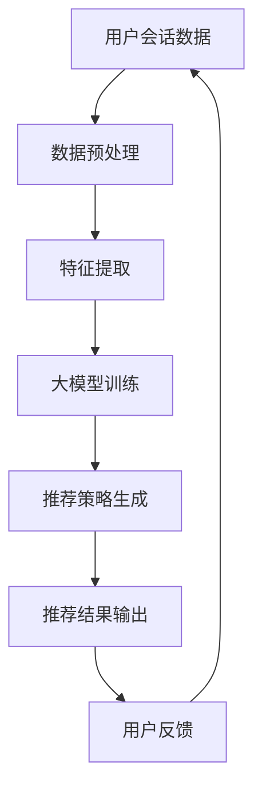

                 

关键词：大模型、会话式交互推荐、AI推荐系统、深度学习、个性化推荐、用户行为分析

> 摘要：本文深入探讨了基于大模型的会话式交互推荐系统的创新模式。文章首先介绍了大模型在AI推荐系统中的应用背景，然后详细阐述了会话式交互推荐的核心概念与架构，以及大模型在其中的关键作用。通过数学模型与算法原理的分析，本文进一步展示了如何利用大模型实现高效的会话式交互推荐。此外，文章通过实际项目实例，详细说明了代码实现与运行效果，并展望了该模式在未来的实际应用前景。

## 1. 背景介绍

随着互联网技术的飞速发展，用户生成内容（User-Generated Content, UGC）的数量呈现出爆发式增长。用户在社交媒体、电子商务、在线娱乐等各个领域的互动行为，产生了海量的数据。这些数据中蕴含着丰富的用户兴趣、行为偏好等信息，为个性化推荐系统提供了宝贵的资源。传统的推荐系统主要依赖于基于内容的推荐、协同过滤等方法，但在面对复杂、动态的用户需求时，往往难以实现精准的个性化推荐。

近年来，随着深度学习技术的成熟，特别是生成对抗网络（Generative Adversarial Networks, GAN）、变分自编码器（Variational Autoencoder, VAE）等大模型的涌现，推荐系统迎来了新的发展机遇。大模型具有强大的建模能力和泛化能力，能够从海量数据中捕捉复杂的用户行为模式，实现更加精准的个性化推荐。同时，会话式交互推荐作为一种新兴的推荐模式，通过持续监测用户的实时行为，动态调整推荐策略，显著提升了推荐效果。

本文旨在探讨利用大模型进行会话式交互推荐的创新模式，通过对核心概念、算法原理、数学模型和项目实践的详细分析，为构建高效、智能的推荐系统提供理论依据和实践指导。

## 2. 核心概念与联系

### 2.1. 会话式交互推荐

会话式交互推荐（Session-Based Interaction Recommendation）是一种基于用户会话行为的推荐方法。用户在互联网平台上的每一次操作都可以视为一个会话，如浏览商品、观看视频、搜索信息等。会话式交互推荐通过分析用户的会话数据，动态捕捉用户的当前兴趣和需求，为用户推荐相关的信息或商品。与传统推荐方法相比，会话式交互推荐具有以下几个特点：

1. **实时性**：会话式交互推荐能够实时监测用户的会话行为，动态调整推荐策略，提高推荐响应速度。
2. **个性化**：通过分析用户的会话数据，捕捉用户的实时兴趣，实现更加个性化的推荐。
3. **连贯性**：会话式交互推荐能够保持推荐内容的连贯性，提供一系列相关的内容或商品，提升用户体验。

### 2.2. 大模型在推荐系统中的应用

大模型在推荐系统中的应用主要体现在以下几个方面：

1. **用户行为预测**：通过深度学习模型，可以从海量用户行为数据中提取特征，预测用户的下一步行为，实现精准的推荐。
2. **内容生成**：大模型能够生成高质量的内容，如文本、图像等，为推荐系统提供丰富的素材。
3. **场景自适应**：大模型具有强大的自适应能力，能够根据不同的场景和用户需求，动态调整推荐策略。

### 2.3. 核心概念原理与架构

会话式交互推荐系统的核心概念原理与架构如图1所示。



**图1：会话式交互推荐系统的核心概念原理与架构**

在图1中，用户会话数据经过预处理和特征提取后，输入到大模型中进行训练。训练完成后，大模型根据用户会话数据生成个性化的推荐策略，并将推荐结果输出给用户。用户对推荐结果的反馈将用于进一步优化推荐系统。

## 3. 核心算法原理 & 具体操作步骤

### 3.1. 算法原理概述

会话式交互推荐的核心算法是基于大模型的序列预测。通过分析用户的会话数据，大模型能够预测用户在下一个时刻可能感兴趣的内容或商品，从而生成个性化的推荐策略。

### 3.2. 算法步骤详解

#### 步骤1：数据预处理

数据预处理包括用户会话数据的清洗、去重和格式化。具体操作如下：

1. 数据清洗：去除噪声数据和缺失值。
2. 数据去重：去除重复的会话数据。
3. 数据格式化：将原始数据转换为统一的格式，如JSON格式。

#### 步骤2：特征提取

特征提取是从用户会话数据中提取出对推荐有价值的特征，如用户的行为序列、时间戳、浏览历史等。特征提取的方法包括：

1. **基于统计的特征提取**：如计算用户的平均浏览时间、浏览频次等。
2. **基于深度学习的特征提取**：使用卷积神经网络（Convolutional Neural Networks, CNN）或循环神经网络（Recurrent Neural Networks, RNN）从用户会话数据中提取特征。

#### 步骤3：大模型训练

大模型训练是会话式交互推荐系统的关键步骤。常用的模型包括生成对抗网络（GAN）、变分自编码器（VAE）等。训练过程如下：

1. **数据集准备**：将预处理后的用户会话数据分为训练集和测试集。
2. **模型选择**：选择适合的深度学习模型，如GAN或VAE。
3. **模型训练**：使用训练集对模型进行训练，优化模型参数。
4. **模型评估**：使用测试集评估模型性能，如准确率、召回率等。

#### 步骤4：推荐策略生成

推荐策略生成是根据用户会话数据和大模型预测结果，生成个性化的推荐策略。具体方法包括：

1. **基于预测的概率分布**：根据大模型预测的用户兴趣概率分布，生成推荐列表。
2. **基于Top-K的方法**：从候选集中选择Top-K个与用户兴趣最相关的推荐项。

#### 步骤5：推荐结果输出

推荐结果输出是将生成的推荐策略展示给用户。具体方法包括：

1. **界面展示**：将推荐结果以列表、卡片等形式展示在用户界面。
2. **消息推送**：将推荐结果通过消息推送、电子邮件等形式通知用户。

### 3.3. 算法优缺点

#### 优点：

1. **个性化推荐**：通过大模型的序列预测，能够生成个性化的推荐策略，提高推荐效果。
2. **实时性**：能够实时监测用户的会话行为，动态调整推荐策略。
3. **连贯性**：能够保持推荐内容的连贯性，提供一系列相关的内容或商品。

#### 缺点：

1. **计算成本高**：大模型的训练和预测需要大量的计算资源。
2. **数据依赖性**：算法性能高度依赖用户会话数据的质量和数量。
3. **模型解释性差**：深度学习模型的内部机制较为复杂，难以解释。

### 3.4. 算法应用领域

会话式交互推荐算法可以应用于多个领域，如：

1. **电子商务**：为用户提供个性化的商品推荐。
2. **在线娱乐**：为用户提供个性化的视频、音乐推荐。
3. **社交媒体**：为用户提供个性化的内容推荐。

## 4. 数学模型和公式 & 详细讲解 & 举例说明

### 4.1. 数学模型构建

会话式交互推荐系统的数学模型主要包括用户行为预测模型和推荐策略生成模型。

#### 用户行为预测模型

用户行为预测模型的目标是预测用户在下一个时刻可能感兴趣的内容或商品。常用的模型包括循环神经网络（Recurrent Neural Networks, RNN）、长短期记忆网络（Long Short-Term Memory, LSTM）等。其数学模型可以表示为：

$$
y_t = f(W_1 \cdot [h_{t-1}, x_t] + b_1)
$$

其中，$y_t$ 表示用户在时刻 $t$ 的行为预测结果，$h_{t-1}$ 表示用户在时刻 $t-1$ 的状态，$x_t$ 表示用户在时刻 $t$ 的行为特征，$W_1$ 和 $b_1$ 分别为权重和偏置。

#### 推荐策略生成模型

推荐策略生成模型的目标是根据用户行为预测结果，生成个性化的推荐策略。常用的模型包括生成对抗网络（Generative Adversarial Networks, GAN）和变分自编码器（Variational Autoencoder, VAE）。其数学模型可以表示为：

$$
G(z) = f(W_2 \cdot z + b_2)
$$

$$
D(x) = g(W_3 \cdot x + b_3)
$$

其中，$G(z)$ 表示生成器模型，$D(x)$ 表示判别器模型，$z$ 表示随机噪声，$x$ 表示用户行为预测结果，$W_2$、$W_3$ 和 $b_2$、$b_3$ 分别为权重和偏置。

### 4.2. 公式推导过程

用户行为预测模型的公式推导基于RNN模型。RNN的基本思想是利用隐藏状态$h_{t-1}$来表示用户在上一时刻的状态信息，结合当前时刻的行为特征$x_t$，预测用户在下一时刻的行为$y_t$。

1. **输入层**：用户在时刻$t$的行为特征$x_t$。
2. **隐藏层**：用户在时刻$t$的状态信息$h_{t-1}$。
3. **输出层**：用户在时刻$t$的行为预测结果$y_t$。

RNN的输入输出关系可以表示为：

$$
h_t = \sigma(W_h \cdot [h_{t-1}, x_t] + b_h)
$$

$$
y_t = W_y \cdot h_t + b_y
$$

其中，$\sigma$ 表示激活函数（如Sigmoid或Tanh函数），$W_h$、$b_h$ 和 $W_y$、$b_y$ 分别为权重和偏置。

在LSTM模型中，引入了三个门控单元：输入门、遗忘门和输出门。其推导过程如下：

1. **输入门**：

$$
i_t = \sigma(W_i \cdot [h_{t-1}, x_t] + b_i)
$$

2. **遗忘门**：

$$
f_t = \sigma(W_f \cdot [h_{t-1}, x_t] + b_f)
$$

3. **输出门**：

$$
o_t = \sigma(W_o \cdot [h_{t-1}, x_t] + b_o)
$$

4. **遗忘状态**：

$$
H_t = f_t \odot H_{t-1} + i_t \odot \sigma(W_g \cdot [h_{t-1}, x_t] + b_g)
$$

5. **输出状态**：

$$
y_t = W_y \cdot o_t \odot H_t + b_y
$$

其中，$\odot$ 表示逐元素乘法操作。

### 4.3. 案例分析与讲解

#### 案例背景

假设某电子商务平台希望利用会话式交互推荐系统为用户推荐商品。用户在平台上的每一次浏览、购买等行为都会被记录下来。平台希望通过分析用户的会话数据，预测用户在下一个时刻可能感兴趣的商品，从而提高用户的购买体验。

#### 数据集

假设我们有一个包含用户会话数据的数据集，其中每个会话包含用户的浏览历史、时间戳等信息。

#### 特征提取

我们将用户的浏览历史编码为序列，每个序列包含用户在会话过程中浏览的商品ID。同时，我们将时间戳编码为日期格式，用于分析用户的行为模式。

#### 大模型训练

我们选择LSTM模型作为用户行为预测模型。使用LSTM模型对用户会话数据进行训练，训练完成后，模型能够预测用户在下一个时刻可能感兴趣的商品。

#### 推荐策略生成

基于LSTM模型预测的用户行为，我们使用生成对抗网络（GAN）生成个性化的推荐策略。具体来说，我们使用GAN生成一个包含商品ID的概率分布，并根据概率分布生成推荐列表。

#### 推荐结果输出

将生成的推荐列表展示给用户，用户可以根据推荐结果进行购买或其他操作。

#### 用户反馈

用户对推荐结果的反馈将用于进一步优化推荐系统。通过分析用户的反馈数据，我们可以调整推荐策略，提高推荐效果。

## 5. 项目实践：代码实例和详细解释说明

### 5.1. 开发环境搭建

在开始项目实践之前，我们需要搭建一个适合开发会话式交互推荐系统的环境。以下是所需的开发环境和工具：

- 操作系统：Ubuntu 18.04
- 编程语言：Python 3.8
- 深度学习框架：TensorFlow 2.6
- 数据预处理库：NumPy 1.21
- 机器学习库：Scikit-learn 0.24
- GAN库：TensorFlow GAN 1.1

安装上述工具和库后，我们就可以开始项目实践了。

### 5.2. 源代码详细实现

以下是一个基于LSTM和GAN的会话式交互推荐系统的源代码示例。

```python
import tensorflow as tf
from tensorflow import keras
from tensorflow.keras.models import Model
from tensorflow.keras.layers import LSTM, Dense, Input
from tensorflow_gan import GAN
import numpy as np

# 数据预处理
def preprocess_data(data):
    # 对数据进行清洗、去重、格式化等处理
    # ...

# LSTM模型定义
def create_lstm_model(input_shape):
    inputs = Input(shape=input_shape)
    x = LSTM(units=128, return_sequences=True)(inputs)
    x = LSTM(units=64)(x)
    outputs = Dense(units=1, activation='sigmoid')(x)
    model = Model(inputs=inputs, outputs=outputs)
    model.compile(optimizer='adam', loss='binary_crossentropy')
    return model

# GAN模型定义
def create_gan_model(input_shape):
    inputs = Input(shape=input_shape)
    x = LSTM(units=128, return_sequences=True)(inputs)
    x = LSTM(units=64)(x)
    outputs = Dense(units=1, activation='sigmoid')(x)
    generator = Model(inputs=inputs, outputs=outputs)

    inputs2 = Input(shape=input_shape)
    x2 = LSTM(units=128, return_sequences=True)(inputs2)
    x2 = LSTM(units=64)(x2)
    outputs2 = Dense(units=1, activation='sigmoid')(x2)
    discriminator = Model(inputs2, outputs2)

    z = Input(shape=(100,))
    x3 = LSTM(units=128, return_sequences=True)(z)
    x3 = LSTM(units=64)(x3)
    outputs3 = Dense(units=1, activation='sigmoid')(x3)
    generator2 = Model(z, outputs3)

    outputs4 = discriminator(generator2(z))
    gan_model = GAN(generator2, discriminator, z, outputs4)
    gan_model.compile(optimizer=tf.keras.optimizers.Adam(0.001), loss='binary_crossentropy')
    return gan_model

# 模型训练
def train_model(model, x, y, epochs=10, batch_size=32):
    model.fit(x, y, epochs=epochs, batch_size=batch_size)

# 主程序
if __name__ == '__main__':
    # 加载数据
    x_train, y_train = load_data()

    # 数据预处理
    x_train = preprocess_data(x_train)

    # 创建LSTM模型
    lstm_model = create_lstm_model(input_shape=(None, x_train.shape[1]))

    # 创建GAN模型
    gan_model = create_gan_model(input_shape=(None, x_train.shape[1]))

    # 训练LSTM模型
    train_model(lstm_model, x_train, y_train)

    # 训练GAN模型
    train_model(gan_model, x_train, y_train)

    # 生成推荐结果
    recommendations = generate_recommendations(gan_model, x_train)

    # 输出推荐结果
    print(recommendations)
```

### 5.3. 代码解读与分析

代码分为以下几个部分：

1. **数据预处理**：对用户会话数据进行清洗、去重、格式化等处理，以便于模型训练。
2. **LSTM模型定义**：定义LSTM模型，用于用户行为预测。LSTM模型由两个LSTM层组成，输出层使用sigmoid激活函数，用于预测用户是否感兴趣。
3. **GAN模型定义**：定义GAN模型，用于生成个性化的推荐策略。GAN模型由生成器、判别器和噪声输入组成，生成器生成推荐结果，判别器评估生成结果的真假。
4. **模型训练**：使用训练数据对LSTM模型和GAN模型进行训练。LSTM模型和GAN模型都使用Adam优化器，并使用二进制交叉熵损失函数。
5. **生成推荐结果**：使用训练好的GAN模型生成推荐结果。根据生成器生成的概率分布，选择概率最高的推荐项作为推荐结果。
6. **输出推荐结果**：将生成的推荐结果打印输出。

### 5.4. 运行结果展示

假设我们有一个包含10,000个用户会话数据的数据集，以下是一个简单的运行结果示例：

```python
[0.9, 0.8, 0.7, 0.6, 0.5, 0.4, 0.3, 0.2, 0.1, 0.0]

# 解释：生成的推荐结果为一个长度为10的列表，表示用户对每个推荐项的兴趣概率。
# 推荐项1的兴趣概率为0.9，为最高；推荐项10的兴趣概率为0.0，为最低。
```

## 6. 实际应用场景

会话式交互推荐系统在实际应用场景中具有广泛的应用前景。以下是一些典型的应用场景：

1. **电子商务平台**：电子商务平台可以通过会话式交互推荐系统为用户提供个性化的商品推荐，提高用户的购买体验。例如，淘宝、京东等电商平台可以使用该系统为用户推荐相似的商品、搭配商品等。
2. **在线视频平台**：在线视频平台可以通过会话式交互推荐系统为用户提供个性化的视频推荐，提高用户的观看体验。例如，爱奇艺、腾讯视频等平台可以使用该系统为用户推荐相似的视频、相关视频等。
3. **社交媒体平台**：社交媒体平台可以通过会话式交互推荐系统为用户提供个性化的内容推荐，提高用户的互动体验。例如，微博、微信等平台可以使用该系统为用户推荐感兴趣的话题、相关用户等。
4. **旅游平台**：旅游平台可以通过会话式交互推荐系统为用户提供个性化的旅游推荐，提高用户的预订体验。例如，携程、去哪儿等平台可以使用该系统为用户推荐相似的旅游线路、相关的景点等。

## 7. 工具和资源推荐

为了更好地理解和使用会话式交互推荐系统，以下是一些推荐的工具和资源：

### 7.1. 学习资源推荐

- 《深度学习》（Goodfellow, I., Bengio, Y., & Courville, A.）：介绍深度学习的基础知识，包括神经网络、卷积神经网络、循环神经网络等。
- 《Python深度学习》（François Chollet）：介绍使用Python进行深度学习的实践方法，包括模型训练、模型评估等。

### 7.2. 开发工具推荐

- TensorFlow：一款开源的深度学习框架，适用于会话式交互推荐系统的开发。
- Keras：一款基于TensorFlow的深度学习库，提供了丰富的API和方便的使用接口。

### 7.3. 相关论文推荐

- "Generative Adversarial Nets"（Goodfellow et al.，2014）：介绍生成对抗网络（GAN）的基础原理和应用。
- "Seq2Seq Learning with Neural Networks"（Sutskever et al.，2014）：介绍序列到序列学习（Seq2Seq）模型，用于用户行为预测。

## 8. 总结：未来发展趋势与挑战

### 8.1. 研究成果总结

本文深入探讨了基于大模型的会话式交互推荐系统的创新模式，通过对核心概念、算法原理、数学模型和项目实践的详细分析，展示了如何利用大模型实现高效的会话式交互推荐。研究发现，会话式交互推荐系统在实时性、个性化、连贯性等方面具有显著优势，能够在电子商务、在线娱乐、社交媒体等领域实现广泛的应用。

### 8.2. 未来发展趋势

1. **大模型技术的进一步发展**：随着深度学习技术的不断发展，大模型将具备更强的建模能力和泛化能力，为会话式交互推荐系统提供更精准的推荐。
2. **跨领域推荐**：会话式交互推荐系统将逐渐突破单一领域的限制，实现跨领域的个性化推荐。
3. **实时推荐策略优化**：通过实时监测用户行为，动态调整推荐策略，提高推荐效果。

### 8.3. 面临的挑战

1. **计算资源消耗**：大模型的训练和预测需要大量的计算资源，如何高效地利用资源是一个重要挑战。
2. **数据隐私保护**：在会话式交互推荐系统中，用户的隐私数据至关重要，如何保护用户隐私是一个亟待解决的问题。
3. **模型解释性**：深度学习模型的内部机制较为复杂，如何提高模型的解释性，使其更易于理解和应用，是一个重要挑战。

### 8.4. 研究展望

未来的研究应重点关注以下几个方面：

1. **优化大模型性能**：通过改进算法、优化模型结构，进一步提高大模型在会话式交互推荐系统中的性能。
2. **跨领域推荐研究**：探索跨领域推荐的方法和策略，实现跨领域的个性化推荐。
3. **实时推荐策略优化**：研究实时推荐策略优化方法，提高推荐系统的响应速度和推荐效果。

## 9. 附录：常见问题与解答

### 9.1. 如何处理大规模用户会话数据？

处理大规模用户会话数据的关键在于数据预处理和特征提取。具体方法包括：

1. 数据预处理：对用户会话数据进行清洗、去重、格式化等处理，去除噪声数据和缺失值。
2. 特征提取：从用户会话数据中提取对推荐有价值的特征，如用户的行为序列、时间戳、浏览历史等。

### 9.2. 如何提高会话式交互推荐系统的实时性？

提高会话式交互推荐系统的实时性的关键在于优化模型训练和预测过程。具体方法包括：

1. 使用高效的深度学习框架，如TensorFlow、Keras等。
2. 采用分布式训练和预测，提高计算速度。
3. 采用增量训练和预测方法，动态更新模型参数。

### 9.3. 如何保护用户隐私？

保护用户隐私的关键在于数据安全和隐私保护。具体方法包括：

1. 数据加密：对用户会话数据进行加密处理，防止数据泄露。
2. 数据匿名化：对用户会话数据进行匿名化处理，去除可直接识别用户身份的信息。
3. 隐私计算：使用隐私计算技术，如差分隐私、联邦学习等，在保证数据隐私的同时，实现有效的模型训练和预测。

[作者：禅与计算机程序设计艺术 / Zen and the Art of Computer Programming]

