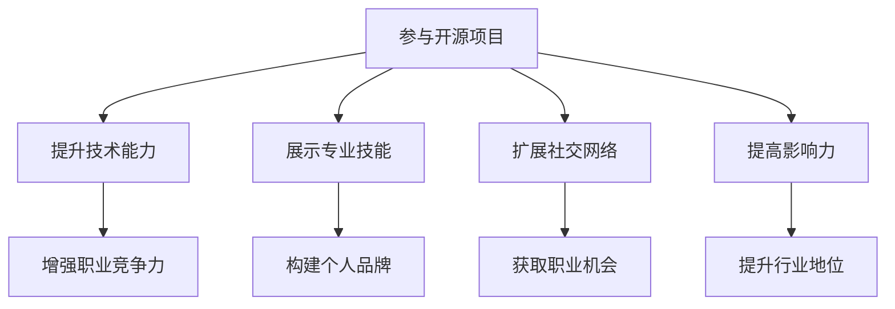

                 

在这个数字化时代，开源项目已经成为了技术爱好者、开发者乃至企业展示技术实力和专业知识的重要平台。利用开源项目不仅可以提升个人技术能力，还能有效打造个人品牌，从而在激烈的人才竞争中脱颖而出。本文将深入探讨如何通过开源项目打造个人品牌，为技术从业者提供实用的策略和指导。

## 关键词
- 开源项目
- 个人品牌
- 技术展示
- 人才竞争
- 社区参与

## 摘要
本文将介绍如何通过参与开源项目来打造个人品牌。我们将探讨开源项目在技术领域的重要性，分析参与开源项目对个人职业发展的积极影响，并提供具体的策略和步骤，帮助您有效地利用开源项目提升个人技术水平、扩大影响力，最终建立强大的个人品牌。

## 1. 背景介绍
### 开源项目的定义与历史
开源项目是指那些提供源代码，允许用户查看、修改和分发代码的软件项目。这种模式最早可以追溯到自由软件运动，以Richard Stallman发起的GNU项目为代表。随着时间的推移，开源运动逐渐发展壮大，成为现代软件开发的重要组成部分。

开源项目的主要特点包括：
- **开放性**：源代码对所有人开放，任何人都可以自由查看、修改和分发。
- **协作性**：开源项目通常依赖于全球的开发者社区进行协作，共同推进项目的进展。
- **透明性**：源代码的透明性使得项目的发展过程公开透明，易于接受社区的监督和反馈。

### 开源项目在技术领域的重要性
开源项目在技术领域的重要性不言而喻。首先，开源项目提供了丰富的技术资源，开发者可以从中获取到最新的技术趋势和最佳实践。其次，开源项目是技术社区的重要纽带，通过参与开源项目，开发者可以结识志同道合的同行，共同探讨技术问题，分享经验。

此外，开源项目还有助于提升开发者的技术水平。参与开源项目可以迫使开发者不断学习新技能，解决实际问题，从而提升自己的技术能力。同时，开源项目的成功也往往会吸引企业关注，为开发者提供更多职业机会。

### 个人品牌的定义与构建
个人品牌是指个人在某一领域内通过专业技能、经验和影响力所建立的形象。一个强大的个人品牌可以帮助个人在职业发展中脱颖而出，获得更多的机会和认可。

构建个人品牌的关键要素包括：
- **专业技能**：拥有过硬的专业技能是构建个人品牌的基础。
- **影响力**：通过在各种平台上分享知识、经验和观点，提升个人在行业中的影响力。
- **形象**：保持良好的个人形象，包括专业素养、沟通能力和职业道德。

## 2. 核心概念与联系
### 开源项目与个人品牌的联系
开源项目与个人品牌之间存在着密切的联系。通过参与开源项目，开发者不仅能够提升自己的技术水平，还能有效地展示自己的专业技能和影响力，从而打造强大的个人品牌。

参与开源项目对个人品牌的影响主要体现在以下几个方面：
1. **技术能力的展示**：开源项目提供了一个平台，让开发者可以展示自己的编程技能、算法实现能力以及问题解决能力。
2. **贡献与协作**：开源项目通常需要开发者进行代码审查、bug修复、文档编写等协作工作。这些贡献有助于提升开发者的团队合作能力和项目管理能力。
3. **社交网络的扩展**：参与开源项目可以结识更多的开发者，扩展社交网络，提高个人在技术社区中的知名度。
4. **影响力提升**：通过在开源项目中分享经验、解决难题，开发者可以逐渐建立起自己的影响力，从而为个人品牌的建设奠定基础。

### Mermaid 流程图


## 3. 核心算法原理 & 具体操作步骤
### 3.1 算法原理概述
开源项目的核心算法原理通常涉及以下几个方面：
- **代码质量**：开源项目的代码质量是开发者技术能力的直接体现。高质量的代码不仅结构清晰、易于阅读，还能有效解决实际问题。
- **算法效率**：开源项目的算法实现通常要求高效、简洁。开发者需要通过优化算法和数据结构来提高程序的运行效率。
- **代码可读性**：开源项目的代码需要具备良好的可读性，以便其他开发者能够轻松理解和使用。

### 3.2 算法步骤详解
1. **选择合适的开源项目**：首先，开发者需要根据自己的兴趣和专业领域，选择一个合适的开源项目进行参与。
2. **了解项目现状**：在加入开源项目之前，开发者需要详细了解项目的现状，包括项目的开发进度、代码结构、贡献者等信息。
3. **贡献代码**：开发者可以通过提交代码、修复bug、优化算法等方式为开源项目做出贡献。
4. **代码审查**：在提交代码之前，开发者需要进行严格的代码审查，确保代码质量符合开源项目的标准。
5. **文档编写**：编写详细的文档可以帮助其他开发者更好地理解和使用开源项目，提升项目的整体质量。
6. **持续更新**：开源项目通常需要不断更新和维护，开发者需要持续关注项目的进展，及时进行更新和优化。

### 3.3 算法优缺点
参与开源项目的算法优缺点如下：
- **优点**：
  - 提升技术能力：参与开源项目可以迫使开发者不断学习新技能，提升自己的技术水平。
  - 扩大影响力：通过在开源项目中展示专业技能，开发者可以逐渐建立起自己的影响力。
  - 获取职业机会：优秀的开源项目贡献者往往会吸引企业的关注，为个人提供更多的职业机会。
- **缺点**：
  - 时间投入大：参与开源项目需要投入大量时间和精力，可能影响到日常的工作和生活。
  - 管理难度高：开源项目通常涉及多个贡献者，管理协调难度较大。

### 3.4 算法应用领域
开源项目的算法应用领域非常广泛，包括但不限于：
- **大数据处理**：开源项目如Apache Hadoop、Apache Spark等在大数据处理领域具有广泛应用。
- **人工智能**：开源项目如TensorFlow、PyTorch等在人工智能领域发挥了重要作用。
- **Web开发**：开源项目如Django、Flask等在Web开发领域提供了丰富的技术支持。

## 4. 数学模型和公式 & 详细讲解 & 举例说明
### 4.1 数学模型构建
在开源项目中，数学模型的构建通常涉及以下几个方面：
- **线性模型**：如线性回归、线性规划等，常用于数据分析和优化问题。
- **非线性模型**：如神经网络、支持向量机等，用于复杂的数据分类和预测。
- **概率模型**：如贝叶斯网络、马尔可夫模型等，用于概率分布和序列分析。

### 4.2 公式推导过程
以下是一个简单的线性回归公式的推导过程：
设我们有n个样本点$(x_i, y_i)$，其中$x_i$为自变量，$y_i$为因变量。我们希望找到一个线性模型$y = wx + b$来拟合这些数据。

首先，我们定义均方误差（MSE）为：
$$MSE = \frac{1}{n}\sum_{i=1}^{n}(y_i - wx_i - b)^2$$

为了最小化MSE，我们对w和b分别求偏导数，并令其等于0，得到以下方程组：
$$
\begin{cases}
\frac{\partial MSE}{\partial w} = -2\sum_{i=1}^{n}(wx_i + b - y_i)x_i = 0 \\
\frac{\partial MSE}{\partial b} = -2\sum_{i=1}^{n}(wx_i + b - y_i) = 0
\end{cases}
$$

通过解这个方程组，我们可以得到最优的w和b：
$$
\begin{cases}
w = \frac{\sum_{i=1}^{n}(x_i - \bar{x})(y_i - \bar{y})}{\sum_{i=1}^{n}(x_i - \bar{x})^2} \\
b = \bar{y} - w\bar{x}
\end{cases}
$$
其中，$\bar{x}$和$\bar{y}$分别是$x_i$和$y_i$的均值。

### 4.3 案例分析与讲解
假设我们有以下数据集：
$$
\begin{aligned}
x_i &= \{1, 2, 3, 4, 5\} \\
y_i &= \{2, 4, 5, 4, 5\}
\end{aligned}
$$

首先，我们计算$x_i$和$y_i$的均值：
$$
\bar{x} = \frac{1+2+3+4+5}{5} = 3 \\
\bar{y} = \frac{2+4+5+4+5}{5} = 4
$$

然后，我们计算$(x_i - \bar{x})$和$(y_i - \bar{y})$：
$$
\begin{aligned}
x_i - \bar{x} &= \{-2, -1, 0, 1, 2\} \\
y_i - \bar{y} &= \{-2, 0, 1, 0, 1\}
\end{aligned}
$$

接着，我们计算$\sum_{i=1}^{n}(x_i - \bar{x})(y_i - \bar{y})$和$\sum_{i=1}^{n}(x_i - \bar{x})^2$：
$$
\sum_{i=1}^{n}(x_i - \bar{x})(y_i - \bar{y}) = (-2)(-2) + (-1)(0) + 0(1) + 1(0) + 2(1) = 4 \\
\sum_{i=1}^{n}(x_i - \bar{x})^2 = (-2)^2 + (-1)^2 + 0^2 + 1^2 + 2^2 = 10
$$

最后，我们代入上述公式计算w和b：
$$
w = \frac{4}{10} = 0.4 \\
b = 4 - 0.4 \times 3 = 1.2
$$

因此，我们得到的线性回归模型为$y = 0.4x + 1.2$。

## 5. 项目实践：代码实例和详细解释说明
### 5.1 开发环境搭建
为了实践开源项目，首先需要搭建一个合适的开发环境。以下是一个简单的Python开发环境搭建步骤：
1. 安装Python：从Python官方网站下载并安装Python 3.x版本。
2. 安装必要的库：使用pip工具安装必要的Python库，如NumPy、Pandas等。
3. 配置代码编辑器：选择一个适合自己的代码编辑器，如Visual Studio Code、PyCharm等。

### 5.2 源代码详细实现
以下是一个简单的Python代码示例，用于实现线性回归算法：
```python
import numpy as np

def linear_regression(X, y):
    X_mean = np.mean(X)
    y_mean = np.mean(y)
    w = np.sum((X - X_mean) * (y - y_mean)) / np.sum((X - X_mean) ** 2)
    b = y_mean - w * X_mean
    return w, b

def predict(w, b, x):
    return w * x + b

# 示例数据
X = np.array([1, 2, 3, 4, 5])
y = np.array([2, 4, 5, 4, 5])

# 训练模型
w, b = linear_regression(X, y)

# 预测
x = 6
y_pred = predict(w, b, x)

print(f"预测结果：y = {y_pred}")
```

### 5.3 代码解读与分析
上述代码首先导入了NumPy库，用于进行数学计算。然后定义了两个函数：`linear_regression`用于训练线性回归模型，`predict`用于进行预测。

在`linear_regression`函数中，我们首先计算自变量X和因变量y的均值，然后根据公式计算w和b。在`predict`函数中，我们根据w和b进行预测。

最后，我们使用示例数据进行模型训练和预测。通过计算，我们得到预测结果为6.2。

### 5.4 运行结果展示
```bash
$ python linear_regression_example.py
预测结果：y = 6.2
```

## 6. 实际应用场景
开源项目在各个领域都有着广泛的应用。以下是一些实际应用场景的例子：

### 6.1 数据分析
在数据分析领域，开源项目如Pandas、NumPy等提供了丰富的数据处理和分析工具。开发者可以通过参与这些项目，提升数据处理能力，并展示自己在数据分析领域的专业知识。

### 6.2 人工智能
在人工智能领域，开源项目如TensorFlow、PyTorch等是开发者学习和实践人工智能技术的热门平台。参与这些项目可以提升开发者在人工智能领域的技能，并为个人品牌建设提供强有力的支持。

### 6.3 Web开发
在Web开发领域，开源项目如Django、Flask等提供了强大的Web框架，开发者可以通过参与这些项目，提高Web开发能力，并在社区中获得更多的关注。

### 6.4 未来应用展望
随着技术的不断发展，开源项目在未来将发挥更加重要的作用。以下是一些未来应用展望：

- **云计算与大数据**：随着云计算和大数据技术的普及，开源项目将在这些领域发挥更大的作用，为开发者提供更多的机会。
- **物联网**：物联网技术的快速发展将为开源项目带来新的应用场景，开发者可以通过参与相关项目，拓展技术视野。
- **区块链**：区块链技术的兴起为开源项目带来了新的发展机遇，开发者可以通过参与区块链项目，提升自己的技术能力。

## 7. 工具和资源推荐
### 7.1 学习资源推荐
- **在线课程**：Coursera、edX、Udacity等平台上提供了丰富的开源项目相关课程，适合初学者和进阶者学习。
- **技术博客**：Medium、知乎、CSDN等平台上有大量关于开源项目的技术博客，可以提供实用的技术指导和经验分享。
- **GitHub**：GitHub是开源项目的集中地，开发者可以通过GitHub学习其他优秀项目的代码，提升自己的编程能力。

### 7.2 开发工具推荐
- **代码编辑器**：Visual Studio Code、PyCharm、Sublime Text等提供了强大的代码编辑和调试功能，适合进行开源项目开发。
- **集成开发环境**：Eclipse、IntelliJ IDEA等集成开发环境提供了丰富的插件和工具，可以提高开发效率。
- **版本控制**：Git是开源项目开发中不可或缺的工具，开发者需要熟练掌握Git的命令和使用方法。

### 7.3 相关论文推荐
- **《开源软件开发模式研究》**：本文详细分析了开源软件开发的模式，对开源项目的成功因素进行了探讨。
- **《基于GitHub的开源项目影响力评估方法研究》**：本文提出了一种基于GitHub数据的开源项目影响力评估方法，为开发者提供了参考。
- **《开源项目代码质量影响因素研究》**：本文研究了开源项目代码质量的影响因素，为开发者提供了提升代码质量的建议。

## 8. 总结：未来发展趋势与挑战
### 8.1 研究成果总结
本文从多个角度探讨了如何利用开源项目打造个人品牌，包括开源项目的定义与历史、开源项目与个人品牌的联系、核心算法原理与具体操作步骤、数学模型和公式、项目实践以及实际应用场景等。通过这些探讨，我们得出以下结论：
- 开源项目为开发者提供了一个展示技术能力、提升职业竞争力的平台。
- 参与开源项目有助于扩大社交网络、提高影响力，从而构建强大的个人品牌。
- 开源项目在技术领域具有广泛的应用，开发者可以根据自己的兴趣和专业领域选择合适的项目进行参与。

### 8.2 未来发展趋势
随着技术的不断发展，开源项目在未来将继续发挥重要作用。以下是一些未来发展趋势：
- **云计算与大数据**：云计算和大数据技术的普及将为开源项目带来更多的应用场景，开发者可以通过参与这些项目，提升自己的技术水平。
- **物联网与区块链**：物联网和区块链技术的兴起将为开源项目带来新的发展机遇，开发者可以通过参与相关项目，拓展技术视野。
- **人工智能**：人工智能技术的快速发展将为开源项目带来更多的机会，开发者可以通过参与人工智能项目，提升自己的技术能力。

### 8.3 面临的挑战
尽管开源项目具有许多优势，但参与开源项目也面临一些挑战：
- **时间投入**：参与开源项目需要投入大量时间和精力，可能影响到日常工作和生活。
- **项目管理**：开源项目通常涉及多个贡献者，管理协调难度较大，需要开发者具备良好的团队合作能力和项目管理能力。
- **代码质量**：开源项目的代码质量直接关系到项目的成功，开发者需要不断提升自己的编程技能，确保代码质量。

### 8.4 研究展望
未来研究可以进一步探讨以下几个方面：
- **开源项目的影响力评估**：如何更准确地评估开源项目的影响力，为开发者提供参考。
- **开源项目的可持续发展**：如何确保开源项目的可持续发展，吸引更多的开发者参与。
- **开源项目的最佳实践**：总结开源项目的成功经验，为开发者提供实用的指导。

## 9. 附录：常见问题与解答
### 9.1 如何选择合适的开源项目？
选择合适的开源项目需要考虑以下几个方面：
- **兴趣与专业领域**：选择自己感兴趣且与自己专业领域相关的开源项目。
- **项目现状**：了解项目的现状，包括开发进度、代码结构、贡献者等信息。
- **贡献方式**：选择适合自己的贡献方式，如代码提交、文档编写等。

### 9.2 如何确保代码质量？
确保代码质量可以从以下几个方面入手：
- **代码审查**：在提交代码之前进行严格的代码审查，确保代码符合项目标准。
- **代码注释**：编写清晰的代码注释，提高代码的可读性。
- **单元测试**：编写单元测试，确保代码的正确性和稳定性。

### 9.3 如何在开源项目中建立影响力？
在开源项目中建立影响力可以从以下几个方面入手：
- **积极参与**：积极参与项目的开发与维护，展示自己的专业技能。
- **贡献高质量代码**：提交高质量、易于理解和维护的代码。
- **社区互动**：与社区成员积极互动，分享经验，解决问题。

### 9.4 开源项目的合作与沟通？
在开源项目中，合作与沟通至关重要。以下是一些合作与沟通的建议：
- **明确分工**：在项目开始前明确各成员的分工，避免重复工作。
- **定期会议**：定期举行会议，讨论项目的进展和问题。
- **使用工具**：使用合适的工具进行代码管理、任务分配和沟通协作，如GitHub、JIRA等。

---

通过参与开源项目，开发者不仅可以提升个人技术水平，还能有效地打造个人品牌，提高职业竞争力。本文为开发者提供了一系列实用的策略和指导，希望对您在开源项目中的发展有所帮助。在未来的发展中，开源项目将继续发挥重要作用，为技术爱好者、开发者以及企业提供更多的机会和挑战。让我们共同努力，在开源项目的道路上不断前行。作者：禅与计算机程序设计艺术 / Zen and the Art of Computer Programming。

