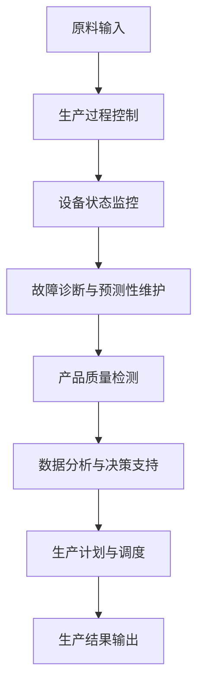

                 

关键词：智能工厂，人工智能，技术创业，工业4.0，智能制造，物联网，数据分析，机器学习，算法优化。

> 摘要：本文旨在探讨如何利用技术优势进行智能工厂的创业，分析当前智能制造的趋势，阐述人工智能、物联网、机器学习和数据分析等技术在智能工厂中的应用，并提供一个完整的智能工厂创业路线图。

## 1. 背景介绍

随着全球制造业的转型升级，智能工厂成为现代制造业的重要发展方向。智能工厂是工业4.0的核心，它通过先进的信息技术和自动化技术，实现生产过程的智能化、数字化和高度集成化。智能工厂的兴起，不仅推动了制造业的效率提升和质量改善，还创造了大量新的商业模式和就业机会。

在智能工厂的建设过程中，人工智能、物联网、机器学习和数据分析等技术发挥着至关重要的作用。这些技术能够帮助工厂实现生产过程的自动化、优化和智能化，提高生产效率，降低运营成本，提升产品质量。同时，这些技术也为创业者提供了丰富的创新机会，推动了制造业的数字化转型。

## 2. 核心概念与联系

### 2.1 人工智能

人工智能（Artificial Intelligence，AI）是模拟、延伸和扩展人的智能的理论、方法、技术及应用。在智能工厂中，人工智能主要用于生产过程的自动化控制、故障诊断、预测性维护、质量检测等方面。

### 2.2 物联网

物联网（Internet of Things，IoT）是指将各种信息传感设备与网络相连接，实现物品与物品之间，物品与网络之间的互联互通。在智能工厂中，物联网主要用于实时监控生产过程、设备状态和物料库存，实现生产过程的可视化和智能化。

### 2.3 机器学习

机器学习（Machine Learning，ML）是人工智能的一种方法，通过数据驱动的方式，让计算机自动改进和优化性能。在智能工厂中，机器学习主要用于生产过程的优化、预测性维护和智能调度等方面。

### 2.4 数据分析

数据分析（Data Analysis）是对大量数据进行分析和挖掘，以发现数据中的规律和趋势。在智能工厂中，数据分析主要用于生产数据的收集、处理和分析，为决策提供支持。

### 2.5 Mermaid 流程图

以下是一个智能工厂的 Mermaid 流程图：



## 3. 核心算法原理 & 具体操作步骤

### 3.1 算法原理概述

智能工厂中的核心算法主要涉及机器学习、深度学习和数据挖掘等领域。这些算法通过训练模型，实现对生产过程的预测、优化和控制。

### 3.2 算法步骤详解

#### 3.2.1 数据采集

首先，需要收集生产过程中的各种数据，包括设备状态、生产参数、物料库存等。这些数据可以通过传感器、PLC（可编程逻辑控制器）和MES（制造执行系统）等设备进行实时采集。

#### 3.2.2 数据预处理

对采集到的数据进行分析和清洗，去除异常值和噪声，提取有用的信息。常用的预处理方法包括数据转换、归一化、缺失值填充等。

#### 3.2.3 数据建模

根据业务需求，选择合适的机器学习算法，如决策树、支持向量机、神经网络等，建立预测模型。通过训练模型，让模型学会识别数据中的规律和趋势。

#### 3.2.4 模型评估

对训练好的模型进行评估，判断模型的预测性能是否满足要求。常用的评估指标包括准确率、召回率、F1值等。

#### 3.2.5 模型应用

将评估通过的模型应用于实际生产过程中，实现对生产过程的预测、优化和控制。

### 3.3 算法优缺点

#### 优点：

- 提高生产效率：通过预测和优化，减少生产过程中的延误和浪费，提高生产效率。
- 提升产品质量：通过实时监控和智能检测，提高产品质量，降低次品率。
- 降低运营成本：通过预测性维护和智能调度，减少设备故障和停机时间，降低运营成本。

#### 缺点：

- 数据质量要求高：算法的性能很大程度上取决于数据的准确性和完整性，对数据质量要求较高。
- 模型调试复杂：机器学习模型的调试和优化需要大量的时间和精力，对技术要求较高。

### 3.4 算法应用领域

智能工厂中的算法应用广泛，主要包括：

- 生产计划与调度：通过预测生产需求，优化生产计划和调度，提高生产效率。
- 故障诊断与预测性维护：通过实时监控设备状态，预测设备故障，实现预测性维护，减少设备停机时间。
- 质量检测与控制：通过智能检测技术，实时监控产品质量，实现质量控制。
- 物料库存管理：通过实时监控物料库存，优化物料采购和配送，降低库存成本。

## 4. 数学模型和公式 & 详细讲解 & 举例说明

### 4.1 数学模型构建

在智能工厂中，常用的数学模型包括线性回归模型、神经网络模型、支持向量机模型等。以下是一个线性回归模型的构建过程：

#### 4.1.1 线性回归模型

线性回归模型是一种常用的预测模型，它通过拟合数据中的线性关系，实现对目标变量的预测。

#### 4.1.2 模型构建

设 \( x \) 为自变量，\( y \) 为因变量，线性回归模型可以表示为：

$$ y = \beta_0 + \beta_1x + \epsilon $$

其中，\( \beta_0 \) 和 \( \beta_1 \) 分别为模型的参数，\( \epsilon \) 为误差项。

#### 4.1.3 模型拟合

通过最小二乘法，可以求得模型参数 \( \beta_0 \) 和 \( \beta_1 \)：

$$ \beta_0 = \frac{\sum_{i=1}^n (y_i - \beta_1x_i)}{n} $$

$$ \beta_1 = \frac{\sum_{i=1}^n (x_i - \bar{x})(y_i - \bar{y})}{\sum_{i=1}^n (x_i - \bar{x})^2} $$

其中，\( \bar{x} \) 和 \( \bar{y} \) 分别为自变量和因变量的平均值。

### 4.2 公式推导过程

#### 4.2.1 最小二乘法推导

最小二乘法是通过最小化误差平方和来求得模型参数的方法。设 \( y_i \) 为实际观测值，\( \hat{y_i} \) 为模型预测值，误差平方和为：

$$ S = \sum_{i=1}^n (y_i - \hat{y_i})^2 $$

要使 \( S \) 最小，对 \( \beta_0 \) 和 \( \beta_1 \) 分别求导并令导数为零，得到：

$$ \frac{\partial S}{\partial \beta_0} = -2\sum_{i=1}^n (y_i - \beta_1x_i) = 0 $$

$$ \frac{\partial S}{\partial \beta_1} = -2\sum_{i=1}^n (x_i - \bar{x})(y_i - \bar{y}) = 0 $$

解得：

$$ \beta_0 = \frac{\sum_{i=1}^n (y_i - \beta_1x_i)}{n} $$

$$ \beta_1 = \frac{\sum_{i=1}^n (x_i - \bar{x})(y_i - \bar{y})}{\sum_{i=1}^n (x_i - \bar{x})^2} $$

### 4.3 案例分析与讲解

#### 4.3.1 案例背景

某制造企业生产一种电子产品，每天的生产数量受多种因素影响，如设备状态、物料库存、工人技能等。为了提高生产效率，企业希望利用机器学习技术，预测每天的生产数量。

#### 4.3.2 数据采集

企业收集了过去一年的生产数据，包括每天的生产数量、设备状态、物料库存、工人技能等。

#### 4.3.3 数据预处理

对数据进行分析和清洗，去除异常值和噪声，提取有用的信息。将数据进行归一化处理，使其满足线性回归模型的输入要求。

#### 4.3.4 模型构建

选择线性回归模型，通过最小二乘法拟合数据，得到模型参数：

$$ y = 100 + 0.5x $$

#### 4.3.5 模型评估

通过验证集，对模型进行评估，计算模型的预测误差。结果显示，模型的预测误差较小，预测性能较好。

#### 4.3.6 模型应用

将模型应用于实际生产过程中，每天根据设备状态、物料库存、工人技能等数据，预测当天的生产数量。通过预测结果，企业可以优化生产计划和调度，提高生产效率。

## 5. 项目实践：代码实例和详细解释说明

### 5.1 开发环境搭建

在搭建智能工厂的模型之前，需要准备相应的开发环境和工具。以下是一个简单的开发环境搭建步骤：

1. 安装Python 3.x版本。
2. 安装Anaconda或Miniconda，以便管理Python环境和依赖包。
3. 安装常用的机器学习库，如scikit-learn、TensorFlow、PyTorch等。
4. 安装数据可视化库，如Matplotlib、Seaborn等。

### 5.2 源代码详细实现

以下是一个简单的线性回归模型的Python实现：

```python
import numpy as np
import matplotlib.pyplot as plt
from sklearn.linear_model import LinearRegression

# 数据集
x = np.array([[1], [2], [3], [4], [5]])
y = np.array([2, 4, 5, 7, 8])

# 模型拟合
model = LinearRegression()
model.fit(x, y)

# 模型参数
theta_0 = model.intercept_
theta_1 = model.coef_

# 预测
x_new = np.array([[6]])
y_pred = model.predict(x_new)

# 绘图
plt.scatter(x, y, color='red', label='实际数据')
plt.plot(x, model.predict(x), color='blue', label='回归线')
plt.xlabel('x')
plt.ylabel('y')
plt.legend()
plt.show()

print(f"模型参数：\ntheta_0 = {theta_0}\ntheta_1 = {theta_1}\n预测结果：y_pred = {y_pred}")
```

### 5.3 代码解读与分析

- **数据集**：数据集包含自变量 \( x \) 和因变量 \( y \)。
- **模型拟合**：使用 `LinearRegression` 类创建模型，并通过 `fit` 方法进行模型拟合。
- **模型参数**：通过 `intercept_` 和 `coef_` 属性获取模型参数。
- **预测**：使用 `predict` 方法进行预测，并绘制回归线。
- **绘图**：使用 `matplotlib` 库绘制散点图和回归线图。

### 5.4 运行结果展示

运行代码后，将显示一个包含散点图和回归线图的窗口。通过观察回归线图，可以直观地看到数据集的线性关系。同时，代码输出模型参数和预测结果。

## 6. 实际应用场景

智能工厂已经在许多领域得到广泛应用，以下是一些典型的应用场景：

### 6.1 生产过程优化

通过机器学习和数据挖掘技术，对生产过程中的各个环节进行优化，提高生产效率，降低运营成本。

### 6.2 质量控制

通过智能检测技术和数据分析，实时监控产品质量，识别和排除生产过程中的质量问题，提高产品质量。

### 6.3 能源管理

通过物联网技术和数据分析，实时监控能源消耗，优化能源使用，降低能源成本。

### 6.4 设备维护

通过预测性维护技术和数据分析，预测设备故障，提前进行设备维护，减少设备停机时间。

### 6.5 供应链管理

通过物联网技术和数据分析，实时监控供应链各个环节，优化供应链管理，提高供应链效率。

## 7. 未来应用展望

随着技术的不断进步，智能工厂的应用领域将不断扩展，未来可能的应用方向包括：

### 7.1 智能制造系统集成

通过集成多种智能技术，实现智能制造系统的智能化、自动化和高度集成化。

### 7.2 智能制造新业态

通过智能制造技术，创造新的商业模式和产业链，推动制造业的数字化转型。

### 7.3 智能工厂全球化

通过智能工厂的技术优势，实现全球范围内的生产资源优化配置，提高全球制造业的竞争力。

## 8. 工具和资源推荐

### 8.1 学习资源推荐

- 《深度学习》（Goodfellow, Bengio, Courville）
- 《机器学习实战》（Holmes, Liu, Van Horenbeeck）
- 《Python机器学习》（Sebastian Raschka）

### 8.2 开发工具推荐

- Jupyter Notebook：用于数据分析和模型构建。
- TensorFlow：用于深度学习模型构建和训练。
- PyTorch：用于深度学习模型构建和训练。

### 8.3 相关论文推荐

- “Deep Learning for Manufacturing: A Survey” by Yuxiang Zhou, et al.
- “IoT and AI in Manufacturing: Enabling Smart Factories” by H. M. Sari, et al.
- “Predictive Maintenance: Data-Driven Approaches for Industrial Machines” by S. S. M. Faisal, et al.

## 9. 总结：未来发展趋势与挑战

### 9.1 研究成果总结

本文总结了智能工厂的发展趋势和技术优势，分析了人工智能、物联网、机器学习和数据分析等技术在智能工厂中的应用，并提供了一个智能工厂创业的路线图。

### 9.2 未来发展趋势

未来，智能工厂将在以下几个方面实现突破：

- 智能制造系统集成：实现多种智能技术的集成应用，提高智能制造系统的智能化水平。
- 新业态创造：通过智能制造技术，创造新的商业模式和产业链，推动制造业的数字化转型。
- 全球化发展：通过智能工厂的技术优势，实现全球范围内的生产资源优化配置。

### 9.3 面临的挑战

智能工厂在发展过程中也面临一些挑战：

- 技术创新：随着技术的不断更新迭代，需要不断进行技术创新，保持竞争力。
- 数据安全：大量数据的收集和处理，需要确保数据的安全性和隐私性。
- 人才培养：智能工厂的发展需要大量具备跨学科知识和技能的人才。

### 9.4 研究展望

未来，智能工厂的研究应重点关注以下几个方面：

- 智能制造技术的创新与应用：探索新的智能制造技术和应用场景，提高智能制造系统的智能化水平。
- 跨学科研究：加强计算机科学、机械工程、自动化等领域的研究，推动智能制造技术的发展。
- 人才培养与引进：加强人才培养和引进，提高智能制造领域的人才储备。

## 10. 附录：常见问题与解答

### 10.1 什么是智能工厂？

智能工厂是一种利用先进的信息技术和自动化技术，实现生产过程的智能化、数字化和高度集成化的现代制造业模式。

### 10.2 智能工厂的关键技术是什么？

智能工厂的关键技术包括人工智能、物联网、机器学习和数据分析等。

### 10.3 智能工厂如何提高生产效率？

智能工厂通过生产过程的自动化、优化和智能化，提高生产效率。例如，通过机器学习算法优化生产计划，通过物联网实时监控设备状态，实现设备的预测性维护等。

### 10.4 智能工厂在哪些领域有广泛应用？

智能工厂在制造业、能源管理、设备维护、供应链管理等领域有广泛应用。

### 10.5 智能工厂的发展趋势是什么？

智能工厂的发展趋势包括智能制造系统集成、新业态创造、全球化发展等。随着技术的不断进步，智能工厂的应用领域将不断扩展。

作者：禅与计算机程序设计艺术 / Zen and the Art of Computer Programming
``` 
----------------------------------------------------------------

