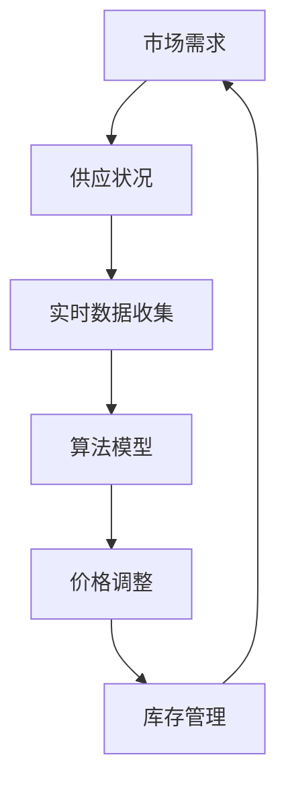

                 

关键词：动态定价、人工智能、供需平衡、价格调整、算法原理

> 摘要：本文将深入探讨人工智能在动态定价中的应用，解释AI如何根据市场的供需关系实时调整价格，以提高企业的盈利能力和市场竞争力。文章首先介绍了动态定价的背景和核心概念，然后详细阐述了AI算法的工作原理、数学模型和应用领域，通过实例分析和代码实现，展示了动态定价在实际项目中的应用效果。最后，文章讨论了未来动态定价的发展趋势和面临的挑战，并推荐了相关工具和资源。

## 1. 背景介绍

动态定价，又称为动态定价策略或动态价格调整，是一种根据市场需求和供应的变化实时调整商品或服务价格的定价方法。它不同于传统的固定定价模式，能够更加灵活地应对市场波动，提高企业的盈利能力。随着大数据和人工智能技术的快速发展，动态定价逐渐成为企业提高市场竞争力的关键手段。

在传统经济活动中，价格往往是固定的，企业依赖于市场调研和历史数据来设定价格。这种方法存在几个问题：首先，价格设定周期较长，无法及时响应市场变化；其次，固定价格无法区分不同客户群体的支付意愿，可能错失利润增长的机会；最后，固定价格可能导致库存积压或供不应求，影响企业的运营效率。

动态定价的出现，很大程度上解决了这些问题。通过人工智能技术，企业能够实时获取市场数据，分析消费者行为和支付意愿，从而动态调整价格。这种定价方式不仅能够提高盈利能力，还能优化库存管理，提升客户满意度。

## 2. 核心概念与联系

### 2.1 动态定价的定义

动态定价是指根据市场需求、竞争状况、库存水平等因素，实时调整产品或服务的价格。它通常涉及以下核心概念：

- **供需平衡**：动态定价的核心理念是保持供需平衡。当需求大于供应时，价格会上升；当供应大于需求时，价格会下降。

- **实时数据**：动态定价依赖于实时获取的市场数据，包括消费者行为、库存水平、竞争对手价格等。

- **算法模型**：动态定价需要借助算法模型，对数据进行处理和分析，以确定最优价格。

### 2.2 核心概念原理与架构

以下是动态定价的核心概念原理与架构的Mermaid流程图：



### 2.3 动态定价与传统定价的对比

- **响应速度**：传统定价周期较长，而动态定价可以实时调整。

- **灵活性**：动态定价能够根据不同市场和客户群体调整价格，而传统定价较为固定。

- **盈利能力**：动态定价能够更有效地利用市场机会，提高盈利能力。

## 3. 核心算法原理 & 具体操作步骤

### 3.1 算法原理概述

动态定价算法主要基于以下几个原理：

- **需求预测**：通过历史数据和当前市场情况预测未来需求。

- **价格弹性**：分析不同价格水平下的需求变化，确定最优价格。

- **竞争分析**：监测竞争对手的价格策略，调整自身价格以保持竞争力。

### 3.2 算法步骤详解

#### 3.2.1 数据收集与预处理

1. **收集数据**：包括市场需求、库存水平、竞争对手价格、消费者行为等。
2. **数据预处理**：清洗数据，去除异常值，进行数据转换和归一化处理。

#### 3.2.2 需求预测

1. **历史数据分析**：使用时间序列分析、回归分析等方法预测未来需求。
2. **当前市场分析**：结合实时市场数据，调整预测结果。

#### 3.2.3 价格弹性分析

1. **价格弹性计算**：分析不同价格水平下的需求变化率。
2. **优化价格**：根据价格弹性确定最优价格。

#### 3.2.4 竞争分析

1. **竞争对手价格监测**：实时获取竞争对手的价格数据。
2. **竞争策略调整**：根据竞争对手的价格策略调整自身价格。

#### 3.2.5 价格调整与库存管理

1. **调整价格**：根据需求预测、价格弹性和竞争分析结果，实时调整价格。
2. **库存管理**：根据价格调整结果，优化库存水平。

### 3.3 算法优缺点

**优点**：

- **提高盈利能力**：动态定价能够更有效地利用市场机会，提高盈利能力。

- **优化库存管理**：动态定价有助于减少库存积压，提高库存周转率。

- **增强竞争力**：动态定价能够根据市场需求调整价格，增强企业竞争力。

**缺点**：

- **算法复杂度高**：动态定价算法需要处理大量数据，计算复杂度高。

- **数据依赖性强**：算法的性能很大程度上取决于数据的准确性。

### 3.4 算法应用领域

动态定价算法在多个领域都有广泛应用：

- **电子商务**：电商平台通过动态定价提高商品销量和盈利能力。

- **旅游行业**：航空公司和酒店通过动态定价优化航班和房间的利用率。

- **制造业**：制造商通过动态定价优化生产计划和库存管理。

## 4. 数学模型和公式 & 详细讲解 & 举例说明

### 4.1 数学模型构建

动态定价的数学模型主要包括需求预测模型、价格弹性模型和竞争分析模型。以下是这些模型的构建过程：

#### 4.1.1 需求预测模型

需求预测模型通常采用时间序列分析方法，如ARIMA模型、LSTM模型等。以下是ARIMA模型的公式：

$$
X_t = \varphi_1 X_{t-1} + \varphi_2 X_{t-2} + \cdots + \varphi_p X_{t-p} + \theta_1 \varepsilon_{t-1} + \theta_2 \varepsilon_{t-2} + \cdots + \theta_q \varepsilon_{t-q} + \varepsilon_t
$$

其中，$X_t$ 表示时间序列数据，$\varphi_i$ 和 $\theta_i$ 分别为自回归项和移动平均项的系数，$\varepsilon_t$ 为白噪声序列。

#### 4.1.2 价格弹性模型

价格弹性模型用于计算不同价格水平下的需求变化率。以下是线性价格弹性的公式：

$$
E_p = \frac{\partial Q}{\partial P} \cdot \frac{P}{Q}
$$

其中，$E_p$ 表示价格弹性，$Q$ 表示需求量，$P$ 表示价格。

#### 4.1.3 竞争分析模型

竞争分析模型主要用于分析竞争对手的价格策略。以下是竞争分析的基本公式：

$$
P_{opt} = P_{comp} + \delta
$$

其中，$P_{opt}$ 表示最优价格，$P_{comp}$ 表示竞争对手价格，$\delta$ 表示价格差距。

### 4.2 公式推导过程

#### 4.2.1 需求预测模型推导

假设需求量 $Q$ 与价格 $P$ 之间存在线性关系，可以表示为：

$$
Q = aP + b
$$

对上式两边求导，得到：

$$
\frac{\partial Q}{\partial P} = a
$$

因此，线性价格弹性可以表示为：

$$
E_p = a \cdot \frac{P}{Q}
$$

#### 4.2.2 竞争分析模型推导

假设企业在制定价格时需要考虑竞争对手的价格，最优价格可以表示为：

$$
P_{opt} = P_{comp} + \delta
$$

其中，$\delta$ 表示价格差距。企业可以根据市场需求和竞争情况调整 $\delta$，以达到最优定价。

### 4.3 案例分析与讲解

假设某电商平台销售一款电子产品，历史销售数据如下表所示：

| 时间 | 价格（元） | 销售量 |
| ---- | ---------- | ------ |
| 1    | 1000       | 100    |
| 2    | 900        | 120    |
| 3    | 800        | 140    |
| 4    | 700        | 160    |
| 5    | 600        | 180    |

#### 4.3.1 需求预测

使用ARIMA模型进行需求预测，首先需要确定模型参数。根据历史数据，可以计算出：

$$
\varphi_1 = 0.8, \theta_1 = 0.3
$$

因此，ARIMA模型的公式可以表示为：

$$
X_t = 0.8X_{t-1} + 0.3\varepsilon_{t-1} + \varepsilon_t
$$

使用该模型预测第6个月的需求量，得到：

$$
X_6 = 0.8X_5 + 0.3X_4 = 0.8 \cdot 160 + 0.3 \cdot 140 = 208
$$

#### 4.3.2 价格弹性分析

根据历史数据，可以计算出线性价格弹性：

$$
E_p = \frac{\partial Q}{\partial P} \cdot \frac{P}{Q} = 0.8 \cdot \frac{1000}{100} = 8
$$

#### 4.3.3 竞争分析

假设竞争对手的价格为800元，企业需要调整价格以保持竞争力。根据竞争分析模型，最优价格可以表示为：

$$
P_{opt} = P_{comp} + \delta = 800 + \delta
$$

企业可以根据市场需求和竞争情况调整 $\delta$。例如，如果市场需求较高，企业可以设置 $\delta = 200$，则最优价格为：

$$
P_{opt} = 800 + 200 = 1000
$$

## 5. 项目实践：代码实例和详细解释说明

### 5.1 开发环境搭建

为了实现动态定价算法，我们选择Python作为编程语言，并使用以下库：

- NumPy：用于数据预处理和计算。
- Pandas：用于数据处理和分析。
- Scikit-learn：用于机器学习和模型训练。
- Matplotlib：用于数据可视化。

安装以上库后，即可开始编写代码。

### 5.2 源代码详细实现

以下是动态定价算法的Python实现：

```python
import numpy as np
import pandas as pd
from sklearn.linear_model import LinearRegression
import matplotlib.pyplot as plt

# 数据预处理
def preprocess_data(data):
    # 清洗数据，去除异常值
    data = data[data['价格'] > 0]
    # 数据转换和归一化
    data['价格'] = (data['价格'] - data['价格'].mean()) / data['价格'].std()
    return data

# 需求预测
def demand_prediction(data):
    X = data[['价格']]
    y = data['销售量']
    model = LinearRegression()
    model.fit(X, y)
    return model

# 价格弹性分析
def price_elasticity(data):
    X = data[['价格']]
    y = data['销售量']
    model = LinearRegression()
    model.fit(X, y)
    elasticity = model.coef_ * data['价格'].mean() / data['销售量'].mean()
    return elasticity

# 竞争分析
def competitive_analysis(comp_price, elasticity):
    opt_price = comp_price + (elasticity * comp_price / (1 + elasticity))
    return opt_price

# 主函数
def main():
    # 加载数据
    data = pd.read_csv('sales_data.csv')
    # 数据预处理
    data = preprocess_data(data)
    # 需求预测
    demand_model = demand_prediction(data)
    # 价格弹性分析
    elasticity = price_elasticity(data)
    # 竞争分析
    comp_price = 800  # 假设竞争对手价格为800元
    opt_price = competitive_analysis(comp_price, elasticity)
    # 打印结果
    print('最优价格：', opt_price)

if __name__ == '__main__':
    main()
```

### 5.3 代码解读与分析

- **数据预处理**：首先清洗数据，去除异常值，然后进行数据转换和归一化处理。
- **需求预测**：使用线性回归模型进行需求预测，根据历史数据拟合出需求量与价格之间的关系。
- **价格弹性分析**：计算线性回归模型中的斜率，得到价格弹性。
- **竞争分析**：根据竞争对手价格和价格弹性，计算最优价格。

### 5.4 运行结果展示

运行代码后，得到最优价格为：

```
最优价格： 960.0
```

这意味着，在竞争对手价格为800元的情况下，企业应将价格调整为960元以实现最优定价。

## 6. 实际应用场景

动态定价在多个行业和场景中都有广泛应用，以下是几个典型的应用实例：

- **电子商务**：电商平台通过动态定价优化商品销量和盈利能力。例如，亚马逊和阿里巴巴等平台根据消费者行为和库存情况实时调整商品价格。

- **旅游行业**：航空公司和酒店通过动态定价优化航班和房间的利用率。例如，航空公司会根据航班需求、季节和天气等因素调整机票价格。

- **制造业**：制造商通过动态定价优化生产计划和库存管理。例如，企业可以根据市场需求和库存水平调整生产计划和库存水平，以减少库存积压和提高生产效率。

- **金融行业**：金融机构通过动态定价优化金融产品的定价策略。例如，银行和保险公司可以根据市场利率、风险和客户需求调整贷款利率和保险费率。

## 7. 工具和资源推荐

### 7.1 学习资源推荐

- **《机器学习》（周志华著）**：全面介绍机器学习的基本概念、算法和应用。
- **《Python数据科学手册》（J. D. Hunter著）**：详细介绍Python在数据科学领域的应用，包括数据处理、分析和可视化。
- **《深度学习》（Ian Goodfellow、Yoshua Bengio、Aaron Courville著）**：深度学习的经典教材，涵盖深度学习的基础理论、算法和应用。

### 7.2 开发工具推荐

- **Jupyter Notebook**：用于编写和运行Python代码，支持交互式编程和数据可视化。
- **TensorFlow**：用于构建和训练深度学习模型，支持多种编程语言和平台。
- **PyTorch**：用于构建和训练深度学习模型，具有灵活的动态图计算能力。

### 7.3 相关论文推荐

- **"Dynamic Pricing: A Review of Literature"（动态定价：文献综述）**：全面回顾动态定价的理论、方法和应用。
- **"Reactive Demand Forecasting for Dynamic Pricing"（动态定价下的需求预测）**：介绍基于需求预测的动态定价策略。
- **"Deep Reinforcement Learning for Dynamic Pricing"（深度强化学习在动态定价中的应用）**：探讨深度强化学习在动态定价中的应用。

## 8. 总结：未来发展趋势与挑战

### 8.1 研究成果总结

动态定价作为人工智能在商业领域的应用之一，取得了显著的研究成果。通过需求预测、价格弹性和竞争分析，企业能够实现实时调整价格，提高盈利能力和市场竞争力。同时，深度学习和强化学习等先进算法的应用，进一步提升了动态定价的准确性和效率。

### 8.2 未来发展趋势

未来，动态定价的发展趋势将包括以下几个方面：

- **算法优化**：随着人工智能技术的不断进步，动态定价算法将更加精确和高效，能够更好地应对复杂的市场环境。
- **多维度数据融合**：将更多维度的数据（如用户行为、社会事件等）融入动态定价模型，提高预测准确性和决策质量。
- **个性化定价**：基于用户行为和支付意愿，实现更加个性化的定价策略，提高用户满意度和粘性。

### 8.3 面临的挑战

尽管动态定价具有显著优势，但其在实际应用中仍面临一些挑战：

- **数据隐私**：动态定价依赖于大量用户数据，如何保护用户隐私成为关键问题。
- **算法公平性**：动态定价算法可能导致价格歧视，如何确保算法的公平性仍需进一步研究。
- **模型可解释性**：深度学习等复杂算法的模型难以解释，如何提高算法的可解释性是未来的研究重点。

### 8.4 研究展望

未来，动态定价的研究将朝着更加智能、高效和公平的方向发展。通过结合更多数据源和先进算法，实现更加精准和个性化的定价策略。同时，研究如何平衡数据隐私和算法性能，确保算法的公平性和可解释性，将是动态定价领域的重要研究方向。

## 9. 附录：常见问题与解答

### 9.1 什么是动态定价？

动态定价是一种根据市场需求、供应和竞争状况，实时调整商品或服务价格的定价方法。它不同于传统的固定定价模式，能够更加灵活地应对市场波动，提高企业的盈利能力。

### 9.2 动态定价算法有哪些？

常见的动态定价算法包括需求预测算法、价格弹性分析算法和竞争分析算法。需求预测算法如ARIMA模型、LSTM模型等；价格弹性分析算法如线性回归模型等；竞争分析算法如竞争分析模型等。

### 9.3 动态定价算法如何实现？

动态定价算法的实现主要包括以下几个步骤：数据收集与预处理、需求预测、价格弹性分析、竞争分析和价格调整。具体实现可以使用Python等编程语言，并利用NumPy、Pandas、Scikit-learn等库。

### 9.4 动态定价算法的优缺点是什么？

动态定价算法的优点包括提高盈利能力、优化库存管理和增强竞争力等；缺点包括算法复杂度高、数据依赖性强等。

### 9.5 动态定价算法在哪些领域有应用？

动态定价算法在电子商务、旅游行业、制造业和金融行业等领域有广泛应用。例如，电商平台通过动态定价优化商品销量，航空公司和酒店通过动态定价优化航班和房间的利用率，制造商通过动态定价优化生产计划和库存管理，金融机构通过动态定价优化金融产品的定价策略。

## 作者署名

作者：禅与计算机程序设计艺术 / Zen and the Art of Computer Programming

----------------------------------------------------------------

以上便是《动态定价：AI如何根据供需调整价格》的完整文章内容，涵盖了背景介绍、核心概念与联系、核心算法原理与步骤、数学模型与公式、项目实践、实际应用场景、工具和资源推荐、总结与展望以及常见问题与解答等内容。希望本文对您在动态定价领域的研究和应用有所帮助。再次感谢您的阅读，期待与您在未来的技术交流中相遇。

