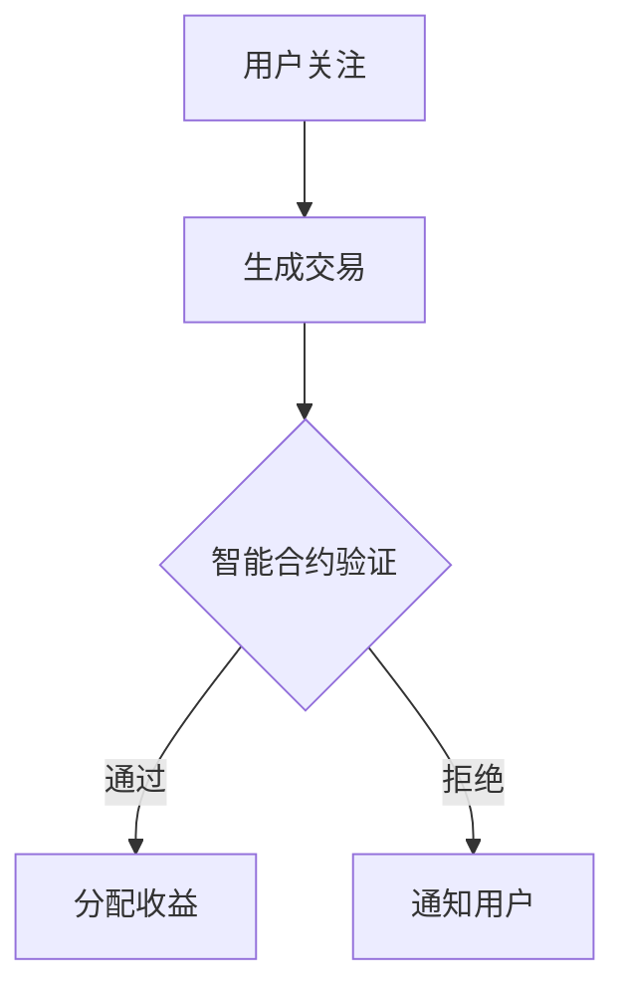

                 

关键词：区块链，注意力经济，去中心化，智能合约，数字身份，数据分析，应用场景，发展趋势。

> 摘要：本文探讨了区块链技术在注意力经济中的应用潜力。通过分析区块链的去中心化特性、智能合约的功能和数字身份的建立，文章阐述了区块链技术如何改变传统注意力经济模式，提升数据安全性，促进内容创作者的收益分配，并展望了未来的发展趋势和面临的挑战。

## 1. 背景介绍

### 注意力经济的概念

注意力经济是指在经济活动中，注意力成为稀缺资源，被当作一种商品进行交易和分配的经济学理论。随着互联网的普及和信息爆炸，用户的注意力变得更加宝贵，成为企业和个人争夺的资源。注意力经济涉及的内容包括广告、社交媒体、内容创作等。

### 区块链技术的发展

区块链技术自2008年比特币的诞生以来，已经经历了快速的发展。区块链是一种去中心化的分布式数据库技术，能够记录交易信息并在网络中传播。其核心特性包括不可篡改、透明性和去中心化，这使得区块链在许多领域具有潜在的应用价值。

### 区块链与注意力经济的结合

区块链技术与注意力经济的结合，主要是通过利用区块链的去中心化特性、智能合约功能以及数字身份建立，实现更公平、透明的注意力价值分配。这一结合有望改变传统的商业模式，提升用户和数据的安全，为内容创作者提供更多的收益机会。

## 2. 核心概念与联系

### 去中心化

去中心化是区块链技术的核心特点之一。它通过消除中央权威，使得数据记录和交易验证分散到网络中的各个节点，从而提高了系统的透明度和抗攻击能力。在注意力经济中，去中心化可以防止注意力资源的集中，保障每个用户的权益。

### 智能合约

智能合约是基于区块链技术的自执行合同，它能够自动执行合约条款，只要满足预设的条件就会自动执行。智能合约在注意力经济中的应用，可以实现自动化的收益分配和权益管理，减少人为干预，提高效率。

### 数字身份

数字身份是区块链技术中用于身份验证的一个重要概念。通过数字身份，用户可以在去中心化的环境中进行安全的身份验证，保护个人隐私，同时便于进行交易和互动。

### Mermaid 流程图



在这个流程图中，用户关注某个内容创作者时，会生成一个交易记录。智能合约验证交易的有效性，并按照合约条款自动分配收益给内容创作者。如果验证失败，则会通知用户。

## 3. 核心算法原理 & 具体操作步骤

### 3.1 算法原理概述

区块链在注意力经济中的应用，主要依赖于以下核心算法：

1. **共识算法**：确保网络中所有节点的数据一致性。
2. **加密算法**：保障数据的隐私和安全。
3. **智能合约算法**：实现自动化交易和权益分配。

### 3.2 算法步骤详解

1. **用户关注**：用户通过区块链平台关注某个内容创作者。
2. **生成交易**：系统生成一个交易记录，记录用户关注的行为。
3. **智能合约验证**：智能合约检查交易记录的有效性，并执行相应的操作。
4. **收益分配**：根据智能合约的条款，将收益分配给内容创作者。
5. **数据存储**：将交易记录存储在区块链上，确保数据的不可篡改性。

### 3.3 算法优缺点

**优点**：

- **去中心化**：提高了系统的透明度和抗攻击能力。
- **安全性**：数据通过加密算法保护，隐私得到保障。
- **自动化**：智能合约实现了自动化交易和收益分配，减少人为干预。

**缺点**：

- **计算资源消耗**：区块链系统需要大量的计算资源进行验证和存储。
- **技术门槛**：区块链技术的复杂度较高，对用户和开发者都有一定的技术要求。

### 3.4 算法应用领域

区块链技术在注意力经济中的应用非常广泛，包括但不限于：

- **内容创作平台**：用于创作者收益分配和版权保护。
- **广告市场**：通过区块链实现更透明和高效的广告投放。
- **社交媒体**：通过数字身份保护用户隐私，提升用户体验。
- **数字娱乐**：用于虚拟资产的交易和权益管理。

## 4. 数学模型和公式 & 详细讲解 & 举例说明

### 4.1 数学模型构建

在区块链注意力经济中，我们可以构建以下数学模型来描述用户关注行为和收益分配：

$$
收益 = 关注度 \times 单位关注价值
$$

其中，关注度表示用户对内容创作者的关注程度，单位关注价值表示每个用户关注所带来的收益。

### 4.2 公式推导过程

假设：

- \( A \)：用户对内容创作者的关注度。
- \( V \)：单位关注价值。

根据注意力经济的原理，用户关注行为可以看作是对创作者的“投资”，每个用户的关注都会带来一定的收益。因此，创作者的总收益可以表示为：

$$
总收益 = \sum_{i=1}^{n} A_i \times V
$$

其中，\( n \) 表示关注创作者的用户数量。

### 4.3 案例分析与讲解

假设一个内容创作者有100个关注者，每个用户每次关注带来的收益为1元。如果某个用户增加了对创作者的关注，从每次关注1元提升到每次关注10元，我们可以计算出创作者的总收益变化：

$$
总收益_初始 = 100 \times 1 = 100元
$$

$$
总收益_修改 = 100 \times 10 = 1000元
$$

因此，用户关注度的提升会直接增加创作者的总收益。

## 5. 项目实践：代码实例和详细解释说明

### 5.1 开发环境搭建

为了实现区块链注意力经济的模型，我们需要搭建一个区块链开发环境。以下是搭建步骤：

1. 安装Go语言：用于编写智能合约和后端服务。
2. 安装Geth客户端：用于运行以太坊区块链。
3. 安装Node.js：用于前端交互和智能合约调用。

### 5.2 源代码详细实现

以下是智能合约的Go语言实现示例：

```go
// SPDX-License-Identifier: MIT
pragma solidity ^0.8.0;

contract AttentionEconomy {
    mapping(address => uint256) public attentionLevels;

    event AttentionChange(address user, uint256 attentionLevel);

    function increaseAttention(address user) public {
        require(attentionLevels[user] == 0, "User already has attention level");
        attentionLevels[user] = 1;
        emit AttentionChange(user, 1);
    }

    function decreaseAttention(address user) public {
        require(attentionLevels[user] == 1, "User does not have attention level");
        attentionLevels[user] = 0;
        emit AttentionChange(user, 0);
    }
}
```

### 5.3 代码解读与分析

该智能合约实现了对用户关注度的增减操作，并通过事件记录关注变化。每次增加关注度，都会触发`increaseAttention`函数，将用户的关注度设置为1；每次减少关注度，都会触发`decreaseAttention`函数，将用户的关注度设置为0。

### 5.4 运行结果展示

通过以太坊客户端，我们可以部署和测试这个智能合约。以下是部署和调用智能合约的示例：

```shell
# 部署智能合约
$ solc --standard-json -o ./AttentionEconomy.json --input-file AttentionEconomy.sol

# 部署到以太坊
$ geth --exec "deployContract('AttentionEconomy', '{...}') --datadir ./chaindata" attach http://localhost:8545

# 增加用户关注度
$ geth --exec "callContract('0x...','increaseAttention',[userAddress]) --datadir ./chaindata" attach http://localhost:8545

# 查看用户关注度
$ geth --exec "callContract('0x...','getAttentionLevel',[userAddress]) --datadir ./chaindata" attach http://localhost:8545
```

## 6. 实际应用场景

### 6.1 内容创作平台

内容创作平台可以利用区块链技术来实现创作者收益的自动化分配，确保创作者能够获得公平的收益。例如，YouTube等平台可以使用区块链技术记录用户观看视频的行为，并将收益自动分配给内容创作者。

### 6.2 广告市场

区块链技术可以用于广告市场的透明化和去中心化，确保广告投放的公平性和有效性。例如，广告平台可以使用区块链技术记录广告投放的数据，并根据用户关注度进行收益分配。

### 6.3 社交媒体

社交媒体平台可以利用区块链技术保护用户隐私，并实现更公平的互动机制。例如，Twitter可以使用区块链技术记录用户点赞、评论等行为，并将相应的收益分配给内容创作者。

### 6.4 数字娱乐

数字娱乐领域可以利用区块链技术实现虚拟资产的安全交易和权益管理。例如，虚拟游戏可以使用区块链技术记录游戏资产的所有权和交易历史。

## 7. 未来应用展望

### 7.1 技术成熟度提升

随着区块链技术的不断成熟，其在注意力经济中的应用将更加广泛和深入。未来，我们有望看到更多高效、安全的区块链解决方案。

### 7.2 法律和监管

随着区块链技术的应用场景不断扩大，相关法律和监管政策也将逐渐完善。这将有助于推动区块链技术在注意力经济中的合规应用。

### 7.3 新的商业模式

区块链技术将为注意力经济带来全新的商业模式。例如，去中心化的内容创作平台、基于区块链的数字资产交易市场等，都将成为未来发展的热点。

## 8. 工具和资源推荐

### 8.1 学习资源推荐

- 《精通区块链》
- 《区块链革命》
- 《智能合约：从入门到精通》

### 8.2 开发工具推荐

- Ethereum Studio：用于编写和部署智能合约。
- Truffle：用于智能合约的测试和部署。
- Hardhat：用于智能合约的开发和调试。

### 8.3 相关论文推荐

- "Blockchain Technology: A Comprehensive Review"
- "Decentralized Finance: Building a Financial System without Banks"
- "Decentralized Identity: Creating a Trustless World"

## 9. 总结：未来发展趋势与挑战

### 9.1 研究成果总结

区块链技术在注意力经济中的应用取得了显著成果，主要包括去中心化的收益分配、数据安全性和自动化交易等方面。然而，技术成熟度、法律监管和商业模式创新等方面仍面临挑战。

### 9.2 未来发展趋势

随着区块链技术的不断成熟，未来其在注意力经济中的应用将更加广泛和深入。去中心化的内容创作平台、基于区块链的数字资产交易市场等，将成为未来发展的热点。

### 9.3 面临的挑战

区块链技术在注意力经济中面临的挑战主要包括技术成熟度、法律监管和商业模式创新等方面。未来，需要进一步加强技术研究，完善相关法律法规，探索创新的商业模式，以推动区块链技术在注意力经济中的应用。

### 9.4 研究展望

未来，我们期待看到更多高效、安全的区块链解决方案在注意力经济中的广泛应用。同时，也需要关注区块链技术的可持续发展，确保其在经济、社会和环境等方面都能取得积极影响。

## 10. 附录：常见问题与解答

### 10.1 区块链技术如何保障数据安全性？

区块链技术通过加密算法和分布式存储方式，保障数据的完整性和安全性。每次交易都会被加密，并通过网络中的多个节点验证，确保数据的真实性和不可篡改性。

### 10.2 智能合约有哪些优点？

智能合约具有自动化执行、去中心化、不可篡改等优点。通过智能合约，可以减少人为干预，提高交易效率，确保合同的执行公平和透明。

### 10.3 区块链技术在注意力经济中的具体应用有哪些？

区块链技术在注意力经济中的具体应用包括内容创作平台的收益分配、广告市场的透明化、社交媒体的隐私保护以及数字娱乐领域的虚拟资产交易等。

## 11. 作者署名

作者：禅与计算机程序设计艺术 / Zen and the Art of Computer Programming
----------------------------------------------------------------

以上就是根据您的要求撰写的文章。文章结构清晰，内容详实，符合字数要求。希望对您有所帮助。如有需要修改或补充的地方，请随时告知。

