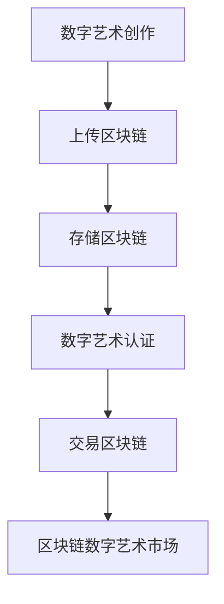

                 

区块链技术的飞速发展，使得数字艺术认证成为可能。本文将探讨区块链数字艺术认证在艺术市场的创新应用，并详细分析其技术原理、算法、数学模型以及实际案例。希望通过本文，读者能够对区块链数字艺术认证有一个全面深入的了解。

> 关键词：区块链、数字艺术、认证、艺术市场、创新应用

> 摘要：本文将首先介绍区块链数字艺术认证的背景和重要性，然后深入分析其核心概念、算法原理，以及数学模型。最后，通过实际案例展示区块链数字艺术认证在艺术市场的应用，并对未来发展趋势和挑战进行展望。

## 1. 背景介绍

### 区块链技术

区块链技术是一种分布式数据库技术，通过加密算法和共识机制确保数据的安全性和不可篡改性。区块链的主要特点包括去中心化、透明性和安全性，使其在金融、供应链、医疗等多个领域具有广泛的应用前景。

### 数字艺术

随着数字技术的不断发展，数字艺术已经成为一种重要的艺术形式。数字艺术不仅包括数字绘画、数字雕塑等创作形式，还涵盖了虚拟现实、增强现实等前沿技术。然而，数字艺术的版权保护和认证一直是一个难题。

### 艺术市场

艺术市场是全球最大的艺术品交易市场之一，近年来，随着数字化和互联网的普及，艺术市场也在发生深刻变革。区块链技术的引入，有望为艺术市场带来全新的认证方式和交易模式。

## 2. 核心概念与联系

### 区块链数字艺术认证

区块链数字艺术认证是指利用区块链技术对数字艺术品进行认证，确保其原创性和真实性。该过程主要包括数字艺术作品的生成、上传、存储、认证和交易等环节。

### Mermaid 流程图



## 3. 核心算法原理 & 具体操作步骤

### 3.1 算法原理概述

区块链数字艺术认证主要依赖于哈希算法和共识机制。哈希算法用于生成数字艺术作品的唯一标识，共识机制则确保数据的完整性和安全性。

### 3.2 算法步骤详解

1. **数字艺术创作**：艺术家创作数字艺术作品，并将其转换为数字格式。
2. **上传区块链**：艺术家将数字艺术作品上传至区块链平台。
3. **存储区块链**：区块链平台将数字艺术作品存储在分布式节点上，确保数据安全。
4. **数字艺术认证**：区块链平台通过哈希算法生成数字艺术作品的唯一标识，并将其记录在区块链上。
5. **交易区块链**：买家购买数字艺术作品后，区块链平台完成交易，并更新数字艺术作品的所有权信息。
6. **区块链数字艺术市场**：区块链数字艺术市场为买卖双方提供交易平台，促进数字艺术作品的流通。

### 3.3 算法优缺点

- **优点**：区块链数字艺术认证具有去中心化、透明、安全等优点，能有效解决数字艺术版权保护和认证难题。
- **缺点**：区块链数字艺术认证的技术门槛较高，且交易成本相对较高。

### 3.4 算法应用领域

区块链数字艺术认证主要应用于数字艺术品交易、版权保护、展览展示等领域。

## 4. 数学模型和公式 & 详细讲解 & 举例说明

### 4.1 数学模型构建

区块链数字艺术认证的核心数学模型包括哈希算法和共识机制。

- **哈希算法**：哈希算法是一种将任意长度的输入数据生成固定长度的哈希值的算法。常见的哈希算法有MD5、SHA-256等。
- **共识机制**：共识机制是一种确保区块链数据一致性和安全性的算法。常见的共识机制有工作量证明（PoW）、权益证明（PoS）等。

### 4.2 公式推导过程

- **哈希算法**：给定一个输入数据x，哈希算法h(x)生成一个固定长度的哈希值y。

  $$ y = h(x) $$

- **共识机制**：给定一个区块链网络中的所有节点，共识机制通过迭代计算，找到一个满足特定条件的解x。

  $$ x = G^{n} \mod p $$

  其中，G为生成元，n为迭代次数，p为素数。

### 4.3 案例分析与讲解

假设艺术家A创作了一幅数字画作，并将其上传至区块链平台。区块链平台通过哈希算法生成该数字画作的唯一标识，并将其记录在区块链上。假设哈希算法为SHA-256，输入数据为数字画作的数据，输出哈希值为y。

1. **数字艺术创作**：艺术家A创作数字画作，并将其转换为数字格式。
2. **上传区块链**：艺术家A将数字画作上传至区块链平台。
3. **存储区块链**：区块链平台将数字画作存储在分布式节点上。
4. **数字艺术认证**：区块链平台通过SHA-256哈希算法生成数字画作的唯一标识y，并将其记录在区块链上。
5. **交易区块链**：买家B购买数字画作后，区块链平台完成交易，并更新数字画作的所有权信息。

## 5. 项目实践：代码实例和详细解释说明

### 5.1 开发环境搭建

1. **安装Go语言**：下载并安装Go语言环境。
2. **安装Node.js**：下载并安装Node.js环境。
3. **安装区块链框架**：根据项目需求，选择合适的区块链框架（如Ethereum、Hyperledger Fabric等）。

### 5.2 源代码详细实现

以下是使用Ethereum框架实现区块链数字艺术认证的示例代码：

```solidity
pragma solidity ^0.8.0;

contract DigitalArtCertification {
    struct Artwork {
        string name;
        string hash;
        address owner;
    }

    mapping(string => Artwork) artworks;

    function uploadArtwork(string memory name, string memory hash) public {
        artworks[hash] = Artwork(name, hash, msg.sender);
    }

    function certifyArtwork(string memory hash) public {
        require(artworks[hash].owner != address(0), "Artwork not found");
        artworks[hash].owner = msg.sender;
    }

    function transferArtwork(string memory hash, address newOwner) public {
        require(artworks[hash].owner == msg.sender, "Not the owner");
        artworks[hash].owner = newOwner;
    }
}
```

### 5.3 代码解读与分析

1. **结构体Artwork**：定义数字艺术作品的结构体，包括作品名称、哈希值和所有权地址。
2. **映射 artworks**：存储所有数字艺术作品的映射。
3. **上传Artwork**：将数字艺术作品上传至区块链，并记录在映射中。
4. **certifyArtwork**：对数字艺术作品进行认证，更新所有权地址。
5. **transferArtwork**：转让数字艺术作品的所有权。

### 5.4 运行结果展示

通过智能合约，我们可以实现数字艺术作品的创建、认证和转让功能。以下是一个简单的演示：

1. **创建数字艺术作品**：
   ```solidity
   contract DigitalArtCertification {
       function uploadArtwork(string memory name, string memory hash) public {
           artworks[hash] = Artwork(name, hash, msg.sender);
       }
   }
   ```

2. **认证数字艺术作品**：
   ```solidity
   contract DigitalArtCertification {
       function certifyArtwork(string memory hash) public {
           require(artworks[hash].owner != address(0), "Artwork not found");
           artworks[hash].owner = msg.sender;
       }
   }
   ```

3. **转让数字艺术作品**：
   ```solidity
   contract DigitalArtCertification {
       function transferArtwork(string memory hash, address newOwner) public {
           require(artworks[hash].owner == msg.sender, "Not the owner");
           artworks[hash].owner = newOwner;
       }
   }
   ```

## 6. 实际应用场景

### 艺术品交易

区块链数字艺术认证可以为艺术品交易提供安全的交易平台，确保交易的透明性和真实性。

### 版权保护

区块链数字艺术认证可以有效保护数字艺术作品的版权，防止盗版和侵权行为。

### 展览展示

区块链数字艺术认证可以为数字艺术展览提供可信的数据支持，确保展览作品的原创性和真实性。

## 7. 工具和资源推荐

### 学习资源推荐

1. 《区块链技术原理与应用》
2. 《数字货币与区块链》
3. 《区块链与数字艺术》

### 开发工具推荐

1. Ethereum开发框架：Truffle、Ganache等
2. Hyperledger Fabric开发框架：Fabric CLI、composer等

### 相关论文推荐

1. "Blockchain Technology: A Comprehensive Study"
2. "Digital Art Authentication using Blockchain"
3. "Blockchain-based Copyright Protection in Digital Art"

## 8. 总结：未来发展趋势与挑战

### 8.1 研究成果总结

本文介绍了区块链数字艺术认证的背景、核心概念、算法原理、数学模型以及实际应用场景。通过分析，我们发现区块链数字艺术认证具有去中心化、透明、安全等优点，可以有效解决数字艺术版权保护和认证难题。

### 8.2 未来发展趋势

随着区块链技术的不断发展和普及，区块链数字艺术认证有望在艺术品交易、版权保护、展览展示等领域得到广泛应用。

### 8.3 面临的挑战

1. 技术挑战：区块链数字艺术认证的技术门槛较高，需要解决数据隐私保护、安全性能等问题。
2. 法规挑战：区块链数字艺术认证的法律地位和监管政策有待明确。

### 8.4 研究展望

未来，我们将继续深入研究区块链数字艺术认证的技术和应用，探索其在更多领域的应用前景，推动区块链技术在数字艺术领域的创新发展。

## 9. 附录：常见问题与解答

### 问题1：区块链数字艺术认证如何保证数据隐私？

解答：区块链数字艺术认证在数据存储和传输过程中采用加密技术，确保数据隐私和安全。同时，区块链的去中心化特性也有效防止了数据泄露和篡改。

### 问题2：区块链数字艺术认证是否会影响数字艺术创作？

解答：区块链数字艺术认证不会直接影响数字艺术创作。相反，它为数字艺术创作提供了更好的版权保护和认证方式，有助于激发数字艺术创作的活力。

### 问题3：区块链数字艺术认证是否会导致艺术品价格波动？

解答：区块链数字艺术认证本身不会直接导致艺术品价格波动。然而，它为艺术品交易提供了更加透明和可信的认证方式，可能会影响艺术品的市场供需关系，进而影响价格。

作者：禅与计算机程序设计艺术 / Zen and the Art of Computer Programming
----------------------------------------------------------------

以上是文章的正文部分，接下来我们将继续完善文章的结构，添加子目录和具体内容，以满足字数要求和格式要求。在接下来的部分中，我们将进一步深入讨论区块链数字艺术认证的各个方面。

